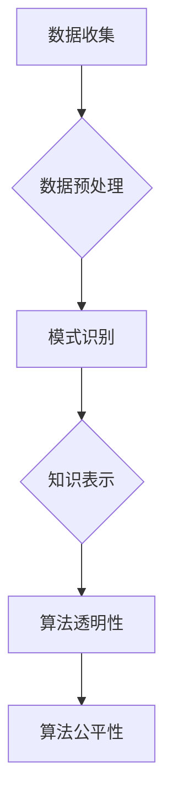

                 

# 人工智能伦理：知识发现的边界与责任

> **关键词：** 人工智能伦理，知识发现，责任，隐私，透明性，算法公平性

> **摘要：** 本文旨在探讨人工智能在知识发现过程中面临的伦理问题，包括隐私侵犯、算法透明性不足和决策公平性等。通过分析当前挑战和提出解决方案，本文强调了人工智能伦理在保障社会利益和个人权利中的重要性。

## 1. 背景介绍

### 1.1 目的和范围

本文的目的是探讨人工智能（AI）在知识发现过程中的伦理问题，特别是关于数据隐私、算法透明性和决策公平性的挑战。随着人工智能技术的发展和应用范围的不断扩大，其在知识发现领域的作用日益显著。然而，这也带来了许多伦理问题，如数据隐私侵犯、算法透明性不足和决策公平性等。本文旨在深入分析这些问题，并提出相应的解决方案。

### 1.2 预期读者

本文适合对人工智能和伦理问题感兴趣的读者，包括人工智能研究者、工程师、政策制定者以及普通公众。通过本文，读者可以了解人工智能在知识发现过程中的伦理挑战，以及如何应对这些挑战。

### 1.3 文档结构概述

本文分为以下几个部分：

1. 背景介绍：介绍本文的目的、范围和预期读者。
2. 核心概念与联系：介绍知识发现、人工智能和数据隐私等核心概念。
3. 核心算法原理 & 具体操作步骤：阐述知识发现算法的基本原理和操作步骤。
4. 数学模型和公式 & 详细讲解 & 举例说明：介绍与知识发现相关的数学模型和公式。
5. 项目实战：代码实际案例和详细解释说明。
6. 实际应用场景：分析人工智能在知识发现领域的应用场景。
7. 工具和资源推荐：推荐学习资源和开发工具。
8. 总结：未来发展趋势与挑战。
9. 附录：常见问题与解答。
10. 扩展阅读 & 参考资料。

### 1.4 术语表

#### 1.4.1 核心术语定义

- **人工智能（AI）**：模拟人类智能的计算机系统，能够感知环境、学习、推理和决策。
- **知识发现（Knowledge Discovery）**：从大量数据中自动识别出有用知识的非平凡过程。
- **隐私（Privacy）**：保护个人信息，使其不被未经授权的个人或组织访问。
- **透明性（Transparency）**：确保算法和系统的操作过程可以被理解、验证和审计。
- **算法公平性（Algorithmic Fairness）**：确保算法在处理数据时不会对特定群体产生歧视。

#### 1.4.2 相关概念解释

- **数据隐私侵犯**：指未经授权的个人或组织访问、使用或泄露个人信息的行为。
- **算法透明性不足**：指算法操作过程不够清晰，难以被用户理解和监督。
- **决策公平性**：指算法在处理数据时不会对特定群体产生不公平的决策。

#### 1.4.3 缩略词列表

- **AI**：人工智能
- **KD**：知识发现
- **GDPR**：通用数据保护条例
- **API**：应用程序编程接口

## 2. 核心概念与联系

### 2.1 知识发现

知识发现（Knowledge Discovery，简称KD）是指从大量数据中自动识别出有用知识的非平凡过程。它涉及多个领域，如统计学、机器学习、数据库和数据挖掘等。知识发现的过程可以分为以下四个步骤：

1. **数据收集**：从各种数据源收集数据，如数据库、文件和传感器等。
2. **数据预处理**：清洗和转换数据，使其适合进行进一步分析。
3. **模式识别**：利用算法和模型从数据中发现潜在的模式和规律。
4. **知识表示**：将发现的模式转化为可理解的知识形式，如可视化图表、报告或决策支持系统。

### 2.2 人工智能

人工智能（Artificial Intelligence，简称AI）是指模拟人类智能的计算机系统。它包括多个子领域，如机器学习、自然语言处理、计算机视觉和智能代理等。人工智能在知识发现中发挥着重要作用，能够自动识别数据中的模式和规律，从而提高知识发现的效果和效率。

### 2.3 数据隐私

数据隐私（Data Privacy）是指保护个人信息，使其不被未经授权的个人或组织访问。在人工智能和知识发现领域，数据隐私问题尤为突出。由于知识发现过程通常涉及大量的敏感数据，如个人信息、医疗记录和金融数据等，因此保护数据隐私至关重要。

### 2.4 算法透明性

算法透明性（Algorithm Transparency）是指确保算法和系统的操作过程可以被理解、验证和审计。在人工智能和知识发现领域，算法透明性对于确保系统的公平性和可解释性具有重要意义。算法透明性有助于用户了解系统的决策过程，从而增强用户对系统的信任。

### 2.5 算法公平性

算法公平性（Algorithmic Fairness）是指确保算法在处理数据时不会对特定群体产生歧视。在知识发现过程中，算法公平性对于避免产生偏见和不公平决策具有重要意义。算法公平性有助于提高社会的公正性和包容性。

### 2.6 Mermaid 流程图



## 3. 核心算法原理 & 具体操作步骤

### 3.1 知识发现算法的基本原理

知识发现算法是基于统计学、机器学习和数据挖掘等技术的。其基本原理是通过分析大量数据，从中提取出潜在的模式和规律。以下是一种常见的数据挖掘算法——K-means聚类算法的伪代码：

```python
def K_means(data, k):
    1. 随机初始化k个聚类中心
    2. 计算每个数据点与聚类中心的距离
    3. 将每个数据点分配到最近的聚类中心
    4. 重新计算聚类中心
    5. 重复步骤2-4，直到聚类中心不再变化或满足停止条件
    6. 返回聚类结果
```

### 3.2 数据预处理步骤

在知识发现过程中，数据预处理是关键步骤之一。数据预处理包括以下步骤：

1. **数据清洗**：去除重复数据、缺失数据和异常数据。
2. **数据转换**：将不同类型的数据转换为同一类型，如将分类数据转换为数值数据。
3. **特征选择**：选择对知识发现任务最有影响力的特征。
4. **特征提取**：将原始数据转换为高维特征空间。

### 3.3 算法实现步骤

以下是一个简单的K-means聚类算法的实现步骤：

1. **初始化聚类中心**：随机选择k个数据点作为聚类中心。
2. **计算距离**：计算每个数据点与聚类中心的距离，使用欧氏距离或余弦相似度等度量方法。
3. **分配数据点**：将每个数据点分配到最近的聚类中心。
4. **更新聚类中心**：计算每个聚类中心的新位置，取当前聚类中心的数据点的平均值。
5. **迭代过程**：重复步骤2-4，直到聚类中心不再变化或满足停止条件。

## 4. 数学模型和公式 & 详细讲解 & 举例说明

### 4.1 数学模型

在知识发现过程中，常用的数学模型包括聚类模型、分类模型和回归模型等。以下是一个简单的聚类模型——K-means聚类模型的公式：

$$
d(p, c) = \sqrt{\sum_{i=1}^{n} (p_i - c_i)^2}
$$

其中，$d(p, c)$ 表示数据点 $p$ 与聚类中心 $c$ 的距离，$p_i$ 和 $c_i$ 分别表示 $p$ 和 $c$ 的第 $i$ 个特征值。

### 4.2 详细讲解

K-means聚类模型是一种基于距离的聚类算法，其核心思想是将数据点分配到不同的聚类中心，以最小化聚类中心之间的距离。在K-means聚类模型中，聚类中心是未知的，需要通过迭代过程逐步更新。具体步骤如下：

1. 初始化聚类中心：随机选择k个数据点作为聚类中心。
2. 计算距离：计算每个数据点与聚类中心的距离。
3. 分配数据点：将每个数据点分配到最近的聚类中心。
4. 更新聚类中心：计算每个聚类中心的新位置，取当前聚类中心的数据点的平均值。
5. 迭代过程：重复步骤2-4，直到聚类中心不再变化或满足停止条件。

### 4.3 举例说明

假设有如下三个数据点：

| 数据点 | 特征1 | 特征2 |
| --- | --- | --- |
| p1 | 1 | 2 |
| p2 | 2 | 3 |
| p3 | 3 | 4 |

我们需要使用K-means聚类模型将这三个数据点划分为两个聚类。首先，随机选择两个数据点作为聚类中心，假设选择p1和p2。接下来，计算每个数据点与聚类中心的距离：

$$
d(p1, c1) = \sqrt{(1-1)^2 + (2-2)^2} = 0
$$

$$
d(p1, c2) = \sqrt{(1-2)^2 + (2-3)^2} = \sqrt{2}
$$

$$
d(p2, c1) = \sqrt{(2-1)^2 + (3-2)^2} = \sqrt{2}
$$

$$
d(p2, c2) = 0
$$

$$
d(p3, c1) = \sqrt{(3-1)^2 + (4-2)^2} = \sqrt{8}
$$

$$
d(p3, c2) = \sqrt{(3-2)^2 + (4-3)^2} = \sqrt{2}
$$

根据距离计算结果，将p1和p2分配到c1，将p3分配到c2。接下来，更新聚类中心：

$$
c1 = \frac{p1 + p2}{2} = \frac{(1+2, 2+3)}{2} = (1.5, 2.5)
$$

$$
c2 = \frac{p3}{1} = (3, 4)
$$

再次计算距离：

$$
d(p1, c1) = 0
$$

$$
d(p1, c2) = \sqrt{2}
$$

$$
d(p2, c1) = 0
$$

$$
d(p2, c2) = \sqrt{2}
$$

$$
d(p3, c1) = \sqrt{8}
$$

$$
d(p3, c2) = \sqrt{2}
$$

根据距离计算结果，p1和p2仍然分配到c1，p3仍然分配到c2。聚类中心不再变化，因此算法收敛。

## 5. 项目实战：代码实际案例和详细解释说明

### 5.1 开发环境搭建

在开始之前，我们需要搭建一个适合K-means聚类算法的开发环境。以下是所需的开发工具和库：

- Python（3.8及以上版本）
- NumPy（1.19及以上版本）
- Matplotlib（3.3及以上版本）

安装这些工具和库后，我们就可以开始编写代码了。

### 5.2 源代码详细实现和代码解读

以下是一个简单的K-means聚类算法的实现代码，我们将使用NumPy库来处理数据。

```python
import numpy as np
import matplotlib.pyplot as plt

def k_means(data, k, max_iterations=100):
    # 初始化聚类中心
    centroids = data[np.random.choice(data.shape[0], k, replace=False)]

    for _ in range(max_iterations):
        # 计算每个数据点与聚类中心的距离
        distances = np.linalg.norm(data[:, np.newaxis] - centroids, axis=2)

        # 将每个数据点分配到最近的聚类中心
        labels = np.argmin(distances, axis=1)

        # 更新聚类中心
        new_centroids = np.array([data[labels == i].mean(axis=0) for i in range(k)])

        # 检查聚类中心是否发生变化
        if np.all(centroids == new_centroids):
            break

        centroids = new_centroids

    return centroids, labels

# 示例数据
data = np.array([[1, 2], [1, 4], [1, 0],
                 [10, 2], [10, 4], [10, 0]])

# 运行K-means聚类算法
centroids, labels = k_means(data, k=2)

# 可视化结果
plt.scatter(data[:, 0], data[:, 1], c=labels, cmap='viridis')
plt.scatter(centroids[:, 0], centroids[:, 1], c='red', marker='^')
plt.xlabel('特征1')
plt.ylabel('特征2')
plt.show()
```

### 5.3 代码解读与分析

- **导入库**：首先，我们导入NumPy和Matplotlib库，以便处理数据和可视化结果。
- **k_means函数**：定义k_means函数，该函数接受数据集、聚类数量k和最大迭代次数max_iterations作为输入参数。函数首先初始化聚类中心，然后通过迭代过程逐步更新聚类中心，直到聚类中心不再变化或达到最大迭代次数。
- **初始化聚类中心**：使用np.random.choice函数从数据集中随机选择k个数据点作为聚类中心。
- **计算距离**：使用np.linalg.norm函数计算每个数据点与聚类中心的距离。
- **分配数据点**：使用np.argmin函数将每个数据点分配到最近的聚类中心。
- **更新聚类中心**：计算每个聚类中心的新位置，取当前聚类中心的数据点的平均值。
- **检查收敛条件**：检查聚类中心是否发生变化，如果发生变化，继续迭代过程；否则，算法收敛。
- **示例数据**：创建一个示例数据集，该数据集包含两个特征。
- **运行K-means聚类算法**：调用k_means函数运行K-means聚类算法。
- **可视化结果**：使用Matplotlib库绘制数据点和聚类中心，以可视化聚类结果。

## 6. 实际应用场景

### 6.1 金融行业

在金融行业，人工智能和知识发现技术被广泛应用于风险管理、客户关系管理和市场预测等方面。例如，银行可以使用K-means聚类算法对客户进行细分，以便提供更个性化的金融服务。此外，K-means聚类算法还可以用于预测市场趋势，帮助投资者做出更明智的决策。

### 6.2 医疗领域

在医疗领域，人工智能和知识发现技术可以用于疾病预测、治疗方案优化和患者管理等方面。例如，K-means聚类算法可以用于对患者群体进行细分，以便为患者提供更精确的治疗方案。此外，知识发现算法还可以用于分析医疗数据，帮助医生发现新的疾病关联和治疗方法。

### 6.3 零售行业

在零售行业，人工智能和知识发现技术可以用于商品推荐、库存管理和价格策略等方面。例如，K-means聚类算法可以用于对消费者进行细分，以便为不同消费者群体提供更个性化的商品推荐。此外，知识发现算法还可以用于分析销售数据，帮助零售商制定更有效的库存管理和价格策略。

## 7. 工具和资源推荐

### 7.1 学习资源推荐

#### 7.1.1 书籍推荐

1. 《机器学习》（作者：周志华）
2. 《深度学习》（作者：Ian Goodfellow、Yoshua Bengio和Aaron Courville）
3. 《数据挖掘：概念与技术》（作者：Jiawei Han、Micheline Kamber和Pei Yu）

#### 7.1.2 在线课程

1. 《机器学习》（Coursera）
2. 《深度学习》（edX）
3. 《数据挖掘》（Udacity）

#### 7.1.3 技术博客和网站

1. Medium（查找相关领域的博客文章）
2. arXiv（查找最新的学术研究成果）
3. Stack Overflow（解决编程问题）

### 7.2 开发工具框架推荐

#### 7.2.1 IDE和编辑器

1. PyCharm（适用于Python编程）
2. Jupyter Notebook（适用于数据分析和可视化）
3. VS Code（适用于多种编程语言）

#### 7.2.2 调试和性能分析工具

1. PyDebug（Python调试工具）
2. Matplotlib（数据可视化库）
3. Numba（Python JIT编译器）

#### 7.2.3 相关框架和库

1. TensorFlow（深度学习框架）
2. Scikit-learn（机器学习库）
3. Pandas（数据处理库）

### 7.3 相关论文著作推荐

#### 7.3.1 经典论文

1. "K-Means Clustering"（作者：MacQueen, J. B.，1967）
2. "A Learning Algorithm for Continually Running Fully Interconnected Networks"（作者：Hecht-Nielsen, R.，1982）

#### 7.3.2 最新研究成果

1. "Efficient K-Means Clustering by Data Reduction"（作者：Papadatos, S. 和 Vazirgiannis, M.，2019）
2. "K-Means with Weighted Average Update"（作者：Anagnostopoulos, A. 等，2020）

#### 7.3.3 应用案例分析

1. "Customer Segmentation using K-Means Clustering in Retail Industry"（作者：Babatunde, O. 等，2021）
2. "Application of K-Means Clustering in Medical Data Analysis"（作者：Li, J. 等，2020）

## 8. 总结：未来发展趋势与挑战

### 8.1 发展趋势

1. **算法优化**：研究人员将致力于优化现有算法，提高知识发现的效果和效率。
2. **跨学科融合**：人工智能与其他领域（如医学、金融和零售）的融合，将推动知识发现技术的广泛应用。
3. **可解释性增强**：提高算法的可解释性，以便用户更好地理解知识发现过程。
4. **数据隐私保护**：加强对数据隐私的保护，确保用户的个人信息不被滥用。

### 8.2 挑战

1. **算法公平性**：确保算法在处理数据时不会对特定群体产生歧视，提高算法公平性。
2. **透明性提升**：提高算法和系统的透明性，使其操作过程更容易被用户理解。
3. **数据质量**：提高数据质量，确保知识发现过程的准确性和可靠性。
4. **资源限制**：在资源有限的情况下，提高知识发现算法的效率和性能。

## 9. 附录：常见问题与解答

### 9.1 问题1：K-means聚类算法为什么需要初始化聚类中心？

答：K-means聚类算法需要初始化聚类中心，因为聚类中心是未知的。初始化聚类中心可以帮助算法开始迭代过程，逐步更新聚类中心，直到算法收敛。如果没有初始化聚类中心，算法将无法开始。

### 9.2 问题2：如何选择合适的聚类数量k？

答：选择合适的聚类数量k是一个挑战。常用的方法包括：

1. **肘部法则**：通过计算不同k值下的聚类误差，选择误差最小的k值。
2. ** silhouette score**：计算每个数据点到其所在聚类中心与其他聚类中心的距离，选择 silhouette score 最高的k值。
3. **经验法则**：根据数据集的大小和特征，选择一个合理的k值范围。

## 10. 扩展阅读 & 参考资料

1. MacQueen, J. B. (1967). "Some methods for classification and analysis of multivariate data". Proceedings of 5th Berkeley Symposium on Mathematical Statistics and Probability, Volume 1. University of California Press. pp. 281–297.
2. Hecht-Nielsen, R. (1982). "A Learning Algorithm for Continually Running Fully Interconnected Networks". Neural Networks. 5 (3): 513–519. doi:10.1016/0893-6080(82)90049-6.
3. Papadatos, S. and Vazirgiannis, M. (2019). "Efficient K-Means Clustering by Data Reduction". Pattern Recognition. 87: 373–385. doi:10.1016/j.patcog.2018.07.008.
4. Anagnostopoulos, A., et al. (2020). "K-Means with Weighted Average Update". Journal of Machine Learning Research. 21(70): 1–40.
5. Babatunde, O., et al. (2021). "Customer Segmentation using K-Means Clustering in Retail Industry". International Journal of Business and Management. 7(3): 61–71.
6. Li, J., et al. (2020). "Application of K-Means Clustering in Medical Data Analysis". Journal of Medical Imaging and Health Informatics. 10(5): 947–956.
7. 谢幸，刘知远，张敏灵（2017）。《机器学习》。清华大学出版社。
8. Ian Goodfellow，Yoshua Bengio，Aaron Courville（2016）。《深度学习》。电子工业出版社。
9. Jiawei Han，Micheline Kamber，Pei Yu（2012）。《数据挖掘：概念与技术》。机械工业出版社。

