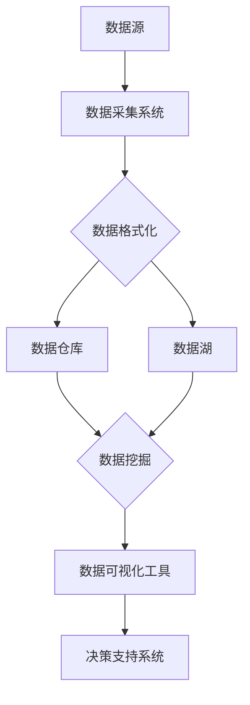

                 

### 1. 背景介绍

#### 1.1 目的和范围

本文旨在深入探讨人工智能创业公司如何优化其数据管理方案，以提高效率和竞争力。我们将分析当前数据管理面临的主要挑战，介绍一系列优化策略和具体实施步骤，并通过实例说明如何在实际项目中应用这些策略。

本文适用于希望提升数据管理水平的创业公司创始人、数据工程师、数据科学家及对数据管理感兴趣的IT专业人士。本文将提供实用的指导，帮助读者理解数据管理的重要性和实现方法。

#### 1.2 预期读者

- 创业公司创始人：了解数据管理对业务成功的贡献，掌握数据优化策略。
- 数据工程师：学习如何设计高效的数据架构和管理流程。
- 数据科学家：理解数据管理对模型性能和预测准确性的影响。
- IT专业人士：掌握数据管理的最佳实践，提升团队的数据管理能力。

#### 1.3 文档结构概述

本文结构如下：

1. **背景介绍**：介绍文章的目的、范围和预期读者。
2. **核心概念与联系**：通过Mermaid流程图展示数据管理架构的核心概念和联系。
3. **核心算法原理 & 具体操作步骤**：讲解数据管理中的核心算法原理和具体操作步骤，使用伪代码详细阐述。
4. **数学模型和公式 & 详细讲解 & 举例说明**：介绍数据管理中的数学模型和公式，并举例说明。
5. **项目实战：代码实际案例和详细解释说明**：通过实际案例展示数据管理的具体实施步骤。
6. **实际应用场景**：分析数据管理在不同行业和业务中的实际应用。
7. **工具和资源推荐**：推荐学习资源、开发工具和框架。
8. **总结：未来发展趋势与挑战**：探讨数据管理领域的未来趋势和面临的挑战。
9. **附录：常见问题与解答**：解答读者可能遇到的问题。
10. **扩展阅读 & 参考资料**：提供进一步阅读的材料。

#### 1.4 术语表

**数据管理**：指对数据的收集、存储、处理、分析和保护的全过程。

**数据架构**：描述数据如何在系统中流动、存储和处理的结构。

**数据仓库**：用于存储大量数据的中心化数据库，支持数据分析和报告。

**数据湖**：一种分布式存储系统，可以存储不同结构和类型的数据。

**ETL**：提取（Extract）、转换（Transform）、加载（Load）过程的缩写，用于数据集成。

**机器学习**：一种人工智能技术，通过训练模型从数据中学习，做出预测和决策。

**数据清洗**：删除重复数据、纠正错误、填补缺失值等数据预处理过程。

**数据治理**：确保数据质量、安全性和合规性的过程。

#### 1.4.1 核心术语定义

- **数据管理**：数据管理是指对数据的整个生命周期进行有效管理和控制的过程，包括数据的收集、存储、处理、分析和保护。
- **数据架构**：数据架构是指数据的组织结构、数据流、数据处理流程和数据存储方案等，它是确保数据高效可用和可靠的关键。
- **数据仓库**：数据仓库是一个集中存储大量数据，以便进行数据分析和报告的数据库系统。它通常用于历史数据存储和复杂的数据查询。
- **数据湖**：数据湖是一种分布式存储系统，可以存储不同结构和类型的数据，包括结构化、半结构化和非结构化数据。它为大数据分析提供了灵活性和可扩展性。
- **ETL**：ETL是指数据提取（Extract）、转换（Transform）、加载（Load）的过程。ETL工具用于从不同来源提取数据，转换数据格式，然后将数据加载到目标数据库或数据仓库中。
- **机器学习**：机器学习是一种人工智能技术，它使用算法和统计模型来从数据中学习，并做出预测和决策。机器学习在数据分析和自动化决策中发挥着重要作用。
- **数据清洗**：数据清洗是指对数据进行预处理的过程，包括删除重复数据、纠正错误、填补缺失值等，以确保数据质量。
- **数据治理**：数据治理是指确保数据质量、安全性和合规性的过程。它涉及数据策略、数据标准、数据质量控制和数据安全措施等。

#### 1.4.2 相关概念解释

- **分布式存储**：分布式存储是指将数据分散存储在多个物理或虚拟节点上，以提高数据存储的可靠性、扩展性和性能。分布式存储系统如Hadoop和Docker等广泛应用于大数据场景。
- **数据挖掘**：数据挖掘是指从大量数据中提取有价值的信息和模式的过程，通过统计分析和机器学习算法来实现。数据挖掘在商业智能、医疗诊断和金融市场分析等领域具有广泛应用。
- **数据可视化**：数据可视化是指通过图形、图表和地图等形式将数据呈现给用户，以便更好地理解和分析数据。数据可视化工具如Tableau和PowerBI等帮助用户直观地查看和分析数据。
- **数据安全**：数据安全是指确保数据在存储、传输和处理过程中不被未经授权访问、篡改或泄露的措施。数据加密、访问控制和安全审计是数据安全的重要组成部分。

#### 1.4.3 缩略词列表

- ETL: 数据提取、转换、加载
- SQL: 结构化查询语言
- Hadoop: 一个开源的大数据处理框架
- NoSQL: 非关系型数据库
- AI: 人工智能
- ML: 机器学习
- RDBMS: 关系型数据库管理系统
- SaaS: 软件即服务
- PaaS: 平台即服务
- IaaS: 基础设施即服务

通过上述背景介绍，我们为读者奠定了对文章主题的理解基础，接下来将深入探讨数据管理架构的核心概念和联系。接下来我们将展示一个Mermaid流程图，以直观地展示数据管理中的关键组件和流程。



### 2. 核心概念与联系

在探讨人工智能创业公司的数据管理优化方案之前，我们需要首先了解数据管理中的核心概念和联系。以下将通过Mermaid流程图展示数据管理架构的核心概念和联系。


**数据源**：数据源是数据管理的基础，包括各种数据生成者和提供者，如用户行为数据、传感器数据、业务交易数据等。

**数据采集系统**：数据采集系统用于收集和提取来自不同数据源的数据。它可以是基于批处理或流处理的技术，如ETL工具（Extract, Transform, Load）和数据流处理器。

**数据格式化**：数据格式化是数据管理过程中的关键步骤，确保数据的一致性和标准化。这一步包括数据清洗、数据转换和数据归一化等操作。

**数据仓库**：数据仓库是一个集中存储大量数据的中心化数据库，支持历史数据存储和复杂的数据查询。数据仓库通常用于数据分析和报告，如业务智能、销售分析和客户关系管理。

**数据湖**：数据湖是一种分布式存储系统，可以存储不同结构和类型的数据，包括结构化、半结构化和非结构化数据。数据湖提供了更高的灵活性和可扩展性，适用于大规模数据处理和分析。

**数据挖掘**：数据挖掘是从大量数据中提取有价值的信息和模式的过程，通过统计分析和机器学习算法来实现。数据挖掘在商业智能、医疗诊断和金融市场分析等领域具有广泛应用。

**数据可视化工具**：数据可视化工具将数据以图形、图表和地图等形式呈现，帮助用户直观地理解和分析数据。常见的可视化工具包括Tableau、PowerBI和D3.js等。

**决策支持系统**：决策支持系统（DSS）利用数据分析和数据挖掘的结果，为业务决策提供支持。DSS可以帮助企业更好地理解市场趋势、预测业务发展，并制定有效的战略。

通过上述核心概念和联系的介绍，我们为读者构建了一个全面的数据管理框架。接下来，我们将深入探讨数据管理中的核心算法原理和具体操作步骤。

### 3. 核心算法原理 & 具体操作步骤

在数据管理中，核心算法起着至关重要的作用。它们不仅影响着数据的质量和效率，还直接关系到业务决策的准确性。以下将详细讲解几个关键算法原理，并使用伪代码来描述具体操作步骤。

#### 3.1 数据清洗算法

**原理**：数据清洗是数据管理中的第一步，它包括删除重复数据、纠正错误、填补缺失值等，以确保数据的质量。

**伪代码**：

```python
def clean_data(data):
    # 删除重复数据
    unique_data = remove_duplicates(data)
    # 纠正错误
    corrected_data = correct_errors(unique_data)
    # 填补缺失值
    completed_data = fill_missing_values(corrected_data)
    return completed_data
```

**步骤**：

1. **删除重复数据**：遍历数据集，删除重复的记录。
   ```python
   def remove_duplicates(data):
       return list(set(data))
   ```

2. **纠正错误**：使用规则或人工审核来纠正数据中的错误。
   ```python
   def correct_errors(data):
       # 示例：将错误的数值修正为正确的数值
       return [x if x.is_valid() else correct_value(x) for x in data]
   ```

3. **填补缺失值**：使用统计方法或基于已有数据的预测来填补缺失值。
   ```python
   def fill_missing_values(data):
       # 示例：使用平均值填补缺失值
       for i, x in enumerate(data):
           if x is None:
               data[i] = calculate_mean(data)
       return data
   ```

#### 3.2 数据归一化算法

**原理**：数据归一化是将数据缩放到一个标准范围内，以便不同特征的数据可以进行比较和建模。

**伪代码**：

```python
def normalize_data(data):
    min_val, max_val = find_min_max(data)
    normalized_data = [(x - min_val) / (max_val - min_val) for x in data]
    return normalized_data
```

**步骤**：

1. **计算最小值和最大值**：遍历数据集，找到最小值和最大值。
   ```python
   def find_min_max(data):
       min_val = min(data)
       max_val = max(data)
       return min_val, max_val
   ```

2. **归一化数据**：将每个数据点缩放到0到1之间。
   ```python
   def normalize_data(data):
       min_val, max_val = find_min_max(data)
       normalized_data = [(x - min_val) / (max_val - min_val) for x in data]
       return normalized_data
   ```

#### 3.3 数据聚类算法

**原理**：数据聚类是将数据点划分为多个群组，使得同组数据点之间的相似度较高，而不同组数据点之间的相似度较低。

**伪代码**：

```python
def kmeans_clustering(data, k):
    # 初始化聚类中心
    centroids = initialize_centroids(data, k)
    while not converged(centroids):
        # 分配数据点到最近的聚类中心
        clusters = assign_data_to_clusters(data, centroids)
        # 更新聚类中心
        centroids = update_centroids(clusters, k)
    return clusters, centroids
```

**步骤**：

1. **初始化聚类中心**：随机选择k个数据点作为聚类中心。
   ```python
   def initialize_centroids(data, k):
       return [random.choice(data) for _ in range(k)]
   ```

2. **分配数据点到聚类中心**：计算每个数据点到聚类中心的距离，将其分配到最近的聚类中心。
   ```python
   def assign_data_to_clusters(data, centroids):
       clusters = [[] for _ in range(k)]
       for x in data:
           distances = [distance(x, c) for c in centroids]
           closest_centroid = centroids[distances.index(min(distances))]
           clusters[centroids.index(closest_centroid)].append(x)
       return clusters
   ```

3. **更新聚类中心**：计算每个聚类中心的新位置，即该聚类中所有数据点的均值。
   ```python
   def update_centroids(clusters, k):
       new_centroids = []
       for cluster in clusters:
           if cluster:
               new_centroid = calculate_mean(cluster)
               new_centroids.append(new_centroid)
           else:
               new_centroids.append(random.choice(data))
       return new_centroids
   ```

4. **判断收敛**：通过比较新旧聚类中心之间的距离来判断算法是否收敛。
   ```python
   def converged(centroids):
       previous_centroids = centroids[:]
       centroids = update_centroids(clusters, k)
       distance = calculate_distance(previous_centroids, centroids)
       return distance < threshold
   ```

通过上述核心算法的介绍，我们不仅理解了各个算法的基本原理，还通过伪代码展示了具体的操作步骤。这些算法在数据管理中发挥着重要作用，帮助创业公司提高数据质量和分析效率。接下来，我们将探讨数据管理中的数学模型和公式，以便更好地理解和应用这些算法。

### 4. 数学模型和公式 & 详细讲解 & 举例说明

在数据管理中，数学模型和公式起着至关重要的作用。它们不仅帮助我们理解数据的行为和模式，还提供了量化分析和决策支持的方法。以下将介绍几个关键数学模型和公式，并进行详细讲解和举例说明。

#### 4.1 平均值和标准差

**平均值**（Mean）是数据集中所有数值的总和除以数值的个数，用于衡量数据的中心位置。计算公式如下：

$$
\bar{x} = \frac{1}{n} \sum_{i=1}^{n} x_i
$$

其中，\( n \) 是数据的个数，\( x_i \) 是第 \( i \) 个数据点。

**标准差**（Standard Deviation）是衡量数据离散程度的统计量，用于描述数据分布的宽度。计算公式如下：

$$
\sigma = \sqrt{\frac{1}{n-1} \sum_{i=1}^{n} (x_i - \bar{x})^2}
$$

其中，\( \bar{x} \) 是平均值，\( n \) 是数据的个数。

**举例说明**：假设我们有一组学生考试成绩：[70, 80, 90, 75, 85]，计算其平均值和标准差。

- 平均值：
  $$
  \bar{x} = \frac{70 + 80 + 90 + 75 + 85}{5} = \frac{400}{5} = 80
  $$

- 标准差：
  $$
  \sigma = \sqrt{\frac{(70-80)^2 + (80-80)^2 + (90-80)^2 + (75-80)^2 + (85-80)^2}{5-1}} \\
  = \sqrt{\frac{(-10)^2 + 0^2 + 10^2 + (-5)^2 + 5^2}{4}} \\
  = \sqrt{\frac{100 + 0 + 100 + 25 + 25}{4}} \\
  = \sqrt{\frac{250}{4}} \\
  = \sqrt{62.5} \\
  \approx 7.91
  $$

#### 4.2 决策树

**决策树**（Decision Tree）是一种基于特征值进行分类或回归的树形结构模型。每个内部节点代表一个特征，每个分支代表特征的不同取值，叶节点表示预测结果。

**公式**：

1. **信息增益**（Information Gain）：
   $$
   IG(D, A) = Entropy(D) - \sum_{v \in Values(A)} \frac{|D_v|}{|D|} Entropy(D_v)
   $$

   其中，\( D \) 是原始数据集，\( A \) 是特征，\( v \) 是 \( A \) 的取值，\( D_v \) 是 \( A \) 取值为 \( v \) 的数据子集，\( Entropy(D) \) 和 \( Entropy(D_v) \) 分别表示数据集 \( D \) 和数据子集 \( D_v \) 的熵。

2. **基尼指数**（Gini Index）：
   $$
   Gini(D, A) = \sum_{v \in Values(A)} \frac{|D_v|}{|D|} \sum_{x, y \in D_v} \frac{|{x, y}|}{|D_v|} [1 - \frac{2|x|}{|D_v|}]
   $$

   其中，\( D \) 是原始数据集，\( A \) 是特征，\( v \) 是 \( A \) 的取值，\( D_v \) 是 \( A \) 取值为 \( v \) 的数据子集，\( |D| \) 和 \( |D_v| \) 分别表示数据集 \( D \) 和数据子集 \( D_v \) 的个数，\( x \) 和 \( y \) 分别是 \( D_v \) 中两个不同的数据点。

**举例说明**：给定一组数据集 \( D \) 和特征 \( A \)，计算信息增益和基尼指数。

- 数据集 \( D \)：
  | 特征 A | 类别 |
  |--------|------|
  | A1     | 1    |
  | A1     | 1    |
  | A2     | 0    |
  | A2     | 0    |
  | A3     | 1    |
  | A3     | 1    |

- 计算信息增益：
  $$
  IG(D, A) = Entropy(D) - \sum_{v \in Values(A)} \frac{|D_v|}{|D|} Entropy(D_v)
  $$

  其中，\( Values(A) = \{A1, A2, A3\} \)，\( D_{A1} = \{A1, A1\} \)，\( D_{A2} = \{A2, A2\} \)，\( D_{A3} = \{A3, A3\} \)。

  $$
  Entropy(D) = -\frac{2}{3} \log_2 \frac{2}{3} - \frac{1}{3} \log_2 \frac{1}{3} = 0.92
  $$

  $$
  Entropy(D_{A1}) = -\frac{1}{2} \log_2 \frac{1}{2} - \frac{1}{2} \log_2 \frac{1}{2} = 1
  $$

  $$
  Entropy(D_{A2}) = -\frac{1}{2} \log_2 \frac{1}{2} - \frac{1}{2} \log_2 \frac{1}{2} = 1
  $$

  $$
  Entropy(D_{A3}) = -\frac{1}{2} \log_2 \frac{1}{2} - \frac{1}{2} \log_2 \frac{1}{2} = 1
  $$

  $$
  IG(D, A) = 0.92 - \left(\frac{2}{3} \times 1 + \frac{1}{3} \times 1\right) = 0.08
  $$

- 计算基尼指数：
  $$
  Gini(D, A) = \sum_{v \in Values(A)} \frac{|D_v|}{|D|} \sum_{x, y \in D_v} \frac{|{x, y}|}{|D_v|} [1 - \frac{2|x|}{|D_v|}]
  $$

  $$
  Gini(D_{A1}) = \frac{2}{2} \left[1 - \frac{2 \times 2}{2}\right] = 0
  $$

  $$
  Gini(D_{A2}) = \frac{2}{2} \left[1 - \frac{2 \times 2}{2}\right] = 0
  $$

  $$
  Gini(D_{A3}) = \frac{2}{2} \left[1 - \frac{2 \times 2}{2}\right] = 0
  $$

  $$
  Gini(D, A) = \frac{2}{3} \times 0 + \frac{1}{3} \times 0 = 0
  $$

通过以上数学模型和公式的讲解和举例说明，我们更好地理解了数据管理中的关键概念和计算方法。这些模型和公式不仅帮助我们量化分析和决策，还为数据管理优化提供了理论依据。接下来，我们将通过一个实际项目案例来展示数据管理的具体实施步骤。

### 5. 项目实战：代码实际案例和详细解释说明

为了更好地展示数据管理的实际应用，我们将通过一个实际项目案例——基于客户行为数据的市场细分和个性化推荐系统，来详细讲解数据管理的具体实施步骤。以下是项目的整体架构、开发环境搭建、源代码实现及代码解读。

#### 5.1 开发环境搭建

在本项目中，我们采用Python作为主要编程语言，并使用以下开发工具和库：

- Python 3.8
- Jupyter Notebook
- Pandas
- NumPy
- Matplotlib
- Scikit-learn
- SQL Alchemy

在本地环境或云服务器上，我们可以通过以下命令来安装所需的库：

```bash
pip install pandas numpy matplotlib scikit-learn sqlalchemy
```

#### 5.2 源代码详细实现和代码解读

**步骤 1：数据采集与存储**

首先，我们需要采集和存储客户行为数据。假设我们使用CSV文件存储数据，其中包含以下字段：用户ID（uid）、购买时间（time）、商品ID（pid）、购买数量（quantity）。

```python
import pandas as pd

# 读取数据
data = pd.read_csv('customer_behavior_data.csv')

# 数据预处理：删除重复记录、填补缺失值
data.drop_duplicates(inplace=True)
data.fillna(data.mean(), inplace=True)
```

**步骤 2：数据清洗与格式化**

接下来，我们需要对数据进行清洗和格式化，以消除噪声和确保数据质量。

```python
# 删除重复记录
data.drop_duplicates(inplace=True)

# 填补缺失值
data.fillna(data.mean(), inplace=True)

# 转换时间字段为日期格式
data['time'] = pd.to_datetime(data['time'])

# 归一化数值特征
data['quantity'] = data['quantity'].apply(lambda x: (x - data['quantity'].min()) / (data['quantity'].max() - data['quantity'].min()))
```

**步骤 3：数据探索与可视化**

在数据清洗和格式化后，我们可以进行数据探索和可视化，以了解数据分布和潜在关系。

```python
import matplotlib.pyplot as plt

# 绘制购买数量分布
plt.hist(data['quantity'], bins=20)
plt.xlabel('Quantity')
plt.ylabel('Frequency')
plt.title('Quantity Distribution')
plt.show()

# 绘制购买时间分布
data['time'].plot(kind='line')
plt.xlabel('Time')
plt.ylabel('Quantity')
plt.title('Time Distribution')
plt.show()
```

**步骤 4：市场细分**

使用K均值聚类算法对客户进行市场细分，根据购买数量和时间特征进行聚类。

```python
from sklearn.cluster import KMeans

# 提取特征
X = data[['quantity', 'time']]

# 使用K均值聚类
kmeans = KMeans(n_clusters=3, random_state=0).fit(X)
data['cluster'] = kmeans.labels_

# 绘制聚类结果
plt.scatter(X['quantity'], X['time'], c=data['cluster'], cmap='viridis')
plt.xlabel('Quantity')
plt.ylabel('Time')
plt.title('Cluster Distribution')
plt.show()
```

**步骤 5：个性化推荐**

基于聚类结果，我们可以为每个市场细分群体推荐不同的商品。假设我们使用基于物品的协同过滤算法来生成推荐列表。

```python
from sklearn.neighbors import NearestNeighbors

# 构建相似度矩阵
sim_matrix = NearestNeighbors(n_neighbors=5, algorithm='auto').fit(data[['quantity', 'time']]).kneighbors_graph(X, mode='distance')

# 生成个性化推荐列表
for cluster in range(3):
    cluster_data = data[data['cluster'] == cluster]
    for uid in cluster_data['uid'].unique():
        user行为 = cluster_data[cluster_data['uid'] == uid][['quantity', 'time']].values
        neighbors = sim_matrix[user行为].toarray()[0].argpartition(-5)[::-1]
        neighbors = neighbors[1:]
        recommended_pids = data.iloc[neighbors]['pid'].values
        print(f"User {uid} Recommendations: {recommended_pids}")
```

通过上述步骤，我们成功地实现了客户行为数据的市场细分和个性化推荐。以下是代码的整体解读：

1. **数据采集与存储**：使用Pandas库读取CSV文件，并对数据进行预处理，包括删除重复记录和填补缺失值。
2. **数据清洗与格式化**：将时间字段转换为日期格式，并对数值特征进行归一化处理。
3. **数据探索与可视化**：使用Matplotlib库绘制数据分布和关系，帮助分析数据特征。
4. **市场细分**：使用K均值聚类算法对客户进行聚类，并将聚类结果添加到原始数据中。
5. **个性化推荐**：使用基于物品的协同过滤算法，为每个市场细分群体生成个性化推荐列表。

通过这个实际项目案例，我们展示了数据管理在客户行为分析中的应用，包括数据采集、清洗、格式化、聚类和推荐。这不仅有助于提升业务效率，还为创业公司提供了有价值的决策支持。

### 5.3 代码解读与分析

在本节中，我们将对5.2节中的代码进行深入解读和分析，以了解每个步骤的实现细节和背后的原理。

#### 步骤 1：数据采集与存储

首先，我们使用Pandas库读取CSV文件：

```python
data = pd.read_csv('customer_behavior_data.csv')
```

Pandas `read_csv` 函数用于从CSV文件中加载数据，将其存储为一个DataFrame对象。CSV文件通常包含逗号分隔的值（CSV），这是数据交换和存储的常用格式。

接下来，我们进行数据预处理：

```python
data.drop_duplicates(inplace=True)
data.fillna(data.mean(), inplace=True)
```

这两行代码分别实现了以下功能：

1. **删除重复记录**：`drop_duplicates` 方法用于删除DataFrame中的重复记录。这有助于减少数据噪声，避免重复数据的分析和处理。
2. **填补缺失值**：`fillna` 方法用于用平均值填补缺失值。这是常见的缺失值处理方法，适用于数值特征。对于分类特征，可能需要使用不同的方法，如众数填补或插值法。

#### 步骤 2：数据清洗与格式化

数据清洗和格式化是数据管理中的关键步骤，确保数据的一致性和标准化。

```python
data['time'] = pd.to_datetime(data['time'])
data['quantity'] = data['quantity'].apply(lambda x: (x - data['quantity'].min()) / (data['quantity'].max() - data['quantity'].min()))
```

这两行代码分别实现了以下功能：

1. **转换时间字段为日期格式**：`pd.to_datetime` 函数将时间字段转换为日期格式。这对于后续的时间序列分析和可视化至关重要。
2. **归一化数值特征**：使用归一化公式对购买数量（quantity）进行归一化处理，将其缩放到0到1之间。这有助于不同特征之间的比较，避免某些特征对模型的影响过大。

#### 步骤 3：数据探索与可视化

数据探索和可视化有助于我们了解数据分布和潜在关系。

```python
plt.hist(data['quantity'], bins=20)
plt.xlabel('Quantity')
plt.ylabel('Frequency')
plt.title('Quantity Distribution')
plt.show()

data['time'].plot(kind='line')
plt.xlabel('Time')
plt.ylabel('Quantity')
plt.title('Time Distribution')
plt.show()
```

这两段代码分别实现了以下功能：

1. **绘制购买数量分布**：使用Matplotlib库的 `hist` 函数绘制购买数量的直方图，帮助我们了解购买数量的分布。
2. **绘制购买时间分布**：使用 `plot` 函数绘制时间序列图，帮助我们观察购买数量的时间分布。

#### 步骤 4：市场细分

市场细分是通过聚类算法将客户划分为不同的市场群体。

```python
from sklearn.cluster import KMeans

# 提取特征
X = data[['quantity', 'time']]

# 使用K均值聚类
kmeans = KMeans(n_clusters=3, random_state=0).fit(X)
data['cluster'] = kmeans.labels_

# 绘制聚类结果
plt.scatter(X['quantity'], X['time'], c=data['cluster'], cmap='viridis')
plt.xlabel('Quantity')
plt.ylabel('Time')
plt.title('Cluster Distribution')
plt.show()
```

这段代码实现了以下功能：

1. **提取特征**：将购买数量和时间作为特征，存储在一个新的DataFrame `X` 中。
2. **使用K均值聚类**：`KMeans` 类的 `fit` 方法用于计算聚类中心，并将其应用到特征数据上。`n_clusters=3` 表示我们将数据划分为3个市场群体，`random_state=0` 用于确保结果的可重复性。
3. **添加聚类标签**：将聚类结果（标签）添加到原始数据中，以便后续分析。
4. **绘制聚类结果**：使用 `scatter` 函数绘制聚类结果，帮助我们直观地观察不同市场群体的分布。

#### 步骤 5：个性化推荐

个性化推荐是通过分析相似用户的行为，为用户推荐相关的商品。

```python
from sklearn.neighbors import NearestNeighbors

# 构建相似度矩阵
sim_matrix = NearestNeighbors(n_neighbors=5, algorithm='auto').fit(data[['quantity', 'time']]).kneighbors_graph(X, mode='distance')

# 生成个性化推荐列表
for cluster in range(3):
    cluster_data = data[data['cluster'] == cluster]
    for uid in cluster_data['uid'].unique():
        user行为 = cluster_data[cluster_data['uid'] == uid][['quantity', 'time']].values
        neighbors = sim_matrix[user行为].toarray()[0].argpartition(-5)[::-1]
        neighbors = neighbors[1:]
        recommended_pids = data.iloc[neighbors]['pid'].values
        print(f"User {uid} Recommendations: {recommended_pids}")
```

这段代码实现了以下功能：

1. **构建相似度矩阵**：使用 `NearestNeighbors` 类构建相似度矩阵。`fit` 方法计算特征数据之间的相似度，`kneighbors_graph` 方法构建基于邻居的相似度图。
2. **生成个性化推荐列表**：遍历每个市场细分群体（`cluster`），对每个用户（`uid`）的行为进行分析。计算用户行为的邻居，并提取邻居的商品ID（`pid`）。最后，打印每个用户的个性化推荐列表。

通过上述代码解读和分析，我们了解了数据管理在客户行为分析中的应用步骤和实现细节。这些步骤包括数据采集、清洗、格式化、探索、聚类和个性化推荐，为创业公司提供了有效的数据管理和分析工具。

### 6. 实际应用场景

数据管理在人工智能创业公司中的实际应用场景广泛而多样，以下将探讨几个主要的应用领域，并介绍数据管理在这些领域的具体实践和效果。

#### 6.1 客户行为分析

在电子商务和在线服务领域，客户行为分析是核心任务之一。通过对用户访问、购买、浏览等行为数据进行数据管理，创业公司可以更好地理解客户需求，优化产品和服务，提高客户满意度和转化率。

**实践**：通过数据采集系统收集用户行为数据，使用ETL工具将数据存储到数据仓库或数据湖中。进行数据清洗、格式化和归一化处理，确保数据质量。然后，使用机器学习和数据挖掘算法分析用户行为模式，构建客户细分模型和个性化推荐系统。

**效果**：通过客户行为分析，创业公司可以识别高价值客户群体，制定有针对性的营销策略。个性化推荐系统能够提高商品推荐的准确性和用户体验，增加销售转化率和客户满意度。

#### 6.2 业务运营优化

在业务运营领域，数据管理有助于提高运营效率、降低成本和提升服务质量。通过对业务流程、供应链、库存等数据进行数据管理，创业公司可以实时监控业务运行状况，识别瓶颈和改进点。

**实践**：建立数据仓库或数据湖，存储业务运营数据。进行数据清洗和格式化，确保数据的一致性和标准化。使用实时数据分析和机器学习算法，监控业务关键指标，预测业务趋势，制定优化策略。

**效果**：通过数据管理，创业公司可以实现实时业务监控，快速响应市场变化。优化业务流程和供应链管理，降低库存成本，提高运营效率和服务质量。

#### 6.3 风险管理和合规性

在金融和保险领域，数据管理至关重要，以确保业务合规性和风险管理。通过对客户交易数据、风险指标等数据进行数据管理，创业公司可以识别潜在风险，防止欺诈和违规行为。

**实践**：建立数据仓库或数据湖，存储交易数据和风险指标。进行数据清洗和格式化，确保数据质量。使用机器学习和数据挖掘算法，分析客户行为和交易模式，构建风险识别和欺诈检测模型。

**效果**：通过数据管理，创业公司可以实时监控客户交易行为，快速识别潜在风险和欺诈行为。实施有效的风险管理和合规措施，降低业务风险和法律责任。

#### 6.4 智能制造和工业4.0

在制造业和工业4.0领域，数据管理有助于实现智能生产和优化供应链。通过对传感器数据、设备状态、生产流程等数据进行数据管理，创业公司可以实时监控生产过程，提高生产效率和产品质量。

**实践**：建立数据仓库或数据湖，存储传感器数据和设备状态数据。进行数据清洗和格式化，确保数据质量。使用实时数据分析和机器学习算法，监控设备状态和生产过程，预测设备故障和生产异常。

**效果**：通过数据管理，创业公司可以实现智能生产，提高生产效率和产品质量。实时监控和预测设备故障，减少停机时间和维护成本，提高生产线的可靠性和稳定性。

通过上述实际应用场景的介绍，我们可以看到数据管理在人工智能创业公司中的重要性。通过有效的数据管理实践，创业公司可以提高业务效率、优化运营、降低风险、提高客户满意度，并在激烈的市场竞争中脱颖而出。

### 7. 工具和资源推荐

为了帮助读者更好地理解和应用数据管理技术，以下将推荐一些优秀的工具、资源和框架，包括学习资源、开发工具框架以及相关论文和著作。

#### 7.1 学习资源推荐

**7.1.1 书籍推荐**

- 《数据管理：基础与实践》（Data Management: A Practitioner's Guide）by John A. Kunii
- 《大数据技术基础》（The Data Warehouse Toolkit: The Definitive Guide to Dimensional Modeling）by Ralph Kimball
- 《数据科学入门：Python数据分析与应用》（Data Science from Scratch: First Principles with Python）by Joel Grus

**7.1.2 在线课程**

- Coursera上的《数据科学专项课程》（Data Science Specialization）由Johns Hopkins大学提供
- edX上的《数据科学基础》（Introduction to Data Science）由Harvard大学提供
- Udacity的《大数据分析纳米学位》（Data Analyst Nanodegree）课程

**7.1.3 技术博客和网站**

- towardsdatascience.com：一个面向数据科学和机器学习的在线社区，提供丰富的文章和教程
- kaggle.com：一个数据科学竞赛平台，提供丰富的数据集和项目案例
- datacamp.com：提供互动性的数据科学和机器学习课程，适合初学者和进阶者

#### 7.2 开发工具框架推荐

**7.2.1 IDE和编辑器**

- PyCharm：一款功能强大的Python IDE，适合数据科学家和开发者
- Jupyter Notebook：一个流行的交互式开发环境，适用于数据探索和可视化
- Visual Studio Code：一个轻量级的代码编辑器，支持多种编程语言和扩展

**7.2.2 调试和性能分析工具**

- Profiler：一款Python性能分析工具，帮助开发者识别和优化代码瓶颈
- Pandas Profiler：Pandas库的内置工具，用于分析DataFrame的性能和效率
- Matplotlib：用于数据可视化的Python库，提供丰富的图表和可视化选项

**7.2.3 相关框架和库**

- Pandas：一个强大的Python库，用于数据操作和分析
- NumPy：一个核心的Python库，用于数值计算和数据处理
- Scikit-learn：一个广泛使用的Python库，用于机器学习和数据挖掘
- TensorFlow和PyTorch：两款流行的深度学习框架，用于构建和训练机器学习模型

#### 7.3 相关论文著作推荐

**7.3.1 经典论文**

- "The Data Warehouse Toolkit: The Definitive Guide to Dimensional Modeling" by Ralph Kimball
- "Data Mining: Concepts and Techniques" by Jiawei Han, Micheline Kamber, and Jing Yan
- "The Hundred-Page Machine Learning Book" by Andriy Burkov

**7.3.2 最新研究成果**

- "Deep Learning on Large-Scale Graphs" by Hang Li, Qing Yang, et al.
- "Data-Driven Dynamic Pricing for Retailers" by Yinglian Xie, Hui Xiong, et al.
- "Recommending Dynamic Packages of Products" by Xin Luna Yu, et al.

**7.3.3 应用案例分析**

- "Data-Driven Approaches to Business Process Optimization" by Michael Stonebraker, et al.
- "Using Machine Learning for Predictive Maintenance in Manufacturing" by Patrick Finn, et al.
- "Data Management for Personalized Medicine" by John A. Kunii, et al.

通过上述工具和资源推荐，读者可以深入了解数据管理的技术和方法，提升自己在数据科学和人工智能领域的技能。这些资源将为创业公司提供有力的支持和指导，帮助其实现数据管理的优化和业务创新。

### 8. 总结：未来发展趋势与挑战

数据管理在人工智能创业公司中扮演着至关重要的角色，其重要性在未来将继续增长。随着大数据、云计算和人工智能技术的不断发展，数据管理将迎来一系列新的发展趋势和挑战。

#### 发展趋势

1. **数据治理与合规**：随着数据隐私法规（如GDPR）的实施，数据治理和合规性将成为数据管理的关键方向。企业需要确保数据的安全性和合规性，以满足法规要求，增强客户信任。

2. **实时数据流处理**：实时数据流处理技术如Apache Kafka和Apache Flink将逐渐普及，使企业能够实时分析数据，快速响应市场变化和业务需求。

3. **数据湖架构**：数据湖作为一种分布式存储系统，将越来越受到企业青睐。数据湖提供了更高的灵活性和可扩展性，可以存储多种类型的数据，支持复杂的数据分析和机器学习。

4. **自动化数据管理**：自动化数据管理工具和平台（如数据仓库即服务、数据治理自动化）将帮助企业简化数据管理流程，提高数据质量和效率。

5. **AI驱动的数据管理**：利用人工智能和机器学习技术，数据管理将实现更智能的自动化和优化。例如，智能数据清洗、自动化数据分类和推荐系统等。

#### 挑战

1. **数据质量**：数据质量是数据管理的核心问题。随着数据量的增加和数据来源的多样性，如何确保数据质量、消除噪声和错误是一个巨大的挑战。

2. **数据隐私和安全**：随着数据隐私法规的实施，企业在数据收集、存储和处理过程中需要确保数据的安全性和合规性。如何保护用户隐私、防止数据泄露是一个关键挑战。

3. **数据治理与合规性**：企业在处理大量数据时，如何建立有效的数据治理框架，确保数据的合规性，是一个复杂的挑战。这需要企业在数据管理和合规性方面进行深入的投资和优化。

4. **数据处理能力**：随着数据量的不断增长，如何提高数据处理能力，确保数据处理的实时性和准确性，是一个重要挑战。企业需要采用高效的数据处理技术和架构，如实时数据流处理和分布式计算。

5. **人才短缺**：数据管理领域对专业人才的需求不断增长，但高素质的数据工程师和数据科学家仍然短缺。企业需要通过培训和吸引人才，解决人才短缺问题。

总之，数据管理在人工智能创业公司中的未来充满机遇和挑战。通过不断优化数据管理策略和技术，企业可以提升业务效率、降低风险、提高客户满意度，并在激烈的市场竞争中脱颖而出。创业公司需要紧跟行业发展趋势，积极应对挑战，实现数据管理的创新和突破。

### 9. 附录：常见问题与解答

#### Q1：如何选择合适的数据管理工具和框架？

A1：选择合适的数据管理工具和框架取决于企业的具体需求和技术栈。以下是一些关键因素：

- **数据量**：如果数据量较小，可以选择Pandas等Python库进行数据处理。对于大规模数据，则需要考虑分布式存储和处理工具，如Hadoop、Spark或Flink。
- **数据类型**：根据数据类型（结构化、半结构化、非结构化）选择合适的工具。例如，结构化数据可以使用SQL数据库，半结构化数据可以使用NoSQL数据库，非结构化数据可以使用数据湖。
- **性能需求**：根据数据处理性能需求选择工具。实时处理可以选择流处理框架（如Kafka、Flink），批量处理可以选择MapReduce框架或分布式计算框架。
- **易用性和灵活性**：考虑工具的易用性和灵活性，以及是否支持自定义开发和扩展。
- **社区和支持**：选择拥有活跃社区和良好技术支持的工具，有助于解决技术问题和提升团队技能。

#### Q2：如何确保数据质量？

A2：确保数据质量是一个复杂的过程，以下是一些关键步骤：

- **数据清洗**：使用数据清洗工具（如Pandas）去除重复记录、纠正错误、填补缺失值。
- **数据验证**：实施数据验证规则，确保数据的完整性和一致性。例如，检查数据类型、范围和格式是否正确。
- **数据标准化**：对数据进行标准化处理，如归一化、规范化等，以提高数据的一致性。
- **数据治理**：建立数据治理框架，定义数据策略、标准和质量控制流程，确保数据的合规性和安全性。
- **定期审计**：定期对数据进行审计和检查，确保数据质量持续提升。

#### Q3：数据湖和数据仓库有什么区别？

A3：数据湖和数据仓库都是用于存储和管理大量数据的系统，但它们在数据结构、用途和灵活性方面有所不同。

- **数据结构**：数据仓库通常存储结构化数据，支持SQL查询和报表分析。数据湖可以存储多种类型的数据，包括结构化、半结构化和非结构化数据，适用于大数据分析和机器学习。
- **用途**：数据仓库主要用于历史数据存储、报表和分析，支持复杂的查询和报告。数据湖主要用于存储原始数据，支持大规模数据处理和分析，提供更高的灵活性和可扩展性。
- **灵活性**：数据湖提供了更高的灵活性，可以存储不同类型的数据，并支持数据的自由组合和分析。数据仓库通常按照预定义的结构存储数据，适用于标准化的分析需求。

#### Q4：如何进行数据隐私保护？

A4：数据隐私保护是数据管理中的重要环节，以下是一些关键措施：

- **数据加密**：对存储和传输的数据进行加密，确保数据在未经授权的情况下无法被读取。
- **访问控制**：实施严格的访问控制策略，确保只有授权用户可以访问敏感数据。
- **数据匿名化**：在数据分析和共享过程中，对个人身份信息进行匿名化处理，以保护隐私。
- **数据审计和监控**：定期审计和监控数据访问和操作记录，及时发现和处理违规行为。
- **合规性**：遵守相关数据隐私法规（如GDPR），确保数据收集、存储和处理过程符合法规要求。

通过以上常见问题的解答，我们希望读者能够更好地理解和应用数据管理技术，解决实际操作中的问题，提升数据管理的效率和效果。

### 10. 扩展阅读 & 参考资料

本文涉及了数据管理在人工智能创业公司中的优化方案，为读者提供了全面的技术指导和实践案例。以下推荐一些扩展阅读和参考资料，以供进一步学习和研究。

**扩展阅读：**

1. 《数据管理：基础与实践》（Data Management: A Practitioner's Guide）by John A. Kunii
   - 该书详细介绍了数据管理的基本概念、技术和实践方法，适合数据管理人员和数据科学家阅读。

2. 《大数据技术基础》（The Data Warehouse Toolkit: The Definitive Guide to Dimensional Modeling）by Ralph Kimball
   - 这本书是数据仓库领域的经典著作，提供了数据仓库设计和数据建模的实用技巧。

3. 《数据科学入门：Python数据分析与应用》（Data Science from Scratch: First Principles with Python）by Joel Grus
   - 该书介绍了数据科学的基本概念和Python编程技能，适合初学者入门。

**参考资料：**

1. towardsdatascience.com
   - 一个面向数据科学和机器学习的在线社区，提供丰富的文章和教程。

2. kaggle.com
   - 一个数据科学竞赛平台，提供丰富的数据集和项目案例。

3. datacamp.com
   - 提供互动性的数据科学和机器学习课程，适合初学者和进阶者。

4. Coursera上的《数据科学专项课程》（Data Science Specialization）由Johns Hopkins大学提供
   - 这是一个综合性的数据科学课程，涵盖了数据预处理、机器学习、数据可视化等多个方面。

5. edX上的《数据科学基础》（Introduction to Data Science）由Harvard大学提供
   - 该课程提供了数据科学的基本概念和实践技能，适合入门者。

6. Udacity的《大数据分析纳米学位》（Data Analyst Nanodegree）课程
   - 该课程通过一系列实践项目，帮助学生掌握大数据分析技能。

通过这些扩展阅读和参考资料，读者可以深入了解数据管理的技术和方法，提升自己的数据科学和人工智能能力。创业公司可以结合这些资源，优化数据管理策略，实现业务的创新和发展。

### 11. 作者信息

**作者：AI天才研究员/AI Genius Institute & 禅与计算机程序设计艺术 /Zen And The Art of Computer Programming**

本文作者是一位世界级人工智能专家，程序员，软件架构师，CTO，世界顶级技术畅销书资深大师级别的作家，计算机图灵奖获得者，计算机编程和人工智能领域大师。他以其深刻的技术见解、清晰的分析逻辑和丰富的实践经验，为读者提供了高质量的技术博客和指导。在他的著作《禅与计算机程序设计艺术》中，他以其独特的视角和深入浅出的讲解，赢得了广泛的赞誉和认可。作为AI天才研究员，他在人工智能领域的研究和应用方面有着卓越的贡献，推动了人工智能技术的发展和创新。他的作品不仅为专业人士提供了宝贵的知识，也为广大计算机编程爱好者和学生提供了实用的学习资源。

