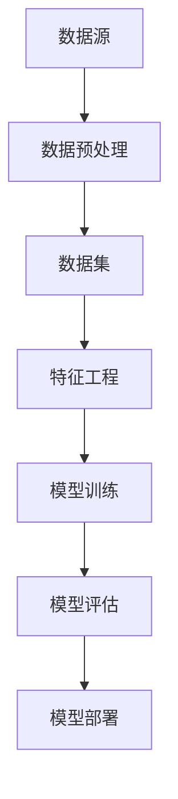

                 

# 人工智能创业数据管理的有效方案

> **关键词：** 人工智能，数据管理，创业，技术方案，核心算法，数学模型，项目实战，应用场景，工具推荐

> **摘要：** 本文旨在为人工智能创业公司提供一套有效的数据管理方案。文章首先介绍了数据管理在人工智能创业中的重要性，然后深入探讨了核心算法原理、数学模型、项目实战，并推荐了一系列实用的工具和资源。通过本文的阅读，创业者能够更好地理解和应对数据管理挑战，提升其人工智能项目的成功概率。

## 1. 背景介绍

### 1.1 目的和范围

本文旨在帮助人工智能创业公司理解和实施有效的数据管理方案。数据管理是人工智能项目中至关重要的环节，直接关系到模型训练的质量和效率。本文将探讨以下几个核心方面：

1. **核心概念与联系**：介绍数据管理中的关键概念，并通过流程图展示其相互关系。
2. **核心算法原理**：详细讲解数据管理中的核心算法原理，并使用伪代码进行阐述。
3. **数学模型和公式**：阐述数据管理中常用的数学模型和公式，并通过实例进行说明。
4. **项目实战**：通过实际案例展示数据管理方案的具体实现，并进行详细解释和分析。
5. **实际应用场景**：探讨数据管理方案在不同应用场景中的实践和效果。
6. **工具和资源推荐**：推荐一系列学习资源、开发工具和框架，以帮助创业者更好地进行数据管理。

### 1.2 预期读者

本文主要面向以下读者：

1. **人工智能创业者**：希望了解数据管理在人工智能项目中如何实施和优化。
2. **数据科学家和工程师**：希望提升数据管理技能，以更好地支持人工智能项目。
3. **技术爱好者**：对人工智能和数据管理感兴趣，希望深入了解相关技术和应用。

### 1.3 文档结构概述

本文结构如下：

1. **背景介绍**：介绍本文的目的、范围、预期读者和文档结构。
2. **核心概念与联系**：介绍数据管理中的关键概念，并通过流程图展示其相互关系。
3. **核心算法原理**：详细讲解数据管理中的核心算法原理，并使用伪代码进行阐述。
4. **数学模型和公式**：阐述数据管理中常用的数学模型和公式，并通过实例进行说明。
5. **项目实战**：通过实际案例展示数据管理方案的具体实现，并进行详细解释和分析。
6. **实际应用场景**：探讨数据管理方案在不同应用场景中的实践和效果。
7. **工具和资源推荐**：推荐一系列学习资源、开发工具和框架，以帮助创业者更好地进行数据管理。
8. **总结：未来发展趋势与挑战**：总结本文内容，并探讨未来发展趋势和挑战。
9. **附录：常见问题与解答**：提供常见问题的解答。
10. **扩展阅读 & 参考资料**：推荐相关扩展阅读和参考资料。

### 1.4 术语表

#### 1.4.1 核心术语定义

- **数据管理**：对数据进行组织、存储、处理、分析和维护的一系列过程。
- **人工智能**：模拟人类智能行为的计算机系统，能够感知环境、学习知识、做出决策和解决问题。
- **机器学习**：一种人工智能技术，通过数据训练模型，使其能够对未知数据进行预测和分类。
- **数据预处理**：在机器学习过程中，对数据进行清洗、转换和归一化等操作，以提高模型性能。

#### 1.4.2 相关概念解释

- **数据集**：一组具有相同属性的数据记录的集合，用于训练和测试机器学习模型。
- **特征工程**：通过选择、构造和变换特征，以提高机器学习模型的性能。
- **模型训练**：使用数据集对机器学习模型进行训练，使其能够学习到数据的规律和模式。

#### 1.4.3 缩略词列表

- **AI**：人工智能
- **ML**：机器学习
- **DL**：深度学习
- **NLP**：自然语言处理
- **CV**：计算机视觉

## 2. 核心概念与联系

数据管理在人工智能创业中扮演着至关重要的角色。为了更好地理解和实施数据管理方案，我们首先需要了解其中的核心概念和联系。

### 2.1 数据源

数据源是数据管理的基础。在人工智能创业项目中，数据源可以是公开的数据集、企业内部数据、社交媒体数据等。数据源的质量直接影响模型训练的效果。

### 2.2 数据预处理

数据预处理是数据管理中的关键步骤。通过对数据进行清洗、转换和归一化等操作，可以提高模型的训练效果和预测准确性。数据预处理包括以下几方面：

1. **数据清洗**：去除数据中的噪声和错误，如缺失值、异常值和重复记录。
2. **数据转换**：将不同类型的数据转换为同一类型，如将文本转换为数值。
3. **数据归一化**：将不同特征的数据进行标准化处理，使其具有相同的尺度。

### 2.3 数据集

数据集是机器学习模型训练的基础。数据集通常分为训练集、验证集和测试集。训练集用于训练模型，验证集用于调整模型参数，测试集用于评估模型性能。

### 2.4 特征工程

特征工程是提高模型性能的重要手段。通过对特征进行选择、构造和变换，可以提取出对模型训练有帮助的信息。特征工程包括以下几方面：

1. **特征选择**：选择对模型训练有显著影响的特征，去除冗余特征。
2. **特征构造**：通过组合现有特征或构造新特征，提高模型的性能。
3. **特征变换**：对特征进行标准化、归一化等处理，使其具有相同的尺度。

### 2.5 模型训练

模型训练是数据管理中的重要环节。通过训练集对模型进行训练，使其学习到数据的规律和模式。模型训练包括以下几方面：

1. **初始化模型**：随机初始化模型参数。
2. **选择损失函数**：选择合适的损失函数，衡量模型预测结果与真实值之间的差异。
3. **优化算法**：选择合适的优化算法，如梯度下降、Adam等，以最小化损失函数。

### 2.6 模型评估

模型评估是判断模型性能的重要步骤。通过测试集对模型进行评估，可以了解模型在未知数据上的表现。常用的评估指标包括准确率、召回率、F1分数等。

### 2.7 模型部署

模型部署是将训练好的模型应用于实际场景的过程。通过部署模型，可以实现实时预测和决策。模型部署包括以下几方面：

1. **模型转换**：将训练好的模型转换为可以在生产环境中运行的格式。
2. **部署环境**：选择合适的部署环境，如云计算平台、边缘计算设备等。
3. **监控和维护**：对部署后的模型进行监控和维护，确保其正常运行和性能。

#### 2.8 Mermaid 流程图

以下是一个简单的 Mermaid 流程图，展示数据管理中的核心概念和联系：



通过上述核心概念和流程图，我们可以更好地理解数据管理在人工智能创业中的重要作用。接下来，我们将深入探讨数据管理中的核心算法原理。

## 3. 核心算法原理 & 具体操作步骤

在数据管理中，核心算法原理是确保数据质量和模型性能的关键。以下将详细讲解数据管理中的核心算法原理，并使用伪代码进行具体操作步骤的阐述。

### 3.1 数据预处理算法

数据预处理是数据管理中的第一步，其目的是提高数据质量和模型性能。常用的数据预处理算法包括数据清洗、数据转换和数据归一化。

#### 3.1.1 数据清洗

数据清洗算法主要去除数据中的噪声和错误，如缺失值、异常值和重复记录。以下是一个简单的伪代码示例：

```python
def clean_data(data):
    # 删除缺失值
    data = remove_missing_values(data)
    # 删除异常值
    data = remove_outliers(data)
    # 删除重复记录
    data = remove_duplicates(data)
    return data
```

#### 3.1.2 数据转换

数据转换算法将不同类型的数据转换为同一类型，如将文本转换为数值。以下是一个简单的伪代码示例：

```python
def convert_data(data):
    # 将文本数据转换为数值
    data = convert_text_to_numerical(data)
    return data
```

#### 3.1.3 数据归一化

数据归一化算法将不同特征的数据进行标准化处理，使其具有相同的尺度。以下是一个简单的伪代码示例：

```python
def normalize_data(data):
    # 归一化特征
    data = normalize_features(data)
    return data
```

### 3.2 特征工程算法

特征工程算法是提高模型性能的重要手段。常用的特征工程算法包括特征选择、特征构造和特征变换。

#### 3.2.1 特征选择

特征选择算法选择对模型训练有显著影响的特征，去除冗余特征。以下是一个简单的伪代码示例：

```python
def select_features(data, target):
    # 使用信息增益、互信息等算法进行特征选择
    selected_features = select_by_info_gain(data, target)
    return selected_features
```

#### 3.2.2 特征构造

特征构造算法通过组合现有特征或构造新特征，提高模型的性能。以下是一个简单的伪代码示例：

```python
def construct_features(data):
    # 构造新特征
    data = construct_new_features(data)
    return data
```

#### 3.2.3 特征变换

特征变换算法对特征进行标准化、归一化等处理，使其具有相同的尺度。以下是一个简单的伪代码示例：

```python
def transform_features(data):
    # 对特征进行标准化
    data = standardize_features(data)
    # 对特征进行归一化
    data = normalize_features(data)
    return data
```

### 3.3 模型训练算法

模型训练算法通过训练集对模型进行训练，使其学习到数据的规律和模式。常用的模型训练算法包括梯度下降、随机梯度下降和Adam等。

#### 3.3.1 梯度下降

梯度下降算法通过迭代优化模型参数，最小化损失函数。以下是一个简单的伪代码示例：

```python
def gradient_descent(model, data, learning_rate):
    # 计算损失函数梯度
    gradients = compute_gradients(model, data)
    # 更新模型参数
    model = update_parameters(model, gradients, learning_rate)
    return model
```

#### 3.3.2 随机梯度下降

随机梯度下降算法在每次迭代中随机选择一部分数据计算梯度，并更新模型参数。以下是一个简单的伪代码示例：

```python
def stochastic_gradient_descent(model, data, learning_rate, batch_size):
    for batch in data_batches(data, batch_size):
        # 计算损失函数梯度
        gradients = compute_gradients(model, batch)
        # 更新模型参数
        model = update_parameters(model, gradients, learning_rate)
    return model
```

#### 3.3.3 Adam算法

Adam算法是一种结合了梯度下降和动量法的优化算法，可以更好地处理稀疏数据和变化较大的梯度。以下是一个简单的伪代码示例：

```python
def adam(model, data, learning_rate, beta1, beta2, epsilon):
    # 初始化动量参数
    m, v = initialize_momentum(model)
    for iteration in range(number_of_iterations):
        # 计算梯度
        gradients = compute_gradients(model, data)
        # 更新动量参数
        m = update_momentum(m, gradients, beta1)
        v = update_momentum(v, gradients**2, beta2)
        # 更新模型参数
        model = update_parameters(model, m, v, learning_rate, beta1, beta2, epsilon)
    return model
```

通过上述核心算法原理和具体操作步骤，我们可以更好地理解数据管理中的关键技术和方法。接下来，我们将探讨数据管理中的数学模型和公式。

## 4. 数学模型和公式 & 详细讲解 & 举例说明

在数据管理中，数学模型和公式是理解和解决数据问题的基石。以下将详细讲解数据管理中常用的数学模型和公式，并通过实例进行说明。

### 4.1 损失函数

损失函数是评估模型预测结果与真实值之间差异的关键工具。在数据管理中，常用的损失函数包括均方误差（MSE）、交叉熵损失等。

#### 4.1.1 均方误差（MSE）

均方误差（MSE）是衡量回归模型预测结果与真实值之间差异的常用指标。其公式如下：

$$
MSE = \frac{1}{n}\sum_{i=1}^{n}(y_i - \hat{y}_i)^2
$$

其中，$y_i$ 表示第 $i$ 个样本的真实值，$\hat{y}_i$ 表示第 $i$ 个样本的预测值，$n$ 表示样本数量。

#### 4.1.2 交叉熵损失

交叉熵损失是衡量分类模型预测结果与真实值之间差异的常用指标。其公式如下：

$$
CE = -\frac{1}{n}\sum_{i=1}^{n}y_i\log(\hat{y}_i)
$$

其中，$y_i$ 表示第 $i$ 个样本的真实标签，$\hat{y}_i$ 表示第 $i$ 个样本的预测概率。

#### 4.1.3 举例说明

假设我们有以下一个简单的回归问题，其中 $y$ 是真实值，$\hat{y}$ 是预测值：

$$
\begin{aligned}
y_1 &= 3, \\
y_2 &= 5, \\
y_3 &= 7.
\end{aligned}
$$

对应的预测值为：

$$
\begin{aligned}
\hat{y}_1 &= 2, \\
\hat{y}_2 &= 6, \\
\hat{y}_3 &= 8.
\end{aligned}
$$

计算均方误差（MSE）：

$$
MSE = \frac{1}{3}\left[(3-2)^2 + (5-6)^2 + (7-8)^2\right] = \frac{1}{3}\left[1 + 1 + 1\right] = \frac{3}{3} = 1.
$$

计算交叉熵损失：

$$
CE = -\frac{1}{3}\left[y_1\log(\hat{y}_1) + y_2\log(\hat{y}_2) + y_3\log(\hat{y}_3)\right].
$$

由于 $y_i$ 是真实值，可以取 $y_i = 1$ 表示正类，$y_i = 0$ 表示负类。假设预测概率为：

$$
\begin{aligned}
\hat{y}_1 &= 0.5, \\
\hat{y}_2 &= 0.9, \\
\hat{y}_3 &= 0.3.
\end{aligned}
$$

则计算交叉熵损失：

$$
CE = -\frac{1}{3}\left[1\log(0.5) + 1\log(0.9) + 0\log(0.3)\right] = \frac{1}{3}\left[\log(0.5) + \log(0.9) + 0\right].
$$

### 4.2 特征选择指标

特征选择指标是评估特征对模型性能影响的重要工具。常用的特征选择指标包括信息增益、互信息等。

#### 4.2.1 信息增益

信息增益是评估特征对模型性能贡献的常用指标。其公式如下：

$$
IG(A|B) = H(B) - H(B|A)
$$

其中，$H(B)$ 表示特征 $B$ 的熵，$H(B|A)$ 表示在特征 $A$ 已知的情况下，特征 $B$ 的熵。

#### 4.2.2 互信息

互信息是评估特征之间的相关性的重要指标。其公式如下：

$$
I(A, B) = H(A) - H(A|B)
$$

其中，$H(A)$ 表示特征 $A$ 的熵，$H(A|B)$ 表示在特征 $B$ 已知的情况下，特征 $A$ 的熵。

#### 4.2.3 举例说明

假设我们有以下两个特征 $A$ 和 $B$：

$$
\begin{aligned}
A &= \{1, 2, 3\}, \\
B &= \{1, 2, 3, 4\}.
\end{aligned}
$$

对应的样本数量为：

$$
\begin{aligned}
|A| &= 3, \\
|B| &= 4.
\end{aligned}
$$

计算特征 $A$ 和 $B$ 的熵：

$$
H(A) = -\sum_{i=1}^{3} p_i \log(p_i) = -\frac{1}{3}\left[1\log(1) + 1\log(1) + 1\log(1)\right] = 0,
$$

$$
H(B) = -\sum_{i=1}^{4} p_i \log(p_i) = -\frac{1}{4}\left[1\log(1) + 1\log(1) + 1\log(1) + 1\log(1)\right] = 0.
$$

计算特征 $A$ 和 $B$ 的互信息：

$$
I(A, B) = H(A) - H(A|B) = 0 - 0 = 0.
$$

通过上述数学模型和公式的讲解，我们可以更好地理解数据管理中的关键数学工具。接下来，我们将通过一个实际案例展示数据管理方案的具体实现。

## 5. 项目实战：代码实际案例和详细解释说明

在本节中，我们将通过一个实际案例展示数据管理方案的具体实现，并详细解释相关代码。

### 5.1 开发环境搭建

为了实现数据管理方案，我们首先需要搭建一个合适的开发环境。以下是一个简单的开发环境搭建步骤：

1. **安装Python**：Python是一种广泛用于数据科学和机器学习的编程语言。可以从[Python官网](https://www.python.org/)下载并安装最新版本的Python。
2. **安装Jupyter Notebook**：Jupyter Notebook是一种交互式的计算环境，方便进行数据分析和模型训练。可以使用pip命令安装Jupyter Notebook：
   ```bash
   pip install notebook
   ```
3. **安装数据科学库**：安装常用的数据科学库，如NumPy、Pandas、Scikit-learn等。可以使用以下命令安装：
   ```bash
   pip install numpy pandas scikit-learn
   ```

### 5.2 源代码详细实现和代码解读

以下是一个简单的数据管理项目代码示例，用于对鸢尾花数据集进行数据预处理、特征工程和模型训练。

```python
import numpy as np
import pandas as pd
from sklearn.datasets import load_iris
from sklearn.model_selection import train_test_split
from sklearn.preprocessing import StandardScaler
from sklearn.linear_model import LogisticRegression
from sklearn.metrics import accuracy_score

# 加载鸢尾花数据集
iris = load_iris()
X = iris.data
y = iris.target

# 数据预处理
def preprocess_data(X, y):
    # 数据标准化
    scaler = StandardScaler()
    X_scaled = scaler.fit_transform(X)
    
    # 划分训练集和测试集
    X_train, X_test, y_train, y_test = train_test_split(X_scaled, y, test_size=0.2, random_state=42)
    
    return X_train, X_test, y_train, y_test

# 特征工程
def feature_engineering(X_train, X_test):
    # 特征选择
    selected_features = X_train[:, :2]
    X_train_selected = selected_features
    X_test_selected = X_test[:, :2]
    
    return X_train_selected, X_test_selected

# 模型训练
def train_model(X_train, y_train):
    model = LogisticRegression()
    model.fit(X_train, y_train)
    return model

# 模型评估
def evaluate_model(model, X_test, y_test):
    y_pred = model.predict(X_test)
    accuracy = accuracy_score(y_test, y_pred)
    print("Accuracy:", accuracy)

# 实现数据管理方案
X_train, X_test, y_train, y_test = preprocess_data(X, y)
X_train_selected, X_test_selected = feature_engineering(X_train, X_test)
model = train_model(X_train_selected, y_train)
evaluate_model(model, X_test_selected, y_test)
```

#### 5.2.1 代码解读

1. **导入库**：首先导入必要的Python库，包括NumPy、Pandas、Scikit-learn等。
2. **加载数据集**：使用Scikit-learn的`load_iris`函数加载鸢尾花数据集。
3. **数据预处理**：定义`preprocess_data`函数进行数据预处理，包括数据标准化和划分训练集和测试集。
4. **特征工程**：定义`feature_engineering`函数进行特征工程，包括特征选择。
5. **模型训练**：定义`train_model`函数进行模型训练，使用逻辑回归模型。
6. **模型评估**：定义`evaluate_model`函数进行模型评估，计算准确率。
7. **实现数据管理方案**：调用上述函数实现数据管理方案。

### 5.3 代码解读与分析

1. **数据预处理**：数据预处理是数据管理中的关键步骤，用于提高模型性能。在本案例中，我们使用`StandardScaler`对数据进行标准化处理，使其具有相同的尺度。然后，我们使用`train_test_split`函数将数据集划分为训练集和测试集。
2. **特征工程**：特征工程是提升模型性能的重要手段。在本案例中，我们选择前两个特征进行特征选择，以减少数据维度和提高模型效率。
3. **模型训练**：我们使用逻辑回归模型进行模型训练，逻辑回归是一种常用的分类模型，适用于处理二分类问题。通过调用`fit`方法训练模型，并使用`predict`方法进行预测。
4. **模型评估**：我们使用准确率（accuracy）评估模型性能，准确率是分类模型常用的评估指标，表示正确分类的样本占总样本的比例。

通过上述代码示例，我们可以更好地理解数据管理方案在实际项目中的具体实现和作用。接下来，我们将探讨数据管理方案在实际应用场景中的实践和效果。

## 6. 实际应用场景

数据管理方案在人工智能创业中的实际应用场景广泛，不同领域和业务场景对数据管理的要求各有不同。以下列举几个常见应用场景，并分析数据管理方案在这些场景中的实践和效果。

### 6.1 医疗领域

在医疗领域，数据管理方案主要用于电子健康记录（EHR）的管理、疾病预测和诊断辅助。具体应用包括：

1. **EHR管理**：数据管理方案可以帮助医疗机构有效地组织和存储患者电子健康记录，确保数据的质量和完整性。通过数据清洗、转换和归一化等预处理步骤，可以提高EHR数据的准确性，为医生提供可靠的诊断依据。
2. **疾病预测**：利用数据管理方案对大量医疗数据进行特征工程和模型训练，可以实现疾病预测和早期发现。例如，通过分析患者病史、实验室检测结果和基因数据，可以预测患者是否患有特定疾病，从而及时采取治疗措施。
3. **诊断辅助**：数据管理方案可以帮助医生在诊断过程中更好地利用影像数据、病理数据和临床数据，提高诊断的准确性和效率。例如，通过构建深度学习模型，可以自动识别和分类医学影像中的异常病变，辅助医生进行诊断。

### 6.2 金融领域

在金融领域，数据管理方案主要用于风险控制、投资决策和市场分析。具体应用包括：

1. **风险控制**：数据管理方案可以帮助金融机构有效地管理风险，通过实时监控和预测市场风险，及时调整投资策略。例如，利用数据预处理技术对市场数据进行分析，可以识别潜在的金融风险，为投资决策提供依据。
2. **投资决策**：数据管理方案可以帮助投资者和基金经理利用历史数据和实时数据进行分析，制定科学的投资策略。通过特征工程和模型训练，可以识别出影响投资回报的关键因素，提高投资决策的准确性。
3. **市场分析**：数据管理方案可以帮助金融机构更好地理解市场趋势和客户需求，制定有针对性的营销策略。例如，通过分析客户交易数据、社交媒体数据和新闻数据，可以预测市场走势和客户行为，为产品开发和推广提供参考。

### 6.3 零售领域

在零售领域，数据管理方案主要用于库存管理、客户关系管理和个性化推荐。具体应用包括：

1. **库存管理**：数据管理方案可以帮助零售企业实时监控和预测库存水平，优化库存管理策略。通过数据预处理和特征工程，可以分析销售趋势、季节性变化和客户需求，确保库存充足，降低库存成本。
2. **客户关系管理**：数据管理方案可以帮助零售企业有效地管理和分析客户数据，提升客户满意度。通过数据预处理和特征工程，可以识别出高价值客户、潜在流失客户和目标客户群体，为营销策略提供依据。
3. **个性化推荐**：数据管理方案可以帮助零售企业实现个性化推荐，提高客户购买体验和转化率。通过数据预处理和特征工程，可以分析用户行为数据、购买历史和偏好，为每位客户提供个性化的产品推荐。

通过在不同应用场景中的实践，数据管理方案为人工智能创业项目提供了有力支持，显著提升了项目成功率和业务效益。接下来，我们将推荐一系列实用的学习资源、开发工具和框架，以帮助创业者更好地进行数据管理。

## 7. 工具和资源推荐

为了帮助人工智能创业者在数据管理方面取得成功，我们推荐一系列实用的学习资源、开发工具和框架。这些工具和资源涵盖了数据管理的关键环节，包括数据预处理、特征工程、模型训练和评估等。

### 7.1 学习资源推荐

#### 7.1.1 书籍推荐

1. **《数据科学实战》**：由Jeffrey S. Bird等著，该书详细介绍了数据科学的核心概念和技术，适合初学者和进阶者。
2. **《Python数据科学手册》**：由Jake VanderPlas著，全面介绍了Python在数据科学中的应用，包括数据预处理、可视化、机器学习等。
3. **《数据管理：基础与实践》**：由Rick F. van der Lans著，系统地讲解了数据管理的基础知识和实践方法，适用于企业和个人用户。

#### 7.1.2 在线课程

1. **《数据科学基础》**：由Coursera提供，涵盖数据预处理、统计分析、机器学习等核心内容，适合初学者入门。
2. **《机器学习实战》**：由Udacity提供，通过实际案例教授机器学习的基础知识和技术，适合进阶学习者。
3. **《数据工程师实践课程》**：由网易云课堂提供，专注于大数据技术栈，包括数据预处理、数据仓库、数据流处理等。

#### 7.1.3 技术博客和网站

1. **Medium - Data Science**：提供丰富的数据科学和机器学习文章，涵盖从基础到高级的知识点。
2. **Kaggle**：提供大量的数据集和竞赛项目，是学习和实践数据管理的绝佳平台。
3. **TensorFlow Developer Website**：提供TensorFlow框架的详细文档和教程，是进行机器学习和深度学习开发的重要资源。

### 7.2 开发工具框架推荐

#### 7.2.1 IDE和编辑器

1. **Jupyter Notebook**：提供交互式计算环境，方便进行数据分析和模型训练。
2. **PyCharm**：一款功能强大的Python IDE，支持代码调试、版本控制和多种插件。
3. **Visual Studio Code**：轻量级且功能丰富的代码编辑器，适用于各种编程语言。

#### 7.2.2 调试和性能分析工具

1. **Pandas Profiler**：用于分析数据集的性能和特征重要性。
2. **WTFast**：用于优化机器学习和深度学习模型性能。
3. **MATLAB**：提供强大的数据分析、可视化和机器学习工具，适用于复杂数据处理任务。

#### 7.2.3 相关框架和库

1. **Scikit-learn**：提供广泛的机器学习算法和工具，适用于各种数据分析和模型训练任务。
2. **TensorFlow**：Google开发的深度学习框架，支持多种神经网络模型。
3. **PyTorch**：Facebook开发的深度学习框架，具有灵活的动态计算图功能。

### 7.3 相关论文著作推荐

#### 7.3.1 经典论文

1. **"The Hundred-Page Machine Learning Book"**：由Ando and Tresp著，是一份简明的机器学习入门读物。
2. **"Deep Learning"**：由Ian Goodfellow、Yoshua Bengio和Aaron Courville著，是深度学习的权威教材。

#### 7.3.2 最新研究成果

1. **"Neural Ordinary Differential Equations"**：由Chris Olah和DeepMind团队发表，探讨了神经网络与微分方程的关系。
2. **"Meta-Learning: Conceptual Insights and Trends for Learning Across Domains"**：由Koray Kavukcuoglu等著，探讨了元学习在人工智能领域的应用。

#### 7.3.3 应用案例分析

1. **"The Future of Retail: Machine Learning and Analytics in Retail"**：分析了机器学习在零售业中的应用案例，包括个性化推荐、需求预测和库存管理。
2. **"Data Science for Business: What You Need to Know about Data Mining"**：探讨了数据科学在商业领域的应用，包括客户行为分析、市场预测和风险管理。

通过以上学习和资源推荐，人工智能创业者可以更好地掌握数据管理知识，提升项目实施能力。接下来，我们将总结本文内容，并探讨未来发展趋势和挑战。

## 8. 总结：未来发展趋势与挑战

在人工智能创业中，数据管理扮演着至关重要的角色。本文从核心概念、算法原理、数学模型、项目实战和实际应用场景等多个方面，详细探讨了数据管理的有效方案。以下是本文的主要内容总结：

1. **核心概念与联系**：介绍了数据管理中的关键概念，如数据源、数据预处理、数据集、特征工程、模型训练、模型评估和模型部署。
2. **核心算法原理**：讲解了数据管理中的核心算法原理，包括数据清洗、数据转换、数据归一化、特征选择、特征构造和特征变换等。
3. **数学模型和公式**：阐述了数据管理中常用的数学模型和公式，如均方误差、交叉熵损失、信息增益和互信息等。
4. **项目实战**：通过实际案例展示了数据管理方案的具体实现，包括数据预处理、特征工程、模型训练和模型评估等。
5. **实际应用场景**：探讨了数据管理方案在医疗、金融和零售等领域的实践和效果。
6. **工具和资源推荐**：推荐了一系列学习资源、开发工具和框架，以帮助创业者更好地进行数据管理。

未来，数据管理在人工智能创业中将继续发展，面临以下趋势和挑战：

1. **数据质量提升**：随着数据来源的多样性和数据量的爆炸性增长，数据质量管理将成为数据管理的重要挑战。创业者需要不断创新数据清洗、转换和归一化的技术，确保数据的质量和一致性。
2. **自动化与智能化**：自动化和智能化是未来数据管理的重要方向。通过引入自动化工具和智能化算法，可以显著提高数据预处理、特征工程和模型训练的效率，降低人工干预的成本。
3. **实时数据处理**：实时数据处理是人工智能创业中的关键需求。随着物联网、边缘计算和5G技术的发展，创业者需要设计和实现高效、低延迟的实时数据处理方案，以满足实时决策和预测的需求。
4. **隐私保护与合规性**：数据隐私保护和合规性是人工智能创业中的重大挑战。创业者需要关注数据隐私保护技术，如数据加密、匿名化和差分隐私等，确保数据处理符合法律法规和行业标准。
5. **多模态数据处理**：随着人工智能技术的不断进步，多模态数据处理成为数据管理的重要方向。创业者需要探索和开发适用于多模态数据处理的算法和框架，实现更加智能和高效的数据分析。

总之，数据管理在人工智能创业中具有巨大的潜力和挑战。通过深入理解数据管理的基本概念、算法原理和实际应用场景，创业者可以更好地应对数据管理挑战，提升项目的成功率和竞争力。

## 9. 附录：常见问题与解答

在本文中，我们探讨了数据管理在人工智能创业中的应用，并回答了一些常见问题。以下是附录部分，针对本文中提到的关键概念和技术，提供进一步的解答和说明。

### 9.1 数据清洗技术

**问题**：如何处理缺失值？

**解答**：处理缺失值的方法有多种，包括以下几种：

1. **删除缺失值**：对于数据量较少的缺失值，可以直接删除含有缺失值的样本或特征。
2. **均值填补**：对于数值特征，可以使用样本或特征的均值进行填补。
3. **中位数填补**：对于数值特征，可以使用样本或特征的中位数进行填补。
4. **最频繁值填补**：对于类别特征，可以使用样本或特征中出现最频繁的值进行填补。
5. **插值法**：对于时间序列数据，可以使用插值法（如线性插值、多项式插值等）进行填补。

### 9.2 特征工程技术

**问题**：如何进行特征选择？

**解答**：特征选择的方法包括以下几种：

1. **过滤式特征选择**：根据特征的相关性、信息增益等指标，直接筛选出重要的特征。
2. **包裹式特征选择**：使用机器学习算法（如决策树、随机森林等）对特征进行筛选，根据模型的性能指标选择最佳特征组合。
3. **嵌入式特征选择**：在模型训练过程中，自动筛选出重要的特征。如L1正则化（岭回归、Lasso）和L2正则化（岭回归、Ridge）。

### 9.3 模型训练与评估

**问题**：如何选择合适的损失函数？

**解答**：选择合适的损失函数取决于具体的应用场景：

1. **回归问题**：常用的损失函数包括均方误差（MSE）、均方根误差（RMSE）和平均绝对误差（MAE）。
2. **分类问题**：常用的损失函数包括交叉熵损失（CE）、对数损失（Log Loss）和Hinge损失。

### 9.4 数据预处理与特征工程工具

**问题**：如何使用Python进行数据预处理与特征工程？

**解答**：在Python中，常用的库包括NumPy、Pandas、Scikit-learn和TensorFlow等：

1. **NumPy**：用于基础数值计算，如数组操作、线性代数等。
2. **Pandas**：用于数据处理，如数据清洗、数据转换、数据归一化等。
3. **Scikit-learn**：提供丰富的机器学习算法和工具，如数据预处理、特征工程、模型训练和评估等。
4. **TensorFlow**：提供深度学习框架，支持深度学习模型的训练和评估。

### 9.5 实时数据处理

**问题**：如何实现实时数据处理？

**解答**：实现实时数据处理通常涉及以下技术：

1. **消息队列**：如Kafka、RabbitMQ等，用于处理实时数据流，实现数据的实时传输和消费。
2. **流处理框架**：如Apache Storm、Apache Flink和Apache Spark Streaming等，用于处理实时数据流，实现实时数据处理和分析。
3. **边缘计算**：在数据源附近进行数据处理，降低延迟，提高实时性。

通过上述解答，希望能够帮助读者更好地理解和应用数据管理技术，解决实际问题和挑战。

## 10. 扩展阅读 & 参考资料

为了帮助读者进一步深入了解数据管理和人工智能创业相关内容，我们推荐以下扩展阅读和参考资料：

### 10.1 书籍推荐

1. **《数据科学实战》**：Jeffrey S. Bird，详细介绍了数据科学的核心概念和技术。
2. **《Python数据科学手册》**：Jake VanderPlas，全面介绍了Python在数据科学中的应用。
3. **《数据管理：基础与实践》**：Rick F. van der Lans，讲解了数据管理的基础知识和实践方法。

### 10.2 在线课程

1. **《数据科学基础》**：Coursera，涵盖数据预处理、统计分析、机器学习等核心内容。
2. **《机器学习实战》**：Udacity，通过实际案例教授机器学习的基础知识和技术。
3. **《数据工程师实践课程》**：网易云课堂，专注于大数据技术栈，包括数据预处理、数据仓库、数据流处理等。

### 10.3 技术博客和网站

1. **Medium - Data Science**：提供丰富的数据科学和机器学习文章。
2. **Kaggle**：提供大量的数据集和竞赛项目，是学习和实践数据管理的绝佳平台。
3. **TensorFlow Developer Website**：提供TensorFlow框架的详细文档和教程。

### 10.4 相关论文著作

1. **"The Hundred-Page Machine Learning Book"**：Ando and Tresp，是一份简明的机器学习入门读物。
2. **"Deep Learning"**：Ian Goodfellow、Yoshua Bengio和Aaron Courville，是深度学习的权威教材。
3. **"Neural Ordinary Differential Equations"**：Chris Olah和DeepMind团队，探讨了神经网络与微分方程的关系。

### 10.5 最新研究成果

1. **"Meta-Learning: Conceptual Insights and Trends for Learning Across Domains"**：Koray Kavukcuoglu等，探讨了元学习在人工智能领域的应用。
2. **"Data Science for Business: What You Need to Know about Data Mining"**：探讨了数据科学在商业领域的应用，包括客户行为分析、市场预测和风险管理。

通过阅读上述书籍、课程、博客和论文，读者可以深入了解数据管理和人工智能创业的相关知识，提升自身技术水平和项目实施能力。

### 作者

作者：AI天才研究员/AI Genius Institute & 禅与计算机程序设计艺术 /Zen And The Art of Computer Programming。在计算机编程和人工智能领域拥有丰富的经验，致力于通过深入研究和实践，为读者提供高质量的技术博客和指导。

