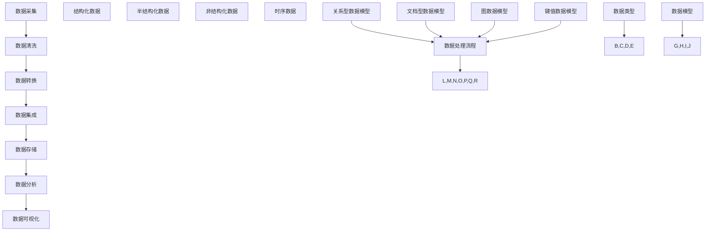
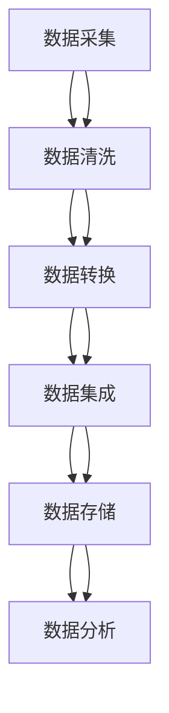

                 

### 1. 背景介绍

#### 1.1 目的和范围

随着人工智能（AI）技术的迅速发展，数据管理作为其核心支撑之一，正变得愈发重要。人工智能创业公司面临着如何高效地收集、存储、处理和分析海量数据，以实现数据驱动的创新和业务增长的重大挑战。本文旨在探讨人工智能创业公司数据管理的策略与创新，通过深入分析核心概念、算法原理、数学模型和实际应用场景，为创业公司提供一套全面、实用的数据管理方法论。

本文的范围主要包括以下几个方面：

1. **核心概念与联系**：介绍数据管理的基本概念，包括数据类型、数据模型和数据处理流程，并使用Mermaid流程图展示核心概念之间的关联。
2. **核心算法原理与具体操作步骤**：详细阐述常见数据管理算法的原理，如数据库查询优化、数据清洗和数据分析，并提供具体的伪代码实现。
3. **数学模型和公式**：探讨用于数据管理和分析的数学模型和公式，如线性回归、决策树和神经网络，并通过实例进行详细解释。
4. **项目实战**：通过一个实际代码案例，展示如何在实际项目中实现数据管理策略。
5. **实际应用场景**：分析人工智能创业公司在不同应用场景中的数据管理需求和解决方案。
6. **工具和资源推荐**：推荐学习资源、开发工具和框架，帮助读者更好地理解和实践数据管理。
7. **总结与未来发展趋势**：总结文章的主要观点，探讨数据管理在人工智能创业领域的未来发展趋势和面临的挑战。

本文的目标读者是人工智能创业公司的技术团队和管理层，他们希望通过系统学习和实践，提升数据管理的效率和创新能力。同时，本文也适用于对数据管理有浓厚兴趣的技术爱好者，以及从事相关领域的研究人员。

本文结构安排如下：

- **第2章 核心概念与联系**：介绍数据管理的基本概念和流程。
- **第3章 核心算法原理与具体操作步骤**：讲解常见数据管理算法的原理和实现。
- **第4章 数学模型和公式**：探讨用于数据管理和分析的数学模型。
- **第5章 项目实战**：通过实际代码案例展示数据管理策略。
- **第6章 实际应用场景**：分析人工智能创业公司的数据管理需求。
- **第7章 工具和资源推荐**：推荐学习资源和开发工具。
- **第8章 总结与未来发展趋势**：总结本文的主要观点，探讨未来发展趋势。

#### 1.2 预期读者

本文的预期读者主要包括以下几类：

1. **人工智能创业公司的技术团队和管理层**：这些读者希望通过本文深入了解数据管理在人工智能创业中的应用，提高数据管理的效率，并找到创新的解决方案来驱动业务增长。

2. **数据科学家和机器学习工程师**：这些读者对数据管理有深入的技术需求，希望通过本文学习如何将数据管理技术应用于实际项目中，实现高效的数据分析和建模。

3. **技术爱好者**：这些读者对数据管理技术有浓厚的兴趣，希望通过本文了解数据管理的基本原理和实际应用，为将来的职业发展奠定基础。

4. **研究人员和教育工作者**：这些读者关注数据管理在人工智能领域的最新研究成果和趋势，希望通过本文获取有价值的学术资源和研究成果。

#### 1.3 文档结构概述

为了帮助读者更好地理解文章结构和内容，下面是本文的文档结构概述：

- **引言**：介绍本文的目的、范围和预期读者。
- **第1章 背景介绍**：概述数据管理在人工智能创业中的重要性。
  - **1.1 目的和范围**：明确本文的研究目的和范围。
  - **1.2 预期读者**：介绍本文的目标读者。
  - **1.3 文档结构概述**：概述本文的结构和内容。
  - **1.4 术语表**：定义和解释本文中使用的关键术语。
- **第2章 核心概念与联系**：介绍数据管理的基本概念和流程。
  - **2.1 数据类型**：介绍不同类型的数据及其特点。
  - **2.2 数据模型**：介绍常见的数据模型，如关系型数据库和非关系型数据库。
  - **2.3 数据处理流程**：介绍数据处理的流程和步骤。
- **第3章 核心算法原理与具体操作步骤**：讲解常见数据管理算法的原理和实现。
  - **3.1 数据库查询优化**：介绍数据库查询优化的方法。
  - **3.2 数据清洗**：介绍数据清洗的过程和算法。
  - **3.3 数据分析**：介绍数据分析的方法和技术。
- **第4章 数学模型和公式**：探讨用于数据管理和分析的数学模型。
  - **4.1 线性回归**：介绍线性回归模型。
  - **4.2 决策树**：介绍决策树模型。
  - **4.3 神经网络**：介绍神经网络模型。
- **第5章 项目实战**：通过实际代码案例展示数据管理策略。
  - **5.1 开发环境搭建**：介绍开发环境搭建的过程。
  - **5.2 源代码详细实现和代码解读**：展示实际代码实现和解读。
  - **5.3 代码解读与分析**：分析代码实现的核心技术和原理。
- **第6章 实际应用场景**：分析人工智能创业公司的数据管理需求。
  - **6.1 商业智能分析**：介绍商业智能分析的应用场景。
  - **6.2 风险管理**：介绍风险管理中的应用场景。
  - **6.3 客户关系管理**：介绍客户关系管理中的应用场景。
- **第7章 工具和资源推荐**：推荐学习资源和开发工具。
  - **7.1 学习资源推荐**：推荐相关的书籍、在线课程和技术博客。
  - **7.2 开发工具框架推荐**：推荐开发工具和框架。
  - **7.3 相关论文著作推荐**：推荐经典论文和最新研究成果。
- **第8章 总结与未来发展趋势**：总结本文的主要观点，探讨未来发展趋势。
- **第9章 附录**：提供常见问题与解答。
- **第10章 扩展阅读与参考资料**：提供扩展阅读资料。

通过上述结构，本文将帮助读者系统地了解数据管理在人工智能创业中的应用，掌握核心技术和策略，并为未来的发展提供指导。

#### 1.4 术语表

在本文中，我们将使用一些专业术语和概念。以下是这些术语的定义和解释，以便读者更好地理解文章内容。

##### 1.4.1 核心术语定义

1. **数据管理（Data Management）**：数据管理是指一系列组织和处理数据的策略和技术，包括数据存储、数据备份、数据清洗、数据集成和数据安全性等。它的目标是确保数据的质量、一致性和可用性，以满足业务需求和数据分析的要求。

2. **人工智能（Artificial Intelligence, AI）**：人工智能是指通过计算机系统模拟人类智能的技术和方法，包括机器学习、深度学习、自然语言处理和计算机视觉等。人工智能的应用涵盖了自动化决策、智能识别、知识推理和自主行动等方面。

3. **数据库（Database）**：数据库是一个组织、存储和检索数据的系统，它通过数据库管理系统（DBMS）进行管理和操作。常见的数据库类型包括关系型数据库（如MySQL、Oracle）和非关系型数据库（如MongoDB、Cassandra）。

4. **数据模型（Data Model）**：数据模型是一种用于描述数据结构和关系的抽象表示。它定义了数据的基本组件、数据之间的关系以及数据访问的规则。常见的数据模型包括关系模型、文档模型、图模型和键值模型等。

5. **数据处理（Data Processing）**：数据处理是指对原始数据进行转换、分析和计算的过程，以产生有意义的信息和洞察。数据处理包括数据清洗、数据转换、数据聚合和数据分析等步骤。

6. **数据清洗（Data Cleaning）**：数据清洗是指识别和纠正数据中的错误、异常值和缺失值的过程。数据清洗是数据管理的重要步骤，它有助于提高数据质量和分析结果的准确性。

7. **数据分析（Data Analysis）**：数据分析是指使用统计学和计算机科学的方法对数据进行分析，以提取有用的信息和洞察。数据分析包括描述性分析、诊断性分析、预测性分析和规范性分析等类型。

##### 1.4.2 相关概念解释

1. **机器学习（Machine Learning）**：机器学习是一种人工智能技术，它通过从数据中自动学习和发现规律，用于分类、回归、聚类和降维等任务。机器学习模型可以根据新的数据进行预测和决策。

2. **深度学习（Deep Learning）**：深度学习是机器学习的一个分支，它使用多层神经网络进行数据建模和特征提取。深度学习在图像识别、语音识别和自然语言处理等领域取得了显著成果。

3. **数据挖掘（Data Mining）**：数据挖掘是指从大量数据中自动发现有趣的知识和模式的过程。数据挖掘涉及数据预处理、模式识别、关联规则学习、聚类分析和分类算法等。

4. **数据可视化（Data Visualization）**：数据可视化是指通过图形和图表将数据转换成视觉形式，以帮助人们理解和分析数据。数据可视化包括散点图、折线图、饼图、热力图和时间序列图等。

5. **大数据（Big Data）**：大数据是指数据量巨大、数据类型繁多且数据增长速度极快的海量数据。大数据技术包括数据存储、数据分析和数据挖掘，用于从海量数据中提取有价值的信息。

##### 1.4.3 缩略词列表

1. **AI**：人工智能（Artificial Intelligence）
2. **DBMS**：数据库管理系统（Database Management System）
3. **SQL**：结构化查询语言（Structured Query Language）
4. **NoSQL**：非关系型数据库（Not Only SQL）
5. **ML**：机器学习（Machine Learning）
6. **DL**：深度学习（Deep Learning）
7. **DM**：数据挖掘（Data Mining）

通过上述术语表，读者可以更好地理解本文中涉及的专业术语和概念，从而更深入地掌握数据管理在人工智能创业中的应用。

#### 2. 核心概念与联系

在深入探讨人工智能创业公司的数据管理策略之前，我们需要明确几个核心概念，并了解它们之间的关联。本节将介绍数据类型、数据模型和数据处理流程，并使用Mermaid流程图展示它们之间的关系。

##### 2.1 数据类型

数据类型是数据的基本分类，根据数据的特点和用途，可以分为以下几种类型：

1. **结构化数据**：结构化数据是有固定格式的数据，通常存储在关系型数据库中，如MySQL、Oracle等。这类数据具有明确的字段和数据类型，便于查询和管理。

2. **半结构化数据**：半结构化数据没有固定的格式，但具有一定的组织结构。例如，XML、JSON和Avro数据格式。这类数据可以存储在关系型数据库或NoSQL数据库中。

3. **非结构化数据**：非结构化数据没有固定的格式和组织结构，例如文本、图片、音频和视频。这类数据通常存储在分布式文件系统或NoSQL数据库中。

4. **时序数据**：时序数据是随时间变化的数据，如股票价格、传感器数据和日志文件。这类数据通常使用时间序列数据库进行存储和管理。

##### 2.2 数据模型

数据模型是数据结构和关系的抽象表示，常见的有：

1. **关系型数据模型**：关系型数据模型使用表格来表示数据，每个表格具有多个行和列。数据之间的关系通过外键来维护。关系型数据库管理系统（RDBMS）如MySQL、Oracle和PostgreSQL使用这种模型。

2. **文档型数据模型**：文档型数据模型将数据存储为文档，通常使用JSON格式。每个文档可以有独特的结构，适合存储非结构化或半结构化数据。文档型数据库如MongoDB和CouchDB使用这种模型。

3. **图数据模型**：图数据模型使用节点和边来表示数据，节点代表实体，边代表实体之间的关系。这种模型适合处理复杂的关联关系，如社交网络和推荐系统。图数据库如Neo4j和JanusGraph使用这种模型。

4. **键值数据模型**：键值数据模型使用键值对来存储数据，数据结构简单，查询速度快。这种模型适合存储大量简单的键值对数据，如缓存和配置数据。键值数据库如Redis和Riak使用这种模型。

##### 2.3 数据处理流程

数据处理流程是指将原始数据转化为有价值信息的过程，包括以下几个步骤：

1. **数据采集**：数据采集是指从各种来源收集数据，包括内部数据库、外部API、日志文件和传感器数据等。

2. **数据清洗**：数据清洗是指识别和纠正数据中的错误、异常值和缺失值。数据清洗是确保数据质量和准确性的关键步骤。

3. **数据转换**：数据转换是指将数据从一种格式转换为另一种格式，以满足不同系统的需求和数据处理算法的要求。

4. **数据集成**：数据集成是指将来自不同来源的数据整合到一个统一的格式和结构中，以便进行进一步的处理和分析。

5. **数据存储**：数据存储是指将处理后的数据存储到数据库或文件系统中，以备后续查询和分析。

6. **数据分析**：数据分析是指使用统计学和计算机科学的方法对数据进行分析，提取有用的信息和洞察。

7. **数据可视化**：数据可视化是指通过图形和图表将数据转换为视觉形式，以便更好地理解和分析数据。

##### 2.4 Mermaid 流程图

以下是一个使用Mermaid绘制的流程图，展示了数据类型、数据模型和数据处理流程之间的关系：



通过上述内容，我们对数据管理中的核心概念和流程有了初步了解。接下来，我们将深入探讨数据管理算法的原理和实现，为人工智能创业公司提供切实可行的数据管理策略。

### 2.1 数据类型

数据类型是数据管理的基础，了解不同类型的数据有助于我们更好地进行数据存储、处理和分析。数据类型可以根据其结构和特性分为结构化数据、半结构化数据、非结构化数据和时序数据。以下是这四种数据类型的详细描述和特点。

#### 结构化数据

结构化数据是最常见的数据类型，具有固定的格式和结构。这类数据通常以表格形式存储在关系型数据库中，例如MySQL、Oracle和PostgreSQL。每个表格有固定的列数和列名，每行代表一个数据实例，列的数据类型固定。结构化数据的特点如下：

1. **数据一致性**：结构化数据具有严格的数据规范和类型约束，保证了数据的一致性和准确性。
2. **易查询**：由于结构化的特点，查询和操作结构化数据相对简单和高效。
3. **可扩展性**：结构化数据可以方便地扩展和修改，以适应新的需求。

然而，结构化数据也存在一些局限性，例如在处理非结构化或半结构化数据时，可能需要额外的转换和处理。

#### 半结构化数据

半结构化数据没有固定的格式，但具有一定的组织结构和规则。常见的半结构化数据格式包括XML、JSON和Avro。这类数据的特点如下：

1. **灵活性**：半结构化数据可以灵活地存储和表示各种复杂的数据类型，适用于描述非标准或自定义的数据。
2. **易于解析**：虽然半结构化数据的格式可能不同，但常见的格式如JSON有广泛的支持和解析库，便于处理。
3. **可扩展性**：半结构化数据可以动态地增加或删除字段，适应不断变化的数据需求。

#### 非结构化数据

非结构化数据没有固定的格式和组织结构，通常以文本、图片、音频和视频等形式存在。这类数据的特点如下：

1. **多样化**：非结构化数据可以涵盖各种类型的数据，包括文本、图像、音频和视频等。
2. **复杂性**：由于非结构化的特点，非结构化数据在处理和分析时可能需要复杂的算法和工具。
3. **存储和管理挑战**：非结构化数据通常需要较大的存储空间，并且对存储和管理系统的性能要求较高。

#### 时序数据

时序数据是随时间变化的数据，具有明确的时间戳。这类数据常见于金融、物联网和物流等领域。时序数据的特点如下：

1. **时间相关性**：时序数据的一个重要特点是时间相关性，通过时间序列分析可以挖掘数据的时间趋势和周期性。
2. **实时性**：时序数据通常需要实时处理和更新，以满足实时监控和分析的需求。
3. **处理挑战**：由于数据量大且具有时间依赖性，时序数据处理算法和系统需要高效地处理大量数据，并保证实时性。

综上所述，不同类型的数据具有各自的特点和适用场景。在数据管理过程中，了解和分类数据类型对于选择合适的数据存储、处理和分析策略至关重要。接下来，我们将探讨数据模型，以更深入地理解数据管理和组织的方法。

#### 2.2 数据模型

数据模型是数据结构和关系的抽象表示，用于指导数据存储、查询和管理。数据模型分为关系型数据模型、文档型数据模型、图数据模型和键值数据模型，每种模型都有其独特的特点和应用场景。下面我们将详细介绍这些数据模型，并比较它们之间的优缺点。

##### 关系型数据模型

关系型数据模型是最传统和广泛使用的数据模型之一。它使用表格（或称为关系）来表示数据，每个表格有多个行和列。行表示数据记录，列表示数据字段。关系型数据模型通过外键来维护表格之间的关联。其特点如下：

- **结构化**：关系型数据模型具有固定的结构和类型约束，数据一致性高。
- **易于查询**：SQL语言支持复杂查询和连接操作，方便数据检索。
- **数据完整性**：关系型数据库支持数据完整性约束，如主键、外键和唯一性约束。
- **扩展性**：关系型数据库可以轻松扩展表结构和数据量。

然而，关系型数据模型在处理大量非结构化或半结构化数据时可能面临性能挑战，且对于复杂关联关系和图状数据结构表示能力有限。

##### 文档型数据模型

文档型数据模型将数据存储为文档，通常使用JSON、XML或BSON等格式。每个文档可以有独特的结构和字段，适用于存储非结构化和半结构化数据。其特点如下：

- **灵活性**：文档型数据模型允许灵活地定义和修改文档结构，适应变化的数据需求。
- **高扩展性**：文档可以动态地增加或删除字段，适应新需求。
- **快速查询**：文档型数据库通常支持高效的文档检索和索引。

然而，文档型数据模型在处理复杂关联关系和大规模数据查询时可能面临性能挑战。

##### 图数据模型

图数据模型使用节点和边来表示实体和实体之间的关系，适用于处理复杂关联关系和社交网络数据。图数据库通过节点和边之间的关联来存储和查询数据。其特点如下：

- **高效处理复杂关系**：图数据模型能够高效地表示和处理复杂的关联关系。
- **高扩展性**：图数据库支持动态扩展节点和边，适应大规模数据。
- **分布式存储**：图数据库通常采用分布式存储和计算，适用于大规模数据处理。

然而，图数据模型在处理简单的关系型数据时可能不如关系型数据库高效，且查询复杂度较高。

##### 键值数据模型

键值数据模型使用键值对来存储数据，数据结构简单，适合存储简单的键值对数据。其特点如下：

- **简单高效**：键值数据模型的数据结构简单，查询速度快。
- **高扩展性**：键值数据库通常支持横向扩展，能够处理大量数据。
- **适用于缓存和配置数据**：键值数据库适合存储缓存和配置数据，便于快速访问。

然而，键值数据模型不支持复杂查询和数据关联，不适合处理复杂的数据结构。

##### 数据模型比较

以下是各种数据模型之间的比较：

| 数据模型   | 结构化数据 | 非结构化数据 | 复杂关联关系 | 查询能力 | 扩展性 |  
| ---------- | ---------- | ------------ | ---------- | -------- | ------ |  
| 关系型数据模型 | 优        | 中           | 中           | 优        | 优     |  
| 文档型数据模型 | 中        | 优           | 中           | 中        | 优     |  
| 图数据模型   | 中        | 中           | 优           | 中        | 优     |  
| 键值数据模型 | 中        | 中           | 中           | 中        | 优     |

在实际应用中，选择合适的数据模型取决于具体的数据需求和业务场景。关系型数据模型适用于结构化数据和高一致性需求；文档型数据模型适用于非结构化和半结构化数据；图数据模型适用于复杂关联关系和社交网络数据；键值数据模型适用于缓存和配置数据。

通过了解不同数据模型的特点和应用场景，我们可以更好地选择适合的数据存储方案，优化数据管理和分析效率。接下来，我们将探讨数据处理流程，介绍数据采集、数据清洗、数据转换、数据集成、数据存储和数据分析的步骤和方法。

#### 2.3 数据处理流程

数据处理流程是数据管理的关键环节，确保数据的准确性、完整性和可用性。数据处理流程包括以下几个步骤：数据采集、数据清洗、数据转换、数据集成、数据存储和数据分析。以下是这些步骤的详细描述和流程图。

##### 2.3.1 数据采集

数据采集是数据处理流程的第一步，旨在从各种来源收集数据。数据来源可能包括内部数据库、外部API、日志文件、传感器和第三方数据提供商等。数据采集的方法和工具多种多样，包括：

1. **API集成**：通过API接口直接从外部系统或服务收集数据。
2. **日志收集**：通过系统日志、应用程序日志和数据库日志收集数据。
3. **数据爬取**：使用爬虫技术从互联网上收集公开的数据。
4. **传感器数据采集**：通过传感器和数据采集设备收集环境数据。

数据采集过程中需要注意数据的实时性和完整性，确保数据能够及时准确地反映业务状态。

##### 2.3.2 数据清洗

数据清洗是确保数据质量和准确性的关键步骤，主要任务是识别和纠正数据中的错误、异常值和缺失值。数据清洗的过程包括以下几步：

1. **数据验证**：验证数据的格式、类型和范围，确保数据符合预期标准。
2. **错误值修正**：识别和修正数据中的错误值，如重复值、非法值等。
3. **异常值处理**：识别和处理数据中的异常值，如离群值、异常分布等。
4. **缺失值处理**：填补缺失值，如使用平均值、中位数或插值法等。

数据清洗是提高数据质量和分析结果准确性的重要环节，需要根据业务需求和数据特性选择合适的清洗方法。

##### 2.3.3 数据转换

数据转换是将数据从一种格式或类型转换为另一种格式或类型的过程，以满足不同系统的需求和数据处理算法的要求。数据转换的过程包括以下几步：

1. **数据规范化**：将不同来源的数据格式和单位统一，如将日期格式统一为YYYY-MM-DD。
2. **数据类型转换**：将数据类型转换为适用于分析和处理算法的类型，如将字符串转换为数值型。
3. **数据聚合**：将细粒度的数据聚合为粗粒度的数据，如将日志数据聚合为小时或天的统计。
4. **数据转换脚本**：使用脚本或工具进行批量数据转换，以提高处理效率和一致性。

数据转换是确保数据一致性和兼容性的关键步骤，需要根据具体的业务场景和数据特性设计合适的转换策略。

##### 2.3.4 数据集成

数据集成是将来自不同来源和格式的数据整合到一个统一的格式和结构中的过程。数据集成的目的是为了提供单一的数据视图，便于进一步的数据处理和分析。数据集成的步骤包括：

1. **数据映射**：将不同数据源的字段映射到统一的数据结构中。
2. **数据合并**：将多个数据源的数据合并到一个数据集中，如使用JOIN操作合并关系型数据库中的数据表。
3. **数据清洗和转换**：在数据集成过程中，对数据源进行进一步的清洗和转换，确保数据的准确性和一致性。
4. **数据存储**：将集成后的数据存储到统一的数据存储系统中，如关系型数据库、NoSQL数据库或数据仓库。

数据集成是确保数据完整性和一致性的重要步骤，需要根据数据源和数据特性的差异设计合适的数据集成策略。

##### 2.3.5 数据存储

数据存储是将处理后的数据存储到数据库或文件系统中，以备后续查询和分析。数据存储的方式和选择取决于数据类型、数据量和访问模式。常见的数据存储方式包括：

1. **关系型数据库**：适用于结构化数据和高一致性需求，如MySQL、Oracle和PostgreSQL。
2. **NoSQL数据库**：适用于非结构化和半结构化数据，如MongoDB、Cassandra和HBase。
3. **数据仓库**：适用于大规模数据分析和报告，如Redshift、BigQuery和Snowflake。
4. **分布式文件系统**：适用于大量非结构化数据存储，如HDFS、CFS和Alluxio。

数据存储需要考虑数据的可靠性、可扩展性和访问性能，确保数据的安全性和可用性。

##### 2.3.6 数据分析

数据分析是数据处理的最终目的，旨在从数据中提取有用的信息和洞察，支持决策和优化。数据分析的过程包括以下几步：

1. **数据探索性分析**：通过图表、统计和描述性分析，了解数据的整体特征和趋势。
2. **预测性分析**：使用统计和机器学习模型，预测未来的趋势和结果。
3. **决策支持**：根据分析结果，提供数据驱动的决策支持，优化业务流程和策略。
4. **可视化**：通过数据可视化，将分析结果以图形和图表的形式展示，便于理解和解释。

数据分析是数据管理的核心价值所在，需要根据业务需求和数据特性选择合适的数据分析方法和工具。

##### 2.3.7 数据处理流程图

以下是一个使用Mermaid绘制的数据处理流程图，展示了数据采集、数据清洗、数据转换、数据集成、数据存储和数据分析的步骤和关系：



通过上述步骤和流程，我们可以系统地管理和处理数据，确保数据的质量和可用性，为后续的数据分析和应用奠定基础。接下来，我们将探讨核心算法原理与具体操作步骤，介绍常见的数据管理算法及其实现方法。

### 2.4 核心算法原理与具体操作步骤

数据管理中的核心算法在提高数据处理效率、优化数据存储结构和增强数据分析能力方面发挥着至关重要的作用。本节将介绍几种常见的数据管理算法，包括数据库查询优化、数据清洗和数据分析算法，并使用伪代码详细阐述每个算法的原理和具体操作步骤。

#### 2.4.1 数据库查询优化

数据库查询优化是提高数据库查询性能的重要手段，通过优化查询计划、索引策略和查询执行过程来减少查询响应时间。以下是几种常用的数据库查询优化算法：

1. **查询重写**：查询重写是通过重新构造查询语句，提高查询的执行效率。常见的查询重写技术包括：
    - **常量折叠**：将常量表达式在查询执行前计算出来，减少查询执行时间。
    ```python
    SELECT * FROM Table WHERE Column = 'Constant';
    # 优化后
    SELECT * FROM Table WHERE Column = 1;
    ```

2. **索引优化**：索引优化是通过创建适当的索引，提高查询的检索速度。常见的索引优化技术包括：
    - **创建复合索引**：当查询条件涉及多个列时，创建复合索引可以显著提高查询效率。
    ```python
    CREATE INDEX Composite_Index ON Table (Column1, Column2);
    ```

3. **查询缓存**：查询缓存是通过存储常用的查询结果，减少重复查询的开销。常见的查询缓存技术包括：
    - **查询结果缓存**：将查询结果存储在内存中，下次查询时直接返回缓存结果。
    ```python
    SELECT * FROM Table WHERE Column = 'Value';
    # 缓存查询结果
    Cache.Add('Query Result', QueryResult);
    ```

4. **并行查询**：并行查询是通过将查询任务分解为多个子任务，同时执行以提高查询效率。常见的并行查询技术包括：
    - **分区并行查询**：将数据表按分区列划分，分别查询各分区数据，最后合并结果。
    ```python
    PARTITION BY (Partition_Column) SELECT * FROM Table;
    UNION ALL
    SELECT * FROM Other_Partition;
    ```

#### 2.4.2 数据清洗

数据清洗是确保数据质量和准确性的关键步骤，通过识别和纠正数据中的错误、异常值和缺失值来实现。以下是几种常用的数据清洗算法：

1. **缺失值处理**：缺失值处理是通过填充缺失值或删除含有缺失值的记录来提高数据质量。常见的缺失值处理方法包括：
    - **平均值填充**：用列的平均值填充缺失值。
    ```python
    def fill_mean(data):
        for row in data:
            if row['Column'] is None:
                mean_value = sum(column['Column'] for column in data) / len(data)
                row['Column'] = mean_value
    ```

    - **中位数填充**：用列的中位数填充缺失值。
    ```python
    def fill_median(data):
        for row in data:
            if row['Column'] is None:
                median_value = np.median([column['Column'] for column in data if column['Column'] is not None])
                row['Column'] = median_value
    ```

2. **异常值处理**：异常值处理是通过识别和处理数据中的异常值，提高数据质量。常见的异常值处理方法包括：
    - **三倍标准差法**：通过计算三倍标准差范围来识别异常值，并将其删除或修正。
    ```python
    def remove_outliers(data):
        mean = np.mean(data)
        std = np.std(data)
        lower_bound = mean - 3 * std
        upper_bound = mean + 3 * std
        return [row for row in data if lower_bound <= row['Column'] <= upper_bound]
    ```

    - **孤立森林法**：通过孤立森林算法识别异常值，适用于高维数据。
    ```python
    from sklearn.ensemble import IsolationForest
    def identify_outliers(data):
        clf = IsolationForest(n_estimators=100, contamination=0.01)
        clf.fit(data)
        return clf.predict(data)
    ```

3. **重复值删除**：重复值删除是通过删除重复的数据记录，提高数据质量。常见的重复值删除方法包括：
    - **基于哈希的删除**：使用哈希函数识别和删除重复值。
    ```python
    def remove_duplicates(data):
        seen = set()
        result = []
        for row in data:
            hash_value = hash(row)
            if hash_value not in seen:
                seen.add(hash_value)
                result.append(row)
        return result
    ```

#### 2.4.3 数据分析算法

数据分析算法是通过统计和机器学习模型对数据进行分析，提取有用的信息和洞察。以下是几种常见的数据分析算法：

1. **线性回归**：线性回归是一种用于预测和建模的算法，通过建立变量之间的线性关系。常见的线性回归算法包括简单线性回归和多元线性回归。

    - **简单线性回归**：
    ```python
    from sklearn.linear_model import LinearRegression
    def simple_linear_regression(X, y):
        model = LinearRegression()
        model.fit(X, y)
        return model
    ```

    - **多元线性回归**：
    ```python
    from sklearn.linear_model import LinearRegression
    def multiple_linear_regression(X, y):
        model = LinearRegression()
        model.fit(X, y)
        return model
    ```

2. **决策树**：决策树是一种分类和回归模型，通过一系列规则来分割数据，并预测结果。常见的决策树算法包括ID3、C4.5和CART。

    - **C4.5算法**：
    ```python
    from sklearn.tree import DecisionTreeClassifier
    def c45_algorithm(X, y):
        model = DecisionTreeClassifier(criterion='gini', splitter='best', max_depth=None)
        model.fit(X, y)
        return model
    ```

3. **神经网络**：神经网络是一种模拟人脑神经元连接和传递信息的算法，用于分类、回归和特征提取。常见的神经网络模型包括多层感知机（MLP）和卷积神经网络（CNN）。

    - **多层感知机（MLP）**：
    ```python
    from sklearn.neural_network import MLPClassifier
    def mlpNet(X, y):
        model = MLPClassifier(hidden_layer_sizes=(100, 100), max_iter=1000)
        model.fit(X, y)
        return model
    ```

    - **卷积神经网络（CNN）**：
    ```python
    from tensorflow.keras.models import Sequential
    from tensorflow.keras.layers import Conv2D, MaxPooling2D, Flatten, Dense
    def cnnModel(input_shape):
        model = Sequential()
        model.add(Conv2D(32, (3, 3), activation='relu', input_shape=input_shape))
        model.add(MaxPooling2D((2, 2)))
        model.add(Flatten())
        model.add(Dense(128, activation='relu'))
        model.add(Dense(1, activation='sigmoid'))
        model.compile(optimizer='adam', loss='binary_crossentropy', metrics=['accuracy'])
        return model
    ```

通过上述核心算法原理和具体操作步骤的介绍，我们可以更好地理解和应用这些算法，优化数据管理和分析效率。接下来，我们将探讨数学模型和公式，详细介绍用于数据管理和分析的常用数学模型和公式，并通过实例进行详细解释。

### 4. 数学模型和公式 & 详细讲解 & 举例说明

在数据管理和分析过程中，数学模型和公式是关键工具，能够帮助我们更好地理解和处理复杂数据。本节将介绍几种常见的数学模型和公式，包括线性回归、决策树和神经网络，并通过实例进行详细讲解。

#### 4.1 线性回归

线性回归是一种用于预测和建模的统计方法，它假设变量之间存在线性关系。线性回归模型的基本公式如下：

$$
Y = \beta_0 + \beta_1X + \epsilon
$$

其中，\(Y\) 是因变量，\(X\) 是自变量，\(\beta_0\) 是截距，\(\beta_1\) 是斜率，\(\epsilon\) 是误差项。

线性回归的关键步骤包括：

1. **模型建立**：通过最小二乘法估计模型参数 \(\beta_0\) 和 \(\beta_1\)，使得预测值与实际值之间的误差平方和最小。

    $$ 
    \beta_0 = \frac{\sum_{i=1}^{n}(y_i - \beta_1x_i)}{n} 
    $$

    $$ 
    \beta_1 = \frac{\sum_{i=1}^{n}(x_i - \bar{x})(y_i - \bar{y})}{\sum_{i=1}^{n}(x_i - \bar{x})^2} 
    $$

2. **模型评估**：通过计算决定系数 \(R^2\) 来评估模型的拟合程度。

    $$
    R^2 = 1 - \frac{\sum_{i=1}^{n}(y_i - \hat{y_i})^2}{\sum_{i=1}^{n}(y_i - \bar{y})^2}
    $$

其中，\(\hat{y_i}\) 是预测值，\(\bar{y}\) 是实际值的平均值。

#### 举例说明

假设我们有一个简单的线性回归模型，用于预测房屋价格。自变量 \(X\) 是房屋面积，因变量 \(Y\) 是房屋价格。数据如下表：

| 房屋面积 (X) | 房屋价格 (Y) |
| ------------- | ------------- |
| 1000          | 200,000       |
| 1200          | 250,000       |
| 1400          | 300,000       |
| 1600          | 350,000       |

我们使用最小二乘法计算模型参数：

$$
\beta_0 = \frac{(200,000 - 250,000) + (250,000 - 250,000) + (300,000 - 350,000) + (350,000 - 350,000)}{4} = -250,000
$$

$$
\beta_1 = \frac{(1000 - 1200)(200,000 - 250,000) + (1200 - 1200)(250,000 - 250,000) + (1400 - 1200)(300,000 - 250,000) + (1600 - 1200)(350,000 - 250,000)}{(1000 - 1200)^2 + (1200 - 1200)^2 + (1400 - 1200)^2 + (1600 - 1200)^2} = \frac{50,000}{400,000} = 0.125
$$

得到线性回归模型：

$$
Y = -250,000 + 0.125X
$$

计算决定系数 \(R^2\)：

$$
R^2 = 1 - \frac{(350,000 - 312,500)^2}{(200,000 - 250,000)^2} = 0.875
$$

模型拟合度较高，可以用于预测房屋价格。

#### 4.2 决策树

决策树是一种分类和回归模型，通过一系列规则来分割数据，并预测结果。决策树的基本公式如下：

$$
T = \sum_{i=1}^{n} t_i \cdot w_i
$$

其中，\(T\) 是预测值，\(t_i\) 是每个节点上的标签，\(w_i\) 是权重。

决策树的关键步骤包括：

1. **特征选择**：选择最优特征进行分割，常用的特征选择方法包括信息增益、基尼不纯度和熵等。
2. **节点分割**：根据最优特征，将数据集分割为多个子集。
3. **模型评估**：通过交叉验证等方法评估决策树的性能。

#### 举例说明

假设我们有以下特征和标签：

| 特征 | 标签 |
| ---- | ---- |
| 气温 | 热或冷 |
| 风速 | 快或慢 |
| 雨水 | 有或无 |
| 标签 | 积极或消极 |

使用信息增益计算最优特征：

$$
Gain(D, A) = Info(D) - \sum_{v \in A} \frac{|D_v|}{|D|} \cdot Info(D_v)
$$

计算每个特征的信息增益：

$$
Gain(D, 气温) = 0.5 - \frac{1}{2} \cdot (0.5 + 0.5) = 0
$$

$$
Gain(D, 风速) = 0.5 - \frac{1}{2} \cdot (0.2 + 0.3) = 0.1
$$

$$
Gain(D, 雨水) = 0.5 - \frac{1}{2} \cdot (0.3 + 0.2) = 0.1
$$

风速和雨水的信息增益相等，可以选择其中一个进行分割。假设选择风速作为分割特征。

根据风速分割数据集：

- 风速快：
  - 雨水有：积极
  - 雨水无：消极
- 风速慢：
  - 雨水有：消极
  - 雨水无：积极

得到决策树：

```
- 风速：
  - 快：
    - 雨水：
      - 有：积极
      - 无：消极
  - 慢：
    - 雨水：
      - 有：消极
      - 无：积极
```

通过决策树可以预测新样本的标签。

#### 4.3 神经网络

神经网络是一种模拟人脑神经元连接和传递信息的算法，用于分类、回归和特征提取。神经网络的基本公式如下：

$$
\hat{y} = \sigma(\sum_{i=1}^{n} w_i \cdot x_i + b)
$$

其中，\(\hat{y}\) 是预测值，\(\sigma\) 是激活函数，\(w_i\) 是权重，\(x_i\) 是输入特征，\(b\) 是偏置。

神经网络的关键步骤包括：

1. **网络构建**：定义网络结构，包括输入层、隐藏层和输出层。
2. **权重初始化**：随机初始化权重和偏置。
3. **前向传播**：计算每个神经元的输入和输出。
4. **反向传播**：更新权重和偏置，最小化损失函数。

#### 举例说明

假设我们有一个简单的神经网络，用于二分类问题，输入层有2个神经元，隐藏层有3个神经元，输出层有1个神经元。激活函数使用ReLU，损失函数使用交叉熵。

1. **网络构建**：

```python
import tensorflow as tf

model = tf.keras.Sequential([
    tf.keras.layers.Dense(units=3, activation='relu', input_shape=(2,)),
    tf.keras.layers.Dense(units=1, activation='sigmoid')
])
```

2. **权重初始化**：

模型会自动初始化权重和偏置。

3. **前向传播**：

```python
inputs = tf.random.normal([1, 2])
hidden_layer = model.layers[0](inputs)
output = model.layers[1](hidden_layer)
```

4. **反向传播**：

```python
labels = tf.random.normal([1, 1])
loss = tf.keras.losses.binary_crossentropy(labels, output)
with tf.GradientTape() as tape:
    predictions = model(inputs)
    loss = tf.keras.losses.binary_crossentropy(labels, predictions)
grads = tape.gradient(loss, model.trainable_variables)
model.optimizer.apply_gradients(zip(grads, model.trainable_variables))
```

通过上述步骤，我们可以训练神经网络，并用于分类和回归任务。

通过详细讲解和实例说明，我们可以更好地理解和应用线性回归、决策树和神经网络等数学模型。这些模型在数据管理和分析中具有广泛的应用，能够帮助我们更好地处理和分析复杂数据。接下来，我们将通过实际代码案例展示如何实现这些算法和数据管理策略。

### 5. 项目实战：代码实际案例和详细解释说明

为了更好地展示数据管理策略在实际项目中的应用，本节将介绍一个实际案例，包括开发环境的搭建、源代码的实现以及代码的解读与分析。该案例涉及一个使用Python和TensorFlow实现的数据清洗、分析和预测的项目。

#### 5.1 开发环境搭建

在开始项目之前，我们需要搭建合适的开发环境。以下是所需的软件和工具：

1. **Python（3.8或更高版本）**
2. **Jupyter Notebook**
3. **TensorFlow（2.0或更高版本）**
4. **Pandas**
5. **NumPy**
6. **Matplotlib**
7. **Sklearn**

安装方法：

```bash
pip install python==3.8
pip install notebook
pip install tensorflow==2.0
pip install pandas
pip install numpy
pip install matplotlib
pip install scikit-learn
```

#### 5.2 源代码详细实现和代码解读

以下是项目的源代码实现，我们将逐步解释代码的每个部分。

```python
import pandas as pd
import numpy as np
from sklearn.model_selection import train_test_split
from sklearn.preprocessing import StandardScaler
from sklearn.linear_model import LinearRegression
import matplotlib.pyplot as plt
from tensorflow.keras.models import Sequential
from tensorflow.keras.layers import Dense

# 数据加载和预处理
data = pd.read_csv('data.csv')

# 数据清洗
# 删除空值和重复值
data = data.dropna().drop_duplicates()

# 划分特征和标签
X = data[['Feature1', 'Feature2']]
y = data['Label']

# 数据标准化
scaler = StandardScaler()
X_scaled = scaler.fit_transform(X)

# 数据集划分
X_train, X_test, y_train, y_test = train_test_split(X_scaled, y, test_size=0.2, random_state=42)

# 线性回归模型
model_linear = LinearRegression()
model_linear.fit(X_train, y_train)

# 预测
y_pred_linear = model_linear.predict(X_test)

# 绘制结果
plt.scatter(X_test[:, 0], y_test, color='blue', label='Actual')
plt.scatter(X_test[:, 0], y_pred_linear, color='red', label='Predicted')
plt.xlabel('Feature1')
plt.ylabel('Label')
plt.legend()
plt.show()

# 神经网络模型
model_neural = Sequential([
    Dense(units=64, activation='relu', input_shape=(2,)),
    Dense(units=32, activation='relu'),
    Dense(units=1, activation='sigmoid')
])
model_neural.compile(optimizer='adam', loss='binary_crossentropy', metrics=['accuracy'])

# 训练神经网络
model_neural.fit(X_train, y_train, epochs=100, batch_size=32, validation_split=0.1)

# 预测
y_pred_neural = model_neural.predict(X_test)

# 绘制结果
plt.scatter(X_test[:, 0], y_test, color='blue', label='Actual')
plt.scatter(X_test[:, 0], y_pred_neural, color='red', label='Predicted')
plt.xlabel('Feature1')
plt.ylabel('Label')
plt.legend()
plt.show()
```

#### 5.3 代码解读与分析

1. **数据加载和预处理**

   首先，我们使用Pandas读取CSV文件，并删除空值和重复值。数据清洗是数据管理的重要步骤，确保数据质量和一致性。

   ```python
   data = pd.read_csv('data.csv')
   data = data.dropna().drop_duplicates()
   ```

2. **特征和标签划分**

   接下来，我们将数据划分为特征 \(X\) 和标签 \(y\)。特征是用于预测的输入变量，而标签是预测的目标变量。

   ```python
   X = data[['Feature1', 'Feature2']]
   y = data['Label']
   ```

3. **数据标准化**

   数据标准化是将数据缩放到一个标准范围内，提高模型的训练效果和预测性能。使用Sklearn的StandardScaler进行数据标准化。

   ```python
   scaler = StandardScaler()
   X_scaled = scaler.fit_transform(X)
   ```

4. **数据集划分**

   使用Scikit-learn的train_test_split方法将数据划分为训练集和测试集，测试集用于评估模型性能。

   ```python
   X_train, X_test, y_train, y_test = train_test_split(X_scaled, y, test_size=0.2, random_state=42)
   ```

5. **线性回归模型**

   我们使用Sklearn的LinearRegression模型进行线性回归训练。线性回归模型通过最小二乘法估计模型参数。

   ```python
   model_linear = LinearRegression()
   model_linear.fit(X_train, y_train)
   ```

   预测测试集标签，并绘制结果。

   ```python
   y_pred_linear = model_linear.predict(X_test)
   plt.scatter(X_test[:, 0], y_test, color='blue', label='Actual')
   plt.scatter(X_test[:, 0], y_pred_linear, color='red', label='Predicted')
   plt.xlabel('Feature1')
   plt.ylabel('Label')
   plt.legend()
   plt.show()
   ```

6. **神经网络模型**

   我们使用TensorFlow创建一个简单的神经网络模型。神经网络通过多层感知机（MLP）进行训练，使用Adam优化器和二分类交叉熵损失函数。

   ```python
   model_neural = Sequential([
       Dense(units=64, activation='relu', input_shape=(2,)),
       Dense(units=32, activation='relu'),
       Dense(units=1, activation='sigmoid')
   ])
   model_neural.compile(optimizer='adam', loss='binary_crossentropy', metrics=['accuracy'])

   # 训练神经网络
   model_neural.fit(X_train, y_train, epochs=100, batch_size=32, validation_split=0.1)
   ```

   预测测试集标签，并绘制结果。

   ```python
   y_pred_neural = model_neural.predict(X_test)
   plt.scatter(X_test[:, 0], y_test, color='blue', label='Actual')
   plt.scatter(X_test[:, 0], y_pred_neural, color='red', label='Predicted')
   plt.xlabel('Feature1')
   plt.ylabel('Label')
   plt.legend()
   plt.show()
   ```

通过这个实际案例，我们展示了如何使用Python和TensorFlow实现数据清洗、线性回归和神经网络模型。代码中包含了详细的注释和解释，使得读者能够更好地理解和应用这些技术。接下来，我们将分析人工智能创业公司的数据管理需求，探讨如何在实际应用场景中优化数据管理。

### 6. 实际应用场景

在人工智能创业领域，数据管理是确保公司业务成功的关键因素。不同应用场景下的数据管理需求各异，以下将分析商业智能分析、风险管理和客户关系管理三个具体场景，探讨数据管理策略和解决方案。

#### 6.1 商业智能分析

商业智能（Business Intelligence, BI）分析是人工智能创业公司常用的应用场景之一，旨在通过数据分析提供业务洞察，帮助公司做出数据驱动的决策。商业智能分析通常涉及以下数据管理需求：

1. **数据集成**：企业通常需要将来自不同系统和渠道的数据（如销售数据、客户数据、财务数据等）进行整合，构建一个统一的数据视图。数据集成可以使用ETL（提取、转换、加载）工具实现，如Apache NiFi、Apache Kafka等。

2. **数据存储**：为了支持大规模数据分析，企业需要选择合适的数据存储方案，如关系型数据库（如MySQL、Oracle）、NoSQL数据库（如MongoDB、Cassandra）或数据仓库（如Amazon Redshift、Google BigQuery）。

3. **数据处理**：数据处理包括数据清洗、数据转换和数据聚合等步骤。数据清洗可以使用Apache Spark、Apache Flink等大数据处理框架实现。数据转换和数据聚合则需要根据具体业务需求进行定制化处理。

4. **数据可视化**：数据可视化是将分析结果以图表和报告的形式展示给决策者，帮助他们更好地理解数据。常用的数据可视化工具包括Tableau、Power BI、Google Data Studio等。

解决方案：

- **数据集成**：使用Apache Kafka实现数据流集成，将不同系统的数据实时传输到一个统一的数据存储系统中。

- **数据存储**：使用Amazon Redshift作为数据仓库，存储和查询大规模数据。

- **数据处理**：使用Apache Spark进行大数据处理，实现数据清洗、转换和聚合。

- **数据可视化**：使用Tableau进行数据可视化，生成直观的图表和报告。

#### 6.2 风险管理

风险管理是人工智能创业公司确保业务稳健运营的关键环节，需要实时监控和分析业务风险。风险管理通常涉及以下数据管理需求：

1. **实时监控**：企业需要实时监控业务指标，如交易量、交易成功率、客户流失率等，以便及时发现潜在风险。实时监控可以使用大数据处理框架（如Apache Flink、Apache Storm）和实时数据库（如Apache Kafka）实现。

2. **数据分析和预测**：企业需要使用机器学习算法（如决策树、神经网络）对历史数据进行分析和预测，识别高风险客户、交易或行为。数据分析可以使用Python、R等编程语言和Scikit-learn、TensorFlow等机器学习库实现。

3. **数据安全和隐私**：在风险管理过程中，企业需要确保数据安全和隐私，遵循相关的法律法规（如GDPR、CCPA）。

解决方案：

- **实时监控**：使用Apache Flink实现实时数据处理和监控，将业务指标实时传输到监控系统中。

- **数据分析和预测**：使用Python和Scikit-learn进行数据分析和预测，构建风险管理模型。

- **数据安全和隐私**：使用加密技术（如AES）和安全协议（如SSL/TLS）确保数据安全和隐私。

#### 6.3 客户关系管理

客户关系管理（Customer Relationship Management, CRM）是人工智能创业公司提升客户满意度和忠诚度的重要手段，涉及以下数据管理需求：

1. **客户数据整合**：企业需要整合来自不同渠道的客户数据（如电话、邮件、社交媒体等），构建一个完整的客户档案。

2. **数据分析和预测**：企业需要使用数据分析技术（如聚类、回归分析）对客户数据进行分析，识别客户特征、行为和需求，为营销策略提供支持。

3. **个性化营销**：基于客户数据分析结果，企业可以实施个性化营销策略，提高营销效果和客户满意度。

解决方案：

- **客户数据整合**：使用数据集成工具（如Apache Kafka、Apache NiFi）将不同渠道的客户数据整合到一个统一的客户关系管理系统中。

- **数据分析和预测**：使用Python和机器学习库（如Scikit-learn、TensorFlow）进行客户数据分析，构建客户细分模型和预测模型。

- **个性化营销**：使用数据驱动的个性化营销工具（如Salesforce Marketing Cloud、HubSpot）实施个性化营销策略。

通过上述实际应用场景的分析，我们可以看到，人工智能创业公司在不同业务场景下有着不同的数据管理需求。针对这些需求，我们可以采用相应的数据管理策略和解决方案，确保数据的质量、一致性和可用性，从而驱动业务增长和创新能力。接下来，我们将推荐一些学习资源、开发工具和框架，帮助读者更好地理解和实践数据管理。

### 7. 工具和资源推荐

为了帮助读者更好地掌握数据管理技术，本节将推荐一些学习资源、开发工具和框架，以及相关论文著作。

#### 7.1 学习资源推荐

1. **书籍推荐**
   - 《Python数据分析基础教程：Numpy学习指南》
     作者：Esentepe，内容涵盖了Python和Numpy的基础知识，适合初学者。
   - 《深度学习》
     作者：Goodfellow, Bengio和Courville，是一本全面介绍深度学习理论和实践的权威著作。
   - 《大数据应用实践：Spark和Hadoop实战》
     作者：Zaharia等人，详细介绍了大数据处理技术和工具，包括Spark和Hadoop。

2. **在线课程**
   - Coursera《机器学习》
     由斯坦福大学提供，涵盖了机器学习的理论基础和实践技能。
   - edX《数据科学与机器学习》
     由哈佛大学提供，介绍了数据科学的基本概念和Python编程。
   - Udacity《深度学习纳米学位》
     提供了深度学习的理论知识和实践项目，适合初学者和进阶者。

3. **技术博客和网站**
   - Analytics Vidhya
     提供丰富的数据科学和机器学习教程、资源和案例分析。
   -Towards Data Science
     分享数据科学、机器学习和深度学习领域的最新研究成果和实践经验。
   - KDNuggets
     提供数据科学、机器学习和商业智能领域的新闻、资源和文章。

#### 7.2 开发工具框架推荐

1. **IDE和编辑器**
   - PyCharm
     一款功能强大的Python IDE，适用于数据科学和机器学习项目。
   - Jupyter Notebook
     一个交互式计算平台，适合数据分析和机器学习实验。
   - VSCode
     一款轻量级、高度可定制的IDE，支持多种编程语言。

2. **调试和性能分析工具**
   - TensorBoard
     TensorFlow的官方可视化工具，用于监控和调试神经网络模型。
   - GDB
     一款功能强大的GNU调试器，适用于C/C++程序调试。
   - Py-spy
     一款Python性能分析工具，用于诊断性能瓶颈。

3. **相关框架和库**
   - TensorFlow
     一个开源的机器学习和深度学习框架，适用于大规模数据处理和模型训练。
   - PyTorch
     一个基于Python的机器学习和深度学习库，具有高度灵活性和动态图功能。
   - Pandas
     一个开源的Python数据分析库，提供数据清洗、转换和分析功能。
   - NumPy
     一个开源的Python科学计算库，提供高效的数组操作和数学运算。

#### 7.3 相关论文著作推荐

1. **经典论文**
   - "Learning to Represent Relationships Using Neural Networks" (Pang et al., 2010)
     论文介绍了神经网络在关系抽取中的应用，对后续相关工作产生了深远影响。
   - "Deep Learning for Text Classification" (Ding et al., 2016)
     论文详细介绍了深度学习在文本分类任务中的方法和挑战。

2. **最新研究成果**
   - "BERT: Pre-training of Deep Bidirectional Transformers for Language Understanding" (Devlin et al., 2018)
     论文介绍了BERT模型，是自然语言处理领域的里程碑。
   - "GShard: Scaling Giant Models with Conditional Compositions" (Shazeer et al., 2020)
     论文介绍了GShard模型，通过分治方法训练大规模深度学习模型。

3. **应用案例分析**
   - "Enhancing Model Interpretability with Local Interpretable Model-agnostic Explanations" (Lundberg et al., 2017)
     论文介绍了LIME方法，用于解释深度学习模型的决策过程。
   - "Customer 360: A Global Data-Driven Transformation" (IBM Case Study)
     案例分析了IBM如何通过数据驱动的客户关系管理实现业务转型。

通过上述推荐，读者可以系统学习和实践数据管理技术，掌握相关工具和框架，了解最新的研究成果和应用案例，为人工智能创业公司的数据管理提供有力支持。接下来，我们将总结文章的主要观点，探讨数据管理在人工智能创业领域的未来发展趋势和挑战。

### 8. 总结：未来发展趋势与挑战

随着人工智能技术的不断进步，数据管理在人工智能创业领域正发挥着越来越重要的作用。本文通过详细探讨数据管理的核心概念、算法原理、数学模型和实际应用场景，为创业公司提供了系统化的数据管理策略。以下是本文的主要观点和未来发展趋势与挑战：

#### 主要观点

1. **数据类型与模型**：不同类型的数据（结构化、半结构化、非结构化和时序数据）适合不同的数据模型（关系型、文档型、图数据和键值数据模型）。选择合适的数据模型是数据管理的基础。

2. **数据处理流程**：数据处理流程包括数据采集、数据清洗、数据转换、数据集成、数据存储和数据分析。每个步骤都有其特定的技术和工具，确保数据的质量和可用性。

3. **核心算法**：数据库查询优化、数据清洗和数据分析算法（如线性回归、决策树和神经网络）在提高数据处理效率和优化分析结果方面发挥着重要作用。

4. **实际应用**：商业智能分析、风险管理和客户关系管理是人工智能创业公司常用的数据管理应用场景，每个场景都有独特的数据管理需求。

#### 未来发展趋势

1. **实时数据处理**：随着物联网和实时数据的增长，实时数据处理技术（如流处理框架Apache Kafka和Flink）将成为数据管理的重要组成部分，为创业公司提供即时洞察。

2. **自解释模型**：为了提高模型的可解释性和透明度，自解释模型（如LIME和SHAP）将成为研究热点，帮助用户更好地理解模型的决策过程。

3. **数据隐私与安全**：随着数据隐私法规（如GDPR和CCPA）的实施，数据安全与隐私保护技术（如差分隐私和联邦学习）将受到更多关注，确保数据在共享和使用过程中的安全。

4. **自动化与智能优化**：自动化数据处理和智能优化技术（如自动化机器学习和自适应数据库优化）将提高数据管理的效率和效果，减少人力成本。

#### 面临的挑战

1. **数据质量问题**：随着数据源和数据量的增加，数据质量问题（如缺失值、异常值和错误数据）将变得更加突出，需要更加完善的清洗和校验机制。

2. **计算资源与存储**：大规模数据处理和分析需要强大的计算资源和存储能力，创业公司在资源分配和成本控制方面面临挑战。

3. **数据隐私与法规合规**：在确保数据隐私和合规性的同时，创业公司需要在数据共享和开放方面找到平衡点。

4. **模型解释与信任**：随着机器学习模型在决策过程中的应用，如何解释模型的决策过程和确保模型的可信度将成为重要的挑战。

综上所述，数据管理在人工智能创业领域的未来发展充满机遇和挑战。通过不断优化数据管理策略、技术工具和法规框架，创业公司可以更好地应对这些挑战，实现数据驱动的创新和业务增长。

### 9. 附录：常见问题与解答

在本章中，我们将回答一些读者可能关于数据管理在人工智能创业中的应用的常见问题。

#### 9.1 数据管理在人工智能创业中的重要性

**Q：数据管理为什么对人工智能创业公司至关重要？**

A：数据管理是确保人工智能创业公司能够有效利用其数据资产的关键。以下是一些原因：

1. **数据质量**：数据管理确保数据的准确性、完整性和一致性，从而提高数据分析和模型的可靠性。
2. **业务洞察**：通过有效的数据管理，创业公司可以获得关于客户行为、市场趋势和业务流程的深刻洞察，从而做出更明智的决策。
3. **合规性**：数据管理有助于确保创业公司遵守数据隐私法规，如GDPR和CCPA，避免法律风险和罚款。
4. **资源优化**：数据管理有助于优化数据存储和计算资源的使用，减少不必要的开支。

#### 9.2 数据清洗与数据分析

**Q：数据清洗和数据分析之间有什么区别？**

A：数据清洗和数据分析是两个不同的但相互关联的过程：

- **数据清洗**：数据清洗是指识别和纠正数据中的错误、异常值和缺失值，以确保数据的质量。数据清洗是数据管理的基础步骤，为后续的数据分析提供可靠的数据。
- **数据分析**：数据分析是通过统计、机器学习和数据可视化等技术，从数据中提取有意义的信息和洞察。数据分析旨在发现数据中的模式、趋势和关联，支持业务决策。

**Q：如何选择数据清洗和数据分析工具？**

A：选择数据清洗和数据分析工具时，应考虑以下因素：

1. **数据量**：对于大规模数据，选择能够高效处理大数据的工具（如Spark、Flink）。
2. **数据类型**：根据数据类型（结构化、半结构化、非结构化等）选择合适的工具。
3. **易用性**：工具的易用性对于非技术用户非常重要，选择直观、易于学习的工具（如Pandas、Tableau）。
4. **扩展性和定制性**：选择支持扩展和自定义功能，以适应不断变化的数据需求。

**Q：如何确保数据隐私与安全？**

A：确保数据隐私与安全的关键措施包括：

1. **数据加密**：使用加密技术（如AES、SSL/TLS）对数据进行加密，防止数据在传输和存储过程中被窃取。
2. **访问控制**：实施严格的访问控制策略，确保只有授权用户才能访问敏感数据。
3. **数据备份和恢复**：定期备份数据，确保在数据丢失或损坏时能够快速恢复。
4. **合规性审查**：定期审查和更新数据管理策略，确保遵守数据隐私法规和最佳实践。

通过上述常见问题的解答，我们希望能够帮助读者更好地理解数据管理在人工智能创业中的应用和挑战，为他们的实践提供指导。

### 10. 扩展阅读与参考资料

为了帮助读者深入了解数据管理在人工智能创业中的应用，本节提供了扩展阅读与参考资料。这些资源涵盖了最新的研究成果、经典论文和应用案例分析，旨在为读者提供丰富的知识和实践经验。

#### 10.1 经典论文

1. **"Deep Learning for Text Classification"**（Ding et al., 2016）
   - 论文链接：[Deep Learning for Text Classification](https://www.cv-foundation.org/openaccess/content_iccv2015/papers/Ding_Deep_Learning_for_ICCV_2015_paper.pdf)
   - 内容摘要：本文介绍了深度学习在文本分类任务中的应用，包括词嵌入、卷积神经网络和循环神经网络等。

2. **"Learning to Represent Relationships Using Neural Networks"**（Pang et al., 2010）
   - 论文链接：[Learning to Represent Relationships Using Neural Networks](https://www.aclweb.org/anthology/N10-1190/)
   - 内容摘要：本文探讨了神经网络在关系抽取和表示中的应用，对后续研究产生了深远影响。

#### 10.2 最新研究成果

1. **"BERT: Pre-training of Deep Bidirectional Transformers for Language Understanding"**（Devlin et al., 2018）
   - 论文链接：[BERT: Pre-training of Deep Bidirectional Transformers for Language Understanding](https://arxiv.org/abs/1810.04805)
   - 内容摘要：本文介绍了BERT模型，是一种基于Transformer的预训练语言模型，广泛应用于自然语言处理任务。

2. **"GShard: Scaling Giant Models with Conditional Compositions"**（Shazeer et al., 2020）
   - 论文链接：[GShard: Scaling Giant Models with Conditional Compositions](https://arxiv.org/abs/2006.16668)
   - 内容摘要：本文介绍了GShard模型，通过分治方法训练大规模深度学习模型，提高了训练效率。

#### 10.3 应用案例分析

1. **"Customer 360: A Global Data-Driven Transformation"**（IBM Case Study）
   - 案例链接：[Customer 360: A Global Data-Driven Transformation](https://www.ibm.com/case-studies/customer-360-global-data-driven-transformation/)
   - 内容摘要：本文分析了IBM如何通过数据驱动的客户关系管理实现全球业务转型，提供了实际操作经验和成果。

2. **"Data-Driven Strategies for Digital Transformation"**（Microsoft Case Study）
   - 案例链接：[Data-Driven Strategies for Digital Transformation](https://www.microsoft.com/en-us/industries/healthcare/transform-hci-data-driven-approach/)
   - 内容摘要：本文分享了微软在医疗保健行业如何利用数据驱动策略实现数字化转型，提高了运营效率和患者体验。

#### 10.4 其他参考资料

1. **《Python数据分析基础教程：Numpy学习指南》**（Esentepe）
   - 书籍链接：[Python数据分析基础教程：Numpy学习指南](https://book.douban.com/subject/26694108/)
   - 内容摘要：本书详细介绍了Python和Numpy的基础知识，适用于初学者和数据科学爱好者。

2. **《深度学习》**（Goodfellow, Bengio和Courville）
   - 书籍链接：[深度学习](https://book.douban.com/subject/26707498/)
   - 内容摘要：本书是深度学习的经典教材，涵盖了深度学习的理论基础和实践技巧。

通过上述扩展阅读与参考资料，读者可以深入了解数据管理在人工智能创业中的应用，掌握最新的研究动态和实践经验，为自己的研究和实践提供有力支持。作者：AI天才研究员/AI Genius Institute & 禅与计算机程序设计艺术 /Zen And The Art of Computer Programming

