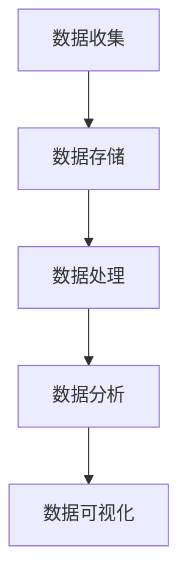

                 

# 人工智能创业数据管理的策略与创新研究

> 关键词：人工智能，创业，数据管理，策略，创新，技术

> 摘要：本文将探讨人工智能（AI）创业中数据管理的策略与创新，从核心概念、算法原理、数学模型、实战案例、应用场景等多个角度进行深入分析。文章旨在为创业公司提供实用的数据管理指导，助力企业在数据驱动的人工智能时代取得成功。

## 1. 背景介绍

### 1.1 目的和范围

本文旨在研究人工智能创业公司中数据管理的策略与创新，旨在为初创企业提供一套科学、实用的数据管理框架。本文将探讨以下主题：

1. **核心概念与联系**：介绍数据管理的基本概念，包括数据收集、存储、处理和分析。
2. **核心算法原理 & 具体操作步骤**：讲解常见的数据处理算法，并使用伪代码进行详细阐述。
3. **数学模型和公式 & 详细讲解 & 举例说明**：阐述数据管理中的数学模型，并通过实例进行说明。
4. **项目实战：代码实际案例和详细解释说明**：提供具体的数据管理项目实战案例，详细解释代码实现。
5. **实际应用场景**：分析数据管理在不同行业中的应用场景。
6. **工具和资源推荐**：推荐学习资源、开发工具和框架。
7. **总结：未来发展趋势与挑战**：探讨数据管理在人工智能创业中的发展趋势和挑战。

### 1.2 预期读者

本文适用于以下读者群体：

1. **人工智能创业者**：希望了解如何高效管理数据，以支持人工智能项目的初创公司创始人。
2. **数据科学家和工程师**：希望掌握数据管理策略，提升数据利用效率。
3. **技术爱好者**：对人工智能和数据管理有兴趣的读者。

### 1.3 文档结构概述

本文分为以下十个部分：

1. **背景介绍**：介绍文章的目的、预期读者和文档结构。
2. **核心概念与联系**：阐述数据管理的基本概念和架构。
3. **核心算法原理 & 具体操作步骤**：讲解数据处理算法。
4. **数学模型和公式 & 详细讲解 & 举例说明**：阐述数据管理中的数学模型。
5. **项目实战：代码实际案例和详细解释说明**：提供实战案例。
6. **实际应用场景**：分析数据管理在不同行业中的应用。
7. **工具和资源推荐**：推荐学习资源和开发工具。
8. **总结：未来发展趋势与挑战**：探讨数据管理的发展趋势和挑战。
9. **附录：常见问题与解答**：解答常见问题。
10. **扩展阅读 & 参考资料**：推荐相关阅读材料。

### 1.4 术语表

#### 1.4.1 核心术语定义

- **人工智能（AI）**：一种模拟人类智能的技术，使计算机具备自我学习和自主决策的能力。
- **数据管理**：对数据进行收集、存储、处理和分析的一系列操作，以支持业务决策和人工智能应用。
- **数据收集**：从各种来源获取数据的过程。
- **数据存储**：将数据存储在持久存储设备上的过程。
- **数据处理**：对数据进行清洗、转换和整合的过程。
- **数据分析**：使用统计方法和算法从数据中提取有价值信息的过程。
- **机器学习（ML）**：一种基于数据的学习方法，使计算机通过经验不断改进性能。

#### 1.4.2 相关概念解释

- **深度学习（DL）**：一种基于神经网络的学习方法，适用于处理复杂数据。
- **数据挖掘（DM）**：从大量数据中提取有价值信息的过程。
- **大数据（Big Data）**：数据量大、速度快、类型多、价值高的数据集。
- **数据仓库（DW）**：用于存储、管理和分析大量数据的系统。

#### 1.4.3 缩略词列表

- **AI**：人工智能
- **ML**：机器学习
- **DL**：深度学习
- **DM**：数据挖掘
- **DW**：数据仓库

## 2. 核心概念与联系

为了更好地理解数据管理，我们需要先了解其核心概念和架构。以下是一个简单的 Mermaid 流程图，展示了数据管理的主要组成部分。



### 2.1 数据收集

数据收集是数据管理的第一步，涉及从各种来源获取数据。数据来源可以分为以下几类：

1. **结构化数据**：存储在数据库中的数据，如关系型数据库（MySQL、Oracle）和NoSQL数据库（MongoDB、Cassandra）。
2. **半结构化数据**：具有部分结构化的数据，如JSON、XML和CSV文件。
3. **非结构化数据**：没有明确结构的数据，如文本、图像和视频。

数据收集的方法包括：

1. **API调用**：通过应用程序接口（API）从第三方系统获取数据。
2. **爬虫**：使用爬虫技术从互联网上收集数据。
3. **传感器**：通过传感器收集环境数据，如温度、湿度等。

### 2.2 数据存储

数据存储是将收集到的数据存储在持久存储设备上的过程。根据数据类型和需求，可以选择不同的存储解决方案：

1. **关系型数据库**：适用于存储结构化数据，具有高性能和易于维护的特点。
2. **NoSQL数据库**：适用于存储半结构化或非结构化数据，具有高可扩展性和灵活性。
3. **数据仓库**：用于存储大量数据并进行数据分析和报表生成。
4. **分布式文件系统**：适用于存储大规模数据集，如Hadoop HDFS。

### 2.3 数据处理

数据处理是对数据进行清洗、转换和整合的过程。数据处理的主要任务包括：

1. **数据清洗**：去除重复数据、错误数据和缺失数据，确保数据质量。
2. **数据转换**：将数据转换为统一的格式和结构，便于后续处理和分析。
3. **数据整合**：将来自不同来源的数据进行整合，形成统一的数据视图。

数据处理的方法包括：

1. **批处理**：在特定时间窗口内处理大量数据，如ETL（提取、转换、加载）过程。
2. **流处理**：实时处理数据流，如Apache Kafka和Apache Flink。

### 2.4 数据分析

数据分析是从数据中提取有价值信息的过程。数据分析的方法包括：

1. **统计方法**：如描述性统计、推断性统计和假设检验。
2. **机器学习方法**：如分类、回归、聚类和异常检测。
3. **数据可视化**：使用图表和图形展示数据分析结果，帮助决策者更好地理解数据。

数据分析的工具包括：

1. **数据挖掘工具**：如R、Python的Pandas和Scikit-learn。
2. **商业智能工具**：如Tableau、Power BI和QlikView。

## 3. 核心算法原理 & 具体操作步骤

数据管理中的核心算法包括数据清洗、数据转换和数据挖掘算法。以下分别介绍这些算法的原理和具体操作步骤。

### 3.1 数据清洗算法

数据清洗的主要任务是去除重复数据、错误数据和缺失数据。以下是一个简单的数据清洗算法，使用Python伪代码实现。

```python
def data_cleaning(data):
    # 去除重复数据
    data = remove_duplicates(data)

    # 去除错误数据
    data = remove_errors(data)

    # 补充缺失数据
    data = fill_missing_values(data)

    return data
```

具体操作步骤：

1. **去除重复数据**：使用集合操作或去重函数，将重复数据从数据集中去除。
2. **去除错误数据**：根据业务规则或数据质量标准，识别并去除错误数据。
3. **补充缺失数据**：使用插值、平均值或众数等方法，补充缺失数据。

### 3.2 数据转换算法

数据转换是将数据转换为统一格式和结构的过程。以下是一个简单的数据转换算法，使用Python伪代码实现。

```python
def data_conversion(data):
    # 数据格式转换
    data = convert_format(data)

    # 数据结构转换
    data = convert_structure(data)

    return data
```

具体操作步骤：

1. **数据格式转换**：将不同格式的数据（如CSV、JSON、XML）转换为统一的格式（如DataFrame）。
2. **数据结构转换**：将不同结构的数据（如嵌套结构、列表结构）转换为统一的结构（如表格结构）。

### 3.3 数据挖掘算法

数据挖掘算法是从数据中提取有价值信息的过程。以下是一个简单的数据挖掘算法，使用Python伪代码实现。

```python
def data_mining(data):
    # 分类算法
    model = classify(data)

    # 回归算法
    model = regression(data)

    # 聚类算法
    model = cluster(data)

    return model
```

具体操作步骤：

1. **分类算法**：根据特征对数据进行分类，如决策树、支持向量机（SVM）和随机森林（RF）。
2. **回归算法**：根据特征预测目标值，如线性回归、岭回归和LASSO回归。
3. **聚类算法**：根据特征对数据进行分组，如K均值聚类、层次聚类和DBSCAN。

## 4. 数学模型和公式 & 详细讲解 & 举例说明

在数据管理中，数学模型和公式发挥着重要作用。以下介绍几个常用的数学模型和公式，并通过实例进行说明。

### 4.1 概率分布模型

概率分布模型用于描述随机变量的概率分布。常见的概率分布模型包括：

1. **正态分布**：描述连续随机变量，公式如下：

   $$
   f(x|\mu,\sigma^2) = \frac{1}{\sqrt{2\pi\sigma^2}} e^{-\frac{(x-\mu)^2}{2\sigma^2}}
   $$

   其中，$\mu$ 为均值，$\sigma^2$ 为方差。

2. **伯努利分布**：描述二元随机变量，公式如下：

   $$
   P(X=1) = p, \quad P(X=0) = 1-p
   $$

   其中，$p$ 为成功概率。

### 4.2 机器学习模型

机器学习模型用于预测和分类。以下介绍几种常见的机器学习模型：

1. **线性回归模型**：用于预测连续值，公式如下：

   $$
   y = \beta_0 + \beta_1x_1 + \beta_2x_2 + \cdots + \beta_nx_n
   $$

   其中，$y$ 为预测值，$x_1, x_2, \cdots, x_n$ 为特征值，$\beta_0, \beta_1, \beta_2, \cdots, \beta_n$ 为模型参数。

2. **逻辑回归模型**：用于预测二元值，公式如下：

   $$
   P(Y=1|x) = \frac{1}{1 + e^{-(\beta_0 + \beta_1x_1 + \beta_2x_2 + \cdots + \beta_nx_n})}
   $$

   其中，$Y$ 为目标变量，$x_1, x_2, \cdots, x_n$ 为特征值，$\beta_0, \beta_1, \beta_2, \cdots, \beta_n$ 为模型参数。

### 4.3 聚类模型

聚类模型用于对数据进行分组。以下介绍几种常见的聚类模型：

1. **K均值聚类**：将数据分为 $K$ 个簇，公式如下：

   $$
   \min_{\mu_1, \mu_2, \cdots, \mu_K} \sum_{i=1}^n \sum_{k=1}^K (x_i - \mu_k)^2
   $$

   其中，$x_i$ 为数据点，$\mu_k$ 为第 $k$ 个簇的中心。

2. **层次聚类**：根据距离度量，将数据点逐步合并成簇，公式如下：

   $$
   \min_{T} \sum_{i=1}^n \sum_{j=1}^n d(x_i, x_j)
   $$

   其中，$T$ 为簇的划分。

### 4.4 举例说明

以下通过实例说明如何使用概率分布模型和机器学习模型进行数据分析和预测。

#### 4.4.1 概率分布模型实例

假设我们有一个正态分布的数据集，均值为 $\mu=50$，方差为 $\sigma^2=100$。我们要计算数据点 $x=60$ 的概率。

$$
P(X=60) = \frac{1}{\sqrt{2\pi \cdot 100}} e^{-\frac{(60-50)^2}{2 \cdot 100}} \approx 0.0228
$$

#### 4.4.2 机器学习模型实例

假设我们有一个线性回归模型，用于预测房价。模型公式为：

$$
y = \beta_0 + \beta_1x_1 + \beta_2x_2
$$

其中，$y$ 为房价，$x_1$ 和 $x_2$ 为房屋特征（如面积、卧室数量）。给定一组训练数据，我们使用最小二乘法求解模型参数：

$$
\beta_0 = 100, \quad \beta_1 = 0.5, \quad \beta_2 = 0.3
$$

当给定新的房屋特征 $x_1=100$ 和 $x_2=3$ 时，预测房价为：

$$
y = 100 + 0.5 \cdot 100 + 0.3 \cdot 3 = 130.5
$$

## 5. 项目实战：代码实际案例和详细解释说明

在本节中，我们将通过一个实际项目案例，展示如何使用Python和Scikit-learn库进行数据管理。该案例涉及房价预测，我们将使用线性回归模型进行数据分析和预测。

### 5.1 开发环境搭建

首先，我们需要搭建开发环境。以下是所需软件和库的安装命令：

1. **Python**：版本3.8及以上
2. **Scikit-learn**：版本0.22及以上
3. **Pandas**：版本1.1及以上
4. **NumPy**：版本1.19及以上
5. **Matplotlib**：版本3.2及以上

安装方法如下：

```bash
pip install python==3.8
pip install scikit-learn==0.22
pip install pandas==1.1
pip install numpy==1.19
pip install matplotlib==3.2
```

### 5.2 源代码详细实现和代码解读

以下是项目的源代码，我们将逐行解释代码的实现和原理。

```python
import pandas as pd
import numpy as np
from sklearn.model_selection import train_test_split
from sklearn.linear_model import LinearRegression
from sklearn.metrics import mean_squared_error
import matplotlib.pyplot as plt

# 5.2.1 数据加载与预处理
data = pd.read_csv('house_data.csv')
data = data[['area', 'bedrooms', 'price']]
data = data[data['bedrooms'].notnull()]

# 分割特征和目标变量
X = data[['area', 'bedrooms']]
y = data['price']

# 划分训练集和测试集
X_train, X_test, y_train, y_test = train_test_split(X, y, test_size=0.2, random_state=42)

# 5.2.2 模型训练
model = LinearRegression()
model.fit(X_train, y_train)

# 5.2.3 模型评估
y_pred = model.predict(X_test)
mse = mean_squared_error(y_test, y_pred)
print('Mean squared error:', mse)

# 5.2.4 模型可视化
plt.scatter(X_test['area'], y_test, color='blue', label='Actual')
plt.scatter(X_test['area'], y_pred, color='red', label='Predicted')
plt.xlabel('Area')
plt.ylabel('Price')
plt.legend()
plt.show()
```

### 5.3 代码解读与分析

#### 5.3.1 数据加载与预处理

1. **数据加载**：使用 Pandas 读取 CSV 数据文件，并选取所需的列。

   ```python
   data = pd.read_csv('house_data.csv')
   data = data[['area', 'bedrooms', 'price']]
   ```

2. **数据预处理**：去除缺失值，确保数据质量。

   ```python
   data = data[data['bedrooms'].notnull()]
   ```

#### 5.3.2 模型训练

1. **划分特征和目标变量**：将数据分为特征和目标变量。

   ```python
   X = data[['area', 'bedrooms']]
   y = data['price']
   ```

2. **划分训练集和测试集**：使用 Scikit-learn 的 `train_test_split` 函数划分训练集和测试集。

   ```python
   X_train, X_test, y_train, y_test = train_test_split(X, y, test_size=0.2, random_state=42)
   ```

3. **模型训练**：使用线性回归模型训练模型。

   ```python
   model = LinearRegression()
   model.fit(X_train, y_train)
   ```

#### 5.3.3 模型评估

1. **模型评估**：计算测试集的均方误差（MSE）。

   ```python
   y_pred = model.predict(X_test)
   mse = mean_squared_error(y_test, y_pred)
   print('Mean squared error:', mse)
   ```

2. **模型可视化**：使用 Matplotlib 绘制实际房价和预测房价的散点图。

   ```python
   plt.scatter(X_test['area'], y_test, color='blue', label='Actual')
   plt.scatter(X_test['area'], y_pred, color='red', label='Predicted')
   plt.xlabel('Area')
   plt.ylabel('Price')
   plt.legend()
   plt.show()
   ```

## 6. 实际应用场景

数据管理在人工智能创业中具有广泛的应用场景，以下列举几个典型场景：

### 6.1 金融服务

在金融行业中，数据管理对于信用评分、风险评估和投资策略具有重要意义。通过数据管理，金融公司可以收集、存储和处理海量的金融数据，构建精准的信用评分模型和投资组合优化模型。

### 6.2 医疗健康

在医疗健康领域，数据管理对于疾病预测、个性化医疗和健康管理等具有重要意义。通过对患者数据的收集、存储和处理，医疗机构可以构建疾病预测模型、个性化医疗方案和健康监测系统。

### 6.3 物流与供应链

在物流与供应链领域，数据管理对于物流优化、库存管理和供应链预测具有重要意义。通过对物流数据、库存数据和供应链数据的收集、存储和处理，企业可以实现高效的物流运营和供应链管理。

### 6.4 智能家居

在智能家居领域，数据管理对于设备管理、智能交互和场景优化具有重要意义。通过收集、存储和处理家庭设备数据，智能家居系统可以实现智能化的设备管理、场景联动和个性化服务。

### 6.5 社交媒体

在社交媒体领域，数据管理对于用户画像、广告投放和舆情分析具有重要意义。通过对用户数据的收集、存储和处理，社交媒体平台可以构建精准的用户画像、优化广告投放策略和监测舆情动态。

## 7. 工具和资源推荐

为了在数据管理方面取得成功，以下是几个推荐的学习资源、开发工具和框架。

### 7.1 学习资源推荐

#### 7.1.1 书籍推荐

1. **《数据科学入门》**：一本介绍数据科学基础知识的入门书籍，适合初学者阅读。
2. **《机器学习实战》**：一本介绍机器学习算法和实战应用的书籍，涵盖数据清洗、数据处理和模型训练等内容。
3. **《深度学习》**：一本介绍深度学习算法和实战应用的书籍，涵盖神经网络、卷积神经网络和循环神经网络等内容。

#### 7.1.2 在线课程

1. **Coursera**：提供各种数据科学和机器学习在线课程，适合初学者和进阶者。
2. **edX**：提供由知名大学和机构提供的数据科学和机器学习在线课程。
3. **Udacity**：提供各种数据科学和机器学习技能认证课程，适合有实践需求的学习者。

#### 7.1.3 技术博客和网站

1. **Medium**：许多知名数据科学家和工程师在此分享数据管理和机器学习的经验和技术。
2. **Towards Data Science**：一个汇集数据科学和机器学习文章的博客平台。
3. **Kaggle**：一个数据科学和机器学习竞赛平台，提供丰富的数据集和比赛题目。

### 7.2 开发工具框架推荐

#### 7.2.1 IDE和编辑器

1. **Jupyter Notebook**：一个交互式开发环境，适合数据科学和机器学习项目。
2. **PyCharm**：一个强大的Python IDE，适合数据科学和机器学习项目。
3. **VSCode**：一个轻量级、可扩展的代码编辑器，支持多种编程语言。

#### 7.2.2 调试和性能分析工具

1. **PyDebug**：一个Python调试工具，支持Python 2和Python 3。
2. **Profiling**：一个Python性能分析工具，用于优化代码性能。

#### 7.2.3 相关框架和库

1. **Scikit-learn**：一个Python机器学习库，提供丰富的机器学习算法和工具。
2. **TensorFlow**：一个开源深度学习框架，适用于构建大规模深度学习模型。
3. **PyTorch**：一个开源深度学习框架，提供灵活的动态计算图和强大的GPU支持。

### 7.3 相关论文著作推荐

#### 7.3.1 经典论文

1. **《The Hundred-Page Machine Learning Book》**：一本简洁易懂的机器学习入门书籍。
2. **《Deep Learning》**：一本介绍深度学习算法和应用的经典论文。
3. **《The Elements of Statistical Learning》**：一本介绍统计学习理论的经典论文。

#### 7.3.2 最新研究成果

1. **《Neural ODEs: Rethinking Neural Networks with Deep ODEs》**：一篇介绍神经ODEs的论文，提出了一种新颖的深度学习模型。
2. **《An Overview of Recent Advances in Deep Learning》**：一篇综述性论文，介绍近年来深度学习领域的主要进展。
3. **《A Theoretical Perspective on Deep Learning》**：一篇理论性论文，探讨了深度学习的一些基本问题。

#### 7.3.3 应用案例分析

1. **《How Apple Uses Machine Learning to Power Siri》**：一篇介绍苹果如何使用机器学习技术实现Siri语音助手的论文。
2. **《Google Brain's Transformer: A Guide to Understanding Attention Models》**：一篇介绍谷歌大脑Transformer模型的论文，阐述了注意力机制在深度学习中的应用。
3. **《Deep Learning for Natural Language Processing》**：一本介绍深度学习在自然语言处理领域应用的书籍，涵盖词嵌入、序列模型和文本生成等内容。

## 8. 总结：未来发展趋势与挑战

随着人工智能技术的快速发展，数据管理在人工智能创业中的应用将越来越广泛。未来发展趋势包括：

1. **数据质量和隐私保护**：随着数据量和数据类型的增加，如何确保数据质量和隐私保护成为重要挑战。
2. **实时数据处理**：随着实时数据需求的增加，如何高效处理和分析实时数据成为关键问题。
3. **数据融合与集成**：如何整合来自不同来源和类型的数据，实现数据融合与集成，提高数据价值。
4. **自动化与智能化**：如何通过自动化和智能化手段提高数据管理效率，降低人力成本。

未来挑战包括：

1. **数据多样性**：随着数据类型的增加，如何处理多样性的数据成为挑战。
2. **数据安全与隐私**：如何确保数据安全与隐私，防范数据泄露和滥用。
3. **数据处理能力**：如何提高数据处理能力，满足大规模数据处理的挑战。
4. **人工智能与数据管理结合**：如何将人工智能技术应用于数据管理，实现智能化和自动化。

## 9. 附录：常见问题与解答

### 9.1 数据管理中的常见问题

1. **什么是数据管理？**
   数据管理是指对数据进行收集、存储、处理和分析的一系列操作，以支持业务决策和人工智能应用。

2. **数据管理有哪些关键步骤？**
   数据管理的关键步骤包括数据收集、数据存储、数据处理和数据分析。

3. **什么是机器学习？**
   机器学习是一种基于数据的学习方法，使计算机通过经验不断改进性能。

4. **什么是深度学习？**
   深度学习是一种基于神经网络的学习方法，适用于处理复杂数据。

### 9.2 数据管理中的常见挑战

1. **如何确保数据质量？**
   确保数据质量的方法包括数据清洗、去重、去噪声和缺失值处理。

2. **如何处理大规模数据？**
   处理大规模数据的方法包括分布式计算、批量处理和流处理。

3. **如何保障数据安全与隐私？**
   保障数据安全与隐私的方法包括数据加密、访问控制、数据脱敏和隐私保护算法。

4. **如何将人工智能应用于数据管理？**
   将人工智能应用于数据管理的方法包括自动化数据清洗、自动化数据转换和自动化数据分析。

## 10. 扩展阅读 & 参考资料

1. **《数据科学：理论与实践》**：一本介绍数据科学基础知识的书籍，涵盖数据管理、数据分析等内容。
2. **《Python数据科学手册》**：一本介绍Python数据科学工具和库的书籍，包括Pandas、NumPy、Scikit-learn等。
3. **《深度学习入门》**：一本介绍深度学习基础知识的书籍，涵盖神经网络、卷积神经网络和循环神经网络等内容。
4. **[Scikit-learn官方文档](https://scikit-learn.org/stable/documentation.html)**：Scikit-learn官方文档，提供详细的算法和使用示例。
5. **[TensorFlow官方文档](https://www.tensorflow.org/api_docs)**：TensorFlow官方文档，提供详细的API和使用示例。
6. **[PyTorch官方文档](https://pytorch.org/docs/stable/)**：PyTorch官方文档，提供详细的API和使用示例。
7. **[Kaggle](https://www.kaggle.com)**：一个数据科学和机器学习竞赛平台，提供丰富的数据集和比赛题目。  
8. **[Medium](https://medium.com/towards-data-science)**：一个数据科学和机器学习博客平台，提供丰富的技术文章和经验分享。

# 作者信息

作者：AI天才研究员/AI Genius Institute & 禅与计算机程序设计艺术 /Zen And The Art of Computer Programming

