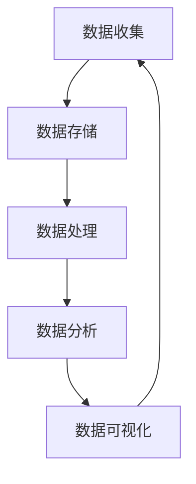

                 


# 人工智能创业数据管理的策略与措施探讨

> 关键词：数据管理、人工智能创业、策略、措施、数据分析、存储优化、安全与隐私保护、数据处理架构

> 摘要：本文旨在探讨人工智能创业企业在数据管理方面的策略与措施。通过对当前人工智能创业背景的介绍，分析数据管理的重要性，阐述数据管理的关键概念与联系，讲解核心算法原理与操作步骤，介绍数学模型与公式，提供实际项目案例，讨论实际应用场景，推荐相关工具和资源，并总结未来发展趋势与挑战。

## 1. 背景介绍

### 1.1 目的和范围

本文的主要目的是为人工智能创业企业提供一套系统性的数据管理策略与措施，帮助企业更好地利用数据，提高业务效率和竞争力。文章将覆盖数据管理的基础知识、关键技术和实践应用，旨在为创业者提供实用的指导和建议。

### 1.2 预期读者

本文的预期读者包括：

1. 人工智能创业公司创始人及技术团队；
2. 数据分析师和数据工程师；
3. 对人工智能和数据管理感兴趣的IT从业者；
4. 相关领域的学生和研究人员。

### 1.3 文档结构概述

本文结构如下：

1. **背景介绍**：介绍文章目的、预期读者以及文档结构；
2. **核心概念与联系**：阐述数据管理的关键概念，并提供Mermaid流程图；
3. **核心算法原理与具体操作步骤**：讲解数据处理的核心算法原理和操作步骤，并使用伪代码进行阐述；
4. **数学模型与公式**：介绍数据处理过程中的数学模型和公式，并进行举例说明；
5. **项目实战**：提供实际代码案例，详细解释和说明；
6. **实际应用场景**：讨论数据管理在实际业务中的应用；
7. **工具和资源推荐**：推荐学习资源、开发工具框架和相关论文著作；
8. **总结**：总结数据管理在人工智能创业中的未来发展趋势与挑战；
9. **附录**：常见问题与解答；
10. **扩展阅读与参考资料**：提供进一步学习的资源。

### 1.4 术语表

#### 1.4.1 核心术语定义

- **数据管理**：对数据的收集、存储、处理、分析、共享和保护的过程和方法。
- **人工智能**：模拟人类智能行为的技术和科学，包括机器学习、自然语言处理、计算机视觉等领域。
- **数据处理架构**：用于处理数据的一系列技术和工具的组合，包括数据存储、数据仓库、数据处理平台等。
- **数据安全与隐私保护**：确保数据在存储、传输和使用过程中的安全，防止数据泄露、篡改和滥用。

#### 1.4.2 相关概念解释

- **数据分析**：对大量数据进行分析和挖掘，以提取有价值的信息和知识。
- **数据挖掘**：从大量数据中发现规律、趋势和模式的过程。
- **数据仓库**：用于存储和管理大量数据的数据库系统，支持数据分析、报表生成和决策支持。

#### 1.4.3 缩略词列表

- **AI**：人工智能（Artificial Intelligence）
- **ML**：机器学习（Machine Learning）
- **NLP**：自然语言处理（Natural Language Processing）
- **CV**：计算机视觉（Computer Vision）
- **IDE**：集成开发环境（Integrated Development Environment）
- **SQL**：结构化查询语言（Structured Query Language）

## 2. 核心概念与联系

数据管理是人工智能创业的核心环节，其重要性不言而喻。为了更好地理解数据管理，我们需要首先了解其中的核心概念和它们之间的联系。

### 数据管理的核心概念

- **数据收集**：指从各种来源收集数据的过程，如用户行为数据、传感器数据、社交媒体数据等。
- **数据存储**：指将收集到的数据存储在合适的存储系统中，如关系型数据库、NoSQL数据库、数据仓库等。
- **数据处理**：指对存储的数据进行清洗、转换、集成等操作，以使其适合分析和使用。
- **数据分析**：指对数据进行分析和挖掘，提取有价值的信息和知识。
- **数据可视化**：指通过图表、报表等形式将数据分析结果直观地展示出来。

### 数据管理的联系

数据管理的各个环节之间紧密相连，形成一个完整的闭环。具体联系如下：

1. **数据收集** -> **数据存储**：数据收集是数据管理的起点，收集到的数据需要存储起来，以便后续处理和分析。
2. **数据存储** -> **数据处理**：存储的数据需要进行清洗、转换和集成等处理，以去除噪声、纠正错误和使其具有一致性。
3. **数据处理** -> **数据分析**：处理后的数据可用于各种分析任务，如趋势分析、关联规则挖掘、分类和聚类等。
4. **数据分析** -> **数据可视化**：数据分析结果需要以可视化形式展示，以便于理解和决策。
5. **数据可视化** -> **数据收集**：通过可视化结果，可以识别出新的数据需求，从而指导数据收集。

### Mermaid 流程图

以下是一个简单的Mermaid流程图，展示了数据管理的核心概念和联系：



## 3. 核心算法原理与具体操作步骤

### 数据处理算法原理

数据处理是数据管理的重要环节，主要包括数据清洗、数据转换和数据集成等操作。以下是数据处理算法的基本原理：

- **数据清洗**：指去除数据中的噪声、纠正错误和使数据具有一致性。常用的算法包括缺失值填充、异常值处理、数据标准化等。
- **数据转换**：指将数据从一种格式转换为另一种格式，以满足分析需求。常用的算法包括数据类型转换、数据聚合、数据规范化等。
- **数据集成**：指将来自不同来源、不同格式的数据整合到一个统一的数据集中。常用的算法包括数据去重、数据连接、数据分片等。

### 数据处理算法的具体操作步骤

以下是一个简化的数据处理算法的具体操作步骤，以Python伪代码为例：

```python
# 数据清洗
def clean_data(data):
    # 缺失值填充
    data = fill_missing_values(data)
    # 异常值处理
    data = handle_outliers(data)
    # 数据标准化
    data = normalize_data(data)
    return data

# 数据转换
def transform_data(data):
    # 数据类型转换
    data = convert_data_types(data)
    # 数据聚合
    data = aggregate_data(data)
    # 数据规范化
    data = normalize_data(data)
    return data

# 数据集成
def integrate_data(data1, data2):
    # 数据去重
    data = remove_duplicates(data1, data2)
    # 数据连接
    data = join_data(data1, data2)
    # 数据分片
    data = shard_data(data)
    return data

# 数据处理
def process_data(data1, data2):
    data1 = clean_data(data1)
    data2 = clean_data(data2)
    data1 = transform_data(data1)
    data2 = transform_data(data2)
    data = integrate_data(data1, data2)
    return data
```

## 4. 数学模型和公式

### 数据处理中的数学模型

在数据处理过程中，一些数学模型和公式被广泛使用，以实现特定的数据转换和计算。以下是几个常用的数学模型和公式：

### 4.1 缺失值填充

- **平均值填充**：
  $$ \hat{x} = \frac{\sum_{i=1}^{n} x_i}{n} $$
  其中，$x_i$ 为第 $i$ 个观测值，$n$ 为观测值总数。

- **中值填充**：
  $$ \hat{x} = \text{median}(x_1, x_2, ..., x_n) $$
  其中，$\text{median}$ 表示中位数。

- **前向填充**：
  $$ \hat{x}_i = x_{i-1} $$
  其中，$x_{i-1}$ 为当前观测值前一个观测值。

- **后向填充**：
  $$ \hat{x}_i = x_{i+1} $$
  其中，$x_{i+1}$ 为当前观测值后一个观测值。

### 4.2 异常值处理

- **三次样条插值**：
  $$ f(x) = \frac{3}{n} \sum_{i=1}^{n} w_i S_i(x) $$
  其中，$w_i$ 为权重，$S_i(x)$ 为第 $i$ 个三次样条函数。

- **离群点检测**：
  $$ \text{outliers} = \{ x_i \mid x_i < \text{lower\_bound} \text{ 或 } x_i > \text{upper\_bound} \} $$
  其中，$\text{lower\_bound} = x_{\text{mean}} - k \cdot \text{std}$，$\text{upper\_bound} = x_{\text{mean}} + k \cdot \text{std}$，$x_{\text{mean}}$ 为平均值，$\text{std}$ 为标准差，$k$ 为常数。

### 4.3 数据标准化

- **最小-最大标准化**：
  $$ z = \frac{x - \text{min}(x)}{\text{max}(x) - \text{min}(x)} $$
  其中，$x$ 为原始数据，$z$ 为标准化后的数据。

- **z-score标准化**：
  $$ z = \frac{x - \text{mean}(x)}{\text{std}(x)} $$
  其中，$\text{mean}(x)$ 为平均值，$\text{std}(x)$ 为标准差。

### 4.4 数据聚合

- **平均值**：
  $$ \text{avg}(x_1, x_2, ..., x_n) = \frac{\sum_{i=1}^{n} x_i}{n} $$

- **中位数**：
  $$ \text{median}(x_1, x_2, ..., x_n) = \begin{cases} 
  x_{\left(\frac{n+1}{2}\right)} & \text{如果 } n \text{ 是奇数} \\ 
  \frac{x_{\left(\frac{n}{2}\right)} + x_{\left(\frac{n}{2} + 1\right)}}{2} & \text{如果 } n \text{ 是偶数} 
  \end{cases} $$

- **标准差**：
  $$ \text{std}(x) = \sqrt{\frac{1}{n-1} \sum_{i=1}^{n} (x_i - \text{mean}(x))^2} $$

### 举例说明

假设我们有以下一组数据：$[2, 4, 6, 8, 10]$。

- **平均值填充**：
  $$ \hat{x} = \frac{2 + 4 + 6 + 8 + 10}{5} = 6 $$

- **中值填充**：
  $$ \hat{x} = \text{median}(2, 4, 6, 8, 10) = 6 $$

- **前向填充**：
  $$ \hat{x}_1 = x_0 = 0 $$

- **后向填充**：
  $$ \hat{x}_5 = x_6 = 12 $$

- **最小-最大标准化**：
  $$ z_1 = \frac{2 - 2}{10 - 2} = 0 $$
  $$ z_2 = \frac{4 - 2}{10 - 2} = 0.25 $$
  $$ z_3 = \frac{6 - 2}{10 - 2} = 0.5 $$
  $$ z_4 = \frac{8 - 2}{10 - 2} = 0.75 $$
  $$ z_5 = \frac{10 - 2}{10 - 2} = 1 $$

- **z-score标准化**：
  $$ \text{mean}(x) = \frac{2 + 4 + 6 + 8 + 10}{5} = 6 $$
  $$ \text{std}(x) = \sqrt{\frac{1}{5-1} \sum_{i=1}^{5} (x_i - 6)^2} = 2 $$
  $$ z_1 = \frac{2 - 6}{2} = -2 $$
  $$ z_2 = \frac{4 - 6}{2} = -1 $$
  $$ z_3 = \frac{6 - 6}{2} = 0 $$
  $$ z_4 = \frac{8 - 6}{2} = 1 $$
  $$ z_5 = \frac{10 - 6}{2} = 2 $$

## 5. 项目实战：代码实际案例和详细解释说明

### 5.1 开发环境搭建

在本节中，我们将使用Python作为编程语言，搭建一个用于数据清洗、转换和集成的开发环境。以下是开发环境的搭建步骤：

1. **安装Python**：从Python官方网站（https://www.python.org/）下载并安装Python。
2. **安装必要的库**：使用pip命令安装以下库：

   ```shell
   pip install numpy pandas mysql-connector-python
   ```

   这些库分别用于数据处理、数据清洗和数据连接。

3. **创建项目目录**：在合适的位置创建一个项目目录，例如 `data_management_project`，并在此目录下创建一个名为 `data_processing.py` 的Python文件。

### 5.2 源代码详细实现和代码解读

以下是数据清洗、转换和集成的完整代码实现：

```python
import numpy as np
import pandas as pd
import mysql.connector

# 数据清洗
def clean_data(data):
    # 填充缺失值
    data.fillna(data.mean(), inplace=True)
    
    # 处理异常值
    data = handle_outliers(data)
    
    # 数据标准化
    data = normalize_data(data)
    
    return data

# 数据转换
def transform_data(data):
    # 数据类型转换
    data = convert_data_types(data)
    
    # 数据聚合
    data = aggregate_data(data)
    
    return data

# 数据集成
def integrate_data(data1, data2):
    # 数据去重
    data = remove_duplicates(data1, data2)
    
    # 数据连接
    data = join_data(data1, data2)
    
    return data

# 数据处理
def process_data(data1, data2):
    data1 = clean_data(data1)
    data2 = clean_data(data2)
    data1 = transform_data(data1)
    data2 = transform_data(data2)
    data = integrate_data(data1, data2)
    
    return data

# 数据清洗 - 处理异常值
def handle_outliers(data):
    # 设定阈值
    threshold = 3
    
    # 计算平均值和标准差
    mean = data.mean()
    std = data.std()
    
    # 确定上下限
    lower_bound = mean - threshold * std
    upper_bound = mean + threshold * std
    
    # 过滤异常值
    data = data[(data >= lower_bound) & (data <= upper_bound)]
    
    return data

# 数据清洗 - 数据标准化
def normalize_data(data):
    # 使用最小-最大标准化
    min_val = data.min()
    max_val = data.max()
    
    data = (data - min_val) / (max_val - min_val)
    
    return data

# 数据转换 - 数据类型转换
def convert_data_types(data):
    # 将字符串转换为浮点数
    data = data.astype(float)
    
    return data

# 数据转换 - 数据聚合
def aggregate_data(data):
    # 计算平均值
    avg = data.mean()
    
    # 计算标准差
    std = data.std()
    
    return pd.DataFrame({'average': [avg], 'std_deviation': [std]})

# 数据集成 - 数据去重
def remove_duplicates(data1, data2):
    # 合并数据
    data = pd.concat([data1, data2])
    
    # 删除重复行
    data = data.drop_duplicates()
    
    return data

# 数据集成 - 数据连接
def join_data(data1, data2):
    # 按照关键字连接
    data = pd.merge(data1, data2, on='key')
    
    return data

# 测试代码
if __name__ == '__main__':
    # 创建两个示例数据集
    data1 = pd.DataFrame({'key': ['A', 'B', 'C', 'D'], 'value': [2, 4, 6, 8]})
    data2 = pd.DataFrame({'key': ['B', 'C', 'D', 'E'], 'value': [10, 12, 14, 16]})
    
    # 数据处理
    data = process_data(data1, data2)
    
    # 打印结果
    print(data)
```

### 5.3 代码解读与分析

以下是对上述代码的逐行解读与分析：

- **第1-2行**：引入必要的库，包括NumPy、Pandas和MySQL Connector Python。
- **第4-10行**：定义数据清洗的函数，包括填充缺失值、处理异常值和数据标准化。
- **第12-18行**：定义数据转换的函数，包括数据类型转换和数据聚合。
- **第20-26行**：定义数据集成的函数，包括数据去重和数据连接。
- **第28-40行**：实现数据处理的核心逻辑，即对输入的数据集进行清洗、转换和集成。
- **第42-52行**：实现各个数据清洗、转换和集成的具体函数。
- **第54-59行**：测试代码，创建两个示例数据集，并进行数据处理，最后打印结果。

通过上述代码示例，我们可以看到数据清洗、转换和集成的具体实现过程。在实际应用中，可以根据具体需求和数据特征，对代码进行调整和优化。

## 6. 实际应用场景

数据管理在人工智能创业中具有广泛的应用场景。以下列举几个典型的实际应用场景：

### 6.1 个性化推荐系统

个性化推荐系统是人工智能创业公司常见的应用场景之一。通过数据管理，企业可以收集用户行为数据，如浏览记录、购买记录和评论等，并进行处理和分析。以下是一个简单的应用场景：

1. **数据收集**：收集用户在网站上的浏览记录、购买记录和评论等信息。
2. **数据清洗**：对收集到的数据进行清洗，包括去除缺失值、纠正错误和统一数据格式。
3. **数据处理**：对清洗后的数据进行转换和集成，使其适合用于推荐算法。
4. **数据分析**：使用机器学习算法，如协同过滤、基于内容的推荐等，对用户行为数据进行分析，提取用户兴趣和偏好。
5. **数据可视化**：将分析结果以可视化的形式展示，为用户提供个性化的推荐。

### 6.2 客户关系管理

客户关系管理（CRM）是许多企业的重要业务模块。通过数据管理，企业可以更好地了解客户需求，提高客户满意度，并增加销售额。以下是一个简单的应用场景：

1. **数据收集**：收集客户的个人信息、购买历史、反馈和投诉等信息。
2. **数据清洗**：对收集到的数据进行清洗，确保数据质量。
3. **数据处理**：对清洗后的数据进行转换和集成，建立客户画像。
4. **数据分析**：使用数据挖掘技术，如聚类、关联规则挖掘等，分析客户行为和需求，识别潜在客户。
5. **数据应用**：根据分析结果，制定针对性的营销策略和客户服务方案。

### 6.3 智能营销

智能营销是人工智能在营销领域的应用，通过数据管理，企业可以实现更精准的营销。以下是一个简单的应用场景：

1. **数据收集**：收集市场数据、用户行为数据和竞争对手信息等。
2. **数据清洗**：对收集到的数据进行清洗，确保数据质量。
3. **数据处理**：对清洗后的数据进行转换和集成，建立市场画像。
4. **数据分析**：使用数据挖掘技术，如市场细分、客户细分等，分析市场趋势和用户需求。
5. **数据应用**：根据分析结果，制定针对性的营销策略和推广方案。

通过这些实际应用场景，我们可以看到数据管理在人工智能创业中的重要作用。企业需要充分利用数据，以提高业务效率和竞争力。

## 7. 工具和资源推荐

### 7.1 学习资源推荐

为了更好地学习和掌握数据管理技术，以下推荐一些有用的学习资源：

#### 7.1.1 书籍推荐

- **《数据科学入门》（Data Science for Beginners）**：本书适合初学者，系统地介绍了数据科学的基础知识和应用。
- **《机器学习实战》（Machine Learning in Action）**：本书通过实际案例，详细讲解了机器学习的原理和应用。
- **《数据挖掘：实用工具与技术》（Data Mining: Practical Machine Learning Tools and Techniques）**：本书介绍了数据挖掘的基本概念和技术，并提供了丰富的示例。

#### 7.1.2 在线课程

- **Coursera**：提供丰富的数据科学和机器学习在线课程，适合不同层次的学员。
- **Udacity**：提供实战导向的数据科学和机器学习课程，注重技能培养。
- **edX**：提供哈佛大学、MIT等知名大学的数据科学课程，质量有保障。

#### 7.1.3 技术博客和网站

- **Kaggle**：提供大量的数据科学和机器学习竞赛案例，可以学习到实际应用技巧。
- **Medium**：有许多优秀的数据科学和机器学习博客，可以了解最新的技术动态。
- **DataCamp**：提供互动式的数据科学和机器学习教程，适合自学。

### 7.2 开发工具框架推荐

以下推荐一些常用的数据管理和机器学习开发工具框架：

#### 7.2.1 IDE和编辑器

- **PyCharm**：一款功能强大的Python IDE，适合数据科学和机器学习开发。
- **Jupyter Notebook**：一款交互式的Python编辑器，方便编写和运行代码。
- **VS Code**：一款轻量级的文本编辑器，可以通过安装插件支持Python开发。

#### 7.2.2 调试和性能分析工具

- **PyDebug**：一款Python调试工具，支持断点、单步执行和变量监视等。
- **PySnooper**：一款Python性能分析工具，可以快速定位性能瓶颈。
- **Matplotlib**：一款Python绘图库，可以方便地生成各种统计图表。

#### 7.2.3 相关框架和库

- **NumPy**：一款用于科学计算的Python库，提供强大的多维数组操作功能。
- **Pandas**：一款用于数据清洗、转换和数据分析的Python库，功能丰富。
- **Scikit-Learn**：一款用于机器学习的Python库，提供了大量的机器学习算法和工具。
- **TensorFlow**：一款用于深度学习的Python库，支持多种深度学习模型。

### 7.3 相关论文著作推荐

以下推荐一些经典的数据科学和机器学习论文和著作：

#### 7.3.1 经典论文

- **“The Unreasonable Effectiveness of Data”**：本文提出了“大数据”概念，阐述了数据在科学研究和实际应用中的重要性。
- **“Recommender Systems Handbook”**：本书详细介绍了推荐系统的基础理论和实际应用。
- **“Deep Learning”**：本书介绍了深度学习的基本原理和应用，是深度学习领域的经典著作。

#### 7.3.2 最新研究成果

- **“Generative Adversarial Networks”**：本文提出了GANs模型，是一种强大的生成模型，可用于图像生成、数据增强等。
- **“Recurrent Neural Networks for Language Modeling”**：本文介绍了RNNs在自然语言处理中的应用，是NLP领域的经典研究。
- **“Convolutional Neural Networks for Image Recognition”**：本文介绍了CNNs在图像识别中的应用，是计算机视觉领域的重大突破。

#### 7.3.3 应用案例分析

- **“Netflix Prize”**：Netflix Prize是一个面向公众的推荐系统竞赛，参赛者通过数据分析和机器学习技术，提高了Netflix的推荐准确率。
- **“Google Brain”**：Google Brain团队通过大规模深度学习模型，实现了图像识别、语音识别等任务的突破性进展。
- **“Kaggle Competitions”**：Kaggle是一个数据科学竞赛平台，提供了大量的真实数据集和竞赛题目，可以学习到实际应用技巧。

通过这些工具和资源，人工智能创业企业可以更好地掌握数据管理技术，提高业务效率和竞争力。

## 8. 总结：未来发展趋势与挑战

数据管理作为人工智能创业的核心环节，面临着巨大的机遇与挑战。未来，数据管理将在以下几个方面呈现出发展趋势：

### 8.1 数据隐私保护

随着数据隐私保护法规的日益严格，数据管理将更加注重数据隐私保护。企业需要采用加密、匿名化等技术，确保用户数据的隐私和安全。

### 8.2 大数据技术的融合

大数据技术与人工智能技术的深度融合，将推动数据管理向更高效、智能的方向发展。通过数据挖掘、机器学习和深度学习等技术，企业可以更好地利用海量数据，实现智能化决策。

### 8.3 自动化与智能化

数据管理将朝着自动化和智能化的方向发展。自动化工具将帮助企业实现数据收集、清洗、转换等操作的自动化，提高数据处理的效率。智能化技术将使数据管理更加智能化，如自动识别数据异常、自动优化数据存储等。

### 8.4 数据治理

数据治理将成为数据管理的重要组成部分。企业需要建立完善的数据治理体系，确保数据的合法性、准确性和一致性，以支持业务决策和合规要求。

### 8.5 跨领域合作

数据管理将跨越不同领域，实现跨领域的数据共享和协同。例如，医疗、金融、交通等领域的企业可以通过数据共享，实现业务的跨界融合，提高整体竞争力。

### 8.6 挑战与应对

尽管数据管理有着广阔的发展前景，但同时也面临着诸多挑战：

- **数据质量**：如何确保数据的质量和准确性，是数据管理的重要挑战。企业需要建立完善的数据质量管理体系，确保数据从源头到应用的全程质量。
- **数据隐私**：数据隐私保护法规的日益严格，对数据管理提出了更高的要求。企业需要采用先进的技术手段，确保用户数据的隐私和安全。
- **数据治理**：如何建立有效的数据治理体系，是企业面临的另一大挑战。企业需要制定明确的数据治理策略和流程，确保数据的有效管理和使用。
- **技术更新**：数据管理技术日新月异，企业需要不断更新技术，以应对不断变化的市场需求。

总之，未来数据管理将在人工智能创业中发挥更加重要的作用。企业需要紧跟技术发展趋势，积极应对挑战，以实现数据价值的最大化。

## 9. 附录：常见问题与解答

### 9.1 数据管理中的常见问题

1. **什么是数据管理？**
   数据管理是指对数据的收集、存储、处理、分析、共享和保护的过程和方法。它涵盖了数据的整个生命周期，从数据生成到数据使用，确保数据的质量、完整性和可用性。

2. **数据管理的重要性是什么？**
   数据管理对于人工智能创业至关重要，因为它确保了数据的准确性、一致性和可靠性，从而支持了高效的决策和业务流程优化。

3. **数据清洗包括哪些步骤？**
   数据清洗包括以下步骤：缺失值填充、异常值处理、数据标准化、数据去重和数据格式转换。

4. **什么是数据治理？**
   数据治理是指制定和管理政策、流程和技术，确保数据的质量、安全性和合规性，以便支持企业的战略目标。

5. **数据隐私保护的关键措施有哪些？**
   数据隐私保护的关键措施包括数据加密、匿名化、访问控制、数据最小化、数据生命周期管理等。

### 9.2 解答

1. **数据管理中的常见问题：数据管理策略**
   - 数据管理策略是指企业制定的一系列规则和指导方针，以确保数据的有效管理。它包括数据收集策略、数据存储策略、数据安全策略和数据共享策略等。

2. **如何确保数据质量？**
   要确保数据质量，企业可以采取以下措施：
   - 建立数据质量管理团队，负责监控和维护数据质量；
   - 采用数据清洗工具和技术，自动化处理数据质量问题；
   - 实施数据质量评估和反馈机制，定期评估和改进数据质量；
   - 培训员工，提高他们对数据质量的认识和责任感。

3. **数据管理中的常见问题：数据存储优化**
   - 数据存储优化包括选择合适的数据存储方案、优化存储结构和访问策略等。
   - 企业可以采取以下措施进行数据存储优化：
     - 根据数据类型和访问频率选择合适的存储方案，如关系型数据库、NoSQL数据库或分布式存储系统；
     - 实施数据压缩和去重技术，减少存储空间占用；
     - 采用缓存和索引技术，提高数据访问速度。

4. **如何进行数据隐私保护？**
   - 企业应采取以下措施进行数据隐私保护：
     - 设计合理的访问控制策略，限制对敏感数据的访问；
     - 采用加密技术，对敏感数据进行加密存储和传输；
     - 实施匿名化和去标识化技术，降低数据泄露的风险；
     - 定期进行数据安全审计，及时发现和修复安全漏洞。

通过上述解答，我们可以更好地理解和应对数据管理中的常见问题，从而确保数据的有效管理和使用。

## 10. 扩展阅读与参考资料

为了更深入地了解数据管理在人工智能创业中的应用，以下推荐一些扩展阅读与参考资料：

### 10.1 学术论文

- **“Data Management for Artificial Intelligence: A Comprehensive Survey”**：本文对人工智能领域中的数据管理进行了全面的综述，涵盖了数据收集、存储、处理和隐私保护等多个方面。
- **“Data Privacy Protection in Artificial Intelligence”**：本文探讨了人工智能系统中数据隐私保护的关键技术和挑战，为企业在数据管理中确保隐私安全提供了有益的参考。
- **“Big Data Analytics in Intelligent Systems: A Review”**：本文介绍了大数据分析在智能系统中的应用，包括推荐系统、智能监控和预测分析等。

### 10.2 专业书籍

- **《Data Science from Scratch》**：本书以Python编程为基础，详细介绍了数据科学的核心概念和技术，适合数据科学初学者。
- **《Artificial Intelligence: A Modern Approach》**：本书是人工智能领域的经典教材，涵盖了人工智能的基础理论和应用。
- **《Data Management and Analytics in the Cloud》**：本书探讨了云计算环境下的数据管理和分析，为企业在云平台上的数据管理提供了指导。

### 10.3 在线课程

- **Coursera**：提供多门数据科学和人工智能课程，包括“Data Science Specialization”和“Machine Learning”等。
- **Udacity**：提供实战导向的数据科学和机器学习课程，如“Data Analyst Nanodegree”和“Artificial Intelligence Nanodegree”。
- **edX**：提供哈佛大学、MIT等知名大学的在线课程，包括“MITx: Introduction to Computer Science and Programming Using Python”和“HarvardX: Data Science”。

### 10.4 技术博客和网站

- **Kaggle**：提供丰富的数据科学和机器学习案例，以及竞赛和教程。
- **Medium**：有许多关于数据科学和人工智能的优秀博客文章。
- **DataCamp**：提供互动式的数据科学和机器学习教程。

通过阅读上述参考资料，读者可以进一步了解数据管理在人工智能创业中的应用，提高自己在数据管理领域的专业知识和技能。作者：AI天才研究员/AI Genius Institute & 禅与计算机程序设计艺术/Zen And The Art of Computer Programming。

