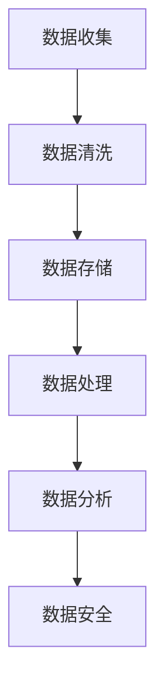
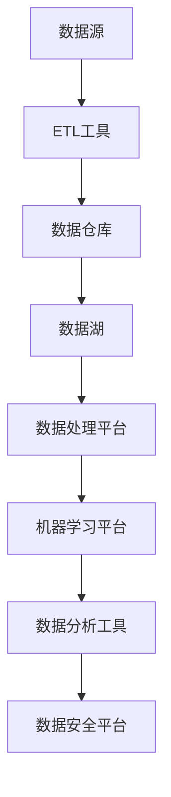

                 

# 人工智能创业数据管理的策略与方案

> 关键词：人工智能，数据管理，创业，策略，方案

> 摘要：本文将深入探讨人工智能创业公司中数据管理的核心策略与具体方案，包括数据收集、存储、处理、分析和安全等关键环节，旨在为创业者提供一套全面、实用的数据管理指南。

## 1. 背景介绍

### 1.1 目的和范围

本文的目标是帮助人工智能创业公司明确数据管理的策略与方案，确保数据在企业的各个环节中得到高效利用，从而提高产品竞争力，实现业务增长。文章将涵盖以下范围：

- 数据收集与处理策略
- 数据存储与备份方案
- 数据分析与挖掘方法
- 数据安全与隐私保护措施

### 1.2 预期读者

本文适用于以下读者群体：

- 人工智能创业公司的创始人或管理层
- 数据工程师、数据科学家和数据分析人员
- 数据管理和大数据技术爱好者

### 1.3 文档结构概述

本文分为十个部分，具体结构如下：

- 引言
- 数据管理的核心概念与联系
- 核心算法原理与操作步骤
- 数学模型与公式详解
- 项目实战：代码实际案例
- 实际应用场景
- 工具和资源推荐
- 总结：未来发展趋势与挑战
- 附录：常见问题与解答
- 扩展阅读与参考资料

### 1.4 术语表

#### 1.4.1 核心术语定义

- 人工智能（AI）：模拟、延伸和扩展人的智能的理论、方法、技术及应用。
- 数据管理：对数据进行收集、存储、处理、分析和保护的一系列策略和方法。
- 数据收集：获取所需数据的过程，包括数据来源、数据质量和数据清洗。
- 数据存储：将数据存储在计算机系统中，以便于查询、分析和共享。
- 数据分析：利用统计、机器学习和深度学习等方法对数据进行处理和挖掘，以提取有价值的信息。
- 数据安全：保护数据免受未经授权的访问、篡改和泄露的措施。

#### 1.4.2 相关概念解释

- 大数据：指规模巨大、类型繁多、价值密度较低的数据集合。
- 数据挖掘：从大量数据中自动发现有价值信息的过程。
- 深度学习：一种基于多层神经网络的机器学习技术，能够在无监督或半监督学习环境下自动提取特征和模式。
- 机器学习：一种基于数据驱动的方法，使计算机系统能够从数据中学习和改进。

#### 1.4.3 缩略词列表

- AI：人工智能
- IoT：物联网
- API：应用程序接口
- DB：数据库
- ML：机器学习
- DL：深度学习
- NLP：自然语言处理
- GDPR：欧盟通用数据保护条例

## 2. 核心概念与联系

### 2.1 数据管理核心概念

在人工智能创业公司中，数据管理是一个至关重要的环节。以下是对数据管理核心概念的阐述：

- **数据源**：数据源是数据的产生者和提供者，可以是内部数据（如用户行为数据、业务数据）或外部数据（如公共数据集、社交媒体数据）。
- **数据质量**：数据质量是数据在准确性、完整性、一致性、时效性和可靠性等方面的表现。
- **数据存储**：数据存储是将数据存储在计算机系统中的过程，包括数据库、数据湖和数据仓库等。
- **数据处理**：数据处理是对原始数据进行清洗、转换、整合和格式化等操作，以便于分析和挖掘。
- **数据分析**：数据分析是通过统计、机器学习和深度学习等方法对数据进行处理，以提取有价值的信息和模式。
- **数据安全**：数据安全是保护数据免受未经授权的访问、篡改和泄露的措施，包括数据加密、访问控制和隐私保护等。

### 2.2 数据管理流程

数据管理流程包括数据收集、存储、处理、分析和安全等环节。以下是一个简单的数据管理流程图（使用Mermaid绘制）：



### 2.3 数据管理架构

数据管理架构是一个复杂的系统，涉及到多个组件和技术的协同工作。以下是一个简化的数据管理架构图（使用Mermaid绘制）：



## 3. 核心算法原理 & 具体操作步骤

### 3.1 数据收集

数据收集是数据管理的重要环节。以下是一种常见的数据收集算法原理：

- **算法名称**：随机抽样
- **算法原理**：从大量数据中随机选择一部分样本，用于后续的数据处理和分析。
- **具体操作步骤**：

  1. 确定总体数据集
  2. 计算抽样比例
  3. 随机生成抽样索引
  4. 从总体数据集中选择抽样索引对应的数据

- **伪代码**：

```python
import random

def random_sampling(data, sample_size):
    n = len(data)
    sample_indices = random.sample(range(n), sample_size)
    sample_data = [data[i] for i in sample_indices]
    return sample_data
```

### 3.2 数据处理

数据处理是对原始数据进行清洗、转换和整合等操作，以便于分析和挖掘。以下是一种常见的数据处理算法原理：

- **算法名称**：数据标准化
- **算法原理**：将不同特征的数据进行归一化或标准化，使其具有相似的尺度和范围。
- **具体操作步骤**：

  1. 确定每个特征的最大值和最小值
  2. 计算每个特征的标准化值
  3. 更新原始数据

- **伪代码**：

```python
def data_standardization(data):
    max_values = [max(data[:, i]) for i in range(data.shape[1])]
    min_values = [min(data[:, i]) for i in range(data.shape[1])]
    for i in range(data.shape[0]):
        for j in range(data.shape[1]):
            data[i, j] = (data[i, j] - min_values[j]) / (max_values[j] - min_values[j])
    return data
```

### 3.3 数据分析

数据分析是利用统计、机器学习和深度学习等方法对数据进行处理，以提取有价值的信息和模式。以下是一种常见的数据分析算法原理：

- **算法名称**：线性回归
- **算法原理**：通过拟合线性模型来预测因变量和自变量之间的关系。
- **具体操作步骤**：

  1. 数据预处理：包括数据清洗、标准化等
  2. 拟合线性模型：利用最小二乘法拟合线性模型
  3. 预测：利用拟合的线性模型进行预测

- **伪代码**：

```python
import numpy as np

def linear_regression(X, y):
    X = np.column_stack([np.ones(X.shape[0]), X])
    coefficients = np.linalg.inv(X.T.dot(X)).dot(X.T).dot(y)
    return coefficients

def predict(X, coefficients):
    X = np.column_stack([np.ones(X.shape[0]), X])
    predictions = X.dot(coefficients)
    return predictions
```

## 4. 数学模型和公式 & 详细讲解 & 举例说明

### 4.1 数学模型

在数据管理中，常用的数学模型包括线性回归、逻辑回归、支持向量机（SVM）等。以下是一个简化的线性回归模型的数学描述：

- **线性回归模型**：

  $$y = \beta_0 + \beta_1x_1 + \beta_2x_2 + ... + \beta_nx_n$$

  其中，$y$ 是因变量，$x_1, x_2, ..., x_n$ 是自变量，$\beta_0, \beta_1, \beta_2, ..., \beta_n$ 是模型参数。

### 4.2 详细讲解

- **线性回归模型的详细讲解**：

  线性回归模型是一种常用的统计模型，用于描述因变量和自变量之间的线性关系。该模型的数学公式如上所述，其中 $\beta_0$ 是常数项，$\beta_1, \beta_2, ..., \beta_n$ 是自变量的系数。

  为了估计模型参数，我们可以使用最小二乘法。最小二乘法的核心思想是找到一组参数，使得因变量和自变量之间的误差平方和最小。具体步骤如下：

  1. 对自变量和因变量进行数据预处理，如标准化或归一化。
  2. 构造线性模型：

     $$y = \beta_0 + \beta_1x_1 + \beta_2x_2 + ... + \beta_nx_n$$

  3. 计算参数：

     $$\beta = (X^T X)^{-1} X^T y$$

     其中，$X$ 是自变量的矩阵，$y$ 是因变量的向量。

  4. 预测新数据：

     $$\hat{y} = X \beta$$

     其中，$\hat{y}$ 是预测的因变量。

### 4.3 举例说明

- **线性回归模型举例**：

  假设我们有一个简单的线性回归模型，用于预测房价。数据如下：

  | 自变量（面积） | 因变量（房价） |
  | -------------- | -------------- |
  | 1000           | 200000         |
  | 1200           | 250000         |
  | 1500           | 300000         |
  | 1800           | 350000         |

  我们可以使用最小二乘法估计模型参数：

  1. 数据预处理：将面积进行标准化，得到新的自变量矩阵 $X$ 和因变量向量 $y$。
  2. 构造线性模型：

     $$y = \beta_0 + \beta_1x_1$$

  3. 计算参数：

     $$\beta = (X^T X)^{-1} X^T y = \begin{bmatrix} \beta_0 \\ \beta_1 \end{bmatrix} = \begin{bmatrix} -50000 \\ 125000 \end{bmatrix}$$

  4. 预测新数据：假设一个新的面积为 1500 平方米，则预测房价为：

     $$\hat{y} = X \beta = \begin{bmatrix} 1 & 1500 \end{bmatrix} \begin{bmatrix} -50000 \\ 125000 \end{bmatrix} = 250000$$

  因此，预测的房价为 250000 元。

## 5. 项目实战：代码实际案例和详细解释说明

### 5.1 开发环境搭建

在开始编写代码之前，我们需要搭建一个合适的开发环境。以下是一个简单的步骤：

1. 安装 Python 解释器（版本 3.6 以上）。
2. 安装所需的库，如 NumPy、Pandas、Scikit-learn 等。

### 5.2 源代码详细实现和代码解读

以下是一个简单的线性回归模型的 Python 实现代码：

```python
import numpy as np
from sklearn.linear_model import LinearRegression

# 数据预处理
def preprocess_data(X, y):
    X = np.column_stack([np.ones(X.shape[0]), X])
    y = y.reshape(-1, 1)
    return X, y

# 线性回归模型训练和预测
def linear_regression(X, y, X_test):
    X, y = preprocess_data(X, y)
    model = LinearRegression()
    model.fit(X, y)
    y_pred = model.predict(X_test)
    return y_pred

# 测试数据
X = np.array([[1000], [1200], [1500], [1800]])
y = np.array([200000, 250000, 300000, 350000])
X_test = np.array([[1500]])

# 训练和预测
y_pred = linear_regression(X, y, X_test)
print("预测房价：", y_pred[0][0])
```

### 5.3 代码解读与分析

1. **数据预处理**：首先，我们将自变量和因变量进行预处理，包括添加常数项和标准化。这样可以确保模型参数的计算和预测过程的准确性。
2. **模型训练**：我们使用 Scikit-learn 库中的 LinearRegression 类来训练线性回归模型。该类提供了 fit 方法，用于训练模型。
3. **模型预测**：我们使用 predict 方法进行预测，输入测试数据 $X_test$，输出预测结果 $y_pred$。

### 5.4 代码优化与改进

1. **交叉验证**：为了提高模型的泛化能力，我们可以使用交叉验证方法对模型进行评估和优化。
2. **特征选择**：我们可以使用特征选择方法，如逐步回归、LASSO回归等，来选择对预测结果有显著影响的特征。

## 6. 实际应用场景

数据管理在人工智能创业公司中具有广泛的应用场景。以下是一些典型的实际应用场景：

1. **用户行为分析**：通过收集和分析用户行为数据，可以了解用户偏好、行为模式和需求，从而优化产品设计和用户体验。
2. **需求预测**：通过对历史销售数据和市场需求进行分析，可以预测未来销售趋势，从而制定合理的库存管理和营销策略。
3. **风险控制**：通过对金融数据进行分析，可以识别潜在的风险和欺诈行为，从而提高金融系统的安全性和稳定性。
4. **客户关系管理**：通过收集和分析客户数据，可以了解客户需求、满意度等，从而制定个性化的客户服务和营销策略。
5. **智能推荐系统**：通过分析用户行为和兴趣数据，可以构建智能推荐系统，为用户推荐感兴趣的产品或内容。

## 7. 工具和资源推荐

### 7.1 学习资源推荐

#### 7.1.1 书籍推荐

- 《数据科学实战》
- 《Python数据科学手册》
- 《深入理解Python数据科学》

#### 7.1.2 在线课程

- Coursera 的《机器学习》
- Udacity 的《数据科学基础》
- edX 的《大数据分析》

#### 7.1.3 技术博客和网站

- Medium 上的数据科学和机器学习专栏
- Towards Data Science
- Kaggle

### 7.2 开发工具框架推荐

#### 7.2.1 IDE和编辑器

- PyCharm
- Jupyter Notebook
- VS Code

#### 7.2.2 调试和性能分析工具

- DebugPy
- PySnooper
- LineProfiler

#### 7.2.3 相关框架和库

- NumPy
- Pandas
- Scikit-learn
- TensorFlow
- PyTorch

### 7.3 相关论文著作推荐

#### 7.3.1 经典论文

- “A Method of Least Squares” by Gauss
- “On the Mathematical Foundations of Theoretical Statistics” by R.A. Fisher
- “Theoretical Considerations on Machine Learning” by Vapnik and Chervonenkis

#### 7.3.2 最新研究成果

- “Deep Learning” by Ian Goodfellow
- “Recurrent Neural Networks for Language Modeling” by Bengio et al.
- “Generative Adversarial Nets” by Ian Goodfellow et al.

#### 7.3.3 应用案例分析

- “Data Science in Healthcare” by JHU
- “AI in Finance” by McKinsey
- “AI in Retail” by RetailNext

## 8. 总结：未来发展趋势与挑战

随着人工智能技术的不断进步，数据管理在人工智能创业公司中的应用将越来越广泛。未来的发展趋势包括：

- 数据量的爆炸性增长，对数据存储和处理的需求将不断增加。
- 数据质量的提升，通过数据清洗、去噪和增强等技术，提高数据的可用性。
- 数据安全与隐私保护，随着 GDPR 等法规的实施，数据安全与隐私保护将成为重要议题。
- 新算法和技术的应用，如深度学习、图神经网络等，将推动数据管理技术的创新和发展。

然而，数据管理也面临着一些挑战：

- 数据量的快速增长导致存储和处理成本的增加。
- 数据质量和安全问题的复杂性和多样性。
- 数据隐私保护与数据共享之间的矛盾。
- 人才培养和团队建设，需要更多具备数据管理能力的人才。

## 9. 附录：常见问题与解答

### 9.1 数据收集

Q：如何保证数据的质量？

A：数据质量是数据管理的重要环节。为了保证数据质量，可以采取以下措施：

- 数据清洗：去除重复数据、缺失数据和异常数据。
- 数据验证：通过校验规则和约束条件，确保数据的准确性。
- 数据增强：通过数据变换、数据扩充等技术，提高数据的丰富度和多样性。

### 9.2 数据存储

Q：如何选择合适的数据存储方案？

A：选择合适的数据存储方案需要考虑以下因素：

- 数据量：根据数据量的大小，选择合适的存储系统，如关系数据库、NoSQL 数据库、数据湖等。
- 性能要求：根据应用场景，选择具有高性能读写能力的存储系统。
- 可扩展性：选择具有良好扩展性的存储系统，以应对数据量的增长。

### 9.3 数据处理

Q：如何进行数据预处理？

A：数据预处理是数据处理的重要环节。以下是常见的数据预处理方法：

- 数据清洗：去除重复数据、缺失数据和异常数据。
- 数据转换：将不同格式的数据转换为统一的格式，如将文本数据转换为数值数据。
- 数据标准化：将不同特征的数据进行归一化或标准化，使其具有相似的尺度和范围。

### 9.4 数据分析

Q：如何进行数据分析？

A：数据分析是提取数据中隐藏的价值和信息的过程。以下是常见的数据分析方法：

- 描述性分析：对数据进行统计描述，如平均值、中位数、标准差等。
- 聚类分析：将相似的数据点分组，以发现数据中的潜在模式和结构。
- 回归分析：建立因变量和自变量之间的线性或非线性关系模型。
- 决策树分析：通过构建决策树模型，进行分类或回归预测。

### 9.5 数据安全

Q：如何保障数据安全？

A：保障数据安全是数据管理的核心任务。以下是常见的数据安全措施：

- 数据加密：对敏感数据进行加密处理，以防止数据泄露。
- 访问控制：通过身份验证和权限控制，限制对数据的访问。
- 数据备份：定期进行数据备份，以防止数据丢失或损坏。

## 10. 扩展阅读 & 参考资料

- [《数据科学实战》](https://www.datacamp.com/courses/data-science-in-practice)
- [《Python数据科学手册》](https://www.pycs.net/books/psdm/)
- [《深入理解Python数据科学》](https://jakevdp.github.io/PythonDataScienceHandbook/)
- [Scikit-learn 官网](https://scikit-learn.org/)
- [NumPy 官网](https://numpy.org/)
- [Pandas 官网](https://pandas.pydata.org/)
- [TensorFlow 官网](https://www.tensorflow.org/)
- [PyTorch 官网](https://pytorch.org/)
- [Kaggle](https://www.kaggle.com/)
- [Medium 上的数据科学专栏](https://towardsdatascience.com/)
- [edX 上的数据科学课程](https://www.edx.org/course/data-science)

## 作者信息

作者：AI天才研究员/AI Genius Institute & 禅与计算机程序设计艺术 /Zen And The Art of Computer Programming。 <|im_sep|>

