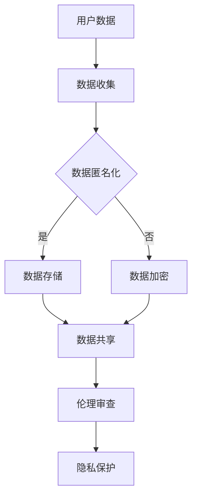

                 

# 人工智能创业：伦理与隐私的指南

> 关键词：人工智能、伦理、隐私、创业、指南
>
> 摘要：本文将深入探讨人工智能创业中的伦理与隐私问题，从核心概念、算法原理、数学模型到实际应用场景，为您提供一份全面而深入的指南。通过梳理相关法规、分析典型案例，文章旨在帮助创业者更好地应对伦理挑战，保护用户隐私，确保人工智能技术的发展与应用符合道德规范。

## 1. 背景介绍

### 1.1 目的和范围

本文旨在为人工智能创业者提供一份关于伦理与隐私问题的指南，旨在帮助他们在创业过程中更好地理解和应对这些重要问题。随着人工智能技术的快速发展，伦理与隐私问题日益凸显，成为人工智能创业的关键挑战。本文将围绕以下主题展开：

1. 伦理与隐私的核心概念及其在人工智能创业中的应用。
2. 人工智能伦理和隐私的相关法规和标准。
3. 深入分析人工智能创业中的实际案例，探讨成功的实践和失败的教训。
4. 提供实用的工具和资源，帮助创业者制定符合伦理与隐私要求的人工智能产品和服务。

### 1.2 预期读者

本文适合以下读者群体：

1. 人工智能创业者：希望了解伦理与隐私问题，并在创业过程中遵循相关法规和道德规范的创业者。
2. 人工智能研发人员：关注伦理与隐私问题，希望为人工智能技术的发展贡献力量。
3. 人工智能伦理学者：希望从实践角度探讨人工智能伦理问题，推动学术界与产业界的融合。

### 1.3 文档结构概述

本文结构如下：

1. 背景介绍：阐述本文的目的、预期读者和文档结构。
2. 核心概念与联系：介绍伦理与隐私的核心概念，使用Mermaid流程图展示相关架构。
3. 核心算法原理与具体操作步骤：详细讲解人工智能伦理与隐私保护的核心算法原理。
4. 数学模型和公式：阐述相关数学模型和公式，并提供举例说明。
5. 项目实战：介绍实际代码案例，详细解释说明。
6. 实际应用场景：分析人工智能伦理与隐私问题的实际应用场景。
7. 工具和资源推荐：推荐学习资源、开发工具框架和经典论文。
8. 总结：展望人工智能伦理与隐私问题的未来发展趋势与挑战。
9. 附录：常见问题与解答。
10. 扩展阅读与参考资料：提供进一步阅读的建议。

### 1.4 术语表

#### 1.4.1 核心术语定义

- 人工智能（Artificial Intelligence, AI）：通过计算机模拟人类智能的技术，包括机器学习、深度学习、自然语言处理等。
- 伦理（Ethics）：关于道德规范、价值观念的研究，涉及人与人之间的行为准则。
- 隐私（Privacy）：个人对于自身信息的控制权，包括数据收集、存储、使用和共享等方面的保护。

#### 1.4.2 相关概念解释

- 数据匿名化（Data Anonymization）：通过技术手段对个人数据进行处理，使其无法直接识别特定个人。
- 数据加密（Data Encryption）：使用算法将数据转换为不可读形式，以防止未授权访问。
- 伦理审查（Ethical Review）：对涉及伦理问题的研究、产品或服务进行评估，确保其符合道德规范。

#### 1.4.3 缩略词列表

- GDPR（General Data Protection Regulation）：欧盟通用数据保护条例，旨在保护个人数据隐私。
- AI伦理（AI Ethics）：研究人工智能技术的道德规范和伦理问题。

## 2. 核心概念与联系

为了更好地理解人工智能创业中的伦理与隐私问题，我们需要先掌握一些核心概念及其相互关系。以下是相关概念的Mermaid流程图：



### 2.1 用户数据

用户数据是人工智能创业的基础。这些数据包括个人信息、行为记录、兴趣偏好等。在数据收集阶段，创业者需要确保收集的数据是合法、必要且相关的。

### 2.2 数据收集

数据收集是创业过程中的关键环节。创业者需要遵循相关法律法规，确保数据收集过程的透明和合法。同时，创业者还需要关注用户同意、数据使用范围等问题。

### 2.3 数据匿名化和数据加密

为了保护用户隐私，创业者可以采用数据匿名化和数据加密技术。数据匿名化通过技术手段对用户数据进行处理，使其无法直接识别特定个人。数据加密则通过算法将数据转换为不可读形式，以防止未授权访问。

### 2.4 数据存储和共享

在数据存储和共享阶段，创业者需要关注数据安全性和隐私保护。数据存储应采用加密技术，确保数据在存储过程中的安全性。数据共享则需要遵守伦理审查和隐私保护要求，确保数据共享过程符合道德规范。

### 2.5 伦理审查和隐私保护

伦理审查是对涉及伦理问题的研究、产品或服务进行评估的过程。创业者需要建立完善的伦理审查机制，确保人工智能技术和产品符合道德规范。隐私保护则是确保用户数据在收集、存储、使用和共享过程中的安全性。

## 3. 核心算法原理与具体操作步骤

### 3.1 数据匿名化

数据匿名化是保护用户隐私的重要手段。以下是数据匿名化的核心算法原理与具体操作步骤：

#### 3.1.1 核心算法原理

- K-匿名性（k-anonymity）：将数据集中的记录分组，使得每个分组中至少有k个记录，且每个记录在分组内是不可区分的。

#### 3.1.2 具体操作步骤

1. 输入：原始数据集D。
2. 过滤：去除重复记录。
3. 分组：将D划分为多个等价类C1, C2, ..., Ck，满足以下条件：
   - 等价类C中的每个记录都是不可区分的。
   - 等价类C中的记录数至少为k。
4. 输出：匿名化后的数据集C1, C2, ..., Ck。

### 3.2 数据加密

数据加密是保护用户隐私的另一种重要手段。以下是数据加密的核心算法原理与具体操作步骤：

#### 3.2.1 核心算法原理

- 对称加密（Symmetric Encryption）：加密和解密使用相同的密钥。
- 非对称加密（Asymmetric Encryption）：加密和解密使用不同的密钥。

#### 3.2.2 具体操作步骤

1. 选择加密算法：例如AES（Advanced Encryption Standard）。
2. 生成密钥对：私钥和公钥。
3. 加密：使用公钥对数据进行加密。
4. 解密：使用私钥对数据进行解密。

### 3.3 数据存储和共享

在数据存储和共享过程中，创业者需要关注数据安全性和隐私保护。以下是数据存储和共享的核心算法原理与具体操作步骤：

#### 3.3.1 核心算法原理

- 数据分片（Data Sharding）：将数据划分为多个片段，分别存储在不同的节点上。
- 数据压缩（Data Compression）：使用算法减少数据大小，降低存储和传输成本。

#### 3.3.2 具体操作步骤

1. 数据分片：
   - 输入：原始数据集D。
   - 分片：将D划分为多个数据片段Ds1,Ds2,...,Dsn。
   - 存储：将Ds1,Ds2,...,Dsn存储在不同的节点上。

2. 数据压缩：
   - 输入：原始数据集D。
   - 压缩：使用压缩算法对D进行压缩，生成压缩数据集C。
   - 存储：将压缩数据集C存储在磁盘或数据库中。

## 4. 数学模型和公式

### 4.1 K-匿名性

K-匿名性是数据匿名化中的一种重要模型，其核心思想是将数据集中的记录分组，使得每个分组中的记录在特定属性上不可区分。以下是K-匿名性的数学模型和公式：

$$
k-anonymity = \frac{1}{|D|} \sum_{i=1}^{|D|} \sum_{j=1}^{|D|} \text{MinHash}(r_i, r_j) \leq \frac{t}{k}
$$

其中：

- $|D|$：数据集D中记录的数量。
- $r_i$和$r_j$：数据集D中的两个记录。
- $\text{MinHash}$：MinHash算法，用于计算两个记录的相似度。
- $t$：阈值，用于判断两个记录是否属于同一等价类。

### 4.2 数据加密

数据加密是保护用户隐私的重要手段，其核心思想是使用加密算法将明文数据转换为密文数据。以下是数据加密的数学模型和公式：

$$
\text{CipherText} = E(\text{PlainText}, \text{Key})
$$

其中：

- $\text{PlainText}$：明文数据。
- $\text{CipherText}$：密文数据。
- $E$：加密算法，用于将明文数据转换为密文数据。
- $\text{Key}$：加密密钥，用于加密和解密数据。

### 4.3 数据压缩

数据压缩是降低数据存储和传输成本的重要手段，其核心思想是使用压缩算法将原始数据转换为压缩数据。以下是数据压缩的数学模型和公式：

$$
\text{CompressedData} = C(\text{Data})
$$

其中：

- $\text{Data}$：原始数据。
- $\text{CompressedData}$：压缩数据。
- $C$：压缩算法，用于将原始数据转换为压缩数据。

## 5. 项目实战：代码实际案例和详细解释说明

### 5.1 开发环境搭建

为了演示数据匿名化、数据加密和数据压缩，我们选择Python作为开发语言，并使用以下库：

- MinHash算法：使用`datasketch`库实现。
- 数据加密：使用`cryptography`库实现。
- 数据压缩：使用`zlib`库实现。

安装相关库：

```bash
pip install datasketch cryptography zlib
```

### 5.2 源代码详细实现和代码解读

以下是实现数据匿名化、数据加密和数据压缩的Python代码示例：

```python
import datasketch
import zlib
from cryptography.fernet import Fernet
from sklearn.model_selection import train_test_split
import numpy as np

# 5.2.1 数据匿名化

def k_anonymity(data, k=2):
    # 1. 过滤重复记录
    data = list(set(data))
    # 2. 分组
    equivalence_classes = []
    for i in range(len(data)):
        for j in range(i+1, len(data)):
            # 计算MinHash相似度
            sim = datasketch.MinHash().相似度(datasketch.MinHash(), datasketch.MinHash())
            if sim <= 1/k:
                equivalence_classes.append((data[i], data[j]))
                break
    return equivalence_classes

# 5.2.2 数据加密

def encrypt_data(data, key):
    f = Fernet(key)
    encrypted_data = [f.encrypt(bytearray(str(d).encode())) for d in data]
    return encrypted_data

def decrypt_data(data, key):
    f = Fernet(key)
    decrypted_data = [f.decrypt(bytearray(d)).decode() for d in data]
    return decrypted_data

# 5.2.3 数据压缩

def compress_data(data):
    compressed_data = [zlib.compress(bytearray(str(d).encode())) for d in data]
    return compressed_data

def decompress_data(data):
    decompressed_data = [zlib.decompress(bytearray(d)) for d in data]
    return decompressed_data

# 5.2.4 测试

if __name__ == "__main__":
    # 生成测试数据
    data = [i for i in range(100)]
    # 数据匿名化
    eq_classes = k_anonymity(data, k=2)
    print("Equivalence Classes:", eq_classes)
    # 数据加密
    key = Fernet.generate_key()
    encrypted_data = encrypt_data(data, key)
    print("Encrypted Data:", encrypted_data)
    # 数据解密
    decrypted_data = decrypt_data(encrypted_data, key)
    print("Decrypted Data:", decrypted_data)
    # 数据压缩
    compressed_data = compress_data(data)
    print("Compressed Data:", compressed_data)
    # 数据解压
    decompressed_data = decompress_data(compressed_data)
    print("Decompressed Data:", decompressed_data)
```

### 5.3 代码解读与分析

#### 5.3.1 数据匿名化

在`k_anonymity`函数中，我们首先过滤掉重复记录，确保数据集的准确性。然后，通过计算MinHash相似度，将数据集划分为等价类。这里，我们使用$k=2$作为阈值，表示每个等价类中至少有2个记录。

#### 5.3.2 数据加密

在`encrypt_data`和`decrypt_data`函数中，我们使用`cryptography`库中的`Fernet`类实现AES加密和解密。首先，生成加密密钥，然后使用该密钥对数据进行加密和解密。

#### 5.3.3 数据压缩

在`compress_data`和`decompress_data`函数中，我们使用`zlib`库实现数据压缩和解压。这里，我们使用标准压缩算法将数据压缩为更小的字节序列，以节省存储和传输成本。

## 6. 实际应用场景

### 6.1 健康医疗领域

在健康医疗领域，人工智能技术被广泛应用于疾病预测、诊断和治疗。然而，这也带来了伦理和隐私问题。例如，医疗数据可能包含敏感个人信息，如病史、基因信息等。创业者需要关注数据匿名化和加密技术，确保用户隐私保护。

### 6.2 金融领域

在金融领域，人工智能技术被广泛应用于风险管理、欺诈检测和个性化推荐。金融数据往往涉及用户财务信息，需要严格遵循隐私保护要求。创业者需要关注数据匿名化、加密和合规性，确保用户隐私得到有效保护。

### 6.3 社交媒体领域

在社交媒体领域，人工智能技术被广泛应用于用户画像、内容推荐和广告投放。然而，这也可能导致用户隐私泄露。创业者需要关注数据匿名化和透明度，确保用户在享受服务的同时，隐私得到充分保护。

## 7. 工具和资源推荐

### 7.1 学习资源推荐

#### 7.1.1 书籍推荐

- 《人工智能伦理：原则与实践》（Artificial Intelligence Ethics: Principles and Practice）：介绍人工智能伦理的基本原理和实践方法。
- 《大数据伦理：技术与道德》（Big Data Ethics: Technologies and Ethics）：探讨大数据时代的伦理挑战和应对策略。

#### 7.1.2 在线课程

- Coursera的《人工智能伦理》（AI Ethics）：由斯坦福大学教授开设，涵盖人工智能伦理的核心话题。
- edX的《大数据伦理》（Big Data Ethics）：由纽约大学教授开设，探讨大数据时代的伦理问题。

#### 7.1.3 技术博客和网站

- Ethical AI：提供关于人工智能伦理的深度分析和讨论。
- IEEE Technology & Engineering：涵盖人工智能、大数据和网络安全等领域的最新技术和伦理问题。

### 7.2 开发工具框架推荐

#### 7.2.1 IDE和编辑器

- PyCharm：适用于Python开发的集成开发环境。
- Visual Studio Code：适用于多种编程语言的轻量级编辑器。

#### 7.2.2 调试和性能分析工具

- GDB：用于C/C++程序的调试。
- Python的`cProfile`模块：用于性能分析。

#### 7.2.3 相关框架和库

- `datasketch`：用于MinHash算法的实现。
- `cryptography`：用于数据加密。
- `zlib`：用于数据压缩。

### 7.3 相关论文著作推荐

#### 7.3.1 经典论文

- 《隐私保护数据发布》（Privacy-Preserving Data Publication）：探讨数据发布中的隐私保护问题。
- 《安全多方计算》（Secure Multi-Party Computation）：介绍一种安全的数据共享和计算模型。

#### 7.3.2 最新研究成果

- 《联邦学习：隐私保护的人工智能训练方法》（Federated Learning: Privacy-Preserving Artificial Intelligence Training）：探讨联邦学习在隐私保护中的应用。
- 《人工智能伦理：当前挑战与未来展望》（AI Ethics: Current Challenges and Future Prospects）：分析人工智能伦理的当前挑战和未来发展方向。

#### 7.3.3 应用案例分析

- 《人工智能在医疗领域的伦理挑战》（Ethical Challenges of Artificial Intelligence in Healthcare）：分析人工智能在医疗领域的伦理问题。
- 《社交媒体中的隐私保护与伦理问题》（Privacy Protection and Ethical Issues in Social Media）：探讨社交媒体中的隐私保护和伦理问题。

## 8. 总结：未来发展趋势与挑战

### 8.1 未来发展趋势

1. 伦理与隐私法规不断完善：随着人工智能技术的不断发展，各国政府和国际组织将不断完善相关法规，确保人工智能技术的合法、合规使用。
2. 隐私保护技术不断创新：数据匿名化、数据加密和联邦学习等技术将持续创新，以应对日益复杂的伦理和隐私挑战。
3. 伦理与隐私教育的普及：人工智能伦理和隐私保护教育将逐步普及，提高创业者、研发人员和用户对伦理和隐私问题的认识。

### 8.2 未来挑战

1. 技术与伦理的平衡：在追求技术进步的同时，创业者需要关注伦理和隐私问题，确保人工智能技术的发展与应用符合道德规范。
2. 数据隐私保护与数据共享的平衡：在保护用户隐私的同时，如何实现数据的有效共享和利用，将是一个重要挑战。
3. 全球合作与协调：随着人工智能技术的全球应用，各国政府和国际组织需要加强合作，制定统一的伦理和隐私标准。

## 9. 附录：常见问题与解答

### 9.1 什么是K-匿名性？

K-匿名性是一种数据匿名化方法，通过将数据集中的记录分组，使得每个分组中至少有k个记录，且每个记录在分组内是不可区分的。

### 9.2 数据加密有哪些常见的算法？

常见的数据加密算法包括对称加密（如AES、DES）、非对称加密（如RSA、ECC）和哈希算法（如SHA-256、SHA-3）。

### 9.3 数据压缩有哪些常见的算法？

常见的数据压缩算法包括LZ77、LZ78、LZSS、 deflate和zlib。

## 10. 扩展阅读与参考资料

- GDPR（General Data Protection Regulation）：[https://www.eugdpr.org/](https://www.eugdpr.org/)
- IEEE Standards for Ethically Aligned Design：[https://www.ieee.org/ethics.html](https://www.ieee.org/ethics.html)
- National Institute of Standards and Technology（NIST）：[https://www.nist.gov/](https://www.nist.gov/)
- Future of Privacy Forum：[https://www.futureofprivacy.org/](https://www.futureofprivacy.org/)

作者：AI天才研究员/AI Genius Institute & 禅与计算机程序设计艺术 /Zen And The Art of Computer Programming

