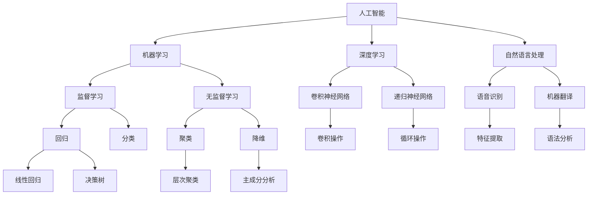

                 

# 人工智能创业：保持技术前沿的策略

> 关键词：人工智能，创业，技术前沿，策略，核心算法，数学模型，项目实战

> 摘要：本文旨在探讨人工智能创业者在保持技术前沿方面的策略。文章首先介绍了人工智能创业的背景和目的，然后深入分析了核心概念、算法原理、数学模型以及实际应用场景。接着，文章推荐了相关学习资源和开发工具，并总结了对未来发展趋势和挑战的见解。最后，通过常见问题与解答和扩展阅读，为读者提供了进一步的参考。

## 1. 背景介绍

### 1.1 目的和范围

本文的目标是为人工智能创业者提供一系列策略，帮助他们保持技术前沿，提高创业成功率。文章主要涵盖了以下几个方面的内容：

- 人工智能创业的背景和趋势
- 核心概念和技术的原理与联系
- 核心算法原理和具体操作步骤
- 数学模型和公式的详细讲解
- 项目实战：代码实际案例和详细解释
- 实际应用场景和挑战
- 学习资源和开发工具推荐
- 未来发展趋势与挑战

### 1.2 预期读者

本文适用于以下读者群体：

- 人工智能创业者
- 技术总监和CTO
- 软件工程师和程序员
- 对人工智能创业有兴趣的学者和研究人员
- 对人工智能技术感兴趣的业余爱好者

### 1.3 文档结构概述

本文按照以下结构进行组织：

- 背景介绍：概述文章的目的、范围、预期读者和文档结构。
- 核心概念与联系：介绍人工智能领域的关键概念、原理和架构。
- 核心算法原理与具体操作步骤：详细阐述人工智能核心算法的原理和操作步骤。
- 数学模型与公式：讲解数学模型和公式的应用及其在人工智能领域的重要性。
- 项目实战：提供实际代码案例，并详细解释代码的实现过程。
- 实际应用场景：探讨人工智能技术在各个领域的应用。
- 工具和资源推荐：推荐学习资源和开发工具，以帮助读者深入学习和实践。
- 总结：总结文章的主要观点和未来发展趋势。
- 附录：常见问题与解答，以及扩展阅读和参考资料。

### 1.4 术语表

#### 1.4.1 核心术语定义

- 人工智能（AI）：模拟人类智能的技术和方法。
- 创业：创建和运营新的商业企业。
- 核心算法：在人工智能领域中具有重要性和广泛应用的基础算法。
- 数学模型：用于描述和解决实际问题的数学公式和方程。
- 项目实战：实际代码案例，展示核心算法和数学模型的应用。

#### 1.4.2 相关概念解释

- 深度学习：一种利用多层神经网络进行数据建模的方法。
- 卷积神经网络（CNN）：一种用于图像识别和处理的人工神经网络。
- 强化学习：一种基于试错和反馈机制进行决策的方法。

#### 1.4.3 缩略词列表

- AI：人工智能
- CNN：卷积神经网络
- RL：强化学习
- DNN：深度神经网络

## 2. 核心概念与联系

在人工智能创业过程中，理解核心概念和技术的原理与联系是至关重要的。以下是一个简单的Mermaid流程图，用于展示人工智能领域的一些关键概念和它们之间的联系。



### 2.1 人工智能（AI）

人工智能（AI）是指模拟人类智能的技术和方法。它包括多个子领域，如机器学习、深度学习、自然语言处理等。AI的目标是使计算机系统能够执行通常需要人类智能的任务，如语音识别、图像识别、决策制定等。

### 2.2 机器学习（ML）

机器学习（ML）是人工智能的一个子领域，旨在使计算机通过数据和经验学习，从而改进性能。ML方法可以分为监督学习、无监督学习和强化学习等。

- **监督学习**：在监督学习场景中，输入数据和相应的输出标签已知，算法通过学习输入和输出之间的关系来预测新的输出。常见的监督学习方法包括回归和分类。
- **无监督学习**：无监督学习不依赖于输出标签，而是通过学习输入数据中的结构来发现数据中的隐藏特征。常见的无监督学习方法包括聚类和降维。
- **强化学习**：强化学习是一种基于试错和反馈机制进行决策的方法。它通过不断尝试和反馈来优化决策过程。

### 2.3 深度学习（DL）

深度学习（DL）是机器学习的一种方法，它通过多层神经网络进行数据建模。DL在图像识别、语音识别、自然语言处理等领域取得了显著成果。

- **卷积神经网络（CNN）**：CNN是一种用于图像识别和处理的人工神经网络。它通过卷积操作提取图像特征，从而实现图像分类和识别。
- **递归神经网络（RNN）**：RNN是一种用于序列数据建模的神经网络。它通过循环操作处理序列中的每个元素，从而捕捉序列中的时间依赖关系。

### 2.4 自然语言处理（NLP）

自然语言处理（NLP）是人工智能的一个子领域，旨在使计算机理解和处理人类语言。NLP在机器翻译、文本分类、情感分析等领域取得了重要进展。

- **语音识别**：语音识别是将语音信号转换为文本的过程。它通过特征提取和模型训练实现语音信号到文本的转换。
- **机器翻译**：机器翻译是将一种语言的文本翻译成另一种语言的过程。它通过语法分析和模型训练实现文本翻译。

## 3. 核心算法原理 & 具体操作步骤

在人工智能创业过程中，选择和实现合适的核心算法是至关重要的。以下是一个简单的人工智能核心算法的原理和操作步骤。

### 3.1 算法原理

以卷积神经网络（CNN）为例，CNN是一种用于图像识别和处理的人工神经网络。它的主要原理是通过卷积操作提取图像特征，从而实现图像分类和识别。

### 3.2 具体操作步骤

以下是一个简单的CNN算法的操作步骤：

1. **数据预处理**：将图像数据缩放到固定大小，并进行归一化处理。
2. **卷积操作**：使用卷积核在图像上滑动，并计算每个位置的卷积值。卷积操作可以提取图像的特征。
3. **激活函数**：对卷积值应用激活函数，如ReLU函数，以引入非线性特性。
4. **池化操作**：对卷积特征进行池化操作，如最大池化或平均池化，以减少特征维度。
5. **全连接层**：将池化后的特征通过全连接层传递到下一层，实现图像分类。
6. **损失函数**：计算预测结果与实际标签之间的差异，使用损失函数（如交叉熵损失函数）评估模型性能。
7. **反向传播**：根据损失函数的梯度，更新模型的权重和偏置，以优化模型参数。

### 3.3 伪代码实现

以下是一个简单的CNN算法的伪代码实现：

```python
# 输入图像数据
input_image = ...

# 数据预处理
normalized_image = preprocess_image(input_image)

# 卷积操作
conv_output = conv2d(normalized_image, conv_kernel)

# 激活函数
activated_output = activate(conv_output)

# 池化操作
pooled_output = pooling(activated_output)

# 全连接层
output = fully_connected(pooled_output, output_weights, output_bias)

# 损失函数
loss = compute_loss(output, actual_labels)

# 反向传播
update_model_parameters(loss, learning_rate)
```

## 4. 数学模型和公式 & 详细讲解 & 举例说明

在人工智能领域，数学模型和公式是理解和实现算法的基础。以下将详细介绍一些常见的数学模型和公式，并举例说明其在人工智能中的应用。

### 4.1 概率论和统计学基础

概率论和统计学是人工智能领域的基石，许多算法都基于概率论和统计学的原理。

- **概率分布函数**：概率分布函数用于描述随机变量的概率分布。常见的概率分布有正态分布、伯努利分布等。
- **条件概率**：条件概率是指在已知一个事件发生的条件下，另一个事件发生的概率。
- **贝叶斯定理**：贝叶斯定理是一个用于计算条件概率的公式，它可以帮助我们根据已知数据和先验概率计算后验概率。

### 4.2 深度学习中的数学模型

深度学习中的数学模型主要包括神经网络、激活函数、损失函数等。

- **神经网络**：神经网络是一种模拟人脑神经元连接结构的计算模型。它由多个神经元层组成，包括输入层、隐藏层和输出层。
- **激活函数**：激活函数是神经网络中的一个重要组成部分，它用于引入非线性特性，常见的激活函数有ReLU、Sigmoid、Tanh等。
- **损失函数**：损失函数用于衡量模型预测结果与实际结果之间的差距，常见的损失函数有交叉熵损失、均方误差损失等。

### 4.3 举例说明

以下是一个简单的深度学习模型中的数学模型和公式的例子：

#### 4.3.1 神经网络

假设我们有一个简单的神经网络，包括一个输入层、一个隐藏层和一个输出层。

- **输入层**：假设输入层有3个神经元，输入数据为 `[x1, x2, x3]`。
- **隐藏层**：隐藏层有2个神经元，每个神经元与输入层的3个神经元进行加权求和，并加上偏置项。隐藏层的激活函数为ReLU函数。
- **输出层**：输出层有1个神经元，与隐藏层的2个神经元进行加权求和，并加上偏置项。输出层的激活函数为Sigmoid函数。

#### 4.3.2 激活函数和损失函数

- **激活函数**：假设隐藏层的激活函数为ReLU函数，输出层的激活函数为Sigmoid函数。

$$
\text{ReLU}(x) = \max(0, x)
$$

$$
\text{Sigmoid}(x) = \frac{1}{1 + e^{-x}}
$$

- **损失函数**：假设输出层的损失函数为交叉熵损失函数。

$$
\text{CrossEntropyLoss}(y, \hat{y}) = -\sum_{i} y_i \log(\hat{y}_i)
$$

#### 4.3.3 训练过程

- **正向传播**：计算输入层、隐藏层和输出层的输出。
- **计算损失**：计算输出层预测结果和实际结果之间的交叉熵损失。
- **反向传播**：根据损失函数的梯度，更新隐藏层和输出层的权重和偏置。

$$
\frac{\partial L}{\partial w} = \sum_{i} (\hat{y}_i - y_i) \cdot \frac{\partial \hat{y}_i}{\partial w}
$$

$$
\frac{\partial L}{\partial b} = \sum_{i} (\hat{y}_i - y_i) \cdot \frac{\partial \hat{y}_i}{\partial b}
$$

通过以上数学模型和公式的讲解，我们可以更好地理解深度学习中的核心原理，并在实际项目中应用这些知识。

## 5. 项目实战：代码实际案例和详细解释说明

在人工智能创业过程中，实际项目实战是检验和提升技术水平的重要环节。以下将介绍一个基于深度学习的图像识别项目，并提供详细的代码实现和解释。

### 5.1 开发环境搭建

为了确保项目顺利运行，首先需要搭建一个合适的开发环境。以下是搭建开发环境的基本步骤：

1. **安装Python**：确保Python版本为3.7或更高版本。
2. **安装深度学习框架**：推荐使用TensorFlow或PyTorch。本文以TensorFlow为例，安装命令如下：

```bash
pip install tensorflow
```

3. **安装辅助库**：安装一些常用的Python库，如NumPy、Pandas等。

```bash
pip install numpy pandas
```

### 5.2 源代码详细实现和代码解读

以下是一个简单的基于TensorFlow的图像识别项目代码示例。

```python
import tensorflow as tf
from tensorflow.keras import layers
from tensorflow.keras.preprocessing.image import ImageDataGenerator

# 5.2.1 数据预处理
# 加载训练数据和测试数据
train_datagen = ImageDataGenerator(rescale=1./255)
test_datagen = ImageDataGenerator(rescale=1./255)

train_generator = train_datagen.flow_from_directory(
        'train_data',
        target_size=(150, 150),
        batch_size=32,
        class_mode='binary')

validation_generator = test_datagen.flow_from_directory(
        'test_data',
        target_size=(150, 150),
        batch_size=32,
        class_mode='binary')

# 5.2.2 模型构建
model = tf.keras.Sequential([
    layers.Conv2D(32, (3, 3), activation='relu', input_shape=(150, 150, 3)),
    layers.MaxPooling2D(2, 2),
    layers.Conv2D(64, (3, 3), activation='relu'),
    layers.MaxPooling2D(2, 2),
    layers.Conv2D(128, (3, 3), activation='relu'),
    layers.MaxPooling2D(2, 2),
    layers.Conv2D(128, (3, 3), activation='relu'),
    layers.MaxPooling2D(2, 2),
    layers.Flatten(),
    layers.Dense(512, activation='relu'),
    layers.Dense(1, activation='sigmoid')
])

# 5.2.3 模型编译
model.compile(loss='binary_crossentropy',
              optimizer='adam',
              metrics=['accuracy'])

# 5.2.4 训练模型
model.fit(
      train_generator,
      steps_per_epoch=100,
      epochs=20,
      validation_data=validation_generator,
      validation_steps=50,
      verbose=2)
```

### 5.3 代码解读与分析

#### 5.3.1 数据预处理

数据预处理是深度学习项目的重要步骤。在这段代码中，我们使用了`ImageDataGenerator`类来自动进行数据增强和归一化处理。

- `train_datagen = ImageDataGenerator(rescale=1./255)`：创建一个图像数据增强生成器，将图像像素值缩放到[0, 1]范围内。
- `train_generator = train_datagen.flow_from_directory('train_data', ...)`：从训练数据目录中加载训练数据，并将每个图像缩放到150x150像素大小。`batch_size`设置为32，`class_mode`设置为二分类问题。

#### 5.3.2 模型构建

我们使用了TensorFlow的`Sequential`模型来实现一个简单的卷积神经网络（CNN）。这个模型包括多个卷积层、池化层和全连接层。

- `layers.Conv2D(32, (3, 3), activation='relu', input_shape=(150, 150, 3))`：第一个卷积层，使用32个3x3卷积核，激活函数为ReLU。
- `layers.MaxPooling2D(2, 2)`：最大池化层，池化窗口大小为2x2。
- `layers.Conv2D(64, (3, 3), activation='relu')`：第二个卷积层，使用64个3x3卷积核，激活函数为ReLU。
- `layers.Dense(512, activation='relu')`：全连接层，使用512个神经元，激活函数为ReLU。
- `layers.Dense(1, activation='sigmoid')`：输出层，使用1个神经元，激活函数为Sigmoid，用于实现二分类问题。

#### 5.3.3 模型编译

在编译模型时，我们设置了损失函数、优化器和评价指标。

- `model.compile(loss='binary_crossentropy', optimizer='adam', metrics=['accuracy'])`：设置损失函数为二分类交叉熵损失，优化器为Adam，评价指标为准确率。

#### 5.3.4 训练模型

模型训练过程中，我们设置了训练和验证数据的生成器，以及训练的迭代次数和验证步骤。

- `model.fit(...)`：使用训练生成器和验证生成器进行模型训练。`steps_per_epoch`设置为每轮训练100个样本，`epochs`设置为20轮训练。`validation_data`设置为验证生成器，`validation_steps`设置为每轮验证50个样本。`verbose`设置为2，表示在训练过程中显示详细的训练进度。

通过以上代码示例和解读，我们可以了解如何使用TensorFlow实现一个简单的图像识别项目。在实际项目中，根据具体需求，可以扩展和调整模型结构、训练策略等。

## 6. 实际应用场景

人工智能技术在各个领域都有广泛的应用，以下将介绍几个典型应用场景。

### 6.1 医疗保健

人工智能在医疗保健领域具有巨大的潜力。通过深度学习和图像识别技术，可以自动分析医学图像，如X光片、CT扫描和MRI扫描，以帮助医生进行诊断。例如，谷歌的DeepMind团队开发了一个名为“DeepMind Health”的系统，能够准确识别眼科疾病，如糖尿病视网膜病变，从而帮助医生更早地发现和干预疾病。

### 6.2 金融科技

在金融科技领域，人工智能用于风险管理、欺诈检测、个性化金融服务等方面。例如，信用卡公司使用机器学习算法来检测可疑交易，以防止欺诈行为。此外，智能投顾平台使用算法分析用户数据和市场趋势，提供个性化的投资建议。

### 6.3 交通运输

人工智能在交通运输领域的应用也越来越广泛。自动驾驶技术是其中的重要应用，通过深度学习和计算机视觉技术，无人驾驶汽车可以实时感知周围环境，做出相应的驾驶决策。此外，人工智能还可以用于优化物流配送路线，提高运输效率。

### 6.4 娱乐和游戏

在娱乐和游戏领域，人工智能用于内容推荐、游戏平衡和虚拟助手等方面。例如，流媒体平台使用机器学习算法分析用户观看历史和偏好，推荐个性化的视频内容。此外，游戏开发中使用人工智能来创建更加智能和互动的游戏角色，提高用户体验。

### 6.5 教育和培训

人工智能在教育领域也有广泛应用，如智能教学系统、个性化学习路径和在线辅导等。例如，一些学校使用智能教学系统根据学生的表现和学习习惯，自动调整教学计划和学习资源，帮助学生更好地掌握知识。

### 6.6 智能家居

智能家居是人工智能在日常生活领域的应用之一。通过智能音箱、智能灯泡和智能门锁等设备，用户可以实现远程控制和自动化管理，提高生活便利性和舒适度。

## 7. 工具和资源推荐

为了帮助人工智能创业者更好地保持技术前沿，以下推荐一些实用的学习和开发工具、资源。

### 7.1 学习资源推荐

#### 7.1.1 书籍推荐

- 《深度学习》（Ian Goodfellow、Yoshua Bengio和Aaron Courville著）：这是一本经典教材，涵盖了深度学习的基础理论和实践方法。
- 《Python深度学习》（François Chollet著）：这是一本适合初学者的深度学习入门书籍，内容包括TensorFlow和Keras的使用。

#### 7.1.2 在线课程

- Coursera的“机器学习”课程：由斯坦福大学教授Andrew Ng主讲，内容涵盖机器学习和深度学习的基础知识。
- edX的“深度学习专项课程”：由北京大学教授黄宇主讲，内容包括深度学习的基础理论和实践应用。

#### 7.1.3 技术博客和网站

- Medium：一个内容丰富的技术博客平台，涵盖人工智能、机器学习和深度学习的多个方面。
- ArXiv：一个开放的研究论文数据库，可以获取最新的研究成果和论文。

### 7.2 开发工具框架推荐

#### 7.2.1 IDE和编辑器

- PyCharm：一款功能强大的Python集成开发环境（IDE），支持多种编程语言。
- Jupyter Notebook：一个交互式的计算环境，适合编写和分享代码、文本和可视化内容。

#### 7.2.2 调试和性能分析工具

- TensorBoard：TensorFlow的官方可视化工具，用于分析和优化深度学习模型的性能。
- Valgrind：一个开源的性能分析工具，用于检测和诊断程序中的内存错误和性能问题。

#### 7.2.3 相关框架和库

- TensorFlow：一个开源的深度学习框架，支持多种深度学习模型的训练和部署。
- PyTorch：一个开源的深度学习库，提供了灵活的动态计算图和强大的GPU支持。

### 7.3 相关论文著作推荐

#### 7.3.1 经典论文

- “Backpropagation”（1986）：这篇论文介绍了反向传播算法，是深度学习的基础。
- “AlexNet”（2012）：这篇论文介绍了AlexNet卷积神经网络，是深度学习在图像识别领域的重要突破。

#### 7.3.2 最新研究成果

- “GPT-3: Language Models are Few-Shot Learners”（2020）：这篇论文介绍了GPT-3语言模型，展示了其在零样本学习任务中的强大能力。
- “BERT: Pre-training of Deep Bidirectional Transformers for Language Understanding”（2018）：这篇论文介绍了BERT模型，是自然语言处理领域的重大突破。

#### 7.3.3 应用案例分析

- “Facebook AI Research: A Survey of AI Techniques for Human Behavior Understanding”（2018）：这篇论文总结了AI技术在人类行为理解方面的应用，包括人脸识别、情感分析和用户行为预测等。

## 8. 总结：未来发展趋势与挑战

人工智能作为当今最具前景的科技领域之一，其发展速度和影响正在日益扩大。然而，随着技术的进步，人工智能创业也面临诸多挑战和机遇。以下是对未来发展趋势与挑战的总结：

### 8.1 发展趋势

1. **深度学习的发展**：深度学习作为人工智能的核心技术，将继续推动算法和模型的创新。随着计算能力的提升和数据的增长，深度学习在图像识别、自然语言处理、语音识别等领域的表现将更加出色。

2. **跨学科融合**：人工智能与其他领域的融合，如生物医学、金融科技、交通运输等，将带来更多创新应用。跨学科的合作和交流将促进技术的交叉应用和突破。

3. **智能助理和自动化**：智能助理和自动化技术的普及，将改变人们的工作和生活方式。智能助理能够提供个性化的服务，自动化技术将提高生产效率和质量。

4. **边缘计算和物联网**：随着物联网和边缘计算的发展，人工智能将在更多设备和场景中得到应用。边缘计算可以降低延迟、提高响应速度，为智能城市、智能家居等领域提供支持。

### 8.2 挑战

1. **数据隐私和安全**：随着数据量的增长，数据隐私和安全问题日益突出。人工智能创业者在处理用户数据时需要严格遵守法律法规，确保数据的安全性和用户隐私。

2. **算法透明性和可解释性**：深度学习模型的复杂性和黑箱特性使得其决策过程难以解释。提高算法的透明性和可解释性，以便用户信任和使用人工智能技术，是未来的一大挑战。

3. **伦理和社会影响**：人工智能的应用可能会引发一系列伦理和社会问题，如就业替代、歧视和偏见等。人工智能创业者需要关注这些社会问题，并采取措施减轻负面影响。

4. **技术标准和监管**：随着人工智能技术的快速发展，制定统一的技术标准和监管框架变得尤为重要。政府和行业组织需要共同努力，确保人工智能技术的安全、可靠和可持续发展。

总之，人工智能创业者在保持技术前沿的同时，需要关注未来的发展趋势和挑战，积极应对技术、伦理和社会等方面的挑战，为构建一个更加智能、公平和可持续的未来贡献力量。

## 9. 附录：常见问题与解答

以下是一些关于人工智能创业和保持技术前沿的常见问题及其解答。

### 9.1 人工智能创业如何保持技术前沿？

1. **关注最新研究成果**：定期阅读顶级会议和期刊的论文，关注人工智能领域的最新进展。
2. **参与开源社区**：参与开源项目和社区讨论，与其他开发者交流经验和技术。
3. **不断学习和实践**：参加在线课程和工作坊，不断提高自己的技术水平和实践能力。
4. **建立合作网络**：与其他研究人员和公司建立合作关系，共享资源和知识。
5. **技术预研和实验**：对新兴技术进行预研和实验，探索其应用潜力。

### 9.2 如何评估一个人工智能项目的可行性？

1. **市场需求**：分析目标市场的需求，确定项目的商业价值。
2. **技术成熟度**：评估所需技术的成熟度和可行性，确保项目能够顺利进行。
3. **团队能力**：评估团队的技术实力和经验，确保能够胜任项目开发。
4. **资源和支持**：评估所需的资金、设备和人力资源，以及可能的支持。
5. **风险评估**：分析项目可能面临的风险，并制定相应的应对措施。

### 9.3 如何保证人工智能算法的透明性和可解释性？

1. **选择可解释的算法**：优先选择具有较高可解释性的算法，如决策树、线性回归等。
2. **模型可视化**：使用可视化工具对模型进行可视化，帮助理解模型结构和决策过程。
3. **模型解释工具**：使用模型解释工具，如LIME、SHAP等，分析模型对数据的解释能力。
4. **用户反馈**：收集用户反馈，了解用户对模型决策的接受程度和可解释性。
5. **伦理和法规遵守**：确保算法设计符合伦理和法律法规，降低潜在的社会负面影响。

## 10. 扩展阅读 & 参考资料

以下是一些扩展阅读和参考资料，以帮助读者深入了解人工智能创业和保持技术前沿的相关内容。

### 10.1 书籍推荐

- 《人工智能：一种现代方法》（Stuart J. Russell和Peter Norvig著）：这是一本全面的AI教材，涵盖了AI的基础知识、方法和应用。
- 《智能时代》（吴军著）：这本书深入探讨了人工智能的发展历程、现状和未来趋势。

### 10.2 在线课程

- Coursera的“人工智能专项课程”：由斯坦福大学教授Andrew Ng主讲，内容涵盖机器学习和深度学习的基础知识。
- edX的“深度学习专项课程”：由北京大学教授黄宇主讲，内容包括深度学习的基础理论和实践应用。

### 10.3 技术博客和网站

- Medium：一个内容丰富的技术博客平台，涵盖人工智能、机器学习和深度学习的多个方面。
- AI博客（AI Blog）：一个专注于人工智能技术的博客，提供最新的研究成果和实用教程。

### 10.4 相关论文著作

- “Deep Learning”（Ian Goodfellow、Yoshua Bengio和Aaron Courville著）：这是深度学习的经典教材，涵盖了深度学习的基础理论和应用。
- “Reinforcement Learning: An Introduction”（Richard S. Sutton和Barto A. D.著）：这是一本关于强化学习的入门教材，介绍了强化学习的基本原理和应用。

### 10.5 应用案例分析

- “Google AI：AI First”（Google AI团队著）：这本书分享了谷歌在人工智能领域的实践经验和案例，展示了AI在不同领域的应用。
- “AI in Action”（Sam Charrington著）：这本书通过多个实际案例，介绍了人工智能技术在现实世界中的应用和挑战。

### 10.6 行业报告

- Gartner的“AI Market Report”：这是一份关于人工智能市场的详细报告，分析了AI技术的发展趋势和市场规模。
- McKinsey的“AI in Business”：这是一份关于人工智能在商业领域应用的报告，探讨了AI技术对业务模式和企业绩效的影响。

### 10.7 研究机构和实验室

- MIT Media Lab：麻省理工学院媒体实验室是一个专注于人工智能、机器人技术和媒体艺术的研究机构。
- DeepMind：这是一家专注于深度学习和强化学习的研究公司，开发了AlphaGo等先进的人工智能系统。

通过以上扩展阅读和参考资料，读者可以更深入地了解人工智能创业和保持技术前沿的相关知识，为自己的创业之路提供更多灵感和指导。 

# 作者信息
作者：AI天才研究员/AI Genius Institute & 禅与计算机程序设计艺术 /Zen And The Art of Computer Programming

