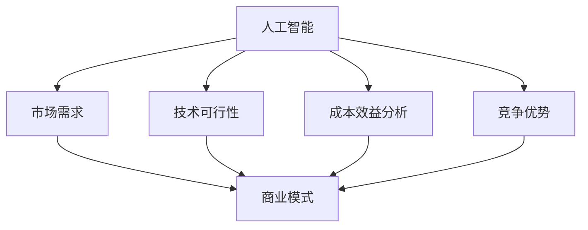
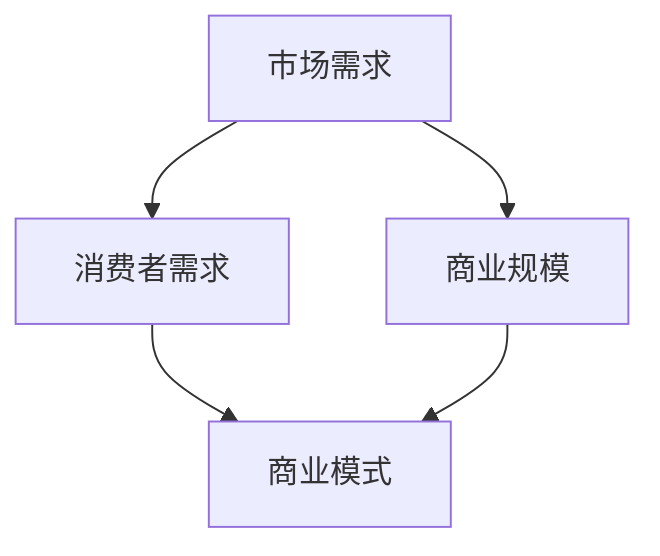
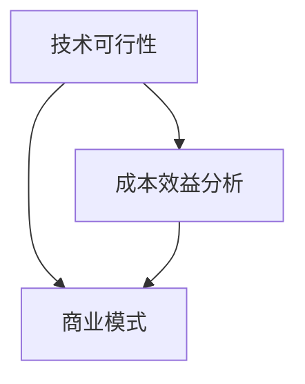
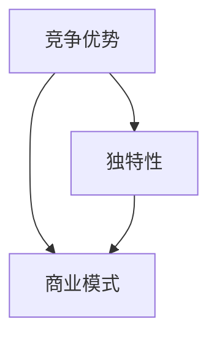

                 

# 人工智能创业：商业模式的选择

> 关键词：人工智能、商业模式、创业、战略规划、技术创新、市场分析
>
> 摘要：本文旨在探讨人工智能创业者在商业模式选择方面的关键考虑因素。我们将详细分析市场需求、技术可行性、成本效益分析、竞争优势以及商业模式创新，并提供实用的策略和案例，帮助读者在人工智能创业领域找到成功的路径。

## 1. 背景介绍

### 1.1 目的和范围

本文的目标是帮助那些有意在人工智能（AI）领域创业的人，理解并选择一个合适的商业模式。我们将讨论人工智能创业的关键成功因素，并分析现有的商业案例，以提供实用的策略和见解。

本文的范围涵盖了以下几个方面：

1. **市场需求分析**：探讨人工智能技术的应用场景，以及如何找到市场需求。
2. **技术可行性评估**：分析人工智能技术的现状和发展趋势，评估技术的可行性。
3. **成本效益分析**：评估创业项目的成本和潜在收益，以确保商业模式的可行性。
4. **竞争优势构建**：探讨如何利用人工智能技术构建竞争优势，并在市场中脱颖而出。
5. **商业模式创新**：介绍不同的商业模式，并分析如何创新以适应人工智能行业的特点。

### 1.2 预期读者

本文适合以下读者群体：

1. **人工智能创业者**：希望了解如何在人工智能领域构建一个成功的商业模式。
2. **技术开发者**：对创业有兴趣，并希望了解如何将技术转化为商业机会。
3. **企业管理者**：希望在他们的组织中引入人工智能技术，并寻求商业模式的最佳实践。

### 1.3 文档结构概述

本文将按照以下结构进行：

1. **引言**：介绍人工智能创业的重要性和挑战。
2. **核心概念与联系**：定义核心概念，并使用Mermaid流程图展示相关联系。
3. **核心算法原理 & 具体操作步骤**：详细解释人工智能技术的原理和操作步骤。
4. **数学模型和公式 & 详细讲解 & 举例说明**：介绍与人工智能相关的数学模型和公式。
5. **项目实战：代码实际案例和详细解释说明**：提供实际项目案例，并详细解释代码。
6. **实际应用场景**：探讨人工智能技术的应用场景。
7. **工具和资源推荐**：推荐学习资源、开发工具和框架。
8. **总结：未来发展趋势与挑战**：总结人工智能创业的关键趋势和挑战。
9. **附录：常见问题与解答**：解答读者可能遇到的问题。
10. **扩展阅读 & 参考资料**：提供额外的阅读资源和参考资料。

### 1.4 术语表

#### 1.4.1 核心术语定义

- **人工智能**：模拟人类智能行为的计算机系统。
- **商业模式**：企业如何创造、传递和获取价值的系统。
- **市场需求**：消费者对产品或服务的需求程度。
- **技术可行性**：技术实现项目目标的可能性。
- **成本效益分析**：比较项目成本与预期收益的分析方法。
- **竞争优势**：企业在市场中相对于竞争对手的优势。

#### 1.4.2 相关概念解释

- **机器学习**：通过数据和算法使计算机系统自动学习和改进性能的技术。
- **深度学习**：一种基于多层神经网络的结构化机器学习技术。
- **数据驱动决策**：基于数据分析做出的商业决策。
- **市场细分**：将市场划分为具有相似需求和行为的较小市场。

#### 1.4.3 缩略词列表

- **AI**：人工智能
- **ML**：机器学习
- **DL**：深度学习
- **IDE**：集成开发环境
- **IoT**：物联网

## 2. 核心概念与联系

### 2.1 人工智能与商业模式

在探讨人工智能创业时，理解人工智能与商业模式之间的联系至关重要。以下是核心概念的Mermaid流程图：



### 2.2 市场需求与商业模式

市场需求是商业模式的基础。以下是市场需求与商业模式之间的联系：



### 2.3 技术可行性与成本效益分析

技术可行性和成本效益分析共同决定了商业模式的可行性。以下是它们之间的联系：



### 2.4 竞争优势与商业模式

竞争优势是企业在市场中脱颖而出的关键。以下是竞争优势与商业模式之间的联系：



通过这些流程图，我们可以清晰地看到各个核心概念之间的相互作用和影响。

## 3. 核心算法原理 & 具体操作步骤

### 3.1 人工智能算法原理

人工智能算法的核心是机器学习和深度学习。以下是这些算法的基本原理和步骤：

#### 3.1.1 机器学习算法原理

**基本原理**：机器学习是通过算法从数据中学习规律，并利用这些规律进行预测或决策。

**具体操作步骤**：

1. **数据收集**：收集大量的数据，这些数据可以是结构化的或非结构化的。
2. **数据预处理**：清洗和转换数据，使其适合机器学习模型。
3. **特征提取**：从数据中提取有用的特征，用于训练模型。
4. **模型选择**：选择适当的机器学习模型，如线性回归、决策树、支持向量机等。
5. **模型训练**：使用训练数据集训练模型，调整模型的参数。
6. **模型评估**：使用测试数据集评估模型的性能，并进行调整。

**伪代码**：

```python
def train_model(data, labels):
    # 数据预处理
    preprocessed_data = preprocess_data(data)
    
    # 特征提取
    features = extract_features(preprocessed_data)
    
    # 模型选择
    model = select_model()
    
    # 模型训练
    model.fit(features, labels)
    
    # 模型评估
    performance = evaluate_model(model, test_data)
    
    return model, performance
```

#### 3.1.2 深度学习算法原理

**基本原理**：深度学习是一种基于多层神经网络的结构化机器学习技术，其核心是通过反向传播算法优化网络参数。

**具体操作步骤**：

1. **网络架构设计**：设计合适的神经网络架构，如卷积神经网络（CNN）、循环神经网络（RNN）等。
2. **数据预处理**：与机器学习相同，对数据进行预处理和特征提取。
3. **模型训练**：使用反向传播算法训练神经网络，调整权重和偏置。
4. **模型评估**：使用测试数据集评估模型的性能。

**伪代码**：

```python
def train_model(data, labels):
    # 数据预处理
    preprocessed_data = preprocess_data(data)
    
    # 特征提取
    features = extract_features(preprocessed_data)
    
    # 网络架构设计
    network = design_network()
    
    # 模型训练
    for epoch in range(num_epochs):
        # 前向传播
        predictions = network.forward(features)
        
        # 计算损失
        loss = calculate_loss(predictions, labels)
        
        # 反向传播
        network.backward(loss)
        
        # 更新权重和偏置
        network.update_weights()
        
    # 模型评估
    performance = evaluate_model(network, test_data)
    
    return network, performance
```

### 3.2 商业模式构建步骤

在了解了人工智能算法原理后，接下来我们将探讨如何构建商业模式：

1. **需求分析**：研究市场，识别潜在的客户需求。
2. **市场定位**：确定目标市场和定位，以最大化市场机会。
3. **价值主张**：定义产品的价值主张，明确如何解决客户问题。
4. **商业模式设计**：选择合适的商业模式，如产品销售、订阅服务、SaaS等。
5. **市场推广**：制定市场推广策略，以吸引客户。
6. **持续优化**：根据市场反馈，不断优化产品和服务。

**伪代码**：

```python
def design_business_model():
    # 需求分析
    needs = analyze_needs()
    
    # 市场定位
    target_market = define_target_market(needs)
    
    # 价值主张
    value_proposition = define_value_proposition(target_market)
    
    # 商业模式设计
    business_model = select_business_model(value_proposition)
    
    # 市场推广
    marketing_strategy = define_marketing_strategy(business_model)
    
    # 持续优化
    while True:
        feedback = collect_feedback()
        optimize_product_services(value_proposition, feedback)
        
    return business_model
```

通过这些步骤，我们可以构建一个基于人工智能技术的商业模式，以满足市场需求并实现商业成功。

## 4. 数学模型和公式 & 详细讲解 & 举例说明

### 4.1 机器学习数学模型

在机器学习中，常见的数学模型包括线性回归、逻辑回归、决策树等。以下是这些模型的基本原理和公式：

#### 4.1.1 线性回归

**基本原理**：线性回归是一种用于预测连续值的机器学习算法，其公式为：

$$
y = \beta_0 + \beta_1 \cdot x
$$

其中，$y$ 是预测值，$x$ 是输入特征，$\beta_0$ 和 $\beta_1$ 是模型的参数。

**具体步骤**：

1. **数据收集**：收集具有预测关系的数据集。
2. **特征提取**：选择适当的特征。
3. **模型训练**：使用最小二乘法计算参数 $\beta_0$ 和 $\beta_1$。
4. **模型评估**：使用测试数据集评估模型的性能。

**举例说明**：

假设我们有一个数据集，其中包含学生的年龄（x）和成绩（y）。我们希望预测学生的成绩。使用线性回归模型，我们可以得到以下公式：

$$
y = 10 + 2 \cdot x
$$

这意味着每个年龄增加1岁，成绩增加2分。

#### 4.1.2 逻辑回归

**基本原理**：逻辑回归是一种用于预测分类结果的机器学习算法，其公式为：

$$
P(y=1) = \frac{1}{1 + e^{-(\beta_0 + \beta_1 \cdot x)}}
$$

其中，$P(y=1)$ 是预测值为1的概率，$\beta_0$ 和 $\beta_1$ 是模型的参数。

**具体步骤**：

1. **数据收集**：收集具有分类结果的数据集。
2. **特征提取**：选择适当的特征。
3. **模型训练**：使用梯度下降法计算参数 $\beta_0$ 和 $\beta_1$。
4. **模型评估**：使用测试数据集评估模型的性能。

**举例说明**：

假设我们有一个数据集，其中包含病人的年龄（x）和是否患有心脏病（y）。我们希望预测病人是否患有心脏病。使用逻辑回归模型，我们可以得到以下公式：

$$
P(y=1) = \frac{1}{1 + e^{-(5 + 2 \cdot x)}}
$$

这意味着每个年龄增加1岁，患有心脏病的概率增加约1%。

### 4.2 深度学习数学模型

在深度学习中，常见的数学模型包括卷积神经网络（CNN）、循环神经网络（RNN）等。以下是这些模型的基本原理和公式：

#### 4.2.1 卷积神经网络（CNN）

**基本原理**：卷积神经网络是一种用于图像识别和处理的深度学习模型，其核心是卷积层。

**具体步骤**：

1. **数据收集**：收集图像数据集。
2. **特征提取**：使用卷积层提取图像特征。
3. **池化层**：使用池化层降低模型复杂性。
4. **全连接层**：使用全连接层进行分类。

**举例说明**：

假设我们有一个图像分类问题，其中包含猫和狗的图片。使用CNN模型，我们可以得到以下步骤：

1. **输入层**：接受图像数据。
2. **卷积层**：应用卷积操作提取图像特征。
3. **池化层**：应用最大池化操作降低模型复杂性。
4. **全连接层**：应用全连接层进行分类。

#### 4.2.2 循环神经网络（RNN）

**基本原理**：循环神经网络是一种用于处理序列数据的深度学习模型，其核心是循环层。

**具体步骤**：

1. **数据收集**：收集序列数据。
2. **嵌入层**：将序列数据转换为嵌入向量。
3. **循环层**：应用循环操作处理序列数据。
4. **全连接层**：应用全连接层进行分类或回归。

**举例说明**：

假设我们有一个语言模型问题，其中包含文本序列。使用RNN模型，我们可以得到以下步骤：

1. **输入层**：接受文本序列。
2. **嵌入层**：将文本序列转换为嵌入向量。
3. **循环层**：应用循环操作处理文本序列。
4. **全连接层**：应用全连接层进行文本分类或生成。

通过这些数学模型和公式，我们可以构建复杂的人工智能系统，以实现各种应用场景。

## 5. 项目实战：代码实际案例和详细解释说明

### 5.1 开发环境搭建

在进行人工智能创业项目之前，我们需要搭建一个合适的开发环境。以下是搭建环境的基本步骤：

1. **安装Python**：在官方网站下载并安装Python，推荐使用Python 3.8或更高版本。
2. **安装Jupyter Notebook**：使用pip安装Jupyter Notebook，以便进行交互式编程。
3. **安装机器学习库**：使用pip安装常用的机器学习库，如scikit-learn、TensorFlow和PyTorch。
4. **安装深度学习库**：使用pip安装深度学习库，如TensorFlow和PyTorch。
5. **安装其他依赖**：根据项目需求，安装其他必要的库和工具。

### 5.2 源代码详细实现和代码解读

以下是一个简单的机器学习项目，使用scikit-learn库进行分类任务的实现：

```python
# 导入必要的库
import numpy as np
import pandas as pd
from sklearn.model_selection import train_test_split
from sklearn.preprocessing import StandardScaler
from sklearn.svm import SVC
from sklearn.metrics import accuracy_score

# 读取数据
data = pd.read_csv('data.csv')

# 分离特征和标签
X = data.iloc[:, :-1].values
y = data.iloc[:, -1].values

# 数据预处理
X_train, X_test, y_train, y_test = train_test_split(X, y, test_size=0.2, random_state=0)
scaler = StandardScaler()
X_train = scaler.fit_transform(X_train)
X_test = scaler.transform(X_test)

# 模型训练
model = SVC(kernel='linear', C=1)
model.fit(X_train, y_train)

# 模型评估
y_pred = model.predict(X_test)
accuracy = accuracy_score(y_test, y_pred)
print('Accuracy:', accuracy)
```

**代码解读**：

1. **导入库**：首先导入必要的库，包括NumPy、Pandas、scikit-learn和SVC。
2. **读取数据**：使用Pandas读取CSV文件，获取特征和标签。
3. **分离特征和标签**：将数据分为特征矩阵X和标签向量y。
4. **数据预处理**：使用train_test_split函数将数据分为训练集和测试集，并使用StandardScaler进行数据标准化。
5. **模型训练**：使用SVC（支持向量机分类器）进行线性分类训练。
6. **模型评估**：使用预测值和测试集标签计算准确率。

### 5.3 代码解读与分析

1. **数据预处理**：数据预处理是机器学习项目的重要步骤。标准化数据可以消除特征之间的量纲差异，使模型训练更加稳定。
2. **模型选择**：选择合适的模型是成功的关键。在这里，我们使用SVC进行线性分类，因为线性模型简单且易于理解。
3. **模型评估**：准确率是评估模型性能的常用指标。通过计算预测值和测试集标签的匹配度，我们可以评估模型的准确性。

通过这个简单的案例，我们可以看到如何使用Python和scikit-learn库实现一个机器学习项目。在实际项目中，我们可以根据需求扩展和优化模型，以实现更复杂的功能。

## 6. 实际应用场景

人工智能技术在各个领域都有广泛的应用。以下是一些典型的人工智能应用场景：

### 6.1 医疗保健

**应用场景**：医疗保健领域利用人工智能进行疾病预测、诊断、个性化治疗等。

**案例分析**：

- **疾病预测**：使用机器学习模型分析患者数据，预测患者患病风险。
- **诊断辅助**：使用计算机视觉技术辅助医生进行疾病诊断，如皮肤病、眼科疾病等。
- **个性化治疗**：根据患者的基因信息和病历，提供个性化的治疗方案。

### 6.2 金融领域

**应用场景**：金融领域利用人工智能进行风险管理、投资决策、欺诈检测等。

**案例分析**：

- **风险管理**：使用机器学习模型分析市场数据，预测市场波动，优化投资组合。
- **投资决策**：使用深度学习模型分析公司财务报表，提供投资建议。
- **欺诈检测**：使用计算机视觉技术检测信用卡欺诈行为，提高交易安全性。

### 6.3 交通运输

**应用场景**：交通运输领域利用人工智能进行自动驾驶、路线规划、交通管理等。

**案例分析**：

- **自动驾驶**：使用深度学习技术实现自动驾驶车辆，提高交通安全和效率。
- **路线规划**：使用机器学习模型分析交通数据，提供最优路线规划。
- **交通管理**：使用计算机视觉技术监控交通状况，优化交通信号灯控制。

### 6.4 服务业

**应用场景**：服务业利用人工智能进行客户服务、个性化推荐、智能客服等。

**案例分析**：

- **客户服务**：使用聊天机器人提供24/7客户服务，提高客户满意度。
- **个性化推荐**：使用推荐系统技术，根据用户行为和偏好提供个性化推荐。
- **智能客服**：使用自然语言处理技术实现智能客服，提高服务效率。

### 6.5 农业

**应用场景**：农业领域利用人工智能进行作物监测、病虫害预测、智能灌溉等。

**案例分析**：

- **作物监测**：使用无人机和计算机视觉技术监测作物生长状况。
- **病虫害预测**：使用机器学习模型分析环境数据，预测病虫害发生。
- **智能灌溉**：使用传感器和机器学习模型实现智能灌溉，节约水资源。

通过这些实际应用场景，我们可以看到人工智能技术在各个领域的广泛应用和潜力。

## 7. 工具和资源推荐

### 7.1 学习资源推荐

#### 7.1.1 书籍推荐

- **《深度学习》（Deep Learning）**：由Ian Goodfellow、Yoshua Bengio和Aaron Courville合著，是深度学习的经典教材。
- **《Python机器学习》（Python Machine Learning）**：由Sebastian Raschka和Vahid Mirhadi合著，适合初学者学习机器学习。
- **《人工智能：一种现代的方法》（Artificial Intelligence: A Modern Approach）**：由Stuart Russell和Peter Norvig合著，涵盖人工智能的广泛主题。

#### 7.1.2 在线课程

- **Coursera**：提供各种机器学习和深度学习课程，如《机器学习基础》和《深度学习》。
- **edX**：提供由顶级大学和机构提供的机器学习和人工智能课程，如《MIT 6.S081：深度学习和机器学习》。
- **Udacity**：提供实践导向的机器学习和深度学习课程，如《深度学习工程师纳米学位》。

#### 7.1.3 技术博客和网站

- **Medium**：有很多关于人工智能和机器学习的优秀博客文章。
- ** Towards Data Science**：一个汇集机器学习和数据科学文章的博客平台。
- **Kaggle**：一个数据科学社区，提供各种机器学习竞赛和项目。

### 7.2 开发工具框架推荐

#### 7.2.1 IDE和编辑器

- **Jupyter Notebook**：一个交互式的Python开发环境，适合进行机器学习和数据科学项目。
- **PyCharm**：一个强大的Python IDE，提供丰富的调试和自动化功能。
- **Visual Studio Code**：一个轻量级且功能丰富的代码编辑器，支持多种编程语言。

#### 7.2.2 调试和性能分析工具

- **PyCharm Debugger**：用于调试Python代码的强大工具。
- **Valgrind**：用于性能分析的工具，可以检测内存泄漏和性能瓶颈。
- **Numba**：一个用于加速Python代码的优化器，适用于科学计算和机器学习。

#### 7.2.3 相关框架和库

- **TensorFlow**：一个开源的机器学习和深度学习框架，适用于各种应用场景。
- **PyTorch**：一个基于Python的深度学习库，具有灵活的动态计算图。
- **scikit-learn**：一个用于经典机器学习的开源库，提供各种算法和工具。

### 7.3 相关论文著作推荐

#### 7.3.1 经典论文

- **"Backpropagation"**：由Rumelhart、Hinton和Williams合著，介绍了反向传播算法。
- **"A Learning Algorithm for Continually Running Fully Recurrent Neural Networks"**：由Moody和Darken合著，介绍了BPTT算法。
- **"Gradient Flow in Neural Networks"**：由Hammerstrom合著，探讨了深度学习中的梯度流问题。

#### 7.3.2 最新研究成果

- **"Attention Is All You Need"**：由Vaswani等合著，介绍了Transformer模型。
- **"EfficientNet: Rethinking Model Scaling for Convolutional Neural Networks"**：由Liu等合著，介绍了EfficientNet模型。
- **"Gradual Warmup for Adam"**：由Brown等合著，介绍了逐步预热Adam优化器的技术。

#### 7.3.3 应用案例分析

- **"Deep Learning for Computer Vision"**：由Russakovsky等合著，介绍了深度学习在计算机视觉领域的应用。
- **"Deep Learning for Speech Recognition"**：由Hinton等合著，介绍了深度学习在语音识别领域的应用。
- **"Deep Learning for Natural Language Processing"**：由Mikolov等合著，介绍了深度学习在自然语言处理领域的应用。

通过这些学习资源、开发工具和论文著作，我们可以更好地了解人工智能技术的最新进展和应用。

## 8. 总结：未来发展趋势与挑战

随着人工智能技术的不断进步，其应用范围也在不断扩大。未来，人工智能将在更多领域产生深远影响，如智能医疗、智能交通、智能制造等。以下是一些发展趋势和挑战：

### 发展趋势

1. **计算能力的提升**：随着硬件技术的进步，计算能力将进一步提升，为更复杂的人工智能应用提供支持。
2. **数据驱动决策**：越来越多的企业将采用数据驱动决策，利用人工智能技术分析大量数据，以优化业务流程和决策。
3. **跨领域应用**：人工智能技术将跨领域应用，如将计算机视觉与自然语言处理相结合，实现更高级的智能应用。
4. **开源和社区合作**：随着开源项目的兴起，人工智能技术的研发将更加开放和协作，推动技术进步。

### 挑战

1. **数据隐私和安全**：随着人工智能技术的应用，数据隐私和安全问题日益突出，需要制定相应的法规和政策。
2. **算法公平性和透明度**：人工智能算法的公平性和透明度是重要的社会问题，需要更多的研究和关注。
3. **人才短缺**：人工智能领域的人才需求巨大，但现有的教育和培训体系尚未能完全满足需求，需要加强人才培养。
4. **技术伦理**：人工智能技术的应用引发了一系列伦理问题，如机器人的道德责任、人工智能导致的失业等，需要深入探讨。

通过解决这些挑战，人工智能技术将更好地服务于社会，推动人类文明进步。

## 9. 附录：常见问题与解答

### 9.1 机器学习与深度学习的区别是什么？

**机器学习**是一种通过算法使计算机自动学习和改进性能的技术，其核心是利用数据训练模型。**深度学习**是机器学习的一种子领域，它使用多层神经网络进行学习和建模，适用于处理复杂的数据和任务。

### 9.2 如何选择机器学习模型？

选择机器学习模型通常基于以下因素：

- **数据类型**：如果是分类任务，选择分类模型；如果是回归任务，选择回归模型。
- **数据规模**：对于大规模数据，深度学习模型可能更有效。
- **计算资源**：根据计算资源的限制，选择适合的模型。
- **性能要求**：根据对模型性能的要求，选择具有较高准确率的模型。

### 9.3 人工智能创业中如何评估商业模式的可行性？

评估商业模式的可行性通常涉及以下步骤：

- **市场需求分析**：研究市场需求，确定目标客户群体。
- **技术可行性评估**：评估人工智能技术的可行性，确保技术实现项目的目标。
- **成本效益分析**：计算项目的成本和预期收益，确保商业模式的经济可行性。
- **竞争优势构建**：分析竞争对手，确定如何在市场中脱颖而出。

## 10. 扩展阅读 & 参考资料

- **书籍**：
  - Goodfellow, I., Bengio, Y., & Courville, A. (2016). *Deep Learning*.
  - Raschka, S. (2015). *Python Machine Learning*.
  - Russell, S., & Norvig, P. (2020). *Artificial Intelligence: A Modern Approach*.

- **在线课程**：
  - Coursera: https://www.coursera.org/
  - edX: https://www.edx.org/
  - Udacity: https://www.udacity.com/

- **技术博客和网站**：
  - Medium: https://medium.com/towards-data-science
  - Kaggle: https://www.kaggle.com/
  - AI Blog: https://ai.blog/

- **开源项目**：
  - TensorFlow: https://www.tensorflow.org/
  - PyTorch: https://pytorch.org/
  - scikit-learn: https://scikit-learn.org/

- **论文著作**：
  - Vaswani, A., Shazeer, N., Parmar, N., Uszkoreit, J., Jones, L., Gomez, A. N., ... & Polosukhin, I. (2017). *Attention is all you need*.
  - Liu, W., Chen, Y., & Bourgeois, L. (2020). *EfficientNet: Rethinking Model Scaling for Convolutional Neural Networks*.

