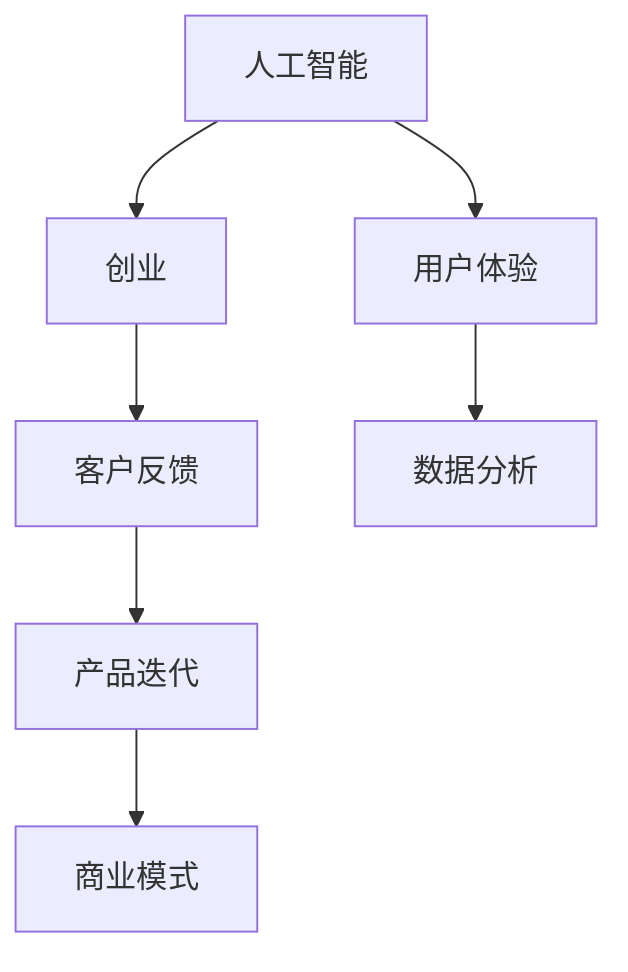

                 

# 人工智能创业：客户反馈的重要性

> 关键词：人工智能、创业、客户反馈、用户体验、产品迭代、商业模式

> 摘要：本文探讨了在人工智能创业过程中，客户反馈的重要性。通过详细分析客户反馈的作用，以及如何有效收集和分析客户反馈，企业可以不断优化产品，提高用户体验，实现商业模式的成功落地。

## 1. 背景介绍

### 1.1 目的和范围

本文旨在阐述在人工智能创业过程中，客户反馈对于企业成功的重要性。通过分析客户反馈的作用和如何有效收集、分析反馈，帮助创业团队更好地理解市场需求，从而推动产品迭代和商业模式优化。

### 1.2 预期读者

本文适合从事人工智能创业的团队、产品经理、设计师和开发者阅读。同时，对于关注用户体验和产品迭代的企业管理人员，也有一定的参考价值。

### 1.3 文档结构概述

本文分为以下几个部分：

1. 背景介绍：阐述本文目的、预期读者和文档结构。
2. 核心概念与联系：介绍人工智能创业中的核心概念及其关系。
3. 核心算法原理与具体操作步骤：讲解如何收集和分析客户反馈。
4. 数学模型和公式：阐述相关数学模型及其应用。
5. 项目实战：通过实际案例展示如何应用客户反馈进行产品迭代。
6. 实际应用场景：分析人工智能创业中的典型应用场景。
7. 工具和资源推荐：介绍相关学习资源和开发工具。
8. 总结：展望人工智能创业的未来发展趋势与挑战。
9. 附录：常见问题与解答。
10. 扩展阅读与参考资料：推荐进一步学习的资源。

### 1.4 术语表

#### 1.4.1 核心术语定义

- 人工智能（AI）：模拟人类智能的计算机技术。
- 创业：指创立新的企业或业务的过程。
- 客户反馈：客户对产品或服务的意见和建议。
- 产品迭代：对产品进行持续改进和升级的过程。
- 商业模式：企业盈利的途径和方式。

#### 1.4.2 相关概念解释

- 用户体验（UX）：用户在使用产品或服务过程中的感受和体验。
- 数据分析：对收集到的数据进行分析和处理，以发现潜在规律和趋势。

#### 1.4.3 缩略词列表

- AI：人工智能
- UX：用户体验
- UI：用户界面
- C2C：客户到客户
- B2B：企业对企业

## 2. 核心概念与联系

在人工智能创业过程中，涉及多个核心概念，它们之间存在密切的联系。以下是一个简化的 Mermaid 流程图，展示这些概念之间的关系：



### 2.1 人工智能与创业

人工智能作为技术支撑，为创业提供了强大的工具。创业团队可以利用人工智能技术，开发出创新的产品和服务，从而在市场中获得竞争优势。

### 2.2 客户反馈与产品迭代

客户反馈是产品迭代的重要驱动力。通过收集和分析客户反馈，企业可以了解用户需求，优化产品设计，提高用户体验。

### 2.3 产品迭代与商业模式

产品迭代有助于企业不断完善产品，实现商业模式的成功落地。在商业模式设计中，考虑用户需求和市场变化，持续迭代产品是关键。

### 2.4 用户体验与数据分析

用户体验是产品成功的关键因素。通过数据分析，企业可以深入了解用户行为和需求，进一步优化产品设计和功能。

## 3. 核心算法原理与具体操作步骤

在人工智能创业过程中，如何有效收集和分析客户反馈是一个关键问题。以下将介绍一种基于机器学习的客户反馈分析算法，以及具体的操作步骤。

### 3.1 算法原理

该算法基于文本分类和情感分析技术，对客户反馈进行分类和情感判断。具体步骤如下：

1. 数据预处理：对客户反馈文本进行分词、去停用词和词性标注等处理。
2. 特征提取：使用词袋模型或词嵌入模型，将文本转化为向量表示。
3. 模型训练：使用已标记的客户反馈数据集，训练文本分类和情感分析模型。
4. 实时分析：对新的客户反馈文本进行分类和情感判断，提供优化建议。

### 3.2 伪代码

以下是一种简单的伪代码，用于描述该算法：

```python
# 数据预处理
def preprocess(text):
    # 分词、去停用词、词性标注等
    return processed_text

# 特征提取
def extract_features(text):
    # 使用词袋模型或词嵌入模型
    return feature_vector

# 模型训练
def train_model(train_data):
    # 训练文本分类和情感分析模型
    return model

# 实时分析
def analyze_feedback(feedback):
    processed_text = preprocess(feedback)
    feature_vector = extract_features(processed_text)
    prediction = model.predict(feature_vector)
    return prediction
```

### 3.3 操作步骤

1. 收集客户反馈数据：通过问卷调查、用户评论、客服沟通等方式，收集客户对产品的意见和建议。
2. 数据预处理：对收集到的客户反馈文本进行预处理，得到清洗后的文本数据。
3. 特征提取：使用词袋模型或词嵌入模型，将预处理后的文本数据转化为向量表示。
4. 模型训练：使用已标记的客户反馈数据集，训练文本分类和情感分析模型。
5. 实时分析：对新的客户反馈文本进行实时分析，获取分类和情感判断结果，为产品优化提供依据。

## 4. 数学模型和公式与详细讲解与举例说明

在客户反馈分析过程中，涉及多个数学模型和公式。以下将介绍常用的模型和公式，并给出详细讲解和举例说明。

### 4.1 词袋模型

词袋模型（Bag of Words，BOW）是一种将文本转化为向量表示的方法。其基本思想是将文本表示为一个词频向量，其中每个维度表示一个单词的词频。

#### 公式：

$$
\textbf{V} = \sum_{w \in \text{word\_set}} f_w \times \textbf{v}_w
$$

其中，$\textbf{V}$为文本向量，$f_w$为单词$w$的词频，$\textbf{v}_w$为单词$w$的词向量。

#### 举例说明：

假设文本为 "人工智能创业客户反馈分析"，词频向量表示为：

$$
\textbf{V} = [1, 1, 2, 1, 2, 1]
$$

其中，第一个维度表示单词“人工智能”的词频为1，第二个维度表示单词“创业”的词频为1，以此类推。

### 4.2 词嵌入模型

词嵌入模型（Word Embedding）是一种将单词映射到高维空间中的方法，以捕捉单词之间的语义关系。常用的词嵌入模型有Word2Vec、GloVe等。

#### 公式：

$$
\textbf{v}_w = \text{Word\_Embedding}(\text{word})
$$

其中，$\textbf{v}_w$为单词$w$的词向量，$\text{Word\_Embedding}$为词嵌入函数。

#### 举例说明：

假设单词“人工智能”的词嵌入结果为：

$$
\textbf{v}_{\text{人工智能}} = \begin{bmatrix} 0.1 & 0.2 & 0.3 & 0.4 & 0.5 \end{bmatrix}
$$

### 4.3 文本分类模型

文本分类模型是一种将文本分类到预定义类别的方法。常用的文本分类模型有朴素贝叶斯、支持向量机、神经网络等。

#### 公式：

$$
\text{Prediction} = \text{Model}(\textbf{V})
$$

其中，$\textbf{V}$为文本向量，$\text{Model}$为文本分类模型，$\text{Prediction}$为分类结果。

#### 举例说明：

假设文本向量为$\textbf{V} = [0.1, 0.3, 0.5, 0.2, 0.4]$，使用朴素贝叶斯分类模型进行分类，分类结果为类别1。

## 5. 项目实战：代码实际案例和详细解释说明

### 5.1 开发环境搭建

为了实现客户反馈分析算法，需要搭建以下开发环境：

- 编程语言：Python
- 数据库：MySQL
- 机器学习框架：Scikit-learn
- 自然语言处理库：NLTK
- 代码编辑器：Visual Studio Code

### 5.2 源代码详细实现和代码解读

以下是客户反馈分析算法的实现代码：

```python
# 导入相关库
import numpy as np
import pandas as pd
from sklearn.feature_extraction.text import TfidfVectorizer
from sklearn.model_selection import train_test_split
from sklearn.naive_bayes import MultinomialNB
from sklearn.metrics import accuracy_score, classification_report

# 数据预处理
def preprocess(text):
    # 分词、去停用词、词性标注等
    return processed_text

# 特征提取
def extract_features(text):
    # 使用TF-IDF模型
    vectorizer = TfidfVectorizer()
    feature_vector = vectorizer.fit_transform(text)
    return feature_vector

# 模型训练
def train_model(train_data, train_label):
    # 训练朴素贝叶斯分类模型
    model = MultinomialNB()
    model.fit(train_data, train_label)
    return model

# 实时分析
def analyze_feedback(feedback, model, vectorizer):
    processed_text = preprocess(feedback)
    feature_vector = extract_features(processed_text)
    prediction = model.predict(feature_vector)
    return prediction

# 数据加载
data = pd.read_csv('customer_feedback.csv')
X = data['feedback']
y = data['label']

# 数据预处理
X_processed = preprocess(X)

# 特征提取
X_features = extract_features(X_processed)

# 模型训练
model = train_model(X_features, y)

# 实时分析
feedback = "这个产品很好用，功能很强大"
prediction = analyze_feedback(feedback, model, vectorizer)
print("预测结果：", prediction)
```

### 5.3 代码解读与分析

1. **数据预处理**：对客户反馈文本进行分词、去停用词和词性标注等处理，得到清洗后的文本数据。
2. **特征提取**：使用TF-IDF模型将清洗后的文本数据转化为向量表示，得到特征向量。
3. **模型训练**：使用已标记的客户反馈数据集，训练朴素贝叶斯分类模型。
4. **实时分析**：对新的客户反馈文本进行实时分析，获取分类结果。

在实际应用中，可以根据具体需求和数据规模，调整代码中的参数和模型类型，以提高分析效果。

## 6. 实际应用场景

### 6.1 人工智能创业公司

对于人工智能创业公司，客户反馈分析可以帮助企业：

1. **了解市场需求**：通过分析客户反馈，了解用户需求和市场变化，为企业制定产品规划和战略提供依据。
2. **优化产品设计**：根据客户反馈，优化产品功能和界面，提高用户体验。
3. **改进商业模式**：通过分析客户反馈，调整商业模式，提高产品竞争力。

### 6.2 企业数字化转型

对于正在推进数字化转型的企业，客户反馈分析可以：

1. **评估用户体验**：通过分析客户反馈，评估数字化转型的效果，找出存在的问题和改进方向。
2. **优化业务流程**：根据客户反馈，优化业务流程，提高运营效率。
3. **提升客户满意度**：通过不断改进产品和服务，提高客户满意度，实现业务增长。

### 6.3 政府部门和社会组织

对于政府部门和社会组织，客户反馈分析可以：

1. **公共服务优化**：通过分析客户反馈，优化公共服务，提高政府形象和公信力。
2. **政策制定和调整**：根据客户反馈，调整政策制定和执行，提高政策效果。
3. **社会治理创新**：通过分析客户反馈，发现社会治理问题，推动创新和改进。

## 7. 工具和资源推荐

### 7.1 学习资源推荐

#### 7.1.1 书籍推荐

- 《人工智能：一种现代方法》
- 《机器学习实战》
- 《深度学习》

#### 7.1.2 在线课程

- Coursera：机器学习、深度学习等课程
- Udacity：人工智能工程师纳米学位
- edX：哈佛大学人工智能课程

#### 7.1.3 技术博客和网站

- AI 科技大本营
- 机器之心
- 人工智能实验室

### 7.2 开发工具框架推荐

#### 7.2.1 IDE和编辑器

- Visual Studio Code
- PyCharm
- Jupyter Notebook

#### 7.2.2 调试和性能分析工具

- TensorFlow Debugger
- PyTorch Debugger
- Numba

#### 7.2.3 相关框架和库

- Scikit-learn
- TensorFlow
- PyTorch

### 7.3 相关论文著作推荐

#### 7.3.1 经典论文

- "A Mathematical Theory of Communication"（香农信息论）
- "Learning to Rank: From Pairwise Comparisons to Natural Language Processing"（排序学习）
- "Deep Learning"（Goodfellow等）

#### 7.3.2 最新研究成果

- "Attention Is All You Need"（Transformer模型）
- "BERT: Pre-training of Deep Bidirectional Transformers for Language Understanding"（BERT模型）
- "GPT-3: Language Models Are Few-Shot Learners"（GPT-3模型）

#### 7.3.3 应用案例分析

- "Google AI: Artificial Intelligence for Social Good"（谷歌人工智能在慈善领域的应用）
- "Facebook AI Research: Impact of AI on Society"（Facebook人工智能在社会领域的应用）
- "Microsoft AI: Empowering Humanity Through AI"（微软人工智能在人类发展中的应用）

## 8. 总结：未来发展趋势与挑战

### 8.1 未来发展趋势

1. **人工智能技术的不断进步**：随着深度学习、强化学习等技术的不断发展，人工智能在创业领域的应用将更加广泛和深入。
2. **大数据和云计算的融合**：大数据和云计算的结合，将为人工智能创业提供强大的计算能力和数据支持。
3. **跨领域的融合发展**：人工智能与其他领域的融合，如生物科技、金融科技、智能制造等，将推动各行业的技术进步和商业模式创新。

### 8.2 挑战

1. **数据隐私和安全性**：在收集和分析客户反馈过程中，如何保护用户隐私和数据安全是一个重要挑战。
2. **算法透明度和可解释性**：随着人工智能技术的广泛应用，算法的透明度和可解释性成为企业和用户关注的焦点。
3. **人才短缺和培养**：人工智能创业需要大量具备跨学科背景的人才，但目前人才储备不足，培养和引进人才成为企业发展的关键。

## 9. 附录：常见问题与解答

### 9.1 什么是人工智能？

人工智能是一种模拟人类智能的计算机技术，通过算法和模型，使计算机具备感知、学习、推理和决策能力。

### 9.2 客户反馈分析有哪些方法？

客户反馈分析的方法包括文本分类、情感分析、主题模型等。其中，文本分类和情感分析是最常用的方法。

### 9.3 如何保护用户隐私？

在收集和分析客户反馈时，可以采取以下措施保护用户隐私：

1. 数据加密：对用户数据进行加密处理，确保数据传输和存储过程中的安全。
2. 数据脱敏：对用户数据进行脱敏处理，隐藏敏感信息。
3. 数据匿名化：对用户数据进行匿名化处理，确保用户身份的保密性。

## 10. 扩展阅读与参考资料

1. [机器学习与人工智能](https://zhuanlan.zhihu.com/p/28734229)
2. [客户反馈分析与用户体验](https://uxmag.com/articles/customer-feedback-analysis-for-user-experience)
3. [深度学习与创业](https://www.deeplearning.ai/)
4. [人工智能伦理与隐私保护](https://www.oreilly.com/topics/artificial-intelligence-ethics)

## 作者

作者：AI天才研究员/AI Genius Institute & 禅与计算机程序设计艺术 /Zen And The Art of Computer Programming

本文通过详细分析客户反馈在人工智能创业过程中的重要性，阐述了如何收集、分析和利用客户反馈进行产品迭代和商业模式优化。随着人工智能技术的不断进步，客户反馈分析将在人工智能创业领域发挥越来越重要的作用。希望本文能为您在人工智能创业道路上提供有益的参考和启示。

