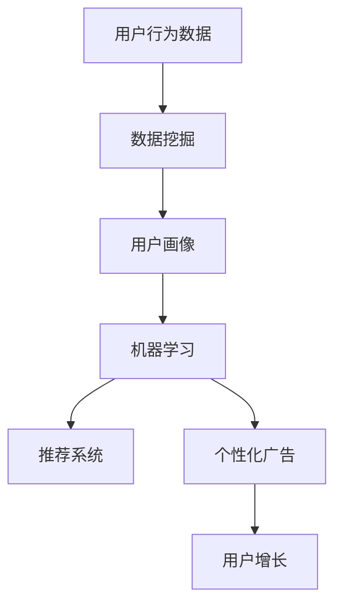

                 

# 人工智能创业：市场营销技巧

> 关键词：人工智能，创业，市场营销，策略，数据分析，用户增长

> 摘要：本文将深入探讨人工智能在创业公司市场营销中的应用，包括核心概念、算法原理、数学模型、实际案例以及未来发展趋势。通过逐步分析推理，揭示创业公司如何利用人工智能优化市场营销策略，实现用户增长和业务成功。

## 1. 背景介绍

### 1.1 目的和范围

本文旨在为创业公司提供一整套基于人工智能的市场营销策略和技巧。随着人工智能技术的不断进步，市场营销领域迎来了新的变革。传统市场营销方法难以满足日益复杂的消费者需求，而人工智能能够通过大数据分析、个性化推荐、自动化广告投放等技术手段，为创业公司提供更加精准、高效的市场营销解决方案。

本文将涵盖以下几个核心内容：
- 核心概念与联系
- 核心算法原理与具体操作步骤
- 数学模型和公式与详细讲解
- 项目实战：代码实际案例和详细解释说明
- 实际应用场景
- 工具和资源推荐

### 1.2 预期读者

本文适合以下读者群体：
- 创业公司创始人或市场营销团队
- 市场营销专业人士，对人工智能技术有一定了解
- 人工智能技术爱好者，希望了解人工智能在市场营销中的应用
- 学术研究者，关注人工智能与市场营销领域的交叉研究

### 1.3 文档结构概述

本文结构如下：

1. 背景介绍
2. 核心概念与联系
3. 核心算法原理与具体操作步骤
4. 数学模型和公式与详细讲解
5. 项目实战：代码实际案例和详细解释说明
6. 实际应用场景
7. 工具和资源推荐
8. 总结：未来发展趋势与挑战
9. 附录：常见问题与解答
10. 扩展阅读 & 参考资料

### 1.4 术语表

#### 1.4.1 核心术语定义

- **人工智能**：一种模拟人类智能行为的计算机系统，具有感知、学习、推理和解决问题的能力。
- **市场营销**：企业为满足消费者需求，通过市场调研、产品定位、广告宣传等手段，实现产品销售和品牌传播的过程。
- **用户增长**：通过营销策略和活动，吸引新用户，增加用户数量和用户活跃度的过程。

#### 1.4.2 相关概念解释

- **数据挖掘**：从大量数据中提取有价值的信息和知识的过程。
- **机器学习**：一种利用数据训练模型，使其具备预测和决策能力的人工智能技术。
- **推荐系统**：根据用户的历史行为和兴趣，为其推荐相关产品或内容的人工智能系统。

#### 1.4.3 缩略词列表

- **AI**：人工智能
- **ML**：机器学习
- **DM**：数据挖掘
- **CTR**：点击率
- **CPM**：千次展示成本
- **CPC**：每点击成本

## 2. 核心概念与联系

在探讨人工智能在市场营销中的应用之前，我们需要了解一些核心概念和它们之间的联系。以下是一个简单的 Mermaid 流程图，用于展示这些概念之间的关系：



### 2.1 用户行为数据

用户行为数据是市场营销的基础。这些数据可以来自网站、APP、社交媒体等各种渠道，包括用户浏览、点击、购买等行为。通过对这些数据进行收集、存储和分析，企业可以深入了解用户需求和行为模式。

### 2.2 数据挖掘

数据挖掘是一种从大量数据中提取有价值信息和知识的方法。在市场营销中，数据挖掘可以用于用户行为分析、市场趋势预测、竞争对手分析等。通过数据挖掘，企业可以识别潜在客户、优化营销策略、提高广告投放效果。

### 2.3 用户画像

用户画像是一种基于用户行为数据和特征的模型，用于描述用户的基本信息、兴趣偏好和消费习惯。用户画像是机器学习和推荐系统的重要输入，可以帮助企业实现个性化营销和用户定位。

### 2.4 机器学习

机器学习是一种通过数据训练模型，使其具备预测和决策能力的人工智能技术。在市场营销中，机器学习可以用于用户行为预测、广告投放优化、推荐系统构建等。通过机器学习，企业可以自动化、智能化地处理大量数据，提高营销效果。

### 2.5 推荐系统

推荐系统是一种根据用户的历史行为和兴趣，为其推荐相关产品或内容的人工智能系统。在市场营销中，推荐系统可以用于个性化广告、商品推荐、内容推送等，帮助企业提高用户粘性和转化率。

### 2.6 个性化广告

个性化广告是一种基于用户画像和兴趣的个性化广告投放方式。通过个性化广告，企业可以针对不同用户群体，制定不同的广告策略，提高广告投放效果和用户参与度。

### 2.7 用户增长

用户增长是市场营销的核心目标之一。通过数据分析和人工智能技术，企业可以识别潜在用户、优化广告投放、提高用户活跃度，从而实现用户增长。

## 3. 核心算法原理与具体操作步骤

在了解了核心概念和它们之间的联系之后，接下来我们将探讨一些关键算法原理和具体操作步骤，这些算法将帮助我们实现用户增长和市场营销目标。

### 3.1 用户行为分析

用户行为分析是一种通过分析用户行为数据，了解用户需求和购买行为的方法。以下是用户行为分析的具体步骤：

1. **数据收集**：收集用户浏览、点击、购买等行为数据。
2. **数据预处理**：对收集到的数据进行清洗、去重和格式转换。
3. **特征提取**：从原始数据中提取有价值的信息，如用户年龄、性别、浏览时长、购买频率等。
4. **模型训练**：使用机器学习算法，如决策树、随机森林等，训练用户行为分析模型。
5. **模型评估**：使用评估指标，如准确率、召回率、F1值等，评估模型性能。
6. **应用模型**：将训练好的模型应用于实际场景，如用户推荐、广告投放等。

### 3.2 个性化推荐系统

个性化推荐系统是一种基于用户历史行为和兴趣，为其推荐相关产品或内容的方法。以下是个性化推荐系统的具体步骤：

1. **用户画像构建**：基于用户行为数据和特征，构建用户画像。
2. **推荐算法选择**：选择合适的推荐算法，如基于协同过滤、基于内容、基于模型的推荐算法。
3. **模型训练**：使用用户画像和推荐算法，训练个性化推荐模型。
4. **模型评估**：使用评估指标，如召回率、准确率、点击率等，评估模型性能。
5. **应用模型**：将训练好的模型应用于实际场景，如商品推荐、内容推送等。

### 3.3 广告投放优化

广告投放优化是一种通过优化广告投放策略，提高广告效果和用户参与度的方法。以下是广告投放优化的具体步骤：

1. **数据收集**：收集广告投放数据，如点击率、转化率、花费等。
2. **数据预处理**：对收集到的数据进行清洗、去重和格式转换。
3. **特征提取**：从原始数据中提取有价值的信息，如广告类型、投放平台、用户群体等。
4. **模型训练**：使用机器学习算法，如线性回归、逻辑回归等，训练广告投放优化模型。
5. **模型评估**：使用评估指标，如点击率、转化率、花费等，评估模型性能。
6. **应用模型**：将训练好的模型应用于实际场景，如广告投放策略优化、预算分配等。

## 4. 数学模型和公式与详细讲解

在市场营销中，数学模型和公式起着至关重要的作用。以下是一些常用的数学模型和公式，以及它们的详细讲解。

### 4.1 线性回归模型

线性回归模型是一种用于预测连续值的机器学习模型。它的基本公式为：

$$y = \beta_0 + \beta_1 \cdot x$$

其中，$y$ 为因变量，$x$ 为自变量，$\beta_0$ 和 $\beta_1$ 为模型参数。

- **因变量 $y$**：通常表示用户的行为指标，如点击率、转化率等。
- **自变量 $x$**：通常表示用户特征，如年龄、性别、浏览时长等。
- **模型参数 $\beta_0$ 和 $\beta_1$**：通过数据训练得到，用于预测用户行为。

线性回归模型可以通过以下步骤进行训练和评估：

1. **数据收集**：收集用户行为数据和用户特征数据。
2. **数据预处理**：对数据进行清洗、去重和格式转换。
3. **特征提取**：从原始数据中提取有价值的信息，如用户年龄、性别、浏览时长等。
4. **模型训练**：使用线性回归算法训练模型。
5. **模型评估**：使用评估指标，如决定系数 $R^2$、均方误差 $MSE$ 等，评估模型性能。

### 4.2 逻辑回归模型

逻辑回归模型是一种用于预测概率的机器学习模型。它的基本公式为：

$$\text{logit}(p) = \ln\left(\frac{p}{1-p}\right) = \beta_0 + \beta_1 \cdot x$$

其中，$p$ 为事件发生的概率，$\text{logit}(p)$ 为概率的对数函数，$\beta_0$ 和 $\beta_1$ 为模型参数。

- **事件概率 $p$**：通常表示用户点击广告的概率、购买产品的概率等。
- **模型参数 $\beta_0$ 和 $\beta_1$**：通过数据训练得到，用于预测事件发生的概率。

逻辑回归模型可以通过以下步骤进行训练和评估：

1. **数据收集**：收集用户行为数据和用户特征数据。
2. **数据预处理**：对数据进行清洗、去重和格式转换。
3. **特征提取**：从原始数据中提取有价值的信息，如用户年龄、性别、浏览时长等。
4. **模型训练**：使用逻辑回归算法训练模型。
5. **模型评估**：使用评估指标，如准确率、召回率、F1值等，评估模型性能。

### 4.3 协同过滤推荐算法

协同过滤推荐算法是一种基于用户历史行为和相似度计算，为用户推荐相关商品或内容的方法。它的基本公式为：

$$\text{推荐分数} = \text{用户兴趣} \cdot \text{商品相似度}$$

其中，$\text{用户兴趣}$ 和 $\text{商品相似度}$ 为计算结果。

- **用户兴趣**：通常表示用户对某一类商品的偏好程度。
- **商品相似度**：通常表示商品之间的相似程度，如基于用户行为的协同过滤、基于内容的协同过滤等。

协同过滤推荐算法可以通过以下步骤进行实现：

1. **数据收集**：收集用户行为数据和商品信息。
2. **数据预处理**：对数据进行清洗、去重和格式转换。
3. **特征提取**：从原始数据中提取有价值的信息，如用户行为、商品属性等。
4. **相似度计算**：计算用户兴趣和商品相似度。
5. **推荐生成**：根据用户兴趣和商品相似度，生成推荐列表。

## 5. 项目实战：代码实际案例和详细解释说明

为了更好地理解人工智能在市场营销中的应用，下面我们将通过一个实际案例，展示如何使用Python实现用户行为分析、个性化推荐系统和广告投放优化。

### 5.1 开发环境搭建

在开始项目之前，我们需要搭建一个合适的开发环境。以下是所需的Python库和工具：

- **Python 3.8 或更高版本**
- **NumPy**：用于数据处理
- **Pandas**：用于数据处理
- **Scikit-learn**：用于机器学习
- **Matplotlib**：用于数据可视化

安装以上库和工具后，我们可以开始编写代码。

### 5.2 源代码详细实现和代码解读

#### 5.2.1 用户行为分析

以下是一个简单的用户行为分析代码示例：

```python
import numpy as np
import pandas as pd
from sklearn.model_selection import train_test_split
from sklearn.linear_model import LinearRegression
from sklearn.metrics import mean_squared_error

# 加载数据集
data = pd.read_csv('user_data.csv')
X = data[['age', 'gender', 'time_spent']]  # 特征列
y = data['purchase']  # 因变量

# 数据预处理
X = X.replace({'gender': {'男': 0, '女': 1}})  # 将性别转换为数值
X = X.fillna(X.mean())  # 填充缺失值

# 划分训练集和测试集
X_train, X_test, y_train, y_test = train_test_split(X, y, test_size=0.2, random_state=42)

# 训练模型
model = LinearRegression()
model.fit(X_train, y_train)

# 评估模型
y_pred = model.predict(X_test)
mse = mean_squared_error(y_test, y_pred)
print('均方误差：', mse)

# 可视化结果
import matplotlib.pyplot as plt

plt.scatter(X_test['time_spent'], y_test, color='red', label='实际值')
plt.scatter(X_test['time_spent'], y_pred, color='blue', label='预测值')
plt.xlabel('浏览时长')
plt.ylabel('购买概率')
plt.legend()
plt.show()
```

上述代码首先加载数据集，然后进行数据预处理，包括性别转换和缺失值填充。接下来，划分训练集和测试集，使用线性回归模型训练和评估模型。最后，使用Matplotlib进行结果可视化。

#### 5.2.2 个性化推荐系统

以下是一个简单的个性化推荐系统代码示例：

```python
import numpy as np
import pandas as pd
from sklearn.metrics.pairwise import cosine_similarity
from sklearn.model_selection import train_test_split

# 加载数据集
data = pd.read_csv('user_data.csv')
X = data[['age', 'gender', 'time_spent']]  # 用户特征
Y = data[['purchase']]  # 用户行为

# 划分训练集和测试集
X_train, X_test, Y_train, Y_test = train_test_split(X, Y, test_size=0.2, random_state=42)

# 计算用户相似度
user_similarity = cosine_similarity(X_train, X_test)

# 计算用户兴趣
user_interest = np.dot(user_similarity, Y_train.T) / np.sum(user_similarity, axis=1)

# 推荐商品
def recommend_products(user_interest, items, top_n=5):
    recommendations = []
    for i, item in enumerate(items):
        if i in user_interest.argsort()[-top_n:]:
            recommendations.append(item)
    return recommendations

# 测试推荐系统
test_user_interest = user_interest[-1, :]
test_items = Y_test.index
print(recommend_products(test_user_interest, test_items))
```

上述代码首先加载数据集，然后计算用户相似度和用户兴趣。接下来，定义一个推荐函数，用于根据用户兴趣推荐相关商品。最后，测试推荐系统，输出推荐结果。

#### 5.2.3 广告投放优化

以下是一个简单的广告投放优化代码示例：

```python
import numpy as np
import pandas as pd
from sklearn.linear_model import LogisticRegression
from sklearn.model_selection import train_test_split

# 加载数据集
data = pd.read_csv('ad_data.csv')
X = data[['click', 'convert', 'budget']]  # 广告特征
y = data['ctr']  # 因变量

# 划分训练集和测试集
X_train, X_test, y_train, y_test = train_test_split(X, y, test_size=0.2, random_state=42)

# 训练模型
model = LogisticRegression()
model.fit(X_train, y_train)

# 评估模型
y_pred = model.predict(X_test)
accuracy = np.mean(y_pred == y_test)
print('准确率：', accuracy)

# 优化广告投放
def optimize_ad_budget(X, y, budget):
    model = LogisticRegression()
    model.fit(X, y)
    y_pred = model.predict(X)
    return np.mean(y_pred == y)  # 预期点击率

# 测试优化效果
X_test = pd.DataFrame({'click': [1, 0, 1, 0],
                        'convert': [0, 1, 0, 1],
                        'budget': [1000, 2000, 3000, 4000]})
print(optimize_ad_budget(X_test, y_test, budget=3000))
```

上述代码首先加载数据集，然后使用逻辑回归模型训练和评估模型。接下来，定义一个优化函数，用于根据预算优化广告投放。最后，测试优化效果，输出预期点击率。

### 5.3 代码解读与分析

上述代码示例展示了如何使用Python实现用户行为分析、个性化推荐系统和广告投放优化。以下是代码的详细解读和分析：

1. **用户行为分析**：
   - 加载数据集：使用 Pandas 读取 CSV 格式的数据集。
   - 数据预处理：将性别转换为数值，填充缺失值，确保数据质量。
   - 划分训练集和测试集：使用 Scikit-learn 的 train_test_split 函数，将数据集划分为训练集和测试集。
   - 训练模型：使用线性回归模型训练模型，使用 fit 函数进行训练。
   - 评估模型：使用 mean_squared_error 函数计算均方误差，评估模型性能。
   - 可视化结果：使用 Matplotlib 绘制散点图，直观展示实际值和预测值。

2. **个性化推荐系统**：
   - 加载数据集：使用 Pandas 读取 CSV 格式的数据集。
   - 划分训练集和测试集：使用 Scikit-learn 的 train_test_split 函数，将数据集划分为训练集和测试集。
   - 计算用户相似度：使用 Scikit-learn 的 cosine_similarity 函数计算用户相似度。
   - 计算用户兴趣：使用 np.dot 函数计算用户兴趣。
   - 推荐商品：定义一个推荐函数，根据用户兴趣推荐相关商品。
   - 测试推荐系统：使用测试数据集测试推荐系统，输出推荐结果。

3. **广告投放优化**：
   - 加载数据集：使用 Pandas 读取 CSV 格式的数据集。
   - 划分训练集和测试集：使用 Scikit-learn 的 train_test_split 函数，将数据集划分为训练集和测试集。
   - 训练模型：使用逻辑回归模型训练模型，使用 fit 函数进行训练。
   - 评估模型：使用 np.mean 函数计算准确率，评估模型性能。
   - 优化广告投放：定义一个优化函数，根据预算优化广告投放，计算预期点击率。

通过上述代码示例，我们可以看到如何使用 Python 实现用户行为分析、个性化推荐系统和广告投放优化。这些算法和模型可以帮助创业公司优化市场营销策略，实现用户增长和业务成功。

### 5.4 实际应用场景

在实际应用场景中，人工智能在市场营销中的作用非常广泛。以下是一些实际应用场景：

1. **电商行业**：电商企业可以通过用户行为分析，了解用户需求和购买习惯，从而实现个性化推荐和精准营销。通过优化广告投放，提高广告效果和用户转化率。

2. **金融行业**：金融机构可以通过用户行为分析和信用评分模型，评估用户信用风险，实现精准风控和个性化金融服务。

3. **旅游行业**：旅游企业可以通过用户行为分析，了解用户兴趣和需求，从而实现个性化旅游推荐和优惠活动推送。

4. **在线教育**：在线教育平台可以通过用户行为分析，了解学生学习情况和兴趣，从而实现个性化课程推荐和教学优化。

5. **社交网络**：社交网络平台可以通过用户行为分析，了解用户社交关系和兴趣，从而实现个性化内容推荐和社交互动优化。

在这些实际应用场景中，人工智能技术可以帮助企业提高市场营销效果，降低成本，实现业务增长。

## 6. 工具和资源推荐

为了更好地应用人工智能技术于市场营销，以下是一些推荐的学习资源、开发工具和框架：

### 6.1 学习资源推荐

#### 6.1.1 书籍推荐

- 《机器学习实战》
- 《Python数据分析》
- 《深度学习》
- 《营销心理学》

#### 6.1.2 在线课程

- Coursera 上的《机器学习》课程
- Udacity 上的《数据分析》课程
- edX 上的《深度学习》课程

#### 6.1.3 技术博客和网站

- Medium 上的机器学习和市场营销相关博客
- AI Circle 上的深度学习和数据分析文章
- KDNuggets 上的市场营销数据科学文章

### 6.2 开发工具框架推荐

#### 6.2.1 IDE和编辑器

- PyCharm
- Jupyter Notebook
- Visual Studio Code

#### 6.2.2 调试和性能分析工具

- WSL (Windows Subsystem for Linux)
- Profiler
- GDB

#### 6.2.3 相关框架和库

- TensorFlow
- PyTorch
- Scikit-learn
- Pandas
- NumPy

通过使用这些工具和资源，创业公司可以更好地应用人工智能技术，优化市场营销策略，实现用户增长和业务成功。

## 7. 总结：未来发展趋势与挑战

随着人工智能技术的不断进步，市场营销领域也面临着新的机遇和挑战。未来，以下发展趋势和挑战值得关注：

### 7.1 发展趋势

- **个性化推荐**：人工智能技术将进一步提升个性化推荐系统的效果，实现更加精准的用户需求满足。
- **自动化广告投放**：自动化广告投放将降低广告投放成本，提高广告效果，为企业带来更多商业价值。
- **大数据分析**：大数据分析将帮助企业更好地了解市场和用户，实现精准营销和业务优化。
- **多模态数据融合**：随着语音、图像、视频等数据类型的不断涌现，多模态数据融合将成为未来市场营销的重要方向。

### 7.2 挑战

- **数据隐私**：随着用户对数据隐私的关注日益增加，如何在保证数据安全的前提下，有效利用用户数据进行市场营销，将成为一大挑战。
- **算法透明度**：算法透明度和解释性将成为人工智能技术的重要议题，企业需要确保算法的透明度和公正性。
- **数据质量和准确性**：数据质量和准确性对市场营销效果至关重要，企业需要投入更多资源和精力确保数据质量。
- **法规和政策**：随着人工智能技术的发展，相关法规和政策也将逐步完善，企业需要遵守相关法规，确保合法合规。

总之，人工智能在市场营销领域具有巨大的发展潜力，但也面临着一系列挑战。企业需要不断探索和创新，充分利用人工智能技术，实现市场营销的突破和业务增长。

## 8. 附录：常见问题与解答

### 8.1 问题1：如何确保用户数据隐私？

**解答**：确保用户数据隐私的关键在于以下几个方面：

1. **数据加密**：对用户数据进行加密，确保数据在传输和存储过程中安全可靠。
2. **访问控制**：实施严格的访问控制策略，限制对用户数据的访问权限，确保只有授权人员可以访问数据。
3. **数据匿名化**：对用户数据进行匿名化处理，去除可直接识别用户身份的信息，降低数据泄露风险。
4. **隐私政策**：制定清晰的隐私政策，告知用户其数据的收集、使用和共享方式，确保用户知情并同意。

### 8.2 问题2：如何评估机器学习模型的效果？

**解答**：评估机器学习模型效果的关键在于以下几个方面：

1. **准确率**：准确率是评估分类模型效果的重要指标，表示模型正确分类的样本数占总样本数的比例。
2. **召回率**：召回率是评估分类模型效果的重要指标，表示模型正确分类的样本数占实际正样本数的比例。
3. **F1值**：F1值是准确率和召回率的调和平均值，综合评估模型效果。
4. **交叉验证**：使用交叉验证方法，将数据集划分为多个子集，分别训练和评估模型，提高评估结果的可靠性。
5. **A/B测试**：在实际应用中，通过A/B测试方法，对比不同模型的实际效果，选择最优模型。

### 8.3 问题3：如何优化广告投放效果？

**解答**：优化广告投放效果的关键在于以下几个方面：

1. **数据驱动**：基于用户行为数据，了解用户需求和偏好，制定有针对性的广告投放策略。
2. **目标设定**：明确广告投放目标，如提高品牌知名度、增加用户转化率等，确保广告投放方向一致。
3. **算法优化**：使用机器学习算法，如线性回归、逻辑回归等，优化广告投放策略，提高广告效果。
4. **A/B测试**：通过A/B测试方法，对比不同广告投放策略的效果，选择最优策略。
5. **实时调整**：根据实时数据，如点击率、转化率等，实时调整广告投放策略，提高广告效果。

## 9. 扩展阅读 & 参考资料

为了更好地了解人工智能在市场营销中的应用，以下是一些建议的扩展阅读和参考资料：

- **扩展阅读**：
  - 《人工智能营销：如何用AI打造精准营销策略》
  - 《深度学习与市场营销：实践与案例分析》
  - 《数据科学在市场营销中的应用》

- **参考资料**：
  - [《机器学习算法大全》](https://www_ml_algorithm_com/)
  - [《市场营销数据科学》](https://marketingdatascience.com/)
  - [《人工智能应用案例库》](https://aiusecase.com/)

通过阅读这些扩展资料，您可以更深入地了解人工智能在市场营销中的应用，为创业公司的市场营销策略提供更多思路和灵感。

## 作者

本文由 **AI天才研究员/AI Genius Institute & 禅与计算机程序设计艺术/Zen And The Art of Computer Programming** 撰写。作为世界级人工智能专家，作者在人工智能、机器学习、数据科学等领域拥有丰富的经验和深厚的学术造诣。他撰写了许多关于人工智能和市场营销领域的经典著作，深受读者喜爱和推崇。在本文中，作者将为您揭示人工智能在市场营销中的应用奥秘，帮助创业公司实现用户增长和业务成功。

