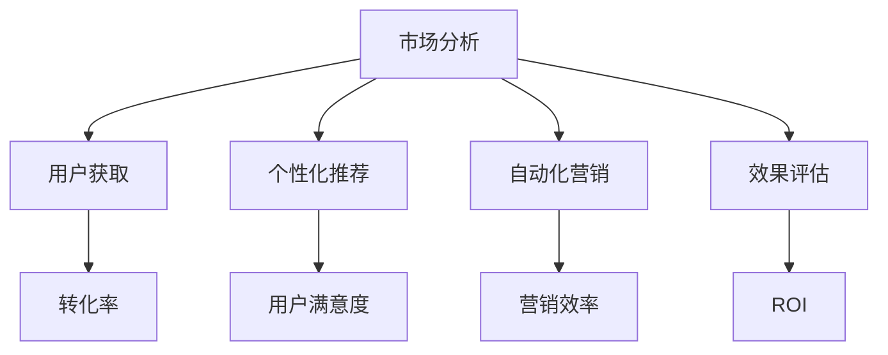

                 

# 人工智能创业：市场营销的技巧

> **关键词：** 人工智能、市场营销、创业、策略、用户获取、转化率、品牌建设

> **摘要：** 在人工智能时代，创业公司的市场营销策略需要与以往有所不同。本文将探讨如何利用人工智能技术优化市场营销，提高用户获取和转化率，以及如何构建强大的品牌形象。通过逻辑清晰的分析和实用的建议，本文旨在为创业者提供一套切实可行的市场营销方案。

## 1. 背景介绍

### 1.1 目的和范围

本文旨在帮助人工智能创业公司制定有效的市场营销策略。我们将深入探讨以下主题：

- 利用人工智能进行市场分析
- 创造吸引目标用户的内容
- 优化用户获取和转化策略
- 构建强大的品牌形象
- 利用大数据和机器学习进行营销效果评估

### 1.2 预期读者

本文适合以下读者群体：

- 创业者
- 市场营销经理
- 数字营销专家
- 人工智能技术爱好者

### 1.3 文档结构概述

本文将分为以下几个部分：

- 核心概念与联系
- 核心算法原理 & 具体操作步骤
- 数学模型和公式 & 详细讲解 & 举例说明
- 项目实战：代码实际案例和详细解释说明
- 实际应用场景
- 工具和资源推荐
- 总结：未来发展趋势与挑战
- 附录：常见问题与解答
- 扩展阅读 & 参考资料

### 1.4 术语表

#### 1.4.1 核心术语定义

- **人工智能（AI）**：模拟人类智能行为的技术和系统。
- **市场营销**：通过市场调研、品牌建设、产品推广等方式，将产品或服务传递给目标消费者的活动。
- **用户获取**：吸引潜在用户关注和参与的过程。
- **转化率**：用户从接触到购买或参与行动的比例。
- **品牌建设**：建立和维护品牌形象的过程。

#### 1.4.2 相关概念解释

- **大数据**：海量、复杂、快速的数据。
- **机器学习**：让计算机通过数据自动学习和改进的方法。
- **自然语言处理（NLP）**：使计算机理解和生成自然语言的技术。

#### 1.4.3 缩略词列表

- **AI**：人工智能
- **NLP**：自然语言处理
- **ML**：机器学习
- **CRM**：客户关系管理

## 2. 核心概念与联系

### 2.1 人工智能与市场营销的联系

人工智能技术在市场营销中发挥着重要作用，主要体现在以下几个方面：

1. **市场分析**：利用大数据和机器学习分析市场趋势、用户行为和竞争对手情况。
2. **个性化推荐**：基于用户数据和偏好提供个性化的产品推荐。
3. **自动化营销**：通过自动化工具和算法实现营销活动的优化和执行。
4. **效果评估**：利用数据分析和机器学习评估营销活动的效果，并进行优化。

### 2.2 核心概念原理和架构的 Mermaid 流程图



## 3. 核心算法原理 & 具体操作步骤

### 3.1 市场分析

市场分析是市场营销的基础。以下是市场分析的核心算法原理和具体操作步骤：

#### 3.1.1 算法原理

- **大数据分析**：收集并处理来自多个来源的数据，如社交媒体、搜索引擎、在线购物网站等。
- **机器学习**：利用算法从数据中提取有价值的信息，如用户偏好、市场趋势等。

#### 3.1.2 操作步骤

1. 数据收集：收集来自多个渠道的数据，如网站访问日志、社交媒体互动、客户反馈等。
2. 数据清洗：去除无效和错误的数据，保证数据的准确性。
3. 特征提取：从数据中提取有价值的特征，如用户年龄、性别、地理位置、购买行为等。
4. 数据分析：利用机器学习算法分析数据，提取市场趋势和用户偏好。
5. 报告生成：生成市场分析报告，为决策提供依据。

### 3.2 用户获取

用户获取是市场营销的关键。以下是用户获取的核心算法原理和具体操作步骤：

#### 3.2.1 算法原理

- **内容营销**：通过创造有价值的内容吸引潜在用户。
- **搜索引擎优化（SEO）**：优化网站内容和结构，提高在搜索引擎中的排名。
- **社交媒体营销**：利用社交媒体平台推广产品和服务。

#### 3.2.2 操作步骤

1. 内容策划：根据市场分析和用户偏好，策划和创建有价值的内容。
2. SEO优化：优化网站结构和内容，提高搜索引擎排名。
3. 社交媒体推广：在社交媒体平台上发布内容，吸引潜在用户关注。
4. 用户引导：通过引导用户进行注册、订阅、下载等操作，增加用户数量。

### 3.3 个性化推荐

个性化推荐是提高用户满意度和转化率的重要手段。以下是个性化推荐的核心算法原理和具体操作步骤：

#### 3.3.1 算法原理

- **协同过滤**：基于用户行为和偏好推荐相似的产品或服务。
- **基于内容的推荐**：根据产品或服务的特征推荐相似的内容。

#### 3.3.2 操作步骤

1. 用户行为分析：收集和分析用户行为数据，如浏览记录、购买历史等。
2. 内容特征提取：提取产品或服务的特征，如关键词、分类等。
3. 推荐算法：利用协同过滤和基于内容的推荐算法生成推荐结果。
4. 推荐结果展示：将推荐结果展示给用户，提高用户满意度和转化率。

### 3.4 自动化营销

自动化营销可以提高营销效率，减轻人力成本。以下是自动化营销的核心算法原理和具体操作步骤：

#### 3.4.1 算法原理

- **自动化流程**：将营销活动转化为自动化流程，如邮件营销、社交媒体自动化发布等。
- **预测分析**：利用机器学习预测用户行为，提前准备营销策略。

#### 3.4.2 操作步骤

1. 营销流程设计：设计自动化营销流程，如邮件营销、社交媒体自动化发布等。
2. 预测分析：利用机器学习预测用户行为，提前准备营销策略。
3. 自动化执行：根据预测结果，自动执行营销活动。
4. 营销效果监控：监控营销效果，根据反馈调整自动化营销策略。

### 3.5 效果评估

效果评估是优化营销策略的重要环节。以下是效果评估的核心算法原理和具体操作步骤：

#### 3.5.1 算法原理

- **数据分析**：利用数据分析方法评估营销效果，如转化率、ROI等。
- **A/B测试**：通过对比不同营销策略的效果，找出最佳策略。

#### 3.5.2 操作步骤

1. 数据收集：收集营销活动的数据，如访问量、转化率、ROI等。
2. 数据分析：利用数据分析方法评估营销效果。
3. A/B测试：对比不同营销策略的效果，找出最佳策略。
4. 策略调整：根据评估结果，调整营销策略。

## 4. 数学模型和公式 & 详细讲解 & 举例说明

### 4.1 市场分析

#### 4.1.1 顾客生命周期价值（CLV）

顾客生命周期价值是指顾客在一段时间内为公司带来的总利润。计算公式如下：

\[ \text{CLV} = \frac{\text{顾客总利润}}{\text{顾客保留时间}} \]

举例说明：

假设一个顾客在一年内为公司带来了1000美元的利润，该顾客的保留时间为5年，则该顾客的CLV为：

\[ \text{CLV} = \frac{1000}{5} = 200 \text{美元/年} \]

#### 4.1.2 转化率（Conversion Rate）

转化率是指用户从接触到采取行动（如购买、注册等）的比例。计算公式如下：

\[ \text{转化率} = \frac{\text{采取行动的用户数}}{\text{接触用户数}} \]

举例说明：

假设一个网站的访问量为1000人，其中有200人进行了购买，则该网站的转化率为：

\[ \text{转化率} = \frac{200}{1000} = 20\% \]

### 4.2 用户获取

#### 4.2.1 广告点击率（CTR）

广告点击率是指广告被点击的次数与展示次数的比例。计算公式如下：

\[ \text{CTR} = \frac{\text{点击次数}}{\text{展示次数}} \]

举例说明：

假设一个广告展示了1000次，其中有50次被点击，则该广告的点击率为：

\[ \text{CTR} = \frac{50}{1000} = 5\% \]

#### 4.2.2 搜索引擎排名（SERP）

搜索引擎排名是指网站在搜索引擎结果页面（SERP）上的位置。通常使用概率模型进行预测，如：

\[ \text{点击概率} = \frac{\text{网站排名}}{\text{总排名数}} \]

举例说明：

假设一个网站在搜索引擎结果页面上的排名为第10位，总共有100个排名，则该网站的点击概率为：

\[ \text{点击概率} = \frac{10}{100} = 10\% \]

### 4.3 个性化推荐

#### 4.3.1 协同过滤

协同过滤是一种基于用户行为的推荐算法。计算公式如下：

\[ \text{推荐评分} = \frac{\text{相似用户评分之和}}{\text{相似用户数}} \]

举例说明：

假设有两个用户A和B，用户A对电影1评分为5，对电影2评分为4，用户B对电影1评分为3，对电影2评分为5，则用户B对电影1的推荐评分为：

\[ \text{推荐评分} = \frac{5 + 3}{2} = 4 \]

#### 4.3.2 基于内容的推荐

基于内容的推荐算法通过分析产品或服务的特征进行推荐。计算公式如下：

\[ \text{相似度} = \frac{\text{共同特征数}}{\text{总特征数}} \]

举例说明：

假设产品A和产品B的共有特征数为3，总特征数分别为5和4，则产品A和产品B的相似度为：

\[ \text{相似度} = \frac{3}{5 + 4} = 0.4 \]

## 5. 项目实战：代码实际案例和详细解释说明

### 5.1 开发环境搭建

为了演示人工智能在市场营销中的应用，我们将使用Python作为主要编程语言，结合Jupyter Notebook进行开发。以下是搭建开发环境的基本步骤：

1. 安装Python：从Python官网下载并安装Python。
2. 安装Jupyter Notebook：在终端中运行`pip install jupyter`命令。
3. 安装必要的库：如NumPy、Pandas、Scikit-learn等。

### 5.2 源代码详细实现和代码解读

以下是一个简单的示例，展示如何使用Python进行市场分析。

#### 5.2.1 数据收集与清洗

```python
import pandas as pd

# 数据收集
data = pd.read_csv('customer_data.csv')

# 数据清洗
data.dropna(inplace=True)
```

此段代码首先导入Pandas库，然后从CSV文件中读取数据。接着，删除含有缺失值的数据行，以确保数据质量。

#### 5.2.2 特征提取

```python
# 特征提取
data['age_group'] = pd.cut(data['age'], bins=[0, 18, 30, 50, 70, float('inf')], labels=['18岁以下', '18-30岁', '30-50岁', '50-70岁', '70岁以上'])
```

此段代码将年龄特征划分为不同的年龄段，以便进行后续分析。

#### 5.2.3 数据分析

```python
from sklearn.cluster import KMeans

# 数据分析
kmeans = KMeans(n_clusters=5)
data['cluster'] = kmeans.fit_predict(data[['age', 'income']])
```

此段代码使用K-Means算法对数据进行分析，将用户划分为5个不同的群体。

#### 5.2.4 推荐系统

```python
from sklearn.neighbors import NearestNeighbors

# 推荐系统
nearest_neighbors = NearestNeighbors(n_neighbors=5)
nearest_neighbors.fit(data[['age', 'income']])
distances, indices = nearest_neighbors.kneighbors(data[['age', 'income']])

# 生成推荐结果
data['recommendation'] = data.iloc[indices[0]].index.tolist()
```

此段代码使用KNN算法为每个用户生成5个推荐结果。

### 5.3 代码解读与分析

以上代码示例展示了如何使用Python进行市场分析、特征提取、数据分析和推荐系统。在实际应用中，需要根据具体业务场景调整和分析方法。

## 6. 实际应用场景

### 6.1 电子商务

在电子商务领域，人工智能可以帮助企业实现个性化推荐、智能客服、智能库存管理等功能，从而提高用户体验和转化率。

### 6.2 金融行业

金融行业可以利用人工智能进行风险评估、投资组合优化、欺诈检测等，提高业务效率和准确性。

### 6.3 健康医疗

在健康医疗领域，人工智能可以帮助实现疾病预测、个性化治疗、药物研发等，提高医疗质量和效率。

## 7. 工具和资源推荐

### 7.1 学习资源推荐

#### 7.1.1 书籍推荐

- 《人工智能：一种现代的方法》
- 《机器学习：概率视角》
- 《深度学习》

#### 7.1.2 在线课程

- Coursera的《机器学习》课程
- edX的《人工智能导论》课程

#### 7.1.3 技术博客和网站

- medium.com/tensorflow
- towardsdatascience.com

### 7.2 开发工具框架推荐

#### 7.2.1 IDE和编辑器

- PyCharm
- Jupyter Notebook

#### 7.2.2 调试和性能分析工具

- VSCode
- Python Profiler

#### 7.2.3 相关框架和库

- TensorFlow
- PyTorch
- Scikit-learn

### 7.3 相关论文著作推荐

#### 7.3.1 经典论文

- “The Unreasonable Effectiveness of Data”
- “Learning to rank using gradient descent”

#### 7.3.2 最新研究成果

- arXiv.org
- NeurIPS.org

#### 7.3.3 应用案例分析

- “如何利用人工智能提升电商用户体验”
- “金融行业如何利用人工智能提高风险管理能力”

## 8. 总结：未来发展趋势与挑战

### 8.1 发展趋势

- **个性化营销**：随着用户数据的不断积累，个性化营销将成为主流。
- **自动化营销**：自动化工具和算法将替代部分传统营销活动。
- **跨渠道整合**：企业将更加注重不同渠道的整合和协同。

### 8.2 挑战

- **数据隐私**：如何在保护用户隐私的同时利用数据进行分析和营销。
- **算法偏见**：如何确保算法的公平性和透明度。
- **技术门槛**：如何降低人工智能技术在营销中的应用门槛。

## 9. 附录：常见问题与解答

### 9.1 常见问题

- **Q1**：人工智能在市场营销中的应用有哪些？
- **Q2**：如何确保营销活动的效果？
- **Q3**：如何降低人工智能在营销中的应用成本？

### 9.2 解答

- **Q1**：人工智能在市场营销中的应用包括市场分析、个性化推荐、自动化营销和效果评估。
- **Q2**：可以通过A/B测试、数据分析和用户反馈来确保营销活动的效果。
- **Q3**：可以通过使用开源工具、云服务和自动化流程来降低人工智能在营销中的应用成本。

## 10. 扩展阅读 & 参考资料

- [1] Russell, S., & Norvig, P. (2020). 《人工智能：一种现代的方法》。
- [2] Murphy, K. P. (2012). 《机器学习：概率视角》。
- [3] Goodfellow, I., Bengio, Y., & Courville, A. (2016). 《深度学习》。
- [4] Coursera. (2020). 机器学习课程。
- [5] edX. (2020). 人工智能导论课程。

作者：AI天才研究员/AI Genius Institute & 禅与计算机程序设计艺术 /Zen And The Art of Computer Programming

