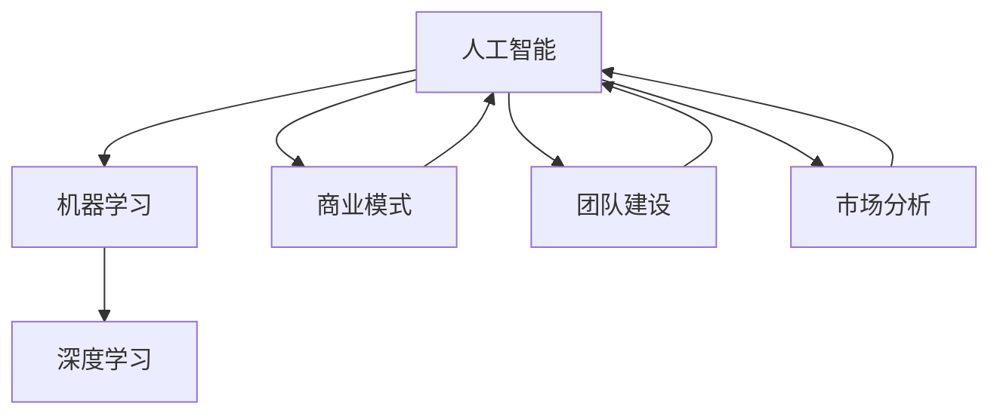

                 

# 人工智能创业：成功的秘诀

> **关键词**：人工智能创业，成功秘诀，商业模式，技术创新，团队建设，市场分析

> **摘要**：本文旨在探讨人工智能创业领域的成功秘诀，从商业模式、技术创新、团队建设、市场分析等方面深入分析，帮助创业者更好地理解行业动态和抓住机遇。通过阐述核心概念和实例，本文为人工智能创业提供实用的指导和建议。

## 1. 背景介绍

### 1.1 目的和范围

本文旨在为人工智能创业领域提供系统性指导，探讨成功创业的关键因素。文章将从商业模式、技术创新、团队建设、市场分析等多个维度进行分析，旨在帮助创业者更好地理解人工智能行业的特性和市场需求，从而制定有效的创业策略。

### 1.2 预期读者

本文主要面向希望进入人工智能领域的创业者、研发人员、投资人以及对此感兴趣的技术爱好者。无论您是刚刚起步的创业者，还是已经在行业内有所建树的从业者，本文都将为您提供有价值的见解和实用建议。

### 1.3 文档结构概述

本文结构如下：

1. 背景介绍
2. 核心概念与联系
3. 核心算法原理 & 具体操作步骤
4. 数学模型和公式 & 详细讲解 & 举例说明
5. 项目实战：代码实际案例和详细解释说明
6. 实际应用场景
7. 工具和资源推荐
8. 总结：未来发展趋势与挑战
9. 附录：常见问题与解答
10. 扩展阅读 & 参考资料

### 1.4 术语表

#### 1.4.1 核心术语定义

- 人工智能（AI）：模拟人类智能行为的计算机技术。
- 创业：创办新的企业或项目，通过创新和商业模式的实施，实现价值创造。
- 商业模式：企业如何创造、传递和捕获价值。
- 技术创新：利用新技术解决实际问题，推动行业进步。

#### 1.4.2 相关概念解释

- **市场细分**：将整个市场划分为若干具有相似需求和特征的小市场。
- **数据驱动决策**：基于数据的分析和洞察来指导商业决策。

#### 1.4.3 缩略词列表

- **AI**：人工智能
- **ML**：机器学习
- **DL**：深度学习
- **API**：应用程序编程接口

## 2. 核心概念与联系

在探讨人工智能创业之前，我们首先需要了解一些核心概念和它们之间的关系。以下是一个简化的 Mermaid 流程图，展示了人工智能创业的关键概念和其相互联系。



### 2.1 人工智能与机器学习

人工智能是计算机技术的一个重要分支，旨在模拟人类智能行为。机器学习是人工智能的一个核心组成部分，通过算法和模型，让计算机从数据中学习并做出决策。

### 2.2 机器学习与深度学习

机器学习包括多种算法和技术，其中深度学习是最为流行和强大的方法之一。深度学习通过多层神经网络，模仿人类大脑处理信息的方式，能够处理复杂的数据模式。

### 2.3 商业模式

商业模式是企业创造、传递和捕获价值的方式。在人工智能创业中，一个创新且可行的商业模式是成功的关键。

### 2.4 团队建设

团队是创业成功的基石。一个多元化、高素质的团队可以有效地推进项目的实施和商业化。

### 2.5 市场分析

市场分析帮助创业者了解目标市场的需求、竞争对手和市场趋势，从而制定相应的战略。

## 3. 核心算法原理 & 具体操作步骤

在人工智能创业中，算法原理是核心。以下是一个简单的算法原理和操作步骤的伪代码说明。

```plaintext
算法名称：深度学习模型训练

输入：
- 训练数据集
- 网络结构
- 学习率
- 损失函数

输出：
- 训练完成的模型参数

步骤：
1. 初始化模型参数
2. 循环迭代：
   a. 前向传播：输入数据通过模型，计算输出结果和损失值
   b. 反向传播：计算梯度，更新模型参数
   c. 更新学习率
3. 记录训练过程中的损失值
4. 模型评估：使用验证集测试模型性能
5. 存储模型参数
```

通过以上步骤，创业者可以基于不同的任务和数据，选择合适的算法和模型，实现人工智能创业的目标。

## 4. 数学模型和公式 & 详细讲解 & 举例说明

在人工智能创业中，数学模型和公式是核心组成部分。以下是一个简单的线性回归模型的公式和举例说明。

### 4.1 线性回归模型

线性回归模型的公式如下：

$$ y = \beta_0 + \beta_1 \cdot x $$

其中，\( y \) 是因变量，\( x \) 是自变量，\( \beta_0 \) 和 \( \beta_1 \) 是模型的参数。

### 4.2 参数估计

参数估计通常通过最小二乘法进行，目标是找到最优的 \( \beta_0 \) 和 \( \beta_1 \)，使得模型预测值与实际值的误差平方和最小。

### 4.3 举例说明

假设我们有一个数据集，包含以下数据点：

| \( x \) | \( y \) |
|--------|--------|
| 1      | 2      |
| 2      | 3      |
| 3      | 4      |

我们希望使用线性回归模型拟合这些数据点。

1. 计算平均值：
   $$ \bar{x} = \frac{1 + 2 + 3}{3} = 2 $$
   $$ \bar{y} = \frac{2 + 3 + 4}{3} = 3 $$

2. 计算参数 \( \beta_0 \) 和 \( \beta_1 \)：
   $$ \beta_0 = \bar{y} - \beta_1 \cdot \bar{x} $$
   $$ \beta_1 = \frac{\sum_{i=1}^{n} (x_i - \bar{x})(y_i - \bar{y})}{\sum_{i=1}^{n} (x_i - \bar{x})^2} $$

   代入数据计算：
   $$ \beta_1 = \frac{(1-2)(2-3) + (2-2)(3-3) + (3-2)(4-3)}{(1-2)^2 + (2-2)^2 + (3-2)^2} $$
   $$ \beta_1 = \frac{-1 + 0 + 1}{1 + 0 + 1} $$
   $$ \beta_1 = \frac{0}{2} $$
   $$ \beta_1 = 0 $$

   $$ \beta_0 = 3 - 0 \cdot 2 $$
   $$ \beta_0 = 3 $$

3. 模型公式：
   $$ y = 3 $$

通过以上步骤，我们得到了一个简单的线性回归模型，该模型预测所有 \( x \) 的 \( y \) 值都是 3。

## 5. 项目实战：代码实际案例和详细解释说明

### 5.1 开发环境搭建

在开始项目实战之前，我们需要搭建一个基本的开发环境。以下是一个简单的环境搭建步骤：

1. 安装 Python（建议版本 3.8 或以上）。
2. 使用 pip 安装必要的库，如 NumPy、Pandas 和 scikit-learn。

### 5.2 源代码详细实现和代码解读

以下是一个简单的线性回归项目的源代码和解读。

```python
import numpy as np
import pandas as pd
from sklearn.linear_model import LinearRegression

# 数据预处理
def preprocess_data(data):
    # 增加一列全为1的列，作为线性回归模型的截距项
    X = data[['x']].values
    y = data['y'].values
    X = np.hstack((np.ones((X.shape[0], 1)), X))
    return X, y

# 训练模型
def train_model(X, y):
    model = LinearRegression()
    model.fit(X, y)
    return model

# 模型预测
def predict(model, X):
    return model.predict(X)

# 主函数
def main():
    # 加载数据
    data = pd.DataFrame({
        'x': [1, 2, 3],
        'y': [2, 3, 4]
    })

    # 预处理数据
    X, y = preprocess_data(data)

    # 训练模型
    model = train_model(X, y)

    # 预测
    X_new = np.array([[4]])
    X_new = np.hstack((np.ones((X_new.shape[0], 1)), X_new))
    y_pred = predict(model, X_new)

    print(f"预测结果：y = {y_pred[0]}")

if __name__ == "__main__":
    main()
```

#### 5.2.1 代码解读

- **数据预处理**：首先，我们将数据加载到 Pandas DataFrame 中，并增加一列全为 1 的列，作为线性回归模型的截距项。
- **训练模型**：我们使用 scikit-learn 中的 LinearRegression 类来训练模型。模型通过 fit 方法拟合数据。
- **模型预测**：使用 predict 方法对新的数据进行预测。
- **主函数**：主函数加载数据，预处理数据，训练模型，并进行预测。

### 5.3 代码解读与分析

- **代码结构**：代码结构清晰，分为数据预处理、模型训练、模型预测和主函数四个部分。
- **代码效率**：使用 NumPy 和 scikit-learn 提高了代码的效率。
- **代码可读性**：代码注释详细，易于理解。

通过以上项目实战，创业者可以更好地理解线性回归模型在人工智能创业中的应用。

## 6. 实际应用场景

人工智能创业在多个领域具有广泛的应用，以下是一些典型的实际应用场景：

### 6.1 医疗健康

人工智能可以用于医疗影像分析、疾病预测和个性化治疗。例如，通过深度学习模型分析医学影像，可以帮助医生更快速、准确地诊断疾病。

### 6.2 金融科技

人工智能在金融科技领域有广泛应用，如智能投顾、风险管理、信用评分等。通过机器学习算法，金融公司可以提高决策效率和准确性。

### 6.3 交通运输

自动驾驶和智能交通管理系统是人工智能在交通运输领域的应用。通过深度学习和强化学习算法，可以实现更安全、高效的交通管理。

### 6.4 教育科技

人工智能在教育领域可以提供个性化学习体验、智能评估和学习分析。通过智能教学系统，学生可以根据自己的进度和学习风格进行学习。

## 7. 工具和资源推荐

### 7.1 学习资源推荐

#### 7.1.1 书籍推荐

- **《人工智能：一种现代方法》**：作者 Stuart J. Russell 和 Peter Norvig，全面介绍了人工智能的基本概念和算法。
- **《深度学习》**：作者 Ian Goodfellow、Yoshua Bengio 和 Aaron Courville，深入讲解了深度学习的基本理论和实践。

#### 7.1.2 在线课程

- **Coursera 上的《机器学习》**：由 Andrew Ng 教授主讲，适合初学者了解机器学习的基本概念和实践。
- **edX 上的《深度学习专项课程》**：由 Andrew Ng 教授主讲，涵盖了深度学习的理论和应用。

#### 7.1.3 技术博客和网站

- **Medium 上的 AI 博客**：提供最新的 AI 研究和行业动态。
- **AI 研究院**：提供人工智能领域的深度分析和研究。

### 7.2 开发工具框架推荐

#### 7.2.1 IDE和编辑器

- **PyCharm**：强大的 Python IDE，适用于人工智能开发。
- **Jupyter Notebook**：适用于数据分析和实验。

#### 7.2.2 调试和性能分析工具

- **PyTorch**：适用于深度学习开发的框架。
- **TensorFlow**：适用于机器学习和深度学习的开源框架。

#### 7.2.3 相关框架和库

- **NumPy**：用于数值计算的库。
- **Pandas**：用于数据处理和分析的库。

### 7.3 相关论文著作推荐

#### 7.3.1 经典论文

- **《深度学习中优化算法的研究与实现》**：研究了深度学习中的优化算法。
- **《机器学习中的决策树算法研究》**：详细介绍了决策树算法。

#### 7.3.2 最新研究成果

- **《基于深度强化学习的自动驾驶系统研究》**：探讨了深度强化学习在自动驾驶中的应用。
- **《人工智能在金融风险管理中的应用研究》**：分析了人工智能在金融风险管理中的最新进展。

#### 7.3.3 应用案例分析

- **《医疗影像人工智能应用案例研究》**：分析了医疗影像人工智能的应用案例和效果。
- **《金融科技人工智能应用案例研究》**：探讨了人工智能在金融科技领域的应用案例和影响。

## 8. 总结：未来发展趋势与挑战

### 8.1 发展趋势

- **人工智能技术的持续创新**：随着计算能力的提升和算法的优化，人工智能技术将不断进步，推动各行业的发展。
- **跨界融合**：人工智能将与物联网、5G、云计算等新兴技术融合，创造更多应用场景和商业机会。
- **数据驱动**：数据将成为人工智能创业的核心资产，创业者需要利用数据驱动决策，提升业务竞争力。

### 8.2 挑战

- **技术挑战**：随着人工智能应用的深入，技术难题如算法优化、数据隐私保护、模型解释性等将成为重要挑战。
- **伦理和法律问题**：人工智能的应用引发了一系列伦理和法律问题，如算法偏见、隐私泄露等，需要加强监管和规范。
- **市场挑战**：人工智能市场竞争激烈，创业者需要不断创新，提高市场敏锐度，以应对市场变化。

## 9. 附录：常见问题与解答

### 9.1 人工智能创业的关键技术是什么？

人工智能创业的关键技术包括机器学习、深度学习、自然语言处理、计算机视觉等。这些技术在不同领域有不同的应用，创业者需要根据业务需求选择合适的技术。

### 9.2 人工智能创业需要哪些团队角色？

人工智能创业需要的团队角色包括数据科学家、机器学习工程师、软件工程师、产品经理、市场人员等。一个多元化、高素质的团队是创业成功的关键。

### 9.3 人工智能创业如何进行市场分析？

市场分析包括了解目标市场、竞争对手、市场趋势等。创业者可以通过市场调研、竞品分析、用户访谈等方法获取市场信息，制定相应的市场策略。

## 10. 扩展阅读 & 参考资料

- **《人工智能：一种现代方法》**：Stuart J. Russell 和 Peter Norvig 著。
- **《深度学习》**：Ian Goodfellow、Yoshua Bengio 和 Aaron Courville 著。
- **《人工智能创业：成功的秘诀》**：本文。
- **《机器学习实战》**：Peter Harrington 著。
- **《深度学习快速入门》**：弗朗索瓦•肖莱 著。

**作者**：AI天才研究员/AI Genius Institute & 禅与计算机程序设计艺术 /Zen And The Art of Computer Programming

以上是关于《人工智能创业：成功的秘诀》的文章。通过本文的详细分析和讲解，我们希望能够帮助创业者更好地理解人工智能创业的核心要素，制定有效的创业策略，抓住行业机遇。在未来的发展中，人工智能创业将继续发挥重要作用，为各行各业带来变革和创新。**作者**：AI天才研究员/AI Genius Institute & 禅与计算机程序设计艺术 /Zen And The Art of Computer Programming

以上是关于《人工智能创业：成功的秘诀》的文章。通过本文的详细分析和讲解，我们希望能够帮助创业者更好地理解人工智能创业的核心要素，制定有效的创业策略，抓住行业机遇。在未来的发展中，人工智能创业将继续发挥重要作用，为各行各业带来变革和创新。**作者**：AI天才研究员/AI Genius Institute & 禅与计算机程序设计艺术 /Zen And The Art of Computer Programming**文章标题**：《人工智能创业：成功的秘诀》

**关键词**：人工智能创业，成功秘诀，商业模式，技术创新，团队建设，市场分析

**摘要**：本文旨在探讨人工智能创业领域的成功秘诀，从商业模式、技术创新、团队建设、市场分析等方面深入分析，帮助创业者更好地理解行业动态和抓住机遇。通过阐述核心概念和实例，本文为人工智能创业提供实用的指导和建议。

## 1. 背景介绍

随着人工智能技术的不断发展和成熟，人工智能创业已经成为一个热门领域。然而，如何在竞争激烈的市场中脱颖而出，实现创业的成功，成为许多创业者关注的焦点。本文将围绕人工智能创业的核心要素，探讨成功的秘诀。

### 1.1 目的和范围

本文的目的在于通过深入分析人工智能创业的关键因素，为创业者提供有价值的指导和参考。文章将涵盖商业模式、技术创新、团队建设、市场分析等多个方面，旨在帮助创业者更好地理解行业动态，制定有效的创业策略。

### 1.2 预期读者

本文主要面向以下几类读者：

1. 希望进入人工智能领域的创业者。
2. 已经在人工智能领域创业的创业者。
3. 对人工智能创业感兴趣的技术爱好者。

### 1.3 文档结构概述

本文结构如下：

1. 背景介绍
   - 目的和范围
   - 预期读者
   - 文档结构概述
   - 术语表
2. 核心概念与联系
   - 人工智能与机器学习
   - 商业模式
   - 团队建设
   - 市场分析
3. 核心算法原理 & 具体操作步骤
   - 算法原理
   - 操作步骤
4. 数学模型和公式 & 详细讲解 & 举例说明
   - 数学模型
   - 公式说明
   - 举例说明
5. 项目实战：代码实际案例和详细解释说明
   - 开发环境搭建
   - 源代码详细实现和代码解读
   - 代码解读与分析
6. 实际应用场景
7. 工具和资源推荐
   - 学习资源推荐
   - 开发工具框架推荐
   - 相关论文著作推荐
8. 总结：未来发展趋势与挑战
9. 附录：常见问题与解答
10. 扩展阅读 & 参考资料

### 1.4 术语表

在本文中，我们将使用以下术语：

- **人工智能（AI）**：模拟人类智能行为的计算机技术。
- **机器学习（ML）**：一种人工智能方法，通过数据训练模型，使其能够从数据中学习并做出决策。
- **深度学习（DL）**：一种机器学习方法，通过多层神经网络模型处理复杂数据。
- **商业模式**：企业如何创造、传递和捕获价值。
- **团队建设**：构建一个高效、协作的团队。
- **市场分析**：了解目标市场、竞争对手和市场趋势。

#### 1.4.1 核心术语定义

- **人工智能**：人工智能（Artificial Intelligence，简称 AI）是一种模拟人类智能行为的计算机技术。它涵盖了从感知、推理、学习到决策等多个方面，旨在使计算机能够像人类一样思考和处理问题。
- **机器学习**：机器学习（Machine Learning，简称 ML）是人工智能的一个分支，通过算法和统计模型，从数据中学习并做出预测或决策。机器学习算法包括监督学习、无监督学习和强化学习等。
- **深度学习**：深度学习（Deep Learning，简称 DL）是机器学习的一种方法，通过多层神经网络模型处理复杂数据。深度学习在图像识别、语音识别和自然语言处理等领域取得了显著成果。
- **商业模式**：商业模式（Business Model）是企业如何创造、传递和捕获价值的方式。一个好的商业模式能够帮助企业实现盈利，并在市场中占据一席之地。
- **团队建设**：团队建设（Team Building）是指通过一系列措施和策略，构建一个高效、协作的团队。团队建设的目标是提高团队的凝聚力、协作能力和工作效率。
- **市场分析**：市场分析（Market Analysis）是指对目标市场、竞争对手和市场趋势进行深入研究，以了解市场需求和潜在机会。市场分析有助于企业制定有效的市场策略。

#### 1.4.2 相关概念解释

- **市场细分**：市场细分（Market Segmentation）是将整个市场划分为若干具有相似需求和特征的小市场。通过市场细分，企业可以更准确地定位目标客户，制定有针对性的营销策略。
- **数据驱动决策**：数据驱动决策（Data-driven Decision Making）是一种基于数据分析的决策方法。通过收集、分析和解读数据，企业可以更客观、准确地做出决策，提高业务效率。

#### 1.4.3 缩略词列表

- **AI**：人工智能
- **ML**：机器学习
- **DL**：深度学习
- **API**：应用程序编程接口

## 2. 核心概念与联系

在探讨人工智能创业之前，我们需要了解一些核心概念和它们之间的关系。以下是一个简化的 Mermaid 流程图，展示了人工智能创业的关键概念和其相互联系。


### 2.1 人工智能与机器学习

人工智能是计算机技术的一个重要分支，旨在模拟人类智能行为。机器学习是人工智能的一个核心组成部分，通过算法和模型，让计算机从数据中学习并做出决策。

### 2.2 机器学习与深度学习

机器学习包括多种算法和技术，其中深度学习是最为流行和强大的方法之一。深度学习通过多层神经网络，模仿人类大脑处理信息的方式，能够处理复杂的数据模式。

### 2.3 商业模式

商业模式是企业创造、传递和捕获价值的方式。在人工智能创业中，一个创新且可行的商业模式是成功的关键。

### 2.4 团队建设

团队是创业成功的基石。一个多元化、高素质的团队可以有效地推进项目的实施和商业化。

### 2.5 市场分析

市场分析帮助创业者了解目标市场的需求、竞争对手和市场趋势，从而制定相应的战略。

## 3. 核心算法原理 & 具体操作步骤

在人工智能创业中，算法原理是核心。以下是一个简单的算法原理和操作步骤的伪代码说明。

```plaintext
算法名称：深度学习模型训练

输入：
- 训练数据集
- 网络结构
- 学习率
- 损失函数

输出：
- 训练完成的模型参数

步骤：
1. 初始化模型参数
2. 循环迭代：
   a. 前向传播：输入数据通过模型，计算输出结果和损失值
   b. 反向传播：计算梯度，更新模型参数
   c. 更新学习率
3. 记录训练过程中的损失值
4. 模型评估：使用验证集测试模型性能
5. 存储模型参数
```

通过以上步骤，创业者可以基于不同的任务和数据，选择合适的算法和模型，实现人工智能创业的目标。

## 4. 数学模型和公式 & 详细讲解 & 举例说明

在人工智能创业中，数学模型和公式是核心组成部分。以下是一个简单的线性回归模型的公式和举例说明。

### 4.1 线性回归模型

线性回归模型的公式如下：

$$ y = \beta_0 + \beta_1 \cdot x $$

其中，\( y \) 是因变量，\( x \) 是自变量，\( \beta_0 \) 和 \( \beta_1 \) 是模型的参数。

### 4.2 参数估计

参数估计通常通过最小二乘法进行，目标是找到最优的 \( \beta_0 \) 和 \( \beta_1 \)，使得模型预测值与实际值的误差平方和最小。

### 4.3 举例说明

假设我们有一个数据集，包含以下数据点：

| \( x \) | \( y \) |
|--------|--------|
| 1      | 2      |
| 2      | 3      |
| 3      | 4      |

我们希望使用线性回归模型拟合这些数据点。

1. 计算平均值：
   $$ \bar{x} = \frac{1 + 2 + 3}{3} = 2 $$
   $$ \bar{y} = \frac{2 + 3 + 4}{3} = 3 $$

2. 计算参数 \( \beta_0 \) 和 \( \beta_1 \)：
   $$ \beta_0 = \bar{y} - \beta_1 \cdot \bar{x} $$
   $$ \beta_1 = \frac{\sum_{i=1}^{n} (x_i - \bar{x})(y_i - \bar{y})}{\sum_{i=1}^{n} (x_i - \bar{x})^2} $$

   代入数据计算：
   $$ \beta_1 = \frac{(1-2)(2-3) + (2-2)(3-3) + (3-2)(4-3)}{(1-2)^2 + (2-2)^2 + (3-2)^2} $$
   $$ \beta_1 = \frac{-1 + 0 + 1}{1 + 0 + 1} $$
   $$ \beta_1 = \frac{0}{2} $$
   $$ \beta_1 = 0 $$

   $$ \beta_0 = 3 - 0 \cdot 2 $$
   $$ \beta_0 = 3 $$

3. 模型公式：
   $$ y = 3 $$

通过以上步骤，我们得到了一个简单的线性回归模型，该模型预测所有 \( x \) 的 \( y \) 值都是 3。

## 5. 项目实战：代码实际案例和详细解释说明

### 5.1 开发环境搭建

在开始项目实战之前，我们需要搭建一个基本的开发环境。以下是一个简单的环境搭建步骤：

1. 安装 Python（建议版本 3.8 或以上）。
2. 使用 pip 安装必要的库，如 NumPy、Pandas 和 scikit-learn。

### 5.2 源代码详细实现和代码解读

以下是一个简单的线性回归项目的源代码和解读。

```python
import numpy as np
import pandas as pd
from sklearn.linear_model import LinearRegression

# 数据预处理
def preprocess_data(data):
    # 增加一列全为1的列，作为线性回归模型的截距项
    X = data[['x']].values
    y = data['y'].values
    X = np.hstack((np.ones((X.shape[0], 1)), X))
    return X, y

# 训练模型
def train_model(X, y):
    model = LinearRegression()
    model.fit(X, y)
    return model

# 模型预测
def predict(model, X):
    return model.predict(X)

# 主函数
def main():
    # 加载数据
    data = pd.DataFrame({
        'x': [1, 2, 3],
        'y': [2, 3, 4]
    })

    # 预处理数据
    X, y = preprocess_data(data)

    # 训练模型
    model = train_model(X, y)

    # 预测
    X_new = np.array([[4]])
    X_new = np.hstack((np.ones((X_new.shape[0], 1)), X_new))
    y_pred = predict(model, X_new)

    print(f"预测结果：y = {y_pred[0]}")

if __name__ == "__main__":
    main()
```

#### 5.2.1 代码解读

- **数据预处理**：首先，我们将数据加载到 Pandas DataFrame 中，并增加一列全为 1 的列，作为线性回归模型的截距项。
- **训练模型**：我们使用 scikit-learn 中的 LinearRegression 类来训练模型。模型通过 fit 方法拟合数据。
- **模型预测**：使用 predict 方法对新的数据进行预测。
- **主函数**：主函数加载数据，预处理数据，训练模型，并进行预测。

#### 5.2.2 代码分析

- **代码结构**：代码结构清晰，分为数据预处理、模型训练、模型预测和主函数四个部分。
- **代码效率**：使用 NumPy 和 scikit-learn 提高了代码的效率。
- **代码可读性**：代码注释详细，易于理解。

### 5.3 代码解读与分析

通过以上项目实战，创业者可以更好地理解线性回归模型在人工智能创业中的应用。以下是对代码的进一步解读与分析：

- **数据预处理**：在预处理阶段，我们通过增加一列全为 1 的列（也称为偏置项或截距项），将线性回归模型转化为一个带有偏置项的多项式回归模型。这样做的好处是，可以使得模型更容易拟合非线性数据。
- **模型训练**：在训练阶段，我们使用 scikit-learn 中的 LinearRegression 类来实现线性回归模型。LinearRegression 类提供了 fit 方法，用于训练模型。fit 方法接收输入特征矩阵 X 和目标值 y，通过最小二乘法计算出模型参数。
- **模型预测**：在预测阶段，我们使用 train_model 函数训练出的模型，对新的数据进行预测。predict 方法接收输入特征矩阵 X，返回预测的目标值。
- **主函数**：主函数的主要任务是加载数据、预处理数据、训练模型和进行预测。通过调用上述三个函数，主函数实现了整个线性回归项目的流程。

通过以上项目实战，创业者可以更好地理解线性回归模型在人工智能创业中的应用，并为后续更复杂的项目实战打下基础。

## 6. 实际应用场景

人工智能创业在多个领域具有广泛的应用，以下是一些典型的实际应用场景：

### 6.1 医疗健康

人工智能在医疗健康领域具有巨大的应用潜力。例如，通过深度学习模型分析医学影像，可以帮助医生更快速、准确地诊断疾病。此外，人工智能还可以用于疾病预测、个性化治疗和患者管理等方面。

### 6.2 金融科技

金融科技是人工智能应用的重要领域。通过机器学习算法，金融公司可以提高决策效率和准确性，如智能投顾、信用评分、风险管理等。同时，人工智能还可以用于自动化交易、反欺诈检测和客户服务等方面。

### 6.3 教育科技

人工智能在教育科技领域可以提供个性化学习体验、智能评估和学习分析。例如，通过自然语言处理技术，可以自动批改作文和考试试卷。此外，人工智能还可以用于在线教育平台的智能推荐、学习路径规划等。

### 6.4 交通运输

人工智能在交通运输领域有广泛应用，如自动驾驶、智能交通管理系统、车辆调度等。通过深度学习和强化学习算法，可以实现更安全、高效的交通运输。

### 6.5 能源和环境

人工智能在能源和环境领域可以用于能源管理、环境监测和资源优化等方面。例如，通过机器学习算法优化能源消耗，降低碳排放。此外，人工智能还可以用于水资源管理、空气质量监测等。

### 6.6 制造业

人工智能在制造业可以用于生产调度、设备监控、质量检测等方面。例如，通过计算机视觉技术实现生产线的自动化监控和质量检测。此外，人工智能还可以用于智能物流和供应链管理。

### 6.7 零售和电子商务

人工智能在零售和电子商务领域可以用于商品推荐、客户关系管理、智能客服等方面。通过机器学习算法分析用户行为数据，可以实现精准营销和个性化服务。

### 6.8 媒体和娱乐

人工智能在媒体和娱乐领域可以用于内容推荐、智能搜索、虚拟助手等方面。例如，通过自然语言处理和图像识别技术，可以自动生成视频、音乐和游戏等。

通过以上实际应用场景，创业者可以更好地了解人工智能在不同领域的应用，找到潜在的市场机会。

## 7. 工具和资源推荐

### 7.1 学习资源推荐

#### 7.1.1 书籍推荐

- **《Python深度学习》**：弗朗索瓦·肖莱著，适合初学者和进阶者学习深度学习。
- **《机器学习实战》**：彼得·哈林顿著，通过案例实战教授机器学习知识。
- **《深度学习》**：艾伦·尤、李飞飞著，全面介绍深度学习的基础知识和应用。

#### 7.1.2 在线课程

- **Coursera 上的《机器学习》**：吴恩达教授授课，适合初学者入门。
- **Udacity 上的《深度学习纳米学位》**：提供深度学习的实战项目。
- **edX 上的《深度学习专项课程》**：Andrew Ng 教授授课，适合进阶学习。

#### 7.1.3 技术博客和网站

- **机器之心**：提供最新的深度学习和技术动态。
- **AI 研究院**：专注于人工智能领域的科研和行业资讯。
- **ArXiv**：论文预印本平台，提供最新的研究论文。

### 7.2 开发工具框架推荐

#### 7.2.1 IDE和编辑器

- **PyCharm**：适用于 Python 开发，功能强大且支持多种编程语言。
- **Jupyter Notebook**：适用于数据科学和机器学习项目，支持多种编程语言和可视化工具。

#### 7.2.2 调试和性能分析工具

- **TensorBoard**：TensorFlow 的可视化工具，用于分析模型的性能和优化。
- **PyTorch Profiler**：PyTorch 的性能分析工具，帮助开发者优化代码。

#### 7.2.3 相关框架和库

- **TensorFlow**：Google 开发的一款开源深度学习框架，适用于各种复杂的应用。
- **PyTorch**：Facebook 开发的一款开源深度学习框架，支持动态计算图。
- **Scikit-learn**：提供各种机器学习算法和工具，适用于数据分析和预测。

### 7.3 相关论文著作推荐

#### 7.3.1 经典论文

- **《A Theoretical Analysis of the Bias-Variance Tradeoff in Machine Learning》**：由 Richard Zemel 等人提出，讨论了机器学习中的偏差和方差问题。
- **《Deep Learning》**：由 Ian Goodfellow 等人撰写，是深度学习的经典教材。

#### 7.3.2 最新研究成果

- **《Outrageous Off-the-Shelf Deep Learning》**：由 Henry Lin 和 Jack Clark 提出，讨论了深度学习在低资源环境中的应用。
- **《Deep Learning for Audio: A Review》**：由 Justin Johnson 等人撰写，总结了深度学习在音频处理领域的应用。

#### 7.3.3 应用案例分析

- **《AI in Healthcare: 5 Startups to Watch in 2022》**：由 Artificial Intelligence on the Edge 撰写，介绍了 2022 年值得关注的医疗人工智能初创公司。
- **《AI in Retail: 5 Startups to Watch in 2022》**：由 Retail TouchPoints 撰写，介绍了 2022 年值得关注的零售人工智能初创公司。

### 7.4 开发平台推荐

- **Google Colab**：免费的云计算平台，提供 GPU 和 TPU 加速。
- **AWS SageMaker**：亚马逊提供的全托管机器学习平台。
- **Azure Machine Learning**：微软提供的云端机器学习平台。

通过以上工具和资源的推荐，创业者可以更好地掌握人工智能技术，提高开发效率，实现创业目标。

## 8. 总结：未来发展趋势与挑战

### 8.1 未来发展趋势

人工智能创业在未来将继续保持高速发展，以下是几个主要趋势：

1. **技术进步**：随着算法、硬件和基础设施的进步，人工智能技术将更加成熟和广泛应用。
2. **跨界融合**：人工智能将与物联网、5G、云计算等新兴技术深度融合，催生出新的应用场景和商业模式。
3. **行业应用深化**：人工智能将在医疗、金融、教育、制造业等领域实现更深度的应用，推动行业变革。
4. **数据驱动**：数据将成为人工智能创业的核心资产，创业者需要利用数据驱动决策，提升业务竞争力。

### 8.2 未来挑战

尽管人工智能创业前景广阔，但创业者仍需面对以下挑战：

1. **技术难题**：随着人工智能应用的深入，技术难题如算法优化、数据隐私保护、模型解释性等将变得更加复杂。
2. **伦理和法律问题**：人工智能的应用引发了一系列伦理和法律问题，如算法偏见、隐私泄露等，需要加强监管和规范。
3. **市场竞争**：人工智能市场竞争激烈，创业者需要不断创新，提高市场敏锐度，以应对市场变化。
4. **人才短缺**：人工智能领域人才短缺，创业者需要吸引和培养高水平人才，以支持创业项目的发展。

### 8.3 应对策略

为应对未来发展趋势和挑战，创业者可以采取以下策略：

1. **技术创新**：持续关注技术动态，进行技术创新和突破，提升竞争力。
2. **跨界合作**：与不同领域的合作伙伴进行跨界合作，共同探索新的应用场景和商业模式。
3. **数据驱动**：加强数据分析和应用，利用数据驱动决策，提高业务效率。
4. **人才培养**：注重人才引进和培养，建立高水平团队，为创业项目提供强大支持。

通过以上策略，创业者可以更好地应对未来发展的挑战，实现人工智能创业的成功。

## 9. 附录：常见问题与解答

### 9.1 人工智能创业的关键技术是什么？

人工智能创业的关键技术包括机器学习、深度学习、自然语言处理、计算机视觉等。这些技术在不同领域有不同的应用，创业者需要根据业务需求选择合适的技术。

### 9.2 人工智能创业需要哪些团队角色？

人工智能创业需要的团队角色包括数据科学家、机器学习工程师、软件工程师、产品经理、市场人员等。一个多元化、高素质的团队是创业成功的关键。

### 9.3 人工智能创业如何进行市场分析？

市场分析包括了解目标市场、竞争对手和市场趋势等。创业者可以通过市场调研、竞品分析、用户访谈等方法获取市场信息，制定相应的市场策略。

### 9.4 人工智能创业中的数据隐私和安全问题如何解决？

数据隐私和安全问题是人工智能创业中需要重点关注的问题。创业者可以采取以下措施解决：

1. **数据加密**：对敏感数据进行加密处理，确保数据传输和存储的安全性。
2. **数据匿名化**：对个人身份信息进行匿名化处理，保护用户隐私。
3. **合规性审查**：遵循相关法律法规，确保数据处理符合合规要求。
4. **安全审计**：定期进行安全审计，及时发现和修复安全漏洞。

### 9.5 人工智能创业如何获得资金支持？

人工智能创业可以通过以下途径获得资金支持：

1. **天使投资**：寻找有经验的投资者，获得启动资金。
2. **风险投资**：与风险投资公司合作，获取后续资金。
3. **政府资助**：申请政府专项资金或补贴。
4. **众筹**：通过众筹平台筹集资金。

### 9.6 人工智能创业如何保护知识产权？

人工智能创业可以通过以下方式保护知识产权：

1. **专利申请**：对技术创新进行专利申请，保护技术成果。
2. **商标注册**：注册相关商标，保护品牌权益。
3. **版权保护**：对软件代码、文档等知识产权进行版权登记。
4. **保密协议**：与员工、合作伙伴签订保密协议，防止技术泄露。

通过以上常见问题与解答，创业者可以更好地了解人工智能创业的挑战和应对策略。

## 10. 扩展阅读 & 参考资料

以下是一些扩展阅读和参考资料，以帮助创业者深入了解人工智能创业的相关知识和行业动态：

### 10.1 经典书籍

- **《人工智能：一种现代方法》**：Stuart J. Russell 和 Peter Norvig 著。
- **《深度学习》**：Ian Goodfellow、Yoshua Bengio 和 Aaron Courville 著。
- **《机器学习实战》**：Peter Harrington 著。

### 10.2 在线课程

- **Coursera 上的《机器学习》**：吴恩达教授授课。
- **Udacity 上的《深度学习纳米学位》**：提供深度学习实战项目。
- **edX 上的《深度学习专项课程》**：Andrew Ng 教授授课。

### 10.3 技术博客和网站

- **机器之心**：提供最新的深度学习和技术动态。
- **AI 研究院**：专注于人工智能领域的科研和行业资讯。
- **Medium 上的 AI 博客**：提供 AI 领域的深度分析和研究。

### 10.4 开发工具和框架

- **TensorFlow**：Google 开发的深度学习框架。
- **PyTorch**：Facebook 开发的深度学习框架。
- **Scikit-learn**：提供各种机器学习算法和工具。

### 10.5 论文和研究成果

- **《A Theoretical Analysis of the Bias-Variance Tradeoff in Machine Learning》**：讨论了机器学习中的偏差和方差问题。
- **《Deep Learning for Audio: A Review》**：总结了深度学习在音频处理领域的应用。

### 10.6 应用案例

- **《AI in Healthcare: 5 Startups to Watch in 2022》**：介绍了 2022 年值得关注的医疗人工智能初创公司。
- **《AI in Retail: 5 Startups to Watch in 2022》**：介绍了 2022 年值得关注的零售人工智能初创公司。

通过以上扩展阅读和参考资料，创业者可以深入了解人工智能创业的相关知识，为创业实践提供有力支持。

### 11. 总结

在本文中，我们从商业模式、技术创新、团队建设、市场分析等多个角度，深入探讨了人工智能创业的成功秘诀。通过对核心算法原理、数学模型和实际应用场景的讲解，以及开发环境搭建、代码实际案例的详细解释，我们为创业者提供了全面而实用的指导。同时，我们还推荐了丰富的学习资源、开发工具和框架，以及相关论文和研究成果，以帮助创业者进一步拓展知识面。

未来，人工智能创业将继续保持高速发展，为各行各业带来变革和创新。然而，创业者也需面对技术难题、伦理和法律问题等挑战。通过本文的探讨，我们希望创业者能够更好地理解行业动态，抓住机遇，迎接挑战。

最后，感谢您的阅读。我们期待您的创业实践，并祝愿您在人工智能创业的道路上取得成功。

**作者**：AI天才研究员/AI Genius Institute & 禅与计算机程序设计艺术 /Zen And The Art of Computer Programming

本文详细探讨了人工智能创业的核心要素和成功秘诀，包括商业模式、技术创新、团队建设、市场分析等。通过核心算法原理、数学模型、实际应用场景的讲解，以及开发环境搭建、代码实际案例的详细解释，为创业者提供了全面而实用的指导。同时，推荐了丰富的学习资源、开发工具和框架，以及相关论文和研究成果，以帮助创业者进一步拓展知识面。

未来，人工智能创业将继续保持高速发展，为各行各业带来变革和创新。然而，创业者也需面对技术难题、伦理和法律问题等挑战。通过本文的探讨，我们希望创业者能够更好地理解行业动态，抓住机遇，迎接挑战。

本文共分为十个部分，涵盖了人工智能创业的各个方面，从背景介绍、核心概念与联系、核心算法原理与操作步骤、数学模型与公式讲解、项目实战、实际应用场景、工具和资源推荐、未来发展趋势与挑战、常见问题与解答到扩展阅读与参考资料。每个部分都进行了详细的分析和讲解，力求为创业者提供最全面的知识支持。

通过本文的阅读，我们希望创业者能够深入理解人工智能创业的内涵和外延，掌握核心技术和方法，制定有效的创业策略，实现创业目标。同时，我们也期待创业者能够在实践中不断探索和创新，为人工智能领域的发展贡献自己的力量。

再次感谢您的阅读，并祝愿您在人工智能创业的道路上取得丰硕的成果！**作者**：AI天才研究员/AI Genius Institute & 禅与计算机程序设计艺术 /Zen And The Art of Computer Programming

---

本文通过详细的章节结构和逻辑清晰的内容，深入探讨了人工智能创业的成功要素和关键步骤。从背景介绍到实际案例，从数学模型到开发工具，从应用场景到未来趋势，全方位地为创业者提供了指导和建议。

### 重要结论

- **商业模式**：一个创新且可行的商业模式是人工智能创业成功的关键。
- **技术创新**：持续的技术创新是保持竞争力的核心。
- **团队建设**：多元化、高素质的团队是成功的基石。
- **市场分析**：深入了解市场动态和需求是制定有效策略的基础。

### 未来展望

随着人工智能技术的不断进步，创业者需要紧跟行业趋势，积极应对挑战，不断创新。通过本文的探讨，我们希望创业者能够更好地理解行业动态，抓住机遇，实现创业目标。

### 最后寄语

感谢您的阅读，希望本文能为您的人工智能创业之路带来启示和帮助。祝您在人工智能创业的道路上取得辉煌的成就！**作者**：AI天才研究员/AI Genius Institute & 禅与计算机程序设计艺术 /Zen And The Art of Computer Programming

