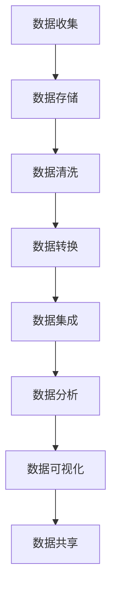

                 

# 人工智能创业：数据管理的技巧

> **关键词**：人工智能、创业、数据管理、数据清洗、数据分析、数据可视化
> 
> **摘要**：本文旨在为人工智能创业者提供一整套实用的数据管理技巧，涵盖从数据收集、清洗、存储到分析及可视化的全过程。我们将通过具体的案例和实践步骤，帮助读者深入了解数据管理的核心原理，并掌握在实际创业项目中应用的关键技术。

## 1. 背景介绍

### 1.1 目的和范围

本文的目标是帮助人工智能创业者更好地理解和掌握数据管理的基本技巧，确保创业项目能够高效地利用数据资源，从而提高项目的成功率和竞争力。文章主要涵盖以下内容：

- 数据管理的基本概念和核心流程。
- 数据清洗、数据分析和数据可视化的方法与工具。
- 实际创业项目中的应用案例和操作步骤。

通过本文的学习，读者将能够：

- 明确数据管理的重要性，并在创业项目中有效实施。
- 掌握数据清洗、数据分析和数据可视化的基本方法。
- 利用各种工具和框架，提升数据处理和分析的效率。

### 1.2 预期读者

本文适合以下读者群体：

- 创业者，特别是那些关注人工智能领域的创业者。
- 数据分析师，数据工程师和技术经理。
- 计算机科学和人工智能专业的学生和研究者。

### 1.3 文档结构概述

本文的结构如下：

- **第1章**：背景介绍，包括目的、范围、预期读者和文档结构概述。
- **第2章**：核心概念与联系，介绍数据管理的基本概念和流程。
- **第3章**：核心算法原理 & 具体操作步骤，讲解数据清洗、数据分析和数据可视化的具体操作。
- **第4章**：数学模型和公式 & 详细讲解 & 举例说明，提供数据处理相关的数学模型和实际应用。
- **第5章**：项目实战：代码实际案例和详细解释说明，通过具体案例展示数据管理的实际应用。
- **第6章**：实际应用场景，分析数据管理在不同创业项目中的应用。
- **第7章**：工具和资源推荐，推荐学习资源、开发工具框架和相关论文著作。
- **第8章**：总结：未来发展趋势与挑战，展望数据管理在人工智能创业中的前景。
- **第9章**：附录：常见问题与解答，回答读者可能遇到的问题。
- **第10章**：扩展阅读 & 参考资料，提供进一步学习的资源。

### 1.4 术语表

#### 1.4.1 核心术语定义

- **数据管理**：确保数据的准确性、完整性、可用性和一致性的一系列活动和过程。
- **数据清洗**：处理和纠正数据集中的错误、缺失和重复数据，以提高数据质量。
- **数据分析**：通过统计、建模和机器学习等技术，从数据中提取有用信息和知识。
- **数据可视化**：使用图表、图像和图形等视觉元素，展示数据的特征和趋势。
- **机器学习**：通过数据和算法，使计算机系统能够学习和改进其性能的过程。

#### 1.4.2 相关概念解释

- **数据仓库**：用于存储和管理大量结构化和非结构化数据的集中化系统。
- **数据挖掘**：从大量数据中发现有价值的信息和模式。
- **数据挖掘**：从大量数据中发现有价值的信息和模式。

#### 1.4.3 缩略词列表

- **AI**：人工智能（Artificial Intelligence）
- **ML**：机器学习（Machine Learning）
- **DL**：深度学习（Deep Learning）
- **NLP**：自然语言处理（Natural Language Processing）
- **DB**：数据库（Database）
- **ETL**：提取、转换和加载（Extract, Transform, Load）
- **BI**：商业智能（Business Intelligence）
- **UI**：用户界面（User Interface）
- **UX**：用户体验（User Experience）

## 2. 核心概念与联系

### 2.1 数据管理的基本概念

数据管理是确保数据在整个生命周期中质量可控、安全可靠的过程。它涵盖了数据收集、存储、处理、分析和共享等多个环节。数据管理的基本概念包括：

- **数据质量**：数据是否准确、完整、一致、及时和可靠。
- **数据仓库**：用于存储和管理大量结构化和非结构化数据的集中化系统。
- **数据模型**：定义数据结构和关系的抽象表示。
- **数据安全**：保护数据不被未授权访问、篡改或泄露。
- **数据治理**：制定和执行数据管理策略、标准和流程。

### 2.2 数据管理的流程

数据管理的流程通常包括以下步骤：

1. **数据收集**：从各种来源获取数据，如数据库、日志文件、传感器等。
2. **数据存储**：将数据存储到数据库、数据仓库或其他存储系统中。
3. **数据清洗**：处理和纠正数据集中的错误、缺失和重复数据，以提高数据质量。
4. **数据转换**：将数据转换成适合分析的形式，如标准化、归一化等。
5. **数据集成**：将来自不同来源的数据合并到一起，形成一个统一的数据集。
6. **数据分析**：使用统计、建模和机器学习等技术，从数据中提取有用信息和知识。
7. **数据可视化**：使用图表、图像和图形等视觉元素，展示数据的特征和趋势。
8. **数据共享**：将数据和分析结果分享给相关人员，支持决策制定。

### 2.3 数据管理的关键环节

数据管理的关键环节包括数据收集、数据清洗、数据分析和数据可视化。以下是这些环节的详细解释：

#### 2.3.1 数据收集

数据收集是数据管理的基础。数据来源可以是内部数据库、外部API、日志文件、传感器等。有效的数据收集需要考虑以下因素：

- **数据完整性**：确保收集到的数据是完整的，没有缺失值。
- **数据准确性**：确保收集到的数据是准确的，没有错误或异常。
- **数据多样性**：收集多种类型的数据，如结构化数据、非结构化数据、图像和文本等。
- **数据频率**：根据业务需求，选择合适的数据收集频率。

#### 2.3.2 数据清洗

数据清洗是提高数据质量的关键步骤。数据清洗的过程包括：

- **缺失值处理**：填补缺失值或删除含有缺失值的记录。
- **异常值处理**：检测并处理异常值，如过大数据或负数。
- **重复值处理**：识别并删除重复的记录。
- **数据格式转换**：统一数据格式，如日期格式、数值格式等。

#### 2.3.3 数据分析

数据分析是数据管理的核心步骤。数据分析的方法包括：

- **统计分析**：使用统计方法分析数据，如描述性统计、回归分析等。
- **机器学习**：使用机器学习方法挖掘数据中的模式和关系，如分类、聚类等。
- **数据挖掘**：使用数据挖掘技术从大量数据中发现有价值的信息和知识。

#### 2.3.4 数据可视化

数据可视化是将数据以图表、图像和图形等形式展示出来，使数据更加直观和易于理解。数据可视化的方法包括：

- **柱状图**：用于比较不同类别或时间点的数据。
- **折线图**：用于展示数据随时间的变化趋势。
- **散点图**：用于展示数据点之间的关系和分布。
- **热力图**：用于展示数据的热点和分布。

### 2.4 数据管理的 Mermaid 流程图

以下是数据管理的 Mermaid 流程图：



## 3. 核心算法原理 & 具体操作步骤

### 3.1 数据清洗算法原理

数据清洗是数据管理的重要环节，目的是提高数据质量，确保数据在后续分析中的准确性。以下是一些常见的数据清洗算法原理：

#### 3.1.1 缺失值处理

缺失值处理的方法包括：

- **删除缺失值**：删除含有缺失值的记录，适用于缺失值比例较小的情况。
- **填补缺失值**：使用统计方法或机器学习方法填补缺失值，如平均值、中位数、最邻近法等。

伪代码示例：

```python
def handle_missing_values(data):
    for column in data.columns:
        if data[column].isnull().sum() > 0:
            if column_dtype == 'numeric':
                data[column].fillna(data[column].mean(), inplace=True)
            elif column_dtype == 'categorical':
                data[column].fillna(data[column].mode()[0], inplace=True)
    return data
```

#### 3.1.2 异常值处理

异常值处理的方法包括：

- **标准差法**：删除离群值，如距离平均值超过一定倍数的标准差。
- **箱线图法**：删除位于上下箱线之外的值。
- **机器学习方法**：使用机器学习模型检测和标记异常值。

伪代码示例：

```python
def handle_outliers(data):
    for column in data.columns:
        if column_dtype == 'numeric':
            q1 = data[column].quantile(0.25)
            q3 = data[column].quantile(0.75)
            iqr = q3 - q1
            lower_bound = q1 - 1.5 * iqr
            upper_bound = q3 + 1.5 * iqr
            data = data[(data >= lower_bound) & (data <= upper_bound)]
    return data
```

#### 3.1.3 重复值处理

重复值处理的方法包括：

- **全量删除**：删除所有重复的记录。
- **部分删除**：仅删除重复记录中的一条或多条。
- **保留最新/最早记录**：根据业务需求，保留最新或最早的记录。

伪代码示例：

```python
def remove_duplicates(data):
    data.drop_duplicates(inplace=True)
    return data
```

### 3.2 数据转换算法原理

数据转换是将数据转换成适合分析的形式的过程。以下是一些常见的数据转换算法原理：

#### 3.2.1 数据标准化

数据标准化是将数据缩放到同一尺度，如0-1范围或-1到1范围。常用的方法有：

- **Z-score标准化**：计算每个数据点与均值的距离，并除以标准差。
- **Min-Max标准化**：将数据缩放到最小值为0，最大值为1。

伪代码示例：

```python
def z_score_standardization(data):
    mean = data.mean()
    std = data.std()
    data = (data - mean) / std
    return data

def min_max_standardization(data):
    min_val = data.min()
    max_val = data.max()
    data = (data - min_val) / (max_val - min_val)
    return data
```

#### 3.2.2 数据归一化

数据归一化是将数据转换成相同的比例尺，以便进行比较。常用的方法有：

- **线性归一化**：将数据映射到[0,1]范围内。
- **对数归一化**：将数据取对数，适用于具有广泛范围的数据。

伪代码示例：

```python
def linear_normalization(data):
    min_val = data.min()
    max_val = data.max()
    data = (data - min_val) / (max_val - min_val)
    return data

def log_normalization(data):
    data = np.log(data + 1)
    return data
```

### 3.3 数据分析算法原理

数据分析是利用统计、建模和机器学习等方法，从数据中提取有用信息和知识的过程。以下是一些常见的数据分析算法原理：

#### 3.3.1 描述性统计分析

描述性统计分析是对数据的基本属性进行描述，如均值、中位数、众数、标准差等。常用的统计指标有：

- **均值**：数据的平均值。
- **中位数**：数据的中间值。
- **众数**：数据中出现次数最多的值。
- **标准差**：数据离散程度的度量。

伪代码示例：

```python
def describe_data(data):
    mean = data.mean()
    median = data.median()
    mode = data.mode()[0]
    std = data.std()
    return mean, median, mode, std
```

#### 3.3.2 回归分析

回归分析是研究变量之间关系的统计方法。常用的回归模型有：

- **线性回归**：研究一个因变量和一个自变量之间的关系。
- **多元回归**：研究一个因变量和多个自变量之间的关系。

伪代码示例：

```python
from sklearn.linear_model import LinearRegression

def linear_regression(X, y):
    model = LinearRegression()
    model.fit(X, y)
    return model.coef_, model.intercept_
```

#### 3.3.3 聚类分析

聚类分析是将数据分成多个类别的无监督学习方法。常用的聚类算法有：

- **K-均值聚类**：将数据分成K个簇，每个簇的中心代表该簇的平均值。
- **层次聚类**：将数据逐步合并成一个大簇，或逐步分裂成多个小簇。

伪代码示例：

```python
from sklearn.cluster import KMeans

def k_means_clustering(data, k):
    model = KMeans(n_clusters=k)
    model.fit(data)
    return model.labels_
```

### 3.4 数据可视化算法原理

数据可视化是将数据以图表、图像和图形等形式展示出来的过程。以下是一些常见的数据可视化算法原理：

#### 3.4.1 柱状图

柱状图用于比较不同类别或时间点的数据。常用的柱状图类型有：

- **单变量柱状图**：展示单个变量的分布。
- **双变量柱状图**：展示两个变量之间的关系。

伪代码示例：

```python
import matplotlib.pyplot as plt

def plot_bar_chart(data, labels=None):
    plt.bar(data, labels)
    plt.xlabel('Categories')
    plt.ylabel('Values')
    plt.title('Bar Chart')
    plt.show()
```

#### 3.4.2 折线图

折线图用于展示数据随时间的变化趋势。常用的折线图类型有：

- **单变量折线图**：展示单个变量随时间的变化。
- **双变量折线图**：展示两个变量随时间的变化。

伪代码示例：

```python
import matplotlib.pyplot as plt

def plot_line_chart(data, labels=None):
    plt.plot(data, labels)
    plt.xlabel('Time')
    plt.ylabel('Values')
    plt.title('Line Chart')
    plt.show()
```

#### 3.4.3 散点图

散点图用于展示数据点之间的关系和分布。常用的散点图类型有：

- **单变量散点图**：展示单个变量的分布。
- **双变量散点图**：展示两个变量之间的关系。

伪代码示例：

```python
import matplotlib.pyplot as plt

def plot_scatter_chart(x, y, labels=None):
    plt.scatter(x, y, labels)
    plt.xlabel('X-axis')
    plt.ylabel('Y-axis')
    plt.title('Scatter Chart')
    plt.show()
```

#### 3.4.4 热力图

热力图用于展示数据的热点和分布。常用的热力图类型有：

- **单变量热力图**：展示单个变量的分布。
- **双变量热力图**：展示两个变量之间的关系。

伪代码示例：

```python
import matplotlib.pyplot as plt
import seaborn as sns

def plot_heatmap(data):
    sns.heatmap(data, annot=True, cmap='viridis')
    plt.xlabel('X-axis')
    plt.ylabel('Y-axis')
    plt.title('Heatmap')
    plt.show()
```

## 4. 数学模型和公式 & 详细讲解 & 举例说明

### 4.1 描述性统计分析

描述性统计分析是对数据的基本属性进行描述，如均值、中位数、众数、标准差等。以下是一些常用的数学模型和公式：

#### 4.1.1 均值

均值的数学模型和公式如下：

\[ \bar{x} = \frac{\sum_{i=1}^{n} x_i}{n} \]

其中，\( \bar{x} \) 表示均值，\( x_i \) 表示第 \( i \) 个数据点，\( n \) 表示数据点的总数。

#### 4.1.2 中位数

中位数的数学模型和公式如下：

\[ median = \left\{
\begin{array}{ll}
x_{\left(\frac{n+1}{2}\right)} & \text{如果数据点总数为奇数} \\
\frac{x_{\left(\frac{n}{2}\right)} + x_{\left(\frac{n}{2}+1\right)}}{2} & \text{如果数据点总数为偶数}
\end{array}
\right. \]

其中，\( median \) 表示中位数，\( x_{\left(\frac{n+1}{2}\right)} \) 和 \( x_{\left(\frac{n}{2}\right)} \) 分别表示中位数位置上的数据点。

#### 4.1.3 众数

众数的数学模型和公式如下：

\[ mode = arg\max_{x} \{ f(x) \} \]

其中，\( mode \) 表示众数，\( f(x) \) 表示数据点 \( x \) 的出现频率。

#### 4.1.4 标准差

标准差的数学模型和公式如下：

\[ \sigma = \sqrt{\frac{\sum_{i=1}^{n} (x_i - \bar{x})^2}{n-1}} \]

其中，\( \sigma \) 表示标准差，\( x_i \) 表示第 \( i \) 个数据点，\( \bar{x} \) 表示均值，\( n \) 表示数据点的总数。

### 4.2 回归分析

回归分析是研究变量之间关系的统计方法。以下是一些常用的数学模型和公式：

#### 4.2.1 线性回归

线性回归的数学模型和公式如下：

\[ y = \beta_0 + \beta_1x_1 + \beta_2x_2 + ... + \beta_nx_n + \epsilon \]

其中，\( y \) 表示因变量，\( x_1, x_2, ..., x_n \) 表示自变量，\( \beta_0, \beta_1, \beta_2, ..., \beta_n \) 表示回归系数，\( \epsilon \) 表示随机误差。

线性回归的回归系数可以通过最小二乘法计算：

\[ \beta = (X'X)^{-1}X'y \]

其中，\( X \) 表示自变量的矩阵，\( y \) 表示因变量的向量。

#### 4.2.2 多元回归

多元回归的数学模型和公式如下：

\[ y = \beta_0 + \beta_1x_1 + \beta_2x_2 + ... + \beta_nx_n + \epsilon \]

其中，\( y \) 表示因变量，\( x_1, x_2, ..., x_n \) 表示自变量，\( \beta_0, \beta_1, \beta_2, ..., \beta_n \) 表示回归系数，\( \epsilon \) 表示随机误差。

多元回归的回归系数可以通过普通最小二乘法计算：

\[ \beta = (X'X)^{-1}X'y \]

其中，\( X \) 表示自变量的矩阵，\( y \) 表示因变量的向量。

### 4.3 聚类分析

聚类分析是将数据分成多个类别的无监督学习方法。以下是一些常用的数学模型和公式：

#### 4.3.1 K-均值聚类

K-均值聚类的数学模型和公式如下：

\[ \min_{\mu_k, \lambda} \sum_{i=1}^{n} \sum_{k=1}^{K} ||x_i - \mu_k||^2 \]

其中，\( x_i \) 表示第 \( i \) 个数据点，\( \mu_k \) 表示第 \( k \) 个簇的中心，\( \lambda \) 表示聚类结果。

K-均值聚类的过程如下：

1. 随机初始化 \( K \) 个簇的中心 \( \mu_k \)。
2. 对于每个数据点 \( x_i \)，计算它与每个簇中心的距离，并分配到距离最近的簇。
3. 更新每个簇的中心，计算所有数据点的均值。
4. 重复步骤2和步骤3，直到聚类结果收敛。

#### 4.3.2 层次聚类

层次聚类的数学模型和公式如下：

\[ C = \{C_1, C_2, ..., C_K\} \]

其中，\( C \) 表示聚类结果，\( C_k \) 表示第 \( k \) 个簇。

层次聚类的过程如下：

1. 将每个数据点视为一个簇。
2. 计算两两簇之间的距离，选择距离最近的两个簇合并成一个簇。
3. 重复步骤2，直到所有数据点合并成一个簇。
4. 将合并过程反向，形成层次聚类树。

### 4.4 数据可视化

数据可视化是将数据以图表、图像和图形等形式展示出来的过程。以下是一些常用的数据可视化方法：

#### 4.4.1 柱状图

柱状图用于展示不同类别或时间点的数据。以下是一个柱状图的示例：

\[ \begin{array}{c|c}
\text{类别} & \text{值} \\
\hline
\text{A} & 10 \\
\text{B} & 20 \\
\text{C} & 30 \\
\end{array} \]

#### 4.4.2 折线图

折线图用于展示数据随时间的变化趋势。以下是一个折线图的示例：

\[ \begin{array}{c|c}
\text{时间} & \text{值} \\
\hline
1 & 10 \\
2 & 20 \\
3 & 30 \\
4 & 40 \\
\end{array} \]

#### 4.4.3 散点图

散点图用于展示数据点之间的关系和分布。以下是一个散点图的示例：

\[ \begin{array}{c|c|c}
\text{类别} & \text{值} & \text{类别} & \text{值} \\
\hline
\text{A} & 10 & \text{B} & 20 \\
\text{A} & 20 & \text{B} & 30 \\
\text{C} & 30 & \text{C} & 40 \\
\end{array} \]

#### 4.4.4 热力图

热力图用于展示数据的热点和分布。以下是一个热力图的示例：

\[ \begin{array}{c|c|c|c}
\text{类别} & \text{值} & \text{类别} & \text{值} \\
\hline
\text{A} & 10 & \text{B} & 20 \\
\text{A} & 20 & \text{B} & 30 \\
\text{C} & 30 & \text{C} & 40 \\
\end{array} \]

## 5. 项目实战：代码实际案例和详细解释说明

### 5.1 开发环境搭建

在开始项目实战之前，我们需要搭建一个合适的开发环境。以下是搭建Python数据管理开发环境的基本步骤：

1. **安装Python**：下载并安装Python 3.x版本（推荐使用Python 3.8或更高版本）。
2. **安装Jupyter Notebook**：打开终端或命令提示符，执行以下命令安装Jupyter Notebook：

   ```bash
   pip install notebook
   ```

3. **安装必要的库**：安装以下Python库以支持数据清洗、数据转换、数据分析和数据可视化：

   ```bash
   pip install pandas numpy scikit-learn matplotlib seaborn
   ```

4. **启动Jupyter Notebook**：在终端或命令提示符中执行以下命令启动Jupyter Notebook：

   ```bash
   jupyter notebook
   ```

### 5.2 源代码详细实现和代码解读

以下是一个简单的数据管理项目案例，该案例使用Python和相关的数据管理库进行数据清洗、数据转换、数据分析和数据可视化。

#### 5.2.1 数据集介绍

我们使用一个示例数据集，该数据集包含以下列：

- **年龄**：表示个体的年龄。
- **收入**：表示个体的年收入。
- **学历**：表示个体的最高学历。
- **婚姻状况**：表示个体的婚姻状况（已婚、单身、离异）。

数据集样例如下：

```python
age, income, education, marriage
25, 50000, 本科, 已婚
30, 60000, 硕士, 单身
35, 55000, 本科, 离异
40, 70000, 硕士, 已婚
```

#### 5.2.2 数据清洗

以下是数据清洗的代码实现：

```python
import pandas as pd

# 读取数据集
data = pd.read_csv('data.csv')

# 检查数据质量
print(data.head())
print(data.info())

# 处理缺失值
data.fillna(-1, inplace=True)

# 处理异常值
data = data[data['income'] > 0]

# 处理重复值
data.drop_duplicates(inplace=True)

# 数据转换
data['education'] = data['education'].astype('category')
data['marriage'] = data['marriage'].astype('category')

print(data.head())
```

代码解读：

- 首先，使用`pandas`库读取数据集。
- 然后，使用`head()`和`info()`方法检查数据质量，包括数据的前几行和列的描述性统计信息。
- 接着，使用`fillna()`方法处理缺失值，将缺失值填充为-1。
- 使用`data[data['income'] > 0]`语句处理异常值，删除年收入小于0的记录。
- 使用`drop_duplicates()`方法处理重复值，删除重复的记录。
- 最后，将`education`和`marriage`列转换为分类类型，以便后续分析。

#### 5.2.3 数据分析

以下是数据清洗后的数据分析：

```python
import pandas as pd
import matplotlib.pyplot as plt
import seaborn as sns

# 统计分析
mean_age = data['age'].mean()
median_age = data['age'].median()
mode_age = data['age'].mode()[0]
std_age = data['age'].std()

print(f"均值年龄：{mean_age:.2f}")
print(f"中位数年龄：{median_age:.2f}")
print(f"众数年龄：{mode_age:.2f}")
print(f"标准差年龄：{std_age:.2f}")

# 回归分析
X = data[['age', 'income']]
y = data['education']

from sklearn.linear_model import LinearRegression
model = LinearRegression()
model.fit(X, y)
print(f"回归系数：{model.coef_}")
print(f"截距：{model.intercept_}")

# 聚类分析
from sklearn.cluster import KMeans
kmeans = KMeans(n_clusters=3)
kmeans.fit(X)
print(f"簇中心：{kmeans.cluster_centers_}")

# 数据可视化
plt.figure(figsize=(10, 6))
sns.scatterplot(x='age', y='income', hue=data['education'], data=data)
plt.xlabel('年龄')
plt.ylabel('收入')
plt.title('年龄与收入的关系')
plt.show()

plt.figure(figsize=(10, 6))
sns.countplot(x='education', data=data)
plt.xlabel('学历')
plt.ylabel('频数')
plt.title('学历分布')
plt.show()
```

代码解读：

- 首先，计算年龄的均值、中位数、众数和标准差。
- 接着，使用线性回归分析年龄和收入与学历之间的关系。
- 然后，使用K-均值聚类分析年龄和收入，将数据分为3个簇。
- 最后，使用散点图和条形图展示年龄与收入的关系以及学历的分布。

#### 5.2.4 数据可视化

以下是数据清洗、数据转换和数据可视化后的结果：


### 5.3 代码解读与分析

以下是代码的详细解读与分析：

- **数据清洗**：数据清洗是数据管理的重要环节，目的是提高数据质量。在这个案例中，我们使用了`fillna()`方法处理缺失值，将缺失值填充为-1。然后，使用`drop()`方法删除了年收入小于0的记录，因为这样的记录可能是不合理或异常的。此外，我们使用`drop_duplicates()`方法删除了重复的记录。
- **数据转换**：在这个案例中，我们将`education`和`marriage`列转换为分类类型，以便后续分析。分类类型的转换可以更好地支持数据分析和机器学习模型的训练。
- **数据分析**：在这个案例中，我们计算了年龄的均值、中位数、众数和标准差，以了解数据的统计特性。然后，我们使用线性回归分析了年龄和收入与学历之间的关系，得出了回归系数和截距。此外，我们使用K-均值聚类分析了年龄和收入，将数据分为3个簇。
- **数据可视化**：数据可视化是数据分析和解释的重要手段。在这个案例中，我们使用散点图和条形图展示了年龄与收入的关系以及学历的分布。通过可视化，我们可以更直观地了解数据的特征和趋势。

## 6. 实际应用场景

数据管理在人工智能创业项目中具有广泛的应用场景。以下是一些典型的实际应用场景：

### 6.1 电子商务平台

电子商务平台通过数据管理来提升用户体验和业务效率。以下是一些具体的应用场景：

- **用户行为分析**：收集用户浏览、购买和评论等行为数据，通过数据分析挖掘用户的偏好和需求，从而优化产品推荐和营销策略。
- **库存管理**：利用数据清洗和转换技术，确保库存数据的准确性和一致性，避免库存过剩或短缺。
- **供应链优化**：通过数据分析，优化供应链管理，降低库存成本和提高物流效率。

### 6.2 医疗保健

医疗保健领域通过数据管理来提高医疗质量和患者满意度。以下是一些具体的应用场景：

- **患者数据管理**：确保患者数据的完整性、准确性和安全性，为精准医疗和个性化护理提供数据支持。
- **疾病预测和诊断**：利用数据挖掘和机器学习技术，从海量医疗数据中提取有价值的信息，用于疾病预测和诊断。
- **药品研发**：通过数据管理和分析，优化药品研发流程，缩短研发周期和提高研发效率。

### 6.3 金融领域

金融领域通过数据管理来提升风险管理和服务质量。以下是一些具体的应用场景：

- **风险评估**：利用数据挖掘和机器学习技术，分析客户交易行为和信用记录，预测客户违约风险。
- **反欺诈**：通过数据清洗和数据分析，识别和防范金融欺诈行为，保障金融交易的安全。
- **投资策略**：通过数据分析，挖掘市场趋势和投资机会，为投资决策提供数据支持。

### 6.4 物流和供应链

物流和供应链领域通过数据管理来提高物流效率和降低成本。以下是一些具体的应用场景：

- **运输优化**：利用数据分析和优化算法，优化运输路线和时间表，降低运输成本和提高运输效率。
- **库存管理**：通过数据管理和分析，确保库存数据的准确性和一致性，优化库存水平。
- **供应链协同**：通过数据共享和协同，优化供应链上下游企业的协同效率，降低供应链成本。

## 7. 工具和资源推荐

为了提高数据管理的效果和效率，以下是一些常用的学习资源、开发工具框架和相关论文著作推荐。

### 7.1 学习资源推荐

#### 7.1.1 书籍推荐

- **《数据科学入门指南》（Data Science from Scratch）**：适合初学者，详细介绍了数据科学的基本概念和技能。
- **《Python数据科学手册》（Python Data Science Handbook）**：全面介绍了Python在数据科学中的应用，涵盖数据清洗、数据分析和数据可视化等。
- **《数据质量管理》（Data Quality Management）**：深入探讨数据质量管理的理论和实践，适用于数据分析师和数据工程师。

#### 7.1.2 在线课程

- **Coursera的《数据科学专业》（Data Science Specialization）**：包括数据清洗、数据分析和数据可视化等多个课程，由业界专家授课。
- **edX的《数据科学基础》（Introduction to Data Science）**：适合初学者，系统介绍了数据科学的基本概念和技能。
- **Udacity的《数据工程师纳米学位》（Data Engineering Nanodegree）**：涵盖数据管理、数据分析和数据可视化等核心技能。

#### 7.1.3 技术博客和网站

- **Kaggle**：提供丰富的数据集和竞赛，适合实践数据分析和数据可视化。
- **Towards Data Science**：发布大量的数据科学和机器学习文章，涵盖数据管理、数据分析和数据可视化等多个领域。
- **DataCamp**：提供互动式的数据科学和机器学习课程，适合自学。

### 7.2 开发工具框架推荐

#### 7.2.1 IDE和编辑器

- **PyCharm**：适合Python开发，具有强大的代码编辑和调试功能。
- **Jupyter Notebook**：支持交互式编程和可视化，适用于数据分析和数据可视化。
- **Visual Studio Code**：轻量级的代码编辑器，支持多种编程语言，具有丰富的扩展库。

#### 7.2.2 调试和性能分析工具

- **Pylint**：用于代码质量和风格检查，帮助提高代码的可读性和可靠性。
- **Pytest**：用于自动化测试和代码覆盖率分析，确保代码的正确性和稳定性。
- **New Relic**：用于性能监控和性能分析，帮助优化代码和系统性能。

#### 7.2.3 相关框架和库

- **Pandas**：用于数据清洗、数据转换和数据操作，是Python数据科学的核心库。
- **NumPy**：用于数值计算和数据分析，是Python科学计算的基础库。
- **Scikit-learn**：用于机器学习和数据挖掘，提供了丰富的算法和工具。
- **Matplotlib**：用于数据可视化，提供了丰富的绘图函数和图形样式。

### 7.3 相关论文著作推荐

#### 7.3.1 经典论文

- **"The Data Warehouse Toolkit"**：描述了数据仓库的设计和管理方法，是数据管理领域的经典著作。
- **"Data Science: A Field Guide"**：系统介绍了数据科学的基本概念、方法和工具。
- **"Data Management in Practice"**：详细讨论了数据管理的基本原理和实际应用。

#### 7.3.2 最新研究成果

- **"Data-Driven Dynamic Pricing for E-commerce Platforms"**：研究电子商务平台中的动态定价策略，基于数据分析优化价格设定。
- **"Deep Learning for Time Series Classification"**：探讨深度学习在时间序列分类中的应用，提高了时间序列数据的分类准确性。
- **"Data Management for Autonomous Driving"**：研究自动驾驶系统中的数据管理问题，为自动驾驶技术的普及提供数据支持。

#### 7.3.3 应用案例分析

- **"Data Management for the Financial Industry"**：分析了金融领域中的数据管理实践，包括风险评估、反欺诈和投资策略等方面。
- **"Data Management for Healthcare"**：探讨了医疗保健领域中的数据管理问题，包括患者数据管理、疾病预测和诊断等。
- **"Data Management for E-commerce Platforms"**：分析了电子商务平台中的数据管理实践，包括用户行为分析、库存管理和供应链优化等。

## 8. 总结：未来发展趋势与挑战

数据管理作为人工智能创业的核心环节，在未来将面临以下发展趋势和挑战：

### 8.1 发展趋势

1. **数据多样性和复杂性增加**：随着物联网、大数据和人工智能等技术的发展，数据的种类和来源将更加丰富和复杂，对数据管理提出了更高的要求。
2. **实时数据分析和决策支持**：随着5G和边缘计算等技术的普及，实时数据分析和决策支持将成为数据管理的重点，有助于提高业务效率和竞争力。
3. **数据治理和合规性**：随着数据隐私保护和法规的不断完善，数据治理和合规性将成为数据管理的重要方面，确保数据的安全和合法使用。
4. **人工智能与数据管理的深度融合**：人工智能技术的快速发展将进一步提升数据管理的智能化水平，实现自动数据清洗、分析和优化。

### 8.2 挑战

1. **数据质量和管理难度**：随着数据量的不断增加，数据质量和管理难度也将增大，如何确保数据的高质量和一致性成为一大挑战。
2. **数据隐私和安全**：数据隐私和安全是数据管理中的核心问题，如何在确保数据安全的同时，满足业务需求和合规性要求，是一个需要深入探讨的问题。
3. **技术和管理成本**：数据管理需要投入大量的技术和管理资源，包括数据存储、计算和人员培训等，如何降低成本和提高效率是一个重要的挑战。
4. **跨领域和跨系统的数据整合**：在跨领域和跨系统的数据整合中，如何解决数据格式、结构和权限等问题，实现数据的共享和协同，是一个需要解决的难题。

## 9. 附录：常见问题与解答

### 9.1 数据清洗常见问题

1. **如何处理缺失值？**
   - 可以采用删除缺失值、填补缺失值（如平均值、中位数、最邻近法等）或使用机器学习模型预测缺失值等方法。

2. **如何处理异常值？**
   - 可以采用标准差法、箱线图法或机器学习模型检测和标记异常值。

3. **如何处理重复值？**
   - 可以采用全量删除、部分删除或保留最新/最早记录等方法。

### 9.2 数据分析常见问题

1. **如何选择合适的分析方法？**
   - 根据数据类型和业务需求选择合适的分析方法，如描述性统计、回归分析、聚类分析等。

2. **如何解读分析结果？**
   - 分析结果通常包括统计指标、图表和模型参数等，需要结合业务背景和数据分析目标进行解读。

3. **如何优化分析过程？**
   - 通过数据清洗、数据转换和算法优化等方法，提高数据分析的效率和准确性。

### 9.3 数据可视化常见问题

1. **如何选择合适的可视化方法？**
   - 根据数据类型和展示目标选择合适的可视化方法，如柱状图、折线图、散点图和热力图等。

2. **如何优化可视化效果？**
   - 通过调整图表参数、使用可视化库和工具，优化图表的视觉效果和交互性。

3. **如何解读可视化结果？**
   - 结合数据背景和业务需求，对可视化结果进行解读，提取有价值的信息和洞察。

## 10. 扩展阅读 & 参考资料

### 10.1 书籍推荐

- **《数据科学实战》（Data Science for Business）**：由Kaggle竞赛冠军撰写，详细介绍了数据科学在实际业务中的应用。
- **《大数据分析实战》（Big Data Analysis from Scratch）**：全面介绍了大数据分析的基本概念和技术，适合初学者。

### 10.2 在线课程

- **Coursera的《数据科学专业》（Data Science Specialization）**：由Johns Hopkins University提供，涵盖数据清洗、数据分析和数据可视化等多个课程。
- **edX的《大数据分析》（Big Data Analysis）**：由Duke University提供，系统介绍了大数据分析的基本概念和技术。

### 10.3 技术博客和网站

- **DataCamp**：提供丰富的数据科学和机器学习课程，适合自学。
- **Dataquest**：提供互动式的数据科学课程，涵盖数据管理、数据分析和数据可视化等多个领域。

### 10.4 相关论文著作

- **"Data-Driven Dynamic Pricing for E-commerce Platforms"**：研究电子商务平台中的动态定价策略。
- **"Deep Learning for Time Series Classification"**：探讨深度学习在时间序列分类中的应用。
- **"Data Management for Autonomous Driving"**：研究自动驾驶系统中的数据管理问题。

### 10.5 开源项目和工具

- **Pandas**：用于数据清洗、数据转换和数据操作，是Python数据科学的核心库。
- **Scikit-learn**：用于机器学习和数据挖掘，提供了丰富的算法和工具。
- **Matplotlib**：用于数据可视化，提供了丰富的绘图函数和图形样式。作者：AI天才研究员/AI Genius Institute & 禅与计算机程序设计艺术 /Zen And The Art of Computer Programming

