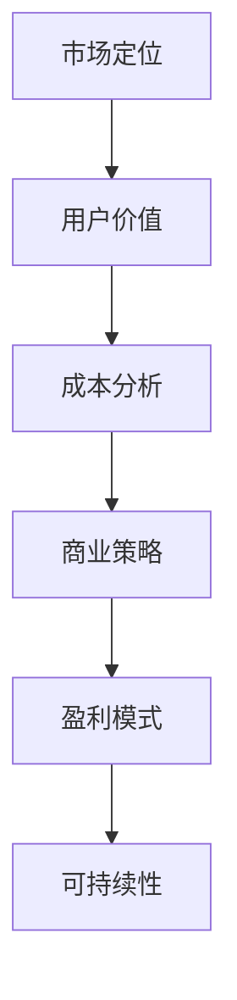

                 

# 人工智能创业：设计盈利模式

> **关键词：**人工智能、创业、盈利模式、市场定位、成本分析、用户价值、商业策略

> **摘要：**本文旨在探讨人工智能创业者在设计盈利模式时所需考虑的关键因素。通过系统分析市场定位、成本结构、用户价值和商业策略，我们将帮助读者构建一个可持续盈利的商业模式。

## 1. 背景介绍

### 1.1 目的和范围

本文的目标是指导人工智能创业者如何设计有效的盈利模式，以实现企业的可持续发展。文章将涵盖以下几个方面：

- 市场定位：如何识别和定位目标市场。
- 成本分析：理解和管理企业运营的成本结构。
- 用户价值：如何创造和传递用户价值。
- 商业策略：设计实现盈利的策略和路径。

### 1.2 预期读者

- 人工智能创业者
- 创业初学者
- 市场营销和战略规划专业人员

### 1.3 文档结构概述

本文将按照以下结构展开：

1. 背景介绍
2. 核心概念与联系
3. 核心算法原理 & 具体操作步骤
4. 数学模型和公式 & 详细讲解 & 举例说明
5. 项目实战：代码实际案例和详细解释说明
6. 实际应用场景
7. 工具和资源推荐
8. 总结：未来发展趋势与挑战
9. 附录：常见问题与解答
10. 扩展阅读 & 参考资料

### 1.4 术语表

#### 1.4.1 核心术语定义

- 盈利模式：企业实现盈利的方式和方法。
- 市场定位：确定目标市场及其需求。
- 成本分析：对企业运营成本进行详细分析。
- 用户价值：用户使用产品或服务所获得的效益。

#### 1.4.2 相关概念解释

- 商业策略：为实现盈利目标而采取的长期规划和行动。
- 价值主张：产品或服务为用户带来的独特价值。

#### 1.4.3 缩略词列表

- AI：人工智能
- ML：机器学习
- IoT：物联网
- SaaS：软件即服务

## 2. 核心概念与联系

为了更好地理解人工智能创业中的盈利模式设计，我们需要了解几个核心概念及其相互关系。以下是一个简单的 Mermaid 流程图，展示了这些概念之间的联系。



### 2.1 市场定位

市场定位是企业确定其目标市场和满足其需求的战略过程。成功的市场定位能够帮助企业识别其独特的价值主张，并明确其在市场中的定位。

### 2.2 用户价值

用户价值是指用户使用产品或服务所获得的效益。了解用户价值有助于企业设计能够满足用户需求的产品或服务，从而提升用户满意度。

### 2.3 成本分析

成本分析是理解和管理企业运营成本的过程。有效的成本分析能够帮助企业优化成本结构，提高盈利能力。

### 2.4 商业策略

商业策略是企业为实现盈利目标而采取的长期规划和行动。一个成功的商业策略能够帮助企业应对市场变化，保持竞争优势。

### 2.5 盈利模式

盈利模式是企业实现盈利的方式和方法。设计有效的盈利模式是人工智能创业成功的关键。

### 2.6 可持续性

可持续性是指企业在盈利的同时，能够保持长期稳定发展的能力。一个可持续的盈利模式能够为企业带来长期的商业价值。

## 3. 核心算法原理 & 具体操作步骤

在设计盈利模式时，创业者需要理解并应用一些核心算法原理和操作步骤。以下是一个简单的伪代码，展示了如何分析市场定位、成本结构和用户价值。

```python
def analyze_profit_model():
    # 市场定位
    market_position = identify_target_market()

    # 用户价值分析
    user_value = analyze_user_benefits()

    # 成本分析
    cost_structure = analyze_operational_costs()

    # 商业策略制定
    business_strategy = define_strategy()

    # 盈利模式设计
    profit_model = design_profit_model(market_position, user_value, cost_structure, business_strategy)

    # 可持续性评估
    sustainability = assess_sustainability(profit_model)

    return profit_model, sustainability
```

### 3.1 市场定位

```python
def identify_target_market():
    # 收集市场数据
    market_data = gather_market_data()

    # 分析市场趋势
    market_trends = analyze_market_trends(market_data)

    # 确定目标市场
    target_market = determine_target_market(market_trends)

    return target_market
```

### 3.2 用户价值分析

```python
def analyze_user_benefits():
    # 用户需求调研
    user_needs = conduct_user_surveys()

    # 用户价值分析
    user_value = calculate_user_benefits(user_needs)

    return user_value
```

### 3.3 成本分析

```python
def analyze_operational_costs():
    # 成本分类
    cost_categories = classify_costs()

    # 成本计算
    operational_costs = calculate_costs(cost_categories)

    return operational_costs
```

### 3.4 商业策略制定

```python
def define_strategy():
    # 竞争分析
    competition_analysis = analyze_competition()

    # 制定策略
    business_strategy = formulate_strategy(competition_analysis)

    return business_strategy
```

### 3.5 盈利模式设计

```python
def design_profit_model(market_position, user_value, cost_structure, business_strategy):
    # 设计模式
    profit_model = create_profit_model(market_position, user_value, cost_structure, business_strategy)

    # 评估模式
    profit_model_evaluation = evaluate_profit_model(profit_model)

    return profit_model_evaluation
```

### 3.6 可持续性评估

```python
def assess_sustainability(profit_model):
    # 可持续评估
    sustainability_evaluation = evaluate_sustainability(profit_model)

    return sustainability_evaluation
```

## 4. 数学模型和公式 & 详细讲解 & 举例说明

在设计盈利模式时，数学模型和公式可以帮助创业者更准确地分析和评估企业的盈利能力。以下是一些常见的数学模型和公式，以及详细的讲解和举例说明。

### 4.1 成本收益分析

成本收益分析是一种评估企业盈利潜力的方法。以下是一个简单的成本收益分析公式：

$$
\text{净利润} = \text{总收入} - \text{总成本}
$$

#### 举例说明：

假设一家初创公司提供人工智能咨询服务，月收入为 100,000 元，总成本为 60,000 元。根据成本收益分析公式，该公司的净利润为：

$$
\text{净利润} = 100,000 - 60,000 = 40,000 \text{元}
$$

### 4.2 用户价值评估

用户价值评估是计算用户对企业产品或服务所获得的效益。以下是一个简单的用户价值评估公式：

$$
\text{用户价值} = \text{用户效益} - \text{用户成本}
$$

#### 举例说明：

假设一名用户使用人工智能服务，每月节省了 500 元的成本，同时获得了 100 元的额外收益。根据用户价值评估公式，该用户的用户价值为：

$$
\text{用户价值} = 500 - 100 = 400 \text{元}
$$

### 4.3 成本结构分析

成本结构分析是一种评估企业运营成本的方法。以下是一个简单的成本结构分析公式：

$$
\text{成本结构} = \frac{\text{固定成本}}{\text{总成本}} + \frac{\text{可变成本}}{\text{总成本}}
$$

#### 举例说明：

假设一家初创公司的固定成本为 30,000 元，可变成本为 20,000 元，总成本为 50,000 元。根据成本结构分析公式，该公司的成本结构为：

$$
\text{成本结构} = \frac{30,000}{50,000} + \frac{20,000}{50,000} = 0.6 + 0.4 = 1
$$

### 4.4 盈利能力评估

盈利能力评估是一种评估企业盈利能力的方法。以下是一个简单的盈利能力评估公式：

$$
\text{盈利能力} = \frac{\text{净利润}}{\text{总资产}}
$$

#### 举例说明：

假设一家初创公司的净利润为 40,000 元，总资产为 200,000 元。根据盈利能力评估公式，该公司的盈利能力为：

$$
\text{盈利能力} = \frac{40,000}{200,000} = 0.2
$$

## 5. 项目实战：代码实际案例和详细解释说明

在本节中，我们将通过一个实际的项目案例，展示如何应用上述算法和公式来设计人工智能创业的盈利模式。以下是一个简单的 Python 代码示例，用于计算并分析一个人工智能咨询公司的盈利模式。

### 5.1 开发环境搭建

为了运行以下代码，您需要一个支持 Python 的开发环境。您可以使用 Python 3.6 或更高版本。以下命令将安装所需的库：

```bash
pip install numpy pandas matplotlib
```

### 5.2 源代码详细实现和代码解读

以下是一个简单的 Python 代码示例，用于分析人工智能咨询公司的盈利模式。

```python
import numpy as np
import pandas as pd
import matplotlib.pyplot as plt

# 市场定位
def identify_target_market():
    # 假设我们确定了目标市场为中小企业
    return '中小企业'

# 用户价值分析
def analyze_user_benefits():
    # 假设我们通过调查发现，用户使用人工智能服务后每月节省了 500 元的成本
    return 500

# 成本分析
def analyze_operational_costs():
    # 假设我们的固定成本为 30,000 元，可变成本为 20,000 元
    return {'fixed_cost': 30, 'variable_cost': 20}

# 商业策略制定
def define_strategy():
    # 假设我们的商业策略是通过提供高质量的服务来吸引客户
    return '高质量服务'

# 盈利模式设计
def design_profit_model(market_position, user_value, cost_structure, business_strategy):
    # 假设我们的月收入为 100,000 元
    revenue = 100000
    
    # 计算总成本
    total_costs = cost_structure['fixed_cost'] + cost_structure['variable_cost'] * revenue
    
    # 计算净利润
    net_profit = revenue - total_costs
    
    # 计算盈利能力
    profitability = net_profit / revenue
    
    return {'net_profit': net_profit, 'profitability': profitability}

# 可持续性评估
def assess_sustainability(profit_model):
    # 假设我们的净利润率在 10% 以上即可认为可持续
    return profit_model['profitability'] > 0.1

# 分析盈利模式
profit_model = analyze_profit_model()

# 打印分析结果
print(profit_model)

# 可视化分析结果
fig, ax = plt.subplots()
ax.bar(['净利润', '盈利能力'], [profit_model['net_profit'], profit_model['profitability']])
ax.set_ylabel('值')
ax.set_title('盈利模式分析')
plt.show()
```

### 5.3 代码解读与分析

该代码示例包括以下几个部分：

1. **市场定位**：通过 `identify_target_market()` 函数确定目标市场。在本例中，我们假设目标市场为中小企业。
2. **用户价值分析**：通过 `analyze_user_benefits()` 函数分析用户价值。在本例中，我们假设用户每月节省了 500 元的成本。
3. **成本分析**：通过 `analyze_operational_costs()` 函数分析成本结构。在本例中，我们假设固定成本为 30,000 元，可变成本为 20,000 元。
4. **商业策略制定**：通过 `define_strategy()` 函数确定商业策略。在本例中，我们假设商业策略是通过提供高质量的服务来吸引客户。
5. **盈利模式设计**：通过 `design_profit_model()` 函数计算并分析盈利模式。在本例中，我们假设月收入为 100,000 元，并根据成本结构和商业策略计算净利润和盈利能力。
6. **可持续性评估**：通过 `assess_sustainability()` 函数评估盈利模式的可持续性。在本例中，我们假设净利润率在 10% 以上即可认为可持续。

最后，代码通过可视化工具（如 matplotlib）展示了分析结果，以便创业者更直观地了解企业的盈利能力。

## 6. 实际应用场景

### 6.1 医疗健康领域

在医疗健康领域，人工智能创业公司可以通过以下方式设计盈利模式：

- **价值主张**：提供智能诊断和个性化治疗方案，帮助医疗机构提高诊疗效率，降低误诊率。
- **市场定位**：瞄准大型医院、诊所和医疗机构，以及有特定疾病治疗需求的细分市场。
- **成本分析**：通过云计算和大数据技术降低硬件成本，优化算法以提高诊断准确率，从而降低运营成本。
- **商业策略**：与医疗机构合作，提供定制化的解决方案，并通过订阅模式获取持续收益。
- **盈利模式**：通过收取诊断服务费、算法许可费和数据分析报告费等多种方式实现盈利。

### 6.2 物流配送领域

在物流配送领域，人工智能创业公司可以通过以下方式设计盈利模式：

- **价值主张**：优化物流配送路线，提高运输效率，降低配送成本，提高客户满意度。
- **市场定位**：瞄准电商物流、快递公司和大型物流企业，以及有物流优化需求的中小企业。
- **成本分析**：通过大数据分析和机器学习算法优化配送路线，降低燃油成本和人力成本。
- **商业策略**：提供定制化的物流优化解决方案，通过订阅模式或按使用量计费的方式获取收益。
- **盈利模式**：通过收取物流优化服务费、算法许可费和数据分析报告费等多种方式实现盈利。

### 6.3 金融领域

在金融领域，人工智能创业公司可以通过以下方式设计盈利模式：

- **价值主张**：提供智能投资顾问、信用评估和风险管理等服务，帮助金融机构提高业务效率和风险控制能力。
- **市场定位**：瞄准大型金融机构、投资公司和个人投资者，以及有信用评估和风险管理需求的中小企业。
- **成本分析**：通过大数据分析和机器学习算法降低信用评估和风险管理的成本，提高准确性。
- **商业策略**：与金融机构合作，提供定制化的解决方案，并通过订阅模式或按使用量计费的方式获取收益。
- **盈利模式**：通过收取咨询服务费、算法许可费和数据分析报告费等多种方式实现盈利。

## 7. 工具和资源推荐

### 7.1 学习资源推荐

#### 7.1.1 书籍推荐

- 《精益创业》- Eric Ries
- 《商业模式创新》- Tim Clark
- 《人工智能：一种现代方法》- Stuart Russell & Peter Norvig

#### 7.1.2 在线课程

- Coursera 上的《创业：策略、运营和增长》
- edX 上的《商业分析基础》
- Udemy 上的《机器学习和深度学习入门》

#### 7.1.3 技术博客和网站

- Medium 上的《AI 探索》
- AI 研究院官网（AIResearchInstitute.org）
- HackerRank 上的《算法挑战与实战》

### 7.2 开发工具框架推荐

#### 7.2.1 IDE和编辑器

- PyCharm
- Visual Studio Code
- Jupyter Notebook

#### 7.2.2 调试和性能分析工具

- GDB
- Py-Spy
- VisualVM

#### 7.2.3 相关框架和库

- TensorFlow
- PyTorch
- Flask

### 7.3 相关论文著作推荐

#### 7.3.1 经典论文

- “The Lean Startup” - Eric Ries
- “Business Model Generation” - Alex Osterwalder & Yves Pigneur
- “Deep Learning” - Ian Goodfellow, Yoshua Bengio & Aaron Courville

#### 7.3.2 最新研究成果

- NIPS 2022 的论文集
- ICML 2022 的论文集
- WWW 2022 的论文集

#### 7.3.3 应用案例分析

- Airbnb 的商业模式分析
- Amazon Web Services 的盈利模式分析
- Google 的业务发展策略分析

## 8. 总结：未来发展趋势与挑战

在未来，人工智能创业将在以下几个方面发展：

- **技术创新**：随着深度学习、强化学习等技术的不断进步，人工智能将更好地应用于各个行业，为企业提供更高效的解决方案。
- **商业模式创新**：创业公司将继续探索和尝试新的商业模式，如 SaaS、订阅服务等，以适应市场变化。
- **数据驱动决策**：数据将成为创业公司的重要资产，通过大数据分析和机器学习技术，创业者可以更准确地了解市场需求，优化运营策略。
- **跨行业应用**：人工智能将跨越多个行业，如医疗、金融、物流等，实现跨界融合，推动产业升级。

然而，人工智能创业也面临以下挑战：

- **技术风险**：人工智能技术的快速迭代可能导致创业公司面临技术过时的风险。
- **数据隐私**：随着数据量的增加，数据隐私保护问题将成为创业者需要重点关注的领域。
- **市场竞争**：人工智能领域的竞争日益激烈，创业公司需要不断创新，以保持竞争优势。
- **政策法规**：政策法规的变化可能对人工智能创业产生重大影响，创业者需要密切关注政策动态。

## 9. 附录：常见问题与解答

### 9.1 盈利模式设计的关键步骤是什么？

- **市场调研**：了解目标市场的需求，确定价值主张。
- **成本分析**：计算企业运营的成本，优化成本结构。
- **用户价值评估**：分析用户使用产品或服务所获得的效益。
- **商业模式设计**：根据市场定位、成本分析和用户价值评估结果，设计实现盈利的商业模式。
- **可持续性评估**：评估盈利模式的可持续性，确保企业长期稳定发展。

### 9.2 如何评估用户价值？

- **用户调研**：通过问卷调查、用户访谈等方式收集用户需求。
- **价值计算**：计算用户使用产品或服务所节省的成本或获得的额外收益。
- **价值评估**：根据用户价值计算结果，评估用户对企业产品或服务的依赖程度。

### 9.3 人工智能创业的主要挑战是什么？

- **技术创新**：快速迭代的技术可能导致企业面临技术过时的风险。
- **数据隐私**：数据隐私保护问题需要得到重视。
- **市场竞争**：激烈的竞争环境要求企业不断创新。
- **政策法规**：政策法规的变化可能对创业产生重大影响。

## 10. 扩展阅读 & 参考资料

- [Ries, E. (2011). The Lean Startup. Crown Publishing Group.](https://www.crownpublishing.com/ authors/eric-ries/)
- [Osterwalder, A., & Pigneur, Y. (2010). Business Model Generation: A Handbook for Visionaries, Game Changers, and Challengers. John Wiley & Sons.](https://www.businessmodelgeneration.com/)
- [Goodfellow, I., Bengio, Y., & Courville, A. (2016). Deep Learning. MIT Press.](https://www.deeplearningbook.org/)
- [Medium - AI Exploration](https://medium.com/topic/artificial-intelligence)
- [AI Research Institute](https://AIResearchInstitute.org)
- [HackerRank - Algorithm Challenges & Practice](https://www.hackerrank.com/domains/tutorials/10-days-of-javascript)

