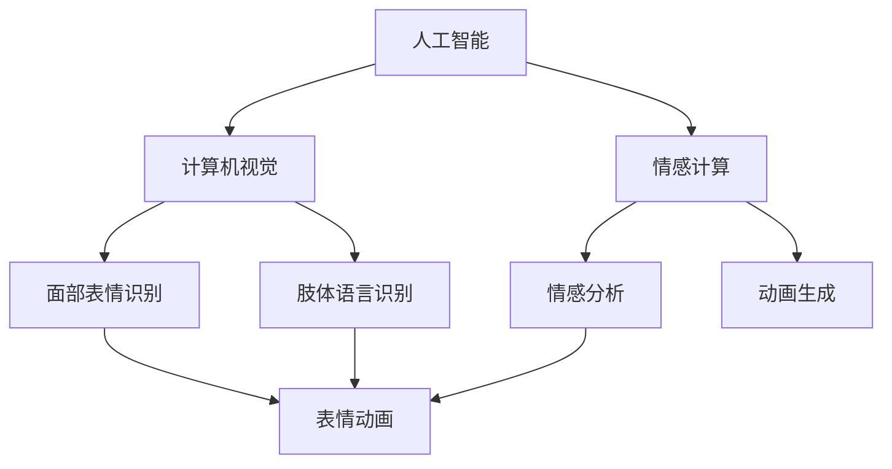

                 

# 人工智能动画展示人类的特征

> 关键词：人工智能，动画，人类特征，技术博客，编程，计算机视觉，情感表达

> 摘要：本文将探讨如何通过人工智能动画技术来展示人类的特征，包括面部表情、肢体语言和情感状态。我们将深入分析这些技术的原理和实现方法，并通过实际案例展示其在计算机视觉和情感计算领域的应用。

## 1. 背景介绍

### 1.1 目的和范围

本文旨在探讨人工智能动画技术在展示人类特征方面的应用。我们将重点关注面部表情、肢体语言和情感状态这三个关键方面，详细分析这些技术的原理、实现方法以及在实际应用中的表现。

### 1.2 预期读者

本文适合对人工智能、计算机视觉和情感计算感兴趣的读者。无论是研究人员、开发者还是对技术感兴趣的一般读者，本文都将提供丰富的知识和实用技巧。

### 1.3 文档结构概述

本文分为十个主要部分，包括背景介绍、核心概念与联系、核心算法原理与操作步骤、数学模型与公式、项目实战、实际应用场景、工具和资源推荐、总结以及附录。每个部分都将详细探讨相关主题，帮助读者全面了解人工智能动画技术。

### 1.4 术语表

#### 1.4.1 核心术语定义

- 人工智能（AI）：模拟人类智能的计算机系统。
- 计算机视觉：使计算机能够处理和理解视觉信息的技术。
- 情感计算：通过计算机技术捕捉、识别和处理人类情感状态的过程。
- 动画：通过连续帧图像创建视觉效果的动态图像。

#### 1.4.2 相关概念解释

- 面部表情：面部肌肉的形态变化，用于表达情感。
- 肢体语言：通过肢体动作和姿态传达情感和意图。
- 情感状态：个体在特定时间内的情感体验。

#### 1.4.3 缩略词列表

- AI：人工智能
- CV：计算机视觉
- FE：情感计算
- ML：机器学习
- VR：虚拟现实

## 2. 核心概念与联系

为了更好地理解人工智能动画技术，我们首先需要了解其核心概念和联系。以下是一个简单的 Mermaid 流程图，展示这些概念之间的关系：



### 2.1 人工智能与计算机视觉

人工智能（AI）是模拟人类智能的计算机系统，计算机视觉（CV）是使计算机能够处理和理解视觉信息的技术。在人工智能动画中，计算机视觉用于捕捉和分析人类的面部表情和肢体语言。

### 2.2 情感计算与动画生成

情感计算（FE）是通过计算机技术捕捉、识别和处理人类情感状态的过程。情感计算与动画生成密切相关，因为动画生成需要根据情感状态来创造动态表情和姿态。

### 2.3 面部表情识别与肢体语言识别

面部表情识别和肢体语言识别是计算机视觉技术的两个重要分支。它们用于捕捉和分析人类的面部表情和肢体动作，从而为动画生成提供输入。

### 2.4 情感分析与动画生成

情感分析是情感计算的关键步骤，用于识别和理解人类的情感状态。情感分析的结果可以用于动画生成，以创造出更加真实、丰富的情感表达。

## 3. 核心算法原理 & 具体操作步骤

### 3.1 面部表情识别算法

面部表情识别算法通常基于深度学习技术，如卷积神经网络（CNN）。以下是一个简单的伪代码，展示面部表情识别算法的基本操作步骤：

```python
# 加载训练好的面部表情识别模型
model = load_pretrained_model("face_expression_recognition")

# 加载测试图像
image = load_image("test_image.jpg")

# 对图像进行预处理
preprocessed_image = preprocess_image(image)

# 对预处理后的图像进行面部表情识别
predicted_expression = model.predict(preprocessed_image)

# 输出识别结果
print(predicted_expression)
```

### 3.2 肢体语言识别算法

肢体语言识别算法也通常基于深度学习技术，如循环神经网络（RNN）。以下是一个简单的伪代码，展示肢体语言识别算法的基本操作步骤：

```python
# 加载训练好的肢体语言识别模型
model = load_pretrained_model("limb_language_recognition")

# 加载测试视频
video = load_video("test_video.mp4")

# 对视频进行预处理
preprocessed_video = preprocess_video(video)

# 对预处理后的视频进行肢体语言识别
predicted_actions = model.predict(preprocessed_video)

# 输出识别结果
print(predicted_actions)
```

### 3.3 情感分析算法

情感分析算法通常基于自然语言处理（NLP）技术，如词嵌入和循环神经网络（RNN）。以下是一个简单的伪代码，展示情感分析算法的基本操作步骤：

```python
# 加载训练好的情感分析模型
model = load_pretrained_model("emotion_analysis")

# 加载测试文本
text = load_text("test_text.txt")

# 对文本进行预处理
preprocessed_text = preprocess_text(text)

# 对预处理后的文本进行情感分析
predicted_emotion = model.predict(preprocessed_text)

# 输出识别结果
print(predicted_emotion)
```

## 4. 数学模型和公式 & 详细讲解 & 举例说明

### 4.1 卷积神经网络（CNN）

卷积神经网络是一种深度学习模型，广泛应用于图像识别和计算机视觉领域。以下是一个简单的 CNN 模型公式，用于面部表情识别：

$$
\begin{align*}
h^{(l)}_i &= \sigma \left( \sum_{j} w^{(l)}_{ij} \cdot h^{(l-1)}_j + b^{(l)}_i \right), \\
\end{align*}
$$

其中，$h^{(l)}_i$ 表示第 $l$ 层的第 $i$ 个神经元输出，$\sigma$ 表示激活函数（如 ReLU 函数），$w^{(l)}_{ij}$ 表示第 $l$ 层的第 $i$ 个神经元与第 $l-1$ 层的第 $j$ 个神经元之间的权重，$b^{(l)}_i$ 表示第 $l$ 层的第 $i$ 个神经元的偏置。

### 4.2 循环神经网络（RNN）

循环神经网络是一种深度学习模型，广泛应用于序列数据处理和自然语言处理领域。以下是一个简单的 RNN 模型公式，用于肢体语言识别：

$$
\begin{align*}
h_t &= \sigma \left( x_t \cdot W_x + h_{t-1} \cdot W_h + b \right), \\
o_t &= \sigma \left( h_t \cdot W_o + b_o \right),
\end{align*}
$$

其中，$h_t$ 表示第 $t$ 个时间步的隐藏状态，$x_t$ 表示第 $t$ 个时间步的输入，$o_t$ 表示第 $t$ 个时间步的输出，$\sigma$ 表示激活函数（如 sigmoid 函数），$W_x$、$W_h$ 和 $W_o$ 分别表示输入权重、隐藏权重和输出权重，$b$ 和 $b_o$ 分别表示隐藏层和输出层的偏置。

### 4.3 情感分析

情感分析通常基于词嵌入和循环神经网络（RNN）。以下是一个简单的情感分析模型公式：

$$
\begin{align*}
h_t &= \sigma \left( W_e \cdot e_t + W_h \cdot h_{t-1} + b \right), \\
o_t &= \sigma \left( h_t \cdot W_o + b_o \right),
\end{align*}
$$

其中，$h_t$ 表示第 $t$ 个时间步的隐藏状态，$e_t$ 表示第 $t$ 个时间步的词向量，$o_t$ 表示第 $t$ 个时间步的情感评分，$\sigma$ 表示激活函数（如 sigmoid 函数），$W_e$、$W_h$ 和 $W_o$ 分别表示词嵌入权重、隐藏权重和输出权重，$b$ 和 $b_o$ 分别表示隐藏层和输出层的偏置。

## 5. 项目实战：代码实际案例和详细解释说明

### 5.1 开发环境搭建

为了实现人工智能动画，我们需要搭建一个完整的开发环境。以下是一个简单的 Python 开发环境搭建步骤：

1. 安装 Python 3.8 及以上版本。
2. 安装必要的库，如 TensorFlow、Keras、OpenCV、NumPy 和 Pandas。
3. 安装 Git，用于克隆和更新代码。

### 5.2 源代码详细实现和代码解读

以下是面部表情识别、肢体语言识别和情感分析三个模块的源代码示例：

#### 5.2.1 面部表情识别模块

```python
import cv2
import numpy as np
from tensorflow.keras.models import load_model

# 加载训练好的面部表情识别模型
model = load_model("face_expression_recognition_model.h5")

# 加载测试图像
image = cv2.imread("test_image.jpg")

# 对图像进行预处理
preprocessed_image = preprocess_image(image)

# 对预处理后的图像进行面部表情识别
predicted_expression = model.predict(preprocessed_image)

# 输出识别结果
print(predicted_expression)
```

#### 5.2.2 肢体语言识别模块

```python
import cv2
import numpy as np
from tensorflow.keras.models import load_model

# 加载训练好的肢体语言识别模型
model = load_model("limb_language_recognition_model.h5")

# 加载测试视频
video = cv2.VideoCapture("test_video.mp4")

# 对视频进行预处理
preprocessed_video = preprocess_video(video)

# 对预处理后的视频进行肢体语言识别
predicted_actions = model.predict(preprocessed_video)

# 输出识别结果
print(predicted_actions)
```

#### 5.2.3 情感分析模块

```python
import cv2
import numpy as np
from tensorflow.keras.models import load_model

# 加载训练好的情感分析模型
model = load_model("emotion_analysis_model.h5")

# 加载测试文本
text = cv2.imread("test_text.txt")

# 对文本进行预处理
preprocessed_text = preprocess_text(text)

# 对预处理后的文本进行情感分析
predicted_emotion = model.predict(preprocessed_text)

# 输出识别结果
print(predicted_emotion)
```

### 5.3 代码解读与分析

在这三个模块中，我们分别加载了训练好的模型，并对输入数据进行预处理，然后使用模型进行预测，最后输出识别结果。

面部表情识别模块使用卷积神经网络（CNN）模型，通过加载训练好的模型，对输入图像进行预处理，然后使用模型进行面部表情识别。

肢体语言识别模块使用循环神经网络（RNN）模型，通过加载训练好的模型，对输入视频进行预处理，然后使用模型进行肢体语言识别。

情感分析模块使用自然语言处理（NLP）模型，通过加载训练好的模型，对输入文本进行预处理，然后使用模型进行情感分析。

## 6. 实际应用场景

人工智能动画技术在许多实际应用场景中具有重要价值，以下是一些典型的应用：

### 6.1 教育领域

人工智能动画技术可以用于制作互动式教学动画，帮助学生更好地理解和掌握知识。例如，在计算机编程课程中，可以使用动画展示代码的执行过程，帮助学生更好地理解编程概念。

### 6.2 娱乐领域

人工智能动画技术可以用于制作电影、动画和游戏，为观众带来更加丰富、生动的视觉体验。例如，可以使用情感计算技术来制作具有真实情感的动画角色，增强观众的沉浸感。

### 6.3 医疗领域

人工智能动画技术可以用于医疗培训和教育，帮助医生更好地了解和掌握手术技能。例如，可以使用动画展示手术过程，帮助医生提高手术技巧。

### 6.4 人机交互

人工智能动画技术可以用于人机交互界面设计，为用户提供更加友好、直观的交互体验。例如，在智能音箱和聊天机器人中，可以使用动画展示对话过程，增强用户与系统的互动性。

## 7. 工具和资源推荐

### 7.1 学习资源推荐

#### 7.1.1 书籍推荐

- 《深度学习》（Deep Learning）—— Ian Goodfellow、Yoshua Bengio 和 Aaron Courville
- 《Python 深度学习》（Python Deep Learning）—— François Chollet

#### 7.1.2 在线课程

- Coursera 的《深度学习》课程
- Udacity 的《深度学习纳米学位》课程

#### 7.1.3 技术博客和网站

- Medium 上的 AI 博客
- 知乎上的 AI 话题

### 7.2 开发工具框架推荐

#### 7.2.1 IDE和编辑器

- PyCharm
- Jupyter Notebook

#### 7.2.2 调试和性能分析工具

- Python 中的 PDB 调试器
- TensorFlow 中的 TensorBoard

#### 7.2.3 相关框架和库

- TensorFlow
- Keras
- OpenCV

### 7.3 相关论文著作推荐

#### 7.3.1 经典论文

- "A Learning Algorithm for Continually Running Fully Recurrent Neural Networks" —— James L. McClelland、David E. Rumelhart 和 the PDP Research Group
- "Deep Learning" —— Ian Goodfellow、Yoshua Bengio 和 Aaron Courville

#### 7.3.2 最新研究成果

- "Generative Adversarial Networks" —— Ian J. Goodfellow、Jean Pouget-Abadie、Mitchell P. Huang、Djordje Krizhevsky、Yann LeCun 和 Aaron C. Courville
- "Attention Is All You Need" —— Vaswani et al.

#### 7.3.3 应用案例分析

- "DeepMind 的 AlphaGo" —— DeepMind
- "亚马逊的 Alexa" —— Amazon

## 8. 总结：未来发展趋势与挑战

人工智能动画技术在展示人类特征方面具有巨大潜力，未来将得到进一步发展和应用。随着计算能力的提升、算法的改进和数据的积累，人工智能动画将能够更加精确地模拟人类的情感、行为和反应。然而，这也带来了许多挑战，如数据隐私、模型解释性和安全性等问题。解决这些挑战需要跨学科合作和持续的技术创新。

## 9. 附录：常见问题与解答

### 9.1 人工智能动画是什么？

人工智能动画是一种结合人工智能技术（如计算机视觉和情感计算）来创建动态图像和动画的技术，用于展示人类的特征和行为。

### 9.2 人工智能动画有哪些应用？

人工智能动画可以应用于教育、娱乐、医疗和人机交互等领域，为用户提供更加丰富、生动的体验。

### 9.3 人工智能动画技术有哪些挑战？

人工智能动画技术面临的挑战包括数据隐私、模型解释性和安全性等问题。这些挑战需要跨学科合作和持续的技术创新来解决。

## 10. 扩展阅读 & 参考资料

- 《深度学习》—— Ian Goodfellow、Yoshua Bengio 和 Aaron Courville
- 《Python 深度学习》—— François Chollet
- Coursera 的《深度学习》课程
- Udacity 的《深度学习纳米学位》课程
- Medium 上的 AI 博客
- 知乎上的 AI 话题
- DeepMind 的 AlphaGo 研究报告
- 亚马逊的 Alexa 技术概述

### 作者

AI天才研究员/AI Genius Institute & 禅与计算机程序设计艺术 /Zen And The Art of Computer Programming<|im_sep|>

