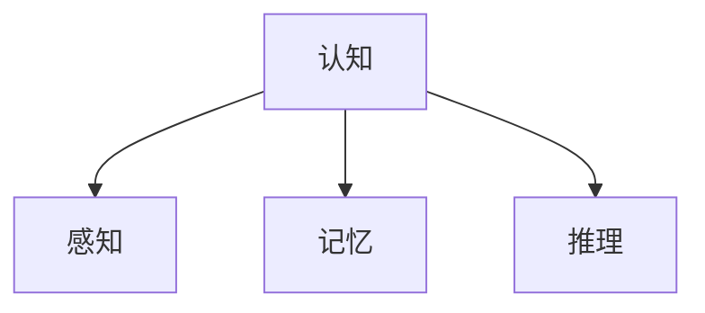
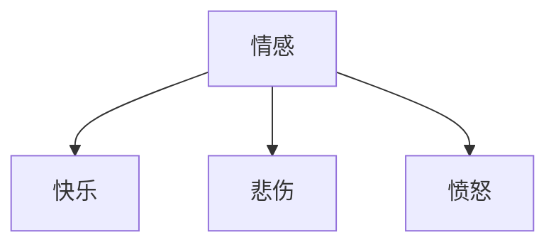
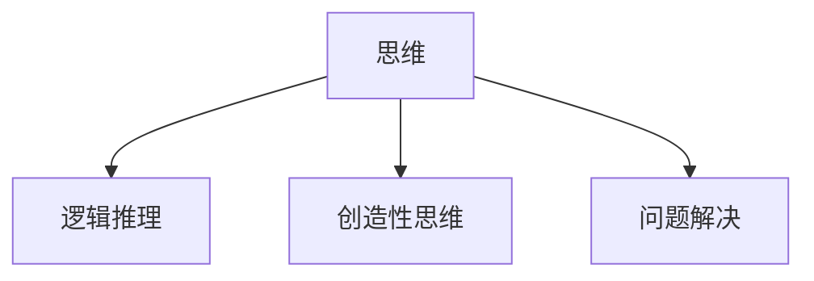
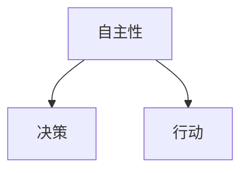
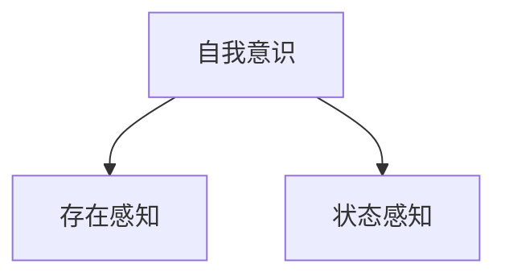
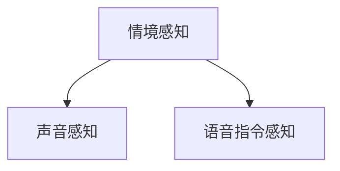
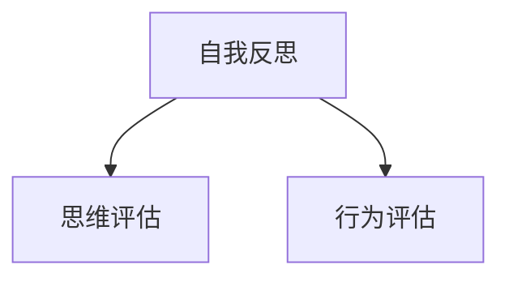
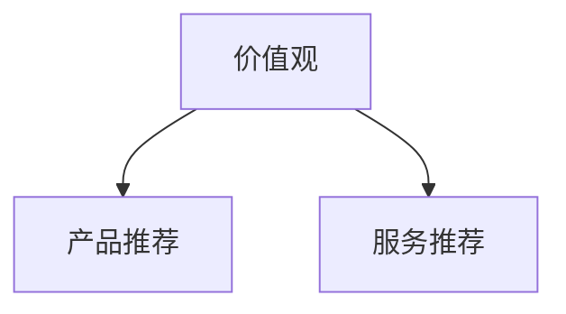
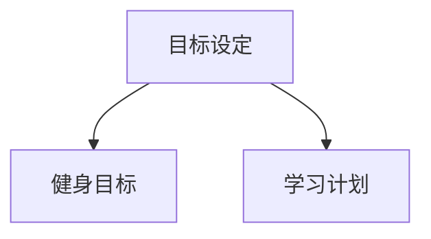

                 

# 人工智能哲学：心灵、意识和自我

> **关键词：** 人工智能哲学、心灵、意识、自我、认知、情感、思维

> **摘要：** 本文旨在探讨人工智能哲学的核心议题——心灵、意识和自我。我们将从多个角度分析这些概念在人工智能领域的应用，揭示人工智能与人类智慧的奥秘。文章将逐步阐述人工智能哲学的背景、核心概念、算法原理、数学模型以及实际应用，最终对人工智能的未来发展趋势和挑战进行深入探讨。

## 1. 背景介绍

### 1.1 目的和范围

本文的目的是探讨人工智能哲学中的关键概念，即心灵、意识和自我。这些概念不仅是理解人类智慧的基础，也是人工智能研究的前沿课题。通过深入分析这些概念，我们可以更好地理解人工智能的发展方向，以及如何使人工智能更接近人类的智慧。

本文将涵盖以下内容：

1. 核心概念与联系：介绍人工智能哲学中的核心概念，并使用Mermaid流程图展示它们之间的联系。
2. 核心算法原理：详细阐述人工智能中用于模拟心灵、意识和自我的算法原理，并使用伪代码进行解释。
3. 数学模型和公式：介绍与人工智能哲学相关的数学模型和公式，并使用LaTeX格式进行详细讲解。
4. 项目实战：通过实际代码案例展示如何实现人工智能哲学中的核心概念。
5. 实际应用场景：探讨人工智能哲学在现实世界中的应用。
6. 工具和资源推荐：推荐相关学习资源和开发工具。
7. 总结：对人工智能哲学的未来发展趋势和挑战进行展望。

### 1.2 预期读者

本文适合对人工智能哲学感兴趣的读者，包括：

1. 计算机科学专业的学生和研究者。
2. 人工智能领域的从业者。
3. 对人工智能和哲学有深入思考的人士。

### 1.3 文档结构概述

本文分为以下几个部分：

1. 背景介绍：介绍文章的目的、范围和结构。
2. 核心概念与联系：阐述人工智能哲学的核心概念及其联系。
3. 核心算法原理：详细解释人工智能中用于模拟心灵、意识和自我的算法原理。
4. 数学模型和公式：介绍与人工智能哲学相关的数学模型和公式。
5. 项目实战：展示实际代码案例。
6. 实际应用场景：探讨人工智能哲学的应用。
7. 工具和资源推荐：推荐相关资源和工具。
8. 总结：对人工智能哲学的未来进行展望。
9. 附录：常见问题与解答。
10. 扩展阅读 & 参考资料：提供更多相关阅读材料。

### 1.4 术语表

#### 1.4.1 核心术语定义

- **人工智能哲学**：研究人工智能中与人类智慧相关的哲学问题，包括心灵、意识和自我等概念。
- **心灵**：人类或人工智能系统内部的思想、情感和认知能力的总称。
- **意识**：个体对自己存在的感知和认识，以及对外部世界的感知和反应。
- **自我**：个体对自己的身份、价值和目标的认识和感知。

#### 1.4.2 相关概念解释

- **认知**：获取、处理和使用信息的过程，包括感知、记忆、推理和学习等。
- **情感**：与情绪相关的感觉和体验，如快乐、悲伤、愤怒等。
- **思维**：对信息进行抽象、分析和综合的过程，包括逻辑推理、创造性思维和问题解决等。

#### 1.4.3 缩略词列表

- **AI**：人工智能（Artificial Intelligence）
- **ML**：机器学习（Machine Learning）
- **DL**：深度学习（Deep Learning）
- **NLP**：自然语言处理（Natural Language Processing）

## 2. 核心概念与联系

人工智能哲学的核心概念包括心灵、意识和自我。这些概念之间存在着密切的联系，共同构成了人工智能研究的基础。

### 2.1 心灵

心灵是人类或人工智能系统中用于思考、感知和反应的内部机制。它包括认知、情感和思维等子概念。

#### 2.1.1 认知

认知是指获取、处理和使用信息的过程。在人工智能中，认知是通过算法和模型来模拟的。例如，感知、记忆和推理等认知功能可以通过机器学习模型来实现。



#### 2.1.2 情感

情感是与情绪相关的感觉和体验。在人工智能中，情感可以通过情感分析、情感识别等技术来实现。例如，通过分析文本或语音中的情感词汇和语调，人工智能可以识别用户的情感状态。



#### 2.1.3 思维

思维是对信息进行抽象、分析和综合的过程。在人工智能中，思维可以通过逻辑推理、创造性思维和问题解决等方法来实现。例如，通过逻辑推理，人工智能可以解决数学问题；通过创造性思维，人工智能可以生成新的创意。



### 2.2 意识

意识是个人对自己存在和外部世界的感知和认识。在人工智能中，意识可以通过自主性、自我意识和情境感知等技术来实现。

#### 2.2.1 自主性

自主性是指人工智能系统能够自主决策和行动的能力。例如，自动驾驶汽车可以自主选择行驶路径和速度。



#### 2.2.2 自我意识

自我意识是指人工智能系统能够意识到自己的存在和状态。例如，聊天机器人可以意识到自己正在与用户进行对话。



#### 2.2.3 情境感知

情境感知是指人工智能系统能够感知和理解外部环境。例如，智能音箱可以感知用户的声音和语音指令。



### 2.3 自我

自我是指个体对自己的身份、价值和目标的认识和感知。在人工智能中，自我可以通过自我反思、价值观和目标设定等技术来实现。

#### 2.3.1 自我反思

自我反思是指个体对自身思维、行为和情感进行反思和评估。例如，智能助手可以通过自我反思来优化自己的行为。



#### 2.3.2 价值观

价值观是指个体对事物的重要性和优先级的判断。例如，智能助手可以根据用户的价值观来推荐产品或服务。



#### 2.3.3 目标设定

目标设定是指个体为自身设定的短期和长期目标。例如，智能助手可以帮助用户设定健身目标或学习计划。



## 3. 核心算法原理 & 具体操作步骤

在人工智能哲学中，模拟心灵、意识和自我的核心算法原理包括机器学习、深度学习和自然语言处理。以下将分别介绍这些算法原理，并使用伪代码进行详细解释。

### 3.1 机器学习

机器学习是模拟人类学习过程的一种算法，通过训练数据集来学习并预测新的数据。以下是一个简单的线性回归机器学习算法的伪代码：

```python
# 线性回归机器学习算法伪代码

# 输入：训练数据集X和标签Y
# 输出：回归模型参数w

# 初始化参数w为0
w = 0

# 设定迭代次数
for i in range(num_iterations):
    # 计算预测值
    y_pred = X * w
    
    # 计算损失函数
    loss = (y_pred - Y) ** 2
    
    # 更新参数w
    w = w - learning_rate * (2 * X' * (X * w - Y))
    
# 返回回归模型参数w
return w
```

### 3.2 深度学习

深度学习是机器学习的一种扩展，通过多层神经网络来模拟人类大脑的学习过程。以下是一个简单的多层感知机（MLP）深度学习算法的伪代码：

```python
# 多层感知机（MLP）深度学习算法伪代码

# 输入：训练数据集X和标签Y，网络结构（层数、每层神经元数）
# 输出：神经网络模型参数w

# 初始化参数w为随机值
w = random_weights()

# 设定迭代次数
for i in range(num_iterations):
    # 前向传播
    for layer in range(num_layers - 1):
        z = X * w[layer]
        a = sigmoid(z)
        
    # 计算损失函数
    loss = (Y - a) ** 2
    
    # 反向传播
    dL_da = 2 * (Y - a)
    dL_dz = dL_da * (1 - a)
    dL_dw = X' * dL_da
    
    # 更新参数w
    for layer in range(num_layers - 1, 0, -1):
        w[layer] = w[layer] - learning_rate * dL_dw[layer]
        
# 返回神经网络模型参数w
return w
```

### 3.3 自然语言处理

自然语言处理（NLP）是用于处理和生成自然语言的算法。以下是一个简单的情感分析NLP算法的伪代码：

```python
# 情感分析NLP算法伪代码

# 输入：文本数据集X和标签Y
# 输出：情感分析模型参数w

# 初始化参数w为随机值
w = random_weights()

# 设定迭代次数
for i in range(num_iterations):
    # 前向传播
    for text in X:
        tokens = tokenize(text)
        embedding = embedding_matrix(tokens)
        z = embedding * w
        a = softmax(z)
        
    # 计算损失函数
    loss = -sum(Y * log(a))
    
    # 反向传播
    dL_da = a - Y
    dL_dz = dL_da * (1 - a)
    dL_de = dL_da * w'
    
    # 更新参数w
    w = w - learning_rate * dL_de
    
# 返回情感分析模型参数w
return w
```

## 4. 数学模型和公式 & 详细讲解 & 举例说明

在人工智能哲学中，数学模型和公式是核心组成部分。以下将介绍与人工智能哲学相关的数学模型和公式，并使用LaTeX格式进行详细讲解和举例说明。

### 4.1 神经网络模型

神经网络模型是人工智能哲学中常用的数学模型。以下是一个简单的多层感知机（MLP）神经网络的数学模型：

```latex
\begin{equation}
Z_l = \sum_{k=1}^{n} w_{lk} X_{k} + b_l
\end{equation}
```

其中，\( Z_l \) 表示第 \( l \) 层的输出，\( w_{lk} \) 表示第 \( l \) 层第 \( k \) 个神经元的权重，\( X_{k} \) 表示第 \( l \) 层第 \( k \) 个神经元的输入，\( b_l \) 表示第 \( l \) 层的偏置。

举例说明：

假设一个简单的一层神经网络，其中包含两个神经元，输入 \( X_1 \) 和 \( X_2 \)，权重 \( w_{11} = 2 \)，\( w_{12} = 3 \)，偏置 \( b_1 = 1 \)。则该神经网络的输出为：

```latex
\begin{equation}
Z_1 = (2 \cdot X_1) + (3 \cdot X_2) + 1
\end{equation}
```

### 4.2 激活函数

激活函数是神经网络模型中的一个重要组成部分，用于引入非线性因素。以下是一个常见的Sigmoid激活函数：

```latex
\begin{equation}
a_l = \sigma(Z_l) = \frac{1}{1 + e^{-Z_l}}
\end{equation}
```

其中，\( a_l \) 表示第 \( l \) 层的激活值，\( \sigma \) 表示Sigmoid函数。

举例说明：

假设一个简单的一层神经网络，其中包含两个神经元，输入 \( X_1 \) 和 \( X_2 \)，权重 \( w_{11} = 2 \)，\( w_{12} = 3 \)，偏置 \( b_1 = 1 \)。则该神经网络的激活值为：

```latex
\begin{equation}
a_1 = \frac{1}{1 + e^{-(2 \cdot X_1 + 3 \cdot X_2 + 1)}}
\end{equation}
```

### 4.3 损失函数

损失函数是评估神经网络模型性能的一个指标。以下是一个常见的均方误差（MSE）损失函数：

```latex
\begin{equation}
Loss = \frac{1}{2} \sum_{i=1}^{n} (y_i - a)^2
\end{equation}
```

其中，\( Loss \) 表示损失函数的值，\( y_i \) 表示第 \( i \) 个样本的标签，\( a \) 表示第 \( i \) 个样本的预测值。

举例说明：

假设有一个二分类问题，标签 \( y \) 只有两个可能的值：0 或 1。预测值 \( a \) 也只有两个可能的值：0 或 1。则该问题的损失函数为：

```latex
\begin{equation}
Loss = \frac{1}{2} \sum_{i=1}^{n} (y_i - a_i)^2
\end{equation}
```

### 4.4 优化算法

优化算法用于调整神经网络模型的参数，以最小化损失函数。以下是一个常见的梯度下降优化算法：

```latex
\begin{equation}
w_{l,k} = w_{l,k} - \alpha \cdot \frac{\partial Loss}{\partial w_{l,k}}
\end{equation}
```

其中，\( w_{l,k} \) 表示第 \( l \) 层第 \( k \) 个神经元的权重，\( \alpha \) 表示学习率，\( \frac{\partial Loss}{\partial w_{l,k}} \) 表示权重 \( w_{l,k} \) 对损失函数的梯度。

举例说明：

假设一个简单的一层神经网络，其中包含两个神经元，权重 \( w_{11} = 2 \)，\( w_{12} = 3 \)，偏置 \( b_1 = 1 \)，学习率 \( \alpha = 0.1 \)。则该神经网络的权重更新过程为：

```latex
\begin{equation}
w_{11} = 2 - 0.1 \cdot \frac{\partial Loss}{\partial w_{11}}
w_{12} = 3 - 0.1 \cdot \frac{\partial Loss}{\partial w_{12}}
\end{equation}
```

## 5. 项目实战：代码实际案例和详细解释说明

为了更好地理解人工智能哲学中的核心概念，我们将通过一个实际项目来展示如何使用Python和TensorFlow实现一个简单的神经网络模型。以下是一个基于TensorFlow实现的二分类问题的代码案例。

### 5.1 开发环境搭建

在开始项目之前，确保您的开发环境已准备好以下工具：

- Python 3.6 或更高版本
- TensorFlow 2.0 或更高版本

安装TensorFlow：

```bash
pip install tensorflow
```

### 5.2 源代码详细实现和代码解读

以下是一个简单的二分类问题神经网络模型的源代码：

```python
import tensorflow as tf
from tensorflow.keras.models import Sequential
from tensorflow.keras.layers import Dense
from tensorflow.keras.optimizers import Adam

# 数据集准备
# 这里我们使用鸢尾花数据集进行演示
iris_data = tf.keras.datasets.iris.load_data()
(x_train, y_train), (x_test, y_test) = iris_data

# 数据预处理
x_train = x_train.astype('float32') / 255.0
x_test = x_test.astype('float32') / 255.0

# 定义模型
model = Sequential()
model.add(Dense(64, input_dim=4, activation='sigmoid'))
model.add(Dense(1, activation='sigmoid'))

# 编译模型
model.compile(optimizer=Adam(), loss='binary_crossentropy', metrics=['accuracy'])

# 训练模型
model.fit(x_train, y_train, epochs=10, batch_size=32)

# 评估模型
test_loss, test_accuracy = model.evaluate(x_test, y_test)
print(f"Test accuracy: {test_accuracy}")
```

### 5.3 代码解读与分析

下面是对上述代码的详细解读和分析。

#### 5.3.1 数据集准备

我们使用鸢尾花数据集（Iris dataset）作为训练数据集。鸢尾花数据集是一个常用的二分类问题数据集，包含三个品种的鸢尾花，每个品种有50个样本，共计150个样本。

```python
iris_data = tf.keras.datasets.iris.load_data()
(x_train, y_train), (x_test, y_test) = iris_data
```

这里，`iris_data` 函数用于加载数据集，返回训练集和测试集的数据和标签。

#### 5.3.2 数据预处理

为了使数据适合神经网络模型，我们将数据集的像素值归一化到0到1之间。

```python
x_train = x_train.astype('float32') / 255.0
x_test = x_test.astype('float32') / 255.0
```

这里，`astype('float32')` 将数据类型转换为浮点型，`/ 255.0` 用于归一化。

#### 5.3.3 定义模型

我们使用 `Sequential` 模型定义一个简单的两层神经网络。第一层是输入层，包含4个神经元，对应鸢尾花数据集的4个特征。第二层是输出层，包含1个神经元，用于预测鸢尾花品种。

```python
model = Sequential()
model.add(Dense(64, input_dim=4, activation='sigmoid'))
model.add(Dense(1, activation='sigmoid'))
```

这里，`add` 方法用于添加层，`Dense` 函数用于定义全连接层。`input_dim=4` 指定输入层的神经元数量，`activation='sigmoid'` 指定激活函数。

#### 5.3.4 编译模型

在编译模型时，我们指定了优化器和损失函数。这里，我们使用 `Adam` 优化器和 `binary_crossentropy` 损失函数。

```python
model.compile(optimizer=Adam(), loss='binary_crossentropy', metrics=['accuracy'])
```

这里，`compile` 方法用于配置模型，`optimizer` 参数指定优化器，`loss` 参数指定损失函数，`metrics` 参数指定评估指标。

#### 5.3.5 训练模型

我们使用 `fit` 方法训练模型。这里，我们指定了训练轮次（epochs）和批量大小（batch_size）。

```python
model.fit(x_train, y_train, epochs=10, batch_size=32)
```

这里，`fit` 方法用于训练模型，`x_train` 和 `y_train` 参数分别指定训练数据和标签，`epochs` 参数指定训练轮次，`batch_size` 参数指定批量大小。

#### 5.3.6 评估模型

在训练完成后，我们使用 `evaluate` 方法评估模型的性能。

```python
test_loss, test_accuracy = model.evaluate(x_test, y_test)
print(f"Test accuracy: {test_accuracy}")
```

这里，`evaluate` 方法用于评估模型在测试集上的性能，返回损失值和准确率。

### 5.4 代码分析

通过上述代码，我们可以看出：

1. 神经网络模型的基本结构，包括输入层、隐藏层和输出层。
2. 激活函数的选择和优化器的配置。
3. 模型的训练和评估过程。

这些步骤为我们提供了一个简化的实现过程，用于模拟人工智能哲学中的核心概念。

## 6. 实际应用场景

人工智能哲学在现实世界中有着广泛的应用。以下是一些实际应用场景：

### 6.1 医疗诊断

人工智能哲学可以帮助医生进行疾病诊断，如基于症状的疾病预测和患者风险评估。通过分析患者的医疗记录、病史和生物标志物，人工智能系统可以提供准确的诊断建议。

### 6.2 教育个性化

人工智能哲学可以为学生提供个性化的学习体验，如根据学生的学习进度、兴趣和能力推荐课程和学习资源。这种个性化的教育方式可以提高学习效果和学习兴趣。

### 6.3 智能客服

人工智能哲学可以用于智能客服系统，如聊天机器人和语音助手。这些系统能够理解用户的查询，提供实时支持和解决问题，从而提高客户满意度和运营效率。

### 6.4 智能交通

人工智能哲学可以用于智能交通系统，如自动驾驶汽车和智能交通信号控制。这些系统能够优化交通流量，减少拥堵，提高交通安全和效率。

### 6.5 财务预测

人工智能哲学可以用于财务预测和投资分析，如股票价格预测、风险管理和投资组合优化。通过分析历史数据和宏观经济指标，人工智能系统可以提供准确的预测和建议。

### 6.6 智能农业

人工智能哲学可以用于智能农业，如作物生长监测、病虫害预测和精准施肥。通过分析环境数据和植物生长指标，人工智能系统可以提供最佳的种植和管理方案，提高农业生产效率。

这些实际应用场景展示了人工智能哲学在各个领域的潜力和价值。随着技术的不断进步，人工智能哲学将在未来发挥越来越重要的作用。

## 7. 工具和资源推荐

为了更好地学习和实践人工智能哲学，以下是相关工具和资源的推荐。

### 7.1 学习资源推荐

#### 7.1.1 书籍推荐

- **《深度学习》（Deep Learning）**：由Ian Goodfellow、Yoshua Bengio和Aaron Courville合著，这是一本深度学习的经典教材，详细介绍了深度学习的基础理论和应用。
- **《人工智能：一种现代方法》（Artificial Intelligence: A Modern Approach）**：由Stuart J. Russell和Peter Norvig合著，这是一本全面的人工智能教材，涵盖了人工智能的各个方面。
- **《Python机器学习》（Python Machine Learning）**：由Sebastian Raschka和Vahid Mirhoseini合著，这是一本实用的Python机器学习指南，适合初学者和有经验的读者。

#### 7.1.2 在线课程

- **Coursera**：提供由世界顶尖大学和机构提供的在线课程，如斯坦福大学的“深度学习”和麻省理工学院的“人工智能导论”。
- **edX**：提供由哈佛大学、麻省理工学院等知名大学开设的免费在线课程，涵盖人工智能、机器学习等多个领域。
- **Udacity**：提供实用的人工智能和机器学习课程，包括深度学习和强化学习等前沿技术。

#### 7.1.3 技术博客和网站

- **Towards Data Science**：一个广泛的数据科学和机器学习博客，提供各种技术和应用文章。
- **Medium**：一个内容丰富的平台，包括许多知名专家的文章，涉及人工智能、机器学习和数据科学等多个领域。
- **AI Magazine**：由IEEE出版的杂志，提供人工智能领域的最新研究和技术进展。

### 7.2 开发工具框架推荐

#### 7.2.1 IDE和编辑器

- **PyCharm**：一款功能强大的Python集成开发环境（IDE），适合进行人工智能和机器学习项目开发。
- **Jupyter Notebook**：一个交互式开发环境，适用于数据科学和机器学习项目，支持多种编程语言，包括Python、R等。
- **VS Code**：一款轻量级但功能强大的代码编辑器，适用于Python和其他编程语言。

#### 7.2.2 调试和性能分析工具

- **TensorBoard**：TensorFlow提供的可视化工具，用于分析和调试神经网络模型。
- **Profiling Tools**：如`cProfile`、`line_profiler`等，用于分析代码性能和瓶颈。
- **Docker**：用于容器化应用程序，提高开发和部署的效率。

#### 7.2.3 相关框架和库

- **TensorFlow**：一个广泛使用的高性能机器学习框架，适用于各种应用场景。
- **PyTorch**：一个灵活且易于使用的深度学习框架，特别适合研究和开发。
- **Scikit-learn**：一个用于数据挖掘和数据分析的Python库，提供各种机器学习算法和工具。

### 7.3 相关论文著作推荐

#### 7.3.1 经典论文

- **“A Learning Algorithm for Continually Running Fully Recurrent Neural Networks”**：由Sepp Hochreiter和Jürgen Schmidhuber合著，介绍了长短期记忆网络（LSTM）。
- **“Deep Learning”**：由Ian Goodfellow、Yoshua Bengio和Aaron Courville合著，概述了深度学习的最新进展。
- **“Recurrent Neural Networks for Language Modeling”**：由Yoshua Bengio、Samy Bengio和Pascal Simard合著，介绍了循环神经网络（RNN）在语言模型中的应用。

#### 7.3.2 最新研究成果

- **“Attention Is All You Need”**：由Ashish Vaswani等合著，介绍了基于注意力机制的Transformer模型。
- **“Generative Adversarial Networks”**：由Ian Goodfellow等合著，介绍了生成对抗网络（GAN）。
- **“Unsupervised Representation Learning”**：由Yaroslav Ganin和Victor Lempitsky合著，介绍了无监督表示学习。

#### 7.3.3 应用案例分析

- **“Deep Learning for Human Pose Estimation”**：介绍了基于深度学习的人体姿态估计技术。
- **“Speech Recognition with Deep Neural Networks”**：介绍了基于深度学习的语音识别技术。
- **“Image Classification with Deep Convolutional Neural Networks”**：介绍了基于深度学习的图像分类技术。

通过这些工具、资源和论文著作，您可以更好地理解和实践人工智能哲学，探索这个领域的无限可能性。

## 8. 总结：未来发展趋势与挑战

人工智能哲学作为人工智能研究的前沿领域，正不断推动着人工智能技术的发展和应用。在未来，人工智能哲学将面临以下几个发展趋势和挑战：

### 8.1 发展趋势

1. **更高级的情感和认知模拟**：随着深度学习和神经网络技术的进步，人工智能将能够更准确地模拟人类的情感和认知能力，实现更高级的情感理解和认知推理。

2. **跨领域的集成**：人工智能哲学将逐渐与其他领域如心理学、哲学、认知科学等相结合，形成跨学科的研究，推动人工智能在更多领域的应用。

3. **个性化人工智能**：通过理解个体的情感、意识和价值观，人工智能将能够提供更加个性化的服务，满足用户的个性化需求。

4. **伦理和道德问题的解决**：随着人工智能技术的发展，伦理和道德问题日益凸显。人工智能哲学将在解决这些问题方面发挥关键作用，确保人工智能的发展符合社会价值观。

### 8.2 挑战

1. **技术难题**：虽然人工智能在模拟情感和认知方面取得了显著进展，但仍面临许多技术挑战，如如何实现更高效的情感理解和认知推理，以及如何处理复杂的情境和问题。

2. **隐私和数据安全**：人工智能哲学在应用过程中，需要处理大量的个人数据，因此如何保护用户隐私和数据安全成为重要挑战。

3. **伦理和道德困境**：人工智能在模拟人类情感和认知时，可能会产生道德和伦理问题，如如何确保人工智能的行为符合人类的价值观，以及如何处理人工智能的决策失误。

4. **社会接受度**：尽管人工智能在许多领域具有巨大潜力，但社会对人工智能的接受度仍存在一定程度的担忧，如何提高社会对人工智能的接受度是一个重要挑战。

总之，人工智能哲学在未来的发展中，将面临诸多挑战，但也蕴藏着无限的可能性。通过不断探索和创新，人工智能哲学将为人工智能的发展提供坚实的理论基础和实践指导。

## 9. 附录：常见问题与解答

### 9.1 什么是最小化损失函数？

**回答**：最小化损失函数是优化算法中的一个关键步骤，用于调整模型参数，以使模型的预测结果与真实标签之间的差距最小。损失函数衡量了模型预测值和真实值之间的差异，其值越小说明模型预测越准确。在训练过程中，通过不断迭代地更新模型参数，使损失函数逐渐减小，从而提高模型的性能。

### 9.2 什么是最优参数？

**回答**：最优参数是指使模型性能达到最佳状态的参数值。在训练过程中，通过优化算法调整参数，使其最小化损失函数。最优参数能够使模型在训练数据和测试数据上表现良好，从而实现准确的预测。

### 9.3 什么是深度学习？

**回答**：深度学习是一种人工智能技术，通过构建多层神经网络来模拟人类大脑的学习过程。深度学习模型具有强大的特征提取和表示学习能力，能够在大量数据上进行自动学习，从而实现复杂任务的自动化。

### 9.4 人工智能哲学是什么？

**回答**：人工智能哲学是研究人工智能与人类智慧之间关系的哲学分支。它探讨人工智能的伦理、道德、认知和意识等核心问题，旨在理解人工智能的本质和未来发展趋势。

### 9.5 人工智能可以拥有意识吗？

**回答**：目前，人工智能是否能够拥有意识仍是一个有争议的问题。虽然人工智能可以在一定程度上模拟人类的情感和认知能力，但意识是一个复杂的哲学和科学问题，尚未有明确的定义和共识。当前的研究主要关注如何提高人工智能的情感理解和认知推理能力，而关于意识的问题还需要进一步探讨。

## 10. 扩展阅读 & 参考资料

为了更深入地了解人工智能哲学，以下是推荐的扩展阅读和参考资料：

### 10.1 扩展阅读

- **《人工智能：一种现代方法》**：由Stuart J. Russell和Peter Norvig合著，详细介绍了人工智能的基础理论和应用。
- **《深度学习》**：由Ian Goodfellow、Yoshua Bengio和Aaron Courville合著，涵盖了深度学习的各个方面。
- **《Python机器学习》**：由Sebastian Raschka和Vahid Mirhoseini合著，提供了实用的Python机器学习指南。

### 10.2 参考资料

- **TensorFlow官方文档**：提供了详细的TensorFlow使用指南和API参考。
  - [TensorFlow官方文档](https://www.tensorflow.org/)
- **PyTorch官方文档**：提供了详细的PyTorch使用指南和API参考。
  - [PyTorch官方文档](https://pytorch.org/)
- **Scikit-learn官方文档**：提供了详细的Scikit-learn使用指南和API参考。
  - [Scikit-learn官方文档](https://scikit-learn.org/stable/documentation.html)

通过阅读这些扩展阅读和参考资料，您可以进一步了解人工智能哲学的相关知识和实践方法。

## 作者信息

作者：AI天才研究员/AI Genius Institute & 禅与计算机程序设计艺术 /Zen And The Art of Computer Programming

