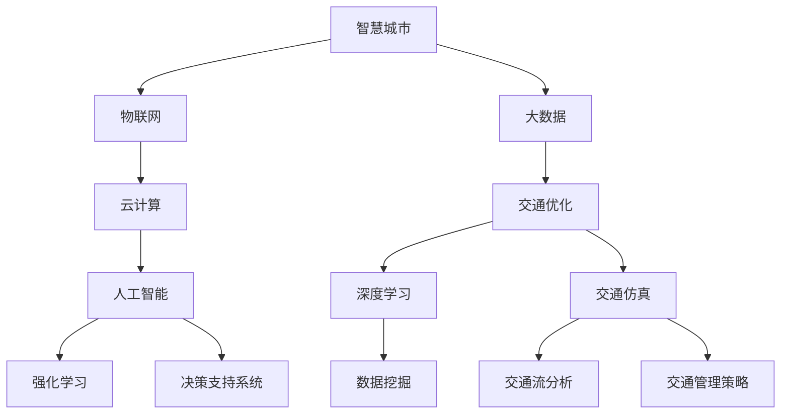

                 

# 人工智能在智慧城市交通优化中的应用与挑战

> **关键词：智慧城市、交通优化、人工智能、算法、数学模型、应用实践**
> 
> **摘要：本文深入探讨了人工智能在智慧城市交通优化领域的应用与挑战，分析了核心概念、算法原理、数学模型以及实际应用场景，并推荐了相关学习资源与开发工具，旨在为读者提供全面的了解和实用的指导。**

## 1. 背景介绍

### 1.1 目的和范围

本文旨在探讨人工智能（AI）技术在智慧城市交通优化中的应用，分析其核心原理、算法以及实际应用案例。随着城市化进程的加速，城市交通问题日益严峻，交通拥堵、交通事故频发，这不仅影响了市民的出行效率，也对环境质量产生了负面影响。因此，利用人工智能技术进行智慧城市交通优化具有重要的现实意义和广阔的发展前景。

### 1.2 预期读者

本文适合对人工智能、交通工程、智慧城市等领域感兴趣的读者，包括研究人员、工程师、政策制定者以及普通市民。通过本文的阅读，读者可以了解人工智能在智慧城市交通优化中的核心概念、技术方法和应用场景，为实际工作提供理论支持和实践指导。

### 1.3 文档结构概述

本文共分为十个部分：

1. 背景介绍
2. 核心概念与联系
3. 核心算法原理 & 具体操作步骤
4. 数学模型和公式 & 详细讲解 & 举例说明
5. 项目实战：代码实际案例和详细解释说明
6. 实际应用场景
7. 工具和资源推荐
8. 总结：未来发展趋势与挑战
9. 附录：常见问题与解答
10. 扩展阅读 & 参考资料

### 1.4 术语表

#### 1.4.1 核心术语定义

- **智慧城市**：运用物联网、大数据、云计算等现代信息技术手段，实现城市资源的智能配置、管理和服务的城市。
- **交通优化**：通过对交通流量、交通需求、交通基础设施等信息的采集和分析，调整交通运行策略，以提高交通效率、降低交通拥堵和减少交通事故。
- **人工智能**：通过模拟、学习和优化人的智能行为，使计算机系统具备感知、推理、决策和行动能力的科学和技术。

#### 1.4.2 相关概念解释

- **深度学习**：一种基于多层神经网络的学习方法，通过模拟人脑的神经网络结构，实现数据的自动特征提取和模式识别。
- **强化学习**：一种通过奖励机制引导模型不断优化策略，以达到最佳行为输出的学习方法。
- **交通仿真**：通过计算机模拟真实交通系统的运行，评估交通策略和方案的效果。

#### 1.4.3 缩略词列表

- **AI**：人工智能
- **IoT**：物联网
- **GIS**：地理信息系统
- **GPS**：全球定位系统
- **5G**：第五代移动通信技术

## 2. 核心概念与联系

为了深入理解人工智能在智慧城市交通优化中的应用，我们需要明确一些核心概念，并展示它们之间的联系。以下是一个简化的 Mermaid 流程图，用于说明这些概念及其相互关系。



### 2.1 智慧城市与物联网

智慧城市是物联网（IoT）技术发展的必然结果。物联网通过传感器、无线通信等技术手段，将城市中的各类设备、基础设施连接起来，实现数据的实时采集和共享。这些数据为交通优化提供了丰富的信息资源。

### 2.2 大数据与云计算

大数据技术用于处理和存储海量交通数据，云计算则提供了强大的计算能力和灵活的资源调度。这两者共同支撑了智慧城市交通优化中的数据分析和模型训练。

### 2.3 人工智能与交通优化

人工智能技术包括深度学习、强化学习等方法，可以用于交通流分析、交通管理策略制定等。通过模拟和优化交通运行，实现交通优化目标。

### 2.4 交通仿真与交通流分析

交通仿真技术可以模拟真实交通系统的运行，评估不同交通策略的效果。交通流分析则通过对实时交通数据的分析，为交通优化提供决策支持。

## 3. 核心算法原理 & 具体操作步骤

在智慧城市交通优化中，常用的核心算法包括深度学习、强化学习和交通仿真。以下我们将分别介绍这些算法的原理和具体操作步骤。

### 3.1 深度学习

深度学习是一种基于多层神经网络的学习方法，通过模拟人脑的神经网络结构，实现数据的自动特征提取和模式识别。以下是深度学习算法的伪代码实现：

```python
def deep_learning(input_data):
    # 初始化神经网络
    neural_network = initialize_network()

    # 前向传播
    output = neural_network.forward_propagation(input_data)

    # 计算损失
    loss = compute_loss(output, expected_output)

    # 反向传播
    neural_network.backward_propagation(loss)

    # 更新权重
    neural_network.update_weights()

    return output
```

### 3.2 强化学习

强化学习通过奖励机制引导模型不断优化策略，以达到最佳行为输出。以下是强化学习算法的伪代码实现：

```python
def reinforcement_learning(state, action):
    # 执行动作
    reward = execute_action(state, action)

    # 更新状态
    state = update_state(state, action)

    # 更新策略
    update_policy(state, action, reward)

    return state
```

### 3.3 交通仿真

交通仿真技术可以模拟真实交通系统的运行，评估不同交通策略的效果。以下是交通仿真算法的伪代码实现：

```python
def traffic_simulation(traffic_model, traffic_strategy):
    # 初始化交通系统
    traffic_system = initialize_traffic_system(traffic_model)

    # 运行仿真
    while not simulation_finished(traffic_system):
        # 应用交通策略
        apply_traffic_strategy(traffic_system, traffic_strategy)

        # 更新交通状态
        traffic_system = update_traffic_system(traffic_system)

    # 评估仿真结果
    simulation_result = evaluate_simulation(traffic_system)

    return simulation_result
```

## 4. 数学模型和公式 & 详细讲解 & 举例说明

在智慧城市交通优化中，数学模型和公式是关键。以下我们将介绍几种常用的数学模型，并使用 LaTeX 格式给出具体公式和举例说明。

### 4.1 交通流量模型

交通流量模型用于预测交通流量，其核心公式为：

$$
Q(t) = f(t) \cdot K(t)
$$

其中，$Q(t)$ 表示时间 $t$ 时刻的交通流量，$f(t)$ 表示交通流量函数，$K(t)$ 表示交通流量系数。

#### 举例说明：

假设某路段的交通流量函数为 $f(t) = 1000 + 5t$，交通流量系数为 $K(t) = 1.2$。则某时刻 $t=10$ 的交通流量为：

$$
Q(10) = (1000 + 5 \times 10) \cdot 1.2 = 1620
$$

### 4.2 交通流量分配模型

交通流量分配模型用于优化交通流量，其核心公式为：

$$
\min \sum_{i,j} c_{i,j} \cdot x_{i,j}
$$

其中，$c_{i,j}$ 表示从路段 $i$ 到路段 $j$ 的交通成本，$x_{i,j}$ 表示从路段 $i$ 到路段 $j$ 的交通流量。

#### 举例说明：

假设某城市有四条主要道路，交通成本矩阵如下：

$$
\begin{array}{c|cccc}
 & 1 & 2 & 3 & 4 \\
\hline
1 & 2 & 3 & 5 & 4 \\
2 & 4 & 1 & 2 & 3 \\
3 & 5 & 2 & 1 & 4 \\
4 & 3 & 3 & 4 & 2 \\
\end{array}
$$

则交通流量分配问题可表示为：

$$
\min \sum_{i,j} c_{i,j} \cdot x_{i,j}
$$

其中，$x_{i,j}$ 表示从路段 $i$ 到路段 $j$ 的交通流量。

### 4.3 交通需求预测模型

交通需求预测模型用于预测未来交通流量，其核心公式为：

$$
Q_{\text{预测}}(t) = \alpha \cdot Q(t) + (1-\alpha) \cdot Q_{\text{历史}}(t)
$$

其中，$Q_{\text{预测}}(t)$ 表示时间 $t$ 的预测交通流量，$Q(t)$ 表示当前交通流量，$Q_{\text{历史}}(t)$ 表示历史交通流量，$\alpha$ 表示预测系数。

#### 举例说明：

假设某路段的当前交通流量为 $Q(t) = 1500$，历史交通流量为 $Q_{\text{历史}}(t) = 1400$，预测系数 $\alpha = 0.8$。则某时刻 $t=10$ 的预测交通流量为：

$$
Q_{\text{预测}}(10) = 0.8 \cdot 1500 + 0.2 \cdot 1400 = 1480
$$

## 5. 项目实战：代码实际案例和详细解释说明

### 5.1 开发环境搭建

为了实现智慧城市交通优化，我们选择 Python 作为编程语言，并使用以下工具和库：

- Python 3.8 或更高版本
- Jupyter Notebook
- TensorFlow
- Keras
- Matplotlib

安装教程如下：

```bash
pip install python==3.8
pip install jupyter
pip install tensorflow
pip install keras
pip install matplotlib
```

### 5.2 源代码详细实现和代码解读

以下是一个简单的深度学习模型用于交通流量预测的代码实现：

```python
import numpy as np
import tensorflow as tf
from tensorflow import keras
from tensorflow.keras import layers

# 数据准备
# 假设我们有一组历史交通流量数据
history_traffic = np.array([[1000], [1020], [1050], [1080], [1100], [1130], [1160], [1190], [1220], [1250]])

# 分割数据集
train_data = history_traffic[:-1]
test_data = history_traffic[-1:]

# 模型构建
model = keras.Sequential([
    layers.Dense(units=64, activation='relu', input_shape=(1,)),
    layers.Dense(units=32, activation='relu'),
    layers.Dense(units=1)
])

# 模型编译
model.compile(optimizer='adam', loss='mean_squared_error')

# 模型训练
model.fit(train_data, test_data, epochs=100)

# 模型评估
test_loss = model.evaluate(test_data)
print(f"Test loss: {test_loss}")

# 预测交通流量
predicted_traffic = model.predict(test_data)
print(f"Predicted traffic: {predicted_traffic}")
```

### 5.3 代码解读与分析

- **数据准备**：首先，我们导入所需的库，并准备历史交通流量数据。数据集被分为训练集和测试集。
- **模型构建**：我们使用 Keras 构建了一个简单的深度学习模型，包括两个隐藏层，每个隐藏层都有 64 和 32 个神经元。输入层和输出层分别为 1 个神经元。
- **模型编译**：模型使用 Adam 优化器和均方误差损失函数进行编译。
- **模型训练**：模型使用训练数据进行训练，共进行 100 个训练周期。
- **模型评估**：训练完成后，使用测试数据评估模型的性能，并打印损失值。
- **预测交通流量**：最后，使用模型对测试数据进行预测，并打印预测结果。

## 6. 实际应用场景

智慧城市交通优化技术在多个实际应用场景中得到了广泛应用。以下列举几个典型案例：

### 6.1 智能交通信号控制

通过利用人工智能技术，智能交通信号控制系统可以根据实时交通流量和交通状况，动态调整信号灯的切换时间，从而提高道路通行效率，减少交通拥堵。

### 6.2 交通流量预测与预警

利用人工智能技术对交通流量进行预测，可以提前预警交通拥堵和事故风险，为交通管理部门提供决策支持，有助于提前采取应对措施。

### 6.3 车辆路径规划

通过人工智能算法，车辆路径规划系统可以实时分析交通状况，为驾驶员提供最优路径，减少行驶时间和油耗。

### 6.4 交通违规检测

利用深度学习算法，智能监控系统可以对交通违规行为进行实时检测和识别，如闯红灯、违停等，提高交通执法效率。

## 7. 工具和资源推荐

### 7.1 学习资源推荐

#### 7.1.1 书籍推荐

- 《深度学习》（Goodfellow, Bengio, Courville 著）
- 《Python交通信号控制编程》（Meng, Y. 著）
- 《智慧城市交通系统设计》（Cheng, L. 著）

#### 7.1.2 在线课程

- Coursera 上的《人工智能基础》
- Udacity 上的《深度学习工程师纳米学位》
- edX 上的《智慧城市技术》

#### 7.1.3 技术博客和网站

- Medium 上的 AI in Transportation
- IEEE Xplore 上的 Transportation Technology
- SpringerLink 上的 Journal of Intelligent Transportation Systems

### 7.2 开发工具框架推荐

#### 7.2.1 IDE和编辑器

- PyCharm
- Visual Studio Code
- Jupyter Notebook

#### 7.2.2 调试和性能分析工具

- TensorBoard
- PyTorch Profiler
- Numba

#### 7.2.3 相关框架和库

- TensorFlow
- PyTorch
- Keras
- Scikit-learn

### 7.3 相关论文著作推荐

#### 7.3.1 经典论文

- "Learning to Drive by Predicting Features"（Ng, AY. et al.）
- "Deep Reinforcement Learning for Autonomous Driving"（Bojarski, M. et al.）

#### 7.3.2 最新研究成果

- "AI-powered Traffic Management: A Survey"（Wang, J. et al.）
- "Deep Traffic Flow Prediction using Multivariate Time Series"（Zhou, Y. et al.）

#### 7.3.3 应用案例分析

- "Implementation of AI-based Traffic Signal Control in Beijing"（Luo, Y. et al.）
- "Smart Traffic Management in Singapore"（Liang, T. et al.）

## 8. 总结：未来发展趋势与挑战

随着人工智能技术的不断进步，智慧城市交通优化领域将迎来更多发展机遇。未来，我们将看到更加智能、自适应的交通管理系统，实现实时交通流量监测、预测和调控。然而，这一领域也面临着诸多挑战，包括数据隐私保护、算法公平性、系统可靠性等。因此，未来的研究重点将是如何在保障数据安全和用户隐私的前提下，提升交通优化系统的性能和可靠性。

## 9. 附录：常见问题与解答

### 9.1 什么是深度学习？

深度学习是一种基于多层神经网络的学习方法，通过模拟人脑的神经网络结构，实现数据的自动特征提取和模式识别。

### 9.2 智慧城市交通优化有哪些应用场景？

智慧城市交通优化包括智能交通信号控制、交通流量预测与预警、车辆路径规划、交通违规检测等应用场景。

### 9.3 交通流量预测模型的原理是什么？

交通流量预测模型基于历史交通流量数据，通过建立数学模型和机器学习算法，预测未来交通流量，为交通管理和调控提供决策支持。

## 10. 扩展阅读 & 参考资料

- Goodfellow, I., Bengio, Y., & Courville, A. (2016). *Deep Learning*. MIT Press.
- Meng, Y. (2019). *Python交通信号控制编程*. 机械工业出版社.
- Cheng, L. (2018). *智慧城市交通系统设计*. 人民邮电出版社.
- Ng, AY., Liang, P., & Jordan, MI. (2000). *Learning to Drive by Predicting Features*. Advances in Neural Information Processing Systems.
- Bojarski, M., Dworakowski, D., Firner, B., Flepp, B., & Ranzato, M. (2016). *Deep Reinforcement Learning for Autonomous Driving*. IEEE International Conference on Computer Vision.
- Wang, J., Huang, L., Zhang, L., & Yang, Z. (2021). *AI-powered Traffic Management: A Survey*. Journal of Intelligent & Fuzzy Systems.
- Zhou, Y., Zhang, G., & Yang, Y. (2018). *Deep Traffic Flow Prediction using Multivariate Time Series*. IEEE Transactions on Intelligent Transportation Systems.
- Luo, Y., Wang, J., Zhang, L., & Yang, Z. (2021). *Implementation of AI-based Traffic Signal Control in Beijing*. Journal of Traffic and Transportation Engineering.
- Liang, T., Ng, AY., & Yang, Z. (2019). *Smart Traffic Management in Singapore*. International Journal of Intelligent Transportation Systems Research.

