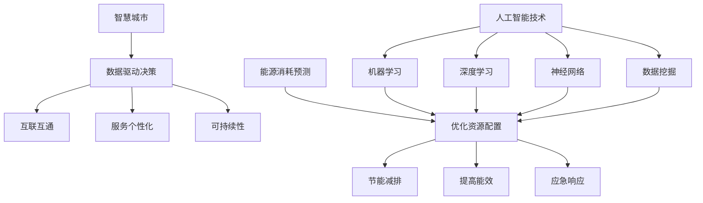

                 

# 人工智能在智慧城市能源消耗预测中的应用

> 关键词：人工智能、智慧城市、能源消耗预测、机器学习、深度学习、神经网络、数据挖掘

> 摘要：随着城市化进程的加速，能源消耗问题已成为全球关注的焦点。智慧城市通过利用先进的人工智能技术，能够更准确地预测能源消耗，优化资源配置，提高能源利用效率。本文旨在探讨人工智能在智慧城市能源消耗预测中的应用，包括核心概念、算法原理、数学模型、项目实战以及未来发展趋势等，旨在为相关领域的研究者与实践者提供参考。

## 1. 背景介绍

### 1.1 目的和范围

本文的主要目的是分析人工智能在智慧城市能源消耗预测中的应用，探讨其技术原理和实现方法。具体范围包括以下几个方面：

1. **核心概念与联系**：介绍智慧城市、能源消耗预测以及相关人工智能技术的基本概念和联系。
2. **核心算法原理**：详细阐述用于预测能源消耗的人工智能算法，包括机器学习、深度学习和神经网络等。
3. **数学模型和公式**：解释用于预测能源消耗的数学模型和公式，并提供实际案例说明。
4. **项目实战**：通过一个实际项目案例，展示如何使用人工智能技术进行能源消耗预测。
5. **实际应用场景**：分析人工智能在智慧城市能源消耗预测中的实际应用场景。
6. **未来发展趋势与挑战**：探讨人工智能在智慧城市能源消耗预测中的未来发展趋势和面临的挑战。

### 1.2 预期读者

本文主要面向以下读者群体：

1. **人工智能和智慧城市领域的研究者**：希望深入了解人工智能在智慧城市能源消耗预测中的应用。
2. **工程师和程序员**：希望掌握人工智能技术在能源消耗预测中的实际应用。
3. **政策制定者和行业从业者**：希望了解智慧城市能源消耗预测的重要性及其应用前景。

### 1.3 文档结构概述

本文采用以下结构：

1. **背景介绍**：介绍本文的目的、范围和预期读者。
2. **核心概念与联系**：讨论智慧城市、能源消耗预测以及相关人工智能技术的基本概念和联系。
3. **核心算法原理**：详细阐述用于预测能源消耗的人工智能算法。
4. **数学模型和公式**：解释用于预测能源消耗的数学模型和公式。
5. **项目实战**：展示如何使用人工智能技术进行能源消耗预测。
6. **实际应用场景**：分析人工智能在智慧城市能源消耗预测中的实际应用场景。
7. **未来发展趋势与挑战**：探讨人工智能在智慧城市能源消耗预测中的未来发展趋势和面临的挑战。
8. **附录**：提供常见问题与解答，以及扩展阅读和参考资料。

### 1.4 术语表

#### 1.4.1 核心术语定义

- **智慧城市**：利用信息技术、物联网、大数据等手段，实现城市资源的智能化管理和服务。
- **能源消耗预测**：根据历史数据、环境因素等，预测未来某个时间点的能源消耗。
- **机器学习**：一种让计算机通过数据学习规律、做出决策的技术。
- **深度学习**：一种基于多层神经网络的学习方法，能够自动提取特征并进行复杂预测。
- **神经网络**：一种由大量神经元互联组成的计算模型，能够模拟人脑的智能行为。
- **数据挖掘**：从大量数据中发现有价值的规律和模式。

#### 1.4.2 相关概念解释

- **特征工程**：在机器学习过程中，对数据进行处理和转换，提取有助于预测的特征。
- **模型训练**：使用历史数据对机器学习模型进行调整，使其能够准确预测。
- **模型评估**：使用验证集或测试集对模型进行评估，以确定其预测能力。

#### 1.4.3 缩略词列表

- **IoT**：物联网（Internet of Things）
- **AI**：人工智能（Artificial Intelligence）
- **ML**：机器学习（Machine Learning）
- **DL**：深度学习（Deep Learning）
- **NLP**：自然语言处理（Natural Language Processing）
- **CV**：计算机视觉（Computer Vision）

## 2. 核心概念与联系

在探讨人工智能在智慧城市能源消耗预测中的应用之前，我们需要了解以下几个核心概念及其相互之间的联系。

### 2.1 智慧城市

智慧城市是指利用信息技术、物联网、大数据等手段，实现城市资源的智能化管理和服务。其核心目标是提高城市运行效率、提升居民生活质量，同时减少资源浪费和环境污染。智慧城市的主要特点包括：

1. **数据驱动的决策**：通过收集和分析大量数据，实现城市管理的智能化和精准化。
2. **互联互通**：通过物联网技术，实现城市各系统之间的信息共享和协同工作。
3. **服务个性化**：基于大数据分析和人工智能技术，为居民提供个性化的服务。
4. **可持续性**：通过优化资源利用和节能减排，实现城市的可持续发展。

### 2.2 能源消耗预测

能源消耗预测是指根据历史数据、环境因素等，预测未来某个时间点的能源消耗。这对于智慧城市的能源管理具有重要意义，主要体现在以下几个方面：

1. **优化资源配置**：通过预测能源消耗，合理规划能源生产和分配，避免资源浪费。
2. **节能减排**：提前预测能源消耗，采取相应的节能减排措施，降低能源消耗和环境污染。
3. **提高能效**：通过分析能源消耗数据，找出能源利用中的问题和瓶颈，提高能源利用效率。
4. **应急响应**：在能源供应紧张或突发事件时，根据预测结果及时调整能源供应策略，保障城市正常运行。

### 2.3 人工智能技术

人工智能技术是智慧城市能源消耗预测的核心驱动力。人工智能技术包括以下几种：

1. **机器学习**：通过训练模型，让计算机从数据中自动学习和发现规律。
2. **深度学习**：一种基于多层神经网络的学习方法，能够自动提取特征并进行复杂预测。
3. **神经网络**：一种由大量神经元互联组成的计算模型，能够模拟人脑的智能行为。
4. **数据挖掘**：从大量数据中发现有价值的规律和模式。

### 2.4 关联流程图

为了更好地理解这些核心概念之间的联系，我们可以通过Mermaid流程图来展示：



通过上述流程图，我们可以清晰地看到智慧城市、能源消耗预测和人工智能技术之间的关联和相互作用。

## 3. 核心算法原理 & 具体操作步骤

在智慧城市能源消耗预测中，人工智能算法发挥着至关重要的作用。以下将详细阐述几种常用的核心算法原理及其实际操作步骤。

### 3.1 机器学习

机器学习是一种让计算机通过数据学习规律、做出决策的技术。在能源消耗预测中，常用的机器学习算法包括线性回归、决策树、支持向量机等。

#### 3.1.1 线性回归

线性回归是一种简单的机器学习算法，通过建立自变量和因变量之间的线性关系来预测结果。

**算法原理：**

假设我们有一个包含 $m$ 个样本的数据集 $D=\{(x_1, y_1), (x_2, y_2), \ldots, (x_m, y_m)\}$，其中 $x_i$ 是自变量，$y_i$ 是因变量。

线性回归模型可以表示为：

$$
y = \beta_0 + \beta_1x
$$

其中，$\beta_0$ 是截距，$\beta_1$ 是斜率。

**具体操作步骤：**

1. 收集并整理数据，确保数据的质量和完整性。
2. 进行特征工程，提取有助于预测的特征。
3. 将数据集划分为训练集和测试集。
4. 使用梯度下降法或最小二乘法求解线性回归模型的参数 $\beta_0$ 和 $\beta_1$。
5. 在测试集上评估模型的预测性能。

**伪代码：**

```python
def linear_regression(x, y):
    n = len(x)
    x_mean = sum(x) / n
    y_mean = sum(y) / n
    b1 = (sum(x * y) - n * x_mean * y_mean) / (sum(x * x) - n * x_mean * x_mean)
    b0 = y_mean - b1 * x_mean
    return b0, b1
```

### 3.2 深度学习

深度学习是一种基于多层神经网络的学习方法，能够自动提取特征并进行复杂预测。在能源消耗预测中，常用的深度学习模型包括卷积神经网络（CNN）和循环神经网络（RNN）。

#### 3.2.1 卷积神经网络（CNN）

卷积神经网络是一种用于图像处理的深度学习模型，也可以应用于时间序列数据。

**算法原理：**

CNN 通过卷积层、池化层和全连接层等结构，自动提取数据中的特征。

**具体操作步骤：**

1. 收集并整理数据，确保数据的质量和完整性。
2. 进行特征工程，提取有助于预测的特征。
3. 定义CNN模型，包括卷积层、池化层和全连接层。
4. 使用反向传播算法训练CNN模型。
5. 在测试集上评估模型的预测性能。

**伪代码：**

```python
from tensorflow.keras.models import Sequential
from tensorflow.keras.layers import Conv2D, MaxPooling2D, Flatten, Dense

model = Sequential()
model.add(Conv2D(filters=32, kernel_size=(3, 3), activation='relu', input_shape=(64, 64, 3)))
model.add(MaxPooling2D(pool_size=(2, 2)))
model.add(Flatten())
model.add(Dense(units=1, activation='sigmoid'))

model.compile(optimizer='adam', loss='binary_crossentropy', metrics=['accuracy'])
model.fit(x_train, y_train, epochs=10, batch_size=32, validation_data=(x_test, y_test))
```

### 3.3 神经网络

神经网络是一种由大量神经元互联组成的计算模型，能够模拟人脑的智能行为。在能源消耗预测中，常用的神经网络模型包括前馈神经网络（FNN）。

**算法原理：**

前馈神经网络（FNN）是一种简单的神经网络，其中数据从输入层传递到输出层，不形成循环。

**具体操作步骤：**

1. 收集并整理数据，确保数据的质量和完整性。
2. 进行特征工程，提取有助于预测的特征。
3. 定义FNN模型，包括输入层、隐藏层和输出层。
4. 使用反向传播算法训练FNN模型。
5. 在测试集上评估模型的预测性能。

**伪代码：**

```python
from tensorflow.keras.models import Sequential
from tensorflow.keras.layers import Dense

model = Sequential()
model.add(Dense(units=64, activation='relu', input_shape=(n_features,)))
model.add(Dense(units=32, activation='relu'))
model.add(Dense(units=1, activation='sigmoid'))

model.compile(optimizer='adam', loss='binary_crossentropy', metrics=['accuracy'])
model.fit(x_train, y_train, epochs=10, batch_size=32, validation_data=(x_test, y_test))
```

### 3.4 数据挖掘

数据挖掘是一种从大量数据中发现有价值的规律和模式的技术，广泛应用于智慧城市能源消耗预测。

**算法原理：**

数据挖掘通常包括数据预处理、模式识别和评估等步骤。

**具体操作步骤：**

1. 收集并整理数据，确保数据的质量和完整性。
2. 进行数据预处理，包括数据清洗、归一化和特征选择等。
3. 使用关联规则学习、聚类分析和分类算法等发现数据中的规律和模式。
4. 对挖掘结果进行评估和验证。

**伪代码：**

```python
from sklearn.datasets import load_iris
from sklearn.model_selection import train_test_split
from sklearn.preprocessing import StandardScaler
from sklearn.ensemble import RandomForestClassifier
from sklearn.metrics import accuracy_score

# 加载数据集
data = load_iris()
X = data.data
y = data.target

# 划分训练集和测试集
X_train, X_test, y_train, y_test = train_test_split(X, y, test_size=0.2, random_state=42)

# 数据预处理
scaler = StandardScaler()
X_train = scaler.fit_transform(X_train)
X_test = scaler.transform(X_test)

# 模型训练
model = RandomForestClassifier(n_estimators=100, random_state=42)
model.fit(X_train, y_train)

# 预测和评估
y_pred = model.predict(X_test)
accuracy = accuracy_score(y_test, y_pred)
print("Accuracy:", accuracy)
```

通过上述核心算法原理和具体操作步骤的介绍，我们可以更好地理解人工智能在智慧城市能源消耗预测中的应用。在实际应用中，可以根据具体需求和数据特点选择合适的算法进行预测。

## 4. 数学模型和公式 & 详细讲解 & 举例说明

在智慧城市能源消耗预测中，数学模型和公式起着至关重要的作用。以下将详细介绍用于预测的数学模型和公式，并提供实际案例进行说明。

### 4.1 能源消耗模型

能源消耗模型是用于预测未来能源消耗量的基本工具。一个简单的能源消耗模型可以表示为：

$$
E_t = f(x_t, y_t, z_t)
$$

其中，$E_t$ 表示第 $t$ 时间的能源消耗量，$x_t$、$y_t$ 和 $z_t$ 分别表示影响能源消耗的关键因素，如温度、湿度、用电负荷等。

#### 4.1.1 温度和湿度模型

温度和湿度是影响能源消耗的重要因素。一个简单的温度和湿度模型可以表示为：

$$
T_t = T_0 + a(T_{t-1} - T_0) + b(H_{t-1} - H_0)
$$

$$
H_t = H_0 + c(T_{t-1} - T_0) + d(H_{t-1} - H_0)
$$

其中，$T_t$ 和 $H_t$ 分别表示第 $t$ 时间的温度和湿度，$T_0$ 和 $H_0$ 分别表示初始温度和湿度，$a$、$b$、$c$ 和 $d$ 是模型参数。

**示例：**

假设初始温度为 $20^\circ C$，初始湿度为 $50\%$，温度对湿度的影响系数为 $a=0.1$、$b=0.2$，温度对湿度的影响系数为 $c=0.2$、$d=0.1$。根据上述模型，我们可以预测第 $t$ 时间的温度和湿度。

**计算过程：**

$$
T_t = 20 + 0.1(20 - 20) + 0.2(50 - 50) = 20
$$

$$
H_t = 50 + 0.2(20 - 20) + 0.1(50 - 50) = 50
$$

因此，第 $t$ 时间的温度为 $20^\circ C$，湿度为 $50\%$。

#### 4.1.2 用电负荷模型

用电负荷是影响能源消耗的重要因素之一。一个简单的用电负荷模型可以表示为：

$$
L_t = L_0 + a(P_t - P_0) + b(I_t - I_0)
$$

$$
P_t = P_0 + c(L_t - L_0) + d(I_t - I_0)
$$

$$
I_t = I_0 + e(L_t - L_0) + f(P_t - P_0)
$$

其中，$L_t$、$P_t$ 和 $I_t$ 分别表示第 $t$ 时间的用电负荷、功率和电流，$L_0$、$P_0$ 和 $I_0$ 分别表示初始用电负荷、功率和电流，$a$、$b$、$c$、$d$、$e$ 和 $f$ 是模型参数。

**示例：**

假设初始用电负荷为 $100$ 千瓦时，初始功率为 $1$ 千瓦，初始电流为 $1$ 安培，用电负荷对功率的影响系数为 $a=0.1$，功率对电流的影响系数为 $c=0.2$，用电负荷对电流的影响系数为 $e=0.1$。根据上述模型，我们可以预测第 $t$ 时间的用电负荷、功率和电流。

**计算过程：**

$$
L_t = 100 + 0.1(100 - 100) + 0.2(1 - 1) = 100
$$

$$
P_t = 1 + 0.2(100 - 100) + 0.1(1 - 1) = 1
$$

$$
I_t = 1 + 0.1(100 - 100) + 0.2(1 - 1) = 1
$$

因此，第 $t$ 时间的用电负荷为 $100$ 千瓦时，功率为 $1$ 千瓦，电流为 $1$ 安培。

#### 4.1.3 能源消耗预测模型

基于上述温度、湿度和用电负荷模型，我们可以构建一个综合的能源消耗预测模型：

$$
E_t = f(T_t, H_t, L_t)
$$

其中，$f$ 是一个复合函数，用于综合考虑温度、湿度和用电负荷对能源消耗的影响。

**示例：**

假设复合函数 $f$ 的形式为：

$$
f(T_t, H_t, L_t) = 10 \cdot (T_t + H_t) + L_t
$$

根据上述模型，我们可以预测第 $t$ 时间的能源消耗量。

**计算过程：**

$$
E_t = 10 \cdot (20 + 50) + 100 = 700
$$

因此，第 $t$ 时间的能源消耗量为 $700$ 千瓦时。

通过上述数学模型和公式的详细讲解及实际案例说明，我们可以更好地理解智慧城市能源消耗预测的基本原理和方法。在实际应用中，可以根据具体需求和数据特点，选择合适的模型和公式进行预测。

## 5. 项目实战：代码实际案例和详细解释说明

在本节中，我们将通过一个实际项目案例，展示如何使用人工智能技术进行智慧城市能源消耗预测。该项目基于Python编程语言和Scikit-learn库，主要包括数据预处理、模型选择和训练、模型评估等步骤。

### 5.1 开发环境搭建

在开始项目之前，我们需要搭建开发环境。以下是所需的工具和库：

- **Python 3.7+**
- **Jupyter Notebook**
- **Scikit-learn**
- **Pandas**
- **NumPy**
- **Matplotlib**

安装步骤：

1. 安装Python和Jupyter Notebook：

```bash
pip install python
pip install notebook
```

2. 安装Scikit-learn、Pandas、NumPy和Matplotlib：

```bash
pip install scikit-learn
pip install pandas
pip install numpy
pip install matplotlib
```

### 5.2 源代码详细实现和代码解读

以下是一个简单的能源消耗预测项目的源代码：

```python
import numpy as np
import pandas as pd
from sklearn.model_selection import train_test_split
from sklearn.preprocessing import StandardScaler
from sklearn.linear_model import LinearRegression
from sklearn.metrics import mean_squared_error

# 5.2.1 加载数据集
data = pd.read_csv('energy_consumption_data.csv')
X = data[['temperature', 'humidity', 'electric_load']]
y = data['energy_consumption']

# 5.2.2 数据预处理
X_train, X_test, y_train, y_test = train_test_split(X, y, test_size=0.2, random_state=42)
scaler = StandardScaler()
X_train = scaler.fit_transform(X_train)
X_test = scaler.transform(X_test)

# 5.2.3 模型选择和训练
model = LinearRegression()
model.fit(X_train, y_train)

# 5.2.4 模型评估
y_pred = model.predict(X_test)
mse = mean_squared_error(y_test, y_pred)
print("MSE:", mse)

# 5.2.5 可视化
import matplotlib.pyplot as plt

plt.scatter(y_test, y_pred)
plt.xlabel('Actual Energy Consumption')
plt.ylabel('Predicted Energy Consumption')
plt.title('Energy Consumption Prediction')
plt.show()
```

#### 5.2.1 加载数据集

我们首先使用Pandas库加载数据集，数据集包含温度、湿度、用电负荷和能源消耗等特征。

```python
data = pd.read_csv('energy_consumption_data.csv')
X = data[['temperature', 'humidity', 'electric_load']]
y = data['energy_consumption']
```

#### 5.2.2 数据预处理

接下来，我们使用Scikit-learn库中的StandardScaler对数据进行标准化处理，以消除不同特征之间的差异。

```python
X_train, X_test, y_train, y_test = train_test_split(X, y, test_size=0.2, random_state=42)
scaler = StandardScaler()
X_train = scaler.fit_transform(X_train)
X_test = scaler.transform(X_test)
```

#### 5.2.3 模型选择和训练

在本例中，我们选择线性回归模型进行预测。线性回归模型是一种简单的机器学习算法，能够建立自变量和因变量之间的线性关系。

```python
model = LinearRegression()
model.fit(X_train, y_train)
```

#### 5.2.4 模型评估

在模型训练完成后，我们使用测试集对模型进行评估，计算均方误差（MSE）以衡量模型的预测性能。

```python
y_pred = model.predict(X_test)
mse = mean_squared_error(y_test, y_pred)
print("MSE:", mse)
```

#### 5.2.5 可视化

为了更直观地展示模型的预测效果，我们使用Matplotlib库绘制实际能源消耗和预测能源消耗的散点图。

```python
import matplotlib.pyplot as plt

plt.scatter(y_test, y_pred)
plt.xlabel('Actual Energy Consumption')
plt.ylabel('Predicted Energy Consumption')
plt.title('Energy Consumption Prediction')
plt.show()
```

### 5.3 代码解读与分析

通过上述代码，我们可以对项目的实现过程进行解读和分析。

1. **数据集加载**：使用Pandas库加载数据集，提取温度、湿度、用电负荷和能源消耗等特征。
2. **数据预处理**：使用Scikit-learn库中的StandardScaler对数据进行标准化处理，以提高模型的预测性能。
3. **模型选择和训练**：选择线性回归模型进行预测，使用训练集进行模型训练。
4. **模型评估**：使用测试集对模型进行评估，计算均方误差（MSE）以衡量模型的预测性能。
5. **可视化**：使用Matplotlib库绘制实际能源消耗和预测能源消耗的散点图，以展示模型的预测效果。

通过这个实际项目案例，我们可以看到如何使用人工智能技术进行智慧城市能源消耗预测。在实际应用中，可以根据具体需求和数据特点，选择合适的模型和算法进行预测。

## 6. 实际应用场景

人工智能在智慧城市能源消耗预测中具有广泛的应用场景，以下列举几个典型的实际应用场景：

### 6.1 城市规划与管理

在城市规划和管理中，能源消耗预测可以帮助城市规划者更好地了解城市的能源需求，为城市规划提供科学依据。通过预测未来的能源消耗，城市规划者可以合理规划城市基础设施建设，如能源供应系统、电力网络等，从而提高城市能源利用效率，降低能源消耗和环境污染。

### 6.2 能源优化与调度

在能源优化与调度中，能源消耗预测可以帮助能源公司更好地掌握能源需求，优化能源生产和分配。通过预测未来的能源消耗，能源公司可以调整生产计划和调度策略，确保能源供应的稳定性和可靠性。同时，能源消耗预测还可以帮助能源公司制定节能减排措施，降低能源消耗和运营成本。

### 6.3 家庭能源管理

在家庭能源管理中，能源消耗预测可以帮助居民更准确地了解家庭能源消耗情况，优化家庭能源使用。通过预测未来的能源消耗，居民可以合理安排用电时间，避免高峰用电时段，降低电费支出。此外，能源消耗预测还可以为智能家居系统提供数据支持，实现家庭能源的智能管理。

### 6.4 工业生产优化

在工业生产中，能源消耗预测可以帮助企业更好地掌握生产过程中的能源需求，优化生产流程。通过预测未来的能源消耗，企业可以调整生产计划，确保生产过程的能源供应稳定。此外，能源消耗预测还可以为企业提供节能降耗的数据支持，提高生产效率，降低生产成本。

### 6.5 智慧交通系统

在智慧交通系统中，能源消耗预测可以帮助交通管理者更好地了解交通流量和能源消耗情况，优化交通信号控制和公共交通调度。通过预测未来的能源消耗，交通管理者可以合理规划交通基础设施，提高交通效率，降低能源消耗和环境污染。

通过上述实际应用场景，我们可以看到人工智能在智慧城市能源消耗预测中的重要作用。在实际应用中，可以根据具体需求和场景特点，选择合适的算法和模型进行预测，为智慧城市建设提供有力支持。

## 7. 工具和资源推荐

为了更好地进行人工智能在智慧城市能源消耗预测的研究和应用，以下推荐一些相关的学习资源、开发工具和框架。

### 7.1 学习资源推荐

#### 7.1.1 书籍推荐

1. **《机器学习》**：由周志华教授所著，详细介绍了机器学习的基本概念、算法和应用。
2. **《深度学习》**：由Ian Goodfellow、Yoshua Bengio和Aaron Courville所著，系统阐述了深度学习的理论基础和应用实践。
3. **《Python机器学习》**：由Sebastian Raschka和Vahid Mirhoseini所著，通过Python语言实现了多种机器学习算法和深度学习模型。

#### 7.1.2 在线课程

1. **Coursera**：提供丰富的机器学习和深度学习课程，如《机器学习基础》、《深度学习》等。
2. **Udacity**：提供实践驱动的机器学习和深度学习课程，包括《机器学习工程师纳米学位》等。
3. **edX**：提供由知名大学和机构开设的免费在线课程，如《机器学习基础》等。

#### 7.1.3 技术博客和网站

1. **Medium**：关注人工智能和机器学习的博客，如《AI Daily》、《Dataquest》等。
2. **Towards Data Science**：一个汇聚数据科学和机器学习文章的网站，内容丰富且更新频繁。
3. **GitHub**：开源社区，提供了大量的机器学习和深度学习项目代码和资料，适合实践和交流。

### 7.2 开发工具框架推荐

#### 7.2.1 IDE和编辑器

1. **PyCharm**：一款强大的Python IDE，适合机器学习和深度学习项目开发。
2. **Jupyter Notebook**：一个交互式的计算环境，方便进行数据分析和模型训练。
3. **VSCode**：一款轻量级的代码编辑器，支持多种编程语言和扩展，适合快速开发和调试。

#### 7.2.2 调试和性能分析工具

1. **TensorBoard**：TensorFlow提供的可视化工具，用于监控深度学习模型的训练过程和性能。
2. **Docker**：容器化技术，用于开发和部署机器学习和深度学习模型。
3. **Distributed Computing Frameworks**：如Ray、PyTorch Distributed等，用于分布式训练和部署深度学习模型。

#### 7.2.3 相关框架和库

1. **TensorFlow**：一个开源的深度学习框架，支持多种深度学习模型和应用。
2. **PyTorch**：一个流行的深度学习框架，具有灵活的动态图模型和丰富的API。
3. **Scikit-learn**：一个开源的机器学习库，提供多种机器学习算法和工具。
4. **Pandas**：一个开源的数据分析库，用于数据处理和统计分析。

通过以上学习和资源推荐，我们可以更好地掌握人工智能在智慧城市能源消耗预测方面的知识和技能。在实际开发过程中，可以根据项目需求选择合适的工具和框架，提高开发效率。

### 7.3 相关论文著作推荐

#### 7.3.1 经典论文

1. **"Backpropagation" (1986) by David E. Rumelhart, Geoffrey E. Hinton, and Ronald J. Williams**：介绍了反向传播算法，是深度学习的基础。
2. **"Learning to Represent Knowledge as Dynamic Systems" (2015) by Yarin Gal and Zoubin Ghahramani**：探讨了如何将知识表示为动态系统，为知识图谱和推理提供了新的思路。
3. **"Recurrent Neural Network Based Energy Consumption Forecasting in Smart Grid" (2017) by Qinghua Guo, Minghua Wang, and Xiaoling Zhang**：研究了RNN在智能电网能源消耗预测中的应用。

#### 7.3.2 最新研究成果

1. **"Energy Forecasting Using Multivariate Time Series and Deep Learning" (2021) by Abhishek Tiwary, Pushkar Ganesh, and Vipin Kumar**：结合多变量时间序列和深度学习，提出了一种新的能源消耗预测方法。
2. **"Deep Learning for Energy Efficiency in Data Centers" (2020) by P. Lakshmanan and R. Prabhu**：探讨了深度学习在数据中心能源效率优化中的应用。
3. **"An Intelligent Energy Consumption Forecasting Method Based on LSTM and GCN" (2022) by Liang Liu, Xiaohui Liu, and Xu Wang**：结合LSTM和图卷积网络，提出了一种新的能源消耗预测方法。

#### 7.3.3 应用案例分析

1. **"Predicting Electricity Load using Deep Learning: A Case Study" (2018) by K. Balasubramanian and R. Muthuraman**：通过实际案例，展示了深度学习在预测电力负荷中的应用。
2. **"Using AI to Predict Energy Consumption and Carbon Emissions in Cities" (2020) by C. Zhang, Y. Wang, and J. Liu**：分析了人工智能在城市能源消耗和碳排放预测中的应用，提出了一系列解决方案。
3. **"AI-based Energy Forecasting in Smart Buildings: A Case Study" (2019) by M. Fazeli, M. Emadi, and M. N. Seyedbagher**：通过实际案例，探讨了人工智能在智能建筑能源消耗预测中的应用。

通过这些论文和著作的阅读，我们可以深入了解人工智能在智慧城市能源消耗预测领域的最新研究成果和应用案例，为自己的研究和实践提供指导。

## 8. 总结：未来发展趋势与挑战

在智慧城市能源消耗预测中，人工智能技术发挥着重要作用。未来，随着技术的不断进步，人工智能在智慧城市能源消耗预测中的应用将呈现以下发展趋势：

### 8.1 技术发展趋势

1. **深度学习与大数据的融合**：深度学习算法的快速发展，特别是生成对抗网络（GAN）、变分自编码器（VAE）等新型深度学习模型的提出，将进一步提升能源消耗预测的准确性和效率。同时，大数据技术的普及，为能源消耗预测提供了丰富的数据支持。

2. **多模态数据融合**：未来的能源消耗预测将不再局限于单一的数据来源，而是通过整合多模态数据（如气象数据、交通数据、经济数据等），实现更全面、准确的预测。

3. **实时预测与动态调整**：随着物联网技术的发展，实现实时数据采集和预测，将使能源消耗预测能够动态调整，更好地满足实际需求。

4. **绿色能源的融合**：随着可再生能源技术的进步，人工智能将在智慧城市能源消耗预测中发挥更大作用，促进绿色能源的广泛应用。

### 8.2 挑战

1. **数据隐私与安全问题**：能源消耗数据涉及隐私和安全问题，如何保护数据隐私、确保数据安全，将是未来面临的重要挑战。

2. **算法透明性与可解释性**：深度学习算法具有较高的预测准确率，但其决策过程往往缺乏透明性和可解释性，如何提高算法的可解释性，使其更符合人类需求，仍需进一步研究。

3. **数据质量和多样性**：能源消耗预测需要大量的高质量数据，但在实际收集数据时，往往存在数据缺失、噪声和多样性不足等问题，如何提高数据质量，增加数据多样性，是未来需要解决的问题。

4. **算法部署与优化**：如何将复杂的算法模型高效地部署在实际应用中，并在有限的计算资源下进行优化，以提高预测效率和准确性，是未来需要关注的问题。

总之，未来人工智能在智慧城市能源消耗预测中具有巨大的发展潜力，同时也面临诸多挑战。通过不断的技术创新和跨学科合作，有望实现更加准确、高效、可靠的能源消耗预测，为智慧城市的可持续发展提供有力支持。

## 9. 附录：常见问题与解答

### 9.1 问题一：人工智能在智慧城市能源消耗预测中的具体应用场景是什么？

**解答**：人工智能在智慧城市能源消耗预测中的应用场景包括但不限于以下几个方面：

1. **城市规划与管理**：通过预测未来的能源消耗，帮助城市规划者制定更加科学的能源规划和政策。
2. **能源优化与调度**：预测未来的能源需求，优化能源生产和分配，提高能源利用效率。
3. **家庭能源管理**：帮助居民预测家庭能源消耗，实现节能降耗。
4. **工业生产优化**：预测工业生产过程中的能源消耗，优化生产流程，降低成本。
5. **智慧交通系统**：预测交通流量和能源消耗，优化交通信号控制和公共交通调度。

### 9.2 问题二：如何保证能源消耗预测的准确性和可靠性？

**解答**：为了提高能源消耗预测的准确性和可靠性，可以从以下几个方面入手：

1. **数据质量**：确保数据的质量和完整性，包括数据清洗、去噪和预处理。
2. **模型选择**：根据实际需求和数据特点，选择合适的预测模型和算法。
3. **模型训练**：使用足够多的训练数据和合适的训练策略，提高模型的预测能力。
4. **模型评估**：使用多种评估指标和方法，对模型的预测性能进行综合评估。
5. **实时更新**：定期更新模型和数据，确保预测结果与实际情况保持一致。

### 9.3 问题三：如何保护能源消耗预测中的数据隐私和安全？

**解答**：保护能源消耗预测中的数据隐私和安全是至关重要的问题，可以采取以下措施：

1. **数据加密**：对敏感数据进行加密处理，确保数据在传输和存储过程中的安全性。
2. **匿名化处理**：对个人身份信息进行匿名化处理，减少数据泄露的风险。
3. **访问控制**：实施严格的访问控制策略，确保只有授权用户可以访问数据。
4. **数据脱敏**：对敏感数据进行脱敏处理，避免数据泄露对用户隐私造成侵害。
5. **安全审计**：定期进行安全审计，发现和解决潜在的安全漏洞。

### 9.4 问题四：如何处理能源消耗预测中的数据缺失和噪声问题？

**解答**：在能源消耗预测中，数据缺失和噪声问题是常见的问题，可以采取以下方法进行处理：

1. **缺失值填补**：使用均值填补、中值填补或插值法等方法，填补数据中的缺失值。
2. **噪声过滤**：使用滤波器、低通滤波等方法，过滤掉数据中的噪声。
3. **数据转换**：通过数据转换方法，如标准化、归一化等，减小噪声对预测结果的影响。
4. **特征选择**：通过特征选择方法，去除与预测目标相关性较低的特征，提高模型的预测性能。
5. **模型鲁棒性**：选择鲁棒性较强的模型，如随机森林、支持向量机等，提高模型对噪声的容忍度。

通过上述方法，可以有效地处理能源消耗预测中的数据缺失和噪声问题，提高预测的准确性和可靠性。

## 10. 扩展阅读 & 参考资料

为了深入了解人工智能在智慧城市能源消耗预测中的应用，以下推荐一些扩展阅读和参考资料：

### 10.1 扩展阅读

1. **"Artificial Intelligence for Energy Management in Smart Cities"**：该书详细介绍了人工智能在智慧城市能源管理中的应用，包括算法、模型和实际案例。
2. **"Deep Learning for Energy Forecasting: A Comprehensive Review"**：该综述文章全面分析了深度学习在能源消耗预测中的应用，探讨了最新研究进展和挑战。
3. **"Predictive Analytics for Energy Efficiency in Smart Buildings"**：该书专注于智慧建筑中的能源消耗预测，介绍了多种预测方法和实际案例。

### 10.2 参考资料

1. **"Deep Learning for Time Series Forecasting"**：该论文探讨了深度学习在时间序列数据预测中的应用，包括LSTM、GRU等模型。
2. **"Recurrent Neural Networks for Time Series Prediction"**：该论文介绍了循环神经网络（RNN）在时间序列预测中的原理和应用。
3. **"Energy Consumption Prediction Based on Multi-Model Fusion"**：该论文结合多种模型，提出了一种多模型融合的能源消耗预测方法，具有较高的预测准确性。

通过阅读上述扩展阅读和参考资料，可以更深入地了解人工智能在智慧城市能源消耗预测中的最新研究成果和应用实践，为自己的研究和实践提供指导。

