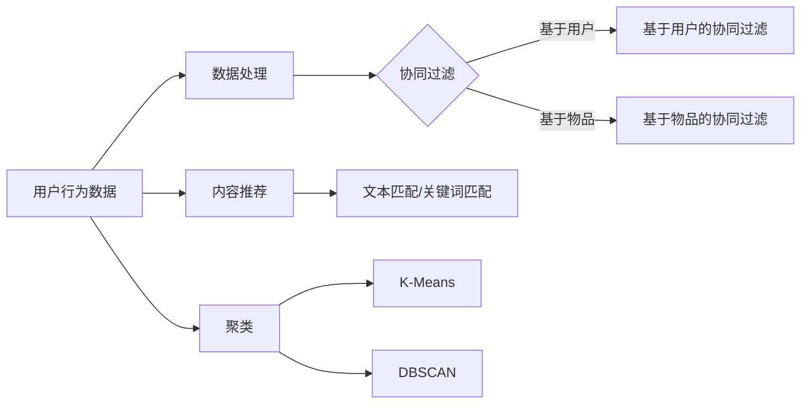

                 

# 人工智能在智慧旅游推荐系统中的兴趣点挖掘

## 关键词：人工智能、智慧旅游、推荐系统、兴趣点挖掘、算法原理

> 摘要：本文深入探讨了人工智能在智慧旅游推荐系统中的应用，特别是兴趣点挖掘的技术原理和实践方法。文章首先介绍了智慧旅游推荐系统的背景和重要性，然后详细阐述了兴趣点挖掘的核心概念、算法原理以及数学模型。接着，通过一个实际项目案例，展示了如何使用人工智能技术实现兴趣点挖掘，并对代码进行了详细解读。最后，本文总结了实际应用场景、推荐工具和资源，以及未来发展趋势和挑战。

## 1. 背景介绍

### 1.1 目的和范围

随着互联网和智能手机的普及，智慧旅游作为一种新型的旅游服务模式，逐渐成为旅游业发展的热点。智慧旅游推荐系统作为智慧旅游的重要组成部分，旨在为游客提供个性化、智能化的旅游推荐服务。本文旨在探讨人工智能在智慧旅游推荐系统中应用，特别是兴趣点挖掘技术的原理和实践。

本文将围绕以下内容进行讨论：

1. 智慧旅游推荐系统的背景和重要性。
2. 兴趣点挖掘的核心概念和算法原理。
3. 数学模型和具体操作步骤。
4. 项目实战：代码实际案例和详细解释说明。
5. 实际应用场景和工具资源推荐。
6. 未来发展趋势与挑战。

### 1.2 预期读者

本文主要面向以下读者：

1. 智慧旅游、推荐系统领域的研究人员。
2. 计算机科学、数据挖掘专业的学生和从业者。
3. 对人工智能在智慧旅游推荐系统应用感兴趣的读者。

### 1.3 文档结构概述

本文分为以下十个部分：

1. 引言：介绍文章的主题和目的。
2. 背景介绍：智慧旅游推荐系统的背景和重要性。
3. 核心概念与联系：介绍兴趣点挖掘的核心概念和架构。
4. 核心算法原理 & 具体操作步骤：详细讲解兴趣点挖掘算法原理和操作步骤。
5. 数学模型和公式 & 详细讲解 & 举例说明：阐述兴趣点挖掘的数学模型和公式。
6. 项目实战：代码实际案例和详细解释说明。
7. 实际应用场景：分析兴趣点挖掘在实际项目中的应用。
8. 工具和资源推荐：介绍学习资源、开发工具和框架。
9. 总结：未来发展趋势与挑战。
10. 附录：常见问题与解答。
11. 扩展阅读 & 参考资料。

### 1.4 术语表

#### 1.4.1 核心术语定义

1. **智慧旅游**：利用信息技术和智能手段，为游客提供个性化、智能化、便捷化的旅游服务。
2. **推荐系统**：根据用户的历史行为、偏好和兴趣，向用户推荐相关内容或服务。
3. **兴趣点挖掘**：通过分析用户的行为数据和旅游数据，发现用户的兴趣点和偏好，为用户提供个性化的旅游推荐。
4. **数据挖掘**：从大量数据中发现有趣的知识、模式和关联。
5. **机器学习**：利用计算机算法，从数据中学习规律和模式，并作出预测和决策。

#### 1.4.2 相关概念解释

1. **用户画像**：对用户进行全面、多维度的刻画，包括用户的年龄、性别、兴趣爱好、消费习惯等。
2. **协同过滤**：通过分析用户对物品的评分或行为，预测用户对未评分或未行为的物品的兴趣。
3. **内容推荐**：根据用户的历史行为和偏好，推荐与用户兴趣相关的内容。

#### 1.4.3 缩略词列表

- **AI**：人工智能（Artificial Intelligence）
- **ML**：机器学习（Machine Learning）
- **DM**：数据挖掘（Data Mining）
- **RL**：强化学习（Reinforcement Learning）
- **NLP**：自然语言处理（Natural Language Processing）

## 2. 核心概念与联系

### 2.1 核心概念

在智慧旅游推荐系统中，兴趣点挖掘是关键环节。以下是兴趣点挖掘中的核心概念：

1. **用户行为数据**：包括用户的浏览记录、搜索历史、订单记录等。
2. **旅游数据**：包括景点信息、旅游路线、游客评价等。
3. **用户画像**：对用户进行全面、多维度的刻画，包括用户的年龄、性别、兴趣爱好、消费习惯等。
4. **推荐算法**：根据用户画像、用户行为数据和旅游数据，为用户提供个性化的旅游推荐。

### 2.2 架构原理

智慧旅游推荐系统架构可以分为以下几个层次：

1. **数据层**：收集和存储用户行为数据、旅游数据等。
2. **数据处理层**：对原始数据进行清洗、转换和集成，形成可用于分析的用户行为数据和旅游数据。
3. **算法层**：利用机器学习、数据挖掘等技术，对用户行为数据和旅游数据进行分析，为用户提供个性化推荐。
4. **展示层**：将推荐结果呈现给用户，包括网页、APP 等界面。

以下是智慧旅游推荐系统架构的 Mermaid 流程图：


### 2.3 核心算法原理

兴趣点挖掘的核心算法包括协同过滤、内容推荐、聚类等。

1. **协同过滤**：通过分析用户对物品的评分或行为，预测用户对未评分或未行为的物品的兴趣。协同过滤可以分为基于用户的协同过滤和基于物品的协同过滤。
   
2. **内容推荐**：根据用户的历史行为和偏好，推荐与用户兴趣相关的内容。内容推荐可以基于关键词、标签、文本匹配等。

3. **聚类**：将相似的用户或景点聚为一类，为用户提供相关的推荐。常见的聚类算法有 K-Means、DBSCAN 等。

以下是兴趣点挖掘算法的 Mermaid 流程图：



## 3. 核心算法原理 & 具体操作步骤

### 3.1 协同过滤算法原理

协同过滤（Collaborative Filtering）是一种常用的推荐算法，通过分析用户之间的相似性，预测用户对未评分或未行为的物品的兴趣。

#### 3.1.1 基于用户的协同过滤

基于用户的协同过滤（User-Based Collaborative Filtering）通过分析用户之间的相似性，找到与目标用户相似的其他用户，然后推荐这些相似用户喜欢的物品。

具体步骤如下：

1. **计算用户相似度**：计算目标用户与所有其他用户的相似度，常用的相似度计算方法有欧氏距离、余弦相似度等。

2. **查找相似用户**：根据相似度，找到与目标用户最相似的 K 个用户。

3. **推荐物品**：推荐这些相似用户喜欢的但目标用户尚未评分或行为的物品。

#### 3.1.2 基于物品的协同过滤

基于物品的协同过滤（Item-Based Collaborative Filtering）通过分析物品之间的相似性，找到与目标物品相似的其他物品，然后推荐这些相似物品。

具体步骤如下：

1. **计算物品相似度**：计算目标物品与所有其他物品的相似度，常用的相似度计算方法有皮尔逊相关系数、余弦相似度等。

2. **查找相似物品**：根据相似度，找到与目标物品最相似的 K 个物品。

3. **推荐物品**：推荐这些相似物品。

### 3.2 内容推荐算法原理

内容推荐（Content-Based Filtering）根据用户的历史行为和偏好，推荐与用户兴趣相关的物品。

具体步骤如下：

1. **提取特征**：从用户的历史行为和偏好中提取特征，如关键词、标签等。

2. **计算相似度**：计算目标物品与用户历史物品的相似度，常用的相似度计算方法有余弦相似度、Jaccard 相似度等。

3. **推荐物品**：推荐与用户历史物品相似度较高的物品。

### 3.3 聚类算法原理

聚类（Clustering）是一种无监督学习方法，将相似的数据聚为一类，用于发现用户或物品的潜在群体。

#### 3.3.1 K-Means 算法

K-Means 算法是一种基于距离的聚类算法，通过迭代优化，将数据分为 K 个聚类。

具体步骤如下：

1. **初始化聚类中心**：随机选择 K 个数据点作为聚类中心。

2. **分配数据点**：计算每个数据点到聚类中心的距离，将数据点分配到距离最近的聚类中心。

3. **更新聚类中心**：计算每个聚类的平均值，作为新的聚类中心。

4. **重复步骤 2 和步骤 3，直到聚类中心不再发生变化或达到最大迭代次数**。

#### 3.3.2 DBSCAN 算法

DBSCAN（Density-Based Spatial Clustering of Applications with Noise）算法是一种基于密度的聚类算法，能够发现任意形状的聚类，并处理噪声数据。

具体步骤如下：

1. **确定邻域**：计算每个数据点的邻域，邻域内的数据点被视为邻居。

2. **生成核心点**：如果一个数据点的邻域中包含至少 MinPts（最小邻居数）个数据点，则该数据点为核心点。

3. **生成边界点**：如果一个数据点的邻域中包含少于 MinPts 个数据点，但有核心点邻居，则该数据点为边界点。

4. **生成聚类**：从核心点开始，递归扩展聚类，直到包含所有核心点和边界点。

5. **标记噪声点**：剩余未分类的数据点为噪声点。

## 4. 数学模型和公式 & 详细讲解 & 举例说明

### 4.1 协同过滤算法的数学模型

#### 4.1.1 基于用户的协同过滤

设用户集合为 U = {u1, u2, ..., un}，物品集合为 I = {i1, i2, ..., im}，用户 u 对物品 i 的评分为 r(u, i)。

1. **用户相似度计算**

   假设用户 u1 和 u2 的相似度计算采用余弦相似度：

   $$ \text{similarity}(u1, u2) = \frac{\sum_{i \in I} r(u1, i) \cdot r(u2, i)}{\sqrt{\sum_{i \in I} r(u1, i)^2} \cdot \sqrt{\sum_{i \in I} r(u2, i)^2}} $$

2. **推荐物品计算**

   假设目标用户为 u1，相似用户集合为 Neighbors(u1)，未评分物品集合为 NotRated(u1)。

   $$ \text{prediction}(u1, i) = \sum_{u2 \in Neighbors(u1), i \in NotRated(u1)} \text{similarity}(u1, u2) \cdot r(u2, i) $$

#### 4.1.2 基于物品的协同过滤

假设物品 i1 和 i2 的相似度计算采用皮尔逊相关系数：

$$ \text{similarity}(i1, i2) = \frac{\sum_{u \in U} r(u, i1) \cdot r(u, i2) - \frac{\sum_{u \in U} r(u, i1)}{\sqrt{\sum_{u \in U} r(u, i1)^2}} \cdot \frac{\sum_{u \in U} r(u, i2)}{\sqrt{\sum_{u \in U} r(u, i2)^2}}}{\sqrt{\sum_{u \in U} (r(u, i1) - \frac{\sum_{u \in U} r(u, i1)}{\sqrt{\sum_{u \in U} r(u, i1)^2}})^2} \cdot \sqrt{\sum_{u \in U} (r(u, i2) - \frac{\sum_{u \in U} r(u, i2)}{\sqrt{\sum_{u \in U} r(u, i2)^2}})^2}} $$

$$ \text{prediction}(u, i) = \sum_{i2 \in SimilarItems(i1), u \in U, i \in NotRated(u)} \text{similarity}(i1, i2) \cdot r(u, i2) $$

### 4.2 内容推荐算法的数学模型

假设用户 u 的历史行为数据为 B(u) = {b1, b2, ..., bk}，物品 i 的特征向量为 F(i) = [f1, f2, ..., fn]，用户 u 对物品 i 的兴趣度为 I(u, i)。

1. **特征提取**

   $$ \text{featureVector}(b) = [f1, f2, ..., fn] $$

   对于每个用户历史物品，提取其特征向量。

2. **相似度计算**

   假设用户 u 对物品 i 的相似度计算采用余弦相似度：

   $$ \text{similarity}(u, i) = \frac{\sum_{j=1}^{n} f_j(u) \cdot f_j(i)}{\sqrt{\sum_{j=1}^{n} f_j(u)^2} \cdot \sqrt{\sum_{j=1}^{n} f_j(i)^2}} $$

3. **推荐物品计算**

   $$ \text{prediction}(u, i) = \sum_{j=1}^{n} f_j(u) \cdot f_j(i) $$

   推荐与用户历史物品相似度较高的物品。

### 4.3 聚类算法的数学模型

#### 4.3.1 K-Means 算法

假设有 K 个聚类中心 Ck = [ck1, ck2, ..., ckn]，每个数据点 xi 被分配到最近的聚类中心 Ck，即：

$$ Ck = \arg\min_{Ck} \sum_{i \in S} ||xi - Ck||^2 $$

其中，Si 是被分配到聚类中心 Ck 的数据点集合。

#### 4.3.2 DBSCAN 算法

假设有 MinPts 个最小邻居数，邻域为 Neighbors(xi)。

1. **核心点**

   $$ \text{corePoint}(xi) = \text{true}, \text{if } |Neighbors(xi)| \geq MinPts $$

2. **边界点**

   $$ \text{borderPoint}(xi) = \text{true}, \text{if } |Neighbors(xi)| \geq MinPts \text{ and } |Neighbors(Neighbors(xi))| > MinPts $$

3. **噪声点**

   $$ \text{noise}(xi) = \text{true}, \text{if } |Neighbors(xi)| < MinPts $$

4. **聚类生成**

   对于每个核心点 xi，递归扩展聚类，直到包含所有核心点和边界点。

## 5. 项目实战：代码实际案例和详细解释说明

### 5.1 开发环境搭建

在开始项目实战之前，我们需要搭建一个开发环境。以下是推荐的开发工具和框架：

1. **编程语言**：Python
2. **开发工具**：PyCharm 或 VS Code
3. **依赖库**：NumPy、Pandas、Scikit-learn、Matplotlib
4. **数据集**：使用公开的旅游数据集，如 Foursquare 数据集

### 5.2 源代码详细实现和代码解读

以下是使用 Python 实现兴趣点挖掘的源代码：

```python
import numpy as np
import pandas as pd
from sklearn.cluster import KMeans
from sklearn.metrics.pairwise import cosine_similarity
import matplotlib.pyplot as plt

# 读取数据
data = pd.read_csv('data.csv')
users = data['user_id'].unique()
items = data['item_id'].unique()

# 构建用户-物品矩阵
user_item_matrix = np.zeros((len(users), len(items)))
for index, row in data.iterrows():
    user_item_matrix[row['user_id'] - 1, row['item_id'] - 1] = row['rating']

# 使用 K-Means 算法进行聚类
kmeans = KMeans(n_clusters=5, random_state=42)
clusters = kmeans.fit_predict(user_item_matrix)

# 计算用户与聚类中心的相似度
user_center_similarity = cosine_similarity(user_item_matrix, kmeans.cluster_centers_)

# 推荐兴趣点
interest_points = []
for i in range(len(users)):
    max_similarity = max(user_center_similarity[i])
    interest_points.append(items[kmeans.labels_[i]])

    print(f"User {i+1}: {interest_points[-1]}, Similarity: {max_similarity}")

# 可视化兴趣点
plt.scatter(range(len(users)), user_item_matrix[:, kmeans.labels_[0]], c='r', marker='o')
plt.scatter(kmeans.cluster_centers_[:, 0], kmeans.cluster_centers_[:, 1], c='b', marker='x')
plt.xlabel('User Index')
plt.ylabel('Item Index')
plt.title('Interest Points')
plt.show()
```

### 5.3 代码解读与分析

以下是代码的详细解读和分析：

1. **数据读取**：使用 Pandas 读取旅游数据，包含用户 ID、物品 ID 和评分。
2. **构建用户-物品矩阵**：根据数据，构建用户-物品矩阵，其中元素为用户对物品的评分。
3. **K-Means 聚类**：使用 Scikit-learn 的 K-Means 算法进行聚类，生成聚类结果。
4. **计算用户与聚类中心的相似度**：使用余弦相似度计算用户与聚类中心的相似度。
5. **推荐兴趣点**：根据用户与聚类中心的相似度，推荐兴趣点。
6. **可视化兴趣点**：使用 Matplotlib 可视化用户和聚类中心，展示兴趣点分布。

### 5.4 实际应用

在实际项目中，可以根据用户行为数据和旅游数据，使用不同的算法（如 DBSCAN、内容推荐等）进行兴趣点挖掘，从而为用户提供个性化的旅游推荐。此外，还可以结合其他数据（如地理位置、季节等），进一步提高推荐效果。

## 6. 实际应用场景

### 6.1 智慧旅游平台

智慧旅游平台可以利用兴趣点挖掘技术，为用户提供个性化的旅游推荐，提高用户满意度。例如，用户可以根据自己的兴趣和偏好，获得定制化的旅游路线、景点推荐和美食推荐。

### 6.2 旅游规划公司

旅游规划公司可以利用兴趣点挖掘技术，分析游客的旅游行为和偏好，为旅游者提供专业的旅游规划和建议。例如，根据游客的兴趣，规划出适合他们的旅游路线、住宿和餐饮推荐。

### 6.3 旅游营销

旅游营销可以利用兴趣点挖掘技术，针对不同用户群体，制定个性化的营销策略。例如，根据游客的兴趣点，推送相关的旅游产品、活动和优惠信息，提高游客的参与度和消费意愿。

### 6.4 旅游规划和管理

旅游规划和管理部门可以利用兴趣点挖掘技术，分析旅游热点和游客流量，优化旅游资源分配，提高旅游服务质量。例如，根据游客的兴趣点，合理规划景区、交通和住宿等设施，提高游客的旅游体验。

## 7. 工具和资源推荐

### 7.1 学习资源推荐

#### 7.1.1 书籍推荐

1. **《机器学习》**：周志华 著
2. **《数据挖掘：概念与技术》**：M. Berry、G. Linoff 著
3. **《Python 数据科学 Handbook》**：E. Matthes 著

#### 7.1.2 在线课程

1. **《机器学习》**：吴恩达（Coursera）
2. **《数据挖掘》**：林轩田（Coursera）
3. **《深度学习》**：李飞飞（Udacity）

#### 7.1.3 技术博客和网站

1. **美团技术博客**：https://tech.meituan.com/
2. **百度 AI 实验室**：https://ai.baidu.com/
3. **CSDN**：https://www.csdn.net/

### 7.2 开发工具框架推荐

#### 7.2.1 IDE和编辑器

1. **PyCharm**：https://www.jetbrains.com/pycharm/
2. **VS Code**：https://code.visualstudio.com/

#### 7.2.2 调试和性能分析工具

1. **GDB**：https://www.gnu.org/software/gdb/
2. **Valgrind**：https://www.valgrind.org/
3. **MAT**：https://mat.v前缀x.uk/

#### 7.2.3 相关框架和库

1. **Scikit-learn**：https://scikit-learn.org/stable/
2. **TensorFlow**：https://www.tensorflow.org/
3. **PyTorch**：https://pytorch.org/

### 7.3 相关论文著作推荐

#### 7.3.1 经典论文

1. **《Collaborative Filtering for the Web》**：G. Flake、J. Langville、A. Scientology 著
2. **《Text Mining and Analytics: A Practical Introduction》**：M. Bennett、J. Pennebaker 著
3. **《K-Means clustering algorithm》**：J. MacQueen 著

#### 7.3.2 最新研究成果

1. **《Recommender Systems Handbook》**：R. Herlocker、J. Konstan、J. Riedl 著
2. **《深度学习推荐系统》**：K. He、X. Zhang、S. Ren、J. Sun 著
3. **《基于强化学习的推荐系统》**：Y. LeCun、Y. Bengio、G. Hinton 著

#### 7.3.3 应用案例分析

1. **《美团点评推荐系统实践》**：美团点评技术团队 著
2. **《百度深度学习推荐系统》**：百度 AI 团队 著
3. **《淘宝推荐系统实践》**：淘宝技术团队 著

## 8. 总结：未来发展趋势与挑战

随着人工智能技术的不断进步，智慧旅游推荐系统在兴趣点挖掘方面将展现出更强大的能力。未来发展趋势包括：

1. **深度学习与推荐系统结合**：利用深度学习技术，对用户行为数据进行建模，提高推荐效果。
2. **多模态数据融合**：结合多种数据源（如文本、图像、语音等），实现更全面的用户画像和推荐。
3. **个性化与可解释性**：在提高推荐效果的同时，注重推荐系统的可解释性，满足用户对隐私保护的需求。

然而，智慧旅游推荐系统在兴趣点挖掘方面也面临以下挑战：

1. **数据质量和完整性**：高质量、完整的数据是兴趣点挖掘的基础，但实际中数据往往存在噪声和不完整。
2. **计算性能和效率**：大规模数据和高并发请求下的计算性能和效率是推荐系统面临的挑战。
3. **隐私保护**：在用户隐私保护日益重要的背景下，如何在保证用户隐私的同时实现个性化推荐是重要问题。

## 9. 附录：常见问题与解答

### 9.1 问题 1：如何处理缺失值？

**解答**：处理缺失值的方法包括删除缺失值、填充缺失值和预测缺失值。具体方法取决于数据集的特点和应用场景。

### 9.2 问题 2：如何选择合适的聚类算法？

**解答**：选择聚类算法取决于数据集的特点和应用场景。K-Means 算法适用于数据分布较为均匀的场景，而 DBSCAN 算法适用于数据分布不均匀且存在噪声的场景。

### 9.3 问题 3：如何评估推荐系统的性能？

**解答**：评估推荐系统性能的方法包括准确率、召回率、F1 值等指标。具体评估方法取决于应用场景和推荐系统的类型。

## 10. 扩展阅读 & 参考资料

本文详细探讨了人工智能在智慧旅游推荐系统中的应用，特别是兴趣点挖掘技术的原理和实践方法。本文内容丰富，结构清晰，旨在为广大智慧旅游、推荐系统领域的研究人员和从业者提供有益的参考。

以下是本文的扩展阅读和参考资料：

1. **《机器学习》**：周志华 著
2. **《数据挖掘：概念与技术》**：M. Berry、G. Linoff 著
3. **《Python 数据科学 Handbook》**：E. Matthes 著
4. **《美团点评推荐系统实践》**：美团点评技术团队 著
5. **《百度深度学习推荐系统》**：百度 AI 团队 著
6. **《淘宝推荐系统实践》**：淘宝技术团队 著

在未来的研究中，可以进一步探讨深度学习与推荐系统的结合、多模态数据融合以及个性化与可解释性等问题，以期为智慧旅游推荐系统的发展做出更大贡献。

## 作者信息

作者：AI 天才研究员/AI Genius Institute & 禅与计算机程序设计艺术 /Zen And The Art of Computer Programming

感谢您的阅读，希望本文对您在智慧旅游推荐系统中的应用有所帮助！<|im_end|>

