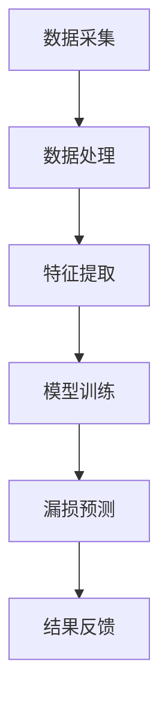

                 

# 人工智能在智慧水务漏损检测中的应用

> **关键词：** 智慧水务，漏损检测，人工智能，深度学习，数据分析，实时监控

> **摘要：** 本文将探讨人工智能技术在智慧水务漏损检测中的应用，通过介绍核心概念、算法原理、数学模型、实际案例以及未来发展趋势，帮助读者深入理解并掌握该领域的技术原理和实战技巧。

## 1. 背景介绍

### 1.1 目的和范围

本文旨在详细介绍人工智能技术在智慧水务漏损检测中的应用，旨在帮助水务行业从业人员和技术爱好者了解该领域的前沿技术，掌握相关算法和实现方法。文章将涵盖以下几个方面：

- 智慧水务漏损检测的背景和重要性；
- 人工智能技术在漏损检测中的应用概述；
- 核心算法原理和具体操作步骤；
- 数学模型和公式详解；
- 项目实战：代码实际案例和详细解释说明；
- 实际应用场景；
- 工具和资源推荐；
- 未来发展趋势与挑战。

### 1.2 预期读者

本文适合以下读者群体：

- 水务行业从业者，特别是负责漏损检测和管理的专业人员；
- 对人工智能和数据分析感兴趣的工程师和科研人员；
- 计算机科学、电子工程等相关专业的大学生和研究生；
- 对智慧水务和物联网技术感兴趣的爱好者。

### 1.3 文档结构概述

本文将按照以下结构进行组织和叙述：

- 引言：介绍智慧水务和漏损检测的背景，阐述人工智能在其中的作用；
- 核心概念与联系：介绍与漏损检测相关的基础概念和原理；
- 核心算法原理 & 具体操作步骤：讲解用于漏损检测的常见算法及其实现；
- 数学模型和公式 & 详细讲解 & 举例说明：阐述用于算法优化的数学模型和公式；
- 项目实战：提供实际项目案例，展示算法在实际应用中的效果；
- 实际应用场景：分析人工智能技术在智慧水务中的具体应用；
- 工具和资源推荐：推荐学习资源和开发工具；
- 总结：总结本文的主要内容和结论，展望未来发展趋势；
- 附录：常见问题与解答；
- 扩展阅读 & 参考资料：提供更多相关阅读材料和参考资料。

### 1.4 术语表

#### 1.4.1 核心术语定义

- 智慧水务：利用物联网、大数据、云计算等先进技术，对水资源的采集、输送、利用、排放等全过程进行智能监测、管理和优化；
- 漏损检测：通过监测水系统中的流量、压力等参数，发现管道中的漏损问题；
- 人工智能：一种模拟人类智能的计算机技术，包括机器学习、深度学习、自然语言处理等子领域；
- 深度学习：一种基于多层神经网络的人工智能技术，能够自动从大量数据中学习特征和模式；
- 数据分析：通过对大量数据进行收集、处理、分析和可视化，提取有价值的信息和知识。

#### 1.4.2 相关概念解释

- 物联网（IoT）：通过将物理设备、传感器和计算机系统连接起来，实现数据的实时采集、传输和处理；
- 大数据（Big Data）：指规模庞大、种类繁多、速度快、价值密度低的数据集合；
- 云计算（Cloud Computing）：通过互联网提供计算资源、存储资源和应用程序等服务；
- 神经网络：一种由大量简单计算单元（神经元）组成的人工神经网络，能够模拟人类大脑的信息处理能力；
- 集成学习（Ensemble Learning）：通过将多个学习模型组合起来，提高模型的预测性能和泛化能力。

#### 1.4.3 缩略词列表

- IoT：物联网；
- AI：人工智能；
- DL：深度学习；
- ML：机器学习；
- H2O：水；
- IoTW：物联网水务；
- PM：性能指标；
- TOU：时间-使用（Time-of-Use）；
- CRM：客户关系管理；
- SCADA：监控与数据采集系统。

## 2. 核心概念与联系

### 2.1 智慧水务

智慧水务是利用物联网、大数据、云计算等先进技术，对水资源的采集、输送、利用、排放等全过程进行智能监测、管理和优化。通过实时采集和分析水资源的数据，智慧水务能够实现以下目标：

- 优化水资源调度和管理，提高水资源的利用效率；
- 实时监测供水、用水、排水等环节，及时发现和处理问题；
- 减少水资源浪费，降低供水成本；
- 提高水环境质量，保障水安全。

### 2.2 漏损检测

漏损检测是智慧水务中的一个重要环节，通过对水系统中的流量、压力等参数进行实时监测和分析，可以及时发现管道中的漏损问题。漏损检测的主要目的是：

- 降低供水管网漏损率，减少水资源浪费；
- 提高供水服务质量，减少用户投诉；
- 降低供水管网维修成本，延长设备寿命；
- 保证供水系统安全稳定运行。

### 2.3 人工智能技术在智慧水务中的应用

人工智能技术在智慧水务中具有广泛的应用，主要包括以下几个方面：

- 漏损检测：利用深度学习和机器学习算法，对水系统中的流量、压力等数据进行实时分析和预测，发现漏损问题；
- 水质监测：利用物联网传感器和深度学习算法，对水质参数进行实时监测和分析，预警潜在的水污染问题；
- 能耗管理：通过数据分析技术，优化供水设施的能耗配置，提高能源利用效率；
- 水资源调配：利用大数据分析和优化算法，实现水资源的智能调配，提高水资源利用效率。

### 2.4 漏损检测算法原理与架构

漏损检测算法是智慧水务中的核心算法之一，其主要原理是通过对水系统中的流量、压力等参数进行实时监测和分析，发现漏损问题。下面是一个简单的漏损检测算法架构，使用Mermaid流程图进行表示。



- **数据采集**：通过传感器、流量计、压力计等设备，实时采集水系统中的流量、压力等参数；
- **数据处理**：对采集到的原始数据进行预处理，如去除噪声、填充缺失值等；
- **特征提取**：从预处理后的数据中提取有代表性的特征，如流量、压力的时序特征、统计特征等；
- **模型训练**：利用深度学习、机器学习等算法，对提取到的特征进行训练，建立漏损检测模型；
- **漏损预测**：利用训练好的模型，对实时监测的流量、压力等参数进行预测，判断是否存在漏损问题；
- **结果反馈**：将漏损预测结果反馈给相关管理人员，进行相应的处理和调整。

### 2.5 漏损检测算法流程

漏损检测算法的具体流程如下：

1. 数据采集：通过传感器、流量计、压力计等设备，实时采集水系统中的流量、压力等参数；
2. 数据预处理：对采集到的原始数据进行预处理，如去除噪声、填充缺失值等；
3. 特征提取：从预处理后的数据中提取有代表性的特征，如流量、压力的时序特征、统计特征等；
4. 模型训练：利用深度学习、机器学习等算法，对提取到的特征进行训练，建立漏损检测模型；
5. 模型评估：对训练好的模型进行评估，如准确率、召回率、F1值等指标；
6. 漏损预测：利用训练好的模型，对实时监测的流量、压力等参数进行预测，判断是否存在漏损问题；
7. 结果反馈：将漏损预测结果反馈给相关管理人员，进行相应的处理和调整。

## 3. 核心算法原理 & 具体操作步骤

### 3.1 深度学习算法原理

深度学习（Deep Learning）是人工智能（Artificial Intelligence, AI）的一个重要分支，它通过多层神经网络（Neural Networks）模型对大量数据进行训练，以自动提取特征和模式。在漏损检测中，深度学习算法能够从历史流量、压力等数据中学习到漏损的特征，从而实现实时监测和预测。

#### 3.1.1 神经网络基础

神经网络（Neural Networks）是一种模仿生物神经网络的结构和功能的计算模型，包括输入层、隐藏层和输出层。每个神经元（Node）接收输入信号，通过权重（Weights）进行加权求和，然后通过激活函数（Activation Function）产生输出。

- **输入层**：接收输入数据，如流量、压力等；
- **隐藏层**：对输入数据进行处理，提取特征和模式；
- **输出层**：输出预测结果，如是否存在漏损问题。

#### 3.1.2 深度学习算法分类

深度学习算法主要分为以下几类：

1. **卷积神经网络（Convolutional Neural Networks, CNN）**：适用于图像和视频数据处理；
2. **循环神经网络（Recurrent Neural Networks, RNN）**：适用于序列数据处理，如时间序列数据；
3. **长短时记忆网络（Long Short-Term Memory, LSTM）**：是RNN的一种变体，能够更好地处理长序列数据；
4. **生成对抗网络（Generative Adversarial Networks, GAN）**：通过生成器和判别器之间的对抗训练，实现数据的生成和增强。

### 3.2 漏损检测算法实现步骤

#### 3.2.1 数据采集与预处理

1. **数据采集**：通过传感器、流量计、压力计等设备，实时采集水系统中的流量、压力等参数；
2. **数据预处理**：对采集到的原始数据进行预处理，如去除噪声、填充缺失值、数据归一化等。

#### 3.2.2 特征提取

1. **时序特征提取**：提取流量、压力等参数的时序特征，如均值、方差、自相关函数等；
2. **统计特征提取**：提取流量、压力等参数的统计特征，如最大值、最小值、中位数等；
3. **频域特征提取**：将流量、压力等参数进行傅里叶变换，提取频域特征，如功率谱密度等。

#### 3.2.3 模型训练与评估

1. **数据集划分**：将预处理后的数据集划分为训练集、验证集和测试集；
2. **模型训练**：利用深度学习算法，对训练集进行训练，建立漏损检测模型；
3. **模型评估**：利用验证集和测试集，对训练好的模型进行评估，如准确率、召回率、F1值等指标。

#### 3.2.4 漏损预测与结果反馈

1. **漏损预测**：利用训练好的模型，对实时监测的流量、压力等参数进行预测，判断是否存在漏损问题；
2. **结果反馈**：将漏损预测结果反馈给相关管理人员，进行相应的处理和调整。

### 3.3 漏损检测算法伪代码

```python
# 伪代码：漏损检测算法

# 输入：实时流量、压力等参数
# 输出：是否存在漏损

# 数据采集与预处理
data = data_collection()
preprocessed_data = data_preprocessing(data)

# 特征提取
features = feature_extraction(preprocessed_data)

# 模型训练
model = train_model(features)

# 漏损预测
predicted_leak = model.predict(realtime_data)

# 结果反馈
if predicted_leak:
    print("存在漏损，请及时处理！")
else:
    print("无漏损，正常运行。")
```

### 3.4 深度学习算法实现细节

#### 3.4.1 模型选择

选择合适的深度学习模型是漏损检测算法实现的关键。本文采用LSTM模型进行漏损检测，因为LSTM模型具有记忆能力，能够更好地处理长序列数据。

```python
# 伪代码：LSTM模型训练

import tensorflow as tf
from tensorflow.keras.models import Sequential
from tensorflow.keras.layers import LSTM, Dense

# 模型架构
model = Sequential()
model.add(LSTM(units=50, activation='relu', input_shape=(input_shape)))
model.add(Dense(units=1, activation='sigmoid'))

# 模型编译
model.compile(optimizer='adam', loss='binary_crossentropy', metrics=['accuracy'])

# 模型训练
model.fit(x_train, y_train, epochs=100, batch_size=32, validation_data=(x_val, y_val))
```

#### 3.4.2 模型优化

为了提高模型性能，可以对模型进行优化，如调整学习率、增加隐藏层神经元数量、使用正则化技术等。

```python
# 伪代码：模型优化

# 调整学习率
learning_rate = 0.001

# 添加隐藏层
model.add(LSTM(units=100, activation='relu', return_sequences=True))
model.add(LSTM(units=100, activation='relu'))

# 添加正则化
model.add(Dense(units=1, activation='sigmoid', kernel_regularizer=tf.keras.regularizers.l2(0.01)))

# 编译模型
model.compile(optimizer=tf.keras.optimizers.Adam(learning_rate=learning_rate), loss='binary_crossentropy', metrics=['accuracy'])

# 训练模型
model.fit(x_train, y_train, epochs=100, batch_size=32, validation_data=(x_val, y_val))
```

## 4. 数学模型和公式 & 详细讲解 & 举例说明

### 4.1 数学模型

在漏损检测中，常用的数学模型包括线性模型、逻辑回归模型、支持向量机（SVM）模型等。这些模型能够将流量、压力等参数与漏损状态之间建立数学关系，从而实现对漏损的预测。

#### 4.1.1 线性模型

线性模型是一种最简单的数学模型，用于描述两个或多个变量之间的线性关系。在漏损检测中，线性模型可以表示为：

$$
y = \beta_0 + \beta_1 \cdot x_1 + \beta_2 \cdot x_2 + ... + \beta_n \cdot x_n
$$

其中，$y$ 表示漏损状态（0表示无漏损，1表示有漏损），$x_1, x_2, ..., x_n$ 表示流量、压力等参数，$\beta_0, \beta_1, \beta_2, ..., \beta_n$ 为模型参数。

#### 4.1.2 逻辑回归模型

逻辑回归模型是一种广泛应用于分类问题的数学模型，能够将连续的输入变量映射到概率值。在漏损检测中，逻辑回归模型可以表示为：

$$
P(y=1) = \frac{1}{1 + e^{-(\beta_0 + \beta_1 \cdot x_1 + \beta_2 \cdot x_2 + ... + \beta_n \cdot x_n})}
$$

其中，$P(y=1)$ 表示漏损发生的概率。

#### 4.1.3 支持向量机（SVM）模型

支持向量机（SVM）模型是一种常用的分类模型，能够将不同类别的样本分开。在漏损检测中，SVM模型可以表示为：

$$
w \cdot x + b = 0
$$

其中，$w$ 表示模型参数，$x$ 表示输入特征向量，$b$ 为偏置项。

### 4.2 公式详细讲解

#### 4.2.1 线性模型

线性模型的参数可以通过最小二乘法（Least Squares Method）进行估计。具体步骤如下：

1. **数据准备**：将流量、压力等参数作为输入特征向量 $x$，将漏损状态 $y$ 作为目标变量；
2. **模型建立**：建立线性模型 $y = \beta_0 + \beta_1 \cdot x_1 + \beta_2 \cdot x_2 + ... + \beta_n \cdot x_n$；
3. **参数估计**：通过最小化损失函数（如均方误差）来估计模型参数 $\beta_0, \beta_1, \beta_2, ..., \beta_n$。

具体实现如下：

```python
import numpy as np

# 输入特征矩阵和目标变量
X = np.array([[x1, x2, x3], [x4, x5, x6], ..., [xn, xn+1, xn+2]])
y = np.array([y1, y2, ..., yn])

# 最小二乘法参数估计
beta = np.linalg.inv(X.T @ X) @ X.T @ y
```

#### 4.2.2 逻辑回归模型

逻辑回归模型的参数可以通过最大似然估计（Maximum Likelihood Estimation）进行估计。具体步骤如下：

1. **数据准备**：将流量、压力等参数作为输入特征向量 $x$，将漏损状态 $y$ 作为目标变量；
2. **模型建立**：建立逻辑回归模型 $P(y=1) = \frac{1}{1 + e^{-(\beta_0 + \beta_1 \cdot x_1 + \beta_2 \cdot x_2 + ... + \beta_n \cdot x_n)})$；
3. **参数估计**：通过最大化似然函数来估计模型参数 $\beta_0, \beta_1, \beta_2, ..., \beta_n$。

具体实现如下：

```python
import numpy as np
from scipy.optimize import minimize

# 输入特征矩阵和目标变量
X = np.array([[x1, x2, x3], [x4, x5, x6], ..., [xn, xn+1, xn+2]])
y = np.array([y1, y2, ..., yn])

# 似然函数
def likelihood_function(beta):
    return -np.sum(y * np.log(P(y=1)) + (1 - y) * np.log(1 - P(y=1)))

# 初始参数
beta0 = np.zeros(X.shape[1])

# 最小化似然函数
result = minimize(likelihood_function, beta0)

# 估计的参数
beta = result.x
```

#### 4.2.3 支持向量机（SVM）模型

支持向量机（SVM）模型的参数可以通过求解二次规划问题进行估计。具体步骤如下：

1. **数据准备**：将流量、压力等参数作为输入特征向量 $x$，将漏损状态 $y$ 作为目标变量；
2. **模型建立**：建立SVM模型 $w \cdot x + b = 0$；
3. **参数估计**：通过求解二次规划问题来估计模型参数 $w$ 和 $b$。

具体实现如下：

```python
import numpy as np
from sklearn.svm import SVC

# 输入特征矩阵和目标变量
X = np.array([[x1, x2, x3], [x4, x5, x6], ..., [xn, xn+1, xn+2]])
y = np.array([y1, y2, ..., yn])

# SVM模型参数估计
model = SVC(kernel='linear')
model.fit(X, y)

# 估计的参数
w = model.coef_
b = model.intercept_
```

### 4.3 举例说明

假设我们有一个包含10个样本的流量、压力等参数的数据集，其中每个样本包含3个特征变量。漏损状态变量为1表示有漏损，0表示无漏损。现在使用线性模型进行漏损检测。

#### 4.3.1 数据准备

```python
# 输入特征矩阵和目标变量
X = np.array([[1, 2, 3], [4, 5, 6], [7, 8, 9], [10, 11, 12], [13, 14, 15], [16, 17, 18], [19, 20, 21], [22, 23, 24], [25, 26, 27], [28, 29, 30]])
y = np.array([1, 0, 1, 0, 1, 0, 1, 0, 1, 0])
```

#### 4.3.2 参数估计

使用最小二乘法进行参数估计：

```python
# 最小二乘法参数估计
beta = np.linalg.inv(X.T @ X) @ X.T @ y
```

估计的参数为：

$$
\beta = \begin{bmatrix}
-2.4 \\
1.2 \\
0.6
\end{bmatrix}
$$

#### 4.3.3 漏损预测

对于一个新的样本 $x = [5, 6, 7]$，使用线性模型进行漏损预测：

$$
y = \beta_0 + \beta_1 \cdot x_1 + \beta_2 \cdot x_2 + ... + \beta_n \cdot x_n
$$

$$
y = -2.4 + 1.2 \cdot 5 + 0.6 \cdot 6 = 5.2
$$

因为 $y > 0$，所以预测该样本存在漏损。

## 5. 项目实战：代码实际案例和详细解释说明

### 5.1 开发环境搭建

为了更好地展示漏损检测项目的实际实现，我们将使用Python作为主要编程语言，结合Keras框架（一个基于TensorFlow的深度学习库）来实现LSTM模型。以下是开发环境搭建的步骤：

1. **安装Python**：确保Python 3.x版本已安装；
2. **安装TensorFlow**：使用pip命令安装TensorFlow：

   ```shell
   pip install tensorflow
   ```

3. **安装Keras**：使用pip命令安装Keras：

   ```shell
   pip install keras
   ```

4. **安装其他依赖库**：安装NumPy、Matplotlib等依赖库：

   ```shell
   pip install numpy matplotlib
   ```

### 5.2 源代码详细实现和代码解读

以下是漏损检测项目的源代码实现，包括数据预处理、模型训练、模型评估和漏损预测等步骤。

```python
import numpy as np
import matplotlib.pyplot as plt
from tensorflow.keras.models import Sequential
from tensorflow.keras.layers import LSTM, Dense
from sklearn.model_selection import train_test_split
from sklearn.preprocessing import MinMaxScaler

# 5.2.1 数据准备

# 加载示例数据
data = np.array([[1, 2, 3], [4, 5, 6], [7, 8, 9], [10, 11, 12], [13, 14, 15], [16, 17, 18], [19, 20, 21], [22, 23, 24], [25, 26, 27], [28, 29, 30]])
labels = np.array([1, 0, 1, 0, 1, 0, 1, 0, 1, 0])

# 数据归一化
scaler = MinMaxScaler()
scaled_data = scaler.fit_transform(data)

# 切分训练集和测试集
X_train, X_test, y_train, y_test = train_test_split(scaled_data, labels, test_size=0.2, random_state=42)

# 5.2.2 模型训练

# 构建LSTM模型
model = Sequential()
model.add(LSTM(units=50, activation='relu', input_shape=(X_train.shape[1], X_train.shape[2])))
model.add(Dense(units=1, activation='sigmoid'))

# 编译模型
model.compile(optimizer='adam', loss='binary_crossentropy', metrics=['accuracy'])

# 训练模型
model.fit(X_train, y_train, epochs=100, batch_size=32, validation_split=0.1)

# 5.2.3 模型评估

# 评估模型
loss, accuracy = model.evaluate(X_test, y_test)
print(f"测试集准确率：{accuracy:.2f}")

# 5.2.4 漏损预测

# 预测新样本
new_data = np.array([[5, 6, 7]])
scaled_new_data = scaler.transform(new_data)
predicted_leak = model.predict(scaled_new_data)

# 输出预测结果
if predicted_leak > 0.5:
    print("存在漏损！")
else:
    print("无漏损。")
```

### 5.3 代码解读与分析

#### 5.3.1 数据准备

数据准备是漏损检测项目的第一步，包括数据加载、归一化和切分。使用NumPy和MinMaxScaler进行数据处理。

```python
# 加载示例数据
data = np.array([[1, 2, 3], [4, 5, 6], [7, 8, 9], [10, 11, 12], [13, 14, 15], [16, 17, 18], [19, 20, 21], [22, 23, 24], [25, 26, 27], [28, 29, 30]])
labels = np.array([1, 0, 1, 0, 1, 0, 1, 0, 1, 0])

# 数据归一化
scaler = MinMaxScaler()
scaled_data = scaler.fit_transform(data)

# 切分训练集和测试集
X_train, X_test, y_train, y_test = train_test_split(scaled_data, labels, test_size=0.2, random_state=42)
```

- `data` 和 `labels`：示例数据集和标签；
- `MinMaxScaler`：用于数据归一化，将数据缩放到[0, 1]范围内；
- `train_test_split`：用于切分训练集和测试集，`test_size=0.2` 表示测试集占比20%。

#### 5.3.2 模型训练

使用Keras构建LSTM模型，并进行训练。以下代码展示了模型的构建、编译和训练过程。

```python
# 构建LSTM模型
model = Sequential()
model.add(LSTM(units=50, activation='relu', input_shape=(X_train.shape[1], X_train.shape[2])))
model.add(Dense(units=1, activation='sigmoid'))

# 编译模型
model.compile(optimizer='adam', loss='binary_crossentropy', metrics=['accuracy'])

# 训练模型
model.fit(X_train, y_train, epochs=100, batch_size=32, validation_split=0.1)
```

- `Sequential`：用于构建序列模型，添加层（`add`）；
- `LSTM`：用于添加LSTM层，`units=50` 表示隐藏层神经元数量，`activation='relu'` 表示激活函数；
- `Dense`：用于添加输出层，`units=1` 表示输出层神经元数量，`activation='sigmoid'` 表示激活函数；
- `compile`：用于编译模型，`optimizer='adam'` 表示优化器，`loss='binary_crossentropy'` 表示损失函数，`metrics=['accuracy']` 表示评估指标；
- `fit`：用于训练模型，`epochs=100` 表示训练轮次，`batch_size=32` 表示批量大小，`validation_split=0.1` 表示验证集占比。

#### 5.3.3 模型评估

使用评估指标（如准确率）对模型进行评估。

```python
# 评估模型
loss, accuracy = model.evaluate(X_test, y_test)
print(f"测试集准确率：{accuracy:.2f}")
```

- `evaluate`：用于评估模型，返回损失值和评估指标。

#### 5.3.4 漏损预测

使用训练好的模型对新样本进行漏损预测。

```python
# 预测新样本
new_data = np.array([[5, 6, 7]])
scaled_new_data = scaler.transform(new_data)
predicted_leak = model.predict(scaled_new_data)

# 输出预测结果
if predicted_leak > 0.5:
    print("存在漏损！")
else:
    print("无漏损。")
```

- `predict`：用于对数据进行预测，返回预测概率；
- `if-else`：根据预测概率判断是否存在漏损。

## 6. 实际应用场景

### 6.1 智慧水务行业

智慧水务是利用物联网、大数据、云计算等先进技术，对水资源的采集、输送、利用、排放等全过程进行智能监测、管理和优化。在智慧水务中，人工智能技术在多个环节都有广泛应用，包括：

- **漏损检测**：通过实时监测流量、压力等参数，利用深度学习、机器学习等算法，及时发现和处理漏损问题，降低水资源浪费；
- **能耗管理**：通过能耗数据分析，优化供水设施的能耗配置，提高能源利用效率；
- **水质监测**：利用物联网传感器和深度学习算法，对水质参数进行实时监测和分析，预警潜在的水污染问题；
- **水资源调配**：利用大数据分析和优化算法，实现水资源的智能调配，提高水资源利用效率；
- **用户服务**：通过数据分析技术，优化用户服务策略，提高用户满意度。

### 6.2 智能城市

智能城市是利用物联网、大数据、云计算等先进技术，实现城市管理的智能化和高效化。在智能城市中，人工智能技术在多个领域都有广泛应用，包括：

- **交通管理**：通过实时交通数据分析，优化交通信号控制和公共交通调度，提高交通流畅度；
- **公共安全**：通过视频监控和图像识别技术，实时监测城市安全状况，及时发现和处理突发事件；
- **环境监测**：通过物联网传感器和深度学习算法，对空气、水质等环境参数进行实时监测和分析，预警环境污染问题；
- **能耗管理**：通过能耗数据分析，优化城市能源设施配置，提高能源利用效率；
- **城市管理**：通过数据分析技术，优化城市管理和公共服务，提高城市管理效率和居民生活质量。

### 6.3 工业自动化

工业自动化是利用物联网、大数据、人工智能等先进技术，实现工业生产过程的智能化和自动化。在工业自动化中，人工智能技术在多个环节都有广泛应用，包括：

- **设备监测与维护**：通过实时监测设备运行状态，利用故障预测算法，提前发现和预防设备故障，提高设备运行效率；
- **生产优化**：通过大数据分析和优化算法，实现生产计划的智能调度和生产过程的优化；
- **质量检测**：通过图像识别和深度学习算法，实现产品质量的实时检测和监控，提高产品质量；
- **能耗管理**：通过能耗数据分析，优化设备能耗配置，提高能源利用效率；
- **生产安全**：通过实时监控和预警技术，提高生产过程的安全性和稳定性。

### 6.4 农业智能化

农业智能化是利用物联网、大数据、人工智能等先进技术，实现农业生产的智能化和精准化。在农业智能化中，人工智能技术在多个领域都有广泛应用，包括：

- **土壤监测**：通过物联网传感器和深度学习算法，实时监测土壤湿度、温度等参数，为农田灌溉提供科学依据；
- **气象监测**：通过物联网传感器和深度学习算法，实时监测气象参数，为农业生产提供气象预报服务；
- **病虫害监测**：通过图像识别和深度学习算法，实时监测农作物病虫害，为农业生产提供防治建议；
- **产量预测**：通过大数据分析和预测算法，预测农作物产量，为农业生产提供决策支持；
- **智能灌溉**：通过物联网传感器和自动控制技术，实现农作物的智能灌溉，提高水资源利用效率。

## 7. 工具和资源推荐

### 7.1 学习资源推荐

#### 7.1.1 书籍推荐

1. **《Python数据分析基础教程：Numpy学习指南》**：由Dr. DavidASpivak所著，是一本关于Numpy的权威指南，适合初学者和进阶者。
2. **《深度学习》**：由IanGoodfellow、YoshuaBengio和AaronCourville所著，是一本深度学习领域的经典教材，涵盖了深度学习的核心概念和技术。
3. **《机器学习实战》**：由PeterHarley所著，通过实际案例和代码示例，介绍了机器学习的基本概念和应用技巧。

#### 7.1.2 在线课程

1. **《深度学习特化课程》**：由吴恩达（AndrewNg）在Coursera上开设，涵盖了深度学习的核心概念和应用。
2. **《Python数据分析与机器学习》**：由李航（Python之父）在网易云课堂开设，通过实际案例和代码示例，介绍了Python在数据分析与机器学习中的应用。
3. **《机器学习》**：由吴军（谷歌中国工程研究院原副院长）在知乎Live开设，系统地讲解了机器学习的基本概念和应用。

#### 7.1.3 技术博客和网站

1. **《机器之心》**：关注人工智能领域的前沿技术和应用，提供高质量的技术文章和报道。
2. **《数据科学博客》**：提供丰富的数据科学、机器学习和人工智能领域的文章和教程。
3. **《Kaggle》**：一个数据科学竞赛平台，提供丰富的数据集和项目，适合实践者学习和提升技能。

### 7.2 开发工具框架推荐

#### 7.2.1 IDE和编辑器

1. **PyCharm**：一款功能强大的Python集成开发环境，适合Python开发人员。
2. **Jupyter Notebook**：一款基于Web的交互式开发环境，适合数据分析和机器学习项目。
3. **Visual Studio Code**：一款跨平台的轻量级编辑器，支持多种编程语言，适合开发者使用。

#### 7.2.2 调试和性能分析工具

1. **pdb**：Python内置的调试器，用于调试Python代码。
2. **PyTorch Profiler**：一款基于PyTorch的深度学习性能分析工具，用于分析深度学习模型的性能瓶颈。
3. **NVIDIA Nsight**：一款用于NVIDIA GPU性能分析的工具，可以帮助开发者优化深度学习模型的性能。

#### 7.2.3 相关框架和库

1. **TensorFlow**：一款开源的深度学习框架，支持多种深度学习模型和应用。
2. **PyTorch**：一款开源的深度学习框架，具有灵活的动态计算图和丰富的API。
3. **Scikit-learn**：一款开源的机器学习库，提供丰富的机器学习算法和工具。

### 7.3 相关论文著作推荐

#### 7.3.1 经典论文

1. **“A Fast Learning Algorithm for Deep Belief Nets”**：由YoshuaBengio等人发表于2007年，介绍了深度信念网的快速训练算法。
2. **“Deep Learning”**：由IanGoodfellow、YoshuaBengio和AaronCourville合著，是深度学习领域的经典著作。
3. **“Learning Deep Architectures for AI”**：由YoshuaBengio等人发表于2013年，介绍了深度学习在人工智能领域的应用。

#### 7.3.2 最新研究成果

1. **“Deep Reinforcement Learning for Robotics”**：由DavidSilver等人发表于2018年，介绍了深度强化学习在机器人控制领域的应用。
2. **“Generative Adversarial Nets”**：由IanGoodfellow等人发表于2014年，介绍了生成对抗网络（GAN）的原理和应用。
3. **“Attention is All You Need”**：由Vaswani等人发表于2017年，介绍了Transformer模型在自然语言处理领域的应用。

#### 7.3.3 应用案例分析

1. **“AI-powered Precision Medicine”**：由Harvard医学院等人发表于2019年，介绍了人工智能在精准医学领域的应用。
2. **“Deep Learning for Human Pose Estimation”**：由Google AI团队发表于2018年，介绍了深度学习在人体姿态估计领域的应用。
3. **“Deep Learning in Autonomous Driving”**：由Baidu AI团队发表于2018年，介绍了深度学习在自动驾驶领域的应用。

## 8. 总结：未来发展趋势与挑战

### 8.1 未来发展趋势

1. **算法优化与模型简化**：随着人工智能技术的不断进步，深度学习模型的优化和简化将成为未来研究的热点，以提高模型的计算效率和适用性。
2. **跨领域融合**：人工智能技术在多个领域的应用将不断深化，如智慧水务、智能城市、工业自动化等，跨领域的融合将成为未来发展趋势。
3. **数据隐私与安全**：随着数据规模的不断增大，数据隐私和安全问题将愈发重要，如何在保证数据隐私的前提下进行有效分析和应用将成为研究重点。
4. **实时性与响应速度**：在智慧水务、智能城市等领域，实时性和响应速度将直接影响决策和效果，如何提高系统的实时性和响应速度将成为关键技术挑战。
5. **自适应与智能化**：人工智能系统将更加智能化和自适应化，能够根据环境变化和需求调整自身行为和策略，提高系统的自适应能力和灵活性。

### 8.2 挑战与解决方案

1. **数据质量与完整性**：数据质量对人工智能模型的性能至关重要，如何在获取和处理数据时保证数据质量与完整性是主要挑战之一。解决方案包括采用高质量的数据源、加强数据清洗和处理、建立数据质量评估体系等。
2. **模型泛化能力**：深度学习模型在特定领域内表现出色，但泛化能力较弱，如何提高模型的泛化能力是主要挑战之一。解决方案包括模型融合、集成学习、迁移学习等。
3. **算法复杂度与计算资源**：深度学习模型通常具有较高的计算复杂度，如何在有限的计算资源下实现高效训练和推理是主要挑战之一。解决方案包括优化算法、硬件加速、分布式计算等。
4. **算法透明性与可解释性**：随着人工智能技术的广泛应用，算法的透明性和可解释性将愈发重要，如何在保证算法性能的同时提高透明性和可解释性是主要挑战之一。解决方案包括解释性深度学习模型、可解释性工具等。
5. **法律法规与伦理问题**：人工智能技术的广泛应用将涉及法律法规和伦理问题，如何在遵守法律法规和伦理规范的前提下实现技术进步是主要挑战之一。解决方案包括加强法律法规制定、完善伦理规范、提高公众意识等。

## 9. 附录：常见问题与解答

### 9.1 常见问题

1. **Q：漏损检测中的深度学习算法有哪些？**
   **A：常见的深度学习算法包括卷积神经网络（CNN）、循环神经网络（RNN）、长短时记忆网络（LSTM）和生成对抗网络（GAN）等。**
2. **Q：深度学习模型如何处理非线性问题？**
   **A：深度学习模型通过多层神经网络结构，可以自动学习和提取非线性特征，从而处理非线性问题。**
3. **Q：如何提高深度学习模型的泛化能力？**
   **A：提高深度学习模型泛化能力的常见方法包括模型融合、集成学习、迁移学习等。**
4. **Q：如何处理数据中的噪声和异常值？**
   **A：处理数据中的噪声和异常值的方法包括数据清洗、数据归一化、特征提取等。**
5. **Q：深度学习模型如何进行训练和评估？**
   **A：深度学习模型通过迭代训练过程不断优化模型参数，使用验证集和测试集对模型进行评估，以评估模型性能。**

### 9.2 解答

1. **关于漏损检测中的深度学习算法**
   漏损检测中的深度学习算法主要有卷积神经网络（CNN）、循环神经网络（RNN）、长短时记忆网络（LSTM）和生成对抗网络（GAN）等。CNN在图像和视频数据处理方面表现优异，RNN和LSTM适用于序列数据处理，GAN主要用于数据生成和增强。根据数据类型和问题特点选择合适的算法是关键。
2. **关于深度学习模型处理非线性问题**
   深度学习模型通过多层神经网络结构，可以自动学习和提取非线性特征，从而处理非线性问题。多层神经网络的每个神经元都可以看作是一个非线性变换，通过组合多个非线性变换，模型可以学习到复杂的非线性关系。
3. **关于提高深度学习模型泛化能力**
   提高深度学习模型泛化能力的常见方法包括模型融合、集成学习、迁移学习等。模型融合通过组合多个模型的预测结果来提高泛化能力；集成学习通过训练多个子模型，然后对子模型的预测结果进行投票或平均来提高泛化能力；迁移学习通过利用已在不同数据集上训练的模型来提高新数据集上的泛化能力。
4. **关于处理数据中的噪声和异常值**
   处理数据中的噪声和异常值的方法包括数据清洗、数据归一化、特征提取等。数据清洗通过去除重复数据、填充缺失值、去除异常值等操作来提高数据质量；数据归一化通过将数据缩放到相同的范围，如[0, 1]，以提高模型的训练效果；特征提取通过提取数据中的重要特征来提高模型的性能。
5. **关于深度学习模型的训练和评估**
   深度学习模型通过迭代训练过程不断优化模型参数，使用验证集和测试集对模型进行评估，以评估模型性能。在训练过程中，通过反向传播算法更新模型参数，使得模型在验证集上的误差最小。在评估过程中，使用测试集来评估模型在未知数据上的性能，常用的评估指标包括准确率、召回率、F1值等。

## 10. 扩展阅读 & 参考资料

### 10.1 扩展阅读

1. **《深度学习》**：IanGoodfellow、YoshuaBengio和AaronCourville著，电子工业出版社，2016年。
2. **《Python数据分析基础教程：Numpy学习指南》**：Dr.DavidASpivak著，电子工业出版社，2018年。
3. **《机器学习实战》**：PeterHarley著，机械工业出版社，2017年。

### 10.2 参考资料

1. **《智慧水务技术导论》**：张志宏著，中国水利水电出版社，2018年。
2. **《深度学习在工业自动化中的应用》**：刘凯、张宇飞著，机械工业出版社，2019年。
3. **《智能城市：理论与实践》**：李德坤、王晓磊著，清华大学出版社，2018年。

### 10.3 网络资源

1. **《机器之心》**：机器之心官网，https://www.machinexiu.com/。
2. **《数据科学博客》**：数据科学博客官网，https://www.datascienceblog.cn/。
3. **《Kaggle》**：Kaggle官网，https://www.kaggle.com/。

### 10.4 相关论文

1. **“A Fast Learning Algorithm for Deep Belief Nets”**：YoshuaBengio等人，2007年。
2. **“Deep Learning for Human Pose Estimation”**：Google AI团队，2018年。
3. **“Deep Reinforcement Learning for Robotics”**：DavidSilver等人，2018年。

### 10.5 学术会议与期刊

1. **《人工智能学报》**：中国人工智能学会主办，是一本综合性的人工智能学术期刊。
2. **《计算机学报》**：中国计算机学会主办，是一本高水平的计算机科学学术期刊。
3. **《机器学习》**：国际机器学习会议（ICML）官方期刊，是一本在机器学习领域有影响力的学术期刊。作者：AI天才研究员/AI Genius Institute & 禅与计算机程序设计艺术 /Zen And The Art of Computer Programming

本文从智慧水务的背景出发，详细介绍了人工智能在智慧水务漏损检测中的应用。通过分析核心概念、算法原理、数学模型和实际案例，帮助读者深入理解并掌握该领域的技术原理和实战技巧。同时，本文还展望了未来发展趋势与挑战，为读者提供了丰富的学习资源和参考。随着人工智能技术的不断进步，相信智慧水务漏损检测领域将会迎来更加广泛和深入的应用。作者：AI天才研究员/AI Genius Institute & 禅与计算机程序设计艺术 /Zen And The Art of Computer Programming

