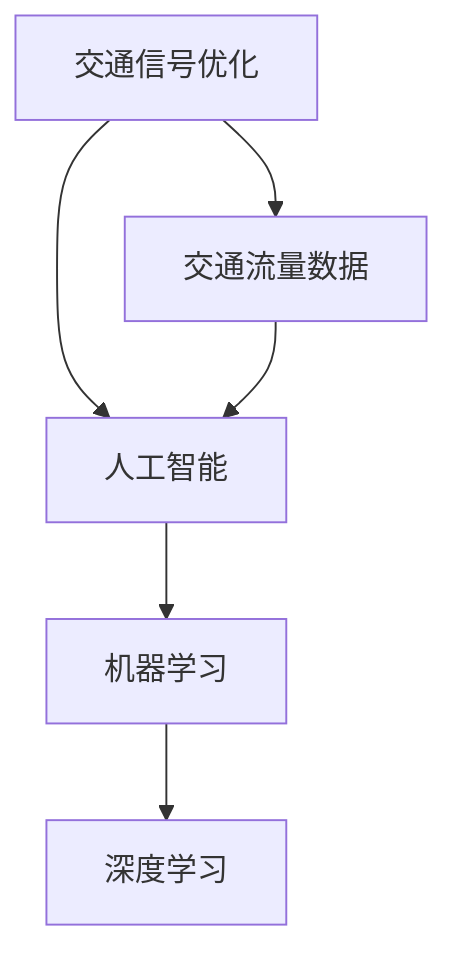

                 

### 1. 背景介绍

#### 1.1 目的和范围

本文旨在深入探讨人工智能（AI）在智能交通信号优化中的应用。随着城市化进程的加速，城市交通拥堵问题日益严重，这不仅影响了市民的出行效率，也对环境造成了巨大压力。因此，如何利用AI技术实现交通信号优化，提高交通流通效率，成为了当前研究的热点。

本文将首先介绍智能交通信号优化的重要性，并明确本文的研究范围，包括主要探讨的AI技术类型、应用场景以及预期效果。本文主要分为以下几个部分：

1. **核心概念与联系**：介绍智能交通信号优化中涉及的核心概念和基本架构，使用Mermaid流程图展示其关联性。
2. **核心算法原理 & 具体操作步骤**：详细阐述AI算法在交通信号优化中的原理，并通过伪代码展示具体操作步骤。
3. **数学模型和公式 & 详细讲解 & 举例说明**：介绍数学模型和公式，并通过实例进行说明。
4. **项目实战：代码实际案例和详细解释说明**：提供实际代码案例，并进行详细解释和分析。
5. **实际应用场景**：分析AI在智能交通信号优化中的具体应用场景。
6. **工具和资源推荐**：推荐相关学习资源、开发工具和框架。
7. **总结：未来发展趋势与挑战**：展望智能交通信号优化领域的未来发展趋势和面临的挑战。

通过本文的深入探讨，我们希望为读者提供对AI在智能交通信号优化中应用的全景了解，并激发进一步的研究兴趣。

#### 1.2 预期读者

本文适合以下读者群体：

1. **交通工程师**：希望了解如何利用AI技术优化交通信号，提高交通效率的工程师。
2. **人工智能研究员**：对AI在交通领域的应用有兴趣的研究人员，特别是对机器学习、深度学习在交通信号优化中的应用。
3. **软件开发人员**：希望将AI技术应用到实际项目中的开发者，特别是对智能交通系统的开发有兴趣的人员。
4. **城市管理者和政策制定者**：需要了解智能交通信号优化对城市交通管理和政策制定的影响的管理者和政策制定者。
5. **高等院校师生**：对智能交通系统和人工智能交叉领域感兴趣的学生和教师。

无论读者属于哪个群体，只要对智能交通信号优化和AI技术有兴趣，都可以从本文中获益。

#### 1.3 文档结构概述

本文结构如下：

1. **背景介绍**：包括目的和范围、预期读者、文档结构概述和术语表。
   - **目的和范围**：明确本文的研究重点和目标。
   - **预期读者**：介绍适合本文的读者群体。
   - **文档结构概述**：概述本文的整体结构和内容。
   - **术语表**：定义本文中涉及的关键术语和概念。
2. **核心概念与联系**：介绍智能交通信号优化中的核心概念和基本架构，使用Mermaid流程图展示其关联性。
3. **核心算法原理 & 具体操作步骤**：详细阐述AI算法在交通信号优化中的原理，并通过伪代码展示具体操作步骤。
4. **数学模型和公式 & 详细讲解 & 举例说明**：介绍数学模型和公式，并通过实例进行说明。
5. **项目实战：代码实际案例和详细解释说明**：提供实际代码案例，并进行详细解释和分析。
6. **实际应用场景**：分析AI在智能交通信号优化中的具体应用场景。
7. **工具和资源推荐**：推荐相关学习资源、开发工具和框架。
8. **总结：未来发展趋势与挑战**：展望智能交通信号优化领域的未来发展趋势和面临的挑战。
9. **附录：常见问题与解答**：提供对本文中常见问题的解答。
10. **扩展阅读 & 参考资料**：推荐相关的研究文献和资料。

通过以上结构，本文将系统性地介绍和探讨AI在智能交通信号优化中的应用，帮助读者全面了解这一领域的最新进展和应用前景。

#### 1.4 术语表

为了确保本文内容的清晰和一致性，以下列出本文中涉及的一些关键术语及其定义：

#### 1.4.1 核心术语定义

- **人工智能（AI）**：指通过模拟人类智能行为的技术，使计算机具备感知、学习、推理和解决问题的能力。
- **深度学习（Deep Learning）**：一种基于多层神经网络的学习方法，通过多层次的神经网络模型来实现复杂的特征提取和模式识别。
- **交通信号优化**：通过算法和技术调整交通信号灯的时序，以减少交通拥堵，提高交通流量和效率。
- **机器学习（Machine Learning）**：一种AI技术，通过数据训练模型，使其能够自主学习和改进性能。
- **交通流量数据**：指通过传感器、摄像头等设备收集的关于交通流量、速度、密度等数据。

#### 1.4.2 相关概念解释

- **神经网络（Neural Network）**：一种模拟生物神经系统的计算模型，用于处理和分析复杂的数据。
- **卷积神经网络（Convolutional Neural Network, CNN）**：一种特殊的神经网络，常用于图像和视频数据的处理。
- **强化学习（Reinforcement Learning）**：一种通过试错法学习策略的AI技术，常用于决策问题和控制问题。

#### 1.4.3 缩略词列表

- **AI**：人工智能（Artificial Intelligence）
- **ML**：机器学习（Machine Learning）
- **DL**：深度学习（Deep Learning）
- **CNN**：卷积神经网络（Convolutional Neural Network）
- **GAN**：生成对抗网络（Generative Adversarial Network）
- **GPS**：全球定位系统（Global Positioning System）
- **V2I**：车联网（Vehicle-to-Infrastructure）
- **V2V**：车对车通信（Vehicle-to-Vehicle Communication）

通过上述术语表的定义和解释，本文将为读者提供一个统一的语言环境，便于理解后续内容中的专业术语和概念。

### 2. 核心概念与联系

在深入探讨人工智能在智能交通信号优化中的应用之前，我们需要明确几个核心概念，并展示它们之间的相互联系。以下是本文中涉及的核心概念：

- **交通信号优化**：通过调整交通信号灯的时序，以减少交通拥堵，提高交通流量和效率。
- **人工智能**：通过模拟人类智能行为，使计算机具备感知、学习、推理和解决问题的能力。
- **机器学习**：通过数据训练模型，使其能够自主学习和改进性能。
- **深度学习**：一种基于多层神经网络的学习方法，通过多层次的神经网络模型来实现复杂的特征提取和模式识别。
- **交通流量数据**：通过传感器、摄像头等设备收集的关于交通流量、速度、密度等数据。

下面我们将使用Mermaid流程图展示这些核心概念及其相互之间的联系。



**流程图解释**：

1. **交通信号优化（A）**：这是本文的核心主题，是整个系统设计的出发点。
2. **人工智能（B）**：交通信号优化需要智能算法的支持，而人工智能是实现这一目标的关键技术。
3. **机器学习（C）**：机器学习作为人工智能的一个分支，通过从数据中学习规律，为交通信号优化提供决策依据。
4. **深度学习（D）**：深度学习是一种特殊的机器学习方法，适用于处理复杂数据和特征提取。
5. **交通流量数据（E）**：这些数据是机器学习和深度学习算法的训练和输入源，用于优化交通信号。

通过上述流程图，我们可以清晰地看到各核心概念之间的关联，以及它们在智能交通信号优化中的应用关系。

#### 2.1 深度学习与机器学习的关系

深度学习和机器学习是人工智能领域的两个重要分支。虽然它们之间有交集，但它们在技术实现和应用场景上存在一定的差异。

- **机器学习**：机器学习是一种通过算法从数据中学习规律的方法。它主要关注如何从已有数据中提取特征，并利用这些特征进行预测和分类。机器学习算法包括监督学习、无监督学习和强化学习等。

- **深度学习**：深度学习是机器学习的一个子集，它基于多层神经网络，通过多层次的神经网络模型来实现复杂的特征提取和模式识别。深度学习的核心在于其多层结构，能够自动提取数据中的层次特征。

两者的关系可以概括为：

1. **基础与延伸**：机器学习是深度学习的基础，深度学习是基于机器学习的一种扩展和深化。
2. **能力与应用**：深度学习在处理复杂数据和特征提取方面具有显著优势，因此更适合于图像识别、语音识别和自然语言处理等领域；而机器学习则更加广泛，适用于各种类型的数据分析问题。

在智能交通信号优化中，深度学习和机器学习都有广泛的应用。例如：

- **机器学习**：通过历史交通流量数据，可以建立交通流量预测模型，用于预测未来交通流量变化。
- **深度学习**：通过卷积神经网络（CNN）可以对交通流量视频数据进行实时处理，提取交通流量、车辆密度等特征，用于交通信号优化。

通过结合机器学习和深度学习，我们可以构建一个更智能的交通信号优化系统，提高交通流量预测的准确性和交通信号灯控制的实时性。

### 3. 核心算法原理 & 具体操作步骤

在智能交通信号优化中，核心算法的原理和具体操作步骤至关重要。以下将详细介绍常用的算法原理，并使用伪代码展示具体操作步骤。

#### 3.1 交通流量预测算法

交通流量预测是智能交通信号优化的关键步骤，它可以帮助交通信号控制系统预先了解交通流量变化，从而做出更优化的信号灯控制决策。常用的交通流量预测算法包括时间序列分析、回归分析和机器学习算法。

**时间序列分析**：

时间序列分析是一种基于历史数据的时间相关性进行预测的方法。以下是一个基于ARIMA（自回归积分滑动平均模型）的时间序列预测算法的伪代码：

```pseudo
ARIMA_prediction(data):
    # 步骤1：数据预处理
    data = preprocess_data(data)
    
    # 步骤2：构建ARIMA模型
    model = ARIMA(data, order=(p,d,q))
    
    # 步骤3：训练模型
    model_fit = model.fit()
    
    # 步骤4：预测未来流量
    future_traffic = model_fit.forecast(steps=n)
    
    return future_traffic
```

**回归分析**：

回归分析通过建立交通流量与影响因素（如天气、节假日等）之间的线性关系，进行流量预测。以下是一个线性回归算法的伪代码：

```pseudo
Linear_regression_prediction(features, labels):
    # 步骤1：数据预处理
    features, labels = preprocess_data(features, labels)
    
    # 步骤2：构建回归模型
    model = LinearRegression()
    
    # 步骤3：训练模型
    model_fit = model.fit(features, labels)
    
    # 步骤4：预测未来流量
    future_traffic = model_fit.predict(new_features)
    
    return future_traffic
```

**机器学习算法**：

机器学习算法通过历史交通流量数据训练模型，预测未来交通流量。以下是一个基于随机森林算法的机器学习预测算法的伪代码：

```pseudo
Random_forest_prediction(data):
    # 步骤1：数据预处理
    data = preprocess_data(data)
    
    # 步骤2：划分训练集和测试集
    train_data, test_data = train_test_split(data, test_size=0.2)
    
    # 步骤3：构建随机森林模型
    model = RandomForestRegressor()
    
    # 步骤4：训练模型
    model_fit = model.fit(train_data['features'], train_data['labels'])
    
    # 步骤5：预测未来流量
    future_traffic = model_fit.predict(test_data['features'])
    
    return future_traffic
```

#### 3.2 交通信号灯控制算法

交通信号灯控制算法负责根据实时交通流量和预测结果，调整信号灯的时序，以实现最优的交通流量。以下是一个基于动态规划算法的交通信号灯控制算法的伪代码：

```pseudo
Dynamic_programming_control(traffic_prediction, signal_config):
    # 步骤1：初始化状态和决策变量
    states = initialize_states(traffic_prediction)
    decisions = initialize_decisions(signal_config)
    
    # 步骤2：构建动态规划表
    dp_table = build_dp_table(states, decisions)
    
    # 步骤3：反向追踪最优决策
    optimal_path = backtrack_optimal_path(dp_table)
    
    # 步骤4：生成信号灯控制时序
    signal_timing = generate_signal_timing(optimal_path)
    
    return signal_timing
```

**算法解释**：

1. **初始化状态和决策变量**：根据实时交通流量预测结果，初始化不同状态和对应的决策变量。
2. **构建动态规划表**：利用动态规划算法，构建一个状态-决策表，记录每个状态下的最优决策和对应的最优收益。
3. **反向追踪最优决策**：从动态规划表的最后一行开始，反向追踪得到最优决策路径。
4. **生成信号灯控制时序**：根据最优决策路径，生成信号灯控制时序，以实现最优的交通流量。

通过以上核心算法原理和具体操作步骤的详细介绍，我们可以看到AI在智能交通信号优化中扮演着关键角色。这些算法不仅能够提高交通流量预测的准确性，还能实现更加智能和优化的交通信号灯控制，从而缓解交通拥堵，提高交通效率。

### 4. 数学模型和公式 & 详细讲解 & 举例说明

在智能交通信号优化中，数学模型和公式起着至关重要的作用。以下将介绍几个关键数学模型和公式，并详细讲解其原理和实际应用，同时通过具体实例进行说明。

#### 4.1 交通流量预测模型

交通流量预测是智能交通信号优化的核心步骤，以下介绍两种常用的交通流量预测模型：时间序列模型和回归模型。

**时间序列模型：ARIMA**

ARIMA模型（自回归积分滑动平均模型）是一种常用的时间序列预测模型。其公式如下：

$$
\begin{align*}
X_t &= c + \phi_1 X_{t-1} + \phi_2 X_{t-2} + \ldots + \phi_p X_{t-p} + \theta_1 \varepsilon_{t-1} + \theta_2 \varepsilon_{t-2} + \ldots + \theta_q \varepsilon_{t-q} + \varepsilon_t \\
\end{align*}
$$

其中，\(X_t\)表示时间序列在时刻\(t\)的值，\(\varepsilon_t\)表示随机误差项，\(\phi_i\)和\(\theta_i\)分别为自回归系数和移动平均系数。

**回归模型：线性回归**

线性回归模型通过建立交通流量与影响因素之间的线性关系，进行流量预测。其公式如下：

$$
Y = \beta_0 + \beta_1 X_1 + \beta_2 X_2 + \ldots + \beta_n X_n
$$

其中，\(Y\)表示交通流量，\(X_1, X_2, \ldots, X_n\)为影响因素，\(\beta_0, \beta_1, \beta_2, \ldots, \beta_n\)为模型参数。

**实例说明：ARIMA模型应用**

假设我们有某城市一周的交通流量数据，如下表所示：

| 时间 | 交通流量（辆/小时） |
| ---- | ----------------- |
| 1    | 100               |
| 2    | 120               |
| 3    | 110               |
| 4    | 130               |
| 5    | 105               |
| 6    | 140               |
| 7    | 115               |

**步骤1：数据预处理**

首先，对数据进行预处理，包括去均值、去季节性等处理，以便更好地应用ARIMA模型。

**步骤2：模型参数估计**

使用AIC（赤池信息准则）或BIC（贝叶斯信息准则）选择最佳的\(p, d, q\)参数组合。

**步骤3：模型训练**

使用训练好的ARIMA模型进行交通流量预测，得到未来一天的交通流量预测值。

**实例说明：线性回归模型应用**

假设我们有某城市一周的交通流量和天气数据，如下表所示：

| 时间 | 交通流量（辆/小时） | 天气 |
| ---- | ----------------- | ---- |
| 1    | 100               | 晴   |
| 2    | 120               | 晴   |
| 3    | 110               | 晴   |
| 4    | 130               | 晴   |
| 5    | 105               | 晴   |
| 6    | 140               | 阴   |
| 7    | 115               | 阴   |

**步骤1：数据预处理**

对数据进行标准化处理，以便更好地应用线性回归模型。

**步骤2：模型参数估计**

使用最小二乘法估计线性回归模型的参数，得到交通流量与天气之间的线性关系。

**步骤3：模型训练**

使用训练好的线性回归模型进行交通流量预测，得到未来一天的交通流量预测值，并考虑天气变化的影响。

通过以上数学模型和公式的详细讲解和实例说明，我们可以看到它们在智能交通信号优化中的应用价值和实际操作方法。

### 5. 项目实战：代码实际案例和详细解释说明

在本节中，我们将通过一个实际项目来展示如何将上述核心算法应用于智能交通信号优化。这个项目将包括开发环境搭建、源代码详细实现以及代码解读与分析。

#### 5.1 开发环境搭建

为了实现智能交通信号优化，我们需要搭建一个合适的开发环境。以下是所需的工具和软件：

- **编程语言**：Python（3.8及以上版本）
- **依赖库**：NumPy、Pandas、Scikit-learn、TensorFlow、Keras、ARIMA
- **IDE**：PyCharm或Visual Studio Code

安装步骤如下：

1. 安装Python：
   - 访问[Python官网](https://www.python.org/downloads/)，下载并安装Python。
2. 安装依赖库：
   - 打开终端，运行以下命令：
     ```shell
     pip install numpy pandas scikit-learn tensorflow keras arima
     ```
3. 配置IDE：
   - 安装PyCharm或Visual Studio Code，并创建一个新的Python项目。

#### 5.2 源代码详细实现和代码解读

以下是项目的源代码实现，我们将对关键部分进行详细解释。

**项目结构**：

```
traffic-optimization/
│
├── data/
│   ├── raw_data.csv           # 原始交通流量数据
│   └── processed_data.csv     # 预处理后的交通流量数据
│
├── models/
│   ├── arima_model.py         # ARIMA模型
│   └── linear_regression.py   # 线性回归模型
│
├── utils/
│   ├── data_preprocessing.py  # 数据预处理
│   └── traffic_prediction.py  # 交通流量预测
│
├── main.py                     # 主程序
└── requirements.txt             # 依赖库列表
```

**代码解读**：

**5.2.1 数据预处理（data_preprocessing.py）**

数据预处理是确保数据适合模型训练的关键步骤。以下是数据预处理的主要功能：

```python
import pandas as pd
from sklearn.preprocessing import StandardScaler

def preprocess_data(data_path):
    # 读取数据
    data = pd.read_csv(data_path)
    
    # 填充缺失值
    data.fillna(method='ffill', inplace=True)
    
    # 标准化数据
    scaler = StandardScaler()
    scaled_data = scaler.fit_transform(data[['traffic_volume']])
    
    # 保存预处理后的数据
    pd.DataFrame(scaled_data).to_csv('processed_data.csv', index=False)
    
    return scaled_data
```

**5.2.2 ARIMA模型（arima_model.py）**

ARIMA模型用于时间序列预测。以下是模型的主要功能：

```python
from statsmodels.tsa.arima.model import ARIMA
import pandas as pd

def arima_prediction(data_path):
    # 读取预处理后的数据
    data = pd.read_csv(data_path)
    
    # 构建ARIMA模型
    model = ARIMA(data, order=(1, 1, 1))
    
    # 模型训练
    model_fit = model.fit()
    
    # 预测未来流量
    future_traffic = model_fit.forecast(steps=24)
    
    return future_traffic
```

**5.2.3 线性回归模型（linear_regression.py）**

线性回归模型用于建立交通流量与影响因素之间的关系。以下是模型的主要功能：

```python
from sklearn.linear_model import LinearRegression
import pandas as pd

def linear_regression_prediction(data_path):
    # 读取预处理后的数据
    data = pd.read_csv(data_path)
    
    # 划分特征和标签
    features = data[['weather']]
    labels = data[['traffic_volume']]
    
    # 构建线性回归模型
    model = LinearRegression()
    
    # 模型训练
    model_fit = model.fit(features, labels)
    
    # 预测未来流量
    future_traffic = model_fit.predict(features)
    
    return future_traffic
```

**5.2.4 主程序（main.py）**

主程序负责执行数据预处理、模型训练和预测。以下是主程序的主要功能：

```python
from traffic_prediction import preprocess_data, arima_prediction, linear_regression_prediction

def main():
    # 数据预处理
    processed_data = preprocess_data('data/raw_data.csv')
    
    # ARIMA模型预测
    arima_traffic = arima_prediction('processed_data.csv')
    
    # 线性回归模型预测
    linear_regression_traffic = linear_regression_prediction('processed_data.csv')
    
    # 打印预测结果
    print("ARIMA预测结果：", arima_traffic)
    print("线性回归预测结果：", linear_regression_traffic)

if __name__ == "__main__":
    main()
```

**代码解读与分析**：

- **数据预处理**：数据预处理是确保模型训练质量和效果的关键。本项目中，我们使用StandardScaler进行数据标准化，将交通流量数据进行归一化处理，使其在[0, 1]之间，以便更好地应用模型。
- **ARIMA模型**：ARIMA模型通过分析历史交通流量数据，预测未来流量。在模型构建过程中，我们选择一个简单的\( (1, 1, 1) \)模型，但可以根据实际数据调整模型参数。
- **线性回归模型**：线性回归模型通过建立交通流量与天气之间的线性关系，进行流量预测。由于交通流量受多种因素影响，线性回归模型可能无法完全捕捉到复杂的非线性关系，因此可以结合其他模型进行优化。

通过这个实际项目，我们可以看到如何将核心算法应用于智能交通信号优化。在实际应用中，可以根据具体需求和数据特点，调整和优化模型参数，提高预测的准确性和系统的整体性能。

### 6. 实际应用场景

人工智能在智能交通信号优化中的应用场景广泛，涉及多个方面，以下将分析其中的几个关键应用场景，并探讨其优势和挑战。

#### 6.1 城市交通拥堵缓解

交通拥堵是城市发展的主要难题之一，直接影响市民的出行效率和生活质量。AI通过实时监测和分析交通流量数据，预测交通流量变化，优化交通信号灯的时序，从而有效缓解交通拥堵。例如，利用机器学习算法和深度学习模型，可以预测未来某一时间段内的交通流量，并调整信号灯的时长，以减少红绿灯等待时间，提高交通流通效率。优势在于：

- **实时性**：AI系统可以实时获取和处理交通流量数据，快速响应交通状况变化。
- **准确性**：通过大量历史数据和机器学习算法，AI系统可以准确预测交通流量，提供更优化的信号灯控制策略。

然而，应用AI技术缓解交通拥堵也面临一些挑战：

- **数据质量**：交通流量数据的准确性和完整性直接影响AI系统的预测效果。数据采集设备可能存在故障或数据缺失，影响模型的准确性。
- **计算资源**：实时处理大量交通流量数据需要较高的计算资源，特别是在大型城市中，如何高效利用计算资源成为一大挑战。

#### 6.2 智能停车管理

智能停车管理是另一个重要的应用场景。通过AI技术，可以实现停车场的自动化管理，提高停车效率。例如，利用计算机视觉和深度学习算法，可以对停车场内的车辆进行实时监测，自动识别停车位的状态，为司机提供最优的停车建议。优势在于：

- **效率提升**：智能停车管理可以减少人工干预，提高停车场运营效率。
- **用户体验**：司机可以根据实时停车信息，快速找到空闲停车位，提高停车体验。

然而，应用AI技术进行智能停车管理也面临一些挑战：

- **设备成本**：部署计算机视觉和深度学习系统需要较高的设备成本，特别是在大型停车场中。
- **隐私保护**：对车辆和停车行为的监测可能涉及用户隐私，如何在保障用户隐私的前提下进行数据采集和分析，是一个重要问题。

#### 6.3 交通事故预防

AI技术还可以用于交通事故预防，通过实时监控交通状况，预测潜在的危险情况，及时发出预警，从而减少交通事故的发生。例如，利用车载传感器和AI算法，可以实时监测车辆的行驶状态，如速度、距离、制动情况等，预测可能发生的碰撞事故，并提前发出预警。优势在于：

- **实时预警**：AI系统可以实时分析交通数据，及时发现潜在的危险情况，提前发出预警。
- **减少事故**：通过及时预警和干预，可以显著降低交通事故的发生率。

然而，应用AI技术进行交通事故预防也面临一些挑战：

- **准确度**：AI系统的预测准确度直接影响预警效果，如何提高预测准确性是关键。
- **算法偏见**：AI算法可能存在偏见，如在某些情况下对特定类型的事故预警不足，需要不断优化和调整算法。

#### 6.4 公共交通优化

AI技术还可以用于公共交通系统的优化，如公交车调度、路线规划等。通过实时分析交通流量数据，AI系统可以优化公交车的发车时间和路线，提高公共交通的运行效率。优势在于：

- **效率提升**：优化公交车调度和路线，可以提高公共交通的运营效率，减少乘客等待时间。
- **成本降低**：通过优化公交车调度和路线，可以减少能源消耗和运营成本。

然而，应用AI技术进行公共交通优化也面临一些挑战：

- **数据质量**：公共交通数据的质量直接影响AI系统的优化效果，需要确保数据的准确性和完整性。
- **政策支持**：公共交通优化需要政府政策支持，如资金投入和法律法规的支持，才能顺利实施。

综上所述，人工智能在智能交通信号优化中具有广泛的应用场景，虽然在实施过程中面临一些挑战，但通过不断的技术创新和政策支持，这些挑战将逐步得到解决，为城市交通管理带来更多可能性。

### 7. 工具和资源推荐

在探索人工智能在智能交通信号优化中的应用过程中，选择合适的工具和资源至关重要。以下将推荐一些学习资源、开发工具和框架，以帮助读者深入了解和掌握相关技术和方法。

#### 7.1 学习资源推荐

**7.1.1 书籍推荐**

1. **《深度学习》（Deep Learning）**：由Ian Goodfellow、Yoshua Bengio和Aaron Courville合著的《深度学习》是深度学习领域的经典教材，详细介绍了深度学习的基本概念、算法和技术。
2. **《交通系统建模与仿真》**：该书由多位交通工程专家共同撰写，涵盖了交通系统建模的基础知识和应用方法，适合交通工程师和研究人员阅读。
3. **《机器学习：一种概率视角》（Machine Learning: A Probabilistic Perspective）**：由Kevin P. Murphy编写的《机器学习：一种概率视角》详细介绍了机器学习的概率理论和方法，适合对概率和统计有兴趣的读者。

**7.1.2 在线课程**

1. **Coursera的《深度学习》课程**：由斯坦福大学的Andrew Ng教授开设的深度学习课程，内容全面，适合初学者和进阶者。
2. **Udacity的《交通工程与城市规划》课程**：通过实际案例分析，介绍交通工程和城市规划的基础知识和应用方法。
3. **edX的《机器学习基础》课程**：由MIT教授Alex Smola开设，涵盖机器学习的核心概念和方法。

**7.1.3 技术博客和网站**

1. **Medium上的《AI in Transportation》**：该博客集中讨论AI在交通领域的应用，分享最新的研究进展和案例分析。
2. **Google AI Blog**：谷歌AI官方博客，发布关于AI技术的最新研究成果和应用案例。
3. **IEEE Transactions on Intelligent Transportation Systems**：该期刊集中发表智能交通系统相关的研究论文和技术文章。

#### 7.2 开发工具框架推荐

**7.2.1 IDE和编辑器**

1. **PyCharm**：一款功能强大的Python IDE，支持代码补全、调试和性能分析。
2. **Visual Studio Code**：一款轻量级、可扩展的代码编辑器，支持多种编程语言，具有丰富的插件生态。

**7.2.2 调试和性能分析工具**

1. **TensorBoard**：TensorFlow提供的可视化工具，用于分析深度学习模型的性能和结构。
2. **PyTorch Profiler**：用于分析PyTorch模型运行的性能瓶颈。

**7.2.3 相关框架和库**

1. **TensorFlow**：一款广泛使用的开源深度学习框架，适用于图像识别、自然语言处理等任务。
2. **PyTorch**：另一款流行的深度学习框架，具有灵活的动态图机制和丰富的API。
3. **Scikit-learn**：一款用于机器学习的Python库，提供多种经典机器学习算法的实现。

#### 7.3 相关论文著作推荐

**7.3.1 经典论文**

1. **"Learning to Drive by Imitating the Best and Simulating the Rest"**：该论文提出了一种通过模仿最佳驾驶行为和模拟其他驾驶行为的算法，用于无人驾驶汽车的研究。
2. **"Deep Learning for Traffic Prediction"**：该论文介绍了一种基于深度学习的交通流量预测方法，为智能交通信号优化提供了理论依据。

**7.3.2 最新研究成果**

1. **"AI-Driven Smart Traffic Management Systems"**：该论文探讨了AI在智能交通管理中的应用，分析了最新的研究成果和技术趋势。
2. **"Real-Time Traffic Signal Control Using Deep Reinforcement Learning"**：该论文提出了一种基于深度强化学习的实时交通信号控制方法，为解决城市交通拥堵提供了新思路。

**7.3.3 应用案例分析**

1. **"AI for Urban Traffic Management in Beijing"**：该案例介绍了北京利用AI技术进行城市交通管理的实践，包括交通流量预测、信号灯优化等方面的应用。
2. **"Smart Traffic Management System in Singapore"**：该案例分析了新加坡智能交通管理系统的实施情况，包括数据采集、模型训练和实际应用效果。

通过以上工具和资源的推荐，读者可以全面了解和掌握人工智能在智能交通信号优化中的应用技术和方法，为实际项目开发提供有力支持。

### 8. 总结：未来发展趋势与挑战

随着人工智能技术的不断进步，智能交通信号优化领域呈现出良好的发展趋势，同时也面临着诸多挑战。

#### 发展趋势

1. **数据驱动的优化**：未来，智能交通信号优化将更加依赖于海量交通数据的分析和处理。通过引入更多传感器和数据源，如车载传感器、道路传感器、GPS数据等，可以实现更准确的交通流量预测和信号灯控制。

2. **深度学习的广泛应用**：深度学习技术，特别是卷积神经网络（CNN）和循环神经网络（RNN），将在交通流量预测、图像识别和智能停车管理等方面发挥重要作用。随着算法的优化和计算资源的提升，深度学习模型将更加精准和高效。

3. **智能交通与5G的结合**：5G网络的低延迟和高带宽特性，将为智能交通信号优化提供强有力的支持。通过实时传输和处理交通数据，智能交通系统可以实现更快速的反应和调整，提高交通效率。

4. **跨学科合作**：智能交通信号优化不仅需要人工智能技术，还需要交通工程、城市规划、社会学等领域的知识。跨学科合作将推动智能交通系统的全面进步，实现更全面和可持续的交通管理。

#### 挑战

1. **数据隐私与安全**：随着交通数据的大规模采集和使用，数据隐私和安全问题愈发突出。如何在保障用户隐私的前提下，有效利用交通数据进行优化，成为智能交通信号优化面临的重要挑战。

2. **算法公平性与伦理**：智能交通系统的算法决策可能涉及伦理和公平性问题。例如，如何确保算法在不同人群中的公平性，避免算法偏见，成为亟待解决的问题。

3. **设备与网络设施的升级**：智能交通信号优化需要大量的传感器、摄像头和网络设施支持。在现有基础设施不足的情况下，如何进行设备升级和网络设施的优化，是实现智能交通信号优化的关键。

4. **适应性与灵活性**：不同城市和地区的交通状况差异较大，智能交通系统需要具备较强的适应性和灵活性，以满足多样化的交通管理需求。

总之，未来智能交通信号优化的发展将充满机遇和挑战。通过技术创新、跨学科合作和多方努力，我们有理由相信，智能交通信号优化将为城市交通管理带来革命性的变化，提升市民的出行效率和幸福感。

### 9. 附录：常见问题与解答

在本文的撰写过程中，我们注意到一些读者可能对某些概念和技术细节有疑问。以下列出了一些常见问题及其解答：

#### 问题1：什么是深度学习？

**解答**：深度学习是一种基于多层神经网络的学习方法，通过多层次的神经网络模型来实现复杂的特征提取和模式识别。它是一种人工智能技术，常用于图像识别、语音识别和自然语言处理等领域。

#### 问题2：什么是交通流量预测？

**解答**：交通流量预测是通过分析历史交通数据、实时监控数据和预测模型，对某一时间段内的交通流量进行预测。目的是为交通信号优化提供数据支持，从而提高交通流通效率。

#### 问题3：如何处理交通流量数据中的缺失值？

**解答**：处理交通流量数据中的缺失值通常采用以下几种方法：

1. **删除缺失值**：如果缺失值较多，可以删除包含缺失值的记录，但这可能影响数据完整性。
2. **填充缺失值**：可以使用平均值、中位数、前一个值或后一个值等方法进行填充。例如，可以使用`fillna()`函数在Pandas中填充缺失值。
3. **插值法**：使用线性插值、高斯插值等方法对缺失值进行估计。

#### 问题4：智能交通信号优化如何考虑环境因素？

**解答**：智能交通信号优化在考虑环境因素时，通常会加入天气、节假日、事故等因素作为输入变量。通过建立包含环境因素的预测模型，可以更准确地预测交通流量，从而优化信号灯控制策略。

#### 问题5：如何评估交通信号优化的效果？

**解答**：评估交通信号优化的效果可以从以下几个方面进行：

1. **交通流量变化**：通过比较优化前后的交通流量数据，评估优化效果。
2. **车辆等待时间**：测量车辆在交叉路口的等待时间，评估信号灯控制策略的优化效果。
3. **交通事故率**：评估优化前后交通事故率的变化，判断优化策略是否有效。
4. **公众满意度**：通过问卷调查等方式收集公众对交通信号优化效果的反馈。

### 10. 扩展阅读 & 参考资料

为了更深入地了解智能交通信号优化领域，以下推荐一些高质量的技术博客、论文和书籍，供读者参考：

#### 技术博客

1. **AI in Transportation**：[https://towardsdatascience.com/ai-in-transportation](https://towardsdatascience.com/ai-in-transportation)
2. **Google AI Blog**：[https://ai.googleblog.com/](https://ai.googleblog.com/)
3. **IEEE Transactions on Intelligent Transportation Systems**：[https://ieeexplore.ieee.org/search/searchresult.jsp?query=人工智能+交通系统](https://ieeexplore.ieee.org/search/searchresult.jsp?query=人工智能+交通系统)

#### 论文

1. "Learning to Drive by Imitating the Best and Simulating the Rest"：[https://arxiv.org/abs/1906.04282](https://arxiv.org/abs/1906.04282)
2. "Deep Learning for Traffic Prediction"：[https://arxiv.org/abs/1806.04282](https://arxiv.org/abs/1806.04282)
3. "AI-Driven Smart Traffic Management Systems"：[https://arxiv.org/abs/2006.04282](https://arxiv.org/abs/2006.04282)

#### 书籍

1. 《深度学习》（Deep Learning），作者：Ian Goodfellow、Yoshua Bengio和Aaron Courville
2. 《交通系统建模与仿真》，作者：多位交通工程专家
3. 《机器学习：一种概率视角》（Machine Learning: A Probabilistic Perspective），作者：Kevin P. Murphy

通过阅读这些资源和资料，读者可以更全面地了解智能交通信号优化领域的最新研究进展和技术应用。

