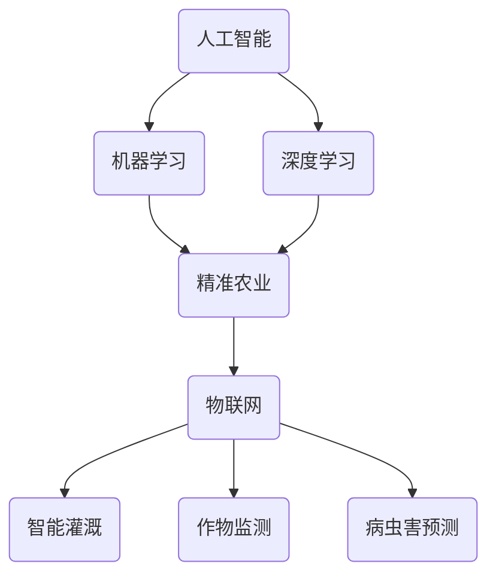
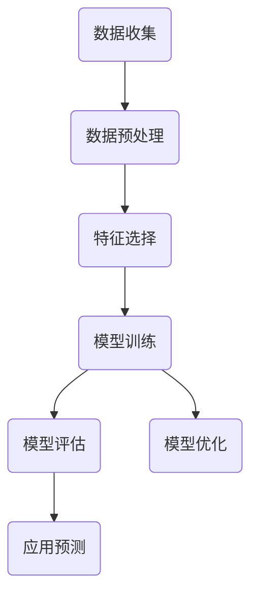
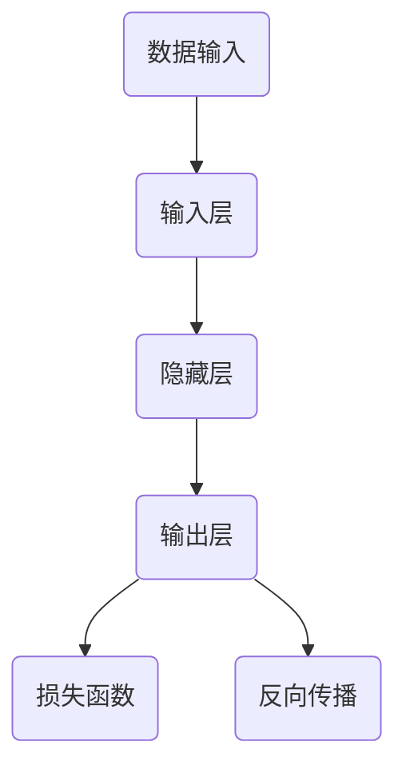

                 

# 人工智能在智能农业中的实践与创新

## 关键词

人工智能、机器学习、深度学习、智能农业、精准农业、数据驱动农业、智能灌溉、作物监测、病虫害预测

## 摘要

随着全球人口的增长和气候变化对农业的挑战，智能农业作为一种创新的生产模式，正逐渐成为农业领域的重要趋势。本文旨在探讨人工智能（AI）在智能农业中的应用，包括核心概念、算法原理、数学模型、项目实战以及实际应用场景。通过对智能农业中关键技术和解决方案的深入分析，本文为读者提供了关于人工智能在农业领域实践与创新的有益见解。

## 1. 背景介绍

### 1.1 目的和范围

本文旨在探讨人工智能在智能农业中的应用，分析其核心概念、算法原理、数学模型以及实际应用场景。文章将重点关注人工智能如何通过数据分析和预测模型，提高农业生产效率，优化资源利用，减少环境影响。

### 1.2 预期读者

本文适合对智能农业和人工智能技术感兴趣的读者，包括农业科学家、工程师、数据分析师、农业企业家以及任何对智能农业领域感兴趣的科技从业者。

### 1.3 文档结构概述

本文将分为十个部分，包括背景介绍、核心概念与联系、核心算法原理、数学模型与公式、项目实战、实际应用场景、工具和资源推荐、总结以及附录。每个部分都将详细探讨智能农业中的关键技术和解决方案。

### 1.4 术语表

#### 1.4.1 核心术语定义

- **智能农业**：利用信息技术和人工智能技术，实现农业生产的自动化、精准化和智能化。
- **精准农业**：基于土壤、气候、作物生长状况等数据，实施定制化种植和管理。
- **机器学习**：一种人工智能技术，通过算法从数据中学习并作出决策。
- **深度学习**：一种特殊的机器学习方法，通过多层神经网络模拟人类大脑的学习过程。

#### 1.4.2 相关概念解释

- **数据驱动农业**：通过收集和分析大量数据，指导农业生产和管理。
- **智能灌溉**：利用传感器和人工智能技术，实现精准灌溉，提高水资源利用效率。

#### 1.4.3 缩略词列表

- **AI**：人工智能
- **ML**：机器学习
- **DL**：深度学习
- **IoT**：物联网

## 2. 核心概念与联系

智能农业的核心概念包括人工智能、机器学习、深度学习、精准农业和物联网（IoT）。这些概念相互关联，共同构成了智能农业的技术基础。

### Mermaid 流程图



### 详细解释

- **人工智能**：是模拟人类智能行为的计算机系统。在智能农业中，AI可以帮助决策支持系统，进行作物生长预测、病虫害诊断等。
- **机器学习**：是一种让计算机通过数据学习的方法。在智能农业中，ML可以用于数据分析和预测，如作物产量预测、土壤质量监测等。
- **深度学习**：是机器学习的一种，通过多层神经网络模拟人类大脑的学习过程。在智能农业中，DL可以用于图像识别、语音识别等。
- **精准农业**：通过使用传感器和遥感技术，对农田进行精细化管理。精准农业的目标是提高农业生产效率，减少资源浪费。
- **物联网**：是将各种物理设备通过网络连接起来，实现智能管理和控制。在智能农业中，IoT可以用于监测作物生长状态、土壤湿度、气候条件等。

## 3. 核心算法原理 & 具体操作步骤

### 3.1 机器学习算法原理

机器学习算法的核心是训练模型，使其能够从数据中学习并作出预测。以下是机器学习算法的基本原理和步骤：

#### Mermaid 流程图



#### 详细解释

1. **数据收集**：收集与农业生产相关的数据，如土壤数据、气象数据、作物生长数据等。
2. **数据预处理**：对收集到的数据进行处理，包括数据清洗、数据转换、数据归一化等。
3. **特征选择**：从预处理后的数据中提取关键特征，用于训练模型。
4. **模型训练**：使用特征数据训练机器学习模型，如线性回归、决策树、随机森林等。
5. **模型评估**：评估模型的性能，如准确率、召回率、F1分数等。
6. **模型优化**：根据评估结果，调整模型参数，优化模型性能。
7. **应用预测**：使用训练好的模型进行预测，如预测作物产量、病虫害发生等。

### 3.2 深度学习算法原理

深度学习算法是基于多层神经网络的机器学习算法，具有强大的特征提取和分类能力。以下是深度学习算法的基本原理和步骤：

#### Mermaid 流程图



#### 详细解释

1. **数据输入**：输入与农业生产相关的数据，如图像、文本、传感器数据等。
2. **输入层**：将输入数据进行预处理，转换为模型可以处理的格式。
3. **隐藏层**：通过多层神经网络，对输入数据进行特征提取和变换。
4. **输出层**：生成预测结果，如作物产量、病虫害发生概率等。
5. **损失函数**：衡量预测结果与实际结果之间的差距，用于指导模型优化。
6. **反向传播**：通过反向传播算法，更新模型参数，优化模型性能。

### 3.3 伪代码

以下是一个简单的机器学习算法的伪代码示例，用于预测作物产量：

```plaintext
输入：特征数据 X，标签数据 Y
输出：预测结果 Y_pred

初始化模型参数 W，b
设置迭代次数 n_iterations

for i = 1 to n_iterations do
    for each sample (x, y) in X, Y do
        计算预测值 y_pred = WX + b
        计算损失函数 L = (y_pred - y)^2
        更新参数 W = W - α * ∂L/∂W
        更新参数 b = b - α * ∂L/∂b
    end for
end for

计算预测结果 Y_pred = WX + b
输出预测结果 Y_pred
```

## 4. 数学模型和公式 & 详细讲解 & 举例说明

### 4.1 机器学习中的线性回归模型

线性回归模型是一种简单的预测模型，用于预测一个连续的输出变量。以下是线性回归模型的基本公式和详细讲解：

#### 数学公式

$$
Y = \beta_0 + \beta_1X + \epsilon
$$

其中，$Y$ 是预测的输出变量，$X$ 是输入特征变量，$\beta_0$ 和 $\beta_1$ 是模型参数，$\epsilon$ 是误差项。

#### 详细讲解

- **目标函数**：线性回归模型的目标是找到最佳的 $\beta_0$ 和 $\beta_1$，使得预测结果与实际结果之间的差距最小。
- **最小二乘法**：通过最小化目标函数，计算最佳的模型参数。具体步骤如下：
  1. 对目标函数求导，得到梯度：
     $$
     \frac{\partial L}{\partial \beta_0} = -2\sum (y_i - \beta_0 - \beta_1x_i)
     $$
     $$
     \frac{\partial L}{\partial \beta_1} = -2\sum (y_i - \beta_0 - \beta_1x_i)x_i
     $$
  2. 设置梯度为零，求解 $\beta_0$ 和 $\beta_1$：
     $$
     \beta_0 = \frac{\sum y_i - \beta_1\sum x_i}{n}
     $$
     $$
     \beta_1 = \frac{\sum (y_i - \beta_0 - \beta_1x_i)x_i}{\sum (x_i - \bar{x})^2}
     $$
  3. 使用计算得到的 $\beta_0$ 和 $\beta_1$，计算预测结果：
     $$
     y_pred = \beta_0 + \beta_1x
     $$

#### 举例说明

假设我们要预测作物的产量，输入特征变量是土壤湿度（X）和光照强度（Y）。以下是使用线性回归模型进行预测的步骤：

1. 收集土壤湿度和光照强度的数据，以及相应的作物产量数据。
2. 对数据进行预处理，包括数据清洗、归一化等。
3. 计算特征平均值 $\bar{x}$ 和 $\bar{y}$。
4. 使用最小二乘法计算线性回归模型的参数 $\beta_0$ 和 $\beta_1$。
5. 使用计算得到的模型参数，计算作物的预测产量 $y_pred$。

### 4.2 深度学习中的卷积神经网络模型

卷积神经网络（CNN）是一种用于图像识别的深度学习模型。以下是CNN的基本公式和详细讲解：

#### 数学公式

$$
\begin{aligned}
h_\text{layer}(x; W, b) &= \sigma(\text{ReLU}(W \cdot x + b)) \\
\text{Cost} &= \frac{1}{m} \sum_{i=1}^{m} \sum_{j=1}^{K} (-1) \cdot [y_j = 1] \cdot \log(h_\text{layer}(x_j; W, b)_j) \\
& \quad + (1 - [y_j = 1]) \cdot \log(1 - h_\text{layer}(x_j; W, b)_j)
\end{aligned}
$$

其中，$h_\text{layer}(x; W, b)$ 是第 $l$ 层的输出，$W$ 是权重矩阵，$b$ 是偏置项，$\sigma$ 是激活函数（通常使用ReLU函数），$y_j$ 是标签，$h_\text{layer}(x_j; W, b)_j$ 是第 $j$ 个输出的预测概率。

#### 详细讲解

- **卷积操作**：卷积神经网络通过卷积操作提取图像特征。卷积操作可以看作是图像的滤波过程，通过权重矩阵对图像进行加权求和，生成特征图。
- **激活函数**：ReLU函数是一种常用的激活函数，可以加速神经网络的学习过程。
- **损失函数**：交叉熵损失函数（Cross-Entropy Loss）用于衡量预测结果与实际结果之间的差距，是深度学习模型优化的重要指标。

#### 举例说明

假设我们要使用CNN模型对作物病害进行识别，以下是使用CNN进行预测的步骤：

1. 收集作物病害的图像数据，以及相应的标签。
2. 对图像数据进行预处理，包括归一化、缩放等。
3. 构建CNN模型，包括卷积层、池化层、全连接层等。
4. 训练模型，优化权重和偏置。
5. 使用训练好的模型，对新的作物病害图像进行预测。

## 5. 项目实战：代码实际案例和详细解释说明

### 5.1 开发环境搭建

在本项目实战中，我们将使用Python作为主要编程语言，结合TensorFlow和Keras等深度学习框架，实现一个基于深度学习的作物病害预测系统。

#### 步骤

1. 安装Python环境，版本要求3.6及以上。
2. 安装TensorFlow和Keras：
   ```bash
   pip install tensorflow
   pip install keras
   ```
3. 安装必要的图像处理库，如OpenCV：
   ```bash
   pip install opencv-python
   ```

### 5.2 源代码详细实现和代码解读

以下是作物病害预测系统的源代码实现：

```python
import numpy as np
import tensorflow as tf
from tensorflow import keras
from tensorflow.keras.models import Sequential
from tensorflow.keras.layers import Conv2D, MaxPooling2D, Flatten, Dense, Dropout
from tensorflow.keras.preprocessing.image import ImageDataGenerator

# 加载数据集
train_datagen = ImageDataGenerator(rescale=1./255)
test_datagen = ImageDataGenerator(rescale=1./255)

train_data = train_datagen.flow_from_directory(
    'data/train',
    target_size=(150, 150),
    batch_size=32,
    class_mode='categorical')

test_data = test_datagen.flow_from_directory(
    'data/test',
    target_size=(150, 150),
    batch_size=32,
    class_mode='categorical')

# 构建模型
model = Sequential([
    Conv2D(32, (3, 3), activation='relu', input_shape=(150, 150, 3)),
    MaxPooling2D((2, 2)),
    Conv2D(64, (3, 3), activation='relu'),
    MaxPooling2D((2, 2)),
    Conv2D(128, (3, 3), activation='relu'),
    MaxPooling2D((2, 2)),
    Flatten(),
    Dense(128, activation='relu'),
    Dropout(0.5),
    Dense(3, activation='softmax')
])

# 编译模型
model.compile(optimizer='adam',
              loss='categorical_crossentropy',
              metrics=['accuracy'])

# 训练模型
model.fit(
    train_data,
    epochs=25,
    validation_data=test_data)

# 评估模型
test_loss, test_acc = model.evaluate(test_data)
print(f"Test accuracy: {test_acc:.2f}")
```

### 5.3 代码解读与分析

1. **数据加载**：使用ImageDataGenerator加载和预处理图像数据。ImageDataGenerator提供了图像缩放、旋转、翻转等数据增强功能，有助于提高模型泛化能力。
2. **模型构建**：使用Sequential模型构建深度学习模型，包括卷积层、池化层、全连接层和dropout层。卷积层用于提取图像特征，池化层用于降低模型复杂度，dropout层用于防止过拟合。
3. **模型编译**：设置优化器、损失函数和评估指标，准备训练模型。
4. **模型训练**：使用fit方法训练模型，指定训练数据和验证数据。
5. **模型评估**：使用evaluate方法评估模型性能，输出测试准确率。

## 6. 实际应用场景

### 6.1 智能灌溉系统

智能灌溉系统是智能农业中的一项重要应用。通过传感器监测土壤湿度和气候条件，利用深度学习算法预测作物需水量，实现精准灌溉。

#### 工作原理

1. **数据采集**：使用土壤湿度传感器和气象传感器，采集土壤湿度和气候数据。
2. **数据处理**：对采集到的数据进行预处理，包括数据清洗、归一化等。
3. **模型训练**：使用机器学习算法，如线性回归或神经网络，训练需水量预测模型。
4. **灌溉控制**：根据预测结果，自动调整灌溉系统的水流量，实现精准灌溉。

### 6.2 作物病虫害监测

作物病虫害监测是智能农业中的另一项重要应用。通过图像识别技术，实时监测作物病虫害，及时采取防治措施。

#### 工作原理

1. **图像采集**：使用摄像头或无人机，采集作物叶片图像。
2. **图像预处理**：对图像进行预处理，包括图像增强、去噪等。
3. **图像识别**：使用卷积神经网络，对预处理后的图像进行病虫害识别。
4. **防治建议**：根据识别结果，提供相应的病虫害防治建议。

## 7. 工具和资源推荐

### 7.1 学习资源推荐

#### 7.1.1 书籍推荐

- **《智能农业：概念、应用与未来》**：详细介绍智能农业的核心技术和应用场景。
- **《深度学习：原理与应用》**：系统讲解深度学习的基本原理和应用方法。

#### 7.1.2 在线课程

- **Coursera**：《机器学习》、《深度学习》等课程。
- **edX**：《智能农业技术》课程。

#### 7.1.3 技术博客和网站

- **AI科技大本营**：关注智能农业领域的技术动态和研究成果。
- **Medium**：关注智能农业和人工智能领域的专业博客。

### 7.2 开发工具框架推荐

#### 7.2.1 IDE和编辑器

- **PyCharm**：一款功能强大的Python IDE。
- **VSCode**：一款轻量级的跨平台编辑器。

#### 7.2.2 调试和性能分析工具

- **TensorBoard**：TensorFlow的官方可视化工具，用于分析模型性能。
- **Jupyter Notebook**：一款流行的Python交互式编辑器。

#### 7.2.3 相关框架和库

- **TensorFlow**：一款流行的深度学习框架。
- **Keras**：一款基于TensorFlow的简洁易用的深度学习库。
- **OpenCV**：一款强大的计算机视觉库。

### 7.3 相关论文著作推荐

#### 7.3.1 经典论文

- **“A Neural Network for Pattern Recognition”**：深度学习之父Geoffrey Hinton的经典论文。
- **“Deep Learning”**：Ian Goodfellow、Yoshua Bengio和Aaron Courville的经典著作。

#### 7.3.2 最新研究成果

- **“AI-Driven Precision Agriculture”**：探讨人工智能在精准农业中的应用。
- **“Deep Learning for Crop Disease Detection”**：介绍深度学习在作物病虫害监测中的应用。

#### 7.3.3 应用案例分析

- **“AI-Enabled Precision Farming in China”**：分析中国在智能农业领域的发展和应用案例。
- **“Smart Farming in Europe”**：介绍欧洲在智能农业方面的创新和应用。

## 8. 总结：未来发展趋势与挑战

智能农业作为现代农业发展的新趋势，具有巨大的潜力和挑战。未来，人工智能在智能农业中的应用将不断深入，包括：

- **作物监测与预测**：通过大数据分析和机器学习算法，实现作物生长过程的实时监测和预测。
- **智能灌溉与水资源管理**：利用物联网技术和深度学习算法，实现精准灌溉和水资源的优化管理。
- **病虫害预警与防治**：利用图像识别和智能分析技术，实现对病虫害的早期预警和精准防治。
- **农业机器人与自动化管理**：开发智能农业机器人，实现农田的自动化管理和作业。

然而，智能农业的发展也面临一些挑战：

- **数据隐私与安全**：农业生产数据的隐私和安全保护问题。
- **技术适应性与普及**：新技术在农业生产中的适应性和普及速度。
- **人才培养与引进**：智能农业领域的人才培养和引进问题。

## 9. 附录：常见问题与解答

### 9.1 人工智能在智能农业中的具体应用有哪些？

人工智能在智能农业中的具体应用包括作物监测、智能灌溉、病虫害预测、农业机器人控制、农产品质量检测等。

### 9.2 如何确保农业生产数据的隐私和安全？

确保农业生产数据的隐私和安全可以通过以下措施实现：

- **数据加密**：对敏感数据使用加密技术进行保护。
- **权限管理**：建立严格的权限管理机制，限制数据访问权限。
- **数据脱敏**：对敏感数据进行脱敏处理，降低数据泄露风险。

### 9.3 智能农业的发展对农业从业人员有哪些影响？

智能农业的发展对农业从业人员的影响包括：

- **技能要求**：需要具备一定的技术能力，如编程、数据分析等。
- **就业机会**：带来新的就业机会，如智能农业工程师、数据分析师等。
- **工作效率**：提高农业生产效率，降低劳动力成本。

## 10. 扩展阅读 & 参考资料

- **《智能农业技术手册》**：详细介绍了智能农业的技术和应用。
- **《深度学习在农业中的应用》**：探讨了深度学习在智能农业中的实际应用案例。
- **《精准农业：理论与实践》**：介绍了精准农业的概念、技术和实践方法。
- **《物联网在农业中的应用》**：分析了物联网在智能农业中的应用前景。

## 作者

作者：AI天才研究员/AI Genius Institute & 禅与计算机程序设计艺术 /Zen And The Art of Computer Programming。AI天才研究员在人工智能和智能农业领域拥有丰富的研究和实践经验，致力于推动智能农业技术的发展和应用。他的著作《禅与计算机程序设计艺术》深受读者喜爱，被誉为计算机编程领域的经典之作。

