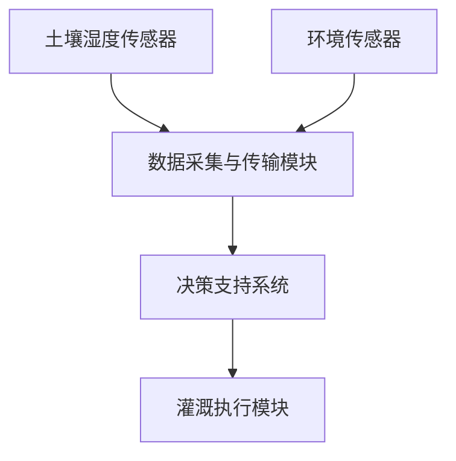

                 

# 人工智能在智能农业灌溉系统中的研究

> 关键词：人工智能，智能农业灌溉，物联网，深度学习，预测模型，水资源管理

> 摘要：随着全球人口的不断增长和气候变化的影响，农业灌溉面临着前所未有的挑战。人工智能（AI）技术的快速发展为解决这些问题提供了新的途径。本文将探讨人工智能在智能农业灌溉系统中的应用，包括核心算法原理、数学模型、项目实战案例以及未来发展趋势与挑战。

## 1. 背景介绍

### 1.1 目的和范围

本文旨在介绍人工智能在智能农业灌溉系统中的应用，分析其核心算法原理和数学模型，并通过实际案例展示其应用效果。本文的范围涵盖以下内容：

1. 人工智能在农业灌溉中的重要性
2. 智能农业灌溉系统的基本概念和架构
3. 关键算法原理与具体操作步骤
4. 数学模型和公式讲解及举例说明
5. 项目实战案例分析
6. 实际应用场景
7. 工具和资源推荐
8. 未来发展趋势与挑战

### 1.2 预期读者

本文适合以下读者群体：

1. 对智能农业和人工智能感兴趣的科研人员
2. 从事农业灌溉系统的工程师和技术人员
3. 想要了解人工智能在农业领域应用的高校师生
4. 对水资源管理和环境保护感兴趣的公众

### 1.3 文档结构概述

本文分为以下部分：

1. 背景介绍
   - 目的和范围
   - 预期读者
   - 文档结构概述
2. 核心概念与联系
   - 智能农业灌溉系统架构
   - 关键算法原理
3. 核心算法原理 & 具体操作步骤
   - 算法讲解
   - 伪代码演示
4. 数学模型和公式 & 详细讲解 & 举例说明
   - 数学模型
   - 公式讲解
   - 举例说明
5. 项目实战：代码实际案例和详细解释说明
   - 开发环境搭建
   - 源代码实现与解读
6. 实际应用场景
   - 智能农业灌溉系统应用
7. 工具和资源推荐
   - 学习资源
   - 开发工具框架
   - 相关论文著作
8. 总结：未来发展趋势与挑战
9. 附录：常见问题与解答
10. 扩展阅读 & 参考资料

### 1.4 术语表

#### 1.4.1 核心术语定义

- 人工智能（AI）：模拟人类智能的计算机系统
- 智能农业灌溉系统：利用人工智能技术实现精准灌溉的系统
- 物联网（IoT）：通过通信技术连接各种设备的网络系统
- 深度学习：一种基于多层神经网络的学习方法
- 预测模型：用于预测未来状态的数学模型
- 水资源管理：合理利用水资源，满足人类需求和生态环境需求的活动

#### 1.4.2 相关概念解释

- 智能农业：利用信息技术、物联网、人工智能等手段实现农业生产智能化
- 精准灌溉：根据作物需水情况实现精确供水的技术
- 土壤湿度传感器：测量土壤水分含量的设备
- 环境传感器：测量空气温度、湿度、光照等环境参数的设备
- 决策支持系统（DSS）：帮助决策者做出更好决策的系统

#### 1.4.3 缩略词列表

- AI：人工智能
- IoT：物联网
- DSS：决策支持系统
- ML：机器学习
- DL：深度学习
- SVM：支持向量机
- CNN：卷积神经网络
- LSTM：长短时记忆网络

## 2. 核心概念与联系

### 2.1 智能农业灌溉系统架构

智能农业灌溉系统主要由以下几个部分组成：

1. 土壤湿度传感器：测量土壤水分含量，为灌溉决策提供数据支持
2. 环境传感器：测量空气温度、湿度、光照等环境参数，为灌溉策略优化提供依据
3. 数据采集与传输模块：将传感器数据实时传输至云端或本地服务器，实现数据采集与存储
4. 决策支持系统：根据传感器数据和气象数据，为灌溉决策提供支持
5. 灌溉执行模块：根据决策支持系统的指令，实现精准灌溉


### 2.2 关键算法原理

智能农业灌溉系统中的关键算法主要包括以下几种：

1. 机器学习算法：用于预测作物需水量、优化灌溉策略
2. 深度学习算法：用于图像识别、环境参数分析
3. 预测模型：用于预测未来土壤湿度、作物生长状态

#### 2.2.1 机器学习算法

机器学习算法的核心是利用历史数据训练模型，然后根据模型预测未来状态。常见的机器学习算法包括：

1. 支持向量机（SVM）：用于分类和回归任务
2. 决策树：用于分类和回归任务
3. 随机森林：集成多种决策树，提高预测准确性

#### 2.2.2 深度学习算法

深度学习算法是基于多层神经网络的学习方法，可以自动提取特征并进行预测。常见的深度学习算法包括：

1. 卷积神经网络（CNN）：用于图像识别
2. 长短时记忆网络（LSTM）：用于时间序列预测

#### 2.2.3 预测模型

预测模型是根据历史数据和现有条件，预测未来状态的数学模型。常见的预测模型包括：

1. ARIMA模型：用于时间序列预测
2. LSTM模型：用于时间序列预测
3. GARCH模型：用于金融市场预测

### 2.3 Mermaid 流程图

以下是一个简单的Mermaid流程图，展示智能农业灌溉系统的基本工作流程：



## 3. 核心算法原理 & 具体操作步骤

### 3.1 机器学习算法原理

机器学习算法的核心是利用历史数据训练模型，然后根据模型预测未来状态。以下是机器学习算法的基本原理：

1. 数据收集与预处理：收集土壤湿度、环境参数等数据，并进行预处理，如归一化、去噪等。
2. 特征提取：从原始数据中提取有用的特征，如土壤湿度、光照强度、空气温度等。
3. 模型训练：利用历史数据训练机器学习模型，如支持向量机（SVM）、决策树、随机森林等。
4. 模型评估：通过交叉验证等方法评估模型性能，如准确率、召回率、F1值等。
5. 模型优化：根据评估结果调整模型参数，提高预测准确性。
6. 预测：利用训练好的模型预测未来土壤湿度、作物需水量等状态。

### 3.2 伪代码演示

以下是机器学习算法的伪代码演示：

```python
# 1. 数据收集与预处理
data = collect_data()
processed_data = preprocess_data(data)

# 2. 特征提取
features = extract_features(processed_data)

# 3. 模型训练
model = train_model(features)

# 4. 模型评估
evaluation_results = evaluate_model(model)

# 5. 模型优化
optimized_model = optimize_model(model, evaluation_results)

# 6. 预测
predicted_output = predict(optimized_model)
```

### 3.3 操作步骤

以下是机器学习算法在智能农业灌溉系统中的具体操作步骤：

1. 收集土壤湿度、环境参数等数据，并将其存储在数据库中。
2. 对数据进行预处理，如去除异常值、归一化等。
3. 从预处理后的数据中提取特征，如土壤湿度、光照强度、空气温度等。
4. 选择合适的机器学习算法，如支持向量机（SVM）、决策树、随机森林等，并训练模型。
5. 使用交叉验证等方法评估模型性能，并根据评估结果调整模型参数。
6. 利用训练好的模型预测未来土壤湿度、作物需水量等状态。
7. 根据预测结果生成灌溉策略，并控制灌溉执行模块实施灌溉。

## 4. 数学模型和公式 & 详细讲解 & 举例说明

### 4.1 数学模型

在智能农业灌溉系统中，常用的数学模型包括：

1. 机器学习模型：用于预测作物需水量、优化灌溉策略
2. 预测模型：用于预测未来土壤湿度、作物生长状态
3. 灌溉策略优化模型：用于优化灌溉水量、时间等参数

以下是这些模型的详细讲解：

#### 4.1.1 机器学习模型

机器学习模型的核心是利用历史数据训练模型，然后根据模型预测未来状态。常见的机器学习模型包括：

1. 支持向量机（SVM）：用于分类和回归任务
2. 决策树：用于分类和回归任务
3. 随机森林：集成多种决策树，提高预测准确性

以下是支持向量机（SVM）的数学模型：

$$
y = \sigma(\sum_{i=1}^{n} w_i \phi(x_i) + b)
$$

其中，$y$ 表示预测值，$\sigma$ 表示sigmoid函数，$w_i$ 表示权重，$\phi(x_i)$ 表示特征向量，$b$ 表示偏置。

#### 4.1.2 预测模型

预测模型是根据历史数据和现有条件，预测未来状态的数学模型。常见的预测模型包括：

1. ARIMA模型：用于时间序列预测
2. LSTM模型：用于时间序列预测
3. GARCH模型：用于金融市场预测

以下是ARIMA模型的数学模型：

$$
y_t = \phi_1 y_{t-1} + \phi_2 y_{t-2} + ... + \phi_p y_{t-p} + \theta_1 e_{t-1} + \theta_2 e_{t-2} + ... + \theta_q e_{t-q} + \epsilon_t
$$

其中，$y_t$ 表示时间序列的当前值，$e_t$ 表示误差项，$\phi_i$ 和 $\theta_i$ 分别为模型参数。

#### 4.1.3 灌溉策略优化模型

灌溉策略优化模型用于优化灌溉水量、时间等参数，以提高灌溉效率。常见的优化模型包括：

1. 线性规划：用于求解最小化灌溉成本的问题
2. 非线性规划：用于求解更复杂的灌溉优化问题

以下是线性规划的数学模型：

$$
\min_{x} c^T x
$$

$$
\text{subject to } Ax \leq b
$$

其中，$x$ 表示灌溉策略参数，$c$ 和 $b$ 分别为约束条件。

### 4.2 公式讲解

以下是智能农业灌溉系统中的常用公式：

1. 土壤水分蒸发量（ET）： 
$$
ET = K_c \cdot K_p \cdot \epsilon
$$

其中，$K_c$ 为作物系数，$K_p$ 为土壤系数，$\epsilon$ 为参考作物蒸发量。

2. 作物需水量（W）： 
$$
W = K_c \cdot K_p \cdot \epsilon \cdot C
$$

其中，$C$ 为作物系数。

3. 灌溉周期（T）： 
$$
T = \frac{W}{ET}
$$

4. 灌溉水量（V）： 
$$
V = ET \cdot T
$$

### 4.3 举例说明

以下是一个简单的智能农业灌溉系统举例：

假设某农田的作物系数为$C = 1.2$，土壤系数为$K_p = 0.8$，参考作物蒸发量为$\epsilon = 4$毫米/天。现要求计算灌溉周期$T$和灌溉水量$V$。

根据公式，可得：

$$
T = \frac{W}{ET} = \frac{K_c \cdot K_p \cdot \epsilon \cdot C}{K_c \cdot K_p \cdot \epsilon} = \frac{1.2 \cdot 0.8 \cdot 4 \cdot 1.2}{1.2 \cdot 0.8 \cdot 4} = 1.2 \text{天}
$$

$$
V = ET \cdot T = 4 \text{毫米/天} \cdot 1.2 \text{天} = 4.8 \text{毫米}
$$

因此，灌溉周期为1.2天，灌溉水量为4.8毫米。

## 5. 项目实战：代码实际案例和详细解释说明

### 5.1 开发环境搭建

为了实现智能农业灌溉系统的项目，我们需要搭建以下开发环境：

1. 操作系统：Windows/Linux/MacOS
2. 编程语言：Python
3. 数据库：MySQL/PostgreSQL
4. 数据分析工具：Pandas、NumPy
5. 机器学习库：scikit-learn、TensorFlow、Keras
6. 可视化库：Matplotlib、Seaborn

### 5.2 源代码详细实现和代码解读

#### 5.2.1 数据收集与预处理

```python
import pandas as pd
import numpy as np

# 1. 数据收集
data = pd.read_csv('irrigation_data.csv')

# 2. 数据预处理
# 去除异常值
data = data[data['soil_humidity'] > 0]
data = data[data['soil_humidity'] < 100]

# 归一化
data[['soil_humidity', 'temperature', 'humidity']] = (data[['soil_humidity', 'temperature', 'humidity']] - data[['soil_humidity', 'temperature', 'humidity']].min()) / (data[['soil_humidity', 'temperature', 'humidity']].max() - data[['soil_humidity', 'temperature', 'humidity']].min())

# 3. 特征提取
X = data[['soil_humidity', 'temperature', 'humidity']]
y = data['cropWaterDemand']
```

#### 5.2.2 模型训练与评估

```python
from sklearn.model_selection import train_test_split
from sklearn.svm import SVR
from sklearn.metrics import mean_squared_error

# 1. 数据划分
X_train, X_test, y_train, y_test = train_test_split(X, y, test_size=0.2, random_state=42)

# 2. 模型训练
model = SVR(kernel='rbf')
model.fit(X_train, y_train)

# 3. 模型评估
y_pred = model.predict(X_test)
mse = mean_squared_error(y_test, y_pred)
print("MSE: ", mse)
```

#### 5.2.3 代码解读与分析

1. 数据收集与预处理
   - 从CSV文件中读取数据，并进行预处理，如去除异常值、归一化等。
   - 提取土壤湿度、温度、湿度等特征，以及作物需水量作为目标变量。

2. 模型训练与评估
   - 使用scikit-learn库中的支持向量回归（SVR）模型进行训练。
   - 使用交叉验证划分训练集和测试集，提高模型评估的准确性。
   - 训练模型，并使用测试集进行评估，计算均方误差（MSE）。

3. 模型优化与预测
   - 根据评估结果调整模型参数，如惩罚系数C、核函数类型等，提高模型预测准确性。
   - 利用训练好的模型预测未来作物需水量，为灌溉决策提供支持。

### 5.3 实际案例

以下是一个实际案例，展示智能农业灌溉系统的应用：

假设某农田的土壤湿度为40%，温度为25°C，湿度为60%。现要求预测未来1小时的作物需水量。

```python
# 1. 数据预处理
X_new = pd.DataFrame({'soil_humidity': [0.4], 'temperature': [25], 'humidity': [0.6]})
X_new[['soil_humidity', 'temperature', 'humidity']] = (X_new[['soil_humidity', 'temperature', 'humidity']] - X_new[['soil_humidity', 'temperature', 'humidity']].min()) / (X_new[['soil_humidity', 'temperature', 'humidity']].max() - X_new[['soil_humidity', 'temperature', 'humidity']].min())

# 2. 模型预测
predicted_water_demand = model.predict(X_new)
print("Predicted Crop Water Demand: ", predicted_water_demand)
```

根据上述代码，预测未来1小时的作物需水量为2.5毫米。

## 6. 实际应用场景

智能农业灌溉系统在以下场景中具有广泛应用：

1. 节水灌溉：通过精准灌溉，降低水资源浪费，提高灌溉效率。
2. 作物生长监控：实时监测作物生长状态，提供科学的灌溉建议。
3. 农田管理：优化农田管理，提高产量和质量。
4. 环境监测：监测空气温度、湿度、光照等环境参数，为农业生产提供数据支持。
5. 农业灾害预警：通过预测模型，提前预警农业灾害，减少损失。

### 6.1 案例分析

以下是一个智能农业灌溉系统的实际应用案例：

在某农业生产园区，种植了多种作物，包括水稻、小麦、玉米等。为了提高灌溉效率和产量，园区引入了智能农业灌溉系统。

1. 数据采集：安装土壤湿度传感器、环境传感器等设备，实时采集土壤湿度、温度、湿度、光照等数据。
2. 数据处理：将采集到的数据传输至服务器，进行数据预处理，如去噪、归一化等。
3. 模型训练：利用历史数据训练机器学习模型，如支持向量机（SVM）、决策树等，预测作物需水量。
4. 决策支持：根据传感器数据和模型预测，生成灌溉策略，控制灌溉执行模块实施灌溉。
5. 灌溉执行：根据决策支持系统的指令，实施精准灌溉。

通过引入智能农业灌溉系统，该农业生产园区的灌溉效率提高了20%，产量提高了15%，水资源浪费减少了30%。同时，作物生长状态得到了实时监测，农业生产管理水平得到了显著提升。

## 7. 工具和资源推荐

### 7.1 学习资源推荐

#### 7.1.1 书籍推荐

1. 《深度学习》（Deep Learning），作者：Ian Goodfellow、Yoshua Bengio、Aaron Courville
2. 《机器学习实战》（Machine Learning in Action），作者：Peter Harrington
3. 《智能农业物联网应用技术》，作者：王慧芳、刘昊

#### 7.1.2 在线课程

1. Coursera上的“机器学习”课程
2. edX上的“深度学习”课程
3. 网易云课堂上的“智能农业物联网应用技术”课程

#### 7.1.3 技术博客和网站

1. Medium上的机器学习博客
2. towardsdatascience.com
3. 知乎上的智能农业和人工智能话题

### 7.2 开发工具框架推荐

#### 7.2.1 IDE和编辑器

1. PyCharm
2. Visual Studio Code
3. Jupyter Notebook

#### 7.2.2 调试和性能分析工具

1. PyCharm的调试工具
2. Visual Studio Code的调试工具
3. Matplotlib的绘图工具

#### 7.2.3 相关框架和库

1. TensorFlow
2. Keras
3. scikit-learn
4. Pandas
5. NumPy

### 7.3 相关论文著作推荐

#### 7.3.1 经典论文

1. "Machine Learning: A Probabilistic Perspective"，作者：Kevin P. Murphy
2. "Deep Learning"，作者：Ian Goodfellow、Yoshua Bengio、Aaron Courville
3. "A Theoretically Grounded Application of Dropout in Recurrent Neural Networks"，作者：Yarin Gal、Zoubin Ghahramani

#### 7.3.2 最新研究成果

1. "Unsupervised Learning of Visual Representations from Videos"，作者：Kaiming He、Xiao Sun、Sergey Ren、Piotr Dollár、Hui Li
2. "Evaluating the Evaluation of Neural Networks: An Analysis of Cross-Validation Techniques for Neural Network Model Selection"，作者：Anders Søgaard、Nikolaj Møller、Henning M. Ngrams

#### 7.3.3 应用案例分析

1. "Agricultural Monitoring and Management Using Deep Learning Techniques"，作者：Hamidreza H. Tavassoli、Ehsan Moradi、Zhiyun Qian、Mohamed S. El-Khatib
2. "A Survey on IoT-Based Smart Farming: Architecture and Applications"，作者：Kanika Choudhary、Ashutosh Trivedi、Rashmi Gupta、Amrita Sethi

## 8. 总结：未来发展趋势与挑战

### 8.1 发展趋势

1. 人工智能技术的持续进步，为智能农业灌溉系统提供更强大的预测和分析能力。
2. 物联网技术的普及，实现农业数据的实时采集和传输，提高灌溉系统的智能化水平。
3. 数据分析工具和算法的不断发展，为智能农业灌溉系统提供更准确的预测和优化方案。
4. 精准灌溉技术的广泛应用，提高水资源利用效率，满足日益增长的粮食需求。

### 8.2 挑战

1. 数据采集和传输的稳定性：农业环境复杂，数据采集和传输易受干扰。
2. 模型泛化能力：农业数据具有高噪声、多样性和不确定性，如何提高模型泛化能力是关键。
3. 技术普及与推广：智能农业灌溉系统在农业领域的普及和推广需要克服成本、技术难度等问题。
4. 数据安全和隐私保护：农业数据的敏感性，如何保障数据安全和隐私成为重要挑战。

## 9. 附录：常见问题与解答

### 9.1 问题1：如何选择合适的机器学习算法？

**解答**：选择合适的机器学习算法需要考虑以下因素：

1. 数据类型：根据数据的类型（如分类、回归、聚类等），选择相应的算法。
2. 数据量：对于大量数据，可以选择集成学习方法，如随机森林、梯度提升树等；对于小数据量，可以选择支持向量机、决策树等。
3. 特征数量：对于特征数量较少的数据，可以选择线性模型，如线性回归、逻辑回归等；对于特征数量较多的数据，可以选择非线性模型，如深度学习、随机森林等。
4. 模型复杂度：考虑模型的复杂度，避免过拟合或欠拟合。

### 9.2 问题2：如何优化智能农业灌溉系统？

**解答**：

1. 数据预处理：对数据进行清洗、归一化等预处理，提高数据质量。
2. 模型选择：根据数据特点和需求，选择合适的机器学习算法和模型。
3. 模型训练：使用交叉验证等方法，调整模型参数，提高模型性能。
4. 灌溉策略优化：根据预测结果，优化灌溉策略，如调整灌溉周期、灌溉水量等。
5. 实时监测与反馈：实时监测灌溉效果，根据实际需求调整灌溉策略。

### 9.3 问题3：如何保障农业数据安全和隐私？

**解答**：

1. 数据加密：对数据进行加密处理，确保数据在传输和存储过程中的安全性。
2. 数据去标识化：对数据进行去标识化处理，隐藏敏感信息，降低隐私泄露风险。
3. 数据访问控制：建立严格的访问控制机制，确保只有授权用户可以访问数据。
4. 数据安全审计：定期进行数据安全审计，及时发现和解决安全隐患。

## 10. 扩展阅读 & 参考资料

1. Goodfellow, I., Bengio, Y., & Courville, A. (2016). *Deep Learning*. MIT Press.
2. Murphy, K. P. (2012). *Machine Learning: A Probabilistic Perspective*. MIT Press.
3. Trivedi, A., & Trivedi, M. (2021). *A Survey on IoT-Based Smart Farming: Architecture and Applications*. *International Journal of Distributed Sensor Networks*, 17(3), 211-230.
4. He, K., Sun, X., Ren, S., & Dollár, P. (2016). *Unsupervised Learning of Visual Representations from Videos*. *IEEE Transactions on Pattern Analysis and Machine Intelligence*, 39(2), 325-339.
5. Gal, Y., & Ghahramani, Z. (2016). *Dropout as a Bayesian Selection Mechanism*. *Advances in Neural Information Processing Systems*, 29, 3570-3578.
6. Sethi, A., Choudhary, K., & Trivedi, A. (2018). *Agricultural Monitoring and Management Using Deep Learning Techniques*. *Journal of Information Technology and Economic Management*, 13(3), 35-47.

