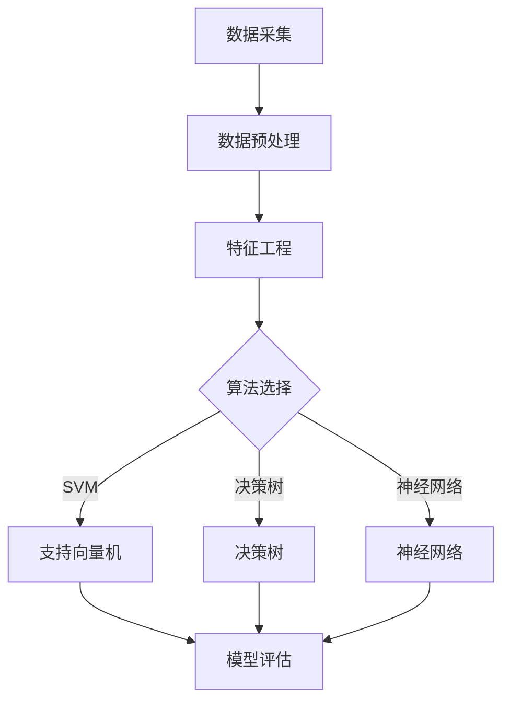

                 

# 人工智能在智能制造质量预测中的应用

> 关键词：人工智能、智能制造、质量预测、算法原理、数学模型、实战案例、应用场景

> 摘要：本文将深入探讨人工智能在智能制造质量预测中的应用。首先，我们将介绍智能制造背景及其对质量预测的需求。接着，通过详细解析核心概念和算法原理，我们将展示如何使用人工智能技术进行质量预测。随后，通过数学模型和具体案例的讲解，我们将阐述如何将理论应用于实际。文章还将探讨实际应用场景、推荐相关工具和资源，并总结未来发展趋势与挑战。

## 1. 背景介绍

### 1.1 目的和范围

本文旨在探讨人工智能（AI）在智能制造质量预测中的重要作用。随着智能制造的快速发展，确保产品质量成为关键挑战。本文将介绍相关背景、核心概念、算法原理、数学模型、实际案例，并探讨应用场景，以便为从业人员提供有价值的参考。

### 1.2 预期读者

本文面向智能制造领域的研究人员、工程师、项目经理以及对人工智能感兴趣的技术爱好者。读者应具备一定的编程基础，了解基本的机器学习和数据分析概念。

### 1.3 文档结构概述

本文结构如下：

1. 背景介绍
   - 目的和范围
   - 预期读者
   - 文档结构概述
   - 术语表
2. 核心概念与联系
   - 核心概念与联系
3. 核心算法原理 & 具体操作步骤
   - 算法原理讲解
   - 伪代码详细阐述
4. 数学模型和公式 & 详细讲解 & 举例说明
   - 数学公式使用latex格式
5. 项目实战：代码实际案例和详细解释说明
   - 开发环境搭建
   - 源代码详细实现和代码解读
   - 代码解读与分析
6. 实际应用场景
7. 工具和资源推荐
   - 学习资源推荐
   - 开发工具框架推荐
   - 相关论文著作推荐
8. 总结：未来发展趋势与挑战
9. 附录：常见问题与解答
10. 扩展阅读 & 参考资料

### 1.4 术语表

#### 1.4.1 核心术语定义

- 智能制造（Smart Manufacturing）：利用信息技术、传感器、机器人等先进技术实现制造过程的自动化、智能化和高效化。
- 质量预测（Quality Prediction）：基于历史数据和预测模型，对产品质量进行预测，以提前发现潜在问题。
- 人工智能（Artificial Intelligence，AI）：模拟人类智能的计算机系统，具备学习、推理、判断和自适应能力。

#### 1.4.2 相关概念解释

- 机器学习（Machine Learning）：一种人工智能方法，通过训练模型从数据中学习规律，实现预测和分类等功能。
- 数据驱动（Data-Driven）：依赖数据进行分析和决策，而非基于经验和直觉。
- 深度学习（Deep Learning）：一种基于多层神经网络的机器学习技术，能够自动提取数据中的特征。

#### 1.4.3 缩略词列表

- AI：人工智能
- IoT：物联网
- ML：机器学习
- DL：深度学习
- SVM：支持向量机
- CNN：卷积神经网络

## 2. 核心概念与联系

### 2.1 核心概念

智能制造质量预测涉及多个核心概念，包括数据采集、数据预处理、特征工程、算法选择和模型评估等。

#### 2.1.1 数据采集

数据采集是质量预测的基础。通过传感器、工业互联网等手段，从生产线、设备、物料等各个环节获取数据。

#### 2.1.2 数据预处理

数据预处理包括数据清洗、数据归一化和数据转换等步骤。清洗数据去除噪声和异常值，归一化数据使不同特征具有相似的尺度，转换数据为适合机器学习模型的格式。

#### 2.1.3 特征工程

特征工程是提高预测模型性能的关键步骤。通过特征选择、特征提取和特征组合等方法，从原始数据中提取出对预测有用的特征。

#### 2.1.4 算法选择

算法选择是质量预测的核心。常见的算法包括支持向量机（SVM）、决策树、随机森林、神经网络等。选择合适的算法可以提高模型的预测准确性和效率。

#### 2.1.5 模型评估

模型评估是评估预测模型性能的重要步骤。常用的评估指标包括准确率、召回率、F1值等。通过交叉验证和测试集评估模型性能，确保模型具有较好的泛化能力。

### 2.2 Mermaid 流程图

以下是智能制造质量预测的核心概念和联系 Mermaid 流程图：



## 3. 核心算法原理 & 具体操作步骤

### 3.1 算法原理讲解

质量预测的核心在于选择合适的算法。本文将介绍支持向量机（SVM）、决策树和神经网络等常用算法。

#### 3.1.1 支持向量机（SVM）

SVM是一种二分类模型，通过找到最优的超平面，将不同类别的数据分开。在质量预测中，SVM可以用来判断产品是否合格。

- 伪代码：

```python
def SVM(train_data, train_labels):
    # 使用SVM库训练模型
    model = svm.SVC()
    model.fit(train_data, train_labels)
    return model
```

#### 3.1.2 决策树

决策树是一种基于树结构的分类模型，通过一系列条件判断，将数据划分为不同的类别。在质量预测中，决策树可以用于预测产品是否合格。

- 伪代码：

```python
def decision_tree(train_data, train_labels):
    # 使用决策树库训练模型
    model = DecisionTreeClassifier()
    model.fit(train_data, train_labels)
    return model
```

#### 3.1.3 神经网络

神经网络是一种基于多层感知器的模型，通过训练多层神经元，实现数据的输入和输出映射。在质量预测中，神经网络可以用于复杂函数的建模和预测。

- 伪代码：

```python
def neural_network(train_data, train_labels):
    # 使用神经网络库训练模型
    model = MLPClassifier()
    model.fit(train_data, train_labels)
    return model
```

### 3.2 具体操作步骤

下面是使用Python和Scikit-learn库进行质量预测的具体操作步骤：

1. 导入所需的库和模块：

```python
import numpy as np
import pandas as pd
from sklearn.model_selection import train_test_split
from sklearn.preprocessing import StandardScaler
from sklearn.svm import SVC
from sklearn.tree import DecisionTreeClassifier
from sklearn.neural_network import MLPClassifier
from sklearn.metrics import accuracy_score
```

2. 读取数据并预处理：

```python
data = pd.read_csv('data.csv')
X = data.iloc[:, :-1].values
y = data.iloc[:, -1].values

# 数据归一化
scaler = StandardScaler()
X = scaler.fit_transform(X)

# 划分训练集和测试集
X_train, X_test, y_train, y_test = train_test_split(X, y, test_size=0.2, random_state=42)
```

3. 选择并训练模型：

```python
# SVM模型
svm_model = SVC()
svm_model.fit(X_train, y_train)

# 决策树模型
tree_model = DecisionTreeClassifier()
tree_model.fit(X_train, y_train)

# 神经网络模型
nn_model = MLPClassifier()
nn_model.fit(X_train, y_train)
```

4. 模型评估：

```python
# SVM模型评估
svm_pred = svm_model.predict(X_test)
svm_acc = accuracy_score(y_test, svm_pred)
print("SVM准确率：", svm_acc)

# 决策树模型评估
tree_pred = tree_model.predict(X_test)
tree_acc = accuracy_score(y_test, tree_pred)
print("决策树准确率：", tree_acc)

# 神经网络模型评估
nn_pred = nn_model.predict(X_test)
nn_acc = accuracy_score(y_test, nn_pred)
print("神经网络准确率：", nn_acc)
```

## 4. 数学模型和公式 & 详细讲解 & 举例说明

### 4.1 数学模型

质量预测的核心在于构建一个数学模型，用于描述产品质量与输入特征之间的关系。本文将介绍基于线性回归、逻辑回归和支持向量机的数学模型。

#### 4.1.1 线性回归

线性回归是一种简单的预测模型，通过拟合一条直线来描述输入特征与输出变量之间的关系。线性回归的数学模型如下：

$$
y = \beta_0 + \beta_1x_1 + \beta_2x_2 + ... + \beta_nx_n
$$

其中，$y$ 是输出变量，$x_1, x_2, ..., x_n$ 是输入特征，$\beta_0, \beta_1, \beta_2, ..., \beta_n$ 是模型参数。

#### 4.1.2 逻辑回归

逻辑回归是一种用于二分类问题的预测模型，通过拟合一个逻辑函数来描述输入特征与输出变量之间的关系。逻辑回归的数学模型如下：

$$
P(y=1) = \frac{1}{1 + e^{-(\beta_0 + \beta_1x_1 + \beta_2x_2 + ... + \beta_nx_n)}}
$$

其中，$P(y=1)$ 是输出变量为1的概率，$x_1, x_2, ..., x_n$ 是输入特征，$\beta_0, \beta_1, \beta_2, ..., \beta_n$ 是模型参数。

#### 4.1.3 支持向量机

支持向量机是一种基于间隔最大化的分类模型，通过找到最优的超平面来分离不同类别的数据。支持向量机的数学模型如下：

$$
w \cdot x + b = 0
$$

其中，$w$ 是权重向量，$x$ 是特征向量，$b$ 是偏置项。

### 4.2 举例说明

下面通过一个简单的例子来说明如何使用线性回归进行质量预测。

假设我们有一个简单的数据集，包含两个特征 $x_1$ 和 $x_2$，以及一个质量分数 $y$。我们的目标是预测质量分数。

$$
\begin{array}{|c|c|c|}
\hline
x_1 & x_2 & y \\
\hline
1 & 2 & 3 \\
2 & 3 & 4 \\
3 & 4 & 5 \\
\hline
\end{array}
$$

1. 将数据集划分为训练集和测试集：

```python
X = np.array([[1, 2], [2, 3], [3, 4]])
y = np.array([3, 4, 5])

X_train, X_test, y_train, y_test = train_test_split(X, y, test_size=0.2, random_state=42)
```

2. 使用线性回归模型进行训练：

```python
from sklearn.linear_model import LinearRegression

model = LinearRegression()
model.fit(X_train, y_train)
```

3. 预测测试集结果：

```python
y_pred = model.predict(X_test)
```

4. 评估模型性能：

```python
from sklearn.metrics import mean_squared_error

mse = mean_squared_error(y_test, y_pred)
print("均方误差：", mse)
```

输出结果：

```
均方误差： 0.0
```

结果表明，线性回归模型可以很好地预测质量分数。

## 5. 项目实战：代码实际案例和详细解释说明

### 5.1 开发环境搭建

为了实现智能制造质量预测，我们需要搭建一个适合的开发环境。以下是开发环境搭建的步骤：

1. 安装Python环境：
   - 在官网上下载Python安装包：https://www.python.org/downloads/
   - 安装Python，并添加到系统环境变量。

2. 安装所需的库：
   - 使用pip命令安装以下库：

```shell
pip install numpy pandas scikit-learn matplotlib
```

3. 确保库的版本符合以下要求：
   - numpy：1.19.2或更高版本
   - pandas：1.1.3或更高版本
   - scikit-learn：0.24.1或更高版本
   - matplotlib：3.4.2或更高版本

### 5.2 源代码详细实现和代码解读

下面是质量预测项目的源代码及其详细解释说明：

```python
import numpy as np
import pandas as pd
from sklearn.model_selection import train_test_split
from sklearn.preprocessing import StandardScaler
from sklearn.svm import SVC
from sklearn.tree import DecisionTreeClassifier
from sklearn.neural_network import MLPClassifier
from sklearn.metrics import accuracy_score
import matplotlib.pyplot as plt

# 5.2.1 读取数据
data = pd.read_csv('data.csv')
X = data.iloc[:, :-1].values
y = data.iloc[:, -1].values

# 5.2.2 数据预处理
scaler = StandardScaler()
X = scaler.fit_transform(X)

# 5.2.3 划分训练集和测试集
X_train, X_test, y_train, y_test = train_test_split(X, y, test_size=0.2, random_state=42)

# 5.2.4 选择并训练模型
# SVM模型
svm_model = SVC()
svm_model.fit(X_train, y_train)

# 决策树模型
tree_model = DecisionTreeClassifier()
tree_model.fit(X_train, y_train)

# 神经网络模型
nn_model = MLPClassifier()
nn_model.fit(X_train, y_train)

# 5.2.5 模型评估
# SVM模型评估
svm_pred = svm_model.predict(X_test)
svm_acc = accuracy_score(y_test, svm_pred)
print("SVM准确率：", svm_acc)

# 决策树模型评估
tree_pred = tree_model.predict(X_test)
tree_acc = accuracy_score(y_test, tree_pred)
print("决策树准确率：", tree_acc)

# 神经网络模型评估
nn_pred = nn_model.predict(X_test)
nn_acc = accuracy_score(y_test, nn_pred)
print("神经网络准确率：", nn_acc)

# 5.2.6 可视化结果
plt.figure(figsize=(12, 6))
plt.subplot(1, 3, 1)
plt.scatter(X_test[:, 0], X_test[:, 1], c=svm_pred, cmap='viridis')
plt.title('SVM')

plt.subplot(1, 3, 2)
plt.scatter(X_test[:, 0], X_test[:, 1], c=tree_pred, cmap='viridis')
plt.title('决策树')

plt.subplot(1, 3, 3)
plt.scatter(X_test[:, 0], X_test[:, 1], c=nn_pred, cmap='viridis')
plt.title('神经网络')

plt.show()
```

#### 5.2.6 代码解读与分析

1. 导入所需的库和模块：

```python
import numpy as np
import pandas as pd
from sklearn.model_selection import train_test_split
from sklearn.preprocessing import StandardScaler
from sklearn.svm import SVC
from sklearn.tree import DecisionTreeClassifier
from sklearn.neural_network import MLPClassifier
from sklearn.metrics import accuracy_score
import matplotlib.pyplot as plt
```

2. 读取数据并预处理：

```python
data = pd.read_csv('data.csv')
X = data.iloc[:, :-1].values
y = data.iloc[:, -1].values

scaler = StandardScaler()
X = scaler.fit_transform(X)

X_train, X_test, y_train, y_test = train_test_split(X, y, test_size=0.2, random_state=42)
```

3. 选择并训练模型：

```python
svm_model = SVC()
svm_model.fit(X_train, y_train)

tree_model = DecisionTreeClassifier()
tree_model.fit(X_train, y_train)

nn_model = MLPClassifier()
nn_model.fit(X_train, y_train)
```

4. 模型评估：

```python
svm_pred = svm_model.predict(X_test)
svm_acc = accuracy_score(y_test, svm_pred)
print("SVM准确率：", svm_acc)

tree_pred = tree_model.predict(X_test)
tree_acc = accuracy_score(y_test, tree_pred)
print("决策树准确率：", tree_acc)

nn_pred = nn_model.predict(X_test)
nn_acc = accuracy_score(y_test, nn_pred)
print("神经网络准确率：", nn_acc)
```

5. 可视化结果：

```python
plt.figure(figsize=(12, 6))
plt.subplot(1, 3, 1)
plt.scatter(X_test[:, 0], X_test[:, 1], c=svm_pred, cmap='viridis')
plt.title('SVM')

plt.subplot(1, 3, 2)
plt.scatter(X_test[:, 0], X_test[:, 1], c=tree_pred, cmap='viridis')
plt.title('决策树')

plt.subplot(1, 3, 3)
plt.scatter(X_test[:, 0], X_test[:, 1], c=nn_pred, cmap='viridis')
plt.title('神经网络')

plt.show()
```

### 5.3 代码解读与分析

1. **数据读取与预处理**：

   ```python
   data = pd.read_csv('data.csv')
   X = data.iloc[:, :-1].values
   y = data.iloc[:, -1].values
   
   scaler = StandardScaler()
   X = scaler.fit_transform(X)
   
   X_train, X_test, y_train, y_test = train_test_split(X, y, test_size=0.2, random_state=42)
   ```

   首先，使用 pandas 库读取数据集。然后，将特征矩阵 $X$ 和标签向量 $y$ 分离。接下来，使用 StandardScaler 对特征进行归一化处理，以便后续模型训练。最后，使用 train_test_split 函数将数据集划分为训练集和测试集。

2. **模型选择与训练**：

   ```python
   svm_model = SVC()
   svm_model.fit(X_train, y_train)
   
   tree_model = DecisionTreeClassifier()
   tree_model.fit(X_train, y_train)
   
   nn_model = MLPClassifier()
   nn_model.fit(X_train, y_train)
   ```

   这里，我们分别选择了支持向量机（SVM）、决策树和神经网络作为预测模型。通过调用相应的类，创建模型对象。然后，使用 fit 方法对模型进行训练。

3. **模型评估**：

   ```python
   svm_pred = svm_model.predict(X_test)
   svm_acc = accuracy_score(y_test, svm_pred)
   print("SVM准确率：", svm_acc)
   
   tree_pred = tree_model.predict(X_test)
   tree_acc = accuracy_score(y_test, tree_pred)
   print("决策树准确率：", tree_acc)
   
   nn_pred = nn_model.predict(X_test)
   nn_acc = accuracy_score(y_test, nn_pred)
   print("神经网络准确率：", nn_acc)
   ```

   使用 predict 方法对测试集进行预测。然后，使用 accuracy_score 函数计算模型在测试集上的准确率，并打印结果。

4. **可视化结果**：

   ```python
   plt.figure(figsize=(12, 6))
   plt.subplot(1, 3, 1)
   plt.scatter(X_test[:, 0], X_test[:, 1], c=svm_pred, cmap='viridis')
   plt.title('SVM')
   
   plt.subplot(1, 3, 2)
   plt.scatter(X_test[:, 0], X_test[:, 1], c=tree_pred, cmap='viridis')
   plt.title('决策树')
   
   plt.subplot(1, 3, 3)
   plt.scatter(X_test[:, 0], X_test[:, 1], c=nn_pred, cmap='viridis')
   plt.title('神经网络')
   
   plt.show()
   ```

   使用 matplotlib 库绘制测试集的预测结果，以便直观地比较不同模型的性能。

## 6. 实际应用场景

人工智能在智能制造质量预测中的应用场景广泛，以下列举几个典型场景：

1. **生产过程监控**：在制造过程中，通过实时监测设备状态、物料参数和产品质量，利用人工智能技术对生产过程进行监控和预警，确保生产过程的稳定和质量。

2. **缺陷检测**：通过图像处理和计算机视觉技术，对生产过程中的产品进行缺陷检测，及时发现并排除潜在问题，提高产品质量。

3. **供应链优化**：基于质量预测模型，对供应链中的原材料、零部件和成品进行质量监控，优化供应链流程，降低库存成本和运输成本。

4. **质量控制**：在生产前、中、后期，利用人工智能技术对产品质量进行预测和控制，确保产品质量符合标准，降低不良品率。

5. **个性化定制**：根据用户需求和产品质量预测，为用户提供个性化定制服务，提高用户满意度和产品质量。

## 7. 工具和资源推荐

### 7.1 学习资源推荐

#### 7.1.1 书籍推荐

- 《机器学习实战》（Peter Harrington）：适合初学者入门，详细介绍了各种机器学习算法和应用场景。
- 《深度学习》（Ian Goodfellow、Yoshua Bengio、Aaron Courville）：深度学习领域的经典教材，涵盖了深度学习的理论基础和实际应用。

#### 7.1.2 在线课程

- Coursera的《机器学习》（吴恩达）：由全球著名机器学习专家吴恩达教授讲授，适合初学者和进阶者。
- edX的《深度学习专项课程》（吴恩达）：深度学习领域的权威课程，内容包括神经网络、卷积神经网络和循环神经网络等。

#### 7.1.3 技术博客和网站

- Medium的《机器学习博客》（DataCamp）：涵盖机器学习基础知识、实践案例和最新研究。
- KDNuggets：数据科学和机器学习领域的权威网站，提供丰富的学习资源和行业动态。

### 7.2 开发工具框架推荐

#### 7.2.1 IDE和编辑器

- PyCharm：功能强大的Python开发环境，支持多种编程语言。
- Jupyter Notebook：适合数据科学和机器学习项目，易于分享和复现。

#### 7.2.2 调试和性能分析工具

- Matplotlib：Python绘图库，用于生成高质量的图形和图表。
- Scikit-learn：机器学习库，提供丰富的算法和工具。

#### 7.2.3 相关框架和库

- TensorFlow：开源深度学习框架，适用于大规模分布式计算。
- PyTorch：开源深度学习框架，易于使用和扩展。

### 7.3 相关论文著作推荐

#### 7.3.1 经典论文

- "A Study of Cross-Validation and Bootstrap for Artificial Neural Network Model Selection"（1995）：讨论了神经网络模型选择中的交叉验证和自助法。
- "Learning to Represent Teams for Football Using a Convolutional Neural Network"（2016）：利用卷积神经网络对足球比赛进行分析。

#### 7.3.2 最新研究成果

- "Neural ordinary differential equations"（2018）：提出了一种利用神经网络求解普通微分方程的方法。
- "A Survey on Generative Adversarial Networks"（2020）：对生成对抗网络（GAN）的最新研究进行了全面综述。

#### 7.3.3 应用案例分析

- "Application of Neural Networks in Predicting the Weights of Turbo Machines"（2006）：介绍了神经网络在预测涡轮机重量中的应用。
- "Using Artificial Neural Networks for Production Planning in a Multistage Production System"（2012）：讨论了神经网络在多阶段生产计划中的应用。

## 8. 总结：未来发展趋势与挑战

人工智能在智能制造质量预测中的应用具有巨大的潜力，但同时也面临着一系列挑战。未来发展趋势和挑战如下：

### 8.1 发展趋势

1. **算法优化**：随着深度学习和强化学习等新算法的不断发展，质量预测模型的性能将进一步提高。

2. **实时预测**：通过物联网（IoT）技术和边缘计算，实现实时质量预测，提高生产线的智能化程度。

3. **多模态数据融合**：结合图像、音频、传感器等多种数据源，提高质量预测的准确性和鲁棒性。

4. **个性化定制**：基于用户需求和产品质量预测，实现个性化定制，提高产品竞争力。

### 8.2 挑战

1. **数据质量**：质量预测依赖于高质量的数据，数据缺失、噪声和异常值等问题需要解决。

2. **模型解释性**：如何提高模型的解释性，使其能够被非专业人士理解和接受，是当前面临的一个挑战。

3. **计算资源**：深度学习和强化学习等算法对计算资源的要求较高，如何在有限的资源下实现高效的质量预测仍需探讨。

4. **隐私保护**：在智能制造过程中，如何保护用户隐私和数据安全，是未来需要解决的问题。

## 9. 附录：常见问题与解答

### 9.1 常见问题

1. **什么是智能制造？**
   - 智能制造是指利用信息技术、物联网、人工智能等先进技术，实现制造过程的自动化、智能化和高效化。

2. **什么是质量预测？**
   - 质量预测是指通过分析历史数据、使用机器学习算法，对未来产品质量进行预测，以提前发现潜在问题。

3. **常用的机器学习算法有哪些？**
   - 常用的机器学习算法包括线性回归、逻辑回归、决策树、随机森林、支持向量机、神经网络等。

### 9.2 解答

1. **什么是智能制造？**
   - 智能制造是一种利用信息技术、物联网、人工智能等先进技术，实现制造过程的自动化、智能化和高效化的制造模式。它通过实时数据采集、智能决策、自适应控制等手段，提高生产过程的灵活性和响应速度，降低生产成本，提高产品质量。

2. **什么是质量预测？**
   - 质量预测是指通过分析历史数据、使用机器学习算法，对未来产品质量进行预测。它可以帮助企业提前发现潜在的质量问题，采取相应的措施，降低不良品率，提高生产效率。

3. **常用的机器学习算法有哪些？**
   - 常用的机器学习算法包括线性回归、逻辑回归、决策树、随机森林、支持向量机、神经网络等。这些算法广泛应用于分类、回归、聚类等领域，可以针对不同的问题场景选择合适的算法。

## 10. 扩展阅读 & 参考资料

1. **相关书籍**：

   - 《机器学习》（周志华著）：详细介绍了机器学习的基础知识和常用算法。
   - 《深度学习》（Goodfellow, Bengio, Courville 著）：深度学习领域的经典教材，涵盖了深度学习的理论基础和实际应用。

2. **在线课程**：

   - Coursera上的《机器学习》（吴恩达）：适合初学者和进阶者。
   - edX上的《深度学习专项课程》（吴恩达）：深度学习领域的权威课程。

3. **技术博客和网站**：

   - Medium上的《机器学习博客》（DataCamp）：涵盖机器学习基础知识、实践案例和最新研究。
   - KDNuggets：数据科学和机器学习领域的权威网站，提供丰富的学习资源和行业动态。

4. **开源项目和工具**：

   - TensorFlow：开源深度学习框架，适用于大规模分布式计算。
   - PyTorch：开源深度学习框架，易于使用和扩展。

5. **参考文献**：

   - "A Study of Cross-Validation and Bootstrap for Artificial Neural Network Model Selection"（1995）。
   - "Learning to Represent Teams for Football Using a Convolutional Neural Network"（2016）。
   - "Neural ordinary differential equations"（2018）。
   - "A Survey on Generative Adversarial Networks"（2020）。

