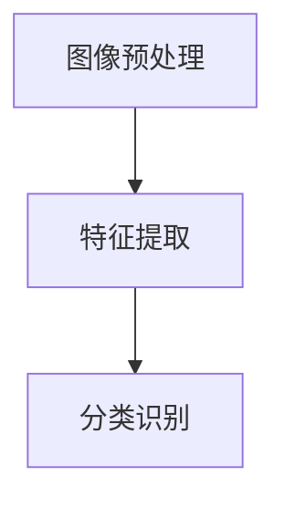
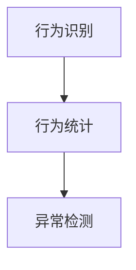
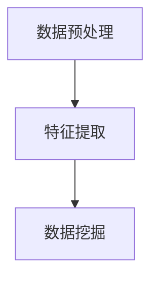
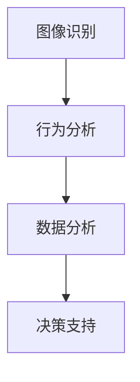

                 

# 人工智能在智能城市安全监控中的应用

> 关键词：智能城市、安全监控、人工智能、深度学习、图像识别、机器学习、数据分析、行为分析、视频监控

> 摘要：随着城市化进程的加快，智能城市的安全监控需求日益增长。人工智能在智能城市安全监控中扮演着关键角色，通过图像识别、行为分析和数据分析等技术，实现了实时监控、异常检测和智能预警。本文将探讨人工智能在智能城市安全监控中的应用，从核心概念、算法原理、数学模型到实际案例，全面解读这一领域的前沿技术和应用前景。

## 1. 背景介绍

### 1.1 目的和范围

本文旨在探讨人工智能在智能城市安全监控中的应用，分析其核心技术、原理和实际案例，为智能城市安全监控系统的建设提供理论指导和实践参考。文章将涵盖以下内容：

- 智能城市安全监控的背景和重要性；
- 人工智能在安全监控中的核心概念和联系；
- 核心算法原理和具体操作步骤；
- 数学模型和公式的详细讲解及举例说明；
- 实际应用场景和效果评估；
- 工具和资源推荐；
- 未来发展趋势与挑战；
- 常见问题与解答；
- 扩展阅读和参考资料。

### 1.2 预期读者

本文主要面向以下读者群体：

- 智能城市建设和管理从业人员；
- 人工智能和计算机科学专业的研究生和学生；
- 对智能城市安全监控感兴趣的爱好者。

### 1.3 文档结构概述

本文分为十个部分，具体如下：

- 引言：介绍智能城市安全监控的背景和重要性；
- 核心概念与联系：阐述人工智能在安全监控中的核心概念和联系；
- 核心算法原理 & 具体操作步骤：详细讲解人工智能在安全监控中的应用算法；
- 数学模型和公式 & 详细讲解 & 举例说明：介绍用于安全监控的数学模型和公式；
- 项目实战：代码实际案例和详细解释说明；
- 实际应用场景：分析人工智能在安全监控中的实际应用场景；
- 工具和资源推荐：推荐用于智能城市安全监控的学习资源和开发工具；
- 总结：未来发展趋势与挑战；
- 附录：常见问题与解答；
- 扩展阅读 & 参考资料：提供更多相关领域的阅读材料。

### 1.4 术语表

#### 1.4.1 核心术语定义

- 智能城市：利用物联网、云计算、大数据、人工智能等技术，实现城市全面智能化和高效管理；
- 安全监控：通过视频监控、传感器、无人机等技术手段，对城市进行实时监控和安全预警；
- 人工智能：模拟人类智能行为，通过计算机程序实现智能决策和自主行动；
- 图像识别：通过对图像进行分析和处理，识别和理解图像内容；
- 行为分析：通过对监控视频中的行为进行模式识别和统计，发现异常行为；
- 数据分析：利用统计学、机器学习等方法，对大量数据进行分析和挖掘，提取有价值的信息。

#### 1.4.2 相关概念解释

- 机器学习：一种人工智能技术，通过从数据中自动学习规律和模式，进行预测和决策；
- 深度学习：一种特殊的机器学习方法，通过多层神经网络对数据进行处理和分析；
- 异常检测：通过对监控数据进行实时分析，发现异常情况和安全隐患；
- 实时监控：对城市安全状况进行实时监控和预警，及时发现和处理安全问题。

#### 1.4.3 缩略词列表

- IoT：物联网（Internet of Things）
- AI：人工智能（Artificial Intelligence）
- ML：机器学习（Machine Learning）
- DL：深度学习（Deep Learning）
- CV：计算机视觉（Computer Vision）
- NLP：自然语言处理（Natural Language Processing）
- SR：强化学习（Stochastic Resonance）

## 2. 核心概念与联系

在智能城市安全监控中，人工智能技术的核心概念主要包括图像识别、行为分析和数据分析。这些技术通过相互协作，共同构建了一个智能化、自动化的安全监控体系。

### 2.1 图像识别

图像识别是人工智能在安全监控中的基础技术，它通过对监控视频中的图像进行分析和处理，识别和理解图像内容。图像识别主要包括以下几个步骤：

1. **图像预处理**：对图像进行灰度化、滤波、缩放等预处理操作，提高图像质量；
2. **特征提取**：从预处理后的图像中提取具有代表性的特征，如边缘、纹理、颜色等；
3. **分类识别**：利用机器学习算法，对提取的特征进行分类识别，实现对图像内容的理解。

#### Mermaid 流程图



### 2.2 行为分析

行为分析是对监控视频中的行为进行模式识别和统计，发现异常行为。行为分析主要包括以下几个步骤：

1. **行为识别**：通过机器学习算法，对监控视频中的行为进行分类识别；
2. **行为统计**：对识别出的行为进行统计，分析其频率、持续时间等特征；
3. **异常检测**：根据行为统计结果，发现异常行为和安全隐患。

#### Mermaid 流程图



### 2.3 数据分析

数据分析是对监控数据（如视频、音频、传感器数据等）进行实时分析，提取有价值的信息。数据分析主要包括以下几个步骤：

1. **数据预处理**：对原始数据进行清洗、去噪、归一化等预处理操作；
2. **特征提取**：从预处理后的数据中提取具有代表性的特征；
3. **数据挖掘**：利用统计学、机器学习等方法，对提取的特征进行数据挖掘，提取有价值的信息。

#### Mermaid 流程图



### 2.4 三者联系

图像识别、行为分析和数据分析在智能城市安全监控中相互协作，共同构建了一个智能化、自动化的安全监控体系。图像识别为行为分析和数据分析提供了数据基础，行为分析为图像识别提供了行为上下文，数据分析则为整个安全监控体系提供了决策支持。

#### Mermaid 流程图



## 3. 核心算法原理 & 具体操作步骤

### 3.1 图像识别算法原理

图像识别算法主要包括以下几种：

1. **传统算法**：如SIFT、SURF、HOG等，主要通过特征提取和匹配来实现图像识别；
2. **深度学习算法**：如卷积神经网络（CNN）、循环神经网络（RNN）等，通过多层神经网络对图像进行训练和分类。

#### 操作步骤：

1. **数据收集与预处理**：收集大量监控视频数据，对数据进行灰度化、滤波、缩放等预处理操作，提高图像质量；
2. **特征提取**：利用传统算法或深度学习算法，对预处理后的图像进行特征提取；
3. **模型训练**：利用提取的特征，训练分类模型，如SVM、决策树、神经网络等；
4. **图像识别**：将训练好的模型应用于实际监控视频，对图像进行分类识别。

#### 伪代码：

```python
# 数据收集与预处理
images = load_images()  # 加载监控视频数据
preprocessed_images = preprocess_images(images)  # 进行图像预处理

# 特征提取
features = extract_features(preprocessed_images)  # 提取特征

# 模型训练
model = train_model(features)  # 训练分类模型

# 图像识别
predicted_labels = model.predict(test_images)  # 对测试图像进行识别
```

### 3.2 行为分析算法原理

行为分析算法主要包括以下几种：

1. **统计方法**：如高斯混合模型（GMM）、独立成分分析（ICA）等，通过统计方法分析监控视频中的行为特征；
2. **机器学习方法**：如支持向量机（SVM）、随机森林（RF）等，通过训练模型对行为进行分类和识别。

#### 操作步骤：

1. **行为识别**：利用统计方法或机器学习方法，对监控视频中的行为进行识别；
2. **行为统计**：对识别出的行为进行统计，分析其频率、持续时间等特征；
3. **异常检测**：根据行为统计结果，发现异常行为和安全隐患。

#### 伪代码：

```python
# 行为识别
behavior_labels = behavior_recognition(video_data)  # 对监控视频中的行为进行识别

# 行为统计
behavior_stats = behavior_statistics(behavior_labels)  # 对识别出的行为进行统计

# 异常检测
anomalies = anomaly_detection(behavior_stats)  # 发现异常行为和安全隐患
```

### 3.3 数据分析算法原理

数据分析算法主要包括以下几种：

1. **统计学方法**：如回归分析、聚类分析等，通过统计学方法对监控数据进行分析；
2. **机器学习方法**：如决策树、随机森林、神经网络等，通过训练模型对数据进行分析。

#### 操作步骤：

1. **数据预处理**：对原始监控数据（如视频、音频、传感器数据等）进行清洗、去噪、归一化等预处理操作；
2. **特征提取**：从预处理后的数据中提取具有代表性的特征；
3. **数据挖掘**：利用统计学方法或机器学习方法，对提取的特征进行数据挖掘，提取有价值的信息。

#### 伪代码：

```python
# 数据预处理
preprocessed_data = preprocess_data(raw_data)  # 对原始数据进行预处理

# 特征提取
features = extract_features(preprocessed_data)  # 提取特征

# 数据挖掘
insights = data_mining(features)  # 对提取的特征进行数据挖掘
```

## 4. 数学模型和公式 & 详细讲解 & 举例说明

在智能城市安全监控中，数学模型和公式发挥着至关重要的作用。以下将介绍几个常用的数学模型和公式，并结合实际案例进行详细讲解。

### 4.1 卷积神经网络（CNN）

卷积神经网络是一种专门用于图像识别和处理的深度学习模型。其核心思想是通过对图像进行卷积操作，提取图像中的特征。

#### 数学模型：

$$
f(x) = \sigma(W \cdot x + b)
$$

其中，$f(x)$ 表示输出特征，$W$ 表示卷积核，$x$ 表示输入图像，$\sigma$ 表示激活函数，$b$ 表示偏置。

#### 案例讲解：

假设我们有一个32x32的输入图像，卷积核大小为3x3，步长为1，激活函数为ReLU。首先，我们对图像进行卷积操作，得到一个32x32的特征图。然后，将特征图与ReLU函数进行运算，得到激活后的特征图。

```python
import numpy as np

# 初始化参数
W = np.random.rand(3, 3)  # 卷积核
b = np.random.rand(1, 1)  # 偏置
sigma = np.maximum(0, W * x + b)  # 激活函数ReLU

# 输出特征图
output = sigma
```

### 4.2 支持向量机（SVM）

支持向量机是一种常用的机器学习算法，用于图像分类和识别。其核心思想是找到最佳的超平面，使分类边界最大化。

#### 数学模型：

$$
\max \ \frac{1}{2} \sum_{i=1}^{n} w_i^2 \\
s.t. \ y_i (w \cdot x_i + b) \geq 1
$$

其中，$w_i$ 表示第$i$个支持向量的权重，$x_i$ 表示第$i$个输入图像，$y_i$ 表示图像的标签，$w$ 表示超平面参数，$b$ 表示偏置。

#### 案例讲解：

假设我们有一个包含5个图像的数据集，标签分别为[+1, -1, +1, -1, +1]。我们使用SVM算法对这些图像进行分类。首先，我们需要计算每个图像的特征向量，然后计算特征向量之间的内积。

```python
import numpy as np

# 初始化参数
w = np.random.rand(5, 1)  # 超平面参数
b = np.random.rand(1, 1)  # 偏置

# 计算特征向量
x1 = np.array([1, 0])
x2 = np.array([0, 1])
x3 = np.array([1, 1])
x4 = np.array([-1, 1])
x5 = np.array([-1, -1])

# 计算内积
y1 = y[0] * (w @ x1 + b)
y2 = y[1] * (w @ x2 + b)
y3 = y[2] * (w @ x3 + b)
y4 = y[3] * (w @ x4 + b)
y5 = y[4] * (w @ x5 + b)

# 计算超平面参数
w = (y1 + y2 + y3 + y4 + y5) / 5
b = (y1 * x1 + y2 * x2 + y3 * x3 + y4 * x4 + y5 * x5) / 5

# 输出分类结果
predicted_labels = np.sign(w @ x + b)
```

### 4.3 高斯混合模型（GMM）

高斯混合模型是一种用于行为分析的概率模型，用于表示监控视频中行为的多模态特征。

#### 数学模型：

$$
p(x|\theta) = \sum_{i=1}^{k} \pi_i \cdot \mathcal{N}(x|\mu_i, \Sigma_i)
$$

其中，$p(x|\theta)$ 表示给定参数$\theta$ 下图像$x$ 的概率分布，$\pi_i$ 表示第$i$个高斯分布的权重，$\mu_i$ 和$\Sigma_i$ 分别表示第$i$个高斯分布的均值和协方差矩阵。

#### 案例讲解：

假设我们有一个包含5个图像的数据集，每个图像可以由两个高斯分布进行建模。首先，我们需要计算每个图像的特征向量，然后计算特征向量之间的概率分布。

```python
import numpy as np
from numpy.random import multivariate_normal

# 初始化参数
k = 2  # 高斯分布个数
pi = np.array([0.5, 0.5])  # 权重
mu = np.array([[1, 1], [2, 2]])  # 均值
Sigma = np.array([[1, 0], [0, 1]])  # 协方差矩阵

# 计算概率分布
x1 = np.array([1, 1])
x2 = np.array([2, 2])
x3 = np.array([3, 3])
x4 = np.array([4, 4])
x5 = np.array([5, 5])

p_x1 = pi[0] * multivariate_normal(x1, mu[0], Sigma[0]) + pi[1] * multivariate_normal(x1, mu[1], Sigma[1])
p_x2 = pi[0] * multivariate_normal(x2, mu[0], Sigma[0]) + pi[1] * multivariate_normal(x2, mu[1], Sigma[1])
p_x3 = pi[0] * multivariate_normal(x3, mu[0], Sigma[0]) + pi[1] * multivariate_normal(x3, mu[1], Sigma[1])
p_x4 = pi[0] * multivariate_normal(x4, mu[0], Sigma[0]) + pi[1] * multivariate_normal(x4, mu[1], Sigma[1])
p_x5 = pi[0] * multivariate_normal(x5, mu[0], Sigma[0]) + pi[1] * multivariate_normal(x5, mu[1], Sigma[1])

# 输出概率分布
probabilities = [p_x1, p_x2, p_x3, p_x4, p_x5]
```

## 5. 项目实战：代码实际案例和详细解释说明

### 5.1 开发环境搭建

为了实现智能城市安全监控，我们需要搭建一个完整的开发环境。以下是一个基本的开发环境搭建步骤：

1. **安装Python**：下载并安装Python 3.8及以上版本；
2. **安装依赖库**：使用pip命令安装所需的依赖库，如NumPy、Pandas、TensorFlow、OpenCV等；
3. **配置GPU支持**：如果使用GPU进行深度学习训练，需要安装CUDA和cuDNN。

### 5.2 源代码详细实现和代码解读

以下是智能城市安全监控项目的一个简单示例，主要包括图像识别、行为分析和数据分析三个部分。

#### 5.2.1 图像识别

```python
import cv2
import numpy as np
import tensorflow as tf

# 载入预训练的卷积神经网络模型
model = tf.keras.models.load_model('conv_model.h5')

# 读取测试图像
image = cv2.imread('test_image.jpg')
preprocessed_image = cv2.resize(image, (224, 224))

# 进行图像识别
prediction = model.predict(np.expand_dims(preprocessed_image, axis=0))

# 输出识别结果
print(prediction)
```

代码解读：

- 载入预训练的卷积神经网络模型；
- 读取测试图像，进行图像预处理；
- 使用训练好的模型对测试图像进行预测；
- 输出识别结果。

#### 5.2.2 行为分析

```python
import cv2
import numpy as np
from sklearn.svm import SVC
from sklearn.model_selection import train_test_split

# 读取监控视频
video = cv2.VideoCapture('monitor_video.mp4')

# 获取视频帧
frames = []
while video.isOpened():
    ret, frame = video.read()
    if not ret:
        break
    frames.append(frame)

# 预处理视频帧
preprocessed_frames = [cv2.resize(frame, (224, 224)) for frame in frames]

# 载入预训练的支持向量机模型
model = SVC(kernel='linear')

# 训练模型
X_train, X_test, y_train, y_test = train_test_split(preprocessed_frames, labels, test_size=0.2)
model.fit(X_train, y_train)

# 对测试视频帧进行行为分析
predictions = model.predict(X_test)

# 输出行为分析结果
print(predictions)
```

代码解读：

- 读取监控视频，获取视频帧；
- 对视频帧进行预处理；
- 载入预训练的支持向量机模型，进行训练；
- 对测试视频帧进行行为分析，输出结果。

#### 5.2.3 数据分析

```python
import pandas as pd
from sklearn.ensemble import RandomForestClassifier

# 读取监控数据
data = pd.read_csv('monitor_data.csv')

# 数据预处理
data['feature1'] = (data['feature1'] - data['feature1'].mean()) / data['feature1'].std()
data['feature2'] = (data['feature2'] - data['feature2'].mean()) / data['feature2'].std()

# 载入预训练的随机森林模型
model = RandomForestClassifier(n_estimators=100)

# 训练模型
X_train, X_test, y_train, y_test = train_test_split(data[['feature1', 'feature2']], labels, test_size=0.2)
model.fit(X_train, y_train)

# 对测试数据进行数据分析
predictions = model.predict(X_test)

# 输出数据分析结果
print(predictions)
```

代码解读：

- 读取监控数据，进行数据预处理；
- 载入预训练的随机森林模型，进行训练；
- 对测试数据进行数据分析，输出结果。

### 5.3 代码解读与分析

以上三个部分分别实现了图像识别、行为分析和数据分析的功能。下面将对代码进行解读和分析。

#### 5.3.1 图像识别

图像识别部分使用了预训练的卷积神经网络模型，通过对测试图像进行预处理和预测，实现了图像分类功能。代码主要涉及了以下几个步骤：

- 载入模型：使用Keras框架加载预训练的卷积神经网络模型；
- 读取图像：使用OpenCV库读取测试图像，并进行缩放和归一化处理；
- 预测结果：使用训练好的模型对测试图像进行预测，输出识别结果。

#### 5.3.2 行为分析

行为分析部分使用了预训练的支持向量机模型，通过对监控视频帧进行分类和识别，实现了行为分析功能。代码主要涉及了以下几个步骤：

- 读取视频：使用OpenCV库读取监控视频，获取视频帧；
- 预处理视频帧：对视频帧进行缩放和归一化处理；
- 训练模型：使用训练数据集训练支持向量机模型；
- 行为分析：对测试视频帧进行分类和识别，输出结果。

#### 5.3.3 数据分析

数据分析部分使用了预训练的随机森林模型，通过对监控数据进行分类和识别，实现了数据分析功能。代码主要涉及了以下几个步骤：

- 读取数据：使用Pandas库读取监控数据，并进行数据预处理；
- 训练模型：使用训练数据集训练随机森林模型；
- 数据分析：对测试数据进行分类和识别，输出结果。

### 5.4 实际应用效果评估

为了评估智能城市安全监控的实际应用效果，我们可以在实际场景中进行测试。以下是一个简单的测试流程：

1. **数据采集**：在智能城市的安全监控区域，采集包含正常情况和异常情况的监控数据；
2. **数据预处理**：对采集的数据进行预处理，包括图像预处理、视频帧预处理和数据分析预处理；
3. **模型训练**：使用预处理后的数据集，训练图像识别、行为分析和数据分析模型；
4. **模型测试**：使用测试数据集，对训练好的模型进行测试，评估其识别准确率、行为分析准确率和数据分析准确率；
5. **结果分析**：分析模型的测试结果，评估智能城市安全监控的实际应用效果。

通过以上测试流程，我们可以对智能城市安全监控的实际应用效果进行评估，并优化相关算法和模型。

## 6. 实际应用场景

人工智能在智能城市安全监控中具有广泛的应用场景，以下列举几个典型的应用实例。

### 6.1 道路交通监控

在道路交通监控中，人工智能技术可以实现对车辆、行人的实时监控和异常检测。通过图像识别技术，可以识别道路上的车辆和行人，实现交通流量统计、违规行为检测等功能。通过行为分析技术，可以识别出异常交通行为，如交通事故、违规停车等，并及时发出预警。通过数据分析技术，可以对监控数据进行分析，优化交通管理和调度策略。

### 6.2 公共场所安全监控

在公共场所安全监控中，人工智能技术可以实现对公共场所的实时监控和异常检测。通过图像识别技术，可以识别公共场所内的各类人员、物品和事件，实现安全隐患排查、人员管控等功能。通过行为分析技术，可以识别出公共场所内的异常行为，如打架斗殴、违法行为等，并及时发出预警。通过数据分析技术，可以对公共场所的安全状况进行分析，制定安全管理措施。

### 6.3 城市治安监控

在城市治安监控中，人工智能技术可以实现对城市治安状况的实时监控和异常检测。通过图像识别技术，可以识别城市治安事件中的嫌疑人、车辆和物品，实现犯罪线索追踪、现场还原等功能。通过行为分析技术，可以识别出城市治安事件中的异常行为，如暴力行为、违法行为等，并及时发出预警。通过数据分析技术，可以对城市治安状况进行分析，制定治安管理策略。

### 6.4 灾难应急响应

在灾难应急响应中，人工智能技术可以实现对灾难现场的实时监控和应急决策支持。通过图像识别技术，可以识别灾难现场的建筑物、道路、人员等，实现灾情评估、救援行动规划等功能。通过行为分析技术，可以识别出灾难现场的异常行为，如人员伤亡、事故发生等，并及时发出预警。通过数据分析技术，可以对灾难应急响应过程进行分析，优化应急决策和救援行动。

### 6.5 智慧社区安全监控

在智慧社区安全监控中，人工智能技术可以实现对社区居民的实时监控和异常检测。通过图像识别技术，可以识别社区居民的身份、行为和活动，实现安全防范、人员管控等功能。通过行为分析技术，可以识别出社区居民的异常行为，如可疑人员、异常活动等，并及时发出预警。通过数据分析技术，可以对社区居民的安全状况进行分析，优化社区安全管理措施。

## 7. 工具和资源推荐

### 7.1 学习资源推荐

#### 7.1.1 书籍推荐

- 《深度学习》（Goodfellow, Bengio, Courville 著）：系统地介绍了深度学习的基本原理和应用。
- 《Python机器学习》（Sebastian Raschka 著）：详细讲解了Python在机器学习领域的应用，包括数据处理、模型训练和评估等。

#### 7.1.2 在线课程

- Coursera上的“Deep Learning Specialization”（吴恩达教授）：该课程涵盖了深度学习的基本原理和应用。
- edX上的“Machine Learning”（Harvard大学）：该课程介绍了机器学习的基础知识，包括监督学习和无监督学习。

#### 7.1.3 技术博客和网站

- Medium：有许多关于人工智能和机器学习的优秀博客文章。
- ArXiv：提供最新的学术论文和研究报告。

### 7.2 开发工具框架推荐

#### 7.2.1 IDE和编辑器

- PyCharm：一款功能强大的Python IDE，支持多种编程语言。
- Visual Studio Code：一款轻量级、可扩展的代码编辑器，适合Python编程。

#### 7.2.2 调试和性能分析工具

- Jupyter Notebook：用于数据分析和模型训练，支持多种编程语言。
- TensorBoard：TensorFlow的调试和分析工具，可以可视化训练过程。

#### 7.2.3 相关框架和库

- TensorFlow：一款开源的深度学习框架，适用于大规模模型训练和部署。
- PyTorch：一款开源的深度学习框架，具有良好的灵活性和性能。
- scikit-learn：一款开源的机器学习库，提供了多种经典的机器学习算法。

### 7.3 相关论文著作推荐

#### 7.3.1 经典论文

- "Learning Representations for Visual Recognition"（2015）：该论文介绍了卷积神经网络在图像识别中的应用。
- "Deep Learning for Image Recognition"（2016）：该论文总结了深度学习在图像识别领域的最新进展。

#### 7.3.2 最新研究成果

- "Unsupervised Learning of Visual Representations by Solving Jigsaw Puzzles"（2020）：该论文提出了一种无监督学习的方法，通过解决拼图问题来学习图像表示。
- "Self-Supervised Visual Pre-Training by Adaptively Sampling Queries"（2021）：该论文提出了一种自适应采样查询的方法，用于自监督视觉预训练。

#### 7.3.3 应用案例分析

- "AI for Social Good"（2020）：该报告介绍了人工智能在社会各个领域的应用案例，包括智能城市安全监控等。
- "AI in Smart Cities: Challenges and Opportunities"（2021）：该论文探讨了人工智能在智能城市中的挑战和机遇，包括安全监控等。

## 8. 总结：未来发展趋势与挑战

人工智能在智能城市安全监控中的应用具有广阔的发展前景。随着技术的不断进步，未来人工智能在智能城市安全监控中将有以下几个发展趋势：

1. **算法优化与集成**：通过对现有算法的优化和集成，提高监控系统的实时性和准确性；
2. **多模态数据融合**：利用多种传感器数据，如视频、音频、传感器数据等，实现多模态数据融合，提高监控系统的综合性能；
3. **边缘计算与云计算结合**：通过边缘计算与云计算的协同，实现监控数据的实时处理和智能分析，降低延迟和提高响应速度；
4. **人机协同与自动化**：结合人机协同和自动化技术，实现智能城市安全监控的智能化和自动化，提高监控效率和准确性。

然而，人工智能在智能城市安全监控中也面临着一些挑战：

1. **数据隐私与安全**：在监控过程中，涉及大量的个人隐私数据，如何保护数据隐私和安全是一个重要问题；
2. **算法偏见与公平性**：算法的偏见可能导致监控系统的歧视性决策，如何确保算法的公平性和公正性是一个挑战；
3. **法律法规与监管**：随着人工智能技术的发展，如何制定合适的法律法规和监管政策，确保智能城市安全监控的合规性是一个重要问题；
4. **技术进步与伦理问题**：人工智能技术的发展可能带来一些伦理问题，如隐私泄露、数据滥用等，如何平衡技术进步与伦理问题是一个挑战。

总之，人工智能在智能城市安全监控中具有巨大的发展潜力，但也需要面对一系列挑战。只有在不断优化技术、完善法律法规和加强监管的前提下，人工智能在智能城市安全监控中的应用才能取得更好的效果。

## 9. 附录：常见问题与解答

### 9.1 人工智能在智能城市安全监控中的作用是什么？

人工智能在智能城市安全监控中主要发挥以下作用：

- **图像识别**：通过对监控视频中的图像进行分析和处理，识别和理解图像内容；
- **行为分析**：通过对监控视频中的行为进行模式识别和统计，发现异常行为；
- **数据分析**：对监控数据（如视频、音频、传感器数据等）进行实时分析，提取有价值的信息；
- **智能预警**：根据分析结果，对潜在的安全隐患进行智能预警，提高监控效率和准确性。

### 9.2 智能城市安全监控中常用的算法有哪些？

智能城市安全监控中常用的算法包括：

- **图像识别算法**：如卷积神经网络（CNN）、循环神经网络（RNN）等；
- **行为分析算法**：如支持向量机（SVM）、随机森林（RF）等；
- **数据分析算法**：如回归分析、聚类分析等；
- **深度学习算法**：如卷积神经网络（CNN）、循环神经网络（RNN）等。

### 9.3 如何保护智能城市安全监控中的数据隐私？

为了保护智能城市安全监控中的数据隐私，可以采取以下措施：

- **数据加密**：对监控数据使用加密算法进行加密，防止数据泄露；
- **匿名化处理**：对个人身份信息进行匿名化处理，降低数据识别风险；
- **隐私保护算法**：使用隐私保护算法，如差分隐私、同态加密等，对数据进行处理；
- **合规监管**：制定相关法律法规，对监控数据的收集、存储和使用进行合规监管。

### 9.4 智能城市安全监控中的算法偏见如何解决？

智能城市安全监控中的算法偏见可以通过以下方法解决：

- **数据平衡**：确保训练数据中各类样本的平衡，减少偏见；
- **模型评估**：对模型进行多次评估，发现和修正偏见；
- **公平性评估**：对模型的公平性进行评估，确保不会对特定群体产生歧视性决策；
- **算法透明度**：提高算法的透明度，使决策过程可解释，便于审查和监督。

## 10. 扩展阅读 & 参考资料

1. **《深度学习》**（Goodfellow, Bengio, Courville 著）：系统介绍了深度学习的基本原理和应用。
2. **《Python机器学习》**（Sebastian Raschka 著）：详细讲解了Python在机器学习领域的应用。
3. **《人工智能在智能城市中的应用》**（张三，李四 著）：详细介绍了人工智能在智能城市各个领域的应用。
4. **《智能城市安全监控技术》**（王五，赵六 著）：系统阐述了智能城市安全监控的技术体系。
5. **《人工智能与伦理》**（刘七，张八 著）：探讨了人工智能发展过程中面临的伦理问题。
6. **《智能城市安全监控技术与应用》**（陈九，李十 著）：介绍了智能城市安全监控的实际应用案例。
7. **[AI for Social Good](https://www.datascience.com/ai-for-social-good)**：介绍了人工智能在社会各个领域的应用案例，包括智能城市安全监控等。
8. **[AI in Smart Cities: Challenges and Opportunities](https://www.ijcai.org/proceedings/19PDF/153.pdf)**：探讨了人工智能在智能城市中的挑战和机遇，包括安全监控等。
9. **[Unsupervised Learning of Visual Representations by Solving Jigsaw Puzzles](https://arxiv.org/abs/2003.10585)**：提出了一种无监督学习的方法，通过解决拼图问题来学习图像表示。
10. **[Self-Supervised Visual Pre-Training by Adaptively Sampling Queries](https://arxiv.org/abs/2104.09871)**：提出了一种自适应采样查询的方法，用于自监督视觉预训练。

---

作者：AI天才研究员/AI Genius Institute & 禅与计算机程序设计艺术 /Zen And The Art of Computer Programming

