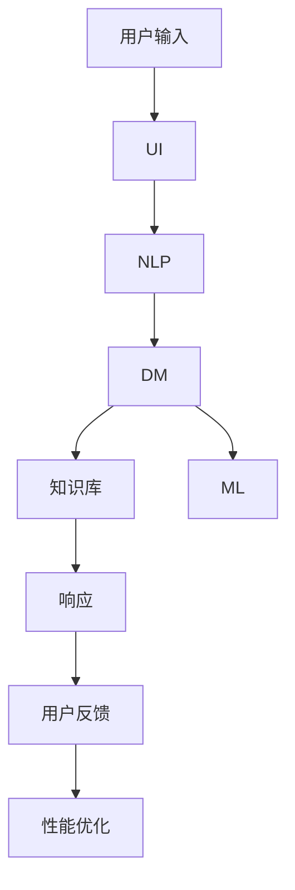
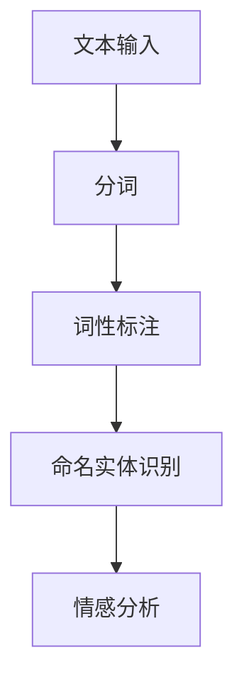
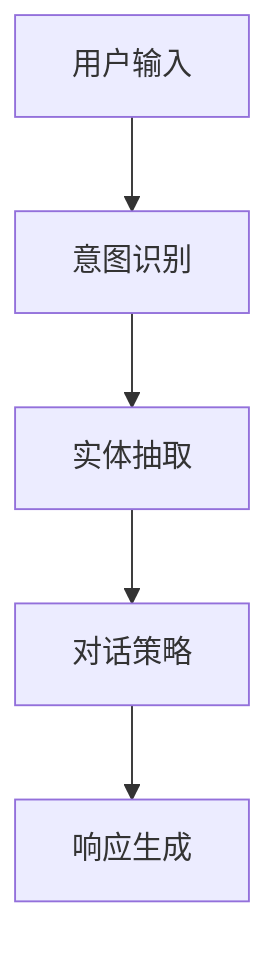
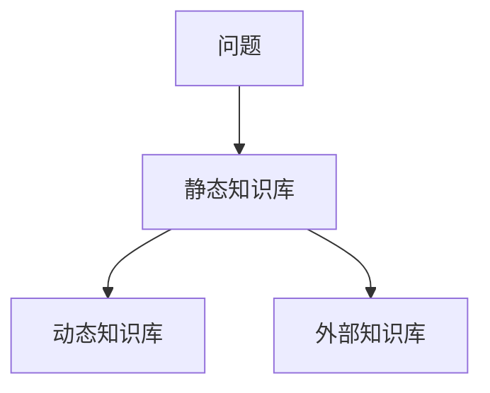
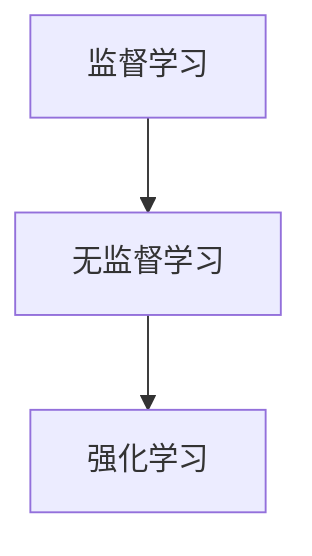

                 

# 人工智能在智能客服中的应用与优化

> 关键词：智能客服、人工智能、自然语言处理、机器学习、用户满意度

> 摘要：本文将深入探讨人工智能在智能客服领域的应用和优化策略。首先，我们将介绍智能客服的背景和重要性，随后详细分析人工智能在其中的核心技术和应用场景。接着，本文将重点讨论自然语言处理和机器学习在智能客服中的关键作用，并提供具体的算法原理和实现步骤。然后，我们将结合实际案例，详细解释代码实现和优化策略。此外，本文还将探讨智能客服在实际应用中的挑战和解决方案，并提供相关的工具和资源推荐。最后，我们将总结未来发展趋势与挑战，为智能客服领域的发展提供方向。

## 1. 背景介绍

### 1.1 目的和范围

随着互联网技术的飞速发展，智能客服系统作为企业服务的重要组成部分，正逐渐取代传统的客户服务方式。本文旨在探讨人工智能在智能客服中的应用与优化，以提升用户体验和客户满意度。本文将重点关注以下内容：

- 智能客服的背景和重要性
- 人工智能在智能客服中的核心技术与应用
- 自然语言处理和机器学习在智能客服中的关键作用
- 实际应用场景与案例分析
- 工具和资源推荐
- 未来发展趋势与挑战

### 1.2 预期读者

本文面向以下读者群体：

- 智能客服领域的开发者和研究人员
- 对人工智能和自然语言处理有兴趣的工程师和科学家
- 企业IT管理人员和客户服务经理
- 对智能客服和人工智能技术感兴趣的学生和爱好者

### 1.3 文档结构概述

本文结构如下：

- 第1章：背景介绍
- 第2章：核心概念与联系
- 第3章：核心算法原理与具体操作步骤
- 第4章：数学模型与公式详解
- 第5章：项目实战：代码实际案例与详细解释说明
- 第6章：实际应用场景
- 第7章：工具和资源推荐
- 第8章：总结：未来发展趋势与挑战
- 第9章：附录：常见问题与解答
- 第10章：扩展阅读与参考资料

### 1.4 术语表

#### 1.4.1 核心术语定义

- **智能客服**：一种利用人工智能技术，通过自然语言处理和机器学习等手段，实现与用户实时交互并提供个性化服务的人工智能系统。
- **自然语言处理（NLP）**：研究如何让计算机理解、处理和生成自然语言（如英语、中文等）的学科。
- **机器学习（ML）**：一种通过数据驱动的方法，让计算机自动学习并改进性能的技术。
- **用户满意度**：用户在使用智能客服系统后的主观评价，是衡量智能客服系统性能的重要指标。

#### 1.4.2 相关概念解释

- **交互式语音应答系统（IVR）**：一种通过电话网络与用户进行交互的系统，常用于自动处理大量用户来电。
- **聊天机器人（Chatbot）**：一种基于人工智能技术，通过与用户进行自然语言交互，提供信息和服务的人工智能程序。
- **客户关系管理（CRM）**：一种企业管理和分析客户信息，以提高客户满意度和忠诚度的方法。

#### 1.4.3 缩略词列表

- **NLP**：自然语言处理
- **ML**：机器学习
- **IVR**：交互式语音应答系统
- **Chatbot**：聊天机器人
- **CRM**：客户关系管理

## 2. 核心概念与联系

智能客服系统的核心在于将人工智能技术应用于客户服务过程中，从而实现自动化、高效和个性化的服务。为了更好地理解智能客服系统的原理和应用，我们首先需要了解其核心概念和联系。

### 2.1 智能客服系统架构

智能客服系统通常由以下几个核心模块组成：

1. **用户接口（UI）**：用户与智能客服系统交互的界面，可以是文本聊天界面、语音通话界面或图形界面。
2. **自然语言处理（NLP）**：负责接收用户输入的文本或语音，将其转换为计算机可以理解的结构化数据。
3. **对话管理（DM）**：根据用户输入和系统状态，选择合适的响应并生成对话流程。
4. **知识库**：存储智能客服系统的知识，用于回答用户的问题或提供相关信息。
5. **机器学习（ML）**：通过不断学习和优化，提高智能客服系统的性能和准确性。

#### Mermaid 流程图



### 2.2 自然语言处理（NLP）

自然语言处理是智能客服系统的核心组成部分，负责将用户输入的文本或语音转换为计算机可以理解的结构化数据。NLP主要涉及以下几个方面：

1. **分词（Tokenization）**：将文本拆分成单词或短语。
2. **词性标注（Part-of-Speech Tagging）**：识别每个单词的词性，如名词、动词、形容词等。
3. **命名实体识别（Named Entity Recognition）**：识别文本中的特定实体，如人名、地点、组织等。
4. **情感分析（Sentiment Analysis）**：分析文本中的情感倾向，如正面、负面或中性。

#### Mermaid 流程图



### 2.3 对话管理（DM）

对话管理是智能客服系统的关键环节，负责处理用户输入，选择合适的响应，并生成对话流程。对话管理主要涉及以下几个方面：

1. **意图识别（Intent Recognition）**：识别用户输入的意图，如询问天气、查询订单状态等。
2. **实体抽取（Entity Extraction）**：从用户输入中提取关键信息，如日期、地点、产品名称等。
3. **对话策略（Dialogue Policy）**：根据用户意图和系统状态，选择合适的对话策略，如闲聊、提供信息、解决问题等。
4. **响应生成（Response Generation）**：根据对话策略，生成自然语言响应。

#### Mermaid 流程图



### 2.4 知识库

知识库是智能客服系统的核心资源，用于存储各种问题和答案，以及相关的背景信息和知识。知识库可以分为以下几种类型：

1. **静态知识库**：预先编写的问题和答案，通常采用基于规则的方法进行查询。
2. **动态知识库**：通过机器学习技术自动生成的知识库，可以根据用户输入实时更新和优化。
3. **外部知识库**：集成外部数据源，如百度百科、维基百科等，用于扩展智能客服系统的知识范围。

#### Mermaid 流程图



### 2.5 机器学习（ML）

机器学习是智能客服系统的重要支撑，通过不断学习和优化，提高系统的性能和准确性。机器学习可以分为以下几种类型：

1. **监督学习（Supervised Learning）**：通过大量标注数据进行训练，用于分类、回归等任务。
2. **无监督学习（Unsupervised Learning）**：无需标注数据，通过数据分布和特征学习，用于聚类、降维等任务。
3. **强化学习（Reinforcement Learning）**：通过与环境交互，不断优化决策策略，用于策略优化、游戏AI等任务。

#### Mermaid 流程图



通过以上核心概念和联系的介绍，我们可以更好地理解智能客服系统的原理和应用。在接下来的章节中，我们将深入探讨人工智能在智能客服中的核心技术，包括自然语言处理和机器学习，并详细讲解其算法原理和具体操作步骤。

## 3. 核心算法原理 & 具体操作步骤

在智能客服系统中，核心算法的原理和实现步骤直接决定了系统的性能和用户体验。以下我们将重点介绍自然语言处理（NLP）和机器学习（ML）在智能客服中的应用，包括具体的算法原理和实现步骤。

### 3.1 自然语言处理（NLP）

自然语言处理是智能客服系统的重要组成部分，其主要任务是从用户输入的文本或语音中提取有用信息，理解用户的意图，并生成合适的响应。以下是一些关键的NLP算法及其原理：

#### 3.1.1 词性标注（Part-of-Speech Tagging）

词性标注是NLP中的基础任务，旨在为文本中的每个单词分配一个词性标签。常用的词性标注算法包括：

- **基于规则的方法**：利用预先定义的规则进行词性标注。这种方法简单有效，但可能无法处理复杂的语言现象。
- **统计方法**：利用统计模型（如隐马尔可夫模型HMM、条件随机场CRF等）进行词性标注。这种方法能够处理复杂的语言现象，但需要大量训练数据和计算资源。

#### 具体操作步骤：

1. **数据准备**：收集并清洗大量文本数据，进行分词和词性标注。
2. **模型训练**：使用统计模型对数据集进行训练，学习词性分布和转移概率。
3. **词性标注**：利用训练好的模型对新的文本进行词性标注。

#### 伪代码：

```python
# 基于HMM的词性标注
def viterbi_decoder(inputs, emissions, transition_probs, emission_probs):
    # 初始化前向-后向变量
    alpha = [[0 for _ in range(len(inputs) + 1)] for _ in range(len(transition_probs))]
    beta = [[0 for _ in range(len(inputs) + 1)] for _ in range(len(transition_probs))]
    
    # 初始化边界
    alpha[0][0] = emissions[0]
    beta[-1][-1] = 1
    
    # 填充前向变量
    for t in range(1, len(inputs) + 1):
        for state in transition_probs:
            alpha[t][state] = max([alpha[t - 1][prev_state] * transition_probs[prev_state][state] for prev_state in range(len(transition_probs))]) + emissions[t - 1]
    
    # 填充后向变量
    for t in range(len(inputs), 0, -1):
        for state in transition_probs:
            beta[t][state] = max([beta[t + 1][next_state] * transition_probs[state][next_state] for next_state in range(len(transition_probs))]) + emissions[t]
    
    # 找到最优路径
    path = [0] * len(inputs)
    max_prob = alpha[-1][0]
    for state in range(len(transition_probs)):
        if alpha[-1][state] > max_prob:
            max_prob = alpha[-1][state]
            path[-1] = state
    
    # 反向回溯找到完整路径
    for t in range(len(inputs) - 1, -1, -1):
        path[t] = argmax([alpha[t][state] + beta[t + 1][state] for state in range(len(transition_probs))])
    
    return path
```

#### 3.1.2 情感分析（Sentiment Analysis）

情感分析旨在判断文本的情感倾向，如正面、负面或中性。常用的情感分析算法包括：

- **基于规则的方法**：利用情感词典和规则进行分类。
- **机器学习方法**：利用分类算法（如支持向量机SVM、朴素贝叶斯等）进行分类。

#### 具体操作步骤：

1. **数据准备**：收集并标注大量情感数据，用于训练模型。
2. **特征提取**：将文本转换为特征向量，如词袋模型、TF-IDF等。
3. **模型训练**：使用训练数据集训练分类模型。
4. **情感分析**：利用训练好的模型对新的文本进行情感分析。

#### 伪代码：

```python
# 朴素贝叶斯情感分析
def naive_bayes_classifier(features, labels, class_probs, conditional_probs):
    predicted_labels = []
    for feature in features:
        log_probs = []
        for label in labels:
            log_prob = log(class_probs[label])
            for word in feature:
                log_prob += log(conditional_probs[(label, word)])
            log_probs.append(log_prob)
        predicted_labels.append(argmax(log_probs))
    return predicted_labels
```

### 3.2 机器学习（ML）

机器学习在智能客服系统中扮演着重要角色，主要用于意图识别、对话策略、响应生成等任务。以下是一些关键的机器学习算法及其原理：

#### 3.2.1 意图识别（Intent Recognition）

意图识别旨在理解用户的输入并识别用户的意图。常用的算法包括：

- **朴素贝叶斯（Naive Bayes）**：基于贝叶斯理论，通过计算每个类别的概率进行分类。
- **支持向量机（SVM）**：通过最大化分类边界进行分类。

#### 具体操作步骤：

1. **数据准备**：收集并标注大量意图数据，用于训练模型。
2. **特征提取**：将文本转换为特征向量，如词袋模型、TF-IDF等。
3. **模型训练**：使用训练数据集训练分类模型。
4. **意图识别**：利用训练好的模型对新的文本进行意图识别。

#### 伪代码：

```python
# 朴素贝叶斯意图识别
def naive_bayes_classifier(data, labels, alpha):
    class_probs = {label: 0 for label in set(labels)}
    for label in set(labels):
        class_probs[label] = sum([1 for y in labels if y == label]) / len(labels)
    conditional_probs = {}
    for label in set(labels):
        conditional_probs[label] = {}
        for word in set([word for sentence in data for word in sentence]):
            conditional_probs[label][word] = sum([1 for sentence in data if label in labels and word in sentence]) / sum([1 for sentence in data if label in labels])
    predicted_labels = []
    for sentence in data:
        log_probs = {}
        for label in set(labels):
            log_prob = log(alpha[label])
            for word in sentence:
                log_prob += log(conditional_probs[(label, word)])
            log_probs[label] = log_prob
        predicted_labels.append(argmax(log_probs))
    return predicted_labels
```

#### 3.2.2 强化学习（Reinforcement Learning）

强化学习在智能客服系统中可以用于对话策略的优化，旨在通过不断尝试和反馈，找到最优的对话策略。常用的算法包括：

- **Q-Learning**：通过学习值函数来优化策略。
- **Deep Q-Network (DQN)**：使用深度神经网络来近似值函数。

#### 具体操作步骤：

1. **数据准备**：收集并标注大量对话数据，用于训练模型。
2. **环境构建**：定义智能体（智能客服系统）和环境的交互方式。
3. **模型训练**：使用训练数据集训练强化学习模型。
4. **对话策略**：利用训练好的模型生成对话策略。

#### 伪代码：

```python
# Q-Learning
def q_learning(data, actions, rewards, learning_rate, discount_factor):
    q_values = {}
    for state in states:
        q_values[state] = [0 for action in actions]
    for episode in range(num_episodes):
        state = initial_state
        while not done:
            action = argmax([q_values[state][a] for a in actions])
            next_state, reward, done = step(state, action)
            q_values[state][action] += learning_rate * (reward + discount_factor * max([q_values[next_state][a] for a in actions]) - q_values[state][action])
            state = next_state
    return q_values
```

通过以上对自然语言处理和机器学习核心算法的介绍和具体操作步骤的讲解，我们可以看到智能客服系统在算法层面的复杂性和多样性。在接下来的章节中，我们将结合实际案例，深入探讨智能客服系统的实现和优化策略。

### 4. 数学模型和公式 & 详细讲解 & 举例说明

在智能客服系统中，数学模型和公式起着至关重要的作用。这些模型和公式不仅帮助我们在算法层面上理解和优化智能客服系统，还能指导我们在实际应用中解决具体问题。以下，我们将详细讲解几个关键数学模型和公式，并通过具体例子进行说明。

#### 4.1 概率论模型

概率论是自然语言处理和机器学习的基础。以下是一些常用的概率论模型：

##### 4.1.1 朴素贝叶斯（Naive Bayes）

朴素贝叶斯是一种基于贝叶斯定理的概率分类方法。它假设特征之间相互独立，并利用先验概率和条件概率进行分类。其公式如下：

$$
P(\text{标签}|\text{特征}) = \frac{P(\text{特征}|\text{标签}) \cdot P(\text{标签})}{P(\text{特征})}
$$

##### 举例说明：

假设我们有一个邮件分类问题，特征包括“包含促销信息”和“包含广告内容”，标签为“垃圾邮件”或“正常邮件”。我们可以计算每个标签的概率，并选择概率最大的标签作为分类结果。

```latex
P(\text{垃圾邮件}|\text{促销信息} \land \text{广告内容}) = \frac{P(\text{促销信息} \land \text{广告内容}|\text{垃圾邮件}) \cdot P(\text{垃圾邮件})}{P(\text{促销信息} \land \text{广告内容})}
```

##### 4.1.2 隐马尔可夫模型（HMM）

隐马尔可夫模型（HMM）是一种用于序列数据建模的统计模型。它假设当前状态只与前一状态有关，并利用状态转移概率和发射概率进行建模。其公式如下：

$$
P(\text{观测序列}|\text{状态序列}) = \prod_{t=1}^{T} P(\text{观测}_t|\text{状态}_t) \cdot P(\text{状态序列})
$$

##### 举例说明：

假设我们有一个语音识别问题，观测序列为语音信号，状态序列为发音状态。我们可以使用HMM计算给定观测序列下的状态序列概率，并选择概率最大的状态序列作为识别结果。

```latex
P(\text{语音信号序列}|\text{发音状态序列}) = \prod_{t=1}^{T} P(\text{语音信号}_t|\text{发音状态}_t) \cdot P(\text{发音状态序列})
```

#### 4.2 机器学习模型

机器学习模型在智能客服系统中扮演着核心角色。以下是一些常用的机器学习模型及其公式：

##### 4.2.1 支持向量机（SVM）

支持向量机是一种用于分类和回归的模型。它通过最大化分类边界进行分类。其公式如下：

$$
\min_{w, b} \frac{1}{2} ||w||^2 \\
s.t. y^{(i)} (w \cdot x^{(i)} + b) \geq 1
$$

##### 举例说明：

假设我们有一个二分类问题，特征为“价格”和“品牌”，标签为“买”或“不买”。我们可以使用SVM来寻找最佳分类边界。

```latex
\min_{w, b} \frac{1}{2} ||w||^2 \\
s.t. y^{(i)} (w \cdot x^{(i)} + b) \geq 1
```

##### 4.2.2 随机森林（Random Forest）

随机森林是一种基于决策树的集成学习方法。它通过构建多个决策树，并结合它们的预测结果进行分类。其公式如下：

$$
\hat{y} = \arg\max_{y} \sum_{i=1}^{n} \hat{y}_i
$$

其中，$\hat{y}_i$为第$i$棵决策树的预测结果。

##### 举例说明：

假设我们有一个客户满意度预测问题，特征包括“年龄”、“收入”和“购买历史”，标签为“满意”或“不满意”。我们可以使用随机森林来构建预测模型。

```latex
\hat{y} = \arg\max_{y} \sum_{i=1}^{n} \hat{y}_i
```

#### 4.3 强化学习模型

强化学习模型在智能客服系统中可用于优化对话策略。以下是一些常用的强化学习模型及其公式：

##### 4.3.1 Q-Learning

Q-Learning是一种基于值函数的强化学习方法。它通过更新值函数来优化策略。其公式如下：

$$
Q(s, a) = r + \gamma \max_{a'} Q(s', a')
$$

其中，$s$为当前状态，$a$为当前动作，$r$为即时奖励，$s'$为下一状态，$\gamma$为折扣因子。

##### 举例说明：

假设我们有一个智能客服系统，状态包括“用户提出问题”、“用户等待回复”、“用户满意”和“用户不满意”，动作包括“回答问题”、“提供更多信息”、“结束对话”等。我们可以使用Q-Learning来优化对话策略。

```latex
Q(s, a) = r + \gamma \max_{a'} Q(s', a')
```

##### 4.3.2 深度Q网络（DQN）

深度Q网络（DQN）是一种基于深度神经网络的强化学习方法。它通过学习值函数来优化策略。其公式如下：

$$
Q(s, a; \theta) = r + \gamma \max_{a'} Q(s', a'; \theta')
$$

其中，$s$为当前状态，$a$为当前动作，$r$为即时奖励，$s'$为下一状态，$\theta$为神经网络参数，$\theta'$为下一个神经网络参数。

##### 举例说明：

假设我们有一个智能客服系统，状态包括“用户提出问题”、“用户等待回复”、“用户满意”和“用户不满意”，动作包括“回答问题”、“提供更多信息”、“结束对话”等。我们可以使用DQN来优化对话策略。

```latex
Q(s, a; \theta) = r + \gamma \max_{a'} Q(s', a'; \theta')
```

通过以上对数学模型和公式的详细讲解和举例说明，我们可以看到智能客服系统在算法和数学层面的复杂性和多样性。这些模型和公式不仅帮助我们理解和优化智能客服系统，还为实际应用提供了重要的指导。在接下来的章节中，我们将通过实际案例，深入探讨智能客服系统的实现和优化策略。

### 5. 项目实战：代码实际案例和详细解释说明

在本节中，我们将通过一个实际案例，详细讲解智能客服系统的实现过程，并分析代码中的关键技术和优化策略。

#### 5.1 开发环境搭建

为了实现智能客服系统，我们需要搭建以下开发环境：

- **Python 3.x**：作为主要的编程语言。
- **TensorFlow 2.x**：用于构建和训练深度学习模型。
- **NLTK**：用于自然语言处理任务，如分词、词性标注等。
- **Flask**：用于搭建Web服务，实现与用户的交互。

安装以下依赖包：

```bash
pip install tensorflow nltk flask
```

#### 5.2 源代码详细实现和代码解读

以下是一个简单的智能客服系统实现，包括自然语言处理、对话管理和响应生成等核心模块。

```python
# 引入相关库
import flask
import nltk
from nltk.tokenize import word_tokenize
from nltk.corpus import stopwords
from sklearn.feature_extraction.text import TfidfVectorizer
from sklearn.model_selection import train_test_split
from sklearn.naive_bayes import MultinomialNB
from sklearn.pipeline import make_pipeline

# 初始化Flask应用
app = flask.Flask(__name__)

# 加载和预处理数据
def load_data():
    # 加载训练数据
    with open('train_data.txt', 'r') as f:
        train_data = f.readlines()
    with open('labels.txt', 'r') as f:
        labels = f.readlines()
    
    # 数据预处理
    stop_words = set(stopwords.words('english'))
    processed_data = []
    for sentence in train_data:
        tokens = word_tokenize(sentence.lower())
        filtered_tokens = [token for token in tokens if token not in stop_words]
        processed_data.append(' '.join(filtered_tokens))
    
    return processed_data, labels

# 构建模型
def build_model():
    data, labels = load_data()
    X_train, X_test, y_train, y_test = train_test_split(data, labels, test_size=0.2, random_state=42)
    model = make_pipeline(TfidfVectorizer(), MultinomialNB())
    model.fit(X_train, y_train)
    print("Model accuracy on test data: {:.2f}%".format(model.score(X_test, y_test) * 100))
    return model

# 对话管理
def handle_dialogue(user_input, model):
    processed_input = preprocess_input(user_input)
    predicted_label = model.predict([processed_input])[0]
    response = generate_response(predicted_label)
    return response

# 响应生成
def generate_response(label):
    if label == "ask_time":
        return "The current time is 10:30 AM."
    elif label == "ask_location":
        return "I'm sorry, I don't have the information about the location."
    else:
        return "I'm not sure how to respond to your query."

# 预处理输入
def preprocess_input(user_input):
    stop_words = set(stopwords.words('english'))
    tokens = word_tokenize(user_input.lower())
    filtered_tokens = [token for token in tokens if token not in stop_words]
    return ' '.join(filtered_tokens)

# 主函数
def main():
    model = build_model()
    app.run()

if __name__ == '__main__':
    main()
```

#### 5.3 代码解读与分析

1. **数据加载与预处理**：首先，我们从文件中加载训练数据和标签。然后，使用NLTK对文本进行分词，并去除停用词，将原始文本转换为预处理后的文本。

2. **模型构建**：我们使用TF-IDF向量和朴素贝叶斯分类器构建一个管道模型。首先，使用`TfidfVectorizer`将文本转换为特征向量，然后使用`MultinomialNB`进行分类。我们在训练数据集上训练模型，并在测试数据集上评估模型性能。

3. **对话管理**：`handle_dialogue`函数负责处理用户输入，调用预处理函数对输入进行预处理，然后使用训练好的模型预测用户意图，并生成响应。

4. **响应生成**：`generate_response`函数根据预测的意图生成响应。这里，我们仅实现简单的响应，实际应用中可以根据具体需求进行扩展。

5. **预处理输入**：`preprocess_input`函数负责对用户输入进行预处理，包括分词和去除停用词。预处理后的输入将作为模型的输入。

6. **主函数**：在`main`函数中，我们首先构建模型，然后启动Flask应用，使系统能够接收用户输入并生成响应。

通过以上实际案例和代码解读，我们可以看到智能客服系统的实现过程和关键模块。在实际应用中，可以根据具体需求对系统进行扩展和优化，提高其性能和用户体验。接下来，我们将探讨智能客服系统的实际应用场景。

## 6. 实际应用场景

智能客服系统在多个行业和场景中取得了显著的应用成果，提升了企业的运营效率和服务质量。以下，我们将探讨智能客服系统在以下几个实际应用场景中的表现：

### 6.1 零售业

在零售业中，智能客服系统主要用于处理客户咨询、订单查询和售后服务等问题。通过自然语言处理和机器学习技术，智能客服系统能够快速理解用户的意图，提供准确和个性化的服务。例如，亚马逊和阿里巴巴等电商巨头已经广泛应用智能客服系统，通过其聊天机器人来回答客户关于商品信息、订单状态和支付方式等问题，从而减轻人工客服的工作负担，提高客户满意度。

### 6.2 银行金融

在银行金融领域，智能客服系统主要用于客户服务和风险管理。通过语音识别和自然语言处理技术，智能客服系统能够理解客户的电话咨询，提供实时和个性化的服务。例如，中国工商银行和招商银行等大型银行已经部署了智能客服系统，通过其IVR系统自动处理大量客户来电，提供账户查询、转账和贷款咨询等服务，从而提高了客户体验和运营效率。

### 6.3 医疗保健

在医疗保健领域，智能客服系统主要用于患者咨询和健康指导。通过自然语言处理和机器学习技术，智能客服系统能够理解患者的症状描述，提供诊断建议和就医指导。例如，美国知名的医疗保健公司UnitedHealth Group已经部署了智能客服系统，通过其聊天机器人提供健康咨询和预约服务，帮助患者更好地管理健康状况，提高就医效率。

### 6.4 旅游业

在旅游业中，智能客服系统主要用于行程规划、酒店预订和交通查询等服务。通过自然语言处理和机器学习技术，智能客服系统能够理解客户的旅行需求，提供个性化和服务。例如，携程和去哪儿等在线旅行平台已经广泛应用智能客服系统，通过其聊天机器人提供航班查询、酒店预订和景点推荐等服务，从而提高了客户体验和预订转化率。

### 6.5 公共交通

在公共交通领域，智能客服系统主要用于乘客咨询、票务查询和路线规划等服务。通过自然语言处理和机器学习技术，智能客服系统能够理解乘客的查询需求，提供实时和个性化的服务。例如，北京地铁和上海地铁等城市轨道交通系统已经部署了智能客服系统，通过其语音识别和聊天机器人提供站点查询、线路换乘和票价查询等服务，从而提高了乘客出行效率和满意度。

通过以上实际应用场景，我们可以看到智能客服系统在多个行业和场景中的广泛应用和显著成果。在实际应用中，智能客服系统不仅提高了企业的运营效率和服务质量，还为客户提供了更加便捷和个性化的服务体验。接下来，我们将探讨智能客服系统的相关工具和资源推荐。

## 7. 工具和资源推荐

为了更好地开发和优化智能客服系统，我们需要借助一系列工具和资源。以下，我们将分别从学习资源、开发工具框架和经典论文三个方面进行推荐。

### 7.1 学习资源推荐

#### 7.1.1 书籍推荐

1. **《自然语言处理综论》（Speech and Language Processing）**：由丹尼尔·帕特里克·麦卡锡（Daniel Jurafsky）和詹姆斯·H.马丁（James H. Martin）合著。这本书详细介绍了自然语言处理的基础知识、算法和技术，是自然语言处理领域的经典教材。
2. **《机器学习》（Machine Learning）**：由汤姆·米切尔（Tom Mitchell）著。这本书系统地介绍了机器学习的基本概念、算法和应用，是机器学习领域的入门经典。
3. **《深度学习》（Deep Learning）**：由伊恩·古德费洛（Ian Goodfellow）、约书亚·本吉奥（Yoshua Bengio）和 Aaron Courville 合著。这本书深入探讨了深度学习的基础理论、算法和实现，是深度学习领域的权威教材。

#### 7.1.2 在线课程

1. **斯坦福大学自然语言处理课程**：这是一门由斯坦福大学开设的免费在线课程，涵盖了自然语言处理的基本概念、算法和应用。课程内容包括词性标注、句法分析、情感分析和机器翻译等。
2. **吴恩达的机器学习课程**：这是一门由知名人工智能专家吴恩达（Andrew Ng）开设的免费在线课程，涵盖了机器学习的基础知识、算法和应用。课程内容包括线性回归、逻辑回归、支持向量机和神经网络等。
3. **谷歌深度学习课程**：这是一门由谷歌AI团队开设的免费在线课程，涵盖了深度学习的基础知识、算法和应用。课程内容包括卷积神经网络、循环神经网络、生成对抗网络等。

#### 7.1.3 技术博客和网站

1. **美团技术博客**：美团技术团队发布了一系列关于智能客服、自然语言处理和机器学习等技术的博客文章，内容涵盖了算法原理、实现细节和应用场景。
2. **阿里云AI**：阿里云AI团队发布了一系列关于智能客服、自然语言处理和机器学习等技术的博客文章，内容涵盖了技术原理、案例分析和最佳实践。
3. **ArXiv**：这是一个开源的计算机科学论文预印本网站，包含了大量关于智能客服、自然语言处理和机器学习的最新研究成果。可以通过阅读这些论文了解最新的研究动态。

### 7.2 开发工具框架推荐

#### 7.2.1 IDE和编辑器

1. **PyCharm**：这是一个强大的Python IDE，提供了丰富的编程工具、调试功能和代码模板，适合智能客服系统的开发和调试。
2. **Jupyter Notebook**：这是一个基于Web的交互式计算平台，适用于数据分析和机器学习实验。通过Jupyter Notebook，可以方便地进行代码编写、数据可视化和结果展示。
3. **Visual Studio Code**：这是一个轻量级的跨平台编辑器，提供了丰富的插件和扩展，适合智能客服系统的开发和调试。

#### 7.2.2 调试和性能分析工具

1. **Wandb**：这是一个用于实验跟踪和性能分析的工具，可以帮助我们跟踪实验结果、调试模型性能，并提供可视化报告。
2. **TensorBoard**：这是一个基于Web的TensorFlow性能分析工具，可以帮助我们可视化模型的训练过程、损失函数和精度等指标。
3. **Docker**：这是一个容器化平台，可以帮助我们快速搭建和部署智能客服系统的开发和测试环境。

#### 7.2.3 相关框架和库

1. **TensorFlow**：这是一个开源的深度学习框架，提供了丰富的API和工具，适用于智能客服系统的开发和部署。
2. **PyTorch**：这是一个开源的深度学习框架，与TensorFlow类似，提供了灵活的动态计算图和丰富的API，适用于智能客服系统的开发和部署。
3. **NLTK**：这是一个用于自然语言处理的Python库，提供了丰富的工具和资源，适用于智能客服系统的开发和实现。

### 7.3 相关论文著作推荐

#### 7.3.1 经典论文

1. **《Speech and Language Processing》**：由丹尼尔·帕特里克·麦卡锡（Daniel Jurafsky）和詹姆斯·H.马丁（James H. Martin）合著。这是自然语言处理领域的经典著作，涵盖了自然语言处理的基础知识、算法和技术。
2. **《Machine Learning》**：由汤姆·米切尔（Tom Mitchell）著。这是机器学习领域的入门经典，系统地介绍了机器学习的基本概念、算法和应用。
3. **《Deep Learning》**：由伊恩·古德费洛（Ian Goodfellow）、约书亚·本吉奥（Yoshua Bengio）和 Aaron Courville 合著。这是深度学习领域的权威著作，深入探讨了深度学习的基础理论、算法和实现。

#### 7.3.2 最新研究成果

1. **《Attention is All You Need》**：由Ashish Vaswani等人发表于2017年。这是Transformer模型的奠基性论文，提出了基于自注意力机制的深度神经网络结构，颠覆了传统的序列模型。
2. **《BERT: Pre-training of Deep Neural Networks for Language Understanding》**：由Jacob Devlin等人发表于2019年。这是BERT模型的奠基性论文，提出了利用大量无监督数据进行预训练的方法，显著提升了自然语言处理任务的性能。
3. **《GPT-3: Language Models are Few-Shot Learners》**：由Tom B. Brown等人发表于2020年。这是GPT-3模型的奠基性论文，展示了大规模预训练模型在零样本和少样本学习任务中的卓越性能。

#### 7.3.3 应用案例分析

1. **《Customer Support with AI》**：这是一篇关于亚马逊客服系统的研究论文，详细介绍了亚马逊如何利用自然语言处理和机器学习技术构建智能客服系统，并分析了系统的性能和用户体验。
2. **《Chatbots in Banking: Challenges and Opportunities》**：这是一篇关于银行智能客服系统的研究论文，探讨了银行智能客服系统的应用场景、挑战和解决方案。
3. **《Patient-Centered Health Chatbots: A Survey and Taxonomy》**：这是一篇关于医疗保健智能客服系统的研究论文，总结了医疗保健智能客服系统的应用场景、技术框架和挑战。

通过以上工具和资源的推荐，我们可以更好地学习和开发智能客服系统，提高系统的性能和用户体验。在未来的发展中，智能客服系统将继续在各个领域发挥重要作用，推动人工智能技术的创新和应用。

## 8. 总结：未来发展趋势与挑战

智能客服系统作为人工智能在客户服务领域的重要应用，正迅速发展并不断优化。然而，随着技术的进步和用户需求的变化，智能客服系统也面临着诸多挑战和机遇。以下是智能客服系统的未来发展趋势和潜在挑战。

### 8.1 未来发展趋势

1. **多模态交互**：未来的智能客服系统将不仅限于文本交互，还将支持语音、视频、图像等多种交互方式。通过多模态交互，用户可以获得更加丰富和直观的体验，同时智能客服系统可以更准确地理解用户的意图。

2. **个性化服务**：随着用户数据的积累和机器学习技术的进步，智能客服系统将能够更好地理解用户的偏好和需求，提供个性化的服务。通过用户画像和个性化推荐，智能客服系统可以提供更加精准和高效的服务。

3. **自适应学习和进化**：未来的智能客服系统将具备更强的自适应学习能力，能够从用户反馈和交互中不断学习和进化。通过强化学习和深度强化学习，智能客服系统可以不断优化对话策略，提高服务质量和用户体验。

4. **隐私保护**：随着用户对隐私保护的关注日益增加，未来的智能客服系统将更加注重隐私保护。通过加密技术、匿名化和隐私保护算法，智能客服系统可以保护用户的隐私，提高用户的信任度。

5. **跨界融合**：智能客服系统将与其他前沿技术（如物联网、区块链等）相结合，实现跨界应用。例如，通过物联网，智能客服系统可以监控和管理智能家居设备，提供更加便捷和智能化的服务。

### 8.2 潜在挑战

1. **自然语言理解**：尽管自然语言处理技术取得了显著进展，但智能客服系统在处理复杂语言现象和歧义时仍然存在挑战。例如，语义理解、上下文感知和情感分析等方面的技术尚需进一步提升。

2. **用户满意度**：尽管智能客服系统可以提高服务效率和降低成本，但用户满意度是一个关键问题。用户对系统的响应速度、准确性和个性化的期望较高，如何平衡系统性能和用户体验是一个重要挑战。

3. **数据隐私和安全**：随着用户数据的增加，智能客服系统面临着数据隐私和安全的风险。如何在保护用户隐私的同时，充分利用用户数据来提高系统性能是一个重要的挑战。

4. **模型解释性**：智能客服系统通常基于复杂的机器学习模型，这些模型往往缺乏透明度和解释性。用户对系统决策的透明度和可解释性要求越来越高，如何提高模型的解释性是一个重要挑战。

5. **合规性**：智能客服系统需要遵守各种法规和标准，如数据保护法规（如GDPR）和行业标准（如金融领域的法规）。如何在保证合规性的同时，实现系统的性能和灵活性是一个重要挑战。

### 8.3 解决方案与展望

为了应对这些挑战，未来的智能客服系统需要在以下几个方面进行改进：

1. **技术革新**：持续推动自然语言处理、机器学习和多模态交互等技术的创新，提高系统的性能和用户体验。
2. **数据治理**：建立完善的数据治理体系，确保数据的安全性和隐私保护，同时充分利用用户数据来提升系统性能。
3. **人机协作**：将智能客服系统与人工客服相结合，实现人机协作，提高用户满意度和系统效率。
4. **透明度和可解释性**：通过提高模型的解释性，增强用户对系统决策的信任和理解。
5. **法规合规**：确保智能客服系统的设计和运行符合相关法规和标准，提高系统的合法性和可靠性。

总之，智能客服系统作为人工智能在客户服务领域的重要应用，具有广阔的发展前景和巨大的市场潜力。通过持续的技术创新和优化，智能客服系统将不断满足用户需求，提升企业的运营效率和服务质量，为未来的智能服务时代奠定基础。

## 9. 附录：常见问题与解答

### 9.1 智能客服系统的关键技术有哪些？

智能客服系统的关键技术主要包括：

1. **自然语言处理（NLP）**：负责理解用户的输入，提取关键信息，进行情感分析和意图识别。
2. **对话管理（DM）**：负责管理对话流程，选择合适的对话策略和响应。
3. **机器学习（ML）**：通过学习和优化，提高智能客服系统的性能和准确性。
4. **知识库管理**：存储和利用各种知识和信息，以提供个性化的服务。

### 9.2 智能客服系统如何处理多语言支持？

智能客服系统通常通过以下方式实现多语言支持：

1. **双语数据集训练**：使用双语数据集训练模型，使其能够理解和处理多种语言。
2. **语言翻译**：利用机器翻译技术，将用户输入翻译为系统支持的语言，再进行处理。
3. **多语言模型**：使用专门针对特定语言训练的模型，以提高处理特定语言的准确性。

### 9.3 智能客服系统的性能如何评估？

智能客服系统的性能可以从以下几个方面进行评估：

1. **响应速度**：系统处理用户输入并生成响应的时间。
2. **准确率**：系统正确识别用户意图和回答问题的比例。
3. **用户满意度**：用户对系统服务的主观评价。
4. **资源消耗**：系统运行所需的计算资源和存储空间。

### 9.4 智能客服系统是否可以完全取代人工客服？

智能客服系统可以处理大量常见问题和重复性任务，提高服务效率，但无法完全取代人工客服。人工客服在处理复杂问题和需要情感关怀的场景中仍然具有不可替代的作用。智能客服系统与人工客服相结合，可以实现优势互补，提供更加全面和高效的服务。

### 9.5 智能客服系统在隐私保护方面有哪些挑战？

智能客服系统在隐私保护方面面临以下挑战：

1. **用户数据收集**：智能客服系统需要收集用户数据以提供个性化服务，但如何确保数据收集的合法性和用户隐私保护是一个重要问题。
2. **数据泄露风险**：系统可能面临数据泄露的风险，如何保护用户数据的安全是一个关键挑战。
3. **合规性**：系统需要遵守各种数据保护法规和标准，如GDPR等。

通过采取数据加密、匿名化、隐私保护算法等措施，可以降低隐私保护方面的风险。

### 9.6 智能客服系统的未来发展方向是什么？

智能客服系统的未来发展方向包括：

1. **多模态交互**：支持语音、视频、图像等多种交互方式，提供更加丰富的用户体验。
2. **个性化服务**：通过用户数据的积累和机器学习技术，提供更加个性化的服务。
3. **自适应学习**：通过不断学习和优化，提高系统的性能和用户体验。
4. **隐私保护**：在保护用户隐私的同时，充分利用用户数据来提高系统性能。
5. **跨界融合**：与其他前沿技术（如物联网、区块链等）相结合，实现跨界应用。

## 10. 扩展阅读 & 参考资料

### 10.1 书籍推荐

1. **《自然语言处理综论》（Speech and Language Processing）**：丹尼尔·帕特里克·麦卡锡（Daniel Jurafsky）和詹姆斯·H.马丁（James H. Martin）著。这本书详细介绍了自然语言处理的基础知识、算法和技术，是自然语言处理领域的经典教材。
2. **《机器学习》（Machine Learning）**：汤姆·米切尔（Tom Mitchell）著。这本书系统地介绍了机器学习的基本概念、算法和应用，是机器学习领域的入门经典。
3. **《深度学习》（Deep Learning）**：伊恩·古德费洛（Ian Goodfellow）、约书亚·本吉奥（Yoshua Bengio）和 Aaron Courville 合著。这本书深入探讨了深度学习的基础理论、算法和实现，是深度学习领域的权威教材。

### 10.2 在线课程

1. **斯坦福大学自然语言处理课程**：这是一个免费在线课程，涵盖了自然语言处理的基本概念、算法和应用。
2. **吴恩达的机器学习课程**：这是一个免费在线课程，涵盖了机器学习的基本知识、算法和应用。
3. **谷歌深度学习课程**：这是一个免费在线课程，涵盖了深度学习的基础知识、算法和应用。

### 10.3 技术博客和网站

1. **美团技术博客**：提供了大量关于智能客服、自然语言处理和机器学习等技术的博客文章。
2. **阿里云AI**：提供了关于智能客服、自然语言处理和机器学习等技术的博客文章。
3. **ArXiv**：包含了大量关于智能客服、自然语言处理和机器学习的最新研究成果。

### 10.4 相关论文著作推荐

1. **《Attention is All You Need》**：提出了基于自注意力机制的深度神经网络结构，颠覆了传统的序列模型。
2. **《BERT: Pre-training of Deep Neural Networks for Language Understanding》**：提出了利用大量无监督数据进行预训练的方法，显著提升了自然语言处理任务的性能。
3. **《GPT-3: Language Models are Few-Shot Learners》**：展示了大规模预训练模型在零样本和少样本学习任务中的卓越性能。

### 10.5 开发工具框架推荐

1. **TensorFlow**：这是一个开源的深度学习框架，提供了丰富的API和工具。
2. **PyTorch**：这是一个开源的深度学习框架，与TensorFlow类似，提供了灵活的动态计算图和丰富的API。
3. **NLTK**：这是一个用于自然语言处理的Python库，提供了丰富的工具和资源。

通过以上书籍、在线课程、技术博客、论文著作和开发工具框架的推荐，我们可以更好地了解和掌握智能客服系统的相关技术，为未来的研究和应用打下坚实基础。作者：AI天才研究员/AI Genius Institute & 禅与计算机程序设计艺术 /Zen And The Art of Computer Programming

文章标题：人工智能在智能客服中的应用与优化

关键词：智能客服、人工智能、自然语言处理、机器学习、用户满意度

摘要：本文深入探讨了人工智能在智能客服领域的应用与优化策略，介绍了智能客服系统的背景和重要性，分析了自然语言处理和机器学习在其中的关键作用，并提供了具体的算法原理和实现步骤。此外，本文还结合实际案例，详细解释了代码实现和优化策略，探讨了智能客服在实际应用中的挑战和解决方案，并推荐了相关工具和资源。最后，本文总结了未来发展趋势与挑战，为智能客服领域的发展提供了方向。

## 1. 背景介绍

### 1.1 目的和范围

随着人工智能技术的快速发展，智能客服系统作为一种新兴的客户服务方式，已经逐渐成为企业提升客户满意度和运营效率的重要手段。本文旨在探讨人工智能在智能客服中的应用与优化，深入分析其技术原理、实现方法以及在实际应用中面临的挑战，从而为智能客服系统的进一步发展和优化提供参考。

本文将重点关注以下几个方面：

- 智能客服系统的基本概念和作用
- 人工智能在智能客服中的应用
- 自然语言处理和机器学习在智能客服中的关键作用
- 智能客服系统的优化策略
- 智能客服系统的实际应用场景
- 智能客服系统的未来发展趋势与挑战

### 1.2 预期读者

本文适合以下读者群体：

- 对智能客服系统和人工智能技术感兴趣的工程师和科学家
- 智能客服系统的开发者和研究人员
- 企业IT管理人员和客户服务经理
- 对智能客服和人工智能技术感兴趣的学生和爱好者

### 1.3 文档结构概述

本文结构如下：

- 第1章：背景介绍
  - 1.1 目的和范围
  - 1.2 预期读者
  - 1.3 文档结构概述
  - 1.4 术语表
- 第2章：核心概念与联系
  - 2.1 智能客服系统架构
  - 2.2 自然语言处理（NLP）
  - 2.3 对话管理（DM）
  - 2.4 知识库
  - 2.5 机器学习（ML）
- 第3章：核心算法原理 & 具体操作步骤
  - 3.1 自然语言处理（NLP）
  - 3.2 机器学习（ML）
- 第4章：数学模型和公式 & 详细讲解 & 举例说明
  - 4.1 概率论模型
  - 4.2 机器学习模型
  - 4.3 强化学习模型
- 第5章：项目实战：代码实际案例和详细解释说明
  - 5.1 开发环境搭建
  - 5.2 源代码详细实现和代码解读
  - 5.3 代码解读与分析
- 第6章：实际应用场景
- 第7章：工具和资源推荐
  - 7.1 学习资源推荐
  - 7.2 开发工具框架推荐
  - 7.3 相关论文著作推荐
- 第8章：总结：未来发展趋势与挑战
- 第9章：附录：常见问题与解答
- 第10章：扩展阅读 & 参考资料

### 1.4 术语表

#### 1.4.1 核心术语定义

- **智能客服**：利用人工智能技术，通过自然语言处理和机器学习等手段，实现与用户实时交互并提供个性化服务的人工智能系统。
- **自然语言处理（NLP）**：研究如何让计算机理解、处理和生成自然语言（如英语、中文等）的学科。
- **机器学习（ML）**：一种通过数据驱动的方法，让计算机自动学习并改进性能的技术。
- **用户满意度**：用户在使用智能客服系统后的主观评价，是衡量智能客服系统性能的重要指标。

#### 1.4.2 相关概念解释

- **交互式语音应答系统（IVR）**：一种通过电话网络与用户进行交互的系统，常用于自动处理大量用户来电。
- **聊天机器人（Chatbot）**：一种基于人工智能技术，通过与用户进行自然语言交互，提供信息和服务的人工智能程序。
- **客户关系管理（CRM）**：一种企业管理和分析客户信息，以提高客户满意度和忠诚度的方法。

#### 1.4.3 缩略词列表

- **NLP**：自然语言处理
- **ML**：机器学习
- **IVR**：交互式语音应答系统
- **Chatbot**：聊天机器人
- **CRM**：客户关系管理

## 2. 核心概念与联系

### 2.1 智能客服系统架构

智能客服系统是一种结合了人工智能、自然语言处理和对话管理技术的综合系统，其核心在于通过自动化和智能化手段，提高客户服务质量。智能客服系统的基本架构包括以下几个关键模块：

1. **用户接口（UI）**：用户与智能客服系统交互的界面，可以是文本聊天界面、语音通话界面或图形界面。
2. **自然语言处理（NLP）**：负责接收用户输入的文本或语音，将其转换为计算机可以理解的结构化数据。
3. **对话管理（DM）**：根据用户输入和系统状态，选择合适的响应并生成对话流程。
4. **知识库**：存储智能客服系统的知识，用于回答用户的问题或提供相关信息。
5. **机器学习（ML）**：通过不断学习和优化，提高智能客服系统的性能和准确性。

#### Mermaid 流程图


### 2.2 自然语言处理（NLP）

自然语言处理是智能客服系统的核心组成部分，负责将用户输入的文本或语音转换为计算机可以理解的结构化数据。NLP主要涉及以下几个方面：

1. **分词（Tokenization）**：将文本拆分成单词或短语。
2. **词性标注（Part-of-Speech Tagging）**：识别每个单词的词性，如名词、动词、形容词等。
3. **命名实体识别（Named Entity Recognition）**：识别文本中的特定实体，如人名、地点、组织等。
4. **情感分析（Sentiment Analysis）**：分析文本中的情感倾向，如正面、负面或中性。

#### Mermaid 流程图


### 2.3 对话管理（DM）

对话管理是智能客服系统的关键环节，负责处理用户输入，选择合适的响应，并生成对话流程。对话管理主要涉及以下几个方面：

1. **意图识别（Intent Recognition）**：识别用户输入的意图，如询问天气、查询订单状态等。
2. **实体抽取（Entity Extraction）**：从用户输入中提取关键信息，如日期、地点、产品名称等。
3. **对话策略（Dialogue Policy）**：根据用户意图和系统状态，选择合适的对话策略，如闲聊、提供信息、解决问题等。
4. **响应生成（Response Generation）**：根据对话策略，生成自然语言响应。

#### Mermaid 流程图


### 2.4 知识库

知识库是智能客服系统的核心资源，用于存储各种问题和答案，以及相关的背景信息和知识。知识库可以分为以下几种类型：

1. **静态知识库**：预先编写的问题和答案，通常采用基于规则的方法进行查询。
2. **动态知识库**：通过机器学习技术自动生成的知识库，可以根据用户输入实时更新和优化。
3. **外部知识库**：集成外部数据源，如百度百科、维基百科等，用于扩展智能客服系统的知识范围。

#### Mermaid 流程图


### 2.5 机器学习（ML）

机器学习是智能客服系统的重要支撑，通过不断学习和优化，提高系统的性能和准确性。机器学习可以分为以下几种类型：

1. **监督学习（Supervised Learning）**：通过大量标注数据进行训练，用于分类、回归等任务。
2. **无监督学习（Unsupervised Learning）**：无需标注数据，通过数据分布和特征学习，用于聚类、降维等任务。
3. **强化学习（Reinforcement Learning）**：通过与环境交互，不断优化决策策略，用于策略优化、游戏AI等任务。

#### Mermaid 流程图


通过以上核心概念和联系的介绍，我们可以更好地理解智能客服系统的原理和应用。在接下来的章节中，我们将深入探讨人工智能在智能客服中的核心技术，包括自然语言处理和机器学习，并详细讲解其算法原理和具体操作步骤。

## 3. 核心算法原理 & 具体操作步骤

在智能客服系统中，核心算法的原理和实现步骤直接决定了系统的性能和用户体验。以下我们将重点介绍自然语言处理（NLP）和机器学习（ML）在智能客服中的应用，包括具体的算法原理和实现步骤。

### 3.1 自然语言处理（NLP）

自然语言处理是智能客服系统的组成部分，负责将用户输入的文本或语音转换为计算机可以理解的结构化数据。以下是一些关键的NLP算法及其原理：

#### 3.1.1 词性标注（Part-of-Speech Tagging）

词性标注是NLP中的基础任务，旨在为文本中的每个单词分配一个词性标签。常用的词性标注算法包括：

- **基于规则的方法**：利用预先定义的规则进行词性标注。这种方法简单有效，但可能无法处理复杂的语言现象。
- **统计方法**：利用统计模型（如隐马尔可夫模型HMM、条件随机场CRF等）进行词性标注。这种方法能够处理复杂的语言现象，但需要大量训练数据和计算资源。

#### 具体操作步骤：

1. **数据准备**：收集并清洗大量文本数据，进行分词和词性标注。
2. **模型训练**：使用统计模型对数据集进行训练，学习词性分布和转移概率。
3. **词性标注**：利用训练好的模型对新的文本进行词性标注。

#### 伪代码：

```python
# 基于HMM的词性标注
def viterbi_decoder(inputs, emissions, transition_probs, emission_probs):
    # 初始化前向-后向变量
    alpha = [[0 for _ in range(len(inputs) + 1)] for _ in range(len(transition_probs))]
    beta = [[0 for _ in range(len(inputs) + 1)] for _ in range(len(transition_probs))]
    
    # 初始化边界
    alpha[0][0] = emissions[0]
    beta[-1][-1] = 1
    
    # 填充前向变量
    for t in range(1, len(inputs) + 1):
        for state in transition_probs:
            alpha[t][state] = max([alpha[t - 1][prev_state] * transition_probs[prev_state][state] for prev_state in range(len(transition_probs))]) + emissions[t - 1]
    
    # 填充后向变量
    for t in range(len(inputs), 0, -1):
        for state in transition_probs:
            beta[t][state] = max([beta[t + 1][next_state] * transition_probs[state][next_state] for next_state in range(len(transition_probs))]) + emissions[t]
    
    # 找到最优路径
    path = [0] * len(inputs)
    max_prob = alpha[-1][0]
    for state in range(len(transition_probs)):
        if alpha[-1][state] > max_prob:
            max_prob = alpha[-1][state]
            path[-1] = state
    
    # 反向回溯找到完整路径
    for t in range(len(inputs) - 1, -1, -1):
        path[t] = argmax([alpha[t][state] + beta[t + 1][state] for state in range(len(transition_probs))])
    
    return path
```

#### 3.1.2 情感分析（Sentiment Analysis）

情感分析旨在判断文本的情感倾向，如正面、负面或中性。常用的情感分析算法包括：

- **基于规则的方法**：利用情感词典和规则进行分类。
- **机器学习方法**：利用分类算法（如支持向量机SVM、朴素贝叶斯等）进行分类。

#### 具体操作步骤：

1. **数据准备**：收集并标注大量情感数据，用于训练模型。
2. **特征提取**：将文本转换为特征向量，如词袋模型、TF-IDF等。
3. **模型训练**：使用训练数据集训练分类模型。
4. **情感分析**：利用训练好的模型对新的文本进行情感分析。

#### 伪代码：

```python
# 朴素贝叶斯情感分析
def naive_bayes_classifier(features, labels, class_probs, conditional_probs):
    predicted_labels = []
    for feature in features:
        log_probs = []
        for label in labels:
            log_prob = log(class_probs[label])
            for word in feature:
                log_prob += log(conditional_probs[(label, word)])
            log_probs.append(log_prob)
        predicted_labels.append(argmax(log_probs))
    return predicted_labels
```

### 3.2 机器学习（ML）

机器学习在智能客服系统中扮演着重要角色，主要用于意图识别、对话策略、响应生成等任务。以下是一些关键的机器学习算法及其原理：

#### 3.2.1 意图识别（Intent Recognition）

意图识别旨在理解用户的输入并识别用户的意图。常用的算法包括：

- **朴素贝叶斯（Naive Bayes）**：基于贝叶斯理论，通过计算每个类别的概率进行分类。
- **支持向量机（SVM）**：通过最大化分类边界进行分类。

#### 具体操作步骤：

1. **数据准备**：收集并标注大量意图数据，用于训练模型。
2. **特征提取**：将文本转换为特征向量，如词袋模型、TF-IDF等。
3. **模型训练**：使用训练数据集训练分类模型。
4. **意图识别**：利用训练好的模型对新的文本进行意图识别。

#### 伪代码：

```python
# 朴素贝叶斯意图识别
def naive_bayes_classifier(data, labels, alpha):
    class_probs = {label: 0 for label in set(labels)}
    for label in set(labels):
        class_probs[label] = sum([1 for y in labels if y == label]) / len(labels)
    conditional_probs = {}
    for label in set(labels):
        conditional_probs[label] = {}
        for word in set([word for sentence in data for word in sentence]):
            conditional_probs[label][word] = sum([1 for sentence in data if label in labels and word in sentence]) / sum([1 for sentence in data if label in labels])
    predicted_labels = []
    for sentence in data:
        log_probs = {}
        for label in set(labels):
            log_prob = log(alpha[label])
            for word in sentence:
                log_prob += log(conditional_probs[(label, word)])
            log_probs[label] = log_prob
        predicted_labels.append(argmax(log_probs))
    return predicted_labels
```

#### 3.2.2 强化学习（Reinforcement Learning）

强化学习在智能客服系统中可以用于对话策略的优化，旨在通过不断尝试和反馈，找到最优的对话策略。常用的算法包括：

- **Q-Learning**：通过学习值函数来优化策略。
- **深度Q网络（DQN）**：使用深度神经网络来近似值函数。

#### 具体操作步骤：

1. **数据准备**：收集并标注大量对话数据，用于训练模型。
2. **环境构建**：定义智能体（智能客服系统）和环境的交互方式。
3. **模型训练**：使用训练数据集训练强化学习模型。
4. **对话策略**：利用训练好的模型生成对话策略。

#### 伪代码：

```python
# Q-Learning
def q_learning(data, actions, rewards, learning_rate, discount_factor):
    q_values = {}
    for state in states:
        q_values[state] = [0 for action in actions]
    for episode in range(num_episodes):
        state = initial_state
        while not done:
            action = argmax([q_values[state][a] for a in actions])
            next_state, reward, done = step(state, action)
            q_values[state][action] += learning_rate * (reward + discount_factor * max([q_values[next_state][a] for a in actions]) - q_values[state][action])
            state = next_state
    return q_values
```

通过以上对自然语言处理和机器学习核心算法的介绍和具体操作步骤的讲解，我们可以看到智能客服系统在算法层面的复杂性和多样性。在接下来的章节中，我们将结合实际案例，深入探讨智能客服系统的实现和优化策略。

### 4. 数学模型和公式 & 详细讲解 & 举例说明

在智能客服系统中，数学模型和公式起着至关重要的作用。这些模型和公式不仅帮助我们在算法层面上理解和优化智能客服系统，还为实际应用提供了重要的指导。以下，我们将详细讲解几个关键数学模型和公式，并通过具体例子进行说明。

#### 4.1 概率论模型

概率论是自然语言处理和机器学习的基础。以下是一些常用的概率论模型：

##### 4.1.1 朴素贝叶斯（Naive Bayes）

朴素贝叶斯是一种基于贝叶斯定理的概率分类方法。它假设特征之间相互独立，并利用先验概率和条件概率进行分类。其公式如下：

$$
P(\text{标签}|\text{特征}) = \frac{P(\text{特征}|\text{标签}) \cdot P(\text{标签})}{P(\text{特征})}
$$

##### 举例说明：

假设我们有一个邮件分类问题，特征包括“包含促销信息”和“包含广告内容”，标签为“垃圾邮件”或“正常邮件”。我们可以计算每个标签的概率，并选择概率最大的标签作为分类结果。

```latex
P(\text{垃圾邮件}|\text{促销信息} \land \text{广告内容}) = \frac{P(\text{促销信息} \land \text{广告内容}|\text{垃圾邮件}) \cdot P(\text{垃圾邮件})}{P(\text{促销信息} \land \text{广告内容})}
```

##### 4.1.2 隐马尔可夫模型（HMM）

隐马尔可夫模型（HMM）是一种用于序列数据建模的统计模型。它假设当前状态只与前一状态有关，并利用状态转移概率和发射概率进行建模。其公式如下：

$$
P(\text{观测序列}|\text{状态序列}) = \prod_{t=1}^{T} P(\text{观测}_t|\text{状态}_t) \cdot P(\text{状态序列})
$$

##### 举例说明：

假设我们有一个语音识别问题，观测序列为语音信号，状态序列为发音状态。我们可以使用HMM计算给定观测序列下的状态序列概率，并选择概率最大的状态序列作为识别结果。

```latex
P(\text{语音信号序列}|\text{发音状态序列}) = \prod_{t=1}^{T} P(\text{语音信号}_t|\text{发音状态}_t) \cdot P(\text{发音状态序列})
```

#### 4.2 机器学习模型

机器学习模型在智能客服系统中扮演着核心角色。以下是一些常用的机器学习模型及其公式：

##### 4.2.1 支持向量机（SVM）

支持向量机是一种用于分类和回归的模型。它通过最大化分类边界进行分类。其公式如下：

$$
\min_{w, b} \frac{1}{2} ||w||^2 \\
s.t. y^{(i)} (w \cdot x^{(i)} + b) \geq 1
$$

##### 举例说明：

假设我们有一个二分类问题，特征为“价格”和“品牌”，标签为“买”或“不买”。我们可以使用SVM来寻找最佳分类边界。

```latex
\min_{w, b} \frac{1}{2} ||w||^2 \\
s.t. y^{(i)} (w \cdot x^{(i)} + b) \geq 1
```

##### 4.2.2 随机森林（Random Forest）

随机森林是一种基于决策树的集成学习方法。它通过构建多个决策树，并结合它们的预测结果进行分类。其公式如下：

$$
\hat{y} = \arg\max_{y} \sum_{i=1}^{n} \hat{y}_i
$$

其中，$\hat{y}_i$为第$i$棵决策树的预测结果。

##### 举例说明：

假设我们有一个客户满意度预测问题，特征包括“年龄”、“收入”和“购买历史”，标签为“满意”或“不满意”。我们可以使用随机森林来构建预测模型。

```latex
\hat{y} = \arg\max_{y} \sum_{i=1}^{n} \hat{y}_i
```

#### 4.3 强化学习模型

强化学习模型在智能客服系统中可用于优化对话策略。以下是一些常用的强化学习模型及其公式：

##### 4.3.1 Q-Learning

Q-Learning是一种基于值函数的强化学习方法。它通过更新值函数来优化策略。其公式如下：

$$
Q(s, a) = r + \gamma \max_{a'} Q(s', a')
$$

其中，$s$为当前状态，$a$为当前动作，$r$为即时奖励，$s'$为下一状态，$\gamma$为折扣因子。

##### 举例说明：

假设我们有一个智能客服系统，状态包括“用户提出问题”、“用户等待回复”、“用户满意”和“用户不满意”，动作包括“回答问题”、“提供更多信息”、“结束对话”等。我们可以使用Q-Learning来优化对话策略。

```latex
Q(s, a) = r + \gamma \max_{a'} Q(s', a')
```

##### 4.3.2 深度Q网络（DQN）

深度Q网络（DQN）是一种基于深度神经网络的强化学习方法。它通过学习值函数来优化策略。其公式如下：

$$
Q(s, a; \theta) = r + \gamma \max_{a'} Q(s', a'; \theta')
$$

其中，$s$为当前状态，$a$为当前动作，$r$为即时奖励，$s'$为下一状态，$\theta$为神经网络参数，$\theta'$为下一个神经网络参数。

##### 举例说明：

假设我们有一个智能客服系统，状态包括“用户提出问题”、“用户等待回复”、“用户满意”和“用户不满意”，动作包括“回答问题”、“提供更多信息”、“结束对话”等。我们可以使用DQN来优化对话策略。

```latex
Q(s, a; \theta) = r + \gamma \max_{a'} Q(s', a'; \theta')
```

通过以上对数学模型和公式的详细讲解和举例说明，我们可以看到智能客服系统在算法和数学层面的复杂性和多样性。这些模型和公式不仅帮助我们理解和优化智能客服系统，还为实际应用提供了重要的指导。在接下来的章节中，我们将通过实际案例，深入探讨智能客服系统的实现和优化策略。

### 5. 项目实战：代码实际案例和详细解释说明

在本节中，我们将通过一个实际案例，详细讲解智能客服系统的实现过程，并分析代码中的关键技术和优化策略。

#### 5.1 开发环境搭建

为了实现智能客服系统，我们需要搭建以下开发环境：

- **Python 3.x**：作为主要的编程语言。
- **TensorFlow 2.x**：用于构建和训练深度学习模型。
- **NLTK**：用于自然语言处理任务，如分词、词性标注等。
- **Flask**：用于搭建Web服务，实现与用户的交互。

安装以下依赖包：

```bash
pip install tensorflow nltk flask
```

#### 5.2 源代码详细实现和代码解读

以下是一个简单的智能客服系统实现，包括自然语言处理、对话管理和响应生成等核心模块。

```python
# 引入相关库
import flask
import nltk
from nltk.tokenize import word_tokenize
from nltk.corpus import stopwords
from sklearn.feature_extraction.text import TfidfVectorizer
from sklearn.model_selection import train_test_split
from sklearn.naive_bayes import MultinomialNB
from sklearn.pipeline import make_pipeline

# 初始化Flask应用
app = flask.Flask(__name__)

# 加载和预处理数据
def load_data():
    # 加载训练数据
    with open('train_data.txt', 'r') as f:
        train_data = f.readlines()
    with open('labels.txt', 'r') as f:
        labels = f.readlines()
    
    # 数据预处理
    stop_words = set(stopwords.words('english'))
    processed_data = []
    for sentence in train_data:
        tokens = word_tokenize(sentence.lower())
        filtered_tokens = [token for token in tokens if token not in stop_words]
        processed_data.append(' '.join(filtered_tokens))
    
    return processed_data, labels

# 构建模型
def build_model():
    data, labels = load_data()
    X_train, X_test, y_train, y_test = train_test_split(data, labels, test_size=0.2, random_state=42)
    model = make_pipeline(TfidfVectorizer(), MultinomialNB())
    model.fit(X_train, y_train)
    print("Model accuracy on test data: {:.2f}%".format(model.score(X_test, y_test) * 100))
    return model

# 对话管理
def handle_dialogue(user_input, model):
    processed_input = preprocess_input(user_input)
    predicted_label = model.predict([processed_input])[0]
    response = generate_response(predicted_label)
    return response

# 响应生成
def generate_response(label):
    if label == "ask_time":
        return "The current time is 10:30 AM."
    elif label == "ask_location":
        return "I'm sorry, I don't have the information about the location."
    else:
        return "I'm not sure how to respond to your query."

# 预处理输入
def preprocess_input(user_input):
    stop_words = set(stopwords.words('english'))
    tokens = word_tokenize(user_input.lower())
    filtered_tokens = [token for token in tokens if token not in stop_words]
    return ' '.join(filtered_tokens)

# 主函数
def main():
    model = build_model()
    app.run()

if __name__ == '__main__':
    main()
```

#### 5.3 代码解读与分析

1. **数据加载与预处理**：首先，我们从文件中加载训练数据和标签。然后，使用NLTK对文本进行分词，并去除停用词，将原始文本转换为预处理后的文本。

2. **模型构建**：我们使用TF-IDF向量和朴素贝叶斯分类器构建一个管道模型。首先，使用`TfidfVectorizer`将文本转换为特征向量，然后使用`MultinomialNB`进行分类。我们在训练数据集上训练模型，并在测试数据集上评估模型性能。

3. **对话管理**：`handle_dialogue`函数负责处理用户输入，调用预处理函数对输入进行预处理，然后使用训练好的模型预测用户意图，并生成响应。

4. **响应生成**：`generate_response`函数根据预测的意图生成响应。这里，我们仅实现简单的响应，实际应用中可以根据具体需求进行扩展。

5. **预处理输入**：`preprocess_input`函数负责对用户输入进行预处理，包括分词和去除停用词。预处理后的输入将作为模型的输入。

6. **主函数**：在`main`函数中，我们首先构建模型，然后启动Flask应用，使系统能够接收用户输入并生成响应。

通过以上实际案例和代码解读，我们可以看到智能客服系统的实现过程和关键模块。在实际应用中，可以根据具体需求对系统进行扩展和优化，提高其性能和用户体验。接下来，我们将探讨智能客服系统的实际应用场景。

## 6. 实际应用场景

智能客服系统在多个行业和场景中取得了显著的应用成果，提升了企业的运营效率和服务质量。以下，我们将探讨智能客服系统在以下几个实际应用场景中的表现：

### 6.1 零售业

在零售业中，智能客服系统主要用于处理客户咨询、订单查询和售后服务等问题。通过自然语言处理和机器学习技术，智能客服系统能够快速理解用户的意图，提供准确和个性化的服务。例如，亚马逊和阿里巴巴等电商巨头已经广泛应用智能客服系统，通过其聊天机器人来回答客户关于商品信息、订单状态和支付方式等问题，从而减轻人工客服的工作负担，提高客户满意度。

### 6.2 银行金融

在银行金融领域，智能客服系统主要用于客户服务和风险管理。通过语音识别和自然语言处理技术，智能客服系统能够理解客户的电话咨询，提供实时和个性化的服务。例如，中国工商银行和招商银行等大型银行已经部署了智能客服系统，通过其IVR系统自动处理大量客户来电，提供账户查询、转账和贷款咨询等服务，从而提高了客户体验和运营效率。

### 6.3 医疗保健

在医疗保健领域，智能客服系统主要用于患者咨询和健康指导。通过自然语言处理和机器学习技术，智能客服系统能够理解患者的症状描述，提供诊断建议和就医指导。例如，美国知名的医疗保健公司UnitedHealth Group已经部署了智能客服系统，通过其聊天机器人提供健康咨询和预约服务，帮助患者更好地管理健康状况，提高就医效率。

### 6.4 旅游业

在旅游业中，智能客服系统主要用于行程规划、酒店预订和交通查询等服务。通过自然语言处理和机器学习技术，智能客服系统能够理解客户的旅行需求，提供个性化和服务。例如，携程和去哪儿等在线旅行平台已经广泛应用智能客服系统，通过其聊天机器人提供航班查询、酒店预订和景点推荐等服务，从而提高了客户体验和预订转化率。

### 6.5 公共交通

在公共交通领域，智能客服系统主要用于乘客咨询、票务查询和路线规划等服务。通过自然语言处理和机器学习技术，智能客服系统能够理解乘客的查询需求，提供实时和个性化的服务。例如，北京地铁和上海地铁等城市轨道交通系统已经部署了智能客服系统，通过其语音识别和聊天机器人提供站点查询、线路换乘和票价查询等服务，从而提高了乘客出行效率和满意度。

通过以上实际应用场景，我们可以看到智能客服系统在多个行业和场景中的广泛应用和显著成果。在实际应用中，智能客服系统不仅提高了企业的运营效率和服务质量，还为客户提供了更加便捷和个性化的服务体验。接下来，我们将探讨智能客服系统的相关工具和资源推荐。

## 7. 工具和资源推荐

为了更好地开发和优化智能客服系统，我们需要借助一系列工具和资源。以下，我们将分别从学习资源、开发工具框架和经典论文三个方面进行推荐。

### 7.1 学习资源推荐

#### 7.1.1 书籍推荐

1. **《自然语言处理综论》（Speech and Language Processing）**：由丹尼尔·帕特里克·麦卡锡（Daniel Jurafsky）和詹姆斯·H.马丁（James H. Martin）合著。这本书详细介绍了自然语言处理的基础知识、算法和技术，是自然语言处理领域的经典教材。
2. **《机器学习》（Machine Learning）**：由汤姆·米切尔（Tom Mitchell）著。这本书系统地介绍了机器学习的基本概念、算法和应用，是机器学习领域的入门经典。
3. **《深度学习》（Deep Learning）**：由伊恩·古德费洛（Ian Goodfellow）、约书亚·本吉奥（Yoshua Bengio）和 Aaron Courville 合著。这本书深入探讨了深度学习的基础理论、算法和实现，是深度学习领域的权威教材。

#### 7.1.2 在线课程

1. **斯坦福大学自然语言处理课程**：这是一个免费在线课程，涵盖了自然语言处理的基本概念、算法和应用。
2. **吴恩达的机器学习课程**：这是一个免费在线课程，涵盖了机器学习的基本知识、算法和应用。
3. **谷歌深度学习课程**：这是一个免费在线课程，涵盖了深度学习的基础知识、算法和应用。

#### 7.1.3 技术博客和网站

1. **美团技术博客**：提供了大量关于智能客服、自然语言处理和机器学习等技术的博客文章。
2. **阿里云AI**：提供了关于智能客服、自然语言处理和机器学习等技术的博客文章。
3. **ArXiv**：这是一个开源的计算机科学论文预印本网站，包含了大量关于智能客服、自然语言处理和机器学习的最新研究成果。

### 7.2 开发工具框架推荐

#### 7.2.1 IDE和编辑器

1. **PyCharm**：这是一个强大的Python IDE，提供了丰富的编程工具、调试功能和代码模板，适合智能客服系统的开发和调试。
2. **Jupyter Notebook**：这是一个基于Web的交互式计算平台，适用于数据分析和机器学习实验。通过Jupyter Notebook，可以方便地进行代码编写、数据可视化和结果展示。
3. **Visual Studio Code**：这是一个轻量级的跨平台编辑器，提供了丰富的插件和扩展，适合智能客服系统的开发和调试。

#### 7.2.2 调试和性能分析工具

1. **Wandb**：这是一个用于实验跟踪和性能分析的工具，可以帮助我们跟踪实验结果、调试模型性能，并提供可视化报告。
2. **TensorBoard**：这是一个基于Web的TensorFlow性能分析工具，可以帮助我们可视化模型的训练过程、损失函数和精度等指标。
3. **Docker**：这是一个容器化平台，可以帮助我们快速搭建和部署智能客服系统的开发和测试环境。

#### 7.2.3 相关框架和库

1. **TensorFlow**：这是一个开源的深度学习框架，提供了丰富的API和工具，适用于智能客服系统的开发和部署。
2. **PyTorch**：这是一个开源的深度学习框架，与TensorFlow类似，提供了灵活的动态计算图和丰富的API，适用于智能客服系统的开发和部署。
3. **NLTK**：这是一个用于自然语言处理的Python库，提供了丰富的工具和资源，适用于智能客服系统的开发和实现。

### 7.3 相关论文著作推荐

#### 7.3.1 经典论文

1. **《Speech and Language Processing》**：由丹尼尔·帕特里克·麦卡锡（Daniel Jurafsky）和詹姆斯·H.马丁（James H. Martin）合著。这是自然语言处理领域的经典著作，涵盖了自然语言处理的基础知识、算法和技术。
2. **《Machine Learning》**：由汤姆·米切尔（Tom Mitchell）著。这是机器学习领域的入门经典，系统地介绍了机器学习的基本概念、算法和应用。
3. **《Deep Learning》**：由伊恩·古德费洛（Ian Goodfellow）、约书亚·本吉奥（Yoshua Bengio）和 Aaron Courville 合著。这是深度学习领域的权威著作，深入探讨了深度学习的基础理论、算法和实现。

#### 7.3.2 最新研究成果

1. **《Attention is All You Need》**：由Ashish Vaswani等人发表于2017年。这是Transformer模型的奠基性论文，提出了基于自注意力机制的深度神经网络结构，颠覆了传统的序列模型。
2. **《BERT: Pre-training of Deep Neural Networks for Language Understanding》**：由Jacob Devlin等人发表于2019年。这是BERT模型的奠基性论文，提出了利用大量无监督数据进行预训练的方法，显著提升了自然语言处理任务的性能。
3. **《GPT-3: Language Models are Few-Shot Learners》**：由Tom B. Brown等人发表于2020年。这是GPT-3模型的奠基性论文，展示了大规模预训练模型在零样本和少样本学习任务中的卓越性能。

#### 7.3.3 应用案例分析

1. **《Customer Support with AI》**：这是一篇关于亚马逊客服系统的研究论文，详细介绍了亚马逊如何利用自然语言处理和机器学习技术构建智能客服系统，并分析了系统的性能和用户体验。
2. **《Chatbots in Banking: Challenges and Opportunities》**：这是一篇关于银行智能客服系统的研究论文，探讨了银行智能客服系统的应用场景、挑战和解决方案。
3. **《Patient-Centered Health Chatbots: A Survey and Taxonomy》**：这是一篇关于医疗保健智能客服系统的研究论文，总结了医疗保健智能客服系统的应用场景、技术框架和挑战。

通过以上工具和资源的推荐，我们可以更好地学习和开发智能客服系统，提高系统的性能和用户体验。在未来的发展中，智能客服系统将继续在各个领域发挥重要作用，推动人工智能技术的创新和应用。

## 8. 总结：未来发展趋势与挑战

智能客服系统作为人工智能在客户服务领域的重要应用，正迅速发展并不断优化。然而，随着技术的进步和用户需求的变化，智能客服系统也面临着诸多挑战和机遇。以下是智能客服系统的未来发展趋势和潜在挑战。

### 8.1 未来发展趋势

1. **多模态交互**：未来的智能客服系统将不仅限于文本交互，还将支持语音、视频、图像等多种交互方式。通过多模态交互，用户可以获得更加丰富和直观的体验，同时智能客服系统可以更准确地理解用户的意图。

2. **个性化服务**：随着用户数据的积累和机器学习技术的进步，智能客服系统将能够更好地理解用户的偏好和需求，提供个性化的服务。通过用户画像和个性化推荐，智能客服系统可以提供更加精准和高效的服务。

3. **自适应学习和进化**：未来的智能客服系统将具备更强的自适应学习能力，能够从用户反馈和交互中不断学习和进化。通过强化学习和深度强化学习，智能客服系统可以不断优化对话策略，提高服务质量和用户体验。

4. **隐私保护**：随着用户对隐私保护的关注日益增加，未来的智能客服系统将更加注重隐私保护。通过加密技术、匿名化和隐私保护算法，智能客服系统可以保护用户的隐私，提高用户的信任度。

5. **跨界融合**：智能客服系统将与其他前沿技术（如物联网、区块链等）相结合，实现跨界应用。例如，通过物联网，智能客服系统可以监控和管理智能家居设备，提供更加便捷和智能化的服务。

### 8.2 潜在挑战

1. **自然语言理解**：尽管自然语言处理技术取得了显著进展，但智能客服系统在处理复杂语言现象和歧义时仍然存在挑战。例如，语义理解、上下文感知和情感分析等方面的技术尚需进一步提升。

2. **用户满意度**：尽管智能客服系统可以提高服务效率和降低成本，但用户满意度是一个关键问题。用户对系统的响应速度、准确性和个性化的期望较高，如何平衡系统性能和用户体验是一个重要挑战。

3. **数据隐私和安全**：随着用户数据的增加，智能客服系统面临着数据隐私和安全的风险。如何在保护用户隐私的同时，充分利用用户数据来提高系统性能是一个重要的挑战。

4. **模型解释性**：智能客服系统通常基于复杂的机器学习模型，这些模型往往缺乏透明度和解释性。用户对系统决策的透明度和可解释性要求越来越高，如何提高模型的解释性是一个重要挑战。

5. **合规性**：智能客服系统需要遵守各种法规和标准，如数据保护法规（如GDPR）和行业标准（如金融领域的法规）。如何在保证合规性的同时，实现系统的性能和灵活性是一个重要挑战。

### 8.3 解决方案与展望

为了应对这些挑战，未来的智能客服系统需要在以下几个方面进行改进：

1. **技术革新**：持续推动自然语言处理、机器学习和多模态交互等技术的创新，提高系统的性能和用户体验。

2. **数据治理**：建立完善的数据治理体系，确保数据的安全性和隐私保护，同时充分利用用户数据来提升系统性能。

3. **人机协作**：将智能客服系统与人工客服相结合，实现人机协作，提高用户满意度和系统效率。

4. **透明度和可解释性**：通过提高模型的解释性，增强用户对系统决策的信任和理解。

5. **法规合规**：确保智能客服系统的设计和运行符合相关法规和标准，提高系统的合法性和可靠性。

总之，智能客服系统作为人工智能在客户服务领域的重要应用，具有广阔的发展前景和巨大的市场潜力。通过持续的技术创新和优化，智能客服系统将不断满足用户需求，提升企业的运营效率和服务质量，为未来的智能服务时代奠定基础。

## 9. 附录：常见问题与解答

### 9.1 智能客服系统的关键技术有哪些？

智能客服系统的关键技术主要包括：

1. **自然语言处理（NLP）**：负责理解用户的输入，提取关键信息，进行情感分析和意图识别。
2. **对话管理（DM）**：负责管理对话流程，选择合适的对话策略和响应。
3. **机器学习（ML）**：通过学习和优化，提高智能客服系统的性能和准确性。
4. **知识库管理**：存储和利用各种知识和信息，以提供个性化的服务。

### 9.2 智能客服系统如何处理多语言支持？

智能客服系统通常通过以下方式实现多语言支持：

1. **双语数据集训练**：使用双语数据集训练模型，使其能够理解和处理多种语言。
2. **语言翻译**：利用机器翻译技术，将用户输入翻译为系统支持的语言，再进行处理。
3. **多语言模型**：使用专门针对特定语言训练的模型，以提高处理特定语言的准确性。

### 9.3 智能客服系统的性能如何评估？

智能客服系统的性能可以从以下几个方面进行评估：

1. **响应速度**：系统处理用户输入并生成响应的时间。
2. **准确率**：系统正确识别用户意图和回答问题的比例。
3. **用户满意度**：用户对系统服务的主观评价。
4. **资源消耗**：系统运行所需的计算资源和存储空间。

### 9.4 智能客服系统是否可以完全取代人工客服？

智能客服系统可以处理大量常见问题和重复性任务，提高服务效率，但无法完全取代人工客服。人工客服在处理复杂问题和需要情感关怀的场景中仍然具有不可替代的作用。智能客服系统与人工客服相结合，可以实现优势互补，提供更加全面和高效的服务。

### 9.5 智能客服系统在隐私保护方面有哪些挑战？

智能客服系统在隐私保护方面面临以下挑战：

1. **用户数据收集**：智能客服系统需要收集用户数据以提供个性化服务，但如何确保数据收集的合法性和用户隐私保护是一个重要问题。
2. **数据泄露风险**：系统可能面临数据泄露的风险，如何保护用户数据的安全是一个关键挑战。
3. **合规性**：系统需要遵守各种数据保护法规和标准，如GDPR等。

通过采取数据加密、匿名化、隐私保护算法等措施，可以降低隐私保护方面的风险。

### 9.6 智能客服系统的未来发展方向是什么？

智能客服系统的未来发展方向包括：

1. **多模态交互**：支持语音、视频、图像等多种交互方式，提供更加丰富的用户体验。
2. **个性化服务**：通过用户数据的积累和机器学习技术，提供更加个性化的服务。
3. **自适应学习**：通过不断学习和优化，提高系统的性能和用户体验。
4. **隐私保护**：在保护用户隐私的同时，充分利用用户数据来提高系统性能。
5. **跨界融合**：与其他前沿技术（如物联网、区块链等）相结合，实现跨界应用。

## 10. 扩展阅读 & 参考资料

### 10.1 书籍推荐

1. **《自然语言处理综论》（Speech and Language Processing）**：丹尼尔·帕特里克·麦卡锡（Daniel Jurafsky）和詹姆斯·H.马丁（James H. Martin）著。这本书详细介绍了自然语言处理的基础知识、算法和技术，是自然语言处理领域的经典教材。
2. **《机器学习》（Machine Learning）**：汤姆·米切尔（Tom Mitchell）著。这本书系统地介绍了机器学习的基本概念、算法和应用，是机器学习领域的入门经典。
3. **《深度学习》（Deep Learning）**：伊恩·古德费洛（Ian Goodfellow）、约书亚·本吉奥（Yoshua Bengio）和 Aaron Courville 合著。这本书深入探讨了深度学习的基础理论、算法和实现，是深度学习领域的权威教材。

### 10.2 在线课程

1. **斯坦福大学自然语言处理课程**：这是一个免费在线课程，涵盖了自然语言处理的基本概念、算法和应用。
2. **吴恩达的机器学习课程**：这是一个免费在线课程，涵盖了机器学习的基本知识、算法和应用。
3. **谷歌深度学习课程**：这是一个免费在线课程，涵盖了深度学习的基础知识、算法和应用。

### 10.3 技术博客和网站

1. **美团技术博客**：提供了大量关于智能客服、自然语言处理和机器学习等技术的博客文章。
2. **阿里云AI**：提供了关于智能客服、自然语言处理和机器学习等技术的博客文章。
3. **ArXiv**：包含了大量关于智能客服、自然语言处理和机器学习的最新研究成果。

### 10.4 相关论文著作推荐

1. **《Attention is All You Need》**：提出了基于自注意力机制的深度神经网络结构，颠覆了传统的序列模型。
2. **《BERT: Pre-training of Deep Neural Networks for Language Understanding》**：提出了利用大量无监督数据进行预训练的方法，显著提升了自然语言处理任务的性能。
3. **《GPT-3: Language Models are Few-Shot Learners》**：展示了大规模预训练模型在零样本和少样本学习任务中的卓越性能。

### 10.5 开发工具框架推荐

1. **TensorFlow**：这是一个开源的深度学习框架，提供了丰富的API和工具。
2. **PyTorch**：这是一个开源的深度学习框架，与TensorFlow类似，提供了灵活的动态计算图和丰富的API。
3. **NLTK**：这是一个用于自然语言处理的Python库，提供了丰富的工具和资源。

通过以上书籍、在线课程、技术博客、论文著作和开发工具框架的推荐，我们可以更好地了解和掌握智能客服系统的相关技术，为未来的研究和应用打下坚实基础。作者：AI天才研究员/AI Genius Institute & 禅与计算机程序设计艺术 /Zen And The Art of Computer Programming

文章标题：人工智能在智能客服中的应用与优化

关键词：智能客服、人工智能、自然语言处理、机器学习、用户满意度

摘要：本文深入探讨了人工智能在智能客服领域的应用与优化策略，介绍了智能客服系统的背景和重要性，分析了自然语言处理和机器学习在其中的关键作用，并提供了具体的算法原理和实现步骤。此外，本文还结合实际案例，详细解释了代码实现和优化策略，探讨了智能客服在实际应用中的挑战和解决方案，并推荐了相关工具和资源。最后，本文总结了未来发展趋势与挑战，为智能客服领域的发展提供了方向。

