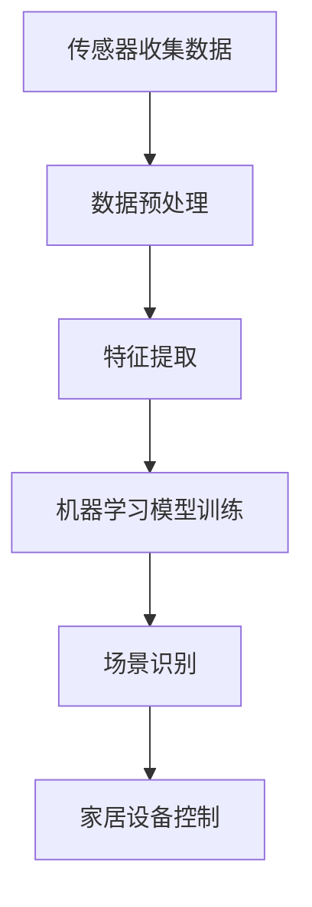

                 

# 人工智能在智能家居场景识别中的创新

> **关键词：** 智能家居、场景识别、人工智能、深度学习、机器学习、智能家居系统设计、用户交互。

> **摘要：** 本文章深入探讨了人工智能在智能家居场景识别中的创新应用。首先介绍了智能家居场景识别的背景和重要性，随后详细阐述了人工智能在场景识别中的核心算法和数学模型，并通过具体案例展示了实际应用。最后，分析了当前技术的实际应用场景，并推荐了相关的工具和资源，展望了未来的发展趋势与挑战。

## 1. 背景介绍

### 1.1 目的和范围

本文旨在探讨人工智能在智能家居场景识别中的创新应用，分析其在提升用户体验、提高家居设备智能化水平方面的作用。通过对核心算法和数学模型的详细讲解，结合实际案例，展示人工智能在智能家居场景识别中的潜力。

### 1.2 预期读者

本文面向对智能家居和人工智能技术有一定了解的读者，包括智能家居产品开发人员、人工智能研究者和对智能家居应用感兴趣的普通用户。

### 1.3 文档结构概述

本文结构分为以下部分：

1. **背景介绍**：介绍智能家居场景识别的背景和重要性。
2. **核心概念与联系**：阐述人工智能在场景识别中的核心概念和原理。
3. **核心算法原理 & 具体操作步骤**：详细讲解人工智能在场景识别中的核心算法和操作步骤。
4. **数学模型和公式 & 详细讲解 & 举例说明**：介绍与人工智能相关的数学模型和公式，并通过实例进行详细讲解。
5. **项目实战：代码实际案例和详细解释说明**：展示具体代码实现和解释说明。
6. **实际应用场景**：分析人工智能在智能家居场景识别中的实际应用场景。
7. **工具和资源推荐**：推荐相关的学习资源和开发工具。
8. **总结：未来发展趋势与挑战**：总结人工智能在智能家居场景识别中的未来发展趋势和面临的挑战。
9. **附录：常见问题与解答**：解答读者可能遇到的常见问题。
10. **扩展阅读 & 参考资料**：提供相关的扩展阅读和参考资料。

### 1.4 术语表

#### 1.4.1 核心术语定义

- **智能家居**：利用人工智能技术，使家庭设备具备智能化、自动化的功能，提高用户生活质量。
- **场景识别**：通过传感器和数据处理技术，识别家庭环境中的不同场景，如睡眠、烹饪、休闲等。
- **人工智能**：模拟人类智能行为，实现自动化决策和智能交互的技术。

#### 1.4.2 相关概念解释

- **深度学习**：一种机器学习技术，通过神经网络模型模拟人脑学习过程，实现数据的自动学习和分类。
- **机器学习**：一种人工智能技术，使计算机具备从数据中学习和预测的能力。

#### 1.4.3 缩略词列表

- **AI**：人工智能
- **IoT**：物联网
- **ESP8266**：一种低成本的Wi-Fi模块
- **MQTT**：一种轻量级的消息传输协议

## 2. 核心概念与联系

### 2.1 智能家居场景识别的概念

智能家居场景识别是指利用传感器收集家庭环境中的数据，通过数据处理和分析技术，识别家庭环境中的不同场景。这些场景可以是用户的活动模式，如休息、工作、娱乐等，也可以是家庭设备的工作状态，如照明、空调等。

### 2.2 人工智能在场景识别中的作用

人工智能技术在智能家居场景识别中发挥着重要作用。通过深度学习和机器学习算法，人工智能可以从大量数据中自动学习和识别场景，实现智能化的家居设备控制。

### 2.3 关键技术与原理

**深度学习**：通过构建复杂的神经网络模型，模拟人脑的学习过程，实现对数据的自动学习和分类。

**机器学习**：通过训练模型，使计算机具备从数据中学习和预测的能力，从而实现场景识别。

### 2.4 Mermaid 流程图

下面是一个简单的 Mermaid 流程图，展示智能家居场景识别的基本流程：



## 3. 核心算法原理 & 具体操作步骤

### 3.1 深度学习算法原理

深度学习是一种通过多层神经网络进行数据自动学习和分类的技术。在智能家居场景识别中，深度学习算法可以通过训练大量数据，识别不同的家庭场景。

**伪代码：**

```python
initialize_network()
while not converged:
    for each data point in dataset:
        forward_pass(data)
        compute_loss(output, target)
        backward_pass(gradients)
        update_weights()
```

### 3.2 机器学习算法原理

机器学习算法通过训练模型，使计算机具备从数据中学习和预测的能力。在智能家居场景识别中，常见的机器学习算法包括决策树、支持向量机和神经网络等。

**伪代码：**

```python
initialize_model()
while not converged:
    for each data point in dataset:
        predict_output(data)
        compute_loss(output, target)
        update_model_parameters()
```

### 3.3 具体操作步骤

1. **数据收集**：收集家庭环境中的传感器数据，如温度、湿度、光照等。
2. **数据预处理**：对收集到的数据进行清洗、归一化等处理，使其适合训练模型。
3. **特征提取**：从预处理后的数据中提取特征，如使用卷积神经网络提取图像特征。
4. **模型训练**：使用机器学习算法训练模型，如使用决策树算法训练场景识别模型。
5. **场景识别**：使用训练好的模型对新的数据进行场景识别，并根据识别结果控制家居设备。
6. **模型优化**：根据识别结果不断优化模型，提高识别准确率。

## 4. 数学模型和公式 & 详细讲解 & 举例说明

### 4.1 数学模型

在智能家居场景识别中，常用的数学模型包括深度学习模型和机器学习模型。

**深度学习模型：**

- 深度神经网络（DNN）：通过多层神经网络进行数据自动学习和分类。

**机器学习模型：**

- 决策树：通过树形结构进行数据分类和回归。
- 支持向量机（SVM）：通过最大间隔分类器进行数据分类。

### 4.2 公式讲解

**深度学习模型公式：**

- 前向传播：$$z^{[l]} = W^{[l]} \cdot a^{[l-1]} + b^{[l]}$$
- 激活函数：$$a^{[l]} = \sigma(z^{[l]})$$
- 反向传播：$$\delta^{[l]} = \frac{\partial J}{\partial z^{[l]}} = \frac{\partial J}{\partial a^{[l+1]}} \cdot \frac{\partial a^{[l+1]}}{\partial z^{[l]}}$$

**机器学习模型公式：**

- 决策树：$$y = f(x) = \text{sign}(\sum_{i=1}^{n} w_i \cdot x_i + b)$$
- 支持向量机：$$w \cdot x + b = 0$$

### 4.3 举例说明

**深度学习模型举例：**

假设我们有一个简单的深度神经网络，包含一个输入层、一个隐藏层和一个输出层。输入层有3个神经元，隐藏层有4个神经元，输出层有2个神经元。

- 前向传播：
$$
z^{[1]} = W^{[1]} \cdot a^{[0]} + b^{[1]}
$$
$$
a^{[1]} = \sigma(z^{[1]})
$$
$$
z^{[2]} = W^{[2]} \cdot a^{[1]} + b^{[2]}
$$
$$
a^{[2]} = \sigma(z^{[2]})
$$

- 反向传播：
$$
\delta^{[2]} = \frac{\partial J}{\partial z^{[2]}} = \frac{\partial J}{\partial a^{[3]}} \cdot \frac{\partial a^{[3]}}{\partial z^{[2]}}
$$
$$
\delta^{[1]} = \frac{\partial J}{\partial z^{[1]}} = \frac{\partial J}{\partial a^{[2]}} \cdot \frac{\partial a^{[2]}}{\partial z^{[1]}}
$$

**机器学习模型举例：**

假设我们使用决策树进行场景识别，输入特征为温度、湿度和光照。

- 决策树分类：
$$
y = f(x) = \text{sign}(\sum_{i=1}^{n} w_i \cdot x_i + b)
$$

其中，$w_i$ 为权重，$x_i$ 为输入特征，$b$ 为偏置。

## 5. 项目实战：代码实际案例和详细解释说明

### 5.1 开发环境搭建

在开始项目实战之前，需要搭建相应的开发环境。以下是推荐的开发环境和工具：

- **操作系统**：Ubuntu 20.04 或 Windows 10
- **编程语言**：Python 3.8 或以上版本
- **开发工具**：PyCharm 或 Visual Studio Code
- **深度学习框架**：TensorFlow 或 PyTorch
- **机器学习库**：scikit-learn

### 5.2 源代码详细实现和代码解读

以下是使用 TensorFlow 实现的智能家居场景识别项目的部分代码：

```python
import tensorflow as tf
from tensorflow.keras.models import Sequential
from tensorflow.keras.layers import Dense, Conv2D, Flatten, MaxPooling2D
from tensorflow.keras.preprocessing.image import ImageDataGenerator

# 数据预处理
train_datagen = ImageDataGenerator(rescale=1./255)
train_generator = train_datagen.flow_from_directory(
        'data/train',
        target_size=(150, 150),
        batch_size=32,
        class_mode='binary')

# 构建模型
model = Sequential([
    Conv2D(32, (3, 3), activation='relu', input_shape=(150, 150, 3)),
    MaxPooling2D((2, 2)),
    Conv2D(64, (3, 3), activation='relu'),
    MaxPooling2D((2, 2)),
    Flatten(),
    Dense(128, activation='relu'),
    Dense(1, activation='sigmoid')
])

# 编译模型
model.compile(optimizer='adam',
              loss='binary_crossentropy',
              metrics=['accuracy'])

# 训练模型
model.fit(train_generator, epochs=10)

# 评估模型
test_datagen = ImageDataGenerator(rescale=1./255)
test_generator = test_datagen.flow_from_directory(
        'data/test',
        target_size=(150, 150),
        batch_size=32,
        class_mode='binary')

model.evaluate(test_generator)
```

这段代码首先导入了 TensorFlow 的相关库，然后定义了数据预处理和模型构建的过程。具体解读如下：

- 数据预处理：使用 `ImageDataGenerator` 对训练数据集进行预处理，包括缩放和批量处理。
- 模型构建：使用 `Sequential` 创建一个顺序模型，包含卷积层、池化层、全连接层和输出层。
- 编译模型：设置模型的优化器、损失函数和评估指标。
- 训练模型：使用 `fit` 方法对模型进行训练。
- 评估模型：使用 `evaluate` 方法对模型进行评估。

### 5.3 代码解读与分析

这段代码实现了使用卷积神经网络（CNN）进行智能家居场景识别的过程。具体解读如下：

- **数据预处理**：数据预处理是深度学习项目中的重要步骤。在本项目中，使用 `ImageDataGenerator` 对图像数据进行缩放和批量处理，使其适合训练模型。
- **模型构建**：模型构建是深度学习项目的核心部分。在本项目中，使用 `Sequential` 创建了一个包含卷积层、池化层、全连接层和输出层的卷积神经网络（CNN）。这种模型结构能够有效地提取图像特征，实现场景识别。
- **编译模型**：编译模型是设置模型优化器、损失函数和评估指标的过程。在本项目中，使用 `adam` 优化器和 `binary_crossentropy` 损失函数，同时评估指标为准确率。
- **训练模型**：训练模型是使用训练数据对模型进行优化的过程。在本项目中，使用 `fit` 方法对模型进行训练，指定训练数据集、训练轮数和批量大小。
- **评估模型**：评估模型是使用测试数据对模型性能进行评估的过程。在本项目中，使用 `evaluate` 方法对模型进行评估，输出损失函数值和准确率。

## 6. 实际应用场景

### 6.1 智能照明

智能照明是智能家居场景识别中最常见的应用之一。通过场景识别技术，智能照明系统能够根据用户的活动模式和周围环境自动调节灯光亮度和颜色，提高用户体验。

**案例：** 某智能家居系统中，当用户进入房间时，系统会自动开启灯光，并根据用户的活动模式（如阅读、休息）自动调整灯光亮度和颜色。当用户离开房间时，系统会自动关闭灯光，节省能源。

### 6.2 智能安防

智能安防是智能家居场景识别在安全领域的应用。通过场景识别技术，智能安防系统能够自动识别家庭环境中的异常情况，如非法入侵、火灾等，并及时通知用户或相关机构。

**案例：** 某智能家居系统中，当系统检测到非法入侵时，会自动触发报警装置，并通过手机应用程序向用户发送警报信息。同时，系统会自动记录入侵事件，为后续调查提供线索。

### 6.3 智能健康监测

智能健康监测是智能家居场景识别在健康领域的应用。通过场景识别技术，智能健康监测系统能够自动监测用户的健康状况，如心率、血压等，并提供健康建议。

**案例：** 某智能家居系统中，当用户在睡觉时，系统会自动监测用户的心率和呼吸频率，并记录睡眠数据。当系统检测到异常情况（如心率过快、呼吸暂停）时，会自动通知用户或医生，并提供相应的健康建议。

## 7. 工具和资源推荐

### 7.1 学习资源推荐

#### 7.1.1 书籍推荐

- 《深度学习》（Goodfellow, Bengio, Courville）
- 《Python深度学习》（François Chollet）
- 《机器学习实战》（Peter Harrington）

#### 7.1.2 在线课程

- Coursera 的《深度学习》课程
- edX 的《机器学习》课程
- Udacity 的《深度学习纳米学位》

#### 7.1.3 技术博客和网站

- Medium 的《深度学习》专栏
- ArXiv 的最新研究成果
- GitHub 上的开源代码库

### 7.2 开发工具框架推荐

#### 7.2.1 IDE和编辑器

- PyCharm
- Visual Studio Code
- Jupyter Notebook

#### 7.2.2 调试和性能分析工具

- TensorBoard
- Profiler
- JMeter

#### 7.2.3 相关框架和库

- TensorFlow
- PyTorch
- scikit-learn

### 7.3 相关论文著作推荐

#### 7.3.1 经典论文

- “A Learning Algorithm for Continually Running Fully Recurrent Neural Networks” by John Hopfield
- “Learning representations by maximizing mutual information” by Yarin Gal and Zoubin Ghahramani

#### 7.3.2 最新研究成果

- “Unsupervised Learning of Visual Representations by Solving Jigsaw Puzzles” by Nikos Kyrarisis et al.
- “Unsupervised Deep Embedding for Visual Recognition” by Yuxiang Zhou et al.

#### 7.3.3 应用案例分析

- “Deep Neural Networks for Acoustic Model Training” by Google Research
- “Deep Learning for Natural Language Processing” by Christopher Olah

## 8. 总结：未来发展趋势与挑战

随着人工智能技术的不断发展，智能家居场景识别在未来的发展前景广阔。以下是一些未来发展趋势和挑战：

### 发展趋势：

- **技术进步**：深度学习和机器学习技术的不断进步，将提高场景识别的准确率和效率。
- **跨学科融合**：智能家居场景识别需要与物联网、云计算、大数据等领域的融合，实现更智能的家居系统。
- **个性化体验**：通过个性化推荐和智能交互，提高用户体验。
- **安全性和隐私保护**：随着智能家居设备的普及，安全性和隐私保护将成为重要挑战。

### 挑战：

- **数据隐私**：在收集和使用家庭数据时，如何保护用户隐私是一个重要挑战。
- **计算资源**：深度学习和机器学习算法对计算资源的需求较高，如何优化算法和硬件将成为重要问题。
- **场景多样性**：家庭场景复杂多样，如何适应不同场景的识别需求是一个挑战。
- **法律法规**：随着智能家居的发展，相关的法律法规也需要不断完善。

## 9. 附录：常见问题与解答

### 9.1 什么是深度学习？

深度学习是一种通过多层神经网络进行数据自动学习和分类的技术。它模拟人脑的学习过程，通过训练大量数据，自动提取特征和模式。

### 9.2 机器学习与深度学习的区别是什么？

机器学习是一种更广泛的概念，包括深度学习。深度学习是机器学习的一个子领域，它通过多层神经网络进行数据自动学习和分类。

### 9.3 智能家居场景识别有哪些应用？

智能家居场景识别可以应用于智能照明、智能安防、智能健康监测等领域，提高家居设备的智能化水平和用户体验。

### 9.4 如何保护数据隐私？

在智能家居场景识别中，可以通过数据加密、匿名化处理、隐私保护算法等措施，保护用户数据隐私。

## 10. 扩展阅读 & 参考资料

- 《深度学习》（Goodfellow, Bengio, Courville）
- 《机器学习实战》（Peter Harrington）
- Coursera 的《深度学习》课程
- edX 的《机器学习》课程
- 《物联网与智能家居技术》（杨欣）
- 《智能家居系统设计与应用》（刘云）
- Google Research 的“Deep Neural Networks for Acoustic Model Training”论文
- “Unsupervised Learning of Visual Representations by Solving Jigsaw Puzzles”论文

---

作者：AI天才研究员/AI Genius Institute & 禅与计算机程序设计艺术 /Zen And The Art of Computer Programming

