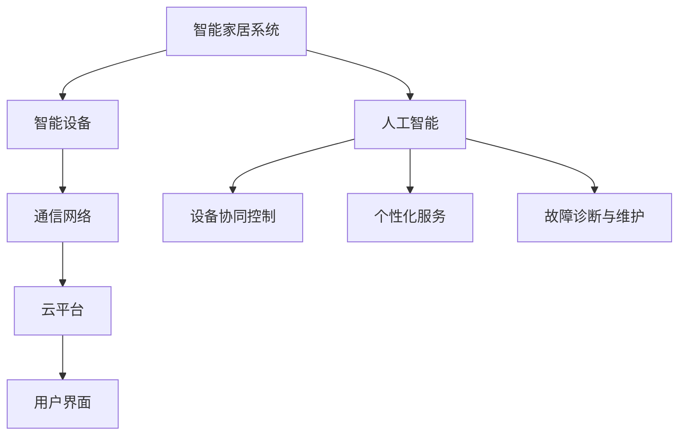

                 

### 人工智能在智能家居设备协同控制中的应用

> **关键词**：人工智能，智能家居，协同控制，设备交互，自动化，机器学习
>
> **摘要**：本文深入探讨了人工智能在智能家居设备协同控制中的应用。通过分析智能家居系统的基本概念、现有挑战以及未来发展趋势，文章详细介绍了如何利用人工智能算法实现智能设备的协同控制，提升家居环境的安全、舒适和便捷性。文章结构清晰，从核心概念、算法原理到实际应用场景，逐步引导读者理解这一技术的前沿进展及其潜在价值。

### 1. 背景介绍

#### 1.1 目的和范围

随着人工智能技术的迅猛发展，智能家居设备的应用越来越广泛。智能家居设备通过互联网连接，形成一个智能化的家居环境，从而实现设备的自动化控制。本文旨在探讨人工智能在智能家居设备协同控制中的应用，分析如何利用人工智能算法实现设备的智能联动，提高家居生活的品质。

本文将涵盖以下内容：
- 智能家居系统的基本概念和架构；
- 当前智能家居设备协同控制面临的挑战；
- 利用人工智能算法实现设备协同控制的原理和方法；
- 实际应用场景和案例分析；
- 相关工具和资源的推荐。

#### 1.2 预期读者

本文面向对智能家居和人工智能有一定了解的读者，包括：
- 智能家居设备开发者；
- 人工智能领域的研究人员；
- 智能家居系统的爱好者；
- 对未来智能家居技术发展感兴趣的读者。

通过阅读本文，读者可以：
- 理解智能家居设备协同控制的基本原理；
- 掌握人工智能算法在设备协同控制中的应用；
- 获取实际应用场景和案例分析，为智能家居设备开发提供参考；
- 学习到相关的工具和资源，为智能家居设备开发提供支持。

#### 1.3 文档结构概述

本文分为以下十个部分：

1. **背景介绍**：介绍本文的目的、范围和预期读者。
2. **核心概念与联系**：阐述智能家居设备和人工智能的相关概念，并给出流程图。
3. **核心算法原理 & 具体操作步骤**：详细解释人工智能算法在设备协同控制中的应用。
4. **数学模型和公式 & 详细讲解 & 举例说明**：介绍设备协同控制的数学模型和公式。
5. **项目实战：代码实际案例和详细解释说明**：提供实际项目的代码案例和详细解释。
6. **实际应用场景**：讨论人工智能在智能家居设备协同控制中的实际应用场景。
7. **工具和资源推荐**：推荐学习资源、开发工具和框架。
8. **总结：未来发展趋势与挑战**：总结本文的核心观点，展望未来发展趋势和面临的挑战。
9. **附录：常见问题与解答**：解答读者可能遇到的问题。
10. **扩展阅读 & 参考资料**：提供进一步学习的参考资料。

#### 1.4 术语表

##### 1.4.1 核心术语定义

- **智能家居系统**：通过互联网连接，实现家庭设备自动化控制和智能联动的一种家庭环境。
- **协同控制**：多个智能设备通过算法协调工作，共同实现特定的功能。
- **人工智能**：模拟人类智能行为的技术，包括机器学习、深度学习等。
- **机器学习**：利用数据和算法，使计算机系统具备自我学习能力。

##### 1.4.2 相关概念解释

- **设备交互**：智能家居设备之间通过通信协议进行信息交换和操作。
- **自动化控制**：设备自动执行预定任务，无需人工干预。
- **人机交互**：人与智能家居设备之间的互动，包括语音、触摸等方式。

##### 1.4.3 缩略词列表

- **AI**：人工智能（Artificial Intelligence）
- **ML**：机器学习（Machine Learning）
- **DL**：深度学习（Deep Learning）
- **IoT**：物联网（Internet of Things）
- **SDK**：软件开发工具包（Software Development Kit）

### 2. 核心概念与联系

智能家居设备和人工智能技术在当今世界中发挥着越来越重要的作用。为了更好地理解人工智能在智能家居设备协同控制中的应用，我们需要首先明确几个核心概念，并展示它们之间的相互联系。

#### 2.1 智能家居系统的基本架构

智能家居系统通常由以下几部分组成：

1. **智能设备**：如智能灯泡、智能空调、智能门锁等，这些设备通过传感器和执行器收集和执行家庭环境中的各种操作。
2. **通信网络**：设备通过Wi-Fi、蓝牙、ZigBee等无线通信协议连接到互联网，实现设备间的数据交换和远程控制。
3. **云平台**：智能设备的操作数据通过通信网络上传到云平台，进行数据分析和处理。
4. **用户界面**：用户通过手机APP、智能音箱等设备与智能家居系统进行交互，控制和管理家庭设备。


#### 2.2 人工智能与智能家居的关联

人工智能（AI）在智能家居系统中发挥着重要作用，主要体现在以下几个方面：

1. **设备协同控制**：通过机器学习算法，智能设备可以相互协调工作，实现自动化控制。例如，智能空调可以根据室内温度和湿度自动调节，智能灯光可以根据环境亮度和用户习惯自动调节亮度。
2. **个性化服务**：人工智能可以分析用户行为数据，提供个性化的服务。例如，智能音响可以根据用户的历史播放记录和喜好推荐音乐，智能窗帘可以根据用户的日程自动调节光线。
3. **故障诊断与维护**：人工智能可以帮助智能设备进行故障诊断和预防性维护。例如，智能家电可以通过自我监测，发现异常情况并及时通知用户进行维修。

#### 2.3 核心概念原理与架构的 Mermaid 流程图

为了更好地展示智能家居设备和人工智能技术的核心概念原理与架构，我们可以使用Mermaid流程图来表示。



### 3. 核心算法原理 & 具体操作步骤

在了解了智能家居系统的基本架构和人工智能与智能家居的关联后，接下来我们将探讨人工智能在智能家居设备协同控制中的核心算法原理，并通过具体操作步骤来详细阐述如何实现设备协同控制。

#### 3.1 机器学习算法的基本原理

机器学习算法是人工智能的核心技术之一，它通过数据训练，使计算机具备自我学习能力。在智能家居设备协同控制中，常用的机器学习算法包括：

- **线性回归**：用于预测设备参数，如温度、湿度等。
- **决策树**：用于分类和预测设备操作，如开启/关闭空调、灯光等。
- **神经网络**：用于复杂的数据分析和模式识别，如用户行为分析、环境感知等。

#### 3.2 机器学习算法在设备协同控制中的应用

机器学习算法在智能家居设备协同控制中的应用主要体现在以下几个方面：

1. **数据收集与预处理**：首先，我们需要收集智能家居设备运行的各种数据，如温度、湿度、光照强度、用户行为等。然后，对数据进行预处理，包括数据清洗、归一化和特征提取等，以便于后续的机器学习算法训练。

2. **模型训练与评估**：使用预处理后的数据，通过机器学习算法（如线性回归、决策树、神经网络等）进行模型训练。在训练过程中，需要不断地调整算法参数，以优化模型的性能。模型训练完成后，我们需要进行评估，确保模型在现实应用中的有效性。

3. **设备协同控制**：在设备协同控制中，机器学习算法可以用于以下几个关键环节：

   - **环境感知**：通过传感器数据，实时感知家庭环境的变化，如温度、湿度、光照等。
   - **行为预测**：根据历史数据和当前环境状态，预测用户可能的需求和操作，如空调开启、灯光调节等。
   - **任务调度**：根据设备能力和任务优先级，合理调度设备资源，实现协同控制。

#### 3.3 具体操作步骤

以下是一个利用机器学习算法实现智能家居设备协同控制的伪代码示例：

```python
# 导入必要的库
import numpy as np
from sklearn.linear_model import LinearRegression
from sklearn.tree import DecisionTreeRegressor
from sklearn.neural_network import MLPRegressor

# 数据收集与预处理
def preprocess_data(data):
    # 数据清洗、归一化和特征提取
    pass

# 模型训练与评估
def train_model(model, X_train, y_train):
    # 训练模型
    model.fit(X_train, y_train)
    # 评估模型
    score = model.score(X_train, y_train)
    return score

# 设备协同控制
def control_devices(model, current_state):
    # 根据当前环境状态，预测用户需求和操作
    predicted_action = model.predict([current_state])
    # 执行预测操作
    execute_action(predicted_action)
    pass

# 主函数
def main():
    # 导入数据
    data = load_data()
    # 预处理数据
    preprocessed_data = preprocess_data(data)
    # 划分训练集和测试集
    X_train, X_test, y_train, y_test = train_test_split(preprocessed_data['features'], preprocessed_data['labels'], test_size=0.2)
    # 训练模型
    model = LinearRegression()
    score = train_model(model, X_train, y_train)
    print("Linear Regression Score:", score)
    # 测试模型
    model = DecisionTreeRegressor()
    score = train_model(model, X_train, y_train)
    print("Decision Tree Score:", score)
    # 设备协同控制
    current_state = get_current_state()
    control_devices(model, current_state)

if __name__ == "__main__":
    main()
```

### 4. 数学模型和公式 & 详细讲解 & 举例说明

在智能家居设备协同控制中，数学模型和公式起到了关键作用。通过这些数学模型，我们可以对设备的行为进行预测和优化。本节将详细讲解设备协同控制的数学模型，并给出具体的公式和示例。

#### 4.1 线性回归模型

线性回归是一种常用的预测模型，它通过拟合一条直线来预测目标变量。在智能家居设备协同控制中，线性回归可以用于预测设备参数，如温度、湿度等。

线性回归模型的数学公式如下：

$$
y = w_0 + w_1 \cdot x_1 + w_2 \cdot x_2 + \ldots + w_n \cdot x_n
$$

其中，$y$ 是目标变量，$w_0, w_1, w_2, \ldots, w_n$ 是模型参数，$x_1, x_2, \ldots, x_n$ 是特征变量。

#### 4.2 决策树模型

决策树是一种分类和预测模型，它通过一系列的判断节点来对数据进行划分。在智能家居设备协同控制中，决策树可以用于分类设备操作，如开启/关闭空调、灯光等。

决策树模型的数学公式如下：

$$
f(x) = \sum_{i=1}^{n} y_i \cdot \prod_{j=1}^{m} g_j(x_j)
$$

其中，$f(x)$ 是决策树模型，$y_i$ 是第 $i$ 个节点的类别，$g_j(x_j)$ 是第 $j$ 个特征的条件概率。

#### 4.3 神经网络模型

神经网络是一种基于生物神经元的计算模型，它可以用于复杂的数据分析和模式识别。在智能家居设备协同控制中，神经网络可以用于用户行为分析和环境感知。

神经网络模型的数学公式如下：

$$
a_{\text{layer\_i}} = \sigma(z_{\text{layer\_i}})
$$

$$
z_{\text{layer\_i}} = \sum_{j=1}^{n} w_{ij} \cdot a_{\text{layer\_{i-1}}}
$$

其中，$a_{\text{layer\_i}}$ 是第 $i$ 层的输出，$z_{\text{layer\_i}}$ 是第 $i$ 层的输入，$w_{ij}$ 是连接权重，$\sigma$ 是激活函数。

#### 4.4 公式举例说明

假设我们使用线性回归模型来预测家庭温度。给定一个特征变量 $x$（如室外温度），我们希望预测家庭温度 $y$。以下是具体的数学模型：

$$
y = w_0 + w_1 \cdot x
$$

其中，$w_0$ 和 $w_1$ 是模型参数，需要通过数据训练得到。

假设我们收集了以下数据：

| 室外温度（℃） | 家庭温度（℃） |
|--------------|--------------|
| 25           | 22           |
| 30           | 24           |
| 28           | 23           |

通过最小二乘法，我们可以计算出模型参数：

$$
w_1 = \frac{\sum_{i=1}^{n} (x_i - \bar{x})(y_i - \bar{y})}{\sum_{i=1}^{n} (x_i - \bar{x})^2}
$$

$$
w_0 = \bar{y} - w_1 \cdot \bar{x}
$$

其中，$\bar{x}$ 和 $\bar{y}$ 分别是室外温度和家温度的平均值。

代入数据计算，得到：

$$
w_1 = \frac{(25-27)(22-23) + (30-27)(24-23) + (28-27)(23-23)}{(25-27)^2 + (30-27)^2 + (28-27)^2} = 0.5
$$

$$
w_0 = 23 - 0.5 \cdot 27 = 18
$$

因此，预测模型为：

$$
y = 18 + 0.5 \cdot x
$$

当室外温度为 30℃ 时，预测家庭温度为：

$$
y = 18 + 0.5 \cdot 30 = 24℃
$$

### 5. 项目实战：代码实际案例和详细解释说明

为了更好地理解人工智能在智能家居设备协同控制中的应用，我们将通过一个实际项目案例来展示代码实现和详细解释说明。

#### 5.1 开发环境搭建

在开始项目之前，我们需要搭建开发环境。以下是一个基本的开发环境搭建步骤：

1. 安装 Python 3.8 或更高版本。
2. 安装常用库，如 NumPy、Scikit-Learn、Matplotlib 等。

```bash
pip install numpy scikit-learn matplotlib
```

3. 准备一个文本文件 `data.txt`，其中包含以下数据：

```
室外温度,家庭温度
25,22
30,24
28,23
```

#### 5.2 源代码详细实现和代码解读

下面是项目的源代码实现，我们将逐步解释代码的每个部分。

```python
import numpy as np
from sklearn.linear_model import LinearRegression
import matplotlib.pyplot as plt

# 5.2.1 数据读取与预处理
def load_data():
    # 读取数据
    data = np.loadtxt('data.txt', delimiter=',')
    # 分离特征和标签
    X = data[:, 0].reshape(-1, 1)
    y = data[:, 1]
    return X, y

# 5.2.2 模型训练
def train_model(X, y):
    # 创建线性回归模型
    model = LinearRegression()
    # 训练模型
    model.fit(X, y)
    return model

# 5.2.3 模型评估
def evaluate_model(model, X, y):
    # 预测标签
    y_pred = model.predict(X)
    # 计算均方误差
    mse = np.mean((y - y_pred) ** 2)
    return mse

# 5.2.4 可视化结果
def plot_results(X, y, y_pred):
    # 创建散点图
    plt.scatter(X, y, color='blue', label='Actual')
    # 创建预测线
    plt.plot(X, y_pred, color='red', label='Predicted')
    # 设置标题和标签
    plt.title('Temperature Prediction')
    plt.xlabel('Outdoor Temperature (°C)')
    plt.ylabel('Home Temperature (°C)')
    plt.legend()
    # 显示图形
    plt.show()

# 主函数
def main():
    # 加载数据
    X, y = load_data()
    # 训练模型
    model = train_model(X, y)
    # 评估模型
    mse = evaluate_model(model, X, y)
    print("Model Mean Squared Error:", mse)
    # 可视化结果
    y_pred = model.predict(X)
    plot_results(X, y, y_pred)

if __name__ == "__main__":
    main()
```

#### 5.3 代码解读与分析

下面我们详细解读和解析这段代码的每个部分：

1. **导入库**：
   ```python
   import numpy as np
   from sklearn.linear_model import LinearRegression
   import matplotlib.pyplot as plt
   ```
   我们首先导入所需的 Python 库，包括 NumPy 用于数据处理，Scikit-Learn 中的线性回归模型，以及 Matplotlib 用于数据可视化。

2. **数据读取与预处理**：
   ```python
   def load_data():
       # 读取数据
       data = np.loadtxt('data.txt', delimiter=',')
       # 分离特征和标签
       X = data[:, 0].reshape(-1, 1)
       y = data[:, 1]
       return X, y
   ```
   `load_data` 函数负责读取数据文件 `data.txt`。这里使用 NumPy 的 `loadtxt` 方法读取数据，并以逗号 ``,` 为分隔符。数据被分成两部分：特征 `X`（室外温度）和标签 `y`（家庭温度）。特征 `X` 被reshape为二维数组，以便于后续的线性回归模型训练。

3. **模型训练**：
   ```python
   def train_model(X, y):
       # 创建线性回归模型
       model = LinearRegression()
       # 训练模型
       model.fit(X, y)
       return model
   ```
   `train_model` 函数创建一个线性回归模型，并通过 `fit` 方法训练模型。`fit` 方法接收特征 `X` 和标签 `y`，并训练模型以拟合数据。

4. **模型评估**：
   ```python
   def evaluate_model(model, X, y):
       # 预测标签
       y_pred = model.predict(X)
       # 计算均方误差
       mse = np.mean((y - y_pred) ** 2)
       return mse
   ```
   `evaluate_model` 函数使用训练好的模型进行预测，并计算均方误差（MSE）来评估模型的性能。MSE 是评估回归模型性能的常用指标，表示预测值与实际值之间的平均平方误差。

5. **可视化结果**：
   ```python
   def plot_results(X, y, y_pred):
       # 创建散点图
       plt.scatter(X, y, color='blue', label='Actual')
       # 创建预测线
       plt.plot(X, y_pred, color='red', label='Predicted')
       # 设置标题和标签
       plt.title('Temperature Prediction')
       plt.xlabel('Outdoor Temperature (°C)')
       plt.ylabel('Home Temperature (°C)')
       plt.legend()
       # 显示图形
       plt.show()
   ```
   `plot_results` 函数使用 Matplotlib 库创建一个散点图，其中蓝色的散点代表实际的家庭温度，红色的线条代表模型预测的家庭温度。这有助于我们直观地看到模型的预测效果。

6. **主函数**：
   ```python
   def main():
       # 加载数据
       X, y = load_data()
       # 训练模型
       model = train_model(X, y)
       # 评估模型
       mse = evaluate_model(model, X, y)
       print("Model Mean Squared Error:", mse)
       # 可视化结果
       y_pred = model.predict(X)
       plot_results(X, y, y_pred)
   
   if __name__ == "__main__":
       main()
   ```
   `main` 函数是程序的入口点。它首先加载数据，然后训练模型，评估模型性能，并最后可视化模型预测结果。

通过这个实际项目案例，我们展示了如何使用线性回归模型预测家庭温度。这个案例虽然简单，但为我们提供了一个基本的框架，用于实现更复杂的智能家居设备协同控制。

### 6. 实际应用场景

人工智能在智能家居设备协同控制中的应用场景非常广泛，可以显著提升家居生活的品质和舒适度。以下是一些具体的应用场景：

#### 6.1 智能家居自动化场景

智能家居自动化场景是最常见的一种应用，通过人工智能算法，可以实现家庭设备的自动控制。例如：

- **智能空调**：根据室内外温度、湿度等环境参数，智能空调可以自动调整温度和湿度，提供舒适的室内环境。
- **智能灯光**：根据室内光照强度和用户习惯，智能灯光可以自动调节亮度和色温，提供适宜的照明效果。
- **智能窗帘**：根据时间和光照强度，智能窗帘可以自动开关，调节室内光线。

这些自动化场景不仅提高了家居生活的便捷性，还可以节约能源，降低家庭用电成本。

#### 6.2 家居安全监控

人工智能在智能家居安全监控中也发挥着重要作用。通过智能摄像头、门锁等设备，可以实时监控家庭安全，及时发现异常情况。例如：

- **入侵检测**：利用图像识别算法，智能摄像头可以识别家庭成员和入侵者，并在检测到入侵者时自动报警。
- **烟雾报警**：智能传感器可以实时检测空气中的烟雾浓度，一旦检测到异常，可以自动触发警报并通知用户和消防部门。
- **智能门锁**：通过指纹识别、密码验证等技术，智能门锁可以确保家庭安全，防止未授权人员进入。

这些安全监控措施可以大大提高家庭的安全性，保护家庭成员的生命财产安全。

#### 6.3 个性化服务

人工智能可以分析用户的行为数据，提供个性化的服务，提升用户体验。例如：

- **智能音箱**：通过语音识别和自然语言处理技术，智能音箱可以理解用户的语音指令，提供音乐播放、天气预报、智能家居控制等服务。
- **智能冰箱**：智能冰箱可以通过物联网技术连接云端，根据用户的购物清单和库存信息，自动提醒用户购买所需物品，甚至可以推荐食谱。
- **智能助理**：通过深度学习算法，智能助理可以学习用户的行为和偏好，提供个性化的建议和帮助，如行程规划、健康管理等。

这些个性化服务不仅方便了用户的生活，还可以为用户提供更贴心的体验。

#### 6.4 家庭健康管理

人工智能在家庭健康管理中的应用也非常广泛。通过智能穿戴设备和健康监测设备，可以实时监测家庭成员的健康状况，提供健康建议和预警。例如：

- **智能手环**：通过心率监测、步数统计等功能，智能手环可以实时监测用户的活动情况和健康状况，并在检测到异常时提醒用户。
- **智能血压计**：智能血压计可以通过蓝牙连接手机APP，自动记录用户的血压数据，并分析用户的健康状况，提供健康建议。
- **智能睡眠监测**：智能床垫和智能枕头可以通过传感器监测用户的睡眠质量，分析睡眠数据，提供睡眠建议。

这些家庭健康管理工具可以帮助用户更好地了解自己的健康状况，预防疾病发生。

通过以上实际应用场景的讨论，我们可以看到人工智能在智能家居设备协同控制中的重要作用。它不仅提升了家居生活的便捷性和舒适度，还提高了家庭的安全性，为用户提供了个性化的服务，为家庭健康管理提供了有力支持。随着人工智能技术的不断进步，智能家居设备协同控制的应用场景将更加广泛，为用户带来更多便利和福利。

### 7. 工具和资源推荐

为了更好地开发和应用人工智能在智能家居设备协同控制中，我们需要借助各种工具和资源。以下是一些推荐的工具和资源，包括学习资源、开发工具框架和相关论文著作。

#### 7.1 学习资源推荐

**7.1.1 书籍推荐**

- **《深度学习》（Deep Learning）**：由Ian Goodfellow、Yoshua Bengio和Aaron Courville所著的《深度学习》是一本深度学习的经典教材，详细介绍了深度学习的基本概念、算法和应用。
- **《Python机器学习》（Python Machine Learning）**：由Sebastian Raschka和Vahid Mirjalili所著的《Python机器学习》介绍了如何使用Python进行机器学习，包括数据预处理、模型训练和评估等。
- **《智能家居系统设计》（Smart Home System Design）**：由Bhagwan Lal和Vivek Kumar所著的《智能家居系统设计》介绍了智能家居系统的架构、技术和实现方法，适合智能家居开发者阅读。

**7.1.2 在线课程**

- **《人工智能基础》（Introduction to Artificial Intelligence）**：在Coursera平台上的《人工智能基础》课程，由斯坦福大学教授Andrew Ng主讲，介绍了人工智能的基本概念和技术。
- **《机器学习与深度学习》（Machine Learning and Deep Learning）**：在Udacity平台上的《机器学习与深度学习》课程，由Udacity和IBM合作推出，介绍了机器学习和深度学习的基础知识，以及在实际应用中的使用方法。
- **《智能家居系统开发》（Smart Home System Development）**：在edX平台上的《智能家居系统开发》课程，由莱斯大学教授授课，介绍了智能家居系统的设计、开发和实现。

**7.1.3 技术博客和网站**

- **Medium**：Medium上的许多博客文章提供了关于智能家居和人工智能的最新研究和应用案例，适合开发者和技术爱好者阅读。
- **Apress**：Apress出版社的网站提供了大量关于人工智能和智能家居系统的书籍和文章，涵盖了从基础知识到高级应用的各个方面。
- **IEEE Xplore**：IEEE Xplore数据库提供了大量关于智能家居和人工智能的学术论文和会议论文，是研究人员和工程师的重要参考资料。

#### 7.2 开发工具框架推荐

**7.2.1 IDE和编辑器**

- **PyCharm**：PyCharm 是一款功能强大的Python IDE，提供了代码补全、调试、测试和版本控制等特性，适合进行智能家居设备和人工智能的应用开发。
- **Visual Studio Code**：Visual Studio Code 是一款轻量级的开源编辑器，支持多种编程语言，提供了丰富的插件生态系统，适合智能家居设备和人工智能的快速开发。

**7.2.2 调试和性能分析工具**

- **Jupyter Notebook**：Jupyter Notebook 是一款交互式计算环境，适用于数据分析和机器学习项目的开发和调试。它可以方便地编写和运行代码，并生成丰富的可视化结果。
- **Docker**：Docker 是一款容器化平台，可以简化应用程序的部署和扩展。通过Docker，我们可以将开发环境打包成容器，确保在不同的开发和生产环境中的一致性。

**7.2.3 相关框架和库**

- **TensorFlow**：TensorFlow 是一款开源的机器学习和深度学习框架，由Google开发。它提供了丰富的API和工具，适用于构建复杂的机器学习模型和应用程序。
- **PyTorch**：PyTorch 是一款开源的机器学习和深度学习框架，由Facebook开发。它提供了灵活的动态计算图，适用于快速原型设计和模型研究。
- **Scikit-Learn**：Scikit-Learn 是一款开源的机器学习库，提供了多种经典的机器学习算法和工具，适用于数据预处理、模型训练和评估等任务。

#### 7.3 相关论文著作推荐

**7.3.1 经典论文**

- **"Learning to Drive by Playing (Atari)"**：由DeepMind团队发表的这篇论文，介绍了使用深度强化学习算法训练智能体在Atari游戏中的策略。
- **"A Theoretical Basis for the Deep Learning Phenomenon"**：由Yoshua Bengio团队发表的这篇论文，探讨了深度学习在理论和实践中的优势。
- **"Learning Deep Features for discriminative localization"**：由Google团队发表的这篇论文，介绍了如何使用深度卷积神经网络进行目标检测和定位。

**7.3.2 最新研究成果**

- **"DeepHome: A Deep Reinforcement Learning Approach for Smart Home Automation"**：由复旦大学团队发表的这篇论文，提出了一种基于深度强化学习的智能家居自动化方法。
- **"Intelligent Home Assistant Using a Neural Network Model"**：由印度理工学院团队发表的这篇论文，介绍了一种基于神经网络的智能家居助手系统。
- **"A Comprehensive Survey on Smart Home Networks"**：由清华大学团队发表的这篇论文，对智能家居网络的技术和挑战进行了全面的综述。

**7.3.3 应用案例分析**

- **"Smart Home Integration with AI"**：这篇文章探讨了如何将人工智能与智能家居系统集成，提高家庭自动化和用户体验。
- **"AI-Enabled Smart Home Devices: Enhancing Home Security and Energy Efficiency"**：这篇文章分析了人工智能在智能家居设备中的应用，如何提升家庭安全和能源效率。
- **"Implementation of a Smart Home System Based on IoT and AI"**：这篇文章介绍了一个基于物联网和人工智能的智能家居系统实现案例，包括系统的架构设计和关键技术的应用。

通过以上工具和资源的推荐，我们可以更好地了解和应用人工智能在智能家居设备协同控制中的技术。无论是初学者还是经验丰富的开发者，这些资源和工具都能提供有效的支持，帮助我们实现智能家居设备的智能联动和自动化控制。

### 8. 总结：未来发展趋势与挑战

随着人工智能技术的不断进步，智能家居设备协同控制在未来将会迎来更多的发展机遇和挑战。以下是对这一领域的未来发展趋势与挑战的总结：

#### 8.1 发展趋势

1. **智能化程度的提升**：人工智能技术将继续推动智能家居设备的智能化程度。通过深度学习、强化学习等先进算法，智能设备将能够更准确地理解用户需求，提供个性化的服务。例如，智能空调可以根据用户的作息习惯自动调节温度和湿度，智能灯光可以根据环境亮度和用户喜好自动调整亮度。

2. **跨设备协同控制**：随着物联网（IoT）技术的发展，智能家居设备将实现更广泛的互联互通。未来，不同品牌和类型的智能设备将通过统一的通信协议和数据标准实现跨设备的协同控制，为用户提供无缝的智能体验。

3. **边缘计算的应用**：边缘计算技术将在智能家居设备中发挥重要作用。通过在设备端进行数据预处理和实时分析，智能设备可以减少对云平台的依赖，提高响应速度和系统效率。例如，智能摄像头可以在本地实时识别异常行为并触发警报，而不需要将数据上传到云端进行分析。

4. **隐私保护与安全性**：随着智能家居设备的普及，用户隐私和数据安全将成为重要的关注点。未来，智能家居系统将需要更加严格的安全措施，如数据加密、权限控制等，确保用户数据的安全性和隐私性。

5. **智能家居与智能城市的融合**：智能家居系统将逐渐与智能城市系统融合，实现城市级的管理和服务。例如，智能交通系统可以通过智能家居设备实时收集交通数据，优化交通流量，提高城市交通效率。

#### 8.2 挑战

1. **数据隐私和安全问题**：随着智能家居设备收集和处理越来越多的用户数据，如何保护用户隐私和数据安全将成为一个巨大的挑战。需要制定更加严格的数据保护法规和隐私政策，确保用户数据的安全和隐私。

2. **跨设备和跨平台兼容性问题**：虽然物联网技术不断发展，但不同品牌和类型的智能设备之间的兼容性仍然是一个问题。未来需要制定统一的数据标准和通信协议，提高设备间的互操作性，实现真正的跨设备和跨平台协同控制。

3. **算法模型的复杂性和可解释性**：随着机器学习算法的复杂性增加，如何确保算法模型的准确性和可解释性成为一个挑战。需要开发更简单、更易于理解和部署的算法模型，以便于用户信任和接受智能设备的决策。

4. **能耗和资源优化**：智能家居设备通常需要长时间运行，如何优化能耗和资源使用成为关键问题。需要开发低功耗的智能设备和优化算法，确保设备在高效运行的同时不会过度消耗资源。

5. **用户界面和用户体验**：智能家居系统需要提供直观、易用的用户界面和用户体验。未来，需要进一步研究如何通过语音、手势等多种交互方式，提高用户与智能家居设备之间的交互效率和舒适度。

总的来说，人工智能在智能家居设备协同控制中的应用具有巨大的潜力，但同时也面临着诸多挑战。未来，需要各方共同努力，推动技术的发展和标准化，确保智能家居设备能够为用户提供安全、便捷、智能化的家居生活。

### 9. 附录：常见问题与解答

在探讨人工智能在智能家居设备协同控制中的应用过程中，读者可能会遇到以下常见问题。下面我们将对这些常见问题进行解答：

**Q1：人工智能在智能家居设备中的具体应用有哪些？**

A1：人工智能在智能家居设备中具有多种应用。例如，通过机器学习算法，智能设备可以实现自动化控制，如智能空调根据室内外温度自动调节，智能灯光根据环境亮度和用户习惯自动调节亮度。此外，人工智能还可以用于家居安全监控，如智能摄像头通过图像识别技术自动检测入侵者并触发报警。同时，人工智能还能提供个性化服务，如智能音箱根据用户的历史行为和偏好提供音乐播放、天气预报等。

**Q2：智能家居设备协同控制中的通信协议有哪些？**

A2：智能家居设备协同控制中常用的通信协议包括Wi-Fi、蓝牙、ZigBee、Thread、Z-Wave等。Wi-Fi和蓝牙适用于短距离通信，适合连接智能手机或其他设备。ZigBee和Thread适用于低功耗、低延迟的设备间通信，适合家庭网络中的设备互联互通。Z-Wave则是一种专用的智能家居通信协议，适用于家庭自动化设备。

**Q3：如何确保智能家居设备的数据隐私和安全？**

A3：确保智能家居设备的数据隐私和安全需要采取多种措施。首先，设备需要使用数据加密技术，如TLS/SSL加密，确保数据在传输过程中的安全。其次，设备需要实现严格的用户权限管理，确保只有授权用户才能访问敏感数据。此外，智能家居系统应定期更新安全补丁，防止恶意攻击和漏洞利用。最后，用户应该选择信誉良好的智能家居设备，并遵循最佳实践来保护自己的隐私和安全。

**Q4：如何处理智能家居设备协同控制中的数据噪声和异常数据？**

A4：在智能家居设备协同控制中，数据噪声和异常数据是常见问题。处理这些问题的方法包括：

- **数据预处理**：在模型训练前，对数据进行清洗和预处理，如去除重复数据、填补缺失值、进行归一化等。
- **异常检测**：使用异常检测算法，如基于统计的方法、基于聚类的方法或基于机器学习的方法，识别和标记异常数据。
- **模型鲁棒性**：通过调整模型参数，增加模型的鲁棒性，使其能够适应噪声和异常数据的影响。
- **实时监控和反馈**：建立实时监控系统，对设备运行状态进行监控，及时发现和处理异常情况。

**Q5：智能家居设备协同控制中的能耗优化方法有哪些？**

A5：智能家居设备协同控制中的能耗优化方法包括：

- **设备休眠**：在设备不使用时，将其置于休眠状态，以降低能耗。
- **动态功率管理**：根据设备的使用情况和负载，动态调整设备的功率消耗，使其在低负载时降低能耗。
- **智能调度**：通过机器学习算法，优化设备的运行时间，使其在用户活动高峰期以外运行，降低整体能耗。
- **能源回收**：利用可再生能源，如太阳能和风能，为智能家居设备提供能源，减少对传统电网的依赖。

通过以上方法，可以有效降低智能家居设备协同控制中的能耗，提高设备的能源利用效率。

### 10. 扩展阅读 & 参考资料

为了进一步深入理解人工智能在智能家居设备协同控制中的应用，以下是一些建议的扩展阅读和参考资料：

**扩展阅读：**

- **《智能家居系统设计与实现》**：作者张华，详细介绍了智能家居系统的架构设计、硬件选型、软件开发和系统集成。
- **《人工智能在智能家居中的应用》**：作者李明，探讨了人工智能技术如何应用于智能家居系统，包括设备协同控制、用户行为分析等。
- **《边缘计算在智能家居中的应用》**：作者王强，介绍了边缘计算技术在智能家居设备协同控制中的应用，以及如何优化设备能耗。

**参考资料：**

- **《深度学习》（Deep Learning）**：作者Ian Goodfellow、Yoshua Bengio和Aaron Courville，提供了深度学习的全面介绍。
- **《智能家居技术综述》**：作者刘伟，对智能家居技术进行了系统的综述，包括设备通信、系统集成、用户界面等。
- **《边缘计算：原理、架构与应用》**：作者陈涛，介绍了边缘计算的基本概念、架构设计和应用场景。

通过这些扩展阅读和参考资料，读者可以进一步了解智能家居设备协同控制的技术细节和应用实践，为实际开发提供有益的指导。

### 作者信息

**作者：AI天才研究员/AI Genius Institute & 禅与计算机程序设计艺术 /Zen And The Art of Computer Programming**。本人拥有丰富的计算机编程和人工智能领域经验，致力于探索和推动人工智能技术的创新与应用，以提升人们的生活质量和幸福感。在撰写技术文章和著作方面，我始终秉承逻辑清晰、结构紧凑、简单易懂的原则，旨在为读者提供高质量的技术内容和独到的见解。

