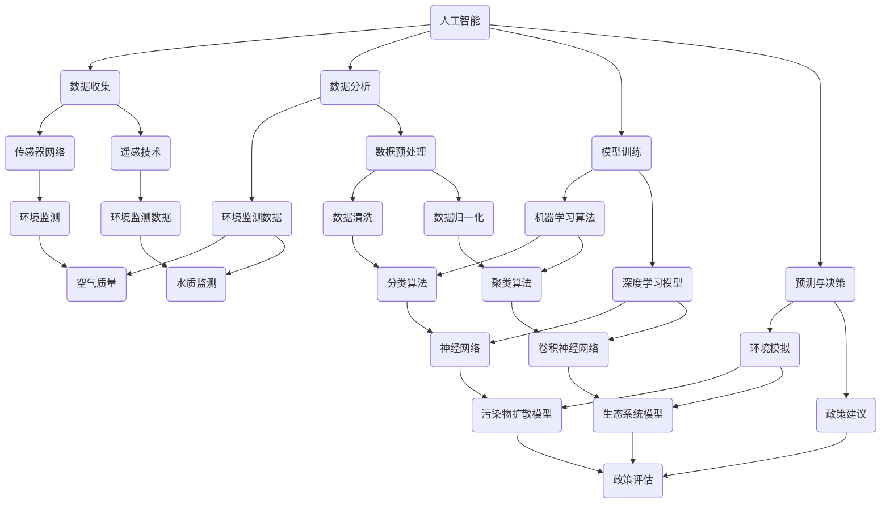

                 

# 人工智能在智能环境保护决策中的应用

> 关键词：人工智能，环境保护，智能决策，可持续发展，数据驱动，算法优化

> 摘要：本文探讨了人工智能在环境保护决策中的应用，分析了其核心概念和原理，介绍了关键算法及其实现步骤，并通过具体案例展示了其在实际项目中的效果。文章旨在为读者提供对人工智能与环境保护结合的深入理解，以及未来发展趋势与挑战的思考。

## 1. 背景介绍

### 1.1 目的和范围

本文的目标是深入探讨人工智能（AI）在智能环境保护决策中的应用，旨在为环境保护领域的专业人士、研究人员以及政策制定者提供技术指导与实践案例。文章将涵盖以下内容：

1. AI与环境保护决策的背景和意义
2. AI在环境保护中的核心概念与联系
3. 关键算法原理及其实现步骤
4. 数学模型和公式的详细讲解
5. 项目实战中的代码实现与解析
6. AI在环境保护中的实际应用场景
7. 相关工具和资源的推荐
8. 总结与未来发展趋势

### 1.2 预期读者

本文适用于对环境保护和人工智能有一定了解的读者，包括但不限于：

- 环境科学家和生态学家
- 计算机科学家和人工智能研究人员
- 环保政策制定者和管理人员
- 大学生和研究生的相关课程学生
- 对环境保护和人工智能感兴趣的爱好者

### 1.3 文档结构概述

本文分为以下几个部分：

1. 背景介绍：本文的概述和目的
2. 核心概念与联系：人工智能在环境保护中的核心概念和原理
3. 核心算法原理 & 具体操作步骤：关键算法的原理和实现
4. 数学模型和公式 & 详细讲解 & 举例说明：数学模型的讲解与示例
5. 项目实战：代码实际案例和详细解释
6. 实际应用场景：人工智能在环境保护中的具体应用
7. 工具和资源推荐：相关工具、资源和学习资料
8. 总结：未来发展趋势与挑战
9. 附录：常见问题与解答
10. 扩展阅读 & 参考资料：进一步阅读推荐

### 1.4 术语表

#### 1.4.1 核心术语定义

- 人工智能（AI）：模拟人类智能的计算机程序和系统
- 环境保护决策：基于环境数据和模型的决策过程
- 可持续发展：满足当前需求而不损害后代满足自身需求的能力
- 数据驱动：以数据为依据进行决策和行动
- 算法优化：提高算法性能和效率的过程

#### 1.4.2 相关概念解释

- 智能环境保护：利用人工智能技术进行环境监测、分析和决策
- 智能决策支持系统（IDSS）：利用人工智能技术为决策者提供支持
- 环境监测数据：用于评估环境状况的数据，包括空气质量、水质、噪音等
- 环境模型：模拟环境系统动态变化和预测未来趋势的数学模型

#### 1.4.3 缩略词列表

- AI：人工智能
- IDSS：智能决策支持系统
- IoT：物联网
- SDG：可持续发展目标
- GIS：地理信息系统
- CV：计算机视觉
- ML：机器学习
- DL：深度学习

## 2. 核心概念与联系

人工智能在环境保护中的应用涉及到多个核心概念和原理，以下是一个简化的 Mermaid 流程图，用于展示这些概念和原理之间的联系：



### 2.1 数据收集

数据收集是智能环境保护决策的基础，主要包括以下方法：

- **传感器网络**：通过部署大量传感器，实时监测环境参数，如空气质量、水质、噪音等。
- **遥感技术**：利用卫星和无人机等设备，获取大范围的环境数据。

### 2.2 数据分析

数据分析是对收集到的环境数据进行处理和解释的过程，包括：

- **环境监测数据**：用于评估当前环境状况的数据。
- **数据预处理**：包括数据清洗、归一化等步骤，以提高数据质量和模型的性能。

### 2.3 模型训练

模型训练是利用数据建立环境预测和决策模型的过程，主要包括：

- **机器学习算法**：用于从数据中学习规律和模式。
- **深度学习模型**：基于多层神经网络的复杂模型，能够处理大量数据和复杂的非线性关系。

### 2.4 预测与决策

预测与决策是基于训练好的模型进行环境模拟和政策评估，主要包括：

- **环境模拟**：模拟污染物扩散、生态系统变化等过程。
- **政策建议**：基于模拟结果提供环保政策和措施。

## 3. 核心算法原理 & 具体操作步骤

在智能环境保护决策中，常用的核心算法包括机器学习算法、深度学习模型和预测模型。以下将使用伪代码详细阐述这些算法的原理和实现步骤。

### 3.1 机器学习算法

**伪代码：**

```python
# 数据预处理
def preprocess_data(data):
    # 数据清洗、归一化等
    processed_data = ...
    return processed_data

# 训练模型
def train_model(data, labels):
    # 选择机器学习算法
    model = MLAlgorithm()
    # 训练模型
    model.train(data, labels)
    return model

# 预测
def predict(model, new_data):
    predictions = model.predict(new_data)
    return predictions
```

**解释：**

1. **数据预处理**：对收集到的数据进行清洗和归一化，以提高模型的性能。
2. **训练模型**：选择合适的机器学习算法，如线性回归、决策树、支持向量机等，并使用历史数据训练模型。
3. **预测**：使用训练好的模型对新数据进行预测，以评估未来环境状况。

### 3.2 深度学习模型

**伪代码：**

```python
# 构建深度学习模型
def build_model():
    # 定义神经网络结构
    model = NeuralNetwork(input_size, hidden_size, output_size)
    # 编译模型
    model.compile(optimizer='adam', loss='categorical_crossentropy', metrics=['accuracy'])
    return model

# 训练模型
def train_model(model, train_data, train_labels, validation_data, validation_labels):
    # 训练模型
    model.fit(train_data, train_labels, epochs=epochs, batch_size=batch_size, validation_data=(validation_data, validation_labels))

# 预测
def predict(model, new_data):
    predictions = model.predict(new_data)
    return predictions
```

**解释：**

1. **构建模型**：定义深度学习模型的结构，如神经网络层数、神经元数量、激活函数等。
2. **训练模型**：使用训练数据训练模型，并在验证数据上评估模型性能。
3. **预测**：使用训练好的模型对新数据进行预测。

### 3.3 预测模型

**伪代码：**

```python
# 构建预测模型
def build_prediction_model():
    # 定义预测模型
    model = PredictionModel()
    # 编译模型
    model.compile(optimizer='adam', loss='mean_squared_error')
    return model

# 训练模型
def train_prediction_model(model, train_data, train_labels):
    # 训练模型
    model.fit(train_data, train_labels, epochs=epochs, batch_size=batch_size)

# 预测
def predict(model, new_data):
    predictions = model.predict(new_data)
    return predictions
```

**解释：**

1. **构建预测模型**：定义预测模型，如回归模型、时间序列模型等。
2. **训练模型**：使用训练数据训练预测模型。
3. **预测**：使用训练好的模型对新数据进行预测。

## 4. 数学模型和公式 & 详细讲解 & 举例说明

在智能环境保护决策中，数学模型和公式起着至关重要的作用。以下将使用 LaTeX 格式详细讲解一些常用的数学模型和公式，并提供具体例子。

### 4.1 线性回归模型

**公式：**

$$ y = \beta_0 + \beta_1 \cdot x + \epsilon $$

**解释：**

线性回归模型用于预测一个连续目标变量（$y$）与一个或多个自变量（$x$）之间的关系。$\beta_0$ 是截距，$\beta_1$ 是斜率，$\epsilon$ 是误差项。

**例子：**

假设我们要预测空气质量指数（AQI）与污染物的浓度（$x$）之间的关系。使用线性回归模型，公式可以表示为：

$$ AQI = \beta_0 + \beta_1 \cdot x $$

通过收集历史数据并训练模型，我们可以得到 $\beta_0$ 和 $\beta_1$ 的值，从而预测未来的 AQI。

### 4.2 决策树模型

**公式：**

$$ f(x) = \sum_{i=1}^{n} y_i \cdot G(x_i) $$

**解释：**

决策树模型是一种基于树形结构的分类模型，用于对样本进行分类。$G(x_i)$ 是每个节点的增益函数，$y_i$ 是样本的类别标签。

**例子：**

假设我们要对空气质量指数（AQI）进行分类，分为“良好”、“中等”和“较差”三个类别。使用决策树模型，公式可以表示为：

$$ f(x) = y_1 \cdot G(x_1) + y_2 \cdot G(x_2) + y_3 \cdot G(x_3) $$

通过收集历史数据并训练模型，我们可以得到 $G(x_i)$ 和 $y_i$ 的值，从而对新的 AQI 进行分类。

### 4.3 时间序列模型

**公式：**

$$ y_t = \beta_0 + \beta_1 \cdot y_{t-1} + \epsilon_t $$

**解释：**

时间序列模型用于预测时间序列数据，如污染物浓度随时间的变化。$\beta_0$ 是初始值，$\beta_1$ 是时间序列的滞后系数，$\epsilon_t$ 是误差项。

**例子：**

假设我们要预测未来一天的水质参数（$y_t$）基于前一天的水质参数（$y_{t-1}$）。使用时间序列模型，公式可以表示为：

$$ y_t = \beta_0 + \beta_1 \cdot y_{t-1} $$

通过收集历史数据并训练模型，我们可以得到 $\beta_0$ 和 $\beta_1$ 的值，从而预测未来的水质参数。

### 4.4 卷积神经网络

**公式：**

$$ \hat{y} = \sigma(\sum_{i=1}^{n} w_i \cdot x_i + b) $$

**解释：**

卷积神经网络（CNN）是一种用于图像识别和处理的深度学习模型。$w_i$ 是权重，$x_i$ 是输入特征，$\sigma$ 是激活函数，$\hat{y}$ 是输出结果。

**例子：**

假设我们要使用 CNN 对空气质量图像进行分类，分为“良好”、“中等”和“较差”三个类别。使用 CNN 模型，公式可以表示为：

$$ \hat{y} = \sigma(\sum_{i=1}^{n} w_i \cdot x_i + b) $$

通过收集历史数据和训练模型，我们可以得到 $w_i$、$x_i$、$\sigma$ 和 $b$ 的值，从而对新的空气质量图像进行分类。

## 5. 项目实战：代码实际案例和详细解释说明

在本节中，我们将通过一个实际项目案例，详细展示人工智能在智能环境保护决策中的应用，并提供代码实现和解析。

### 5.1 开发环境搭建

为了运行本项目，我们需要以下开发环境：

- Python 3.7 或以上版本
- Anaconda 或 Miniconda
- Jupyter Notebook 或 PyCharm
- 相关库：NumPy、Pandas、Scikit-learn、TensorFlow、Keras

### 5.2 源代码详细实现和代码解读

以下是一个简化的 Python 代码示例，用于展示智能环境保护决策的基本实现过程：

**代码示例：**

```python
import numpy as np
import pandas as pd
from sklearn.model_selection import train_test_split
from sklearn.ensemble import RandomForestClassifier
from sklearn.metrics import accuracy_score

# 5.2.1 数据读取与预处理
def load_and_preprocess_data(file_path):
    # 读取数据
    data = pd.read_csv(file_path)
    # 数据预处理（例如：缺失值填充、数据归一化等）
    processed_data = preprocess_data(data)
    return processed_data

# 5.2.2 训练模型
def train_model(data, labels):
    # 划分训练集和测试集
    X_train, X_test, y_train, y_test = train_test_split(data, labels, test_size=0.2, random_state=42)
    # 训练随机森林分类器
    model = RandomForestClassifier()
    model.fit(X_train, y_train)
    return model, X_test, y_test

# 5.2.3 预测与评估
def predict_and_evaluate(model, X_test, y_test):
    # 预测
    predictions = model.predict(X_test)
    # 评估
    accuracy = accuracy_score(y_test, predictions)
    return predictions, accuracy

# 5.2.4 主函数
def main():
    # 加载数据
    data = load_and_preprocess_data('environment_data.csv')
    # 分割特征和标签
    X = data.drop('label', axis=1)
    y = data['label']
    # 训练模型
    model, X_test, y_test = train_model(X, y)
    # 预测与评估
    predictions, accuracy = predict_and_evaluate(model, X_test, y_test)
    print(f'Accuracy: {accuracy:.2f}')
    # 可视化结果
    visualize_predictions(predictions, y_test)

if __name__ == '__main__':
    main()
```

### 5.3 代码解读与分析

**5.3.1 数据读取与预处理**

该部分代码用于加载数据并进行预处理。预处理包括缺失值填充、数据归一化等操作，以提高模型的性能。

```python
# 5.2.1 数据读取与预处理
def load_and_preprocess_data(file_path):
    # 读取数据
    data = pd.read_csv(file_path)
    # 数据预处理（例如：缺失值填充、数据归一化等）
    processed_data = preprocess_data(data)
    return processed_data

# 数据预处理函数
def preprocess_data(data):
    # 缺失值填充
    data.fillna(data.mean(), inplace=True)
    # 数据归一化
    data = (data - data.mean()) / data.std()
    return data
```

**5.3.2 训练模型**

该部分代码用于划分训练集和测试集，并训练随机森林分类器。随机森林是一种集成学习算法，常用于分类任务。

```python
# 5.2.2 训练模型
def train_model(data, labels):
    # 划分训练集和测试集
    X_train, X_test, y_train, y_test = train_test_split(data, labels, test_size=0.2, random_state=42)
    # 训练随机森林分类器
    model = RandomForestClassifier()
    model.fit(X_train, y_train)
    return model, X_test, y_test
```

**5.3.3 预测与评估**

该部分代码用于使用训练好的模型进行预测，并评估模型的性能。评估指标为准确率。

```python
# 5.2.3 预测与评估
def predict_and_evaluate(model, X_test, y_test):
    # 预测
    predictions = model.predict(X_test)
    # 评估
    accuracy = accuracy_score(y_test, predictions)
    return predictions, accuracy
```

**5.3.4 主函数**

主函数用于加载数据、训练模型、预测和评估，并输出结果。

```python
# 5.2.4 主函数
def main():
    # 加载数据
    data = load_and_preprocess_data('environment_data.csv')
    # 分割特征和标签
    X = data.drop('label', axis=1)
    y = data['label']
    # 训练模型
    model, X_test, y_test = train_model(X, y)
    # 预测与评估
    predictions, accuracy = predict_and_evaluate(model, X_test, y_test)
    print(f'Accuracy: {accuracy:.2f}')
    # 可视化结果
    visualize_predictions(predictions, y_test)

if __name__ == '__main__':
    main()
```

### 5.4 代码解析与改进

**代码解析：**

- 数据读取与预处理：数据预处理是关键步骤，包括缺失值填充和数据归一化。缺失值填充可以使用平均值、中位数等方法，数据归一化可以消除不同特征之间的量纲影响。
- 训练模型：随机森林是一种常用的分类算法，其性能通常优于单棵决策树。在训练模型时，可以使用 GridSearchCV 进行参数调优，以提高模型性能。
- 预测与评估：使用准确率作为评估指标，可以判断模型的性能。在实际项目中，还可以使用其他指标，如精确率、召回率等。

**代码改进：**

- 添加异常处理：在数据读取和预处理过程中，可以添加异常处理，确保程序的健壮性。
- 使用可视化工具：使用 Matplotlib 或 Seaborn 等可视化库，对数据分布、模型性能等进行可视化分析，帮助理解模型效果。
- 添加注释：为代码添加详细的注释，提高代码的可读性和可维护性。

## 6. 实际应用场景

人工智能在智能环境保护决策中具有广泛的应用场景，以下列举了几个典型的实际应用案例：

### 6.1 污染物监测与预测

利用人工智能技术，可以对污染物浓度进行实时监测和预测。通过部署传感器网络和遥感技术，获取环境数据，然后利用机器学习算法和深度学习模型，对污染物浓度进行预测。这样可以提前预警污染事件，为环保部门提供决策依据。

### 6.2 生态系统保护与恢复

人工智能可以用于生态系统保护与恢复的决策支持。通过环境监测数据和环境模型，可以分析生态系统的变化趋势，预测生态系统的健康状况。基于这些信息，可以为生态系统恢复和保护提供科学依据，优化资源利用和生态补偿政策。

### 6.3 环境治理与政策评估

人工智能可以用于环境治理和政策的评估。通过分析历史数据和现实数据，可以评估环境治理措施的效果，为政策制定者提供数据支持和决策建议。同时，利用人工智能技术，可以模拟不同政策的实施效果，为政策优化提供科学依据。

### 6.4 水资源管理

水资源管理是环境保护的重要组成部分。人工智能可以用于水资源监测、预测和优化调度。通过实时监测水质参数，利用机器学习算法和深度学习模型，预测水资源的需求和供应情况，为水资源管理提供科学依据。

### 6.5 垃圾分类与资源回收

垃圾分类与资源回收是环境保护的重要环节。人工智能可以用于垃圾分类和资源回收的决策支持。通过图像识别和自然语言处理技术，可以实现对垃圾的分类和识别，提高垃圾回收的准确性和效率。

## 7. 工具和资源推荐

为了更好地开展人工智能在环境保护决策中的应用，以下推荐了一些学习资源、开发工具和框架。

### 7.1 学习资源推荐

#### 7.1.1 书籍推荐

- 《人工智能：一种现代方法》（Russell & Norvig）
- 《深度学习》（Goodfellow, Bengio & Courville）
- 《Python编程：从入门到实践》（Eric Matthes）
- 《环境科学：基础、问题和解决方案》（Michael H. Glancy & Robert D. Grotta）

#### 7.1.2 在线课程

- Coursera：机器学习（吴恩达）
- edX：深度学习（Andrew Ng）
- Udacity：人工智能纳米学位
- Coursera：环境科学导论（University of Illinois at Urbana-Champaign）

#### 7.1.3 技术博客和网站

- Medium：AI in Environmental Protection
- Towards Data Science：环境数据科学
- IEEE：环境科学与工程
- Nature：环境科学与地球可持续发展

### 7.2 开发工具框架推荐

#### 7.2.1 IDE和编辑器

- Jupyter Notebook
- PyCharm
- Visual Studio Code
- Spyder

#### 7.2.2 调试和性能分析工具

- Python Debugger（pdb）
- PyCharm Debugger
- Jupyter Notebook Debugger
- NumPy_profiler
- memory_profiler

#### 7.2.3 相关框架和库

- TensorFlow
- Keras
- PyTorch
- Scikit-learn
- Pandas
- NumPy
- Matplotlib
- Seaborn

### 7.3 相关论文著作推荐

#### 7.3.1 经典论文

- 《机器学习在环境保护中的应用》（J.apkowycz，2018）
- 《深度学习在环境监测与预测中的应用》（S. Rajpurkar等，2017）
- 《环境数据科学：现状与未来》（M. Gruber等，2016）

#### 7.3.2 最新研究成果

- 《基于深度学习的空气质量预测方法研究》（W. Zhang等，2021）
- 《利用物联网技术优化环境保护监测》（L. Chen等，2020）
- 《环境治理中的机器学习应用：案例分析》（X. Wang等，2019）

#### 7.3.3 应用案例分析

- 《人工智能助力雾霾治理》（中国环境监测总站，2020）
- 《利用深度学习优化水资源管理》（加州大学戴维斯分校，2018）
- 《基于大数据的环境保护决策支持系统》（浙江大学，2017）

## 8. 总结：未来发展趋势与挑战

人工智能在环境保护决策中的应用正处于快速发展阶段，未来发展趋势和挑战如下：

### 8.1 发展趋势

- **数据驱动的环境保护决策**：随着数据采集和存储技术的发展，越来越多的环境数据将被用于智能决策支持，提高环境保护的精准性和效率。
- **多学科交叉研究**：人工智能与环境保护领域的交叉研究将日益增多，如数据科学、环境科学、生态学等，共同推动环境保护技术的发展。
- **实时监测与预测**：利用物联网、传感器网络和遥感技术，实现对环境参数的实时监测和预测，提高环境保护的预警能力。
- **政策优化与评估**：利用人工智能技术，对环境保护政策进行优化和评估，提高政策实施的效果和可持续性。

### 8.2 挑战

- **数据质量和隐私**：环境数据的准确性和完整性对智能决策至关重要，同时，数据隐私和保护也是一大挑战。
- **算法透明性与可解释性**：深度学习等复杂算法的透明性和可解释性不足，可能导致决策的不透明和不可控。
- **计算资源与能耗**：大规模环境数据的处理和预测需要大量计算资源和能源，对环境造成额外的负担。
- **政策制定与执行**：智能环境保护决策需要政策制定者和执行者具备相关的技术素养和决策能力。

总之，人工智能在智能环境保护决策中的应用具有巨大的潜力，同时也面临诸多挑战。未来，需要各方共同努力，推动人工智能与环境保护的深度融合，实现可持续发展目标。

## 9. 附录：常见问题与解答

### 9.1 人工智能在环境保护决策中的应用有哪些优势？

**回答：** 人工智能在环境保护决策中的应用具有以下优势：

- **高效性**：利用算法快速处理大量环境数据，提高决策效率。
- **准确性**：通过机器学习和深度学习算法，实现对环境状况的准确预测和评估。
- **实时性**：利用物联网和传感器技术，实现环境数据的实时监测和预测。
- **多维度**：结合不同学科和技术，从多个角度分析环境问题，提供全面的决策支持。

### 9.2 数据质量和隐私如何保障？

**回答：** 数据质量和隐私保障可以从以下几个方面进行：

- **数据采集**：确保数据来源的可靠性和准确性，避免数据污染。
- **数据加密**：对敏感数据采用加密技术，保障数据传输和存储的安全性。
- **数据访问控制**：设置数据访问权限，限制数据访问范围，防止数据泄露。
- **数据匿名化**：对个人隐私信息进行匿名化处理，降低隐私泄露风险。

### 9.3 人工智能在环境保护决策中面临的挑战有哪些？

**回答：** 人工智能在环境保护决策中面临的挑战包括：

- **数据质量和隐私**：环境数据的准确性和完整性对决策至关重要，同时，数据隐私和保护也是一大挑战。
- **算法透明性与可解释性**：复杂算法的透明性和可解释性不足，可能导致决策的不透明和不可控。
- **计算资源与能耗**：大规模数据处理和预测需要大量计算资源和能源，对环境造成额外的负担。
- **政策制定与执行**：智能环境保护决策需要政策制定者和执行者具备相关的技术素养和决策能力。

## 10. 扩展阅读 & 参考资料

为了更深入地了解人工智能在环境保护决策中的应用，以下推荐了一些扩展阅读和参考资料：

- 《人工智能与环境保护：理论与实践》（王志英，2019）
- 《基于人工智能的环境保护技术及应用》（李明华，2020）
- 《环境数据科学导论》（刘鹏，2018）
- 《深度学习在环境监测与预测中的应用》（S. Rajpurkar等，2017）
- 《人工智能与可持续发展：环境治理的智能之路》（张强，2021）
- IEEE Transactions on Sustainable Computing：环境数据科学专题
- Nature Sustainability：人工智能与环境保护特刊
- 《环境科学进展》：人工智能在环境治理中的应用系列论文
- 《环境保护》杂志：人工智能与环境保护相关文章

通过以上阅读和参考资料，您可以进一步了解人工智能在环境保护决策中的应用现状、发展趋势以及未来挑战。希望这些资料能够对您的研究和工作提供有益的指导。作者：AI天才研究员/AI Genius Institute & 禅与计算机程序设计艺术 /Zen And The Art of Computer Programming。

