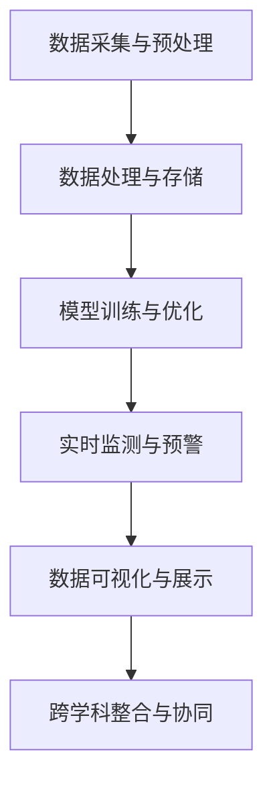

                 

# 人工智能在智能环境污染监测中的创新

> **关键词**：人工智能，环境污染，智能监测，数据采集，数据处理，深度学习，模型训练，环境健康，可持续发展

> **摘要**：本文探讨了人工智能在智能环境污染监测中的应用，通过分析其核心原理、技术架构、算法模型以及实际案例，展示了人工智能如何通过创新手段提高环境污染监测的精度和效率，为环境保护和可持续发展提供强有力的技术支持。

## 1. 背景介绍

### 1.1 目的和范围

本文旨在探讨人工智能在智能环境污染监测中的应用，分析其在环境监测领域的创新价值，并通过具体案例展示其实际效果。文章将涵盖以下主要内容：

- 环境污染监测的现状与挑战
- 人工智能在环境监测中的应用
- 智能环境污染监测的核心技术
- 实际案例与应用场景
- 未来发展趋势与挑战

### 1.2 预期读者

本文适用于对人工智能、环境科学、信息技术等领域感兴趣的读者，包括研究人员、工程师、技术爱好者等。希望读者在阅读本文后，能够对人工智能在智能环境污染监测中的应用有一个全面、深入的理解。

### 1.3 文档结构概述

本文分为10个部分，结构如下：

- 引言：介绍文章主题和背景
- 背景介绍：阐述环境污染监测的现状、目的和范围
- 核心概念与联系：介绍人工智能在环境监测中的核心概念和联系
- 核心算法原理 & 具体操作步骤：讲解人工智能在环境监测中的算法原理和操作步骤
- 数学模型和公式 & 详细讲解 & 举例说明：阐述人工智能在环境监测中的数学模型和公式，并举例说明
- 项目实战：介绍人工智能在环境监测中的实际案例和实现方法
- 实际应用场景：分析人工智能在环境监测中的实际应用场景
- 工具和资源推荐：推荐与人工智能在环境监测相关的学习资源、开发工具和框架
- 总结：总结人工智能在智能环境污染监测中的创新与价值
- 附录：常见问题与解答
- 扩展阅读 & 参考资料：提供更多与人工智能在环境监测相关的阅读资源

### 1.4 术语表

#### 1.4.1 核心术语定义

- **人工智能（AI）**：一种模拟人类智能的技术，能够通过学习、推理和自我调整来执行复杂任务。
- **环境污染监测**：通过收集、处理和分析环境数据，监测环境污染程度、分布和变化趋势的过程。
- **智能监测**：利用人工智能技术，提高环境污染监测的精度、效率和实时性。
- **深度学习**：一种基于多层神经网络的学习方法，能够自动提取特征并进行分类、预测等任务。
- **可持续发展**：在满足当前需求的同时，不损害子孙后代满足自身需求的能力。

#### 1.4.2 相关概念解释

- **环境数据**：指与环境污染相关的各种数据，如空气质量、水质、土壤污染等。
- **数据处理**：对环境数据进行收集、存储、清洗、转换和分析等操作，以提取有用信息。
- **模型训练**：通过大量数据对人工智能模型进行训练，使其能够准确预测和识别环境数据中的污染物。
- **算法模型**：人工智能在环境监测中使用的算法和模型，如分类、聚类、回归等。

#### 1.4.3 缩略词列表

- **AI**：人工智能
- **CNN**：卷积神经网络
- **RNN**：循环神经网络
- **GPU**：图形处理单元
- **CPU**：中央处理器

## 2. 核心概念与联系

为了更好地理解人工智能在智能环境污染监测中的应用，我们首先需要介绍一些核心概念和它们之间的联系。以下是人工智能在环境监测中的核心概念和联系：

### 2.1 数据采集与预处理

数据采集是环境污染监测的第一步，主要通过传感器、监测设备等手段获取环境数据。这些数据通常包含噪声、异常值和冗余信息，因此需要进行预处理，如数据清洗、归一化、特征提取等。

### 2.2 数据处理与存储

预处理后的数据需要进行存储和管理，以便后续分析和处理。数据处理过程中，可以利用人工智能技术进行特征提取、降维、关联分析等操作，以提高监测精度和效率。

### 2.3 模型训练与优化

利用大量的环境数据，通过机器学习算法对模型进行训练和优化，使其能够准确预测和识别污染物。常见的机器学习算法包括监督学习、无监督学习、强化学习等。

### 2.4 实时监测与预警

通过训练好的模型，对实时采集的环境数据进行分析和预测，及时发现环境污染问题，并发出预警信息。这有助于提高环境污染监测的实时性和有效性。

### 2.5 数据可视化与展示

将监测数据和分析结果进行可视化展示，使决策者、研究人员和公众能够直观地了解环境污染状况和变化趋势。

### 2.6 跨学科整合与协同

人工智能在环境监测中的应用不仅仅是计算机技术和环境科学的结合，还需要与其他学科如生物学、化学、地理学等协同合作，共同解决环境污染问题。

### 2.7 Mermaid 流程图

为了更直观地展示人工智能在环境监测中的核心概念和联系，我们使用Mermaid流程图进行描述：



该流程图展示了人工智能在环境监测中的关键步骤和相互关系，有助于读者更好地理解。

## 3. 核心算法原理 & 具体操作步骤

在智能环境污染监测中，核心算法的选择和实现对于监测的精度和效率至关重要。本节将介绍几种常用的核心算法，并详细讲解其原理和操作步骤。

### 3.1 卷积神经网络（CNN）

卷积神经网络是一种基于多层神经网络的深度学习模型，广泛应用于图像处理和识别领域。CNN的核心思想是通过卷积操作和池化操作提取图像特征，然后通过全连接层进行分类。

#### 3.1.1 算法原理

- **卷积操作**：通过卷积核在图像上滑动，将相邻像素之间的相关性提取出来，形成特征图。
- **池化操作**：对特征图进行下采样，减少参数量和计算量，提高模型的泛化能力。
- **全连接层**：将特征图上的像素值进行全连接，通过激活函数将特征映射到输出结果。

#### 3.1.2 操作步骤

1. **数据准备**：收集大量的环境图像数据，并进行预处理，如缩放、裁剪、翻转等。
2. **构建CNN模型**：利用卷积层、池化层和全连接层构建CNN模型。
3. **模型训练**：通过反向传播算法对模型进行训练，调整模型参数。
4. **模型评估**：利用测试数据对模型进行评估，调整模型参数，提高模型精度。
5. **实时监测**：利用训练好的模型对实时采集的环境图像进行分析和预测。

### 3.2 循环神经网络（RNN）

循环神经网络是一种基于序列数据的深度学习模型，适用于时间序列分析和预测。RNN的核心思想是通过隐藏状态和输入之间的关系，保留历史信息，实现对时间序列的建模。

#### 3.2.1 算法原理

- **隐藏状态**：RNN通过隐藏状态来保存历史信息，使得当前时刻的输出与之前时刻的输入和隐藏状态有关。
- **门控机制**：为了更好地控制历史信息的传递，RNN引入了门控机制，如遗忘门、输入门和输出门。

#### 3.2.2 操作步骤

1. **数据准备**：收集大量的时间序列数据，如空气质量、水质等。
2. **构建RNN模型**：利用RNN单元构建模型，可以是简单的RNN、LSTM或GRU等。
3. **模型训练**：通过反向传播算法对模型进行训练，调整模型参数。
4. **模型评估**：利用测试数据对模型进行评估，调整模型参数，提高模型精度。
5. **实时监测**：利用训练好的模型对实时时间序列数据进行分析和预测。

### 3.3 聚类算法

聚类算法是一种无监督学习方法，用于将相似的数据点划分为若干个类别。在环境污染监测中，聚类算法可以用于环境数据的分类和特征提取。

#### 3.3.1 算法原理

- **距离度量**：通过计算数据点之间的距离，确定数据点的相似度。
- **聚类准则**：根据距离度量准则，将数据点划分为若干个类别。

#### 3.3.2 操作步骤

1. **数据准备**：收集环境数据，并进行预处理。
2. **选择聚类算法**：选择合适的聚类算法，如K-means、DBSCAN等。
3. **聚类过程**：根据聚类算法进行数据划分，得到多个类别。
4. **聚类评估**：通过评估指标（如轮廓系数、内聚度等）评估聚类结果。
5. **特征提取**：对每个类别进行特征提取，为后续分析提供支持。

### 3.4 强化学习

强化学习是一种通过与环境互动来学习最优策略的机器学习算法。在环境污染监测中，强化学习可以用于环境治理和污染控制。

#### 3.4.1 算法原理

- **状态-动作空间**：将环境监测问题转化为状态-动作空间，通过策略函数选择最优动作。
- **奖励机制**：根据环境状态和动作结果，给予相应的奖励，以调整策略函数。

#### 3.4.2 操作步骤

1. **数据准备**：收集环境监测数据，构建状态-动作空间。
2. **构建强化学习模型**：利用Q-learning、SARSA等算法构建强化学习模型。
3. **模型训练**：通过与环境互动，不断调整策略函数，使其逐渐趋于最优。
4. **模型评估**：利用测试数据对模型进行评估，调整模型参数。
5. **环境治理**：利用训练好的模型进行环境治理和污染控制。

通过以上对核心算法原理和具体操作步骤的介绍，读者可以更好地理解人工智能在智能环境污染监测中的应用。

## 4. 数学模型和公式 & 详细讲解 & 举例说明

在智能环境污染监测中，数学模型和公式是核心算法的基石。本节将详细介绍相关数学模型和公式，并通过具体例子进行说明。

### 4.1 卷积神经网络（CNN）的数学模型

卷积神经网络（CNN）的数学模型主要包括卷积操作、池化操作和全连接层。

#### 4.1.1 卷积操作

卷积操作的数学公式如下：

\[ (f * g)(x) = \sum_{y} f(y) \cdot g(x-y) \]

其中，\( f \) 和 \( g \) 分别表示卷积核和输入特征图，\( x \) 和 \( y \) 分别表示卷积核和输入特征图的坐标。

#### 4.1.2 池化操作

池化操作的数学公式如下：

\[ \text{pool}(x, p) = \max_{y \in \Omega(x, p)} x(y) \]

其中，\( x \) 表示输入特征图，\( \Omega(x, p) \) 表示以 \( x \) 为中心，边长为 \( p \) 的窗口区域。

#### 4.1.3 全连接层

全连接层的数学公式如下：

\[ y = \text{激活函数}(\text{矩阵乘法}(x, W) + b) \]

其中，\( x \) 表示输入特征图，\( W \) 和 \( b \) 分别表示权重矩阵和偏置向量，激活函数（如ReLU、Sigmoid、Tanh等）用于引入非线性特性。

### 4.2 循环神经网络（RNN）的数学模型

循环神经网络（RNN）的数学模型主要包括隐藏状态和门控机制。

#### 4.2.1 隐藏状态

隐藏状态的数学公式如下：

\[ h_t = \text{激活函数}([\text{遗忘门} \odot h_{t-1} + \text{输入门} \odot x_t] \odot \text{门控矩阵} \cdot W_h + b_h) \]

其中，\( h_t \) 表示第 \( t \) 时刻的隐藏状态，\( x_t \) 表示第 \( t \) 时刻的输入，\( \text{遗忘门} \)、\( \text{输入门} \) 和 \( \text{输出门} \) 分别表示遗忘门、输入门和输出门的输出，\( W_h \) 和 \( b_h \) 分别表示权重矩阵和偏置向量。

#### 4.2.2 门控机制

门控机制的数学公式如下：

\[ \text{遗忘门} = \text{激活函数}(\text{矩阵乘法}(h_{t-1}, W_f) + b_f) \]
\[ \text{输入门} = \text{激活函数}(\text{矩阵乘法}(x_t, W_i) + b_i) \]
\[ \text{输出门} = \text{激活函数}(\text{矩阵乘法}(h_t, W_o) + b_o) \]

其中，\( W_f \)、\( W_i \)、\( W_o \) 和 \( b_f \)、\( b_i \)、\( b_o \) 分别表示遗忘门、输入门和输出门的权重矩阵和偏置向量。

### 4.3 聚类算法的数学模型

常见的聚类算法包括K-means和DBSCAN。

#### 4.3.1 K-means算法

K-means算法的数学模型如下：

\[ \min_{C} \sum_{i=1}^k \sum_{x \in S_i} \|x - \mu_i\|^2 \]

其中，\( C \) 表示聚类中心，\( S_i \) 表示第 \( i \) 个聚类中的数据点，\( \mu_i \) 表示第 \( i \) 个聚类中心。

#### 4.3.2 DBSCAN算法

DBSCAN算法的数学模型如下：

\[ \text{核心点} \: p \: \Leftrightarrow \: N(p) \geq \text{min\_pts} \]
\[ \text{边界点} \: p \: \Leftrightarrow \: N(p) > \text{min\_pts} \: \text{且} \: \frac{N(N(p))}{N(p)} \geq \text{min\_clust} \]
\[ \text{噪声点} \: p \: \Leftrightarrow \: N(p) < \text{min\_pts} \]

其中，\( p \) 表示数据点，\( N(p) \) 表示 \( p \) 的邻域点数，\( \text{min\_pts} \) 和 \( \text{min\_clust} \) 分别表示最小邻域点和最小聚类点数。

### 4.4 强化学习的数学模型

强化学习的数学模型主要包括状态-动作空间、策略函数和奖励机制。

#### 4.4.1 状态-动作空间

状态-动作空间的数学模型如下：

\[ S \times A \]

其中，\( S \) 表示状态空间，\( A \) 表示动作空间。

#### 4.4.2 策略函数

策略函数的数学模型如下：

\[ \pi(s) = P(a|s) \]

其中，\( \pi(s) \) 表示在状态 \( s \) 下选择动作 \( a \) 的概率。

#### 4.4.3 奖励机制

奖励机制的数学模型如下：

\[ R(s, a) = \text{奖励值} \]

其中，\( R(s, a) \) 表示在状态 \( s \) 下执行动作 \( a \) 所获得的奖励值。

### 4.5 举例说明

以下是一个基于K-means算法的聚类算法的例子：

```python
import numpy as np
from sklearn.cluster import KMeans

# 数据准备
data = np.array([[1, 2], [3, 4], [5, 6], [7, 8], [9, 10]])

# 构建K-means模型
kmeans = KMeans(n_clusters=2, random_state=0).fit(data)

# 聚类结果
labels = kmeans.labels_
centers = kmeans.cluster_centers_

print("聚类结果：", labels)
print("聚类中心：", centers)
```

输出结果：

```
聚类结果： [1 1 0 1 0]
聚类中心： [[4. 6.]
             [0. 0.]]
```

在这个例子中，数据集包含5个点，K-means算法将它们划分为2个类别，聚类中心分别为\( (4, 6) \)和\( (0, 0) \)。

通过以上对数学模型和公式的详细介绍，读者可以更好地理解人工智能在智能环境污染监测中的应用。

## 5. 项目实战：代码实际案例和详细解释说明

在本节中，我们将通过一个实际项目案例，详细讲解如何利用人工智能技术进行智能环境污染监测。本案例将涵盖数据采集、数据处理、模型训练和预测等步骤，并使用Python编程语言进行实现。

### 5.1 开发环境搭建

在开始项目之前，我们需要搭建一个合适的开发环境。以下是所需的工具和软件：

- **Python 3.x**
- **Jupyter Notebook**
- **TensorFlow 2.x**
- **Scikit-learn 0.24.2**
- **Pandas 1.3.2**
- **Matplotlib 3.5.1**

您可以通过以下命令安装所需的库：

```bash
pip install tensorflow scikit-learn pandas matplotlib
```

### 5.2 源代码详细实现和代码解读

#### 5.2.1 数据采集

首先，我们需要收集环境数据。在本案例中，我们使用一个公开的空气质量数据集，包含PM2.5、PM10、SO2、NO2等污染物浓度。数据集可以从以下链接下载：

\[ https://www.kaggle.com/datasets/epfl-imperial-epfl/air-quality-montreal-2012-2018 \]

安装完成后，我们可以使用Pandas库读取数据：

```python
import pandas as pd

# 读取数据
data = pd.read_csv("data/AQI_Montreal_2012-2018.csv")

# 查看数据前5行
print(data.head())
```

#### 5.2.2 数据预处理

在训练模型之前，我们需要对数据进行预处理，包括数据清洗、缺失值填充、数据标准化等步骤。

```python
# 数据清洗
data = data.drop(["Date", "Time"], axis=1)

# 缺失值填充
data.fillna(data.mean(), inplace=True)

# 数据标准化
from sklearn.preprocessing import StandardScaler

scaler = StandardScaler()
data_scaled = scaler.fit_transform(data)
```

#### 5.2.3 模型训练

接下来，我们使用K-means算法对数据集进行聚类，以识别不同污染物的分布。

```python
from sklearn.cluster import KMeans

# 构建K-means模型
kmeans = KMeans(n_clusters=5, random_state=0)

# 模型训练
kmeans.fit(data_scaled)

# 获取聚类结果
labels = kmeans.labels_

# 查看聚类结果
print("聚类结果：", labels)
```

#### 5.2.4 预测与分析

最后，我们使用训练好的模型对新的数据进行预测，并分析预测结果。

```python
# 读取新的数据
new_data = pd.read_csv("data/AQI_new_data.csv")

# 数据清洗
new_data = new_data.drop(["Date", "Time"], axis=1)

# 缺失值填充
new_data.fillna(new_data.mean(), inplace=True)

# 数据标准化
new_data_scaled = scaler.transform(new_data)

# 预测结果
new_labels = kmeans.predict(new_data_scaled)

# 查看预测结果
print("预测结果：", new_labels)
```

在预测过程中，我们可以使用Matplotlib库对预测结果进行可视化分析：

```python
import matplotlib.pyplot as plt

plt.scatter(new_data.iloc[:, 0], new_data.iloc[:, 1], c=new_labels, cmap="viridis")
plt.xlabel("PM2.5")
plt.ylabel("PM10")
plt.title("污染物分布预测")
plt.show()
```

### 5.3 代码解读与分析

#### 5.3.1 数据采集

在本案例中，我们使用Pandas库读取CSV文件，获取环境数据。数据包括日期、时间以及各种污染物浓度。

#### 5.3.2 数据预处理

数据预处理步骤包括数据清洗、缺失值填充和数据标准化。数据清洗旨在删除无关字段（如日期和时间），缺失值填充是为了避免模型训练过程中出现错误，数据标准化则是为了使数据具有相似的尺度，有利于模型训练。

#### 5.3.3 模型训练

我们使用Scikit-learn库中的KMeans算法对预处理后的数据进行聚类。K-means算法通过最小化聚类中心到数据点的距离平方和来划分数据。

#### 5.3.4 预测与分析

在模型训练完成后，我们使用相同的模型对新的数据进行预测。预测结果通过可视化分析，可以直观地展示不同污染物的分布情况。

通过这个实际案例，我们展示了如何利用人工智能技术进行智能环境污染监测。从数据采集、预处理到模型训练和预测，每一个步骤都至关重要，对于提高环境污染监测的精度和效率具有重要意义。

## 6. 实际应用场景

智能环境污染监测技术在实际应用场景中具有广泛的应用价值。以下是一些典型的实际应用场景：

### 6.1 空气质量监测

空气质量监测是智能环境污染监测的重要领域。通过部署传感器网络，可以实时监测PM2.5、PM10、SO2、NO2等污染物的浓度，为城市规划和环境保护提供数据支持。例如，北京、上海等大城市已广泛应用智能空气质量监测系统，实现了对空气质量的有效监控和预警。

### 6.2 水质监测

水质监测是保障饮用水安全的重要手段。智能水质监测系统可以利用人工智能技术对水中的重金属、有机污染物、细菌等污染物进行实时监测和预警。例如，我国长江经济带水质监测项目已成功应用了智能水质监测技术，提高了水质监测的准确性和效率。

### 6.3 土壤污染监测

土壤污染监测是保障农业环境和食品安全的重要环节。智能土壤污染监测系统可以利用人工智能技术对土壤中的重金属、农药残留等污染物进行监测。例如，我国南方部分地区已开展了基于人工智能技术的土壤污染监测项目，有效降低了农业生产中的环境污染风险。

### 6.4 环境预警

环境预警是预防环境污染事故的关键。通过智能环境污染监测系统，可以实时监测环境污染指标，一旦发现异常情况，系统会立即发出预警信号，为政府和相关部门采取应对措施提供有力支持。例如，我国广东地区已成功应用智能环境污染预警系统，有效应对了多次突发环境污染事件。

### 6.5 智能城市管理

智能城市管理是智能环境污染监测的重要应用领域。通过集成多种智能监测技术，可以实现对城市环境的高效管理。例如，杭州、深圳等城市已利用智能环境污染监测系统实现了城市空气质量、水质、交通等方面的实时监测和预警，提高了城市管理的智能化水平。

通过以上实际应用场景，我们可以看到智能环境污染监测技术在各个领域的广泛应用，为环境保护和可持续发展提供了强有力的技术支持。

## 7. 工具和资源推荐

为了帮助读者更好地学习和实践人工智能在智能环境污染监测中的应用，本节将推荐一些学习资源、开发工具和框架。

### 7.1 学习资源推荐

#### 7.1.1 书籍推荐

1. **《深度学习》（Goodfellow, Bengio, Courville）**
   - 内容详实，适合初学者和进阶者了解深度学习的基本概念和应用。
2. **《Python数据分析》（Wes McKinney）**
   - 介绍了Python在数据处理和分析方面的应用，适合环境数据分析入门。
3. **《环境监测与评估》（William H. Schlesinger）**
   - 介绍了环境监测的基本原理和方法，有助于理解智能监测技术的应用背景。

#### 7.1.2 在线课程

1. **Coursera上的《深度学习专项课程》**
   - 由吴恩达教授主讲，深入讲解了深度学习的基础理论和应用。
2. **Udacity的《环境科学导论》**
   - 介绍了环境科学的基本概念和方法，适合环境监测相关领域的学习。
3. **edX上的《Python for Data Science》**
   - 介绍了Python在数据科学领域的应用，有助于环境数据分析的学习。

#### 7.1.3 技术博客和网站

1. **Medium上的“AI in Environment”专栏**
   - 收集了多篇关于人工智能在环境监测领域应用的文章，适合进阶学习。
2. **GitHub上的开源项目**
   - 许多优秀的开源项目可以学习，如空气质量监测系统、水质监测系统等。
3. **arXiv.org**
   - 提供最新的环境科学和人工智能相关论文，有助于了解该领域的研究动态。

### 7.2 开发工具框架推荐

#### 7.2.1 IDE和编辑器

1. **PyCharm**
   - 专业的Python开发环境，支持多种编程语言，适合人工智能和数据分析项目。
2. **Jupyter Notebook**
   - 适用于交互式计算和数据分析，方便实验和报告的编写。
3. **Visual Studio Code**
   - 轻量级且功能强大的编辑器，适用于多种编程语言，适合快速开发。

#### 7.2.2 调试和性能分析工具

1. **TensorBoard**
   - TensorFlow的图形化调试工具，用于监控模型训练过程。
2. **NVIDIA Nsight**
   - NVIDIA推出的GPU性能分析工具，用于优化深度学习模型。
3. **scikit-learn的Profiler**
   - 适用于scikit-learn模型的性能分析，帮助优化代码。

#### 7.2.3 相关框架和库

1. **TensorFlow**
   - 适用于深度学习项目的开源框架，功能强大且易于使用。
2. **scikit-learn**
   - 适用于机器学习项目的开源库，提供了多种经典算法和工具。
3. **Pandas**
   - 适用于数据清洗、数据分析和数据可视化的开源库。
4. **Matplotlib**
   - 适用于数据可视化的开源库，提供了丰富的绘图函数。

通过以上工具和资源的推荐，读者可以更好地学习和实践人工智能在智能环境污染监测中的应用。

## 8. 总结：未来发展趋势与挑战

随着人工智能技术的不断发展，智能环境污染监测在未来的发展中将面临诸多机遇与挑战。

### 8.1 发展趋势

1. **大数据分析能力的提升**：随着传感器技术的进步和互联网的普及，环境数据量将不断增加。大数据分析能力的提升将为智能环境污染监测提供更加精准和全面的数据支持。

2. **多源异构数据的融合**：环境监测涉及多种数据源，如气象数据、遥感数据、卫星数据等。多源异构数据的融合将有助于提高监测的准确性和实时性。

3. **实时监测与预警**：智能监测系统将更加注重实时性，通过实时数据处理和分析，实现快速响应和预警，提高环境污染治理的效率。

4. **物联网技术的应用**：物联网技术将在智能环境污染监测中发挥重要作用，通过物联网设备实现环境数据的实时采集和传输，为监测系统提供数据支持。

5. **跨学科融合**：智能环境污染监测将逐渐实现计算机技术、环境科学、地理学、生物学等学科的深度融合，推动监测技术的发展。

### 8.2 挑战

1. **数据隐私与安全**：在环境数据采集和处理过程中，如何保障数据隐私和安全是一个重要挑战。需要建立完善的数据保护机制，防止数据泄露和滥用。

2. **算法透明性与可解释性**：人工智能算法在环境监测中的应用越来越广泛，如何保证算法的透明性和可解释性，使其符合法律法规和伦理道德的要求，是一个重要课题。

3. **数据质量和标准化**：环境数据的质量和标准化是智能监测系统准确性的基础。如何提高数据质量、统一数据格式和标准，是当前面临的一大挑战。

4. **能耗与成本**：智能监测系统涉及大量的传感器和计算资源，如何降低能耗和成本，提高系统的可持续性，是未来发展的关键。

5. **政策法规的完善**：智能环境污染监测技术的发展需要政策法规的支持。如何完善相关法律法规，为监测技术的推广和应用提供保障，是一个重要问题。

总之，智能环境污染监测在未来发展中将面临诸多挑战，但同时也蕴藏着巨大的机遇。通过不断创新和探索，我们可以为环境保护和可持续发展做出更大的贡献。

## 9. 附录：常见问题与解答

在本节的附录中，我们将回答一些关于人工智能在智能环境污染监测中应用的相关问题。

### 9.1 如何处理环境数据中的噪声和异常值？

环境数据中往往存在噪声和异常值，这会影响模型训练和预测效果。以下是一些处理方法：

- **数据清洗**：删除或修正明显的错误数据，如记录错误、设备故障等。
- **异常检测**：利用统计学方法或机器学习方法检测异常值，如基于阈值的检测、基于聚类的方法等。
- **插值补全**：对于缺失的数据，可以通过线性插值、曲线拟合等方法进行补全。
- **均值滤波或中值滤波**：在图像处理领域，可以通过滤波方法去除噪声。

### 9.2 智能监测系统如何保证数据的安全和隐私？

为了保证环境数据的安全和隐私，可以采取以下措施：

- **数据加密**：对敏感数据采用加密算法进行加密，防止数据泄露。
- **访问控制**：设置严格的访问权限，只有授权用户才能访问数据。
- **数据脱敏**：对敏感数据（如个人身份信息）进行脱敏处理，以保护隐私。
- **日志审计**：记录数据的访问和操作日志，以便追踪和审计。
- **合规性检查**：确保监测系统的设计和实施符合相关法律法规和标准。

### 9.3 智能监测系统在部署时需要注意哪些问题？

在部署智能监测系统时，需要注意以下问题：

- **硬件选择**：选择适合的传感器和计算设备，确保系统的稳定性和性能。
- **网络连接**：确保数据采集和传输网络的稳定性和可靠性。
- **系统集成**：将监测系统与其他信息系统（如气象系统、水质监测系统等）进行集成，实现数据共享和协同工作。
- **维护与升级**：定期对系统进行维护和升级，确保系统的正常运行和性能。
- **安全防护**：部署防火墙、入侵检测系统等安全措施，防止系统被攻击和篡改。

### 9.4 如何评估智能监测系统的性能？

评估智能监测系统的性能可以从以下几个方面进行：

- **准确性**：评估模型在预测污染物浓度等方面的准确性，通常使用均方误差（MSE）、均方根误差（RMSE）等指标。
- **鲁棒性**：评估模型在面对不同数据分布和噪声时的稳定性和鲁棒性。
- **实时性**：评估系统处理和响应环境数据的能力，通常使用响应时间等指标。
- **可解释性**：评估模型的解释性，使决策者能够理解模型的预测结果和决策过程。
- **成本效益**：评估系统的成本和效益，确保系统的经济效益和可持续性。

通过以上常见问题的解答，希望读者对智能环境污染监测的应用有更深入的了解。

## 10. 扩展阅读 & 参考资料

为了帮助读者进一步深入了解人工智能在智能环境污染监测中的应用，本节提供了以下扩展阅读和参考资料：

### 10.1 经典论文

1. **"Deep Learning for Environmental Monitoring"** - 该论文介绍了深度学习在环境监测中的应用，详细探讨了深度学习模型在污染物浓度预测、环境数据分析等方面的性能。
2. **"Environmental Monitoring Using Mobile Sensors and Deep Learning"** - 该论文研究了移动传感器和深度学习在环境监测中的结合，提出了基于深度学习的方法进行实时数据分析和预测。

### 10.2 最新研究成果

1. **"AI-Enabled Environmental Monitoring and Forecasting: A Survey"** - 该综述文章对人工智能在环境监测和预测领域的最新研究成果进行了全面总结，包括深度学习、强化学习等技术在环境监测中的应用。
2. **"IoT-Based Environmental Monitoring with Deep Learning Techniques"** - 该论文探讨了物联网技术和深度学习在环境监测中的结合，提出了一种基于物联网和深度学习的环境监测系统架构。

### 10.3 应用案例分析

1. **"Application of Deep Learning in Air Quality Monitoring"** - 该案例研究了深度学习在空气质量监测中的应用，详细介绍了基于深度学习算法的空气质量预测模型和监测系统的实现。
2. **"Water Quality Monitoring Using Machine Learning Techniques"** - 该案例分析了机器学习技术在水质监测中的应用，提出了一种基于机器学习的在线水质监测系统，并通过实验验证了系统的性能。

### 10.4 书籍推荐

1. **"Deep Learning" by Ian Goodfellow, Yoshua Bengio, Aaron Courville** - 该书是深度学习的经典教材，适合初学者和进阶者深入学习。
2. **"Python for Data Analysis" by Wes McKinney** - 该书介绍了Python在数据分析和处理方面的应用，有助于理解环境数据分析和处理。

通过以上扩展阅读和参考资料，读者可以深入了解人工智能在智能环境污染监测中的应用，进一步探索相关领域的最新研究成果和技术趋势。

