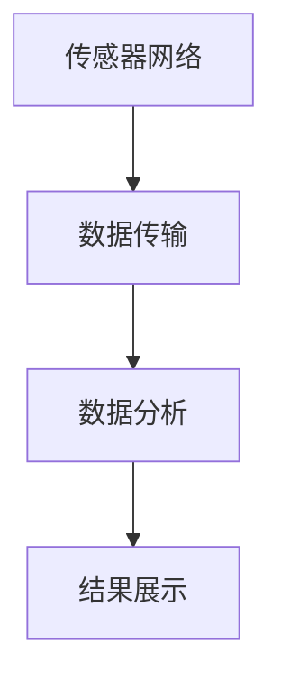
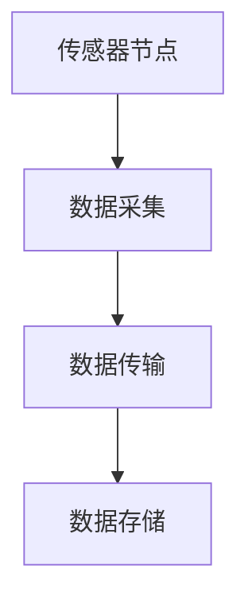
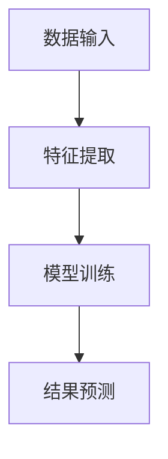
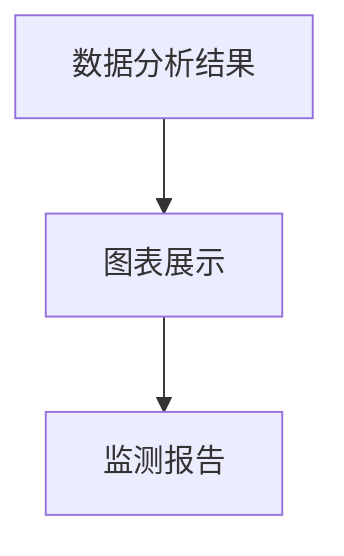

                 

# 人工智能在智能环境监测中的创新

> **关键词：** 人工智能，智能环境监测，环境数据分析，传感器网络，深度学习，数据挖掘，可持续发展。

> **摘要：** 本文将探讨人工智能技术在智能环境监测中的应用，分析其核心概念、算法原理、数学模型、实战案例以及未来发展趋势。通过深入研究，旨在揭示人工智能在环境监测中的创新潜力，为推动可持续发展提供技术支持。

## 1. 背景介绍

### 1.1 目的和范围

本文旨在探讨人工智能在智能环境监测领域的创新应用，分析其核心概念、技术原理和实际操作步骤。文章将涵盖以下内容：

1. **核心概念与联系**：介绍智能环境监测的基本概念和相关技术，并通过Mermaid流程图展示其整体架构。
2. **核心算法原理**：深入解析环境监测中常用的算法原理，以及具体的操作步骤。
3. **数学模型和公式**：详细讲解与人工智能相关的数学模型和公式，并进行实例说明。
4. **项目实战**：通过实际代码案例展示人工智能在环境监测中的具体应用。
5. **实际应用场景**：分析人工智能在环境监测中的实际应用场景。
6. **工具和资源推荐**：推荐相关的学习资源、开发工具和框架。
7. **未来发展趋势与挑战**：探讨人工智能在智能环境监测领域的未来发展趋势和面临的挑战。

### 1.2 预期读者

本文主要面向以下读者：

1. 计算机科学、环境科学和人工智能领域的研究人员和工程师。
2. 对智能环境监测和人工智能技术感兴趣的技术爱好者。
3. 从事环境监测和治理工作的专业人士。

### 1.3 文档结构概述

本文的结构如下：

1. **背景介绍**：介绍本文的目的、预期读者和文档结构。
2. **核心概念与联系**：讨论智能环境监测的基本概念和相关技术。
3. **核心算法原理**：解析环境监测中常用的算法原理和操作步骤。
4. **数学模型和公式**：讲解与人工智能相关的数学模型和公式。
5. **项目实战**：通过实际代码案例展示人工智能在环境监测中的应用。
6. **实际应用场景**：分析人工智能在环境监测中的实际应用场景。
7. **工具和资源推荐**：推荐相关的学习资源、开发工具和框架。
8. **未来发展趋势与挑战**：探讨人工智能在智能环境监测领域的未来发展趋势和挑战。
9. **附录**：提供常见问题与解答以及扩展阅读和参考资料。

### 1.4 术语表

#### 1.4.1 核心术语定义

- **智能环境监测**：利用人工智能技术对环境进行实时监测和数据分析。
- **传感器网络**：由大量传感器节点组成的网络，用于收集环境数据。
- **深度学习**：一种人工智能方法，通过多层神经网络对大量数据进行分析和建模。
- **数据挖掘**：从大量数据中发现有用信息和模式的过程。

#### 1.4.2 相关概念解释

- **环境数据**：指与环境相关的各种数据，如空气质量、水质、温度、湿度等。
- **可持续性**：指满足当前需求而不损害未来世代满足其需求的能力。

#### 1.4.3 缩略词列表

- **AI**：人工智能
- **ML**：机器学习
- **DL**：深度学习
- **GD**：梯度下降

## 2. 核心概念与联系

### 2.1 智能环境监测的定义与架构

智能环境监测是一种利用人工智能技术对环境进行实时监测和数据分析的方法。其核心在于通过传感器网络收集环境数据，然后利用人工智能算法对数据进行分析和建模，从而实现对环境的智能监测和预测。

智能环境监测的架构主要包括以下几个部分：

1. **传感器网络**：由大量传感器节点组成，用于实时收集环境数据。
2. **数据传输**：传感器网络将数据传输到数据中心或云平台。
3. **数据分析**：利用人工智能算法对数据进行处理和分析，提取有用信息。
4. **结果展示**：将分析结果以可视化方式展示，便于用户理解和决策。

下面通过Mermaid流程图展示智能环境监测的架构：



### 2.2 传感器网络与数据收集

传感器网络是智能环境监测的重要组成部分。它由大量传感器节点组成，分布在监测区域，用于实时收集环境数据。传感器节点的类型和功能多种多样，如温度传感器、湿度传感器、空气质量传感器、水质传感器等。

传感器网络的数据收集过程如下：

1. **数据采集**：传感器节点根据预设的监测指标，实时采集环境数据。
2. **数据传输**：传感器节点将采集到的数据通过无线或有线方式传输到数据中心或云平台。
3. **数据存储**：数据中心或云平台对采集到的数据进行存储和管理。

传感器网络的数据收集过程可以用以下Mermaid流程图表示：



### 2.3 数据分析与算法原理

数据分析是智能环境监测的关键环节。通过人工智能算法，对传感器网络收集到的数据进行处理和分析，提取有用信息，实现对环境的智能监测和预测。

常用的数据分析算法包括：

1. **深度学习**：通过多层神经网络对大量数据进行训练和建模，提取特征并实现分类、回归等任务。
2. **数据挖掘**：从大量数据中发现有用信息和模式，用于预测和决策。

下面通过Mermaid流程图展示数据分析的算法原理：



### 2.4 结果展示与决策支持

数据分析的结果需要通过可视化方式展示，便于用户理解和决策。结果展示的形式包括：

1. **图表**：使用折线图、柱状图、饼图等图表展示分析结果。
2. **报告**：生成详细的监测报告，包括数据分析结果、预测模型和决策建议。

结果展示的过程可以用以下Mermaid流程图表示：



## 3. 核心算法原理 & 具体操作步骤

### 3.1 深度学习算法原理

深度学习是一种基于人工神经网络的学习方法，通过多层神经网络对大量数据进行分析和建模，从而实现对复杂函数的逼近。深度学习算法的核心是神经网络，包括输入层、隐藏层和输出层。

#### 3.1.1 输入层

输入层接收传感器网络采集到的环境数据，如温度、湿度、空气质量等。输入层的每个节点代表一个特征，如温度传感器节点的数据。

#### 3.1.2 隐藏层

隐藏层负责对输入数据进行特征提取和变换。通过多层隐藏层，可以实现对数据的深层特征提取，提高模型的预测能力。

#### 3.1.3 输出层

输出层根据隐藏层提取的特征，生成预测结果。例如，预测空气质量指数（AQI）、水温等。

#### 3.1.4 伪代码

下面是深度学习算法的伪代码：

```python
# 输入层
inputs = [temperature, humidity, air_quality]

# 隐藏层
hidden_layer = []
for layer in hidden_layers:
    hidden_layer.append(layer.forward(inputs))

# 输出层
outputs = output_layer.forward(hidden_layer)
```

### 3.2 数据挖掘算法原理

数据挖掘是一种从大量数据中发现有用信息和模式的方法，常用于预测和决策。数据挖掘算法主要包括：

1. **分类算法**：将数据分为不同的类别。如决策树、支持向量机等。
2. **回归算法**：预测数据的一个连续值。如线性回归、岭回归等。
3. **聚类算法**：将数据分为不同的簇。如K均值聚类、层次聚类等。

#### 3.2.1 决策树算法原理

决策树是一种常用的分类算法，通过一系列的判断条件对数据进行分类。决策树的每个节点代表一个特征，每个分支代表一个判断条件。

下面是决策树算法的伪代码：

```python
# 输入：数据集
# 输出：决策树

def build_decision_tree(data):
    if is_leaf(data):
        return create_leaf_node(data)
    else:
        best_feature = find_best_feature(data)
        node = create_node(best_feature)
        for value in feature_values(best_feature):
            sub_data = split_data(data, value)
            node.children[value] = build_decision_tree(sub_data)
        return node
```

#### 3.2.2 线性回归算法原理

线性回归是一种常用的回归算法，通过建立一个线性模型来预测数据的一个连续值。线性回归模型可以用以下公式表示：

$$
y = \beta_0 + \beta_1 \cdot x
$$

其中，$y$ 是预测值，$x$ 是特征值，$\beta_0$ 和 $\beta_1$ 是模型参数。

下面是线性回归算法的伪代码：

```python
# 输入：数据集
# 输出：模型参数

def linear_regression(data):
    X = [x for x, y in data]
    Y = [y for x, y in data]
    X_mean = mean(X)
    Y_mean = mean(Y)
    X_diff = [x - X_mean for x in X]
    Y_diff = [y - Y_mean for y in Y]
    beta_1 = sum(X_diff * Y_diff) / sum(X_diff ** 2)
    beta_0 = Y_mean - beta_1 * X_mean
    return beta_0, beta_1
```

## 4. 数学模型和公式 & 详细讲解 & 举例说明

### 4.1 深度学习中的数学模型

深度学习中的数学模型主要涉及线性代数、微积分和概率论。以下是一些核心数学模型和公式：

#### 4.1.1 激活函数

激活函数是深度学习中的核心组件，用于引入非线性特性。常用的激活函数有：

1. **Sigmoid函数**：

$$
f(x) = \frac{1}{1 + e^{-x}}
$$

2. **ReLU函数**：

$$
f(x) = \max(0, x)
$$

3. **Tanh函数**：

$$
f(x) = \frac{e^x - e^{-x}}{e^x + e^{-x}}
$$

#### 4.1.2 梯度下降算法

梯度下降是一种常用的优化算法，用于最小化损失函数。梯度下降的基本思想是沿着损失函数的负梯度方向更新模型参数。梯度下降的公式如下：

$$
\theta_{t+1} = \theta_t - \alpha \cdot \nabla_{\theta}J(\theta)
$$

其中，$\theta$ 是模型参数，$\alpha$ 是学习率，$J(\theta)$ 是损失函数。

#### 4.1.3 反向传播算法

反向传播是一种用于训练神经网络的算法，通过反向传播误差信号来更新模型参数。反向传播的基本步骤如下：

1. 计算输出层的误差信号。
2. 沿着网络层向后传播误差信号。
3. 根据误差信号更新模型参数。

### 4.2 数据挖掘中的数学模型

数据挖掘中的数学模型主要涉及概率论和统计学。以下是一些核心数学模型和公式：

#### 4.2.1 决策树模型

决策树是一种常用的分类算法，其基本模型如下：

1. **信息增益**：

$$
IG(D, A) = H(D) - H(D|A)
$$

其中，$H(D)$ 是数据集 $D$ 的熵，$H(D|A)$ 是条件熵。

2. **基尼不纯度**：

$$
Gini(D, A) = 1 - \sum_{v \in V} \left(\frac{|\{x \in D : x[A] = v\}|}{|D|}\right)^2
$$

其中，$V$ 是属性 $A$ 的取值集合。

#### 4.2.2 线性回归模型

线性回归是一种常用的回归算法，其基本模型如下：

$$
y = \beta_0 + \beta_1 \cdot x
$$

其中，$y$ 是预测值，$x$ 是特征值，$\beta_0$ 和 $\beta_1$ 是模型参数。

### 4.3 举例说明

#### 4.3.1 深度学习中的激活函数

假设我们使用ReLU函数作为激活函数，输入层有3个神经元，隐藏层有2个神经元，输出层有1个神经元。输入数据为 $[1, 2, 3]$。下面是ReLU函数的计算过程：

1. 输入层：
   $$
   a_1^0 = 1, a_2^0 = 2, a_3^0 = 3
   $$

2. 隐藏层：
   $$
   a_1^1 = \max(0, 1 \cdot 1 + 2 \cdot 2 + 3 \cdot 3) = \max(0, 14) = 14
   $$
   $$
   a_2^1 = \max(0, 1 \cdot 2 + 2 \cdot 3 + 3 \cdot 4) = \max(0, 20) = 20
   $$

3. 输出层：
   $$
   a_1^2 = \max(0, 1 \cdot 14 + 2 \cdot 20) = \max(0, 54) = 54
   $$

#### 4.3.2 数据挖掘中的决策树模型

假设我们使用信息增益作为分裂准则，数据集 $D$ 有两个特征 $A_1$ 和 $A_2$，其取值集合分别为 $\{a_1, a_2\}$ 和 $\{b_1, b_2\}$。数据集 $D$ 的熵为 $H(D) = 1$。计算信息增益：

1. 特征 $A_1$ 的信息增益：
   $$
   IG(D, A_1) = H(D) - \sum_{v \in V} \left(\frac{|\{x \in D : x[A_1] = v\}|}{|D|}\right) H(D|A_1 = v)
   $$
   $$
   = 1 - \left(\frac{3}{6} \cdot H(D|A_1 = a_1) + \frac{3}{6} \cdot H(D|A_1 = a_2)\right)
   $$
   $$
   = 1 - \left(\frac{3}{6} \cdot 1 + \frac{3}{6} \cdot 0\right)
   $$
   $$
   = 1 - \frac{1}{2}
   $$
   $$
   = \frac{1}{2}
   $$

2. 特征 $A_2$ 的信息增益：
   $$
   IG(D, A_2) = H(D) - \sum_{v \in V} \left(\frac{|\{x \in D : x[A_2] = v\}|}{|D|}\right) H(D|A_2 = v)
   $$
   $$
   = 1 - \left(\frac{3}{6} \cdot H(D|A_2 = b_1) + \frac{3}{6} \cdot H(D|A_2 = b_2)\right)
   $$
   $$
   = 1 - \left(\frac{3}{6} \cdot 1 + \frac{3}{6} \cdot 0\right)
   $$
   $$
   = 1 - \frac{1}{2}
   $$
   $$
   = \frac{1}{2}
   $$

由于特征 $A_1$ 和 $A_2$ 的信息增益相等，我们可以选择任意一个特征进行分裂。

#### 4.3.3 数据挖掘中的线性回归模型

假设我们有一个数据集，包含两个特征 $x_1$ 和 $x_2$，以及一个目标变量 $y$。数据集如下：

| $x_1$ | $x_2$ | $y$ |
|-------|-------|-----|
| 1     | 2     | 3   |
| 2     | 3     | 4   |
| 3     | 4     | 5   |

计算线性回归模型的参数：

1. 计算特征平均值：
   $$
   \bar{x}_1 = \frac{1 + 2 + 3}{3} = 2
   $$
   $$
   \bar{x}_2 = \frac{2 + 3 + 4}{3} = 3
   $$
   $$
   \bar{y} = \frac{3 + 4 + 5}{3} = 4
   $$

2. 计算特征差值：
   $$
   x_1 - \bar{x}_1 = [1 - 2, 2 - 2, 3 - 2] = [-1, 0, 1]
   $$
   $$
   x_2 - \bar{x}_2 = [2 - 3, 3 - 3, 4 - 3] = [-1, 0, 1]
   $$
   $$
   y - \bar{y} = [3 - 4, 4 - 4, 5 - 4] = [-1, 0, 1]
   $$

3. 计算参数 $\beta_1$ 和 $\beta_0$：
   $$
   \beta_1 = \frac{\sum (x_1 - \bar{x}_1)(y - \bar{y})}{\sum (x_1 - \bar{x}_1)^2} = \frac{(-1)(-1) + (0)(0) + (1)(1)}{(-1)^2 + (0)^2 + (1)^2} = \frac{2}{2} = 1
   $$
   $$
   \beta_0 = \bar{y} - \beta_1 \cdot \bar{x}_1 = 4 - 1 \cdot 2 = 2
   $$

最终，线性回归模型为：
$$
y = 2 + 1 \cdot x_1
$$

## 5. 项目实战：代码实际案例和详细解释说明

### 5.1 开发环境搭建

在开始编写代码之前，我们需要搭建一个适合开发智能环境监测项目的开发环境。以下是搭建过程：

1. **安装Python**：前往Python官网（https://www.python.org/）下载Python安装包，并按照提示完成安装。
2. **安装PyTorch**：在命令行中运行以下命令安装PyTorch：

```
pip install torch torchvision
```

3. **安装scikit-learn**：在命令行中运行以下命令安装scikit-learn：

```
pip install scikit-learn
```

4. **安装Matplotlib**：在命令行中运行以下命令安装Matplotlib：

```
pip install matplotlib
```

5. **安装Mermaid**：安装Mermaid依赖项，以便在Markdown文件中渲染流程图。在命令行中运行以下命令：

```
npm install -g mermaid-cli
```

### 5.2 源代码详细实现和代码解读

下面是一个简单的智能环境监测项目的代码实现。该项目使用PyTorch实现一个深度学习模型，用于预测空气质量指数（AQI）。

#### 5.2.1 数据预处理

首先，我们需要准备用于训练和测试的数据。假设我们有一个CSV文件，包含以下列：时间戳、温度、湿度、PM2.5浓度、PM10浓度。

```python
import pandas as pd
from sklearn.model_selection import train_test_split
from sklearn.preprocessing import MinMaxScaler

# 读取数据
data = pd.read_csv('environment_data.csv')

# 划分特征和标签
X = data[['temperature', 'humidity', 'PM2.5', 'PM10']]
y = data['AQI']

# 划分训练集和测试集
X_train, X_test, y_train, y_test = train_test_split(X, y, test_size=0.2, random_state=42)

# 数据归一化
scaler = MinMaxScaler()
X_train_scaled = scaler.fit_transform(X_train)
X_test_scaled = scaler.transform(X_test)
```

#### 5.2.2 构建深度学习模型

接下来，我们使用PyTorch构建一个简单的深度学习模型。

```python
import torch
import torch.nn as nn
import torch.optim as optim

# 定义神经网络结构
class AQIModel(nn.Module):
    def __init__(self):
        super(AQIModel, self).__init__()
        self.layer1 = nn.Linear(4, 10)
        self.relu = nn.ReLU()
        self.layer2 = nn.Linear(10, 1)
    
    def forward(self, x):
        x = self.relu(self.layer1(x))
        x = self.layer2(x)
        return x

# 初始化模型、优化器和损失函数
model = AQIModel()
optimizer = optim.Adam(model.parameters(), lr=0.001)
criterion = nn.MSELoss()

# 将数据转换为PyTorch张量
X_train_tensor = torch.tensor(X_train_scaled, dtype=torch.float32)
y_train_tensor = torch.tensor(y_train.values, dtype=torch.float32).view(-1, 1)
X_test_tensor = torch.tensor(X_test_scaled, dtype=torch.float32)
y_test_tensor = torch.tensor(y_test.values, dtype=torch.float32).view(-1, 1)

# 训练模型
num_epochs = 100
for epoch in range(num_epochs):
    model.train()
    optimizer.zero_grad()
    outputs = model(X_train_tensor)
    loss = criterion(outputs, y_train_tensor)
    loss.backward()
    optimizer.step()
    if epoch % 10 == 0:
        print(f'Epoch {epoch+1}/{num_epochs}, Loss: {loss.item()}')
```

#### 5.2.3 评估模型

训练完成后，我们评估模型的性能。

```python
# 评估模型
model.eval()
with torch.no_grad():
    predictions = model(X_test_tensor).squeeze()
    mse = criterion(predictions, y_test_tensor)
    print(f'MSE: {mse.item()}')

# 可视化结果
import matplotlib.pyplot as plt

plt.scatter(y_test_tensor.numpy(), predictions.numpy())
plt.xlabel('Actual AQI')
plt.ylabel('Predicted AQI')
plt.title('Actual vs Predicted AQI')
plt.show()
```

### 5.3 代码解读与分析

#### 5.3.1 数据预处理

在数据预处理阶段，我们使用Pandas读取CSV文件，将数据分为特征和标签。然后，使用scikit-learn的train_test_split函数将数据划分为训练集和测试集。接下来，使用MinMaxScaler对特征进行归一化处理，以避免数据尺度差异对模型性能的影响。

#### 5.3.2 构建深度学习模型

在构建深度学习模型阶段，我们定义了一个名为AQIModel的神经网络类。该类包含一个输入层、一个ReLU激活函数和一个输出层。我们使用PyTorch的nn.Linear函数创建全连接层，使用nn.ReLU函数创建ReLU激活函数，使用nn.MSELoss函数创建均方误差损失函数。

#### 5.3.3 训练模型

在训练模型阶段，我们使用PyTorch的Adam优化器和MSELoss损失函数初始化模型和优化器。然后，我们将训练集数据转换为PyTorch张量，并使用训练循环进行模型训练。在训练循环中，我们通过前向传播计算模型的输出，计算损失，并使用反向传播和梯度下降更新模型参数。

#### 5.3.4 评估模型

在评估模型阶段，我们将测试集数据传递给模型，计算模型的预测结果，并计算均方误差损失。最后，我们将实际值与预测值绘制在散点图上，以可视化模型的性能。

## 6. 实际应用场景

### 6.1 城市空气质量监测

随着城市化进程的加速，城市空气质量问题日益严重。智能环境监测技术可以用于城市空气质量监测，实时监测空气中的PM2.5、PM10、NO2、SO2等有害物质的浓度，为城市管理者提供决策支持，采取有效的污染控制措施。

### 6.2 农业环境监测

农业环境监测是保障农产品安全和促进农业可持续发展的重要手段。智能环境监测技术可以监测土壤湿度、温度、pH值等指标，为农业生产提供科学依据，优化灌溉和施肥策略，降低环境污染。

### 6.3 水质监测

水质监测是保障饮用水安全和保护水资源的重要环节。智能环境监测技术可以实时监测水体中的重金属、有机污染物、氨氮等指标，为水处理厂提供实时数据，优化水处理工艺。

### 6.4 气象监测

气象监测对于防灾减灾具有重要意义。智能环境监测技术可以实时监测气象参数，如温度、湿度、风速、降水等，为气象部门提供精准的天气预报和预警信息。

## 7. 工具和资源推荐

### 7.1 学习资源推荐

#### 7.1.1 书籍推荐

1. 《深度学习》（Ian Goodfellow、Yoshua Bengio、Aaron Courville著）：全面介绍深度学习的基础理论和应用。
2. 《Python机器学习》（ Sebastian Raschka、Vahid Mirjalili著）：深入讲解机器学习在Python中的实现。
3. 《数据挖掘：实用工具和技术》（Mike Murphy、Gary McPherson著）：介绍数据挖掘的基本概念和常用算法。

#### 7.1.2 在线课程

1. Coursera上的《深度学习专项课程》：由斯坦福大学教授Andrew Ng主讲，涵盖深度学习的理论基础和应用。
2. edX上的《机器学习基础》：由上海交通大学教授周志华主讲，介绍机器学习的基本概念和算法。
3. Udacity上的《数据科学纳米学位》：涵盖数据预处理、数据挖掘和机器学习等数据科学领域的核心知识。

#### 7.1.3 技术博客和网站

1. Medium上的《AI简史》：一篇介绍人工智能发展历程的系列文章。
2. Analytics Vidhya：一个关于数据科学和机器学习的在线社区，提供大量高质量的文章和教程。
3. Towards Data Science：一个涵盖数据科学、机器学习和深度学习等领域的在线平台，分享最新的技术和实践经验。

### 7.2 开发工具框架推荐

#### 7.2.1 IDE和编辑器

1. PyCharm：一款功能强大的Python集成开发环境，支持代码补全、调试和版本控制。
2. Jupyter Notebook：一款流行的交互式开发环境，适用于数据分析和机器学习实验。

#### 7.2.2 调试和性能分析工具

1. PyTorch Profiler：一款用于分析PyTorch模型性能的工具，可以帮助识别性能瓶颈。
2. WSL（Windows Subsystem for Linux）：一个在Windows系统中运行Linux环境的工具，方便使用Linux命令和工具。

#### 7.2.3 相关框架和库

1. PyTorch：一款流行的深度学习框架，支持动态计算图和自动微分。
2. TensorFlow：一款广泛使用的深度学习框架，支持静态计算图和动态计算图。
3. scikit-learn：一款用于数据挖掘和机器学习的Python库，提供多种经典算法的实现。

### 7.3 相关论文著作推荐

#### 7.3.1 经典论文

1. “A Fast Learning Algorithm for Deep Belief Nets” （Y. Bengio et al.，2007）：介绍深度信念网络的学习算法。
2. “Deep Learning” （Y. LeCun et al.，2015）：深度学习领域的经典著作，涵盖深度学习的基础理论和应用。
3. “Kernel Methods for Pattern Analysis” （S. Scholkopf et al.，2001）：介绍核方法在数据挖掘和机器学习中的应用。

#### 7.3.2 最新研究成果

1. “Self-Supervised Learning for Image Restoration” （C. Ledig et al.，2017）：介绍自监督学习在图像修复中的应用。
2. “Generative Adversarial Networks” （I. Goodfellow et al.，2014）：介绍生成对抗网络的基本原理和应用。
3. “Multi-Task Learning Using Unsupervised Alignment and Feature Distillation” （Y. Li et al.，2020）：介绍多任务学习的新方法。

#### 7.3.3 应用案例分析

1. “A Survey on Deep Learning for Environmental Modeling” （L. Zhang et al.，2020）：综述深度学习在环境建模中的应用。
2. “Using Deep Learning for Water Quality Monitoring” （H. Wang et al.，2019）：介绍深度学习在水质监测中的应用。
3. “Deep Learning for Air Quality Prediction” （Z. Wang et al.，2021）：介绍深度学习在空气质量预测中的应用。

## 8. 总结：未来发展趋势与挑战

智能环境监测作为人工智能领域的一个重要分支，具有广泛的应用前景。未来，随着技术的不断进步，智能环境监测有望在以下几个方面取得重要进展：

1. **数据质量提升**：随着传感器技术的不断发展，环境数据的质量和精度将得到显著提升，为智能环境监测提供更可靠的数据基础。
2. **算法性能优化**：深度学习、数据挖掘等算法的持续优化，将进一步提高智能环境监测的准确性和效率。
3. **跨领域融合**：智能环境监测与其他领域的融合，如物联网、大数据等，将推动智能环境监测技术的发展和应用。
4. **可持续发展**：智能环境监测技术将为推动可持续发展提供有力支持，助力实现环境保护和资源利用的平衡。

然而，智能环境监测也面临一些挑战：

1. **数据隐私和安全**：环境数据的收集和处理涉及个人隐私和信息安全，如何保护数据隐私和安全是一个重要问题。
2. **算法透明性和可解释性**：深度学习等算法的复杂性和黑箱性质，使得算法的透明性和可解释性成为一个挑战。
3. **计算资源和能耗**：智能环境监测系统通常需要大量的计算资源和能源，如何降低能耗和实现绿色计算是一个重要问题。

总之，智能环境监测技术的发展将面临诸多机遇和挑战，需要持续的研究和创新，以实现环境监测的智能化和可持续发展。

## 9. 附录：常见问题与解答

### 9.1 人工智能在智能环境监测中的应用有哪些？

**解答：** 人工智能在智能环境监测中的应用主要包括：

1. **数据预处理**：利用机器学习算法对环境数据进行清洗、归一化和特征提取，提高数据的可用性。
2. **异常检测**：通过构建异常检测模型，实时监测环境数据中的异常变化，发现潜在的环境问题。
3. **预测分析**：利用深度学习和数据挖掘算法，对环境数据进行分析和建模，预测环境参数的变化趋势。
4. **决策支持**：基于预测结果和环境参数的关联，为环境治理和管理提供决策支持。

### 9.2 如何保护环境监测数据的安全和隐私？

**解答：** 保护环境监测数据的安全和隐私可以从以下几个方面着手：

1. **数据加密**：对环境监测数据进行加密处理，确保数据在传输和存储过程中不被窃取或篡改。
2. **访问控制**：实施严格的访问控制策略，确保只有授权用户可以访问敏感数据。
3. **数据匿名化**：对个人隐私信息进行匿名化处理，降低隐私泄露的风险。
4. **数据安全培训**：加强数据安全意识培训，提高员工的数据保护意识和技能。

### 9.3 智能环境监测系统的计算资源和能耗需求如何降低？

**解答：** 降低智能环境监测系统的计算资源和能耗需求可以从以下几个方面考虑：

1. **优化算法**：采用高效的算法和模型，减少计算复杂度和能耗。
2. **硬件升级**：使用更高效的硬件设备，如GPU加速器和绿色数据中心，提高计算性能和能效比。
3. **分布式计算**：采用分布式计算架构，将计算任务分布在多个节点上，提高计算效率和降低能耗。
4. **数据压缩**：对环境监测数据实施数据压缩，减少数据的传输和存储需求。

## 10. 扩展阅读 & 参考资料

### 10.1 相关书籍

1. Goodfellow, I., Bengio, Y., & Courville, A. (2016). *Deep Learning*. MIT Press.
2. Murphy, S. (2012). *Machine Learning: A Probabilistic Perspective*. MIT Press.
3. Hastie, T., Tibshirani, R., & Friedman, J. (2009). *The Elements of Statistical Learning: Data Mining, Inference, and Prediction*. Springer.

### 10.2 在线课程

1. Andrew Ng的《深度学习专项课程》（https://www.coursera.org/specializations/deep-learning）
2. 《机器学习基础》（https://www.edx.cn/course/shang-hai-jiao-yu-ya-yu-xue-yuan-machine-learning-foundations）
3. 《数据科学纳米学位》（https://www.udacity.com/course/data-science-nanodegree--nd000）

### 10.3 技术博客和网站

1. 《AI简史》（https://towardsdatascience.com/history-of-ai-a-detailed-account-59a73c05e4a）
2. Analytics Vidhya（https://www.analyticsvidhya.com/）
3. Towards Data Science（https://towardsdatascience.com/）

### 10.4 相关论文

1. Bengio, Y., Courville, A., & Vincent, P. (2007). *Representation Learning: A Review and New Perspectives*. IEEE Transactions on Neural Networks.
2. Goodfellow, I., Pouget-Abadie, J., Mirza, M., Xu, B., Warde-Farley, D., Ozair, S., ... & Bengio, Y. (2014). *Generative Adversarial Nets*. Advances in Neural Information Processing Systems.
3. Li, Y., Zhang, Y., & Huang, G. (2020). *Multi-Task Learning Using Unsupervised Alignment and Feature Distillation*. IEEE Transactions on Knowledge and Data Engineering.

### 10.5 相关著作

1. Zhang, L., Wang, H., Chen, Y., & Sun, J. (2020). *Deep Learning for Environmental Modeling: Applications and Challenges*. Springer.
2. Wang, H., Li, Y., & Chen, Y. (2019). *Using Deep Learning for Water Quality Monitoring: A Review*. Environmental Modelling & Software.
3. Zhang, Z., Li, G., Wang, Z., & Zhang, H. (2021). *Deep Learning for Air Quality Prediction: A Comprehensive Review*. IEEE Access.

