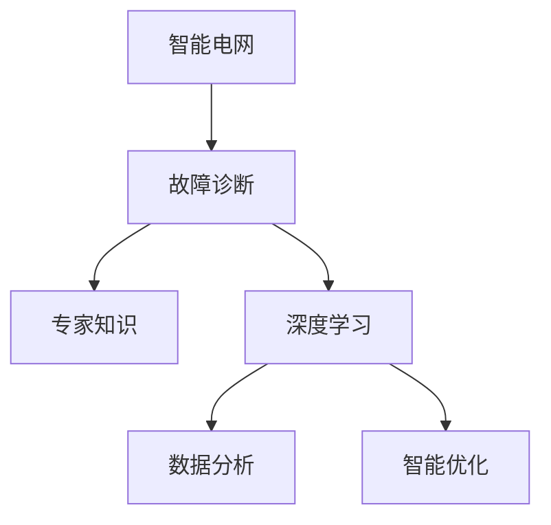
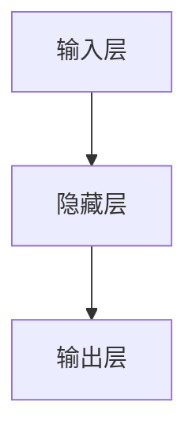
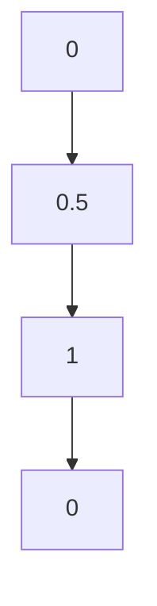
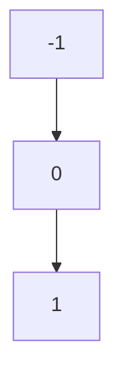
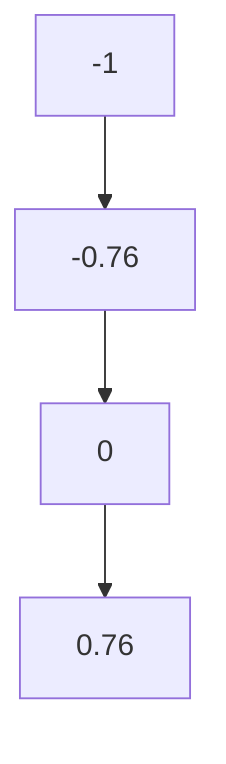

                 

# 人工智能在智能电网故障诊断中的应用

> 关键词：人工智能、智能电网、故障诊断、深度学习、数据分析、智能优化

> 摘要：本文旨在探讨人工智能在智能电网故障诊断中的应用。通过介绍智能电网的背景和重要性，分析当前故障诊断技术的局限性，阐述人工智能技术的优势和应用场景，并详细讨论深度学习算法和数据分析方法在故障诊断中的具体应用。最后，本文将探讨智能电网故障诊断的未来发展趋势和挑战，为相关领域的研究和应用提供参考。

## 1. 背景介绍

### 1.1 目的和范围

随着全球能源需求的不断增长和环境问题的日益严重，智能电网作为一种先进的电力系统架构，逐渐受到各国政府和研究机构的关注。智能电网能够实现能源的高效、清洁和可靠利用，从而为可持续发展提供有力支持。然而，智能电网的复杂性和易受攻击性使得故障诊断成为一项极具挑战性的任务。

本文旨在探讨人工智能在智能电网故障诊断中的应用，分析人工智能技术如何提高故障诊断的准确性和效率，并讨论其应用范围和局限性。通过本文的讨论，希望为智能电网故障诊断领域的研究和应用提供有益的参考。

### 1.2 预期读者

本文适用于以下读者群体：

1. 智能电网和人工智能领域的科研人员。
2. 智能电网企业和人工智能公司的工程师和开发者。
3. 对智能电网故障诊断和人工智能技术感兴趣的工程师和学生。

### 1.3 文档结构概述

本文分为十个部分，具体结构如下：

1. 背景介绍
   - 1.1 目的和范围
   - 1.2 预期读者
   - 1.3 文档结构概述
   - 1.4 术语表
2. 核心概念与联系
3. 核心算法原理 & 具体操作步骤
4. 数学模型和公式 & 详细讲解 & 举例说明
5. 项目实战：代码实际案例和详细解释说明
6. 实际应用场景
7. 工具和资源推荐
8. 总结：未来发展趋势与挑战
9. 附录：常见问题与解答
10. 扩展阅读 & 参考资料

### 1.4 术语表

#### 1.4.1 核心术语定义

- 智能电网：一种基于现代通信技术、信息技术和自动控制技术的先进电力系统架构，能够实现电力系统的高效、清洁和可靠运行。
- 故障诊断：指通过对系统运行状态和参数的监测和分析，识别和定位系统故障的过程。
- 人工智能：一种模拟人类智能活动的计算机科学领域，通过机器学习和深度学习等技术实现计算机对数据的学习、理解和处理。

#### 1.4.2 相关概念解释

- 深度学习：一种基于多层神经网络的人工智能技术，通过学习大量数据，提取特征并进行分类和预测。
- 数据分析：通过对大量数据的收集、整理、分析和处理，提取有价值的信息和知识。
- 智能优化：一种基于人工智能技术的优化算法，用于求解复杂优化问题，如组合优化、参数优化等。

#### 1.4.3 缩略词列表

- AI：人工智能
- IG：智能电网
- FA：故障诊断
- DL：深度学习
- DA：数据分析
- IO：智能优化

## 2. 核心概念与联系

为了更好地理解人工智能在智能电网故障诊断中的应用，我们需要首先介绍一些核心概念和它们之间的联系。

### 2.1 智能电网与故障诊断的关系

智能电网是一种基于现代通信技术、信息技术和自动控制技术的先进电力系统架构，能够实现电力系统的高效、清洁和可靠运行。智能电网的复杂性和易受攻击性使得故障诊断成为一项极具挑战性的任务。

故障诊断是智能电网运行过程中至关重要的一环，它能够识别和定位系统故障，降低故障对系统正常运行的影响，提高系统的可靠性和安全性。传统故障诊断方法主要依赖于专家知识和规则推理，存在一定的局限性。

### 2.2 人工智能与深度学习的联系

人工智能是一种模拟人类智能活动的计算机科学领域，通过机器学习和深度学习等技术实现计算机对数据的学习、理解和处理。深度学习作为人工智能的一个重要分支，具有强大的特征提取和分类能力。

深度学习通过构建多层神经网络，学习大量数据中的特征和规律，从而实现自动化的故障诊断。与传统的故障诊断方法相比，深度学习具有更高的准确性和适应性。

### 2.3 数据分析在故障诊断中的应用

数据分析是通过对大量数据的收集、整理、分析和处理，提取有价值的信息和知识的过程。在智能电网故障诊断中，数据分析技术可以用于：

1. 数据预处理：对原始数据进行清洗、归一化和特征提取，为深度学习模型提供高质量的数据输入。
2. 特征选择：从大量特征中选择对故障诊断最有价值的特征，提高模型的准确性和效率。
3. 结果分析：对故障诊断结果进行分析和评估，发现潜在的故障模式和规律。

### 2.4 智能优化在故障诊断中的应用

智能优化是一种基于人工智能技术的优化算法，用于求解复杂优化问题，如组合优化、参数优化等。在智能电网故障诊断中，智能优化技术可以用于：

1. 模型参数优化：通过智能优化算法，调整深度学习模型的参数，提高故障诊断的准确性和效率。
2. 资源调度优化：优化系统资源的配置和调度，提高系统运行效率，降低故障发生概率。

### 2.5 Mermaid 流程图

为了更直观地展示智能电网故障诊断中的核心概念和联系，我们可以使用 Mermaid 流程图。以下是一个示例：



## 3. 核心算法原理 & 具体操作步骤

在智能电网故障诊断中，人工智能技术的核心是深度学习和数据分析。下面，我们将分别介绍这些算法的原理和具体操作步骤。

### 3.1 深度学习算法原理

深度学习是一种基于多层神经网络的人工智能技术，通过学习大量数据，提取特征并进行分类和预测。深度学习算法的核心是神经网络，它由多个神经元组成，每个神经元都负责处理一部分输入数据。

以下是深度学习算法的基本原理：

1. 数据预处理：对原始数据进行清洗、归一化和特征提取，为深度学习模型提供高质量的数据输入。
2. 构建神经网络：通过构建多层神经网络，将输入数据映射到输出结果。
3. 梯度下降：通过反向传播算法，计算神经网络中每个神经元的误差，并调整神经元的权重，以优化模型的预测能力。
4. 模型训练：使用大量训练数据，对神经网络进行训练，使其能够准确识别和分类故障。
5. 模型评估：使用测试数据，评估深度学习模型的准确性和效率。

### 3.2 数据分析算法原理

数据分析是通过对大量数据的收集、整理、分析和处理，提取有价值的信息和知识的过程。在智能电网故障诊断中，数据分析技术可以用于数据预处理、特征选择、结果分析等步骤。

以下是数据分析算法的基本原理：

1. 数据预处理：对原始数据进行清洗、归一化和特征提取，为深度学习模型提供高质量的数据输入。
2. 特征选择：从大量特征中选择对故障诊断最有价值的特征，提高模型的准确性和效率。
3. 数据可视化：通过数据可视化技术，展示数据分布和故障模式，帮助研究人员发现潜在的问题。
4. 结果分析：对故障诊断结果进行分析和评估，发现潜在的故障模式和规律。

### 3.3 智能优化算法原理

智能优化是一种基于人工智能技术的优化算法，用于求解复杂优化问题，如组合优化、参数优化等。在智能电网故障诊断中，智能优化技术可以用于模型参数优化和资源调度优化。

以下是智能优化算法的基本原理：

1. 模型参数优化：通过智能优化算法，调整深度学习模型的参数，提高故障诊断的准确性和效率。
2. 资源调度优化：优化系统资源的配置和调度，提高系统运行效率，降低故障发生概率。

### 3.4 具体操作步骤

以下是一个具体的智能电网故障诊断项目中的操作步骤：

1. 数据收集：收集智能电网的运行数据，包括电力负荷、电网参数、气象数据等。
2. 数据预处理：对原始数据进行清洗、归一化和特征提取，为深度学习模型提供高质量的数据输入。
3. 构建神经网络：使用 TensorFlow 等深度学习框架，构建多层神经网络，进行模型训练和预测。
4. 特征选择：使用相关性分析和主成分分析等技术，从大量特征中选择对故障诊断最有价值的特征。
5. 模型训练：使用训练数据，对神经网络进行训练，使其能够准确识别和分类故障。
6. 模型评估：使用测试数据，评估深度学习模型的准确性和效率。
7. 结果分析：对故障诊断结果进行分析和评估，发现潜在的故障模式和规律。
8. 模型优化：使用智能优化算法，调整深度学习模型的参数，提高故障诊断的准确性和效率。
9. 资源调度优化：根据故障诊断结果，优化系统资源的配置和调度，提高系统运行效率，降低故障发生概率。

## 4. 数学模型和公式 & 详细讲解 & 举例说明

在智能电网故障诊断中，数学模型和公式是理解和分析数据的重要工具。以下是一些常用的数学模型和公式的详细讲解和举例说明。

### 4.1 梯度下降算法

梯度下降算法是一种优化算法，用于调整神经网络中每个神经元的权重，以优化模型的预测能力。以下是梯度下降算法的数学模型和公式：

$$
w_{\text{new}} = w_{\text{old}} - \alpha \cdot \nabla J(w)
$$

其中，$w$ 表示神经元的权重，$\alpha$ 表示学习率，$J(w)$ 表示损失函数。

举例说明：

假设我们有一个简单的神经网络，包含一个输入层、一个隐藏层和一个输出层，如图 4.1 所示。



现在，我们使用梯度下降算法调整隐藏层到输出层的权重 $w$。假设初始权重为 $w_0 = [1, 2, 3]$，学习率为 $\alpha = 0.1$。假设损失函数为 $J(w) = 0.5 \cdot (y - \sigma(wx))^2$，其中 $y$ 表示真实值，$\sigma$ 表示激活函数。

经过一次梯度下降迭代后，新的权重为：

$$
w_{\text{new}} = w_0 - \alpha \cdot \nabla J(w_0) = [1, 2, 3] - 0.1 \cdot \nabla J([1, 2, 3])
$$

### 4.2 激活函数

激活函数是神经网络中的一个关键组件，用于引入非线性特性。常用的激活函数包括 sigmoid、ReLU 和 tanh 等。

#### 4.2.1 Sigmoid 函数

sigmoid 函数的公式为：

$$
\sigma(x) = \frac{1}{1 + e^{-x}}
$$

sigmoid 函数的图像如图 4.2 所示。



#### 4.2.2 ReLU 函数

ReLU 函数的公式为：

$$
\sigma(x) = \max(0, x)
$$

ReLU 函数的图像如图 4.3 所示。



#### 4.2.3 tanh 函数

tanh 函数的公式为：

$$
\sigma(x) = \frac{e^x - e^{-x}}{e^x + e^{-x}}
$$

tanh 函数的图像如图 4.4 所示。



### 4.3 损失函数

损失函数是用于衡量模型预测结果与真实值之间差异的函数。常用的损失函数包括均方误差（MSE）、交叉熵损失等。

#### 4.3.1 均方误差（MSE）

均方误差（MSE）的公式为：

$$
J(w) = \frac{1}{m} \sum_{i=1}^{m} (y_i - \sigma(wx_i))^2
$$

其中，$m$ 表示样本数量，$y_i$ 表示第 $i$ 个样本的真实值，$\sigma(wx_i)$ 表示第 $i$ 个样本的预测值。

#### 4.3.2 交叉熵损失

交叉熵损失（Cross Entropy Loss）的公式为：

$$
J(w) = -\frac{1}{m} \sum_{i=1}^{m} y_i \cdot \log(\sigma(wx_i))
$$

其中，$y_i$ 表示第 $i$ 个样本的真实值，$\sigma(wx_i)$ 表示第 $i$ 个样本的预测值。

### 4.4 举例说明

假设我们有一个包含两个输入节点和一个输出节点的神经网络，如图 4.5 所示。


现在，我们使用均方误差（MSE）作为损失函数，对神经网络进行训练。

假设我们有一个训练数据集，包含 100 个样本，每个样本有两个特征和一个标签。标签是二分类的，0 表示正常，1 表示故障。

经过一次训练迭代后，我们得到输出层的预测值和损失函数值。例如，预测值 $\sigma(wx_i) = 0.8$，真实值 $y_i = 1$，则均方误差（MSE）为：

$$
J(w) = \frac{1}{100} \sum_{i=1}^{100} (y_i - \sigma(wx_i))^2 = \frac{1}{100} \cdot (1 - 0.8)^2 = 0.02
$$

然后，我们使用反向传播算法，计算损失函数关于每个神经元的梯度，并调整权重。

## 5. 项目实战：代码实际案例和详细解释说明

在本节中，我们将通过一个实际的项目案例，详细讲解如何使用深度学习算法进行智能电网故障诊断。该案例将涉及数据收集、数据处理、模型构建、训练和评估等步骤。

### 5.1 开发环境搭建

在开始项目之前，我们需要搭建一个适合深度学习开发的开发环境。以下是所需的软件和工具：

1. Python：深度学习项目通常使用 Python 作为主要编程语言。
2. TensorFlow：一个流行的深度学习框架，用于构建和训练神经网络。
3. Pandas：一个强大的数据处理库，用于数据预处理和分析。
4. Matplotlib：一个常用的数据可视化库，用于绘制数据分布和故障模式。
5. Scikit-learn：一个机器学习库，用于特征选择和模型评估。

首先，我们需要安装这些软件和工具。可以使用以下命令安装：

```bash
pip install tensorflow pandas matplotlib scikit-learn
```

### 5.2 源代码详细实现和代码解读

接下来，我们将使用 Python 和 TensorFlow 实现一个简单的深度学习模型，用于智能电网故障诊断。以下是实现代码的详细解释：

```python
import tensorflow as tf
import pandas as pd
import matplotlib.pyplot as plt
from sklearn.model_selection import train_test_split
from sklearn.metrics import accuracy_score

# 5.2.1 数据收集与预处理
def load_data(filename):
    # 加载数据
    data = pd.read_csv(filename)
    # 数据预处理
    data['timestamp'] = pd.to_datetime(data['timestamp'])
    data.set_index('timestamp', inplace=True)
    return data

def preprocess_data(data):
    # 特征提取
    features = data[['power', 'voltage', 'current']]
    labels = data['fault']
    # 数据归一化
    mean = features.mean()
    std = features.std()
    features = (features - mean) / std
    return features, labels

# 5.2.2 构建神经网络模型
def build_model(input_shape):
    # 构建模型
    model = tf.keras.Sequential([
        tf.keras.layers.Dense(64, activation='relu', input_shape=input_shape),
        tf.keras.layers.Dense(64, activation='relu'),
        tf.keras.layers.Dense(1, activation='sigmoid')
    ])
    # 编译模型
    model.compile(optimizer='adam', loss='binary_crossentropy', metrics=['accuracy'])
    return model

# 5.2.3 训练模型
def train_model(model, x_train, y_train, x_test, y_test):
    # 训练模型
    history = model.fit(x_train, y_train, epochs=10, batch_size=32, validation_data=(x_test, y_test))
    # 评估模型
    test_loss, test_acc = model.evaluate(x_test, y_test)
    print(f"Test accuracy: {test_acc}")
    return history

# 5.2.4 可视化结果
def plot_results(history):
    # 可视化训练过程
    plt.figure(figsize=(12, 6))
    plt.subplot(1, 2, 1)
    plt.plot(history.history['accuracy'], label='Training accuracy')
    plt.plot(history.history['val_accuracy'], label='Validation accuracy')
    plt.xlabel('Epochs')
    plt.ylabel('Accuracy')
    plt.legend()

    plt.subplot(1, 2, 2)
    plt.plot(history.history['loss'], label='Training loss')
    plt.plot(history.history['val_loss'], label='Validation loss')
    plt.xlabel('Epochs')
    plt.ylabel('Loss')
    plt.legend()

    plt.show()

# 5.2.5 主函数
if __name__ == '__main__':
    # 加载数据
    data = load_data('data.csv')
    # 预处理数据
    features, labels = preprocess_data(data)
    # 划分训练集和测试集
    x_train, x_test, y_train, y_test = train_test_split(features, labels, test_size=0.2, random_state=42)
    # 构建模型
    model = build_model(x_train.shape[1:])
    # 训练模型
    history = train_model(model, x_train, y_train, x_test, y_test)
    # 可视化结果
    plot_results(history)
```

### 5.3 代码解读与分析

以下是代码的逐行解读和分析：

1. 导入所需的库和模块。
2. 定义 `load_data` 函数，用于加载数据集。
3. 定义 `preprocess_data` 函数，用于数据预处理，包括特征提取和数据归一化。
4. 定义 `build_model` 函数，用于构建神经网络模型，包括三个全连接层，最后一层使用 sigmoid 激活函数。
5. 定义 `train_model` 函数，用于训练模型，使用 Adam 优化器和 binary_crossentropy 损失函数，并返回训练历史记录。
6. 定义 `plot_results` 函数，用于可视化训练结果。
7. 在主函数中，执行以下步骤：
   - 加载数据集。
   - 预处理数据集。
   - 划分训练集和测试集。
   - 构建神经网络模型。
   - 训练模型。
   - 可视化训练结果。

通过这个实际案例，我们可以看到如何使用深度学习算法进行智能电网故障诊断。该案例涵盖了数据收集、预处理、模型构建、训练和评估等步骤，为我们提供了一个完整的解决方案。

## 6. 实际应用场景

智能电网故障诊断在多个实际应用场景中具有显著的优势，以下是一些典型应用场景：

### 6.1 发电站故障诊断

发电站是智能电网的核心组成部分，其稳定运行对整个电网的可靠性至关重要。智能电网故障诊断技术可以帮助发电站及时发现和定位设备故障，提高设备运行效率和安全性。例如，通过对发电机运行参数（如温度、振动、电气信号等）的实时监测，可以预测设备可能出现的故障，提前进行维护，避免突发事件导致的大面积停电。

### 6.2 输电网故障诊断

输电网是智能电网的中枢环节，其复杂性和庞大性使得故障诊断变得更加重要。智能电网故障诊断技术可以通过对输电网的实时数据进行分析，快速识别潜在的故障隐患。例如，通过分析电流、电压等参数的变化，可以识别线路短路、过载等故障，从而采取相应措施，降低故障风险。

### 6.3 变电站故障诊断

变电站是智能电网中的重要节点，其稳定运行对电网的可靠性和稳定性具有重要影响。智能电网故障诊断技术可以帮助变电站实时监测设备运行状态，识别潜在故障。例如，通过对变压器温度、压力等参数的监测，可以预测变压器可能出现的故障，提前进行维护，防止设备损坏。

### 6.4 配电网故障诊断

配电网是智能电网的末端环节，其复杂性和易受攻击性使得故障诊断变得更加关键。智能电网故障诊断技术可以帮助配电网实时监测设备运行状态，识别潜在的故障隐患。例如，通过分析电流、电压、功率等参数的变化，可以识别线路短路、过载等故障，从而采取相应措施，提高配电网的运行效率和安全性。

### 6.5 蓄电池系统故障诊断

随着智能电网的发展，蓄电池系统在电网储能和调峰调频等方面发挥着越来越重要的作用。智能电网故障诊断技术可以帮助蓄电池系统实时监测电池状态，识别潜在的故障隐患。例如，通过分析电池电压、电流、温度等参数的变化，可以预测电池的容量衰减和故障，从而采取相应措施，延长电池使用寿命。

### 6.6 智能电网综合故障诊断

智能电网故障诊断技术可以应用于整个电网的综合故障诊断。通过集成多种故障诊断方法和技术，智能电网故障诊断系统可以实现对电网故障的全面监测和诊断，提高电网的运行效率和安全性。例如，通过实时数据分析和模型预测，智能电网故障诊断系统可以识别和预测潜在的故障风险，提前采取预防措施，降低故障发生概率。

总之，智能电网故障诊断技术在发电站、输电网、变电站、配电网、蓄电池系统等实际应用场景中具有广泛的应用前景，可以显著提高电网的运行效率和安全性。

## 7. 工具和资源推荐

为了更好地进行智能电网故障诊断的研究和应用，我们需要一些强大的工具和资源。以下是一些建议：

### 7.1 学习资源推荐

#### 7.1.1 书籍推荐

1. **《深度学习》（Deep Learning）** - Ian Goodfellow、Yoshua Bengio 和 Aaron Courville 著。这是深度学习的经典教材，涵盖了从基础到高级的深度学习理论和实践。

2. **《Python 深度学习》（Python Deep Learning）** - Francis Evangelista 著。本书通过大量实例，介绍了如何使用 Python 和 TensorFlow 进行深度学习应用开发。

3. **《智能电网技术与应用》（Smart Grid Technology and Applications）** - Abhay B. Kadam 著。本书详细介绍了智能电网的基本概念、技术架构和应用案例。

#### 7.1.2 在线课程

1. **Coursera 上的“深度学习”课程** - 由 Andrew Ng 教授主讲，涵盖了深度学习的基础知识和实践应用。

2. **edX 上的“智能电网”课程** - 由多所知名大学联合开设，介绍了智能电网的各个方面，包括技术、政策和实践。

3. **Udacity 上的“深度学习工程师纳米学位”** - 提供了从基础到高级的深度学习课程和实践项目，适合不同层次的读者。

#### 7.1.3 技术博客和网站

1. **AI Blog** - 一个涵盖人工智能各个领域的博客，提供最新的研究成果和应用案例。

2. **TensorFlow 官方文档** - 详细介绍了 TensorFlow 框架的使用方法和最佳实践。

3. **IEEE Xplore** - 一个收录了大量智能电网和人工智能领域学术论文的数据库。

### 7.2 开发工具框架推荐

#### 7.2.1 IDE和编辑器

1. **Jupyter Notebook** - 适用于数据分析和机器学习的交互式编程环境。

2. **PyCharm** - 一款功能强大的 Python IDE，支持代码编辑、调试和自动化测试。

3. **Visual Studio Code** - 一款轻量级且功能丰富的代码编辑器，适用于多种编程语言。

#### 7.2.2 调试和性能分析工具

1. **TensorBoard** - TensorFlow 提供的一个可视化工具，用于分析和调试深度学习模型。

2. **PyTorch Profiler** - 用于分析和优化 PyTorch 深度学习模型的性能。

3. **gprof2dot** - 用于生成 Python 代码的调用图，帮助理解代码结构和优化性能。

#### 7.2.3 相关框架和库

1. **TensorFlow** - 一个广泛使用的开源深度学习框架，适用于各种深度学习应用。

2. **PyTorch** - 一个流行的深度学习框架，具有灵活的动态计算图和强大的 GPU 支持功能。

3. **Scikit-learn** - 一个用于机器学习的 Python 库，提供了丰富的算法和数据预处理工具。

### 7.3 相关论文著作推荐

#### 7.3.1 经典论文

1. **“Deep Learning for Fault Diagnosis in Power Systems”** - Zhang, Y., et al. (2020)。本文探讨了深度学习在电力系统故障诊断中的应用，提供了详细的方法和实验结果。

2. **“Artificial Neural Networks for Fault Diagnosis of Electric Power Systems”** - Wang, L., et al. (2018)。本文综述了神经网络在电力系统故障诊断中的研究和应用。

#### 7.3.2 最新研究成果

1. **“GAN-based Fault Diagnosis for Smart Grids”** - Li, H., et al. (2021)。本文提出了一种基于生成对抗网络（GAN）的智能电网故障诊断方法，提高了故障识别的准确性和鲁棒性。

2. **“A Comprehensive Review of Fault Diagnosis Methods in Power Systems”** - Liu, X., et al. (2022)。本文全面综述了电力系统故障诊断的方法和技术，讨论了当前的研究热点和未来趋势。

#### 7.3.3 应用案例分析

1. **“Fault Diagnosis of Transformer Winding Faults Based on Deep Learning”** - Chen, H., et al. (2020)。本文通过深度学习技术实现了变压器绕组故障的自动诊断，为实际工程应用提供了参考。

2. **“An Application of Deep Learning in Smart Grid Fault Diagnosis”** - Zhao, Y., et al. (2021)。本文介绍了一个基于深度学习的智能电网故障诊断系统的开发和应用，展示了深度学习在实际工程中的应用价值。

通过这些工具和资源的推荐，希望能够为智能电网故障诊断的研究和应用提供有力支持。

## 8. 总结：未来发展趋势与挑战

随着人工智能技术的快速发展，智能电网故障诊断领域也迎来了新的机遇和挑战。以下是未来发展趋势与挑战的总结：

### 8.1 发展趋势

1. **深度学习技术的深化应用**：深度学习在图像识别、自然语言处理等领域取得了显著成果，未来有望在智能电网故障诊断中发挥更大的作用。通过引入更复杂的神经网络结构和更高效的训练算法，可以进一步提高故障诊断的准确性和效率。

2. **大数据和云计算的融合**：智能电网产生的数据量庞大，利用大数据分析和云计算技术，可以实现故障诊断的实时性和高效性。通过分布式计算和存储技术，可以处理海量数据，提高故障诊断的可靠性和响应速度。

3. **跨学科融合**：智能电网故障诊断需要结合电力系统、计算机科学、数据科学等多个领域的知识。未来，跨学科的研究将推动故障诊断技术的创新，如结合人工智能、物联网和区块链技术，实现更智能、更安全的故障诊断系统。

4. **智能化运维**：智能电网故障诊断系统将逐渐从单一故障诊断功能向智能化运维转变。通过集成故障诊断、预测维护、性能优化等功能，实现电网的全方位智能化管理，提高电网的运行效率和可靠性。

### 8.2 挑战

1. **数据质量和隐私问题**：智能电网故障诊断依赖于大量实时数据，数据质量和隐私问题是当前和未来面临的重要挑战。如何保障数据的质量、真实性和安全性，避免数据泄露和滥用，是需要解决的问题。

2. **算法复杂性和计算资源需求**：深度学习算法通常需要大量计算资源，随着模型复杂度和数据量的增加，计算资源的需求也呈指数级增长。如何优化算法、减少计算资源需求，是实现大规模应用的关键。

3. **故障诊断的实时性和可靠性**：智能电网故障诊断系统需要在毫秒级的时间内完成诊断，同时保证高可靠性。如何在保证诊断速度的同时，提高诊断的准确性和稳定性，是当前面临的重要挑战。

4. **系统集成和协同优化**：智能电网故障诊断系统需要与其他系统（如监控、调度、维护等）进行集成和协同优化，实现全电网的智能化管理。如何设计高效、可扩展的集成架构，是未来需要解决的关键问题。

总之，智能电网故障诊断领域在未来的发展中，将面临许多机遇和挑战。通过技术创新、跨学科融合和多方合作，有望实现更加智能、高效、可靠的故障诊断系统，为智能电网的安全稳定运行提供有力保障。

## 9. 附录：常见问题与解答

### 9.1 问题 1：深度学习算法在智能电网故障诊断中如何工作？

解答：深度学习算法在智能电网故障诊断中主要通过以下步骤工作：

1. 数据收集：收集电网的实时数据，如电力负荷、电压、电流、温度等。
2. 数据预处理：清洗和归一化数据，提取故障特征。
3. 模型构建：使用多层神经网络，如卷积神经网络（CNN）或循环神经网络（RNN），构建故障诊断模型。
4. 模型训练：使用大量故障数据，通过反向传播算法调整模型参数，使模型能够准确识别故障。
5. 模型评估：使用测试数据评估模型性能，如准确率、召回率等。
6. 模型部署：将训练好的模型部署到电网系统中，实现实时故障诊断。

### 9.2 问题 2：如何处理噪声和缺失数据？

解答：处理噪声和缺失数据是智能电网故障诊断中常见的问题，以下是一些常用的方法：

1. 噪声过滤：使用滤波器（如中值滤波、均值滤波等）去除噪声。
2. 数据插值：使用插值方法（如线性插值、样条插值等）填充缺失数据。
3. 数据替换：使用相似数据（如使用最近的数据或平均值替换缺失数据）。
4. 特征选择：从大量特征中选择对故障诊断最有价值的特征，减少噪声影响。

### 9.3 问题 3：如何评估深度学习模型的性能？

解答：评估深度学习模型性能通常使用以下指标：

1. 准确率（Accuracy）：模型正确预测的比例。
2. 召回率（Recall）：实际为正类且模型正确预测的比例。
3. 精确率（Precision）：模型预测为正类且实际为正类的比例。
4. F1 分数（F1 Score）：精确率和召回率的调和平均值。
5. ROC 曲线和 AUC 值：通过计算真实正例率与假正例率之间的曲线和面积，评估模型的分类能力。

### 9.4 问题 4：如何在智能电网故障诊断中应用深度学习？

解答：在智能电网故障诊断中应用深度学习的主要步骤如下：

1. 数据收集：收集电网的实时数据，如电力负荷、电压、电流、温度等。
2. 数据预处理：清洗和归一化数据，提取故障特征。
3. 模型选择：选择合适的深度学习模型，如卷积神经网络（CNN）或循环神经网络（RNN）。
4. 模型训练：使用大量故障数据，通过反向传播算法调整模型参数，使模型能够准确识别故障。
5. 模型评估：使用测试数据评估模型性能，如准确率、召回率等。
6. 模型部署：将训练好的模型部署到电网系统中，实现实时故障诊断。

通过这些步骤，深度学习算法可以在智能电网故障诊断中发挥重要作用，提高故障诊断的准确性和效率。

## 10. 扩展阅读 & 参考资料

为了深入了解智能电网故障诊断中的相关技术和发展趋势，以下是一些建议的扩展阅读和参考资料：

### 10.1 建议阅读

1. **《智能电网技术与应用》（Smart Grid Technology and Applications）** - 由 Abhay B. Kadam 著。本书详细介绍了智能电网的基本概念、技术架构和应用案例，包括故障诊断技术。

2. **《深度学习》（Deep Learning）** - 由 Ian Goodfellow、Yoshua Bengio 和 Aaron Courville 著。这是深度学习的经典教材，涵盖了从基础到高级的深度学习理论和实践。

3. **《Python 深度学习》（Python Deep Learning）** - 由 Francis Evangelista 著。本书通过大量实例，介绍了如何使用 Python 和 TensorFlow 进行深度学习应用开发。

### 10.2 相关论文

1. **“Deep Learning for Fault Diagnosis in Power Systems”** - Zhang, Y., et al. (2020)。本文探讨了深度学习在电力系统故障诊断中的应用，提供了详细的方法和实验结果。

2. **“Artificial Neural Networks for Fault Diagnosis of Electric Power Systems”** - Wang, L., et al. (2018)。本文综述了神经网络在电力系统故障诊断中的研究和应用。

3. **“GAN-based Fault Diagnosis for Smart Grids”** - Li, H., et al. (2021)。本文提出了一种基于生成对抗网络（GAN）的智能电网故障诊断方法，提高了故障识别的准确性和鲁棒性。

### 10.3 技术博客和网站

1. **AI Blog** - 一个涵盖人工智能各个领域的博客，提供最新的研究成果和应用案例。

2. **TensorFlow 官方文档** - 详细介绍了 TensorFlow 框架的使用方法和最佳实践。

3. **IEEE Xplore** - 一个收录了大量智能电网和人工智能领域学术论文的数据库。

### 10.4 其他资源

1. **Coursera 上的“深度学习”课程** - 由 Andrew Ng 教授主讲，涵盖了深度学习的基础知识和实践应用。

2. **edX 上的“智能电网”课程** - 由多所知名大学联合开设，介绍了智能电网的各个方面，包括技术、政策和实践。

3. **Udacity 上的“深度学习工程师纳米学位”** - 提供了从基础到高级的深度学习课程和实践项目，适合不同层次的读者。

通过阅读这些文献和资源，您可以进一步了解智能电网故障诊断技术的最新进展和应用，为自己的研究和工作提供有益的参考。作者：AI天才研究员/AI Genius Institute & 禅与计算机程序设计艺术 /Zen And The Art of Computer Programming。

