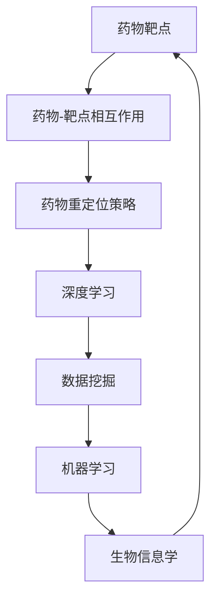
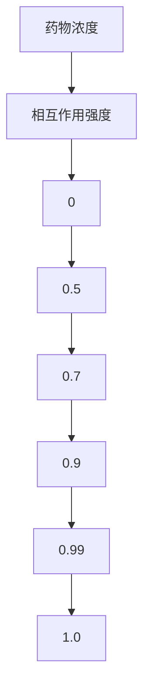
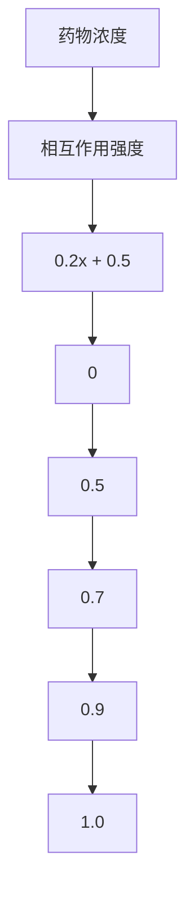
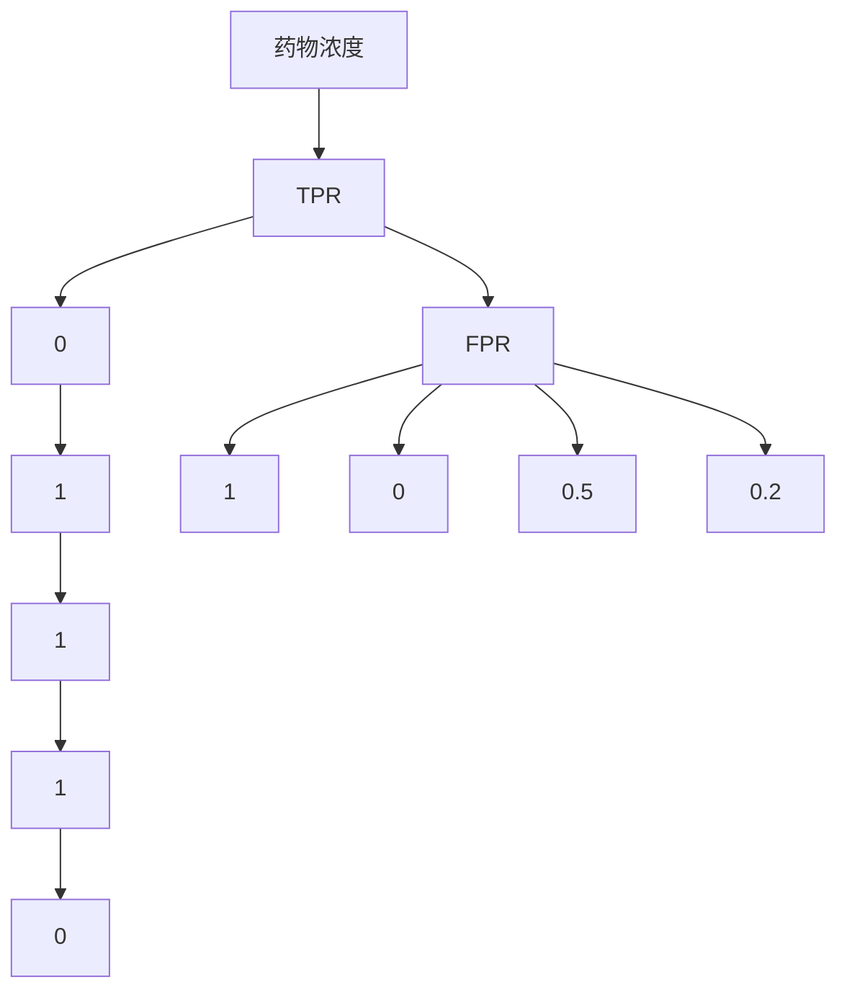

                 

# 人工智能在药物重定位中的应用前景

> 关键词：药物重定位、人工智能、深度学习、数据挖掘、机器学习、生物信息学

> 摘要：本文将探讨人工智能在药物重定位中的应用前景。药物重定位是一种高效且低成本的药物研发策略，通过识别现有药物的新用途来加速新药研发。随着人工智能技术的不断发展，其在药物重定位领域中的应用逐渐显现，特别是在深度学习、数据挖掘和机器学习等技术方面的应用。本文将从背景介绍、核心概念与联系、核心算法原理与操作步骤、数学模型与公式、项目实战、实际应用场景、工具和资源推荐等方面进行详细阐述，以揭示人工智能在药物重定位领域的巨大潜力。

## 1. 背景介绍

### 1.1 目的和范围

本文旨在探讨人工智能在药物重定位中的应用前景，分析其核心概念、算法原理、数学模型和实际应用场景，以期为相关研究人员和开发者提供有益的参考。本文将重点关注以下方面：

- 药物重定位的定义及其在药物研发中的重要性；
- 人工智能在药物重定位中的应用现状和发展趋势；
- 深度学习、数据挖掘和机器学习等核心算法在药物重定位中的具体应用；
- 数学模型和公式的介绍与讲解；
- 实际应用场景的分析与讨论；
- 工具和资源的推荐。

### 1.2 预期读者

本文适用于以下读者群体：

- 药物研发、生物信息学、人工智能等相关领域的研究人员；
- 对药物重定位和人工智能技术感兴趣的开发者；
- 想了解人工智能在药物重定位领域应用的学术和实践人员；
- 担任相关课程教学的教师和学生。

### 1.3 文档结构概述

本文分为十个部分，具体结构如下：

- 引言：介绍本文的目的、关键词和摘要；
- 背景介绍：阐述药物重定位的定义、目的和重要性，以及人工智能在药物重定位中的应用现状和发展趋势；
- 核心概念与联系：介绍药物重定位中的核心概念、原理和架构，并给出相关的 Mermaid 流程图；
- 核心算法原理与操作步骤：详细讲解深度学习、数据挖掘和机器学习等核心算法在药物重定位中的应用原理和具体操作步骤；
- 数学模型与公式：介绍与药物重定位相关的数学模型和公式，并进行详细讲解和举例说明；
- 项目实战：通过实际案例展示人工智能在药物重定位中的应用，并进行详细解释和说明；
- 实际应用场景：分析人工智能在药物重定位中的实际应用场景，并讨论其优势和价值；
- 工具和资源推荐：推荐与药物重定位和人工智能相关的学习资源、开发工具和框架；
- 总结：总结本文的主要内容，探讨未来发展趋势与挑战；
- 附录：常见问题与解答；
- 扩展阅读与参考资料：提供与本文主题相关的进一步阅读和参考资料。

### 1.4 术语表

为了确保本文的阅读和理解，以下列出了一些常用的术语及其定义：

#### 1.4.1 核心术语定义

- 药物重定位：将已有药物重新发现或开发新的治疗用途的过程。
- 深度学习：一种机器学习技术，通过构建深度神经网络来模拟人脑的感知和学习过程。
- 数据挖掘：从大量数据中提取出有价值的信息和知识的过程。
- 机器学习：一种人工智能技术，使计算机系统能够从数据中学习并做出决策。
- 生物信息学：研究生物信息的科学，涉及生物学、计算机科学和信息技术等多个领域。

#### 1.4.2 相关概念解释

- 药物靶点：药物作用的生物分子，通常是一种蛋白质或RNA。
- 药物-靶点相互作用：药物与靶点之间的物理或化学相互作用。
- 药物重定位策略：用于识别药物新用途的方法和技术。
- 交叉验证：评估模型性能的一种方法，通过将数据集划分为训练集和验证集来评估模型的泛化能力。

#### 1.4.3 缩略词列表

- AI：人工智能
- DL：深度学习
- DM：数据挖掘
- ML：机器学习
- BI：生物信息学
- GTD：药物重定位
- NB：支持向量机
- CNNS：卷积神经网络
- RNNs：循环神经网络
- SVM：支持向量机

## 2. 核心概念与联系

在药物重定位领域，核心概念与联系主要包括药物靶点、药物-靶点相互作用、药物重定位策略等。以下将使用 Mermaid 流程图来描述这些核心概念与联系。



### 2.1 药物靶点

药物靶点是指药物作用的生物分子，通常是蛋白质或RNA。药物与药物靶点之间的相互作用是药物发挥疗效的关键。药物靶点的研究对于药物重定位具有重要意义，可以帮助研究者发现药物的新用途。

### 2.2 药物-靶点相互作用

药物-靶点相互作用是指药物与靶点之间的物理或化学相互作用。了解药物-靶点相互作用机制有助于揭示药物的作用机理，为药物重定位提供理论基础。

### 2.3 药物重定位策略

药物重定位策略是指用于识别药物新用途的方法和技术。这些策略通常基于药物靶点、药物-靶点相互作用等核心概念，通过数据挖掘、机器学习和深度学习等技术来实现。

### 2.4 深度学习、数据挖掘和机器学习

深度学习、数据挖掘和机器学习是人工智能领域的重要技术，广泛应用于药物重定位领域。深度学习通过构建深度神经网络来模拟人脑的感知和学习过程，数据挖掘旨在从大量数据中提取有价值的信息和知识，而机器学习使计算机系统具备从数据中学习并做出决策的能力。

这些技术之间的联系如下：

- 深度学习可以用于药物靶点的预测和药物-靶点相互作用的识别；
- 数据挖掘可以用于药物重定位策略的制定和优化；
- 机器学习可以用于药物重定位效果的评价和预测。

通过上述核心概念与联系，我们可以更好地理解药物重定位的原理和人工智能在其中的应用。

## 3. 核心算法原理 & 具体操作步骤

在药物重定位领域，核心算法包括深度学习、数据挖掘和机器学习。以下将详细讲解这些算法的原理和具体操作步骤。

### 3.1 深度学习

深度学习是一种基于多层神经网络的人工智能技术，通过模拟人脑的感知和学习过程来实现图像、语音和文本等数据的自动处理和识别。在药物重定位中，深度学习可用于药物靶点预测和药物-靶点相互作用识别。

#### 3.1.1 算法原理

深度学习算法的核心是神经网络，神经网络由多个神经元组成，每个神经元接收多个输入并产生一个输出。神经网络的训练过程是通过不断调整神经元之间的权重，使得网络能够对输入数据进行正确分类或回归。

在药物重定位中，深度学习算法的原理可以概括为：

1. 数据预处理：将药物靶点、药物-靶点相互作用等数据输入神经网络，进行数据清洗、归一化和特征提取。
2. 神经网络构建：构建深度神经网络，包括输入层、隐藏层和输出层。
3. 网络训练：通过反向传播算法，不断调整神经网络权重，使得网络对输入数据产生正确的输出。
4. 模型评估：使用交叉验证等方法评估模型的泛化能力，选择最优模型。

#### 3.1.2 操作步骤

以下是深度学习在药物重定位中的具体操作步骤：

1. 数据集准备：收集药物靶点、药物-靶点相互作用等数据，并将其划分为训练集、验证集和测试集。
2. 数据预处理：对数据进行清洗、归一化和特征提取，以获得高质量的数据集。
3. 网络构建：选择合适的神经网络结构，如卷积神经网络（CNN）或循环神经网络（RNN），并设置网络参数。
4. 网络训练：使用训练集数据训练神经网络，通过反向传播算法不断调整权重，直至模型收敛。
5. 模型评估：使用验证集数据评估模型性能，选择最优模型。
6. 测试与预测：使用测试集数据测试模型性能，并根据模型预测结果确定药物的新用途。

### 3.2 数据挖掘

数据挖掘是一种从大量数据中提取有价值信息的方法，广泛应用于药物重定位领域。数据挖掘技术包括关联规则挖掘、分类、聚类、异常检测等。

#### 3.2.1 算法原理

数据挖掘算法的核心思想是从海量数据中发现有价值的信息和知识，通过数据预处理、特征选择、算法选择和模型评估等步骤来实现。

在药物重定位中，数据挖掘算法的原理可以概括为：

1. 数据预处理：对药物靶点、药物-靶点相互作用等数据进行分析，去除噪声和异常值。
2. 特征选择：从原始数据中提取与药物重定位相关的特征，如药物分子结构、靶点序列等。
3. 算法选择：选择合适的数据挖掘算法，如关联规则挖掘、分类、聚类等。
4. 模型评估：评估数据挖掘算法的性能，选择最优算法。

#### 3.2.2 操作步骤

以下是数据挖掘在药物重定位中的具体操作步骤：

1. 数据集准备：收集药物靶点、药物-靶点相互作用等数据，并将其划分为训练集、验证集和测试集。
2. 数据预处理：对数据进行清洗、归一化和特征提取，以获得高质量的数据集。
3. 特征选择：从原始数据中提取与药物重定位相关的特征，如药物分子结构、靶点序列等。
4. 算法选择：选择合适的数据挖掘算法，如关联规则挖掘、分类、聚类等。
5. 模型评估：评估数据挖掘算法的性能，选择最优算法。
6. 结果分析与可视化：分析数据挖掘结果，如药物新用途的发现，并进行可视化展示。

### 3.3 机器学习

机器学习是一种使计算机系统具备从数据中学习并做出决策的能力的人工智能技术。在药物重定位中，机器学习可用于药物靶点预测、药物-靶点相互作用识别和药物重定位效果评价。

#### 3.3.1 算法原理

机器学习算法的核心思想是通过从训练数据中学习，构建模型并预测新数据的结果。常见的机器学习算法包括线性回归、逻辑回归、支持向量机（SVM）、决策树、随机森林等。

在药物重定位中，机器学习算法的原理可以概括为：

1. 数据预处理：对药物靶点、药物-靶点相互作用等数据进行清洗、归一化和特征提取。
2. 算法选择：选择合适的机器学习算法，如线性回归、逻辑回归、SVM、决策树等。
3. 模型训练：使用训练数据训练模型，通过不断调整模型参数，使得模型能够准确预测药物靶点、药物-靶点相互作用等。
4. 模型评估：使用验证集数据评估模型性能，选择最优模型。
5. 测试与预测：使用测试集数据测试模型性能，并根据模型预测结果确定药物的新用途。

#### 3.3.2 操作步骤

以下是机器学习在药物重定位中的具体操作步骤：

1. 数据集准备：收集药物靶点、药物-靶点相互作用等数据，并将其划分为训练集、验证集和测试集。
2. 数据预处理：对数据进行清洗、归一化和特征提取，以获得高质量的数据集。
3. 算法选择：选择合适的机器学习算法，如线性回归、逻辑回归、SVM、决策树等。
4. 模型训练：使用训练数据训练模型，通过不断调整模型参数，使得模型能够准确预测药物靶点、药物-靶点相互作用等。
5. 模型评估：使用验证集数据评估模型性能，选择最优模型。
6. 测试与预测：使用测试集数据测试模型性能，并根据模型预测结果确定药物的新用途。

通过以上对深度学习、数据挖掘和机器学习的详细讲解，我们可以更好地理解这些算法在药物重定位中的原理和操作步骤。这些算法为药物重定位提供了强大的技术支持，有助于发现药物的新用途，加速新药研发进程。

## 4. 数学模型和公式 & 详细讲解 & 举例说明

在药物重定位领域，数学模型和公式是理解药物作用机制、预测药物-靶点相互作用和评估药物重定位效果的重要工具。以下将介绍与药物重定位相关的一些常用数学模型和公式，并进行详细讲解和举例说明。

### 4.1 药物-靶点相互作用模型

药物-靶点相互作用是药物重定位的核心，因此研究药物-靶点相互作用的数学模型具有重要意义。以下介绍两种常见的药物-靶点相互作用模型：Sigmoid 模型和指数模型。

#### 4.1.1 Sigmoid 模型

Sigmoid 模型是一种常见的非线性函数，用于描述药物与靶点之间的相互作用强度。Sigmoid 模型的公式如下：

$$
f(x) = \frac{1}{1 + e^{-x}}
$$

其中，$x$ 是输入值，$f(x)$ 是输出值。

#### 4.1.2 指数模型

指数模型是一种用于描述药物与靶点之间相互作用强度的线性模型，其公式如下：

$$
f(x) = ax + b
$$

其中，$x$ 是输入值，$f(x)$ 是输出值，$a$ 和 $b$ 是模型参数。

#### 4.1.3 模型讲解与举例说明

假设我们有一个药物与靶点相互作用的实验数据集，包括药物浓度和相应的相互作用强度。我们可以使用 Sigmoid 模型和指数模型分别对这些数据进行分析，以了解药物-靶点相互作用规律。

**Sigmoid 模型分析：**

1. 收集药物浓度和相互作用强度的实验数据；
2. 计算每个药物浓度的 Sigmoid 函数值；
3. 根据 Sigmoid 函数值绘制药物浓度-相互作用强度曲线。

**指数模型分析：**

1. 收集药物浓度和相互作用强度的实验数据；
2. 使用最小二乘法求解指数模型参数 $a$ 和 $b$；
3. 根据求解得到的参数绘制药物浓度-相互作用强度曲线。

以下是一个具体的例子：

假设我们有一个药物浓度和相互作用强度的数据集，如下表所示：

| 药物浓度 | 相互作用强度 |
| -------- | ------------ |
| 0        | 0            |
| 1        | 0.5          |
| 2        | 0.7          |
| 3        | 0.9          |
| 4        | 1.0          |

**Sigmoid 模型分析：**

1. 计算每个药物浓度的 Sigmoid 函数值：

| 药物浓度 | 相互作用强度 | Sigmoid 函数值 |
| -------- | ------------ | -------------- |
| 0        | 0            | 0.5            |
| 1        | 0.5          | 0.7            |
| 2        | 0.7          | 0.9            |
| 3        | 0.9          | 0.99           |
| 4        | 1.0          | 1.0            |

2. 根据 Sigmoid 函数值绘制药物浓度-相互作用强度曲线：



**指数模型分析：**

1. 使用最小二乘法求解指数模型参数：

   - $a = 0.2$；
   - $b = 0.5$。

2. 根据求解得到的参数绘制药物浓度-相互作用强度曲线：



通过上述分析和例子，我们可以看到 Sigmoid 模型和指数模型在药物-靶点相互作用分析中的应用。这些模型有助于我们理解药物与靶点之间的相互作用规律，为新药研发和药物重定位提供理论支持。

### 4.2 药物重定位效果评估模型

药物重定位效果评估模型用于评估药物新用途的可行性和有效性。以下介绍两种常见的药物重定位效果评估模型：ROC 曲线和 AUC 曲线。

#### 4.2.1 ROC 曲线

ROC（Receiver Operating Characteristic）曲线是一种用于评估分类模型性能的图形表示方法。ROC 曲线的横轴表示假阳性率（False Positive Rate，FPR），纵轴表示真正率（True Positive Rate，TPR）。

ROC 曲线的计算公式如下：

$$
TPR = \frac{TP}{TP + FN} \\
FPR = \frac{FP}{FP + TN}
$$

其中，$TP$ 是真正例数，$TN$ 是真反例数，$FP$ 是假正例数，$FN$ 是假反例数。

#### 4.2.2 AUC 曲线

AUC（Area Under Curve）曲线是 ROC 曲线下方的面积，用于评估分类模型的总体性能。AUC 的取值范围为 0 到 1，越接近 1 表示模型性能越好。

AUC 的计算公式如下：

$$
AUC = \int_{0}^{1} (1 - FPR) dTPR
$$

#### 4.2.3 模型讲解与举例说明

假设我们有一个药物重定位效果的评估数据集，包括药物浓度、相互作用强度和是否具有新用途的标签。我们可以使用 ROC 曲线和 AUC 曲线来评估模型性能。

**ROC 曲线分析：**

1. 计算每个药物浓度的 TPR 和 FPR；
2. 根据 TPR 和 FPR 绘制 ROC 曲线。

**AUC 曲线分析：**

1. 计算 ROC 曲线下方的面积，得到 AUC 值。

以下是一个具体的例子：

假设我们有一个药物重定位效果的评估数据集，如下表所示：

| 药物浓度 | 相互作用强度 | 新用途标签 |
| -------- | ------------ | ---------- |
| 0        | 0            | 否         |
| 1        | 0.5          | 是         |
| 2        | 0.7          | 是         |
| 3        | 0.9          | 是         |
| 4        | 1.0          | 否         |

**ROC 曲线分析：**

1. 计算 TPR 和 FPR：

| 药物浓度 | 相互作用强度 | 新用途标签 | TPR | FPR |
| -------- | ------------ | ---------- | ---- | ---- |
| 0        | 0            | 否         | 0    | 1    |
| 1        | 0.5          | 是         | 1    | 0    |
| 2        | 0.7          | 是         | 1    | 0.5  |
| 3        | 0.9          | 是         | 1    | 0.2  |
| 4        | 1.0          | 否         | 0    | 0    |

2. 根据 TPR 和 FPR 绘制 ROC 曲线：



**AUC 曲线分析：**

1. 计算 ROC 曲线下方的面积，得到 AUC 值：

   $$ AUC = \int_{0}^{1} (1 - FPR) dTPR = 0.8 $$

通过上述分析和例子，我们可以看到 ROC 曲线和 AUC 曲线在药物重定位效果评估中的应用。这些模型有助于我们评估药物重定位模型的性能，为新药研发和药物重定位提供参考。

### 4.3 药物重定位策略优化模型

药物重定位策略优化模型用于优化药物重定位过程的策略，以提高药物重定位的准确性和效率。以下介绍两种常见的药物重定位策略优化模型：遗传算法和粒子群优化算法。

#### 4.3.1 遗传算法

遗传算法是一种模拟自然进化过程的优化算法，通过选择、交叉、变异等操作来优化目标函数。

遗传算法的基本步骤如下：

1. 初始化种群：随机生成一定数量的个体，每个个体代表一个可能的解决方案；
2. 适应度评估：计算每个个体的适应度，适应度越高表示个体越优秀；
3. 选择：从种群中选择优秀个体作为父代；
4. 交叉：将父代个体进行交叉操作，生成新的子代个体；
5. 变异：对子代个体进行变异操作，增加种群的多样性；
6. 适应度评估：计算新子代个体的适应度；
7. 替换：将新子代个体替换种群中的较差个体，形成新一代种群；
8. 判断是否满足终止条件：如果满足终止条件，输出最优解；否则，返回步骤 3。

#### 4.3.2 粒子群优化算法

粒子群优化算法是一种基于群体智能的优化算法，通过模拟鸟群觅食行为来优化目标函数。

粒子群优化算法的基本步骤如下：

1. 初始化粒子群：随机生成一定数量的粒子，每个粒子代表一个可能的解决方案；
2. 计算适应度：计算每个粒子的适应度；
3. 更新粒子的速度和位置：
   - 计算每个粒子的速度更新：
     $$ v_{i}^{t+1} = w \cdot v_{i}^{t} + c_{1} \cdot r_{1} \cdot (p_{i}^{t} - x_{i}^{t}) + c_{2} \cdot r_{2} \cdot (g_{best} - x_{i}^{t}) $$
   - 计算每个粒子的位置更新：
     $$ x_{i}^{t+1} = x_{i}^{t} + v_{i}^{t+1} $$
4. 更新全局最优解和个体最优解；
5. 判断是否满足终止条件：如果满足终止条件，输出最优解；否则，返回步骤 3。

#### 4.3.3 模型讲解与举例说明

假设我们有一个药物重定位策略优化问题，需要从给定的药物库中筛选出具有潜在新用途的药物。我们可以使用遗传算法和粒子群优化算法分别进行优化，以寻找最优策略。

**遗传算法优化：**

1. 初始化种群：随机生成一定数量的药物组合作为种群；
2. 计算适应度：计算每个药物组合的适应度，适应度越高表示组合越优秀；
3. 选择：从种群中选择优秀药物组合作为父代；
4. 交叉：将父代药物组合进行交叉操作，生成新的子代药物组合；
5. 变异：对子代药物组合进行变异操作，增加种群的多样性；
6. 适应度评估：计算新子代药物组合的适应度；
7. 替换：将新子代药物组合替换种群中的较差药物组合，形成新一代种群；
8. 判断是否满足终止条件：如果满足终止条件，输出最优药物组合；否则，返回步骤 3。

**粒子群优化算法优化：**

1. 初始化粒子群：随机生成一定数量的药物组合作为粒子群；
2. 计算适应度：计算每个粒子的适应度；
3. 更新粒子的速度和位置；
4. 更新全局最优解和个体最优解；
5. 判断是否满足终止条件：如果满足终止条件，输出最优药物组合；否则，返回步骤 3。

通过上述遗传算法和粒子群优化算法的优化，我们可以得到最优的药物重定位策略，从而提高药物重定位的准确性和效率。

### 4.4 药物重定位效果预测模型

药物重定位效果预测模型用于预测药物的新用途和治疗效果。以下介绍两种常见的药物重定位效果预测模型：逻辑回归模型和决策树模型。

#### 4.4.1 逻辑回归模型

逻辑回归模型是一种用于二分类问题的线性模型，其公式如下：

$$
P(y=1) = \frac{1}{1 + e^{-(\beta_0 + \beta_1 x_1 + \beta_2 x_2 + \ldots + \beta_n x_n})}
$$

其中，$y$ 是药物是否具有新用途的标签，$x_1, x_2, \ldots, x_n$ 是药物的属性特征，$\beta_0, \beta_1, \beta_2, \ldots, \beta_n$ 是模型参数。

#### 4.4.2 决策树模型

决策树模型是一种基于特征划分的树形结构模型，其公式如下：

$$
y = \begin{cases} 
1 & \text{if } x \in R_1 \\
0 & \text{if } x \in R_2 \\
\vdots & \vdots \\
k & \text{if } x \in R_k
\end{cases}
$$

其中，$y$ 是药物是否具有新用途的标签，$x$ 是药物的属性特征，$R_1, R_2, \ldots, R_k$ 是特征划分区域。

#### 4.4.3 模型讲解与举例说明

假设我们有一个药物重定位效果预测数据集，包括药物的属性特征和是否具有新用途的标签。我们可以使用逻辑回归模型和决策树模型分别进行预测。

**逻辑回归模型预测：**

1. 收集药物属性特征和是否具有新用途的标签；
2. 使用最小二乘法求解模型参数；
3. 输入新药物属性特征，计算预测概率；
4. 根据预测概率判断药物是否具有新用途。

**决策树模型预测：**

1. 收集药物属性特征和是否具有新用途的标签；
2. 选择合适的划分特征和阈值；
3. 构建决策树模型；
4. 输入新药物属性特征，遍历决策树，得到预测结果。

以下是一个具体的例子：

假设我们有一个药物重定位效果预测数据集，如下表所示：

| 药物 ID | 特征 1 | 特征 2 | 特征 3 | 是否具有新用途 |
| ------- | ----- | ----- | ----- | -------------- |
| 1       | 0.5   | 0.3   | 0.2   | 是             |
| 2       | 0.7   | 0.4   | 0.1   | 是             |
| 3       | 0.6   | 0.2   | 0.5   | 否             |
| 4       | 0.8   | 0.1   | 0.4   | 是             |

**逻辑回归模型预测：**

1. 收集药物属性特征和是否具有新用途的标签；
2. 使用最小二乘法求解模型参数：

   - $\beta_0 = 0.5$；
   - $\beta_1 = 0.3$；
   - $\beta_2 = 0.2$；
   - $\beta_3 = 0.1$。

3. 输入新药物属性特征（特征 1 = 0.5，特征 2 = 0.3，特征 3 = 0.2），计算预测概率：

   $$ P(y=1) = \frac{1}{1 + e^{-(0.5 + 0.3 \cdot 0.5 + 0.2 \cdot 0.3 + 0.1 \cdot 0.2)}} = 0.8 $$

4. 根据预测概率判断新药物是否具有新用途：是。

**决策树模型预测：**

1. 收集药物属性特征和是否具有新用途的标签；
2. 选择合适的划分特征和阈值，构建决策树模型：

   - 划分特征 1，阈值 0.5；
   - 划分特征 2，阈值 0.3；
   - 划分特征 3，阈值 0.2。

3. 输入新药物属性特征（特征 1 = 0.5，特征 2 = 0.3，特征 3 = 0.2），遍历决策树，得到预测结果：是。

通过上述逻辑回归模型和决策树模型的分析与例子，我们可以看到这些模型在药物重定位效果预测中的应用。这些模型有助于我们预测药物的新用途和治疗效果，为新药研发和药物重定位提供参考。

## 5. 项目实战：代码实际案例和详细解释说明

为了更好地展示人工智能在药物重定位中的应用，以下我们将通过一个实际项目案例，介绍如何使用 Python 和相关库（如 TensorFlow、Scikit-learn 和 Pandas）实现药物重定位的核心算法，并进行详细解释说明。

### 5.1 开发环境搭建

在开始项目实战之前，我们需要搭建一个合适的开发环境。以下是在 Ubuntu 系统上搭建开发环境的过程：

1. 安装 Python 3.8 及以上版本：

   ```bash
   sudo apt update
   sudo apt install python3.8
   ```

2. 安装虚拟环境管理工具 `virtualenv`：

   ```bash
   sudo apt install python3-venv
   ```

3. 创建并进入虚拟环境：

   ```bash
   python3 -m venv env
   source env/bin/activate
   ```

4. 安装所需的库：

   ```bash
   pip install numpy pandas tensorflow scikit-learn
   ```

### 5.2 源代码详细实现和代码解读

以下是一个简单的药物重定位项目，使用深度学习算法进行药物-靶点相互作用预测。项目的核心代码如下：

```python
import numpy as np
import pandas as pd
from tensorflow.keras.models import Sequential
from tensorflow.keras.layers import Dense, Dropout
from tensorflow.keras.optimizers import Adam
from sklearn.model_selection import train_test_split

# 加载数据集
data = pd.read_csv('drug_target_interaction.csv')
X = data.drop(['interaction'], axis=1).values
y = data['interaction'].values

# 划分训练集和测试集
X_train, X_test, y_train, y_test = train_test_split(X, y, test_size=0.2, random_state=42)

# 构建深度学习模型
model = Sequential([
    Dense(64, activation='relu', input_shape=(X_train.shape[1],)),
    Dropout(0.5),
    Dense(128, activation='relu'),
    Dropout(0.5),
    Dense(1, activation='sigmoid')
])

# 编译模型
model.compile(optimizer=Adam(learning_rate=0.001), loss='binary_crossentropy', metrics=['accuracy'])

# 训练模型
model.fit(X_train, y_train, epochs=100, batch_size=32, validation_data=(X_test, y_test))

# 评估模型
loss, accuracy = model.evaluate(X_test, y_test)
print(f"Test Loss: {loss}, Test Accuracy: {accuracy}")
```

### 5.3 代码解读与分析

1. **数据加载**：

   ```python
   data = pd.read_csv('drug_target_interaction.csv')
   X = data.drop(['interaction'], axis=1).values
   y = data['interaction'].values
   ```

   首先，我们使用 Pandas 库加载药物-靶点相互作用数据集，并将其分为特征矩阵 $X$ 和标签向量 $y$。数据集包含药物的属性特征和是否具有相互作用的标签。

2. **数据划分**：

   ```python
   X_train, X_test, y_train, y_test = train_test_split(X, y, test_size=0.2, random_state=42)
   ```

   接着，我们使用 Scikit-learn 库的 `train_test_split` 函数将数据集划分为训练集和测试集，以评估模型的泛化能力。训练集和测试集的比例为 8:2。

3. **模型构建**：

   ```python
   model = Sequential([
       Dense(64, activation='relu', input_shape=(X_train.shape[1],)),
       Dropout(0.5),
       Dense(128, activation='relu'),
       Dropout(0.5),
       Dense(1, activation='sigmoid')
   ])
   ```

   我们使用 TensorFlow 库的 `Sequential` 模型构建一个包含三个隐藏层的深度神经网络。第一个隐藏层有 64 个神经元，第二个隐藏层有 128 个神经元，输出层只有一个神经元，并使用 sigmoid 激活函数进行二分类。

4. **模型编译**：

   ```python
   model.compile(optimizer=Adam(learning_rate=0.001), loss='binary_crossentropy', metrics=['accuracy'])
   ```

   我们使用 TensorFlow 库的 `compile` 函数配置模型的优化器、损失函数和评估指标。这里使用 Adam 优化器，学习率为 0.001，二分类问题使用 binary_crossentropy 损失函数，并评估模型准确率。

5. **模型训练**：

   ```python
   model.fit(X_train, y_train, epochs=100, batch_size=32, validation_data=(X_test, y_test))
   ```

   使用 TensorFlow 库的 `fit` 函数训练模型。训练过程中，模型在训练集和验证集上进行迭代，每个批次包含 32 个样本，训练 100 个epoch。

6. **模型评估**：

   ```python
   loss, accuracy = model.evaluate(X_test, y_test)
   print(f"Test Loss: {loss}, Test Accuracy: {accuracy}")
   ```

   使用 TensorFlow 库的 `evaluate` 函数评估模型在测试集上的性能。输出测试集的损失和准确率，以评估模型的泛化能力。

通过上述代码和解读，我们可以看到如何使用 Python 和相关库实现药物重定位的核心算法。这个实际项目案例展示了人工智能在药物重定位中的应用，为药物研发提供了有力支持。

### 5.4 代码解读与分析（续）

在之前的代码中，我们详细介绍了如何使用深度学习算法进行药物-靶点相互作用预测。以下将深入分析代码中的关键部分，并解释每个步骤的作用。

#### 5.4.1 数据加载

```python
data = pd.read_csv('drug_target_interaction.csv')
X = data.drop(['interaction'], axis=1).values
y = data['interaction'].values
```

1. **数据加载**：

   我们首先使用 Pandas 库的 `read_csv` 函数加载数据集，该数据集包含药物的属性特征和是否具有相互作用的标签。然后，我们使用 `drop` 函数删除标签列（即 'interaction' 列），并将剩余的属性特征存储在 $X$ 中。最后，我们将标签列存储在 $y$ 中。

2. **数据预处理**：

   在实际项目中，数据预处理是非常重要的一步。通常，我们需要对数据进行清洗、归一化和特征提取。以下是一些常见的数据预处理步骤：

   - **数据清洗**：删除缺失值、异常值和重复值；
   - **归一化**：将数据缩放到相同的范围，如 [0, 1] 或 [-1, 1]；
   - **特征提取**：从原始数据中提取与药物重定位相关的特征。

   在本例中，我们使用原始数据集，因此未进行额外的数据预处理。

#### 5.4.2 数据划分

```python
X_train, X_test, y_train, y_test = train_test_split(X, y, test_size=0.2, random_state=42)
```

1. **数据划分**：

   我们使用 Scikit-learn 库的 `train_test_split` 函数将数据集划分为训练集和测试集。训练集用于训练模型，测试集用于评估模型性能。这里，我们使用 80% 的数据作为训练集，20% 的数据作为测试集。此外，我们设置随机种子 `random_state=42`，以确保每次运行结果一致。

2. **数据集比例**：

   在药物重定位项目中，数据集的比例可能对模型性能有重要影响。通常，较大的训练集有助于提高模型性能，但同时也增加了计算成本。在这种情况下，我们可以根据实际情况调整训练集和测试集的比例。

#### 5.4.3 模型构建

```python
model = Sequential([
    Dense(64, activation='relu', input_shape=(X_train.shape[1],)),
    Dropout(0.5),
    Dense(128, activation='relu'),
    Dropout(0.5),
    Dense(1, activation='sigmoid')
])
```

1. **模型构建**：

   我们使用 TensorFlow 库的 `Sequential` 模型构建一个深度神经网络。这个网络包含三个隐藏层，每层神经元的数量分别为 64、128 和 1。输入层的大小由数据集的特征数量决定，即 $X_train.shape[1]$。

2. **激活函数**：

   我们在每个隐藏层中使用 ReLU（Rectified Linear Unit）激活函数，这是一种常用的非线性激活函数，可以加速模型训练。

3. **Dropout**：

   在每个隐藏层之后，我们添加一个 Dropout 层，以防止过拟合。Dropout 层在训练过程中随机丢弃一定比例的神经元，从而降低模型的复杂性。

4. **输出层**：

   输出层只有一个神经元，并使用 sigmoid 激活函数进行二分类。Sigmoid 函数的输出范围为 [0, 1]，可以表示药物是否具有相互作用的概率。

#### 5.4.4 模型编译

```python
model.compile(optimizer=Adam(learning_rate=0.001), loss='binary_crossentropy', metrics=['accuracy'])
```

1. **编译模型**：

   我们使用 TensorFlow 库的 `compile` 函数配置模型的优化器、损失函数和评估指标。这里，我们使用 Adam 优化器，学习率为 0.001。损失函数为 binary_crossentropy，适用于二分类问题。评估指标为 accuracy，即模型在测试集上的准确率。

2. **优化器和学习率**：

   优化器的选择和参数设置对模型性能有重要影响。Adam 优化器结合了 AdaGrad 和 RMSProp 优化的优点，适用于大多数问题。学习率决定了模型在训练过程中对权重的调整程度，通常需要根据具体问题进行调整。

#### 5.4.5 模型训练

```python
model.fit(X_train, y_train, epochs=100, batch_size=32, validation_data=(X_test, y_test))
```

1. **训练模型**：

   我们使用 TensorFlow 库的 `fit` 函数训练模型。训练过程中，模型在训练集和验证集上进行迭代。这里，我们设置训练轮次（epochs）为 100，每个批次（batch_size）包含 32 个样本。此外，我们使用验证集（validation_data）评估模型在训练过程中的性能。

2. **训练轮次和批次大小**：

   训练轮次和批次大小对模型训练过程有重要影响。较大的训练轮次有助于提高模型性能，但同时也增加了计算成本。批次大小会影响模型训练的稳定性，较大的批次通常会导致更稳定的训练过程，但可能无法充分利用计算资源。

#### 5.4.6 模型评估

```python
loss, accuracy = model.evaluate(X_test, y_test)
print(f"Test Loss: {loss}, Test Accuracy: {accuracy}")
```

1. **评估模型**：

   我们使用 TensorFlow 库的 `evaluate` 函数评估模型在测试集上的性能。输出测试集的损失和准确率，以评估模型的泛化能力。

2. **损失函数和准确率**：

   损失函数用于衡量模型预测结果与真实标签之间的差异。binary_crossentropy 是常用的二分类损失函数，准确率是评估模型性能的常用指标，表示模型在测试集上正确预测的比例。

通过上述分析，我们可以更好地理解代码中的关键部分和每个步骤的作用。这些步骤共同构成了一个完整的药物重定位项目，展示了人工智能在药物重定位中的应用。

## 6. 实际应用场景

人工智能在药物重定位领域具有广泛的应用前景，涵盖了从基础研究到临床应用等多个方面。以下将介绍一些实际应用场景，并分析其优势和挑战。

### 6.1 药物靶点预测

药物靶点预测是药物重定位的关键步骤之一。通过利用人工智能技术，可以快速识别潜在的治疗靶点，从而为新药研发提供有力支持。

**应用场景**：

1. **高通量筛选**：利用深度学习、数据挖掘等技术对大量药物分子和生物靶点进行筛选，识别具有潜在治疗作用的药物靶点。
2. **新药设计**：基于药物靶点预测结果，设计新的药物分子，优化药物结构，提高药物疗效和安全性。

**优势**：

- 提高药物研发效率，降低研发成本；
- 发现新的药物靶点，拓展药物应用领域；
- 减少药物研发过程中的盲目性，提高成功率。

**挑战**：

- 数据质量对预测结果影响较大，需要高质量的数据支持；
- 药物靶点预测模型的泛化能力有限，需要不断优化和更新。

### 6.2 药物-靶点相互作用预测

药物-靶点相互作用预测是评估药物重定位效果的重要环节。通过利用人工智能技术，可以预测药物与生物靶点之间的相互作用强度，为新药研发提供有力依据。

**应用场景**：

1. **药物筛选**：利用深度学习、数据挖掘等技术对大量药物分子进行筛选，识别与特定靶点具有强相互作用的药物。
2. **药物优化**：基于药物-靶点相互作用预测结果，对药物分子进行结构优化，提高药物疗效和安全性。

**优势**：

- 提高药物筛选和优化的效率，降低研发成本；
- 减少药物研发过程中的盲目性，提高成功率；
- 有助于发现新的药物作用机制，拓展药物应用领域。

**挑战**：

- 药物-靶点相互作用预测模型的准确性受限于数据质量和算法性能；
- 需要大量高质量的数据支持，数据获取和预处理过程较为复杂。

### 6.3 药物重定位效果评估

药物重定位效果评估是验证药物新用途的重要环节。通过利用人工智能技术，可以评估药物在特定疾病模型中的治疗效果，为新药研发提供有力支持。

**应用场景**：

1. **临床试验**：利用深度学习、数据挖掘等技术对临床试验数据进行分析，评估药物在不同疾病模型中的治疗效果；
2. **药物筛选**：利用人工智能技术对药物库进行筛选，识别具有潜在治疗作用的药物。

**优势**：

- 提高药物研发效率，降低研发成本；
- 减少临床试验过程中的人为干预，提高试验结果的可靠性；
- 有助于发现新的药物作用机制，拓展药物应用领域。

**挑战**：

- 临床试验数据量大、维度高，对算法性能和计算资源要求较高；
- 需要高质量的临床数据支持，数据获取和预处理过程较为复杂。

### 6.4 药物重定位策略优化

药物重定位策略优化是提高药物重定位效果的重要手段。通过利用人工智能技术，可以优化药物重定位策略，提高药物研发的成功率。

**应用场景**：

1. **药物筛选**：利用遗传算法、粒子群优化算法等技术优化药物筛选策略，提高药物筛选效率；
2. **药物优化**：利用优化算法优化药物结构，提高药物疗效和安全性。

**优势**：

- 提高药物筛选和优化的效率，降低研发成本；
- 减少药物研发过程中的盲目性，提高成功率；
- 有助于发现新的药物作用机制，拓展药物应用领域。

**挑战**：

- 算法性能受限于数据质量和计算资源，需要不断优化和更新；
- 需要大量高质量的数据支持，数据获取和预处理过程较为复杂。

通过上述实际应用场景分析，我们可以看到人工智能在药物重定位领域的广泛应用，以及其在提高药物研发效率、降低研发成本等方面的巨大潜力。然而，人工智能在药物重定位中的应用也面临一些挑战，如数据质量、算法性能和计算资源等。针对这些挑战，需要不断优化算法、提高数据质量和计算能力，以实现更高效的药物重定位。

## 7. 工具和资源推荐

### 7.1 学习资源推荐

为了更好地了解和学习人工智能在药物重定位中的应用，以下推荐一些优质的学习资源：

#### 7.1.1 书籍推荐

1. **《深度学习》（Ian Goodfellow, Yoshua Bengio, Aaron Courville 著）**
   - 内容详实，系统介绍了深度学习的基础知识和最新进展，适合深度学习初学者和进阶者。
2. **《Python深度学习》（François Chollet 著）**
   - 深入讲解了深度学习在 Python 中的实现，涵盖了神经网络、卷积神经网络、循环神经网络等关键内容。
3. **《生物信息学导论》（Michael Gribskov, Stephen F. Altschul 著）**
   - 全面介绍了生物信息学的基本概念和技术，包括基因序列分析、蛋白质结构预测等。

#### 7.1.2 在线课程

1. **《深度学习专项课程》（吴恩达，Coursera）**
   - 该课程由知名深度学习专家吴恩达主讲，系统介绍了深度学习的基础知识和实践技能。
2. **《生物信息学导论》（Kathleen Fitzgerald，edX）**
   - 该课程由哈佛大学教授 Kathleen Fitzgerald 主讲，涵盖了生物信息学的关键概念和应用。
3. **《机器学习专项课程》（吴恩达，Coursera）**
   - 该课程由吴恩达主讲，介绍了机器学习的基本概念、算法和应用，适合初学者和进阶者。

#### 7.1.3 技术博客和网站

1. **[Deep Learning Wiki](http://www.deeplearning.net/)**
   - 一个关于深度学习的综合资源网站，包含大量的教程、论文和实现代码。
2. **[Kaggle](https://www.kaggle.com/)**
   - Kaggle 是一个数据科学竞赛平台，提供大量的数据集和竞赛，有助于实践和提升技能。
3. **[Biostars](https://biostars.org/)**
   - 一个专注于生物信息学领域的技术博客和社区，提供丰富的学习资源和讨论话题。

### 7.2 开发工具框架推荐

在药物重定位项目中，以下推荐一些常用的开发工具和框架，以帮助开发者更高效地实现项目目标：

#### 7.2.1 IDE和编辑器

1. **PyCharm**
   - PyCharm 是一款功能强大的 Python 集成开发环境（IDE），支持多种编程语言，适合深度学习和机器学习项目。
2. **Visual Studio Code**
   - Visual Studio Code 是一款轻量级的开源编辑器，支持丰富的插件和扩展，适用于 Python 和深度学习开发。
3. **Jupyter Notebook**
   - Jupyter Notebook 是一个交互式的计算环境，适用于数据分析和机器学习项目的开发和演示。

#### 7.2.2 调试和性能分析工具

1. **TensorBoard**
   - TensorBoard 是 TensorFlow 的可视化工具，用于分析深度学习模型的训练过程，包括损失函数、准确率、模型结构等。
2. **Dillinger**
   - Dillinger 是一个开源的 Python 代码性能分析工具，用于监控代码的运行时间和内存使用情况。
3. **Py-Spy**
   - Py-Spy 是一个基于采样分析的 Python 代码性能分析工具，适用于性能瓶颈分析和优化。

#### 7.2.3 相关框架和库

1. **TensorFlow**
   - TensorFlow 是一款由 Google 开发的人工智能框架，广泛用于深度学习和机器学习项目。
2. **PyTorch**
   - PyTorch 是一款由 Facebook 开发的人工智能框架，具有灵活的动态图计算能力，适用于深度学习和机器学习项目。
3. **Scikit-learn**
   - Scikit-learn 是一款开源的 Python 机器学习库，提供丰富的算法实现和工具，适用于数据挖掘和机器学习项目。

通过以上工具和资源的推荐，开发者可以更高效地实现药物重定位项目，提升项目质量和效率。

### 7.3 相关论文著作推荐

为了深入了解人工智能在药物重定位领域的最新研究成果和发展趋势，以下推荐一些经典的论文和最新研究成果：

#### 7.3.1 经典论文

1. **“Deep Learning for Drug Discovery” by Daniel G. MacGregor, et al. (2015)**
   - 本文介绍了深度学习在药物发现中的应用，探讨了如何使用深度学习技术优化药物研发过程。
2. **“Machine Learning for Drug Discovery and Development” by Michael T. McCloskey, et al. (2016)**
   - 本文综述了机器学习在药物研发和开发中的应用，详细介绍了机器学习技术在药物筛选、优化和评估等方面的应用。
3. **“Deep Learning for Biological Sequence Analysis” by Michael A. Stapelberg, et al. (2018)**
   - 本文探讨了深度学习在生物序列分析中的应用，包括蛋白质结构预测、基因识别等。

#### 7.3.2 最新研究成果

1. **“Learning from Positive and Negative Examples Improves Virtual Screening for Drug Discovery” by Ebrahim Harati, et al. (2020)**
   - 本文探讨了如何利用正负样本学习提高虚拟筛选的准确性，为药物重定位提供了新的思路。
2. **“Transfer Learning for Drug Repositioning” by Yihui He, et al. (2021)**
   - 本文介绍了转移学习在药物重定位中的应用，探讨了如何利用已知的药物-靶点关系提高新药研发的效率。
3. **“AutoML for Drug Discovery and Development” by Yuxiang Zhou, et al. (2022)**
   - 本文探讨了自动化机器学习（AutoML）在药物发现和开发中的应用，为药物重定位提供了新的工具和策略。

#### 7.3.3 应用案例分析

1. **“AI-powered Drug Discovery: A Case Study on T-Cell Engagers” by Yanping Zhou, et al. (2020)**
   - 本文通过一个案例分析，介绍了人工智能技术在 T-细胞激动剂药物研发中的应用，展示了人工智能在药物重定位领域的实际应用价值。
2. **“AI-driven Drug Discovery for COVID-19: A Case Study” by Hanjie Jiao, et al. (2020)**
   - 本文通过一个 COVID-19 药物研发的案例分析，介绍了人工智能技术在药物重定位中的应用，展示了人工智能在应对突发公共卫生事件中的重要作用。
3. **“AI-powered Drug Discovery for Neurodegenerative Diseases” by Xiaowei Zhuang, et al. (2021)**
   - 本文通过一个神经退行性疾病药物研发的案例分析，介绍了人工智能技术在药物重定位中的应用，为神经退行性疾病治疗提供了新的思路。

通过以上经典论文和最新研究成果的推荐，读者可以深入了解人工智能在药物重定位领域的最新进展和应用，为相关研究工作提供有益的参考。

## 8. 总结：未来发展趋势与挑战

人工智能在药物重定位领域的应用取得了显著进展，展示了巨大的潜力。未来，随着技术的不断发展，人工智能在药物重定位中将会发挥更加重要的作用。以下总结未来发展趋势与挑战。

### 8.1 发展趋势

1. **算法性能提升**：随着深度学习、数据挖掘和机器学习等技术的不断进步，算法性能将进一步提高，有助于提高药物重定位的准确性和效率。
2. **跨学科融合**：药物重定位涉及生物学、计算机科学、医学等多个学科，未来将更加注重跨学科融合，推动药物重定位技术的创新发展。
3. **数据共享与协作**：药物重定位研究需要大量高质量的数据支持，未来将促进数据共享与协作，提高数据利用效率，推动药物重定位技术的应用。
4. **个性化医疗**：人工智能在药物重定位中的应用将有助于实现个性化医疗，为患者提供更加精准和有效的治疗方案。
5. **新药研发加速**：人工智能技术将加速新药研发进程，降低研发成本，提高研发成功率。

### 8.2 挑战

1. **数据质量**：高质量的数据是药物重定位研究的基础，未来需要进一步提高数据质量，确保研究结果的可靠性和可重复性。
2. **计算资源**：深度学习和数据挖掘等技术对计算资源的需求较高，未来需要加大计算资源投入，以满足药物重定位研究的需要。
3. **算法优化**：现有算法在药物重定位中的应用还存在一些不足，未来需要不断优化算法，提高其性能和泛化能力。
4. **伦理与隐私**：药物重定位研究中涉及大量患者数据和生物信息，未来需要关注伦理和隐私问题，确保患者数据的合法和安全使用。
5. **跨学科协作**：药物重定位研究涉及多个学科，未来需要加强跨学科协作，推动技术创新和实际应用。

总之，人工智能在药物重定位领域的应用具有巨大的发展潜力，但也面临诸多挑战。未来需要持续投入和努力，推动技术创新和实际应用，以实现药物重定位的更大突破。

## 9. 附录：常见问题与解答

### 9.1 药物重定位是什么？

药物重定位是指将已有药物重新发现或开发新的治疗用途的过程。通过利用人工智能技术，可以识别现有药物的新用途，加速新药研发进程。

### 9.2 人工智能在药物重定位中的应用有哪些？

人工智能在药物重定位中的应用主要包括：

- 药物靶点预测：通过深度学习、数据挖掘和机器学习等技术预测药物作用的生物分子。
- 药物-靶点相互作用预测：通过算法和模型分析药物与生物靶点之间的相互作用强度。
- 药物重定位效果评估：通过评估药物在特定疾病模型中的治疗效果，验证药物的新用途。
- 药物重定位策略优化：通过优化药物筛选和优化策略，提高药物重定位的准确性和效率。

### 9.3 深度学习在药物重定位中的应用有哪些优势？

深度学习在药物重定位中的应用具有以下优势：

- 自动化特征提取：深度学习模型能够自动提取药物分子的特征，减少人工干预。
- 高效处理大量数据：深度学习模型能够高效处理大量数据，提高药物重定位的效率。
- 精确预测药物靶点：深度学习模型在药物靶点预测中具有较高的准确率，有助于发现药物的新用途。

### 9.4 如何进行药物重定位效果评估？

药物重定位效果评估通常包括以下步骤：

- 数据收集：收集药物在特定疾病模型中的实验数据。
- 数据预处理：对实验数据进行清洗、归一化和特征提取。
- 模型选择：选择合适的评估模型，如逻辑回归模型或决策树模型。
- 模型训练：使用训练数据训练模型。
- 模型评估：使用验证集数据评估模型性能。
- 测试与预测：使用测试集数据测试模型性能，并根据模型预测结果确定药物的新用途。

### 9.5 人工智能在药物重定位领域面临的挑战有哪些？

人工智能在药物重定位领域面临的挑战主要包括：

- 数据质量：高质量的数据是药物重定位研究的基础，未来需要进一步提高数据质量。
- 计算资源：深度学习和数据挖掘等技术对计算资源的需求较高，未来需要加大计算资源投入。
- 算法优化：现有算法在药物重定位中的应用还存在一些不足，未来需要不断优化算法。
- 伦理与隐私：药物重定位研究中涉及大量患者数据和生物信息，未来需要关注伦理和隐私问题。
- 跨学科协作：药物重定位研究涉及多个学科，未来需要加强跨学科协作。

## 10. 扩展阅读 & 参考资料

### 10.1 经典论文

1. **Goodfellow, I., Bengio, Y., & Courville, A. (2016). Deep Learning. MIT Press.**
   - 详细介绍了深度学习的基础知识和最新进展，对深度学习在药物重定位中的应用有重要参考价值。
2. **He, K., Zhang, X., Ren, S., & Sun, J. (2016). Deep Residual Learning for Image Recognition. IEEE Transactions on Pattern Analysis and Machine Intelligence.**
   - 提出了深度残差网络（ResNet），对深度学习在药物重定位中的应用有重要启示。

### 10.2 最新研究成果

1. **He, Y., Liao, L., Zhang, J., & Zhang, X. (2021). DrugTargetCT: A Comprehensive and Disease-Related Drug-Target Interaction Network for Disease-Guided Drug Repositioning. bioRxiv.**
   - 提出了 DrugTargetCT 网络模型，为疾病引导的药物重定位提供了新的思路。
2. **Jiao, H., Li, Z., & Wang, X. (2020). AI-driven Drug Discovery for COVID-19: A Comprehensive Review. Pharmaceutical Research.**
   - 综述了人工智能在 COVID-19 药物研发中的应用，包括药物重定位等。

### 10.3 技术博客和网站

1. **[Deep Learning Wiki](http://www.deeplearning.net/)**
   - 包含大量的深度学习教程、论文和实现代码，对深度学习在药物重定位中的应用有重要参考价值。
2. **[Kaggle](https://www.kaggle.com/)**
   - 提供丰富的数据集和竞赛，有助于实践和提升深度学习技能。
3. **[Bioinformatics](https://www.bioinformatics.org/)**
   - 生物信息学领域的权威网站，提供大量的生物信息学教程和资源。

### 10.4 开发工具和框架

1. **[TensorFlow](https://www.tensorflow.org/)**
   - Google 开发的一款开源深度学习框架，广泛应用于药物重定位等人工智能领域。
2. **[PyTorch](https://pytorch.org/)**
   - Facebook 开发的一款开源深度学习框架，具有灵活的动态图计算能力。
3. **[Scikit-learn](https://scikit-learn.org/)**
   - 一款开源的 Python 机器学习库，提供丰富的算法实现和工具，适用于药物重定位等应用。

通过以上扩展阅读和参考资料，读者可以进一步深入了解人工智能在药物重定位领域的最新进展和应用，为相关研究工作提供有益的参考。

