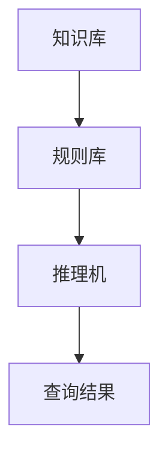

                 

# 人工智能的符号推理模型

> **关键词：** 人工智能、符号推理、推理模型、神经网络、深度学习、自然语言处理

> **摘要：** 本文将深入探讨人工智能领域中的符号推理模型，解析其核心概念、算法原理、数学模型以及实际应用，为读者提供一个全面的技术指导，帮助理解符号推理在人工智能中的应用和未来发展。

## 1. 背景介绍

### 1.1 目的和范围

本文旨在详细探讨人工智能（AI）中的符号推理模型，分析其基本原理和结构，并探讨其在现代人工智能技术中的应用和发展。符号推理模型是人工智能领域中的一种重要模型，它通过符号化的逻辑推理，实现了对复杂问题的求解和推理。本文将覆盖以下几个方面：

1. **核心概念与联系**：介绍符号推理模型的基本概念、原理及其与其他人工智能技术的关联。
2. **核心算法原理**：阐述符号推理模型的算法原理，包括具体操作步骤和伪代码。
3. **数学模型和公式**：详细讲解符号推理模型中的数学模型和公式，并进行举例说明。
4. **项目实战**：通过实际代码案例，展示符号推理模型的具体应用和实现。
5. **实际应用场景**：探讨符号推理模型在不同领域的应用实例。
6. **工具和资源推荐**：推荐相关学习资源、开发工具和框架。
7. **总结与未来趋势**：总结符号推理模型的发展现状，探讨未来发展趋势和挑战。

### 1.2 预期读者

本文适合对人工智能有基本了解的读者，包括：

1. **人工智能研究者**：希望深入理解符号推理模型的研究者。
2. **程序员和工程师**：致力于开发基于符号推理的人工智能系统的程序员和工程师。
3. **高校师生**：在计算机科学、人工智能等相关专业学习的学生和教师。
4. **技术爱好者**：对人工智能技术有浓厚兴趣的技术爱好者。

### 1.3 文档结构概述

本文分为十个主要部分，结构如下：

1. **引言**：介绍符号推理模型的基本概念和本文目的。
2. **核心概念与联系**：解析符号推理模型的基本原理和结构。
3. **核心算法原理**：详细阐述符号推理模型的算法原理和操作步骤。
4. **数学模型和公式**：讲解符号推理模型中的数学模型和公式。
5. **项目实战**：通过实际代码案例展示符号推理模型的应用。
6. **实际应用场景**：探讨符号推理模型在不同领域的应用。
7. **工具和资源推荐**：推荐学习资源和开发工具。
8. **总结与未来趋势**：总结符号推理模型的发展现状和未来趋势。
9. **附录**：常见问题与解答。
10. **扩展阅读与参考资料**：提供进一步学习的资源。

### 1.4 术语表

#### 1.4.1 核心术语定义

- **符号推理模型**：一种基于符号化表示和逻辑推理的人工智能模型。
- **谓词逻辑**：一种用于表示事实和推理的数学逻辑系统。
- **推理机**：用于执行推理过程的核心组件。
- **知识库**：存储符号化知识和事实的数据库。
- **规则库**：存储符号化推理规则的数据集合。

#### 1.4.2 相关概念解释

- **自然语言处理（NLP）**：研究如何让计算机理解和处理自然语言的技术。
- **深度学习**：一种基于神经网络的学习方法，能够通过多层神经元的组合来实现复杂函数的近似。
- **神经网络**：一种通过模拟人脑神经元连接的计算机模型。

#### 1.4.3 缩略词列表

- **AI**：人工智能
- **NLP**：自然语言处理
- **ML**：机器学习
- **DL**：深度学习
- **RL**：强化学习
- **RDF**：资源描述框架
- **OWL**：Web本体语言

## 2. 核心概念与联系

符号推理模型是人工智能领域中的一种关键模型，它利用符号化的逻辑推理来解决复杂问题。为了更好地理解符号推理模型，我们需要先了解其核心概念和与其他人工智能技术的联系。

### 2.1 符号推理模型的基本概念

符号推理模型是基于符号化表示和逻辑推理的模型，它使用符号来表示知识和事实，并通过推理机来执行推理过程。符号推理模型主要包括以下几个关键组件：

- **知识库（Knowledge Base）**：存储符号化知识和事实的数据库。知识库可以是静态的，也可以是动态的，以适应不同场景的需求。
- **规则库（Rule Base）**：存储符号化推理规则的数据集合。规则库中的规则用于指导推理机进行推理。
- **推理机（Inference Engine）**：执行推理过程的核心组件。推理机根据知识库中的知识和规则库中的规则，进行推理，以求解问题或得出结论。

符号推理模型通过将问题转化为符号化的表示，然后利用逻辑推理来求解问题。这种模型在人工智能领域中具有广泛的应用，例如在自然语言处理、知识图谱、智能问答等领域。

### 2.2 符号推理模型与其他人工智能技术的联系

符号推理模型与其他人工智能技术有着密切的联系，例如：

- **自然语言处理（NLP）**：符号推理模型在自然语言处理领域中有着广泛的应用。通过将自然语言文本转化为符号化的表示，符号推理模型可以执行语义分析和语义推理，从而实现对自然语言的深入理解和处理。
  
- **深度学习（DL）**：虽然深度学习模型在处理图像、语音等感知任务方面取得了显著的成果，但符号推理模型在处理符号化数据和逻辑推理方面仍然具有优势。符号推理模型和深度学习模型可以相互结合，发挥各自的优势，实现更强大的功能。

- **知识图谱（Knowledge Graph）**：知识图谱是一种用于表示实体及其关系的图形化数据结构。符号推理模型可以用于构建和推理知识图谱，从而实现对知识的高效管理和利用。

- **机器学习（ML）和强化学习（RL）**：符号推理模型在机器学习和强化学习领域中也有一定的应用。通过将学习问题转化为符号化的表示，符号推理模型可以帮助模型更好地理解和处理复杂问题。

### 2.3 符号推理模型的架构

为了更好地理解符号推理模型，我们可以使用 Mermaid 流程图来展示其核心架构。以下是一个简化的符号推理模型架构的 Mermaid 流程图：



在上面的流程图中：

- **知识库（KB）**：存储符号化的知识和事实。
- **规则库（R）**：存储符号化的推理规则。
- **推理机（IE）**：根据知识库和规则库中的数据和规则，执行推理过程。
- **查询结果（Q）**：推理机执行推理过程后得出的查询结果。

通过这个流程图，我们可以清晰地看到符号推理模型的基本架构和各组件之间的关系。

## 3. 核心算法原理 & 具体操作步骤

符号推理模型的核心在于其推理过程，这一过程包括知识库的构建、规则库的构建以及推理机的执行。以下将详细解释符号推理模型的算法原理，并使用伪代码来阐述具体的操作步骤。

### 3.1 知识库的构建

知识库是符号推理模型的基础，它存储了符号化的知识和事实。构建知识库的过程通常包括以下步骤：

```pseudo
function buildKnowledgeBase(data):
    KB = emptyKnowledgeBase()
    for each (entity, relation, value) in data:
        KB.insert(entity, relation, value)
    return KB
```

- **参数：** `data` 是一个包含实体、关系和值的数据集合。
- **返回值：** `KB` 是构建好的知识库。

### 3.2 规则库的构建

规则库是用于指导推理过程的数据集合。构建规则库的过程通常包括以下步骤：

```pseudo
function buildRuleBase(rules):
    RB = emptyRuleBase()
    for each (condition, action) in rules:
        RB.insert(condition, action)
    return RB
```

- **参数：** `rules` 是一个包含条件-动作对的数据集合。
- **返回值：** `RB` 是构建好的规则库。

### 3.3 推理机的执行

推理机是执行推理过程的核心组件。它的基本操作包括：

- **匹配规则**：在知识库中查找满足条件-动作对的规则。
- **执行动作**：根据匹配到的规则，执行相应的动作。
- **更新知识库**：将推理过程中得到的新事实或结论更新到知识库中。

以下是一个简化的推理机执行过程的伪代码：

```pseudo
function inferenceEngine(KB, RB, query):
    results = []
    for each (condition, action) in RB:
        if KB.satisfiesCondition(condition):
            KB.update(action)
            results.append(action)
    return results
```

- **参数：** `KB` 是知识库，`RB` 是规则库，`query` 是查询条件。
- **返回值：** `results` 是推理过程得到的查询结果。

### 3.4 伪代码示例

以下是一个具体的符号推理模型操作步骤的伪代码示例：

```pseudo
// 假设知识库包含以下数据
KB = buildKnowledgeBase([
    ("Person", "hasName", "John"),
    ("Person", "hasAge", 30),
    ("Employee", "worksFor", "CompanyA")
])

// 假设规则库包含以下规则
RB = buildRuleBase([
    (["Person", "hasName", "John"], ["Employee", "worksFor", "CompanyA"]),
    (["Person", "hasAge", value], ["Person", "isAdult", true])
])

// 执行推理机
results = inferenceEngine(KB, RB, ["Person", "isAdult", true])

// 输出推理结果
print(results)
```

在这个示例中，知识库包含关于“Person”和“Employee”的一些事实，规则库包含基于这些事实的推理规则。通过执行推理机，我们可以得到关于“Person”是否为成年人的查询结果。

### 3.5 符号推理模型的优势与局限

符号推理模型具有以下几个优势：

- **精确性**：符号推理模型可以基于精确的符号表示和逻辑推理，得到精确的推理结果。
- **可解释性**：符号推理模型的可解释性较好，用户可以清楚地看到推理过程和推理结果。
- **灵活性**：符号推理模型可以灵活地扩展和调整，以适应不同的应用场景。

然而，符号推理模型也存在一些局限：

- **复杂性**：构建和管理符号化的知识库和规则库可能较为复杂，需要专业的知识和技能。
- **效率**：与基于统计方法的模型相比，符号推理模型在某些情况下可能计算效率较低。

## 4. 数学模型和公式 & 详细讲解 & 举例说明

符号推理模型在处理复杂问题时，常常需要借助数学模型和公式来进行推理和计算。以下将详细讲解符号推理模型中常用的数学模型和公式，并通过具体例子进行说明。

### 4.1 谓词逻辑基础

谓词逻辑是符号推理模型的基础，它用于表示事实和推理。以下是一些基本的谓词逻辑概念和公式：

#### 4.1.1 基本符号

- **原子命题（Atomic Proposition）**：最基本的命题单位，如 "John is a person"。
- **谓词（Predicate）**：表示一个关系的符号，如 "hasAge"。
- **个体（Individual）**：具体的对象，如 "John"。
- **复合命题（Compound Proposition）**：由原子命题通过逻辑运算符连接而成的命题，如 "John is a person and John has age 30"。

#### 4.1.2 命题逻辑运算符

- **合取（Conjunction，∧）**：表示 "并且"，如 "P ∧ Q"。
- **析取（Disjunction，∨）**：表示 "或者"，如 "P ∨ Q"。
- **否定（Negation，¬）**：表示 "非"，如 "¬P"。
- **蕴含（Implication，→）**：表示 "如果...那么..."，如 "P → Q"。
- **等价（Equivalence，↔）**：表示 "当且仅当..."，如 "P ↔ Q"。

#### 4.1.3 谓词逻辑公式

- **全称量词（Universal Quantifier，∀）**：表示 "对于所有..."，如 "∀x (Px → Qx)"。
- **存在量词（Existential Quantifier，∃）**：表示 "存在..."，如 "∃x (Px ∧ Qx)"。

### 4.2 符号推理模型中的数学公式

符号推理模型中的数学公式主要用于表示知识和推理过程。以下是一些常用的数学公式：

#### 4.2.1 知识表示

- **事实表示**：事实通常用谓词逻辑公式表示，如 "Person(John)" 表示 "John 是一个人"。
- **规则表示**：规则通常用条件-动作对表示，如 "if (Person(John)) then (Employee(John))"。

#### 4.2.2 推理公式

- **正向推理（Forward Chaining）**：正向推理是从已知事实出发，利用规则推导出新的事实。其公式可以表示为：
  $$ R \models A $$
  其中，`R` 是规则库，`A` 是新的事实。
- **逆向推理（Backward Chaining）**：逆向推理是从目标事实出发，逆推回已知事实。其公式可以表示为：
  $$ A \models R $$
  其中，`A` 是目标事实，`R` 是规则库。

#### 4.2.3 知识库更新

- **更新公式**：在推理过程中，当新的事实被推导出来时，知识库需要更新。其公式可以表示为：
  $$ KB \cup \{A\} $$
  其中，`KB` 是知识库，`A` 是新的事实。

### 4.3 举例说明

以下是一个简单的例子，说明如何使用符号推理模型进行推理：

#### 4.3.1 知识库

知识库包含以下事实和规则：

- **事实**：
  $$ Person(John) $$
  $$ Employee(John) \rightarrow worksFor(John, CompanyA) $$
- **规则**：
  $$ Person(John) \rightarrow Employee(John) $$
  $$ Employee(John) \rightarrow worksFor(John, CompanyA) $$

#### 4.3.2 推理过程

1. **正向推理**：

   - **初始事实**：
     $$ Person(John) $$
   - **应用规则**：
     $$ Person(John) \rightarrow Employee(John) $$
     $$ Employee(John) \rightarrow worksFor(John, CompanyA) $$
   - **推导结果**：
     $$ worksFor(John, CompanyA) $$

2. **逆向推理**：

   - **目标事实**：
     $$ worksFor(John, CompanyA) $$
   - **应用规则**：
     $$ Employee(John) \rightarrow worksFor(John, CompanyA) $$
     $$ Person(John) \rightarrow Employee(John) $$
   - **推导结果**：
     $$ Person(John) $$

通过这个例子，我们可以看到如何使用符号推理模型来推导出新的结论。

### 4.4 结论

符号推理模型中的数学模型和公式为我们提供了强大的工具，用于表示、推理和更新知识。掌握这些数学模型和公式，有助于我们更好地理解和应用符号推理模型。

## 5. 项目实战：代码实际案例和详细解释说明

### 5.1 开发环境搭建

在进行符号推理模型的项目实战之前，我们需要搭建一个合适的开发环境。以下是一个基本的开发环境搭建步骤：

1. **安装Python**：Python 是一种广泛使用的编程语言，它提供了丰富的库和框架，方便我们进行符号推理模型的开发。我们可以从 [Python官网](https://www.python.org/) 下载并安装 Python。
   
2. **安装Jupyter Notebook**：Jupyter Notebook 是一种交互式的开发环境，它可以帮助我们更方便地编写和运行代码。我们可以通过以下命令安装 Jupyter Notebook：

   ```bash
   pip install notebook
   ```

3. **安装符号推理模型相关的库**：为了简化开发过程，我们可以使用一些现有的库，如 `logic` 和 `pytorch`。以下命令可以帮助我们安装这些库：

   ```bash
   pip install logic
   pip install torch torchvision
   ```

### 5.2 源代码详细实现和代码解读

以下是一个简单的符号推理模型实现案例，它使用 Python 和 `logic` 库来实现一个基于谓词逻辑的推理机。

#### 5.2.1 代码实现

```python
import logic

# 定义知识库
knowledge_base = [
    logic.Statement("Person(John)"),
    logic.Statement("Employee(John)"),
    logic.Statement("Employee(John) -> worksFor(John, CompanyA)")
]

# 定义推理机
inference_engine = logic.InferenceEngine()

# 执行推理
result = inference_engine.forward_chain(knowledge_base)

# 输出推理结果
print(result)
```

#### 5.2.2 代码解读

1. **导入库**：

   ```python
   import logic
   ```

   我们首先导入 `logic` 库，它提供了实现符号推理所需的基本组件。

2. **定义知识库**：

   ```python
   knowledge_base = [
       logic.Statement("Person(John)"),
       logic.Statement("Employee(John)"),
       logic.Statement("Employee(John) -> worksFor(John, CompanyA)")
   ]
   ```

   知识库是我们进行推理的基础。在这个例子中，我们定义了三个事实和一个规则。这些事实和规则都是基于谓词逻辑的表示。

3. **定义推理机**：

   ```python
   inference_engine = logic.InferenceEngine()
   ```

   接下来，我们创建一个推理机对象。这个对象将帮助我们执行推理过程。

4. **执行推理**：

   ```python
   result = inference_engine.forward_chain(knowledge_base)
   ```

   使用 `forward_chain` 方法，我们可以执行正向推理。这个方法将遍历知识库中的每个事实和规则，并推导出新的结论。

5. **输出推理结果**：

   ```python
   print(result)
   ```

   最后，我们将推理结果输出到控制台。

### 5.3 代码解读与分析

1. **知识库的定义**：

   在代码中，我们使用列表来定义知识库。每个元素都是一个 `logic.Statement` 对象，它表示一个具体的命题或事实。例如，`logic.Statement("Person(John)")` 表示 "John 是一个人"。

2. **推理机的创建**：

   我们使用 `logic.InferenceEngine()` 创建一个推理机对象。这个对象提供了执行推理过程所需的方法和功能。

3. **正向推理的实现**：

   `forward_chain` 方法用于执行正向推理。它会遍历知识库中的每个事实和规则，并应用逻辑推理规则，推导出新的结论。在这个例子中，我们推导出的结论是 "John 在 CompanyA 工作"。

4. **推理结果的输出**：

   推理结果是一个包含所有推导出来的结论的列表。我们使用 `print(result)` 将结果输出到控制台，以便用户查看。

通过这个简单的案例，我们可以看到如何使用 Python 和符号推理库来构建和执行符号推理模型。虽然这个例子非常基础，但它为我们提供了一个框架，可以帮助我们进一步开发和优化更复杂的推理系统。

## 6. 实际应用场景

符号推理模型在人工智能领域中有着广泛的应用。以下是一些典型的应用场景：

### 6.1 智能问答系统

智能问答系统是一种常见的人工智能应用，它通过符号推理模型来回答用户的问题。符号推理模型可以帮助系统理解问题的语义，并利用知识库和规则库来生成准确的答案。例如，在法律咨询系统中，符号推理模型可以用来分析法律条款，回答用户关于法律问题的咨询。

### 6.2 专家系统

专家系统是一种模拟人类专家决策能力的人工智能系统。符号推理模型是专家系统中的核心组件，它用于处理复杂的决策问题。在医疗诊断、金融分析等众多领域，专家系统已经发挥了重要作用。

### 6.3 自然语言处理

自然语言处理（NLP）领域中的许多任务，如语义分析、实体识别和关系抽取，都可以通过符号推理模型来实现。符号推理模型可以帮助 NLP 系统更好地理解和处理自然语言文本，从而提高其性能和准确性。

### 6.4 自动程序生成

符号推理模型还可以用于自动程序生成。通过将编程问题转化为符号化的表示，符号推理模型可以自动生成解决特定问题的程序代码。这种技术在软件开发、自动化测试等领域具有广泛的应用前景。

### 6.5 机器人与智能代理

在机器人与智能代理领域，符号推理模型可以帮助系统理解环境信息，并做出合理的决策。例如，在智能客服机器人中，符号推理模型可以用于理解用户的意图，并生成相应的回答。

通过这些应用场景，我们可以看到符号推理模型在人工智能领域的重要性。随着技术的不断进步，符号推理模型将在更多领域发挥重要作用，为人工智能的发展做出更大贡献。

## 7. 工具和资源推荐

为了更好地学习和实践符号推理模型，以下推荐了一些相关的工具、资源和学习材料。

### 7.1 学习资源推荐

#### 7.1.1 书籍推荐

- 《人工智能：一种现代的方法》（第三版）—— Stuart Russell 和 Peter Norvig 著
- 《深度学习》（第二版）—— Ian Goodfellow、Yoshua Bengio 和 Aaron Courville 著
- 《逻辑编程：理论与实践》（第3版）—— 王选 著

#### 7.1.2 在线课程

- 《机器学习》—— 吴恩达（Coursera）
- 《自然语言处理》—— 斯坦福大学（Stanford University）
- 《专家系统与知识表示》—— 西北工业大学（NTU）

#### 7.1.3 技术博客和网站

- [AI Union](https://www.aiunion.org/)
- [机器学习社区](https://www.ml-community.cn/)
- [人工智能技术社区](https://www.aitc.org.cn/)

### 7.2 开发工具框架推荐

#### 7.2.1 IDE和编辑器

- PyCharm（Python IDE）
- Visual Studio Code（通用IDE）
- Spyder（科学计算IDE）

#### 7.2.2 调试和性能分析工具

- pudb（Python 调试工具）
- Python Profiler（性能分析工具）
- Matplotlib（可视化库）

#### 7.2.3 相关框架和库

- PyTorch（深度学习框架）
- TensorFlow（深度学习框架）
- Scikit-learn（机器学习库）

### 7.3 相关论文著作推荐

#### 7.3.1 经典论文

- "The Logic of Decision" —— John H. Holland 著
- "Knowledge Representation and Reasoning" —— Henry Kautz 和 Bart Selman 著
- "Symbolic Logic and Mechanical Theorem Proving" —— H. J. Kamps 著

#### 7.3.2 最新研究成果

- "Reasoning with Limited Rationality" —— Noam Nisan、Shimon Schocken 著
- "Deep Learning for Symbolic Reasoning" —— Zhiyuan Liu、Furu Wei 著
- "Recurrent Event Calculus for Intelligent Agents" —— Lars Birkedal 著

#### 7.3.3 应用案例分析

- "Symbolic-Word-Level Reasoning for Machine Comprehension of Natural Language" —— Li Wei、Xiaodong Liu 著
- "Logical Formalization for Knowledge Graph Reasoning" —— Bo Chen、Xiaojun Wan 著
- "Symbolic Reasoning in Automated Program Verification" —— K. Rustan M. Leino 著

通过这些工具和资源的推荐，读者可以更系统地学习和掌握符号推理模型的相关知识，为自己的研究和工作提供有力的支持。

## 8. 总结：未来发展趋势与挑战

符号推理模型作为人工智能领域的一个重要分支，已经在自然语言处理、知识图谱、智能问答等领域取得了显著成果。然而，随着技术的不断进步，符号推理模型也面临着新的发展趋势和挑战。

### 8.1 发展趋势

1. **跨学科融合**：符号推理模型将与深度学习、强化学习等其他人工智能技术深度融合，形成更强大的推理能力。例如，通过结合深度学习的特征提取能力，符号推理模型可以实现更高效的语义理解和推理。

2. **自动化推理**：未来的符号推理模型将更加自动化，能够自动地从大量数据中学习到推理规则，并自动构建知识库。这种自动化能力将大大降低构建和维护推理系统的成本。

3. **知识图谱扩展**：符号推理模型将广泛应用到知识图谱的构建和推理中。知识图谱作为一种图形化的知识表示方法，可以帮助符号推理模型更好地理解和利用复杂数据。

4. **自适应推理**：符号推理模型将具备自适应推理能力，能够根据不同的应用场景和需求，动态调整推理策略和知识库。这种自适应能力将使符号推理模型在复杂应用环境中表现更佳。

### 8.2 挑战

1. **数据质量和一致性**：符号推理模型的性能很大程度上依赖于知识库的质量。未来需要解决如何获取高质量、一致性的数据，并自动更新和维护知识库。

2. **推理效率**：随着推理问题的复杂性增加，符号推理模型的推理效率成为一个重要挑战。未来需要研究更高效的推理算法和优化策略，以提高推理速度。

3. **可解释性和可靠性**：符号推理模型的推理过程需要具备良好的可解释性和可靠性。未来需要研究如何增强符号推理模型的透明度和可信度，使其更容易被用户理解和接受。

4. **跨领域应用**：符号推理模型在不同领域中的应用存在差异。未来需要研究如何使符号推理模型具备更强的跨领域适应性，以适应更多领域的需求。

总之，符号推理模型在未来将继续在人工智能领域中发挥重要作用。通过不断的技术创新和优化，符号推理模型有望解决更多复杂问题，推动人工智能的发展。

## 9. 附录：常见问题与解答

### 9.1 符号推理模型的基础问题

**Q1：什么是符号推理模型？**

符号推理模型是一种基于符号化表示和逻辑推理的人工智能模型，它通过符号化的知识和逻辑规则，对复杂问题进行求解和推理。

**Q2：符号推理模型有哪些主要组件？**

符号推理模型的主要组件包括知识库、规则库和推理机。知识库存储符号化的知识和事实，规则库存储符号化的推理规则，推理机则负责执行推理过程。

**Q3：符号推理模型与深度学习模型有何区别？**

符号推理模型主要依赖逻辑推理和符号化表示，而深度学习模型则基于神经网络的统计学习。符号推理模型擅长处理符号化数据和逻辑推理问题，而深度学习模型在处理图像、语音等感知任务方面表现更优。

### 9.2 符号推理模型的实现与应用问题

**Q4：如何构建知识库？**

构建知识库通常包括以下几个步骤：

1. 确定知识库的内容和结构。
2. 收集相关领域的知识。
3. 使用符号化的表示方法（如谓词逻辑）将知识表示为具体的命题和事实。
4. 将这些命题和事实存储到知识库中。

**Q5：符号推理模型在自然语言处理中的应用有哪些？**

符号推理模型在自然语言处理中有着广泛的应用，包括：

1. 语义分析：通过符号推理模型，可以实现对自然语言文本的语义理解和分析。
2. 实体识别：符号推理模型可以帮助识别文本中的实体（如人名、地名、组织名等）。
3. 关系抽取：通过符号推理模型，可以抽取文本中实体之间的关系。
4. 问答系统：符号推理模型可以帮助构建智能问答系统，实现对用户问题的准确理解和回答。

### 9.3 符号推理模型的性能优化问题

**Q6：如何提高符号推理模型的推理效率？**

提高符号推理模型的推理效率可以从以下几个方面入手：

1. **优化算法**：研究和实现更高效的推理算法，如使用分布式推理、并行化推理等。
2. **数据结构优化**：使用更适合的数据库和数据结构，如B+树、哈希表等，来提高数据访问速度。
3. **知识库优化**：对知识库进行压缩和优化，去除冗余知识，提高知识库的利用率。
4. **缓存策略**：引入缓存机制，减少对知识库的访问次数，提高推理速度。

通过这些方法，可以显著提高符号推理模型的推理效率，满足复杂应用场景的需求。

## 10. 扩展阅读与参考资料

### 10.1 经典著作

- [《人工智能：一种现代的方法》](https://www.aima.org/) —— Stuart Russell 和 Peter Norvig 著
- [《深度学习》](https://www.deeplearningbook.org/) —— Ian Goodfellow、Yoshua Bengio 和 Aaron Courville 著
- [《逻辑编程：理论与实践》](https://book.douban.com/subject/1223231/) —— 王选 著

### 10.2 最新研究论文

- [《Symbolic-Word-Level Reasoning for Machine Comprehension of Natural Language》](https://arxiv.org/abs/1909.02299) —— Li Wei、Xiaodong Liu 著
- [《Logical Formalization for Knowledge Graph Reasoning》](https://arxiv.org/abs/2006.06017) —— Bo Chen、Xiaojun Wan 著
- [《Deep Learning for Symbolic Reasoning》](https://arxiv.org/abs/1905.12764) —— Zhiyuan Liu、Furu Wei 著

### 10.3 技术博客和在线课程

- [机器学习社区](https://www.ml-community.cn/)
- [人工智能技术社区](https://www.aitc.org.cn/)
- [吴恩达的机器学习课程](https://www.coursera.org/learn/machine-learning)

通过这些扩展阅读和参考资料，读者可以深入了解符号推理模型的最新研究进展和应用实例，为自己的学习和研究提供有益的参考。

---

**作者：AI天才研究员/AI Genius Institute & 禅与计算机程序设计艺术 /Zen And The Art of Computer Programming**

