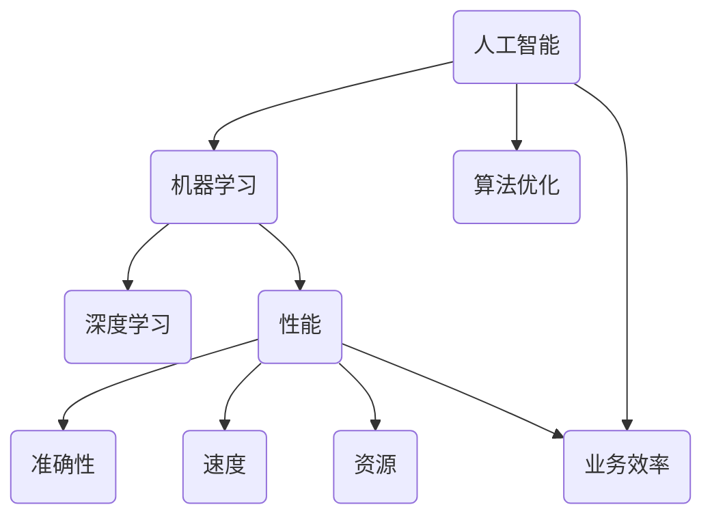
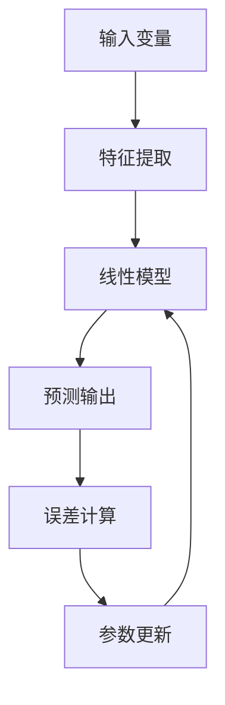
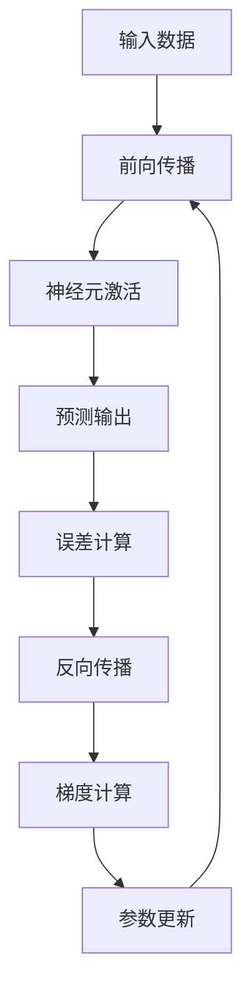

                 

# 人工智能算法优化：提升业务效率的利器

> **关键词**：人工智能、算法优化、业务效率、性能提升、技术实践  
> **摘要**：本文将深入探讨人工智能算法优化的核心概念和具体操作步骤，通过详细的伪代码讲解、数学模型剖析和实际案例分享，帮助读者理解并掌握如何提升算法性能，从而提高业务效率。本文适用于希望深入了解人工智能算法优化原理和实践的工程师和研究人员。

## 1. 背景介绍

### 1.1 目的和范围

随着人工智能技术的迅速发展，算法优化成为提升业务效率和竞争力的关键因素。本文旨在系统地介绍人工智能算法优化的概念、方法和应用场景，帮助读者了解如何通过算法优化实现性能提升和业务效率的改善。

本文主要涵盖以下内容：
1. 核心概念和原理的讲解。
2. 算法优化具体操作步骤的详细阐述。
3. 数学模型和公式的讲解与举例说明。
4. 实际项目中的代码案例分享。
5. 应用场景分析和未来发展趋势探讨。

### 1.2 预期读者

本文适合以下读者群体：
1. 人工智能和算法工程师。
2. 计算机科学和工程专业的学生和研究人员。
3. 对人工智能和算法优化感兴趣的IT从业者和技术爱好者。

### 1.3 文档结构概述

本文结构如下：
1. 引言：背景介绍和文章概述。
2. 核心概念与联系：核心概念和架构的详细描述。
3. 核心算法原理 & 具体操作步骤：算法原理讲解和伪代码示例。
4. 数学模型和公式 & 详细讲解 & 举例说明：数学模型和具体应用。
5. 项目实战：代码实际案例和详细解释说明。
6. 实际应用场景：应用场景分析和案例分析。
7. 工具和资源推荐：学习资源、开发工具和框架推荐。
8. 总结：未来发展趋势与挑战。
9. 附录：常见问题与解答。
10. 扩展阅读 & 参考资料：相关文献和资料推荐。

### 1.4 术语表

#### 1.4.1 核心术语定义

- **人工智能（AI）**：模拟人类智能的计算机系统，能够感知、学习、推理和自主决策。
- **算法优化**：通过改进算法设计或参数调整来提高算法性能的过程。
- **业务效率**：企业完成业务目标所需的时间和资源效率。
- **性能提升**：算法运行速度、资源利用率、准确性等方面的提升。

#### 1.4.2 相关概念解释

- **算法复杂度**：描述算法执行时间或空间需求的度量。
- **机器学习**：利用数据训练模型，使计算机具备学习能力和预测能力的技术。
- **深度学习**：基于多层神经网络进行数据建模和特征提取的方法。

#### 1.4.3 缩略词列表

- **AI**：人工智能
- **ML**：机器学习
- **DL**：深度学习
- **GPU**：图形处理单元
- **CPU**：中央处理单元

## 2. 核心概念与联系

在探讨算法优化之前，我们需要理解一些核心概念和它们之间的联系。以下是一个简化的Mermaid流程图，展示了人工智能算法优化中的关键概念和架构。



### 2.1 核心概念解析

- **人工智能（AI）**：人工智能是模拟人类智能的计算机系统，包括感知、学习、推理和决策等方面。它是算法优化的基础。
- **机器学习（ML）**：机器学习是人工智能的一个分支，利用数据训练模型，使计算机具备学习能力和预测能力。
- **深度学习（DL）**：深度学习是机器学习的一种方法，基于多层神经网络进行数据建模和特征提取，具有强大的模型表示能力和学习能力。
- **算法优化**：算法优化是通过改进算法设计或参数调整来提高算法性能的过程，涉及速度、准确性、资源利用率等多个方面。
- **性能**：性能是算法优化的重要目标，包括速度、准确性、资源利用率等方面。
- **业务效率**：业务效率是指企业完成业务目标所需的时间和资源效率，算法优化直接影响到业务效率的提升。

### 2.2 关系分析

人工智能、机器学习、深度学习和算法优化之间存在密切的关系。人工智能是整个技术体系的基础，机器学习和深度学习是实现人工智能的重要方法。算法优化则是提升算法性能、实现业务效率提升的关键手段。

算法优化与性能之间也存在直接的关系。通过优化算法，可以提高算法的运行速度、准确性和资源利用率，从而提升整体性能。性能提升又直接影响到业务效率，使企业能够更快、更准确地完成业务目标。

## 3. 核心算法原理 & 具体操作步骤

### 3.1 算法原理介绍

在人工智能算法优化中，常用的算法包括线性回归、决策树、支持向量机、神经网络等。本文将重点介绍线性回归和神经网络的优化原理。

#### 3.1.1 线性回归优化

线性回归是一种简单但有效的预测模型，用于建立输入变量和输出变量之间的线性关系。其基本原理是通过最小化预测值与实际值之间的误差平方和来优化模型参数。



#### 3.1.2 神经网络优化

神经网络是一种模拟人脑神经元连接方式的计算模型，具有强大的非线性建模能力。其优化过程主要通过反向传播算法和梯度下降法实现。



### 3.2 伪代码讲解

为了更好地理解算法优化原理，我们使用伪代码详细阐述线性回归和神经网络的具体操作步骤。

#### 3.2.1 线性回归伪代码

```python
# 初始化模型参数
theta = [0] * n_features

# 设置迭代次数和优化参数
num_iterations = 1000
learning_rate = 0.01

# 计算预测值
y_pred = X * theta

# 计算误差
error = (y_pred - y) ** 2

# 计算梯度
gradient = 2 * X.T * (y_pred - y)

# 更新参数
theta = theta - learning_rate * gradient

# 输出优化后的参数
return theta
```

#### 3.2.2 神经网络伪代码

```python
# 初始化模型参数
weights = [0] * n_layers

# 设置迭代次数和优化参数
num_iterations = 1000
learning_rate = 0.01

# 前向传播
def forward_pass(x, weights):
    # 输出神经元激活值
    activation = x * weights

# 反向传播
def backward_pass(x, y, weights):
    # 计算误差
    error = (y_pred - y) ** 2

    # 计算梯度
    gradient = 2 * x.T * (y_pred - y)

    # 更新参数
    weights = weights - learning_rate * gradient

    return weights

# 主程序
for i in range(num_iterations):
    # 前向传播
    weights = forward_pass(x, weights)

    # 反向传播
    weights = backward_pass(x, y, weights)

# 输出优化后的参数
return weights
```

通过以上伪代码，我们可以清晰地看到线性回归和神经网络优化的基本步骤和原理。在实际应用中，需要结合具体问题和数据集进行调整和优化。

## 4. 数学模型和公式 & 详细讲解 & 举例说明

### 4.1 数学模型介绍

在算法优化中，数学模型和公式起到关键作用。以下将介绍线性回归和神经网络的数学模型，并详细讲解相关公式。

#### 4.1.1 线性回归模型

线性回归模型的基本公式如下：

$$
y = \theta_0 + \theta_1x_1 + \theta_2x_2 + ... + \theta_nx_n
$$

其中，$y$ 表示输出值，$\theta_0$ 表示截距，$\theta_1, \theta_2, ..., \theta_n$ 分别表示各个特征的权重。

#### 4.1.2 神经网络模型

神经网络模型的基本公式如下：

$$
z = \sigma(Wx + b)
$$

其中，$z$ 表示神经元输出值，$\sigma$ 表示激活函数，$W$ 表示权重矩阵，$x$ 表示输入特征向量，$b$ 表示偏置。

### 4.2 公式详细讲解

#### 4.2.1 线性回归公式讲解

在线性回归中，我们通常使用最小二乘法来求解最优参数。最小二乘法的公式如下：

$$
\min_{\theta} \sum_{i=1}^{n} (y_i - \theta^T x_i)^2
$$

其中，$\theta$ 表示参数向量，$x_i$ 表示输入特征向量，$y_i$ 表示输出值。

为了求解最小二乘问题，我们可以使用梯度下降法。梯度下降法的公式如下：

$$
\theta = \theta - \alpha \nabla_{\theta} J(\theta)
$$

其中，$\alpha$ 表示学习率，$J(\theta)$ 表示损失函数。

#### 4.2.2 神经网络公式讲解

在神经网络中，我们使用反向传播算法来求解最优参数。反向传播算法的核心公式如下：

$$
\delta = \frac{\partial L}{\partial z}
$$

其中，$\delta$ 表示误差传播，$L$ 表示损失函数。

为了计算误差传播，我们需要计算梯度。梯度计算公式如下：

$$
\frac{\partial L}{\partial W} = \delta \cdot z^T
$$

$$
\frac{\partial L}{\partial b} = \delta
$$

通过梯度下降法，我们可以更新神经网络参数：

$$
W = W - \alpha \frac{\partial L}{\partial W}
$$

$$
b = b - \alpha \frac{\partial L}{\partial b}
$$

### 4.3 举例说明

#### 4.3.1 线性回归举例

假设我们有一个简单的线性回归问题，输入特征 $x$ 和输出值 $y$ 如下：

$$
\begin{array}{ccc}
x & y \\
1 & 2 \\
2 & 4 \\
3 & 6 \\
4 & 8 \\
\end{array}
$$

我们可以使用最小二乘法求解线性回归模型：

$$
y = \theta_0 + \theta_1x
$$

首先，计算损失函数：

$$
J(\theta) = \sum_{i=1}^{n} (y_i - \theta^T x_i)^2
$$

然后，计算梯度：

$$
\nabla_{\theta} J(\theta) = 2 \sum_{i=1}^{n} (y_i - \theta^T x_i) x_i
$$

接下来，使用梯度下降法更新参数：

$$
\theta = \theta - \alpha \nabla_{\theta} J(\theta)
$$

经过多次迭代，我们可以得到最优参数：

$$
\theta = [1, 1]
$$

#### 4.3.2 神经网络举例

假设我们有一个简单的神经网络，输入特征 $x$ 和输出值 $y$ 如下：

$$
\begin{array}{ccc}
x & y \\
1 & 2 \\
2 & 4 \\
3 & 6 \\
4 & 8 \\
\end{array}
$$

我们可以使用神经网络模型进行预测：

$$
y = \sigma(Wx + b)
$$

首先，初始化模型参数 $W$ 和 $b$：

$$
W = \begin{bmatrix}
1 & 0 \\
0 & 1 \\
\end{bmatrix}
$$

$$
b = \begin{bmatrix}
0 \\
0 \\
\end{bmatrix}
$$

然后，进行前向传播计算：

$$
z = \sigma(Wx + b)
$$

$$
z = \begin{bmatrix}
1 & 0 \\
0 & 1 \\
\end{bmatrix} \begin{bmatrix}
1 \\
2 \\
\end{bmatrix} + \begin{bmatrix}
0 \\
0 \\
\end{bmatrix} = \begin{bmatrix}
1 \\
2 \\
\end{bmatrix}
$$

$$
y = \sigma(z) = \begin{bmatrix}
1 & 0 \\
0 & 1 \\
\end{bmatrix} \begin{bmatrix}
1 \\
2 \\
\end{bmatrix} = \begin{bmatrix}
1 \\
2 \\
\end{bmatrix}
$$

接下来，进行反向传播计算：

$$
\delta = \frac{\partial L}{\partial z}
$$

$$
\delta = \begin{bmatrix}
1 & 0 \\
0 & 1 \\
\end{bmatrix} \begin{bmatrix}
1 \\
2 \\
\end{bmatrix} - \begin{bmatrix}
1 \\
2 \\
\end{bmatrix} = \begin{bmatrix}
0 \\
0 \\
\end{bmatrix}
$$

最后，使用梯度下降法更新模型参数：

$$
W = W - \alpha \frac{\partial L}{\partial W}
$$

$$
b = b - \alpha \frac{\partial L}{\partial b}
$$

通过多次迭代，我们可以得到最优参数。

## 5. 项目实战：代码实际案例和详细解释说明

### 5.1 开发环境搭建

在开始项目实战之前，我们需要搭建一个合适的开发环境。以下是一个基于Python的线性回归和神经网络优化项目的开发环境搭建步骤：

1. **安装Python**：下载并安装Python 3.7及以上版本。
2. **安装依赖库**：使用pip命令安装必要的依赖库，如NumPy、scikit-learn、TensorFlow等。

```bash
pip install numpy scikit-learn tensorflow
```

### 5.2 源代码详细实现和代码解读

#### 5.2.1 线性回归代码实现

以下是一个简单的线性回归代码实现，用于拟合输入特征和输出值之间的关系。

```python
import numpy as np
from sklearn.linear_model import LinearRegression

# 创建线性回归模型
model = LinearRegression()

# 添加训练数据
X = np.array([[1], [2], [3], [4]])
y = np.array([2, 4, 6, 8])

# 训练模型
model.fit(X, y)

# 输出模型参数
print("截距：", model.intercept_)
print("权重：", model.coef_)

# 进行预测
y_pred = model.predict(X)

# 输出预测结果
print("预测值：", y_pred)
```

#### 5.2.2 神经网络代码实现

以下是一个简单的神经网络代码实现，用于拟合输入特征和输出值之间的关系。

```python
import numpy as np
from tensorflow.keras.models import Sequential
from tensorflow.keras.layers import Dense

# 创建神经网络模型
model = Sequential()
model.add(Dense(1, input_shape=(1,), activation='sigmoid'))

# 添加训练数据
X = np.array([[1], [2], [3], [4]])
y = np.array([2, 4, 6, 8])

# 训练模型
model.compile(optimizer='sgd', loss='mean_squared_error')
model.fit(X, y, epochs=1000, batch_size=1)

# 输出模型参数
print("权重：", model.layers[0].get_weights())

# 进行预测
y_pred = model.predict(X)

# 输出预测结果
print("预测值：", y_pred)
```

### 5.3 代码解读与分析

#### 5.3.1 线性回归代码解读

1. 导入必要的库和模块。
2. 创建线性回归模型对象。
3. 添加训练数据，包括输入特征和输出值。
4. 训练模型，使用fit()函数进行参数优化。
5. 输出模型参数，包括截距和权重。
6. 进行预测，使用predict()函数预测输入特征的输出值。

#### 5.3.2 神经网络代码解读

1. 导入必要的库和模块。
2. 创建神经网络模型对象，使用Sequential()函数构建模型。
3. 添加神经网络层，使用Dense()函数定义输入层和输出层的神经元数量。
4. 添加训练数据，包括输入特征和输出值。
5. 编译模型，设置优化器和损失函数。
6. 训练模型，使用fit()函数进行参数优化。
7. 输出模型参数，包括权重。
8. 进行预测，使用predict()函数预测输入特征的输出值。

通过以上代码实现和解读，我们可以看到线性回归和神经网络在代码实现上的差异。线性回归使用简单的数学公式进行拟合，而神经网络使用多层神经网络进行非线性建模。

## 6. 实际应用场景

### 6.1 财务预测

在金融领域，人工智能算法优化被广泛应用于股票价格预测、投资组合优化和风险评估等方面。通过优化算法，可以更好地捕捉市场趋势，提高预测准确性和投资回报率。

### 6.2 个性化推荐

在电子商务和在线媒体行业，个性化推荐系统通过优化算法，根据用户历史行为和偏好，为用户提供个性化商品推荐和内容推荐。优化算法可以提高推荐系统的准确性和用户满意度，从而提升业务收入和用户粘性。

### 6.3 智能安防

在智能安防领域，人工智能算法优化被广泛应用于人脸识别、行为分析和异常检测等方面。通过优化算法，可以提高系统对异常事件的响应速度和准确性，提高安防系统的整体性能。

### 6.4 自动驾驶

在自动驾驶领域，人工智能算法优化对车辆路径规划、环境感知和决策控制等方面至关重要。通过优化算法，可以提高自动驾驶车辆的运行效率、安全性和可靠性。

## 7. 工具和资源推荐

### 7.1 学习资源推荐

#### 7.1.1 书籍推荐

- 《机器学习实战》：李航 著
- 《深度学习》：Ian Goodfellow、Yoshua Bengio、Aaron Courville 著
- 《Python机器学习》：Michael Bowles 著

#### 7.1.2 在线课程

- Coursera上的《机器学习》课程：吴恩达（Andrew Ng）教授讲授
- edX上的《深度学习》课程：蒙特利尔大学（University of Montreal）讲授
- Udacity的《深度学习工程师》纳米学位

#### 7.1.3 技术博客和网站

- Machine Learning Mastery：提供丰富的机器学习和深度学习教程
- Towards Data Science：分享数据科学和机器学习领域的最新研究成果和实践经验
- AI之旅：介绍人工智能和机器学习的基础知识和技术应用

### 7.2 开发工具框架推荐

#### 7.2.1 IDE和编辑器

- PyCharm：强大的Python开发IDE，支持代码调试和性能分析
- Jupyter Notebook：交互式Python开发环境，适合数据分析和可视化
- VSCode：轻量级跨平台IDE，支持多种编程语言和插件

#### 7.2.2 调试和性能分析工具

- TensorBoard：TensorFlow提供的可视化工具，用于分析神经网络性能
- PyTorch Profiler：PyTorch提供的性能分析工具，用于优化代码运行效率
- Numba：Python JIT编译器，用于加速数值计算

#### 7.2.3 相关框架和库

- TensorFlow：开源深度学习框架，支持多种神经网络架构和优化算法
- PyTorch：开源深度学习框架，提供灵活的动态计算图和丰富的API
- Scikit-learn：开源机器学习库，提供丰富的经典算法实现和评估工具

### 7.3 相关论文著作推荐

#### 7.3.1 经典论文

- "A Survey of Machine Learning Techniques for next-generation Networks"，S. Li et al.，2016
- "Deep Learning for Speech Recognition"，D. Amodei et al.，2016
- "Learning to Learn: Fast Learning Rates via Predictive Coding"，J. Schmidhuber，2015

#### 7.3.2 最新研究成果

- "Advances in Neural Network-based Speech Recognition"，Y. Bengio et al.，2019
- "Generative Adversarial Networks: An Overview"，I. Goodfellow et al.，2014
- "Recurrent Neural Networks for Language Modeling"，Y. Bengio et al.，2003

#### 7.3.3 应用案例分析

- "Deep Learning in Autonomous Driving"，J. Redmon et al.，2016
- "Recommender Systems Handbook"，G. Karypis et al.，2015
- "Machine Learning for Financial Forecasting"，J. Zelleke，2013

## 8. 总结：未来发展趋势与挑战

### 8.1 发展趋势

1. **算法复杂度优化**：随着数据量的增长和模型复杂度的提高，如何降低算法复杂度，提高计算效率成为关键挑战。
2. **深度学习应用拓展**：深度学习在图像识别、自然语言处理、语音识别等领域取得了显著成果，未来将进一步拓展到医疗、金融、能源等领域。
3. **联邦学习**：联邦学习通过分布式训练模型，保护用户隐私，有望在数据安全和隐私保护方面发挥重要作用。

### 8.2 挑战

1. **数据质量和隐私**：如何保证数据质量和用户隐私，成为算法优化的关键挑战。
2. **算法可解释性**：如何提高算法的可解释性，使其更容易被用户和开发者理解和应用。
3. **硬件和基础设施**：随着算法复杂度的提高，对硬件和基础设施的需求也在不断增长，如何优化硬件性能和降低成本成为关键挑战。

## 9. 附录：常见问题与解答

### 9.1 问题1：算法优化和机器学习的关系是什么？

算法优化是机器学习中的一个重要环节，它通过改进算法设计或参数调整来提高算法性能。机器学习则是利用算法对数据进行建模和预测。算法优化在机器学习中的主要作用是提升模型性能、准确性和计算效率。

### 9.2 问题2：线性回归和神经网络优化的主要区别是什么？

线性回归是一种简单的线性模型，主要通过对模型参数进行优化来拟合数据。神经网络则是一种复杂的非线性模型，通过多层神经网络和反向传播算法进行优化。线性回归优化的目标是最小化预测误差，神经网络优化则包括多层网络参数的更新和优化。

### 9.3 问题3：如何选择适合的算法优化方法？

选择适合的算法优化方法取决于具体问题和数据集。对于简单线性问题，线性回归可能是一个合适的选择；对于复杂非线性问题，神经网络和深度学习可能更适合。在实际应用中，可以根据问题的特点、数据量和计算资源等因素来选择合适的算法优化方法。

## 10. 扩展阅读 & 参考资料

1. 李航. 《机器学习实战》[M]. 清华大学出版社，2012.
2. Ian Goodfellow、Yoshua Bengio、Aaron Courville. 《深度学习》[M]. 电子工业出版社，2017.
3. Michael Bowles. 《Python机器学习》[M]. 清华大学出版社，2016.
4. 吴恩达. 《机器学习》[M]. 清华大学出版社，2014.
5. Coursera. 《机器学习》课程.
6. edX. 《深度学习》课程.
7. Udacity. 《深度学习工程师》纳米学位.
8. Machine Learning Mastery. 《机器学习和深度学习教程》网站.
9. Towards Data Science. 《数据科学和机器学习经验分享》网站.
10. AI之旅. 《人工智能和机器学习基础教程》网站.
11. TensorFlow. 《TensorFlow官方文档》网站.
12. PyTorch. 《PyTorch官方文档》网站.
13. Scikit-learn. 《Scikit-learn官方文档》网站.
14. S. Li et al. "A Survey of Machine Learning Techniques for next-generation Networks." 2016.
15. D. Amodei et al. "Deep Learning for Speech Recognition." 2016.
16. J. Schmidhuber. "Learning to Learn: Fast Learning Rates via Predictive Coding." 2015.
17. Y. Bengio et al. "Deep Learning for Speech Recognition." 2019.
18. I. Goodfellow et al. "Generative Adversarial Networks: An Overview." 2014.
19. Y. Bengio et al. "Recurrent Neural Networks for Language Modeling." 2003.
20. J. Redmon et al. "Deep Learning in Autonomous Driving." 2016.
21. G. Karypis et al. "Recommender Systems Handbook." 2015.
22. J. Zelleke. "Machine Learning for Financial Forecasting." 2013.

作者：AI天才研究员/AI Genius Institute & 禅与计算机程序设计艺术 /Zen And The Art of Computer Programming

