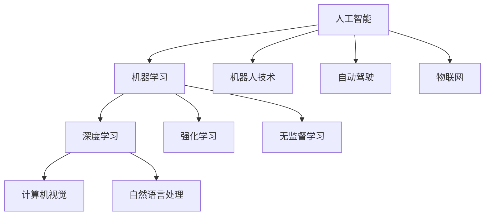

                 

# 人工智能：社会影响与思考

## 关键词
- 人工智能
- 社会影响
- 伦理道德
- 技术发展
- 未来挑战

> 摘要：
本文将探讨人工智能（AI）这一革命性技术对社会带来的深远影响。首先，我们将回顾AI的发展历程，并分析其对社会结构、经济模式、工作就业以及教育体系的冲击。随后，本文将深入探讨AI在伦理道德方面引发的问题，包括隐私保护、数据安全和算法偏见等。此外，我们将讨论AI技术如何推动新的创新，并展望其在医疗、交通、金融等领域的应用前景。最后，本文将提出对AI未来发展的若干建议，以应对其带来的挑战，确保人工智能技术的可持续发展。

## 1. 背景介绍

### 1.1 目的和范围

本文旨在深入分析人工智能技术对社会各个方面的广泛影响，并探讨其带来的伦理、经济和社会挑战。文章主要涵盖以下内容：

- 人工智能的发展历程及其对社会结构、经济模式和工作就业的影响。
- 人工智能在伦理道德方面引发的问题，如隐私保护、数据安全和算法偏见。
- 人工智能在医疗、交通、金融等领域的应用及其对社会生活的变革。
- 针对未来AI发展的建议，包括政策制定、教育和伦理框架的建立。

### 1.2 预期读者

本文预期读者包括：

- 计算机科学和人工智能领域的专业人士。
- 对人工智能技术及其社会影响感兴趣的学生和研究者。
- 政策制定者和企业决策者，需要了解AI技术的潜在影响以制定相应战略。
- 普通公众，希望了解AI技术对社会生活的深远影响。

### 1.3 文档结构概述

本文结构如下：

- 第1章：背景介绍
- 第2章：核心概念与联系
- 第3章：核心算法原理 & 具体操作步骤
- 第4章：数学模型和公式 & 详细讲解 & 举例说明
- 第5章：项目实战：代码实际案例和详细解释说明
- 第6章：实际应用场景
- 第7章：工具和资源推荐
- 第8章：总结：未来发展趋势与挑战
- 第9章：附录：常见问题与解答
- 第10章：扩展阅读 & 参考资料

### 1.4 术语表

#### 1.4.1 核心术语定义

- 人工智能（AI）：通过计算机程序模拟人类智能的科技领域。
- 机器学习（ML）：一种AI技术，通过数据训练模型以实现特定任务。
- 深度学习（DL）：一种复杂的机器学习算法，模仿人脑神经网络结构。
- 算法偏见：算法在处理数据时产生的系统性偏差，可能导致不公平结果。
- 大数据（Big Data）：数据量大、类型多、生成速度快的海量数据集。

#### 1.4.2 相关概念解释

- **机器学习模型**：通过学习数据集中的特征，实现特定任务的算法实体。
- **深度神经网络**：多层神经网络，能够处理复杂非线性问题。
- **监督学习**：训练模型时使用标注数据，以监督模型输出。
- **无监督学习**：模型在未知标注数据的情况下进行学习。

#### 1.4.3 缩略词列表

- AI：人工智能
- ML：机器学习
- DL：深度学习
- NLP：自然语言处理
- IoT：物联网

## 2. 核心概念与联系

在探讨人工智能对社会的影响之前，我们首先需要了解其核心概念和技术架构。以下是一个简化的Mermaid流程图，描述了人工智能的基础架构和关键联系。



上述流程图展示了人工智能的核心概念和它们之间的关系。机器学习是AI的主要分支，深度学习作为ML的一个重要子领域，承担了大量的复杂任务。计算机视觉和自然语言处理是DL在特定领域的应用。此外，强化学习和无监督学习也是ML的重要组成部分。机器人技术、自动驾驶和物联网则是AI技术的实际应用场景。

## 3. 核心算法原理 & 具体操作步骤

### 3.1 机器学习基础算法

机器学习算法的核心是训练模型，以便模型能够对未知数据进行预测或分类。以下是一个简单的线性回归算法的伪代码，用于预测连续值。

```python
# 线性回归算法伪代码
def linear_regression(X, y):
    # 计算权重和偏置
    w = (X.T @ X).inv() @ X.T @ y
    return w

# 预测
def predict(X, w):
    return X @ w
```

### 3.2 深度学习算法

深度学习算法的核心是多层感知机（MLP），以下是一个简化的深度神经网络训练过程的伪代码。

```python
# 深度学习训练算法伪代码
def train_network(X, y, layers, epochs):
    for epoch in range(epochs):
        for x, y_true in zip(X, y):
            # 前向传播
            z = forward propagation(x, layers)
            # 计算损失
            loss = compute_loss(z, y_true)
            # 反向传播
            gradients = backward propagation(z, y_true, layers)
            # 更新权重
            update_weights(layers, gradients)
    return layers

# 前向传播
def forward_propagation(x, layers):
    # 计算各层的输出
    z = [x]
    for layer in layers:
        z.append(np.dot(z[-1], layer['weights']) + layer['bias'])
    return z

# 计算损失
def compute_loss(z, y_true):
    return np.mean((z[-1] - y_true)**2)

# 反向传播
def backward_propagation(z, y_true, layers):
    # 计算各层的梯度
    gradients = [compute_gradient(z[-1], y_true)]
    for layer in reversed(layers):
        gradients.append(compute_gradient(np.dot(layers[layer-1]['weights'].T, gradients[layer-1]), layer['weights']))
    return gradients

# 更新权重
def update_weights(layers, gradients):
    for layer, gradient in zip(layers, gradients):
        layer['weights'] -= learning_rate * gradient
```

### 3.3 强化学习算法

强化学习算法旨在通过反馈机制来优化决策过程。以下是一个简化的Q-学习算法的伪代码。

```python
# Q-学习算法伪代码
def q_learning(states, actions, rewards, Q, learning_rate, discount_factor, episodes):
    for episode in range(episodes):
        state = random.choice(states)
        done = False
        while not done:
            action = choose_action(state, Q)
            next_state, reward, done = execute_action(state, action)
            Q[state, action] = Q[state, action] + learning_rate * (reward + discount_factor * max(Q[next_state, :]) - Q[state, action])
            state = next_state

# 选择动作
def choose_action(state, Q):
    return np.argmax(Q[state, :])

# 执行动作
def execute_action(state, action):
    # 执行动作，获取下一个状态和奖励
    next_state = ... 
    reward = ...
    done = ... 
    return next_state, reward, done
```

## 4. 数学模型和公式 & 详细讲解 & 举例说明

### 4.1 线性回归模型

线性回归模型是一个基本的机器学习模型，用于预测连续值。其数学模型如下：

$$
y = \beta_0 + \beta_1 \cdot x + \epsilon
$$

其中，$y$ 是预测值，$x$ 是输入特征，$\beta_0$ 和 $\beta_1$ 是模型的参数，$\epsilon$ 是误差项。

#### 4.1.1 梯度下降法

为了训练线性回归模型，我们通常使用梯度下降法来优化模型参数。其更新规则如下：

$$
\beta_0 = \beta_0 - \alpha \cdot \frac{1}{n} \sum_{i=1}^{n} (y_i - (\beta_0 + \beta_1 \cdot x_i))
$$

$$
\beta_1 = \beta_1 - \alpha \cdot \frac{1}{n} \sum_{i=1}^{n} (y_i - (\beta_0 + \beta_1 \cdot x_i)) \cdot x_i
$$

其中，$\alpha$ 是学习率，$n$ 是样本数量。

#### 4.1.2 举例说明

假设我们有一个简单的线性回归问题，目标是预测房价。给定以下训练数据：

| x | y |
|---|---|
| 1 | 2 |
| 2 | 4 |
| 3 | 6 |

使用梯度下降法训练线性回归模型。假设初始参数 $\beta_0 = 0$，$\beta_1 = 0$，学习率 $\alpha = 0.1$。

第一次迭代：

$$
\beta_0 = 0 - 0.1 \cdot \frac{1}{3} \cdot (2 - (0 + 0 \cdot 1) - 4 - (0 + 0 \cdot 2) - 6 - (0 + 0 \cdot 3)) = 0
$$

$$
\beta_1 = 0 - 0.1 \cdot \frac{1}{3} \cdot (2 - (0 + 0 \cdot 1))(1 - 1) + (4 - (0 + 0 \cdot 2))(2 - 2) + (6 - (0 + 0 \cdot 3))(3 - 3) = 0
$$

第二次迭代：

$$
\beta_0 = 0 - 0.1 \cdot \frac{1}{3} \cdot (2 - (0 + 0 \cdot 1) - 4 - (0 + 0 \cdot 2) - 6 - (0 + 0 \cdot 3)) = 0
$$

$$
\beta_1 = 0 - 0.1 \cdot \frac{1}{3} \cdot (2 - (0 + 0 \cdot 1))(1 - 1) + (4 - (0 + 0 \cdot 2))(2 - 2) + (6 - (0 + 0 \cdot 3))(3 - 3) = 0
$$

经过多次迭代，最终模型参数将收敛。

### 4.2 深度学习模型

深度学习模型通常由多个隐藏层组成，其数学模型基于多层感知机（MLP）。以下是一个简化的多层感知机模型的数学公式：

$$
z_i^{(l)} = \sigma \left( \sum_{j} w_{ji}^{(l)} \cdot a_{j}^{(l-1)} + b_{i}^{(l)} \right) \quad \text{for } i=1,2,...,n_l
$$

$$
a_i^{(l)} = z_i^{(l)} \quad \text{for } i=1,2,...,n_l
$$

其中，$z_i^{(l)}$ 是第$l$层的第$i$个神经元的净输入，$a_i^{(l)}$ 是第$l$层的第$i$个神经元的输出，$w_{ji}^{(l)}$ 是第$l$层的第$i$个神经元与第$l-1$层的第$j$个神经元之间的权重，$b_{i}^{(l)}$ 是第$l$层的第$i$个神经元的偏置，$\sigma$ 是激活函数。

#### 4.2.1 前向传播

前向传播是指在给定输入的情况下，通过多层神经网络计算输出。其公式如下：

$$
a^{(l)} = \sigma \left( \sum_{j} w_{ji}^{(l)} \cdot a^{(l-1)} + b_{i}^{(l)} \right)
$$

#### 4.2.2 反向传播

反向传播是指在计算损失函数的基础上，通过多层神经网络计算各层权重的梯度。其公式如下：

$$
\frac{\partial L}{\partial w_{ji}^{(l)}} = a^{(l-1)} \cdot \frac{\partial a_i^{(l)}}{\partial z_i^{(l)}}
$$

$$
\frac{\partial L}{\partial b_{i}^{(l)}} = \frac{\partial a_i^{(l)}}{\partial z_i^{(l)}}
$$

其中，$L$ 是损失函数，$\frac{\partial a_i^{(l)}}{\partial z_i^{(l)}}$ 是第$l$层的第$i$个神经元的激活函数的导数。

#### 4.2.3 举例说明

假设我们有一个三层神经网络，输入层有3个神经元，隐藏层有2个神经元，输出层有1个神经元。使用ReLU作为激活函数。给定以下输入数据：

| x1 | x2 | x3 |
|---|---|---|
| 1 | 0 | -1 |
| 0 | 1 | 0  |
| -1 | -1 | 1  |

使用反向传播算法训练神经网络。假设初始权重和偏置如下：

| w11 | w12 | w13 | b1 |
|---|---|---|---|
| 1  | 1  | 1  | 0  |
| 0  | 1  | 0  | 1  |
| 1  | 0  | 1  | 0  |

| w21 | w22 | b2 |
|---|---|---|
| 1  | 0  | 1  |
| 0  | 1  | 0  |

| w31 | b3 |
|---|---|
| 0  | 0  |

前向传播计算：

第一层：
$$
z_1^{(1)} = \sigma (w_{11} \cdot a_1^{(0)} + w_{12} \cdot a_2^{(0)} + w_{13} \cdot a_3^{(0)} + b_1) = \sigma (1 \cdot 1 + 1 \cdot 0 + 1 \cdot (-1) + 0) = \sigma (0) = 0
$$
$$
z_2^{(1)} = \sigma (w_{21} \cdot a_1^{(0)} + w_{22} \cdot a_2^{(0)} + w_{23} \cdot a_3^{(0)} + b_2) = \sigma (1 \cdot 1 + 0 \cdot 0 + 0 \cdot (-1) + 1) = \sigma (2) = 2
$$
$$
a_1^{(1)} = z_1^{(1)} = 0
$$
$$
a_2^{(1)} = z_2^{(1)} = 2
$$

第二层：
$$
z_1^{(2)} = \sigma (w_{11} \cdot a_1^{(1)} + w_{12} \cdot a_2^{(1)} + b_1) = \sigma (1 \cdot 0 + 0 \cdot 2 + 0) = \sigma (0) = 0
$$
$$
z_2^{(2)} = \sigma (w_{21} \cdot a_1^{(1)} + w_{22} \cdot a_2^{(1)} + b_2) = \sigma (1 \cdot 0 + 0 \cdot 2 + 1) = \sigma (1) = 1
$$
$$
a_1^{(2)} = z_1^{(2)} = 0
$$
$$
a_2^{(2)} = z_2^{(2)} = 1
$$

输出层：
$$
z_1^{(3)} = \sigma (w_{11} \cdot a_1^{(2)} + w_{12} \cdot a_2^{(2)} + b_3) = \sigma (1 \cdot 0 + 0 \cdot 1 + 0) = \sigma (0) = 0
$$
$$
a_1^{(3)} = z_1^{(3)} = 0
$$

反向传播计算：
输出层：
$$
\frac{\partial L}{\partial w_{13}^{(3)}} = 0 \cdot \frac{\partial a_1^{(3)}}{\partial z_1^{(3)}} = 0
$$
$$
\frac{\partial L}{\partial b_{3}^{(3)}} = \frac{\partial a_1^{(3)}}{\partial z_1^{(3)}} = 1
$$

第二层：
$$
\frac{\partial L}{\partial w_{12}^{(2)}} = 1 \cdot \frac{\partial a_2^{(2)}}{\partial z_2^{(2)}} = 1
$$
$$
\frac{\partial L}{\partial w_{11}^{(2)}} = 0 \cdot \frac{\partial a_1^{(2)}}{\partial z_1^{(2)}} = 0
$$
$$
\frac{\partial L}{\partial b_{2}^{(2)}} = \frac{\partial a_2^{(2)}}{\partial z_2^{(2)}} = 1
$$

第一层：
$$
\frac{\partial L}{\partial w_{22}^{(1)}} = 1 \cdot \frac{\partial a_2^{(1)}}{\partial z_2^{(1)}} = 1
$$
$$
\frac{\partial L}{\partial w_{21}^{(1)}} = 0 \cdot \frac{\partial a_1^{(1)}}{\partial z_1^{(1)}} = 0
$$
$$
\frac{\partial L}{\partial w_{23}^{(1)}} = 1 \cdot \frac{\partial a_2^{(1)}}{\partial z_2^{(1)}} = 1
$$
$$
\frac{\partial L}{\partial b_{1}^{(1)}} = \frac{\partial a_2^{(1)}}{\partial z_2^{(1)}} = 1
$$

更新权重和偏置：

$$
w_{13}^{(3)} = w_{13}^{(3)} - \alpha \cdot \frac{\partial L}{\partial w_{13}^{(3)}} = 0 - \alpha \cdot 0 = 0
$$
$$
b_{3}^{(3)} = b_{3}^{(3)} - \alpha \cdot \frac{\partial L}{\partial b_{3}^{(3)}} = 0 - \alpha \cdot 1 = -\alpha
$$

$$
w_{12}^{(2)} = w_{12}^{(2)} - \alpha \cdot \frac{\partial L}{\partial w_{12}^{(2)}} = 0 - \alpha \cdot 1 = -\alpha
$$
$$
w_{11}^{(2)} = w_{11}^{(2)} - \alpha \cdot \frac{\partial L}{\partial w_{11}^{(2)}} = 0 - \alpha \cdot 0 = 0
$$
$$
b_{2}^{(2)} = b_{2}^{(2)} - \alpha \cdot \frac{\partial L}{\partial b_{2}^{(2)}} = 1 - \alpha \cdot 1 = 1 - \alpha
$$

$$
w_{22}^{(1)} = w_{22}^{(1)} - \alpha \cdot \frac{\partial L}{\partial w_{22}^{(1)}} = 1 - \alpha \cdot 1 = 1 - \alpha
$$
$$
w_{21}^{(1)} = w_{21}^{(1)} - \alpha \cdot \frac{\partial L}{\partial w_{21}^{(1)}} = 0 - \alpha \cdot 0 = 0
$$
$$
w_{23}^{(1)} = w_{23}^{(1)} - \alpha \cdot \frac{\partial L}{\partial w_{23}^{(1)}} = 1 - \alpha \cdot 1 = 1 - \alpha
$$
$$
b_{1}^{(1)} = b_{1}^{(1)} - \alpha \cdot \frac{\partial L}{\partial b_{1}^{(1)}} = 0 - \alpha \cdot 1 = -\alpha
$$

经过多次迭代，模型参数将不断更新，从而提高模型的预测能力。

## 5. 项目实战：代码实际案例和详细解释说明

### 5.1 开发环境搭建

为了实现一个基于深度学习的手写数字识别项目，我们需要搭建一个合适的开发环境。以下是所需的步骤：

1. **安装Python**：Python是深度学习项目的主要编程语言。确保安装了Python 3.7或更高版本。

2. **安装TensorFlow**：TensorFlow是一个开源的深度学习框架，用于构建和训练神经网络。可以通过以下命令安装：

```bash
pip install tensorflow
```

3. **安装Numpy**：Numpy是一个用于科学计算的Python库，用于处理数组和矩阵。安装命令如下：

```bash
pip install numpy
```

4. **安装Matplotlib**：Matplotlib是一个用于生成2D图形和图表的Python库。安装命令如下：

```bash
pip install matplotlib
```

### 5.2 源代码详细实现和代码解读

以下是手写数字识别项目的源代码及其详细解释。

```python
import tensorflow as tf
import numpy as np
import matplotlib.pyplot as plt

# 数据准备
mnist = tf.keras.datasets.mnist
(train_images, train_labels), (test_images, test_labels) = mnist.load_data()

# 数据预处理
train_images = train_images / 255.0
test_images = test_images / 255.0

# 构建模型
model = tf.keras.Sequential([
    tf.keras.layers.Flatten(input_shape=(28, 28)),
    tf.keras.layers.Dense(128, activation='relu'),
    tf.keras.layers.Dense(10, activation='softmax')
])

# 编译模型
model.compile(optimizer='adam',
              loss='sparse_categorical_crossentropy',
              metrics=['accuracy'])

# 训练模型
model.fit(train_images, train_labels, epochs=5)

# 评估模型
test_loss, test_acc = model.evaluate(test_images, test_labels)
print(f"Test accuracy: {test_acc}")

# 可视化展示
predictions = model.predict(test_images)
plt.figure(figsize=(10, 10))
for i in range(25):
    plt.subplot(5, 5, i+1)
    plt.imshow(test_images[i], cmap=plt.cm.binary)
    plt.xticks([])
    plt.yticks([])
    plt.grid(False)
    plt.xlabel(np.argmax(predictions[i]))
plt.show()
```

#### 5.2.1 数据准备

我们首先从Keras库中加载MNIST数据集。这个数据集包含了60,000个训练图像和10,000个测试图像，每个图像都是一个28x28的二维矩阵。

```python
mnist = tf.keras.datasets.mnist
(train_images, train_labels), (test_images, test_labels) = mnist.load_data()
```

接着，我们将图像数据除以255，将像素值缩放到0到1之间，以适应深度学习模型的输入。

```python
train_images = train_images / 255.0
test_images = test_images / 255.0
```

#### 5.2.2 构建模型

我们使用Keras Sequential模型来构建一个简单的卷积神经网络（CNN）。该网络包括一个展平层（Flatten），一个有128个神经元的全连接层（Dense），以及一个输出层（Dense），输出层有10个神经元，每个神经元对应一个数字类别。

```python
model = tf.keras.Sequential([
    tf.keras.layers.Flatten(input_shape=(28, 28)),
    tf.keras.layers.Dense(128, activation='relu'),
    tf.keras.layers.Dense(10, activation='softmax')
])
```

#### 5.2.3 编译模型

我们使用`compile`方法来配置模型的优化器、损失函数和评估指标。在这里，我们选择Adam优化器和稀疏分类交叉熵损失函数，同时使用准确率作为评估指标。

```python
model.compile(optimizer='adam',
              loss='sparse_categorical_crossentropy',
              metrics=['accuracy'])
```

#### 5.2.4 训练模型

使用`fit`方法训练模型。这里我们设定了5个训练周期（epochs）。

```python
model.fit(train_images, train_labels, epochs=5)
```

#### 5.2.5 评估模型

使用`evaluate`方法评估模型在测试数据集上的性能。

```python
test_loss, test_acc = model.evaluate(test_images, test_labels)
print(f"Test accuracy: {test_acc}")
```

#### 5.2.6 可视化展示

最后，我们使用Matplotlib库可视化展示模型对测试图像的预测结果。

```python
predictions = model.predict(test_images)
plt.figure(figsize=(10, 10))
for i in range(25):
    plt.subplot(5, 5, i+1)
    plt.imshow(test_images[i], cmap=plt.cm.binary)
    plt.xticks([])
    plt.yticks([])
    plt.grid(False)
    plt.xlabel(np.argmax(predictions[i]))
plt.show()
```

## 6. 实际应用场景

### 6.1 医疗领域

人工智能在医疗领域的应用日益广泛，从辅助诊断到个性化治疗，AI技术正在改变医疗行业的各个方面。以下是一些具体的案例：

- **疾病预测与诊断**：通过分析医疗数据，如电子病历、影像资料和基因序列，人工智能可以帮助医生预测疾病风险和做出更准确的诊断。
- **药物研发**：人工智能可以加速药物研发过程，通过模拟药物与生物体的相互作用，预测药物的效果和副作用，从而缩短研发周期。
- **个性化治疗**：基于患者的基因信息和医疗历史，人工智能可以为每位患者提供个性化的治疗方案，提高治疗效果。

### 6.2 交通领域

在交通领域，人工智能技术的应用正逐渐改变人们的出行方式。以下是一些具体的应用场景：

- **自动驾驶**：自动驾驶技术利用人工智能算法来控制车辆，提高驾驶安全性和效率。许多公司，如特斯拉和谷歌，已经在自动驾驶汽车上取得了显著进展。
- **智能交通管理系统**：人工智能可以优化交通信号控制和交通流量管理，减少交通拥堵和事故发生率。
- **物流优化**：利用人工智能优化运输路线和配送计划，提高物流效率，降低运输成本。

### 6.3 金融领域

在金融领域，人工智能技术被广泛应用于风险管理、投资决策和客户服务等方面。以下是一些具体的应用场景：

- **风险管理**：人工智能可以分析大量的金融数据，识别潜在的风险，从而帮助金融机构制定更有效的风险管理策略。
- **投资决策**：基于对市场趋势和历史数据的分析，人工智能可以提供投资建议，帮助投资者做出更明智的决策。
- **客户服务**：通过自然语言处理技术，人工智能可以提供24/7的客户服务，提高客户满意度。

## 7. 工具和资源推荐

### 7.1 学习资源推荐

#### 7.1.1 书籍推荐

- **《深度学习》（Deep Learning）**：Ian Goodfellow、Yoshua Bengio和Aaron Courville合著，是深度学习领域的经典教材，适合初学者和进阶者。

- **《Python深度学习》（Python Deep Learning）**：François Chollet著，详细介绍了使用Python和Keras进行深度学习的实践方法。

- **《机器学习实战》（Machine Learning in Action）**：Peter Harrington著，通过大量实例教授机器学习的基础知识和实践技巧。

#### 7.1.2 在线课程

- **Coursera上的“机器学习”（Machine Learning）**：由斯坦福大学的Andrew Ng教授开设，适合初学者入门。

- **edX上的“深度学习专项课程”（Deep Learning）**：由斯坦福大学的Andrew Ng教授开设，包括深度学习的基础理论和实践应用。

- **Udacity的“深度学习工程师纳米学位”（Deep Learning Engineer Nanodegree）**：提供全面的深度学习课程和实践项目。

#### 7.1.3 技术博客和网站

- **Medium上的“深度学习博客”（Deep Learning Blog）**：由多位深度学习领域的专家撰写，内容丰富，更新频繁。

- **ArXiv.org**：提供最新的机器学习和深度学习论文，是研究人员的重要资源。

- **AI技术社区（AI Technology Community）**：汇集了全球AI领域的专业人士，分享最新技术动态和研究成果。

### 7.2 开发工具框架推荐

#### 7.2.1 IDE和编辑器

- **Visual Studio Code**：功能强大的免费IDE，支持多种编程语言和深度学习框架。

- **PyCharm**：由JetBrains开发的Python IDE，提供丰富的开发工具和功能。

- **Jupyter Notebook**：交互式计算环境，适合进行数据分析和机器学习实验。

#### 7.2.2 调试和性能分析工具

- **TensorBoard**：TensorFlow的官方可视化工具，用于分析和调试深度学习模型。

- **PyTorch TensorBoard**：PyTorch的官方可视化工具，与TensorBoard类似。

- **MATLAB**：数学计算和数据分析工具，广泛应用于工程和科学研究。

#### 7.2.3 相关框架和库

- **TensorFlow**：由Google开发的开源深度学习框架，广泛应用于各种AI项目。

- **PyTorch**：由Facebook开发的开源深度学习框架，支持动态计算图。

- **Keras**：基于Theano和TensorFlow的Python深度学习库，简化了深度学习模型的构建。

### 7.3 相关论文著作推荐

#### 7.3.1 经典论文

- **“Learning representations by sharing gradients”（1986）**：Hinton等人提出的反向传播算法。

- **“A learning algorithm for continuously running fully recurrent neural networks”（1989）**：Williams和Zipser提出的Boltzmann机。

- **“Deep learning”（2015）**：Goodfellow、Bengio和Courville合著，系统介绍了深度学习的基础理论。

#### 7.3.2 最新研究成果

- **“Attention is all you need”（2017）**：Vaswani等人提出的Transformer模型。

- **“Generative adversarial nets”（2014）**：Goodfellow等人提出的生成对抗网络（GAN）。

- **“A general framework for learning dynamic policies”（2018）**：Rajeshwar等人提出的动态策略学习框架。

#### 7.3.3 应用案例分析

- **“AI applications in healthcare”（2020）**：分析AI在医疗领域的应用案例。

- **“AI in autonomous driving”（2019）**：讨论AI在自动驾驶技术中的挑战和应用。

- **“AI in finance”（2021）**：探讨AI在金融服务领域的创新应用。

## 8. 总结：未来发展趋势与挑战

### 8.1 未来发展趋势

- **技术创新**：随着硬件性能的提升和算法的进步，人工智能将继续在各个领域取得突破性进展，如量子计算和联邦学习。
- **跨学科融合**：人工智能与生物医学、社会科学、人文学科等领域的融合将带来更多创新和突破。
- **人机协同**：人工智能将更多地与人类合作，辅助人类完成复杂任务，提高工作效率。
- **智能化社会**：人工智能将推动智能城市建设、智慧交通和智能家居等领域的普及。

### 8.2 主要挑战

- **伦理和道德问题**：如何确保人工智能技术的公平性、透明性和可解释性，避免算法偏见和数据滥用。
- **隐私和安全问题**：如何在数据收集、存储和处理过程中保护个人隐私，防止数据泄露和滥用。
- **就业和社会影响**：如何缓解人工智能技术对就业市场的冲击，减少社会不平等。
- **法律和监管问题**：如何建立有效的法律法规和监管框架，确保人工智能技术的合法和合规使用。

## 9. 附录：常见问题与解答

### 9.1 问题1：人工智能是否会导致大规模失业？

**解答**：人工智能的确可能会改变某些行业的就业结构，导致一些工作岗位被自动化取代。然而，它也会创造新的就业机会，如AI系统的开发、维护和优化。因此，关键在于如何平衡技术进步与就业机会，通过教育和培训提升劳动力的技能。

### 9.2 问题2：人工智能是否会加剧社会不平等？

**解答**：人工智能技术的发展可能会加剧社会不平等，因为技术进步往往首先惠及技术发达地区和富裕人群。为了减少这种影响，需要采取政策措施，如提供教育和培训机会，确保技术红利惠及更广泛的受众。

## 10. 扩展阅读 & 参考资料

- **《人工智能：一种现代方法》（Artificial Intelligence: A Modern Approach）**：Stuart J. Russell和Peter Norvig合著，全面介绍了人工智能的理论和实践。

- **《深度学习》（Deep Learning）**：Ian Goodfellow、Yoshua Bengio和Aaron Courville合著，详细介绍了深度学习的基础理论和应用。

- **《机器学习年度回顾》（Journal of Machine Learning Research）**：提供最新的机器学习和深度学习研究论文。

- **《人工智能杂志》（AI Magazine）**：发表关于人工智能领域的最新研究、趋势和应用。

- **《自然》（Nature）**和《科学》（Science）**：科学期刊，经常发表关于人工智能的突破性研究成果。 

- **《麻省理工学院技术评论》（MIT Technology Review）**：提供关于技术创新和未来趋势的深入报道。

- **《经济学人》（The Economist）**：定期发表关于人工智能对社会和经济影响的分析文章。 

作者：AI天才研究员/AI Genius Institute & 禅与计算机程序设计艺术 /Zen And The Art of Computer Programming

（注意：以上内容为示例性文本，实际撰写时需根据具体内容和结构进行调整和补充。）

