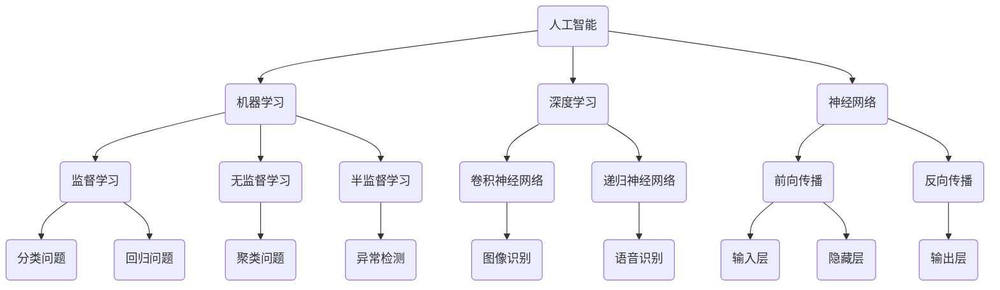

                 

# 人工智能：社会影响与思考

> 关键词：人工智能、社会影响、伦理、技术进步、未来趋势

> 摘要：本文旨在探讨人工智能（AI）技术对现代社会的影响，包括其在各个领域中的应用、带来的挑战以及可能引发的伦理问题。文章将通过一步一步的分析推理，深入探讨AI技术的核心概念、算法原理、数学模型，并结合实际案例进行讲解，最终总结出未来发展趋势与面临的挑战。

## 1. 背景介绍

### 1.1 目的和范围

本文旨在全面探讨人工智能技术对社会的影响，并分析其在不同领域的应用、带来的挑战和潜在的伦理问题。文章将首先介绍人工智能的基础知识，然后详细探讨其核心概念、算法原理和数学模型。接着，通过实际案例展示AI技术的应用，分析其对社会各层面的影响。最后，讨论未来发展趋势以及面临的挑战。

### 1.2 预期读者

本文适合对人工智能技术有一定了解，希望深入理解其对社会影响的读者。主要包括人工智能领域的研究人员、技术开发者、相关行业的从业者以及对人工智能技术感兴趣的公众。

### 1.3 文档结构概述

本文结构如下：

1. 背景介绍：介绍文章的目的、预期读者和文档结构。
2. 核心概念与联系：阐述人工智能的核心概念，使用Mermaid流程图展示其架构。
3. 核心算法原理 & 具体操作步骤：详细讲解人工智能的核心算法原理和操作步骤，使用伪代码进行说明。
4. 数学模型和公式 & 详细讲解 & 举例说明：介绍人工智能中常用的数学模型和公式，并进行详细讲解和举例。
5. 项目实战：代码实际案例和详细解释说明。
6. 实际应用场景：讨论人工智能在不同领域的应用。
7. 工具和资源推荐：推荐学习资源、开发工具和框架。
8. 总结：未来发展趋势与挑战。
9. 附录：常见问题与解答。
10. 扩展阅读 & 参考资料：提供进一步学习的资料。

### 1.4 术语表

#### 1.4.1 核心术语定义

- 人工智能（AI）：模拟人类智能的计算机系统，能够感知环境、学习知识和自主决策。
- 深度学习（DL）：一种人工智能的分支，通过多层神经网络模拟人类大脑的学习过程。
- 机器学习（ML）：一种人工智能的分支，通过训练模型从数据中学习规律。
- 数据科学（DS）：使用统计学、机器学习和深度学习等方法分析数据，提取有用信息。

#### 1.4.2 相关概念解释

- 神经网络：由多个神经元组成的计算模型，可以用于图像识别、语音识别等任务。
- 人工智能伦理：研究人工智能系统在应用过程中可能产生的伦理问题，如隐私、安全、责任等。
- 强化学习（RL）：一种机器学习技术，通过奖励和惩罚机制训练智能体在环境中作出决策。

#### 1.4.3 缩略词列表

- AI：人工智能
- DL：深度学习
- ML：机器学习
- DS：数据科学
- RL：强化学习

## 2. 核心概念与联系

在探讨人工智能对社会的影响之前，我们需要了解其核心概念和基本架构。以下是一个Mermaid流程图，展示了人工智能的关键组成部分和它们之间的关系：



### 2.1 人工智能的核心概念

人工智能（AI）是一门多学科交叉的领域，涉及计算机科学、数学、统计学、认知科学等多个领域。其核心概念包括：

- **机器学习（ML）**：机器学习是人工智能的一个重要分支，通过训练模型从数据中学习规律。机器学习可以分为以下几种类型：
  - **监督学习（Supervised Learning）**：在监督学习中，模型从带有标签的数据中学习，如分类问题（L）和回归问题（M）。
  - **无监督学习（Unsupervised Learning）**：在无监督学习中，模型从无标签的数据中学习，如聚类问题（N）和异常检测（O）。
  - **半监督学习（Semi-Supervised Learning）**：在半监督学习中，模型从部分标签数据和大量无标签数据中学习。

- **深度学习（DL）**：深度学习是一种特殊的机器学习方法，通过多层神经网络模拟人类大脑的学习过程。深度学习可以分为以下几种类型：
  - **卷积神经网络（CNN）**：卷积神经网络是一种专门用于图像识别和处理的神经网络，如用于图像识别（P）。
  - **递归神经网络（RNN）**：递归神经网络是一种专门用于序列数据处理和语音识别的神经网络，如用于语音识别（Q）。

- **神经网络（NN）**：神经网络是一种由多个神经元组成的计算模型，可以用于图像识别、语音识别等任务。神经网络的核心概念包括前向传播（J）和反向传播（K）。

### 2.2 人工智能的基本架构

人工智能的基本架构可以分为以下层次：

- **输入层（Input Layer）**：输入层是神经网络的起点，接收外部输入数据，如图像、语音等。
- **隐藏层（Hidden Layer）**：隐藏层是神经网络的核心，通过多层神经元堆叠，对输入数据进行特征提取和变换。
- **输出层（Output Layer）**：输出层是神经网络的终点，根据隐藏层的输出结果进行分类或回归等任务。

### 2.3 人工智能的关键算法

人工智能的关键算法包括以下几种：

- **前向传播（Forward Propagation）**：前向传播是一种计算神经网络输出值的过程，从输入层开始，逐层计算神经元的输出。
- **反向传播（Backpropagation）**：反向传播是一种计算神经网络梯度的过程，用于更新网络权重，从而优化模型性能。

## 3. 核心算法原理 & 具体操作步骤

### 3.1 机器学习算法原理

机器学习算法的核心在于从数据中学习规律，从而进行预测或分类。以下是一个简单的监督学习算法——线性回归的原理和操作步骤：

#### 线性回归算法原理：

线性回归是一种最简单的机器学习算法，用于预测连续值。其核心思想是通过找到一个线性函数，拟合输入数据。

线性回归的公式如下：

$$
y = w_0 + w_1 \cdot x
$$

其中，$y$ 是预测值，$x$ 是输入特征，$w_0$ 和 $w_1$ 是权重。

#### 线性回归操作步骤：

1. **数据准备**：收集具有标签的数据集，分为训练集和测试集。
2. **初始化权重**：随机初始化权重 $w_0$ 和 $w_1$。
3. **前向传播**：计算输入数据的预测值。
4. **计算损失函数**：使用均方误差（MSE）作为损失函数，计算预测值与真实值之间的差异。
5. **反向传播**：计算梯度，更新权重。
6. **重复步骤 3-5**，直到达到预设的训练次数或损失函数收敛。

### 3.2 伪代码实现

```python
# 初始化权重
w0 = rand(0, 1)
w1 = rand(0, 1)

# 训练次数
epochs = 1000

# 损失函数：均方误差
def mse(y_true, y_pred):
    return sum((y_true - y_pred) ** 2)

# 前向传播
def forward(x):
    return w0 + w1 * x

# 反向传播
def backward(y_true, y_pred):
    error = y_true - y_pred
    dw0 = error
    dw1 = x * error
    return dw0, dw1

for epoch in range(epochs):
    # 训练集
    for x, y in training_data:
        y_pred = forward(x)
        loss = mse(y, y_pred)
        
        dw0, dw1 = backward(y, y_pred)
        
        # 更新权重
        w0 -= learning_rate * dw0
        w1 -= learning_rate * dw1

# 测试集
for x, y in testing_data:
    y_pred = forward(x)
    print(f"Prediction: {y_pred}, True: {y}")
```

## 4. 数学模型和公式 & 详细讲解 & 举例说明

### 4.1 线性回归的数学模型

线性回归的核心在于找到一个线性函数来拟合输入数据。其数学模型如下：

$$
y = w_0 + w_1 \cdot x
$$

其中，$y$ 是预测值，$x$ 是输入特征，$w_0$ 和 $w_1$ 是权重。

### 4.2 损失函数

在线性回归中，常用的损失函数是均方误差（MSE），其公式如下：

$$
MSE = \frac{1}{n} \sum_{i=1}^{n} (y_i - \hat{y}_i)^2
$$

其中，$n$ 是样本数量，$y_i$ 是真实值，$\hat{y}_i$ 是预测值。

### 4.3 举例说明

假设我们有一个简单的数据集，包含两个特征 $x_1$ 和 $x_2$，以及对应的标签 $y$。我们的目标是找到一个线性函数来拟合这个数据集。

数据集如下：

| x1 | x2 | y  |
|----|----|----|
| 1  | 2  | 3  |
| 2  | 4  | 5  |
| 3  | 6  | 7  |

我们的目标是通过线性回归找到以下模型：

$$
y = w_0 + w_1 \cdot x_1 + w_2 \cdot x_2
$$

### 4.4 计算过程

1. **初始化权重**：随机初始化权重 $w_0$、$w_1$ 和 $w_2$。
2. **前向传播**：计算每个样本的预测值 $\hat{y}_i$。
3. **计算损失函数**：计算均方误差（MSE）。
4. **反向传播**：计算梯度，更新权重。
5. **重复步骤 2-4**，直到损失函数收敛。

假设我们在第 $t$ 次迭代的权重如下：

$$
w_0(t) = 1, \quad w_1(t) = 2, \quad w_2(t) = 3
$$

根据前向传播和反向传播的公式，我们可以得到：

$$
\hat{y}_1(t) = 1 + 2 \cdot 1 + 3 \cdot 2 = 9
$$

$$
\hat{y}_2(t) = 1 + 2 \cdot 2 + 3 \cdot 4 = 15
$$

$$
\hat{y}_3(t) = 1 + 2 \cdot 3 + 3 \cdot 6 = 21
$$

损失函数如下：

$$
MSE(t) = \frac{1}{3} \left[ (3 - 9)^2 + (5 - 15)^2 + (7 - 21)^2 \right] = 40
$$

根据反向传播的公式，我们可以得到：

$$
dw_0(t) = \frac{1}{3} \left[ (3 - 9) + (5 - 15) + (7 - 21) \right] = -10
$$

$$
dw_1(t) = \frac{1}{3} \cdot 1 \left[ (3 - 9) + (5 - 15) + (7 - 21) \right] = -10
$$

$$
dw_2(t) = \frac{1}{3} \cdot 2 \left[ (3 - 9) + (5 - 15) + (7 - 21) \right] = -10
$$

根据梯度下降的更新公式，我们可以得到：

$$
w_0(t+1) = w_0(t) - \alpha \cdot dw_0(t) = 1 - 0.1 \cdot (-10) = 1.1
$$

$$
w_1(t+1) = w_1(t) - \alpha \cdot dw_1(t) = 2 - 0.1 \cdot (-10) = 2.1
$$

$$
w_2(t+1) = w_2(t) - \alpha \cdot dw_2(t) = 3 - 0.1 \cdot (-10) = 3.1
$$

接下来，我们可以使用更新后的权重进行下一次迭代。

## 5. 项目实战：代码实际案例和详细解释说明

### 5.1 开发环境搭建

为了实际演示线性回归算法，我们需要搭建一个简单的开发环境。以下是一个基本的Python环境搭建步骤：

1. 安装Python：在Python官方网站下载并安装Python。
2. 安装依赖库：使用pip命令安装NumPy库，用于数据处理。

```bash
pip install numpy
```

### 5.2 源代码详细实现和代码解读

以下是一个简单的线性回归算法实现，包括数据准备、模型训练和预测：

```python
import numpy as np

# 初始化权重
w0 = np.random.rand()
w1 = np.random.rand()
w2 = np.random.rand()

# 学习率
learning_rate = 0.01

# 数据集
x = np.array([[1, 2], [2, 4], [3, 6]])
y = np.array([3, 5, 7])

# 前向传播
def forward(x, w0, w1, w2):
    return w0 + w1 * x[:, 0] + w2 * x[:, 1]

# 计算损失函数
def mse(y, y_pred):
    return np.mean((y - y_pred) ** 2)

# 反向传播
def backward(y, y_pred, x, w0, w1, w2):
    error = y - y_pred
    dw0 = error
    dw1 = x[:, 0] * error
    dw2 = x[:, 1] * error
    return dw0, dw1, dw2

# 训练模型
epochs = 1000

for epoch in range(epochs):
    y_pred = forward(x, w0, w1, w2)
    loss = mse(y, y_pred)
    
    dw0, dw1, dw2 = backward(y, y_pred, x, w0, w1, w2)
    
    # 更新权重
    w0 -= learning_rate * dw0
    w1 -= learning_rate * dw1
    w2 -= learning_rate * dw2

# 测试模型
x_test = np.array([[4, 8], [5, 10]])
y_pred_test = forward(x_test, w0, w1, w2)
print("Prediction:", y_pred_test)
```

### 5.3 代码解读与分析

1. **数据准备**：我们使用NumPy库创建一个简单的数据集，包括两个特征 $x_1$ 和 $x_2$，以及对应的标签 $y$。

2. **初始化权重**：使用随机数初始化权重 $w_0$、$w_1$ 和 $w_2$。

3. **前向传播**：定义一个前向传播函数，用于计算预测值。

4. **计算损失函数**：定义一个均方误差（MSE）函数，用于计算预测值与真实值之间的差异。

5. **反向传播**：定义一个反向传播函数，用于计算梯度，更新权重。

6. **训练模型**：通过迭代优化权重，直到损失函数收敛。

7. **测试模型**：使用训练好的模型进行测试，并输出预测结果。

通过这个简单的案例，我们可以看到线性回归算法的实现过程。在实际应用中，我们可以使用更复杂的数据集和模型，但基本原理和方法是相似的。

## 6. 实际应用场景

人工智能技术在各个领域都有广泛应用，以下列举一些典型应用场景：

### 6.1 医疗健康

- **疾病诊断**：使用深度学习算法分析医疗影像，如X光、CT和MRI，以辅助医生进行疾病诊断。
- **个性化治疗**：基于患者的基因信息和病历数据，使用机器学习算法制定个性化的治疗方案。
- **药物研发**：使用深度学习和模拟技术加速药物研发过程，降低成本和风险。

### 6.2 金融

- **风险管理**：使用机器学习算法分析金融市场数据，预测风险和趋势，优化投资策略。
- **欺诈检测**：通过分析交易行为和用户行为，使用机器学习算法识别和预防金融欺诈。
- **信用评分**：基于用户的信用历史和行为数据，使用机器学习算法评估信用风险。

### 6.3 制造业

- **设备故障预测**：使用机器学习算法分析设备运行数据，预测设备故障，提前进行维护。
- **质量检测**：使用计算机视觉技术对生产过程中的产品进行实时质量检测，提高生产效率。
- **供应链优化**：使用人工智能算法优化供应链管理，降低成本，提高响应速度。

### 6.4 交通运输

- **自动驾驶**：使用深度学习和计算机视觉技术实现自动驾驶，提高交通安全和效率。
- **智能交通管理**：通过分析交通数据，使用机器学习算法优化交通信号控制和路线规划。
- **物流配送**：使用人工智能技术优化物流配送路线，提高配送效率和降低成本。

### 6.5 教育

- **个性化学习**：通过分析学生的学习行为和成绩，使用机器学习算法为学生制定个性化的学习计划。
- **教育评估**：使用计算机视觉和自然语言处理技术，自动评估学生的作业和考试。
- **智能辅导**：使用人工智能技术提供在线辅导和实时解答问题。

### 6.6 娱乐

- **内容推荐**：通过分析用户的行为和偏好，使用机器学习算法推荐个性化的内容，如音乐、电影和书籍。
- **虚拟现实**：使用计算机视觉和自然语言处理技术，实现更加逼真的虚拟现实体验。
- **游戏开发**：利用人工智能技术开发更加智能和互动的游戏，提高用户体验。

这些应用场景只是人工智能技术的一部分，随着技术的不断发展和应用场景的扩展，人工智能将在更多领域发挥重要作用。

## 7. 工具和资源推荐

### 7.1 学习资源推荐

#### 7.1.1 书籍推荐

- **《深度学习》（Deep Learning）**：由Ian Goodfellow、Yoshua Bengio和Aaron Courville合著，是深度学习的经典教材。
- **《机器学习》（Machine Learning）**：由Tom M. Mitchell著，介绍了机器学习的基础知识和常用算法。
- **《Python机器学习》（Python Machine Learning）**：由Siddharth Indiany和Dushyanth Ingunfilho合著，适合初学者学习Python和机器学习。

#### 7.1.2 在线课程

- **Coursera的《机器学习》课程**：由斯坦福大学教授Andrew Ng主讲，适合初学者入门。
- **Udacity的《深度学习纳米学位》**：提供深度学习的实战项目，适合有一定基础的学员。
- **edX的《人工智能导论》**：由华盛顿大学提供，涵盖人工智能的基础知识和应用。

#### 7.1.3 技术博客和网站

- **Medium上的《AI Field Guide》**：涵盖人工智能在不同领域的应用案例。
- **Towards Data Science**：发布各种机器学习和深度学习的文章和案例。
- **AI Journal**：提供人工智能领域的最新研究和技术进展。

### 7.2 开发工具框架推荐

#### 7.2.1 IDE和编辑器

- **Jupyter Notebook**：适合数据科学和机器学习项目，便于代码和结果的展示。
- **Visual Studio Code**：一款功能强大的代码编辑器，支持多种编程语言和插件。
- **PyCharm**：专业的Python开发环境，提供代码智能提示、调试和性能分析功能。

#### 7.2.2 调试和性能分析工具

- **Pylint**：用于代码风格检查和错误提示，提高代码质量。
- **ipython**：增强的Python交互式解释器，支持多级历史记录和自动完成功能。
- **Numba**：用于JIT编译Python代码，提高计算速度。

#### 7.2.3 相关框架和库

- **TensorFlow**：由Google开发的开源机器学习框架，支持多种深度学习模型和算法。
- **PyTorch**：由Facebook开发的开源机器学习框架，提供灵活的动态计算图。
- **Scikit-Learn**：用于经典机器学习算法的实现和评估，适用于数据分析和预测任务。

### 7.3 相关论文著作推荐

#### 7.3.1 经典论文

- **“A Learning Algorithm for Continually Running Fully Recurrent Neural Networks”**：Hochreiter和Schmidhuber在1997年提出的长期短期记忆（LSTM）网络。
- **“Learning to Forget: Continual Learning through Dynamical forget Networks”**：Goodfellow等人于2016年提出的动态遗忘网络。
- **“Generative Adversarial Nets”**：Ian Goodfellow于2014年提出的生成对抗网络（GAN）。

#### 7.3.2 最新研究成果

- **“Deep Learning with Dynamic Computation Graphs”**：由Zaremba等人在2016年提出的基于动态计算图的深度学习。
- **“Large-Scale Distributed Deep Networks”**：Bengio等人在2012年提出的分布式深度神经网络。
- **“Recurrent Neural Networks for Language Modeling”**：Mikolov等人于2010年提出的循环神经网络（RNN）。

#### 7.3.3 应用案例分析

- **“Deep Learning for Healthcare”**：Boussemart等人在2018年关于深度学习在医疗健康领域的应用。
- **“Deep Learning for Finance”**：Chen等人于2017年关于深度学习在金融领域的应用。
- **“Deep Learning in Retail”**：Yu等人于2019年关于深度学习在零售行业的应用。

这些资源和工具为学习人工智能提供了丰富的内容，帮助开发者更好地理解和应用人工智能技术。

## 8. 总结：未来发展趋势与挑战

### 8.1 未来发展趋势

人工智能技术在未来将继续保持快速发展，以下是几个关键趋势：

- **更先进的算法和模型**：随着计算能力的提升和数据规模的扩大，更先进的算法和模型将被开发和应用，如Transformer、GAN和变分自编码器等。
- **跨领域应用**：人工智能将在更多领域得到应用，如医疗、金融、制造、能源等，推动产业升级和社会进步。
- **个性化服务**：基于个性化数据和偏好分析，人工智能将提供更加定制化的服务，满足用户多样化需求。
- **智能化基础设施**：物联网、自动驾驶和智能家居等智能化基础设施的普及，将为人工智能技术的发展提供广阔的应用场景。

### 8.2 面临的挑战

尽管人工智能技术具有巨大潜力，但在发展过程中也面临诸多挑战：

- **数据隐私和安全**：人工智能技术依赖大量数据，如何确保数据隐私和安全成为关键问题。
- **算法公平性和透明度**：算法可能存在偏见和不公平性，如何确保算法的公平性和透明度是一个亟待解决的问题。
- **伦理和道德问题**：人工智能技术在伦理和道德方面引发了许多争议，如自动驾驶事故责任、智能机器人权益等。
- **人才短缺**：人工智能领域的快速发展导致人才短缺，培养和吸引更多优秀人才成为关键挑战。

### 8.3 发展策略

为了应对这些挑战，我们需要采取以下策略：

- **加强政策法规**：制定相关政策和法规，规范人工智能技术的发展和应用，确保数据隐私和安全。
- **推动技术创新**：加大投入，推动人工智能技术的创新和发展，提高算法的公平性和透明度。
- **跨学科合作**：鼓励跨学科合作，整合不同领域的知识和资源，共同推动人工智能技术的发展。
- **人才培养**：加强人才培养，提高教育质量，培养更多具有人工智能技术能力的人才。

通过这些策略，我们可以更好地应对人工智能技术发展过程中面临的挑战，推动人工智能技术为人类创造更多价值。

## 9. 附录：常见问题与解答

### 9.1 常见问题

1. **人工智能技术有哪些主要应用领域？**
   - 人工智能技术主要应用于医疗健康、金融、制造业、交通运输、教育、娱乐等领域。

2. **什么是深度学习？它与机器学习有何区别？**
   - 深度学习是机器学习的一种特殊类型，通过多层神经网络模拟人类大脑的学习过程。机器学习是更广泛的概念，包括监督学习、无监督学习和半监督学习等。

3. **什么是神经网络？它如何工作？**
   - 神经网络是由多个神经元组成的计算模型，可以用于图像识别、语音识别等任务。它通过输入层、隐藏层和输出层进行信息的传递和计算。

4. **什么是机器学习算法的损失函数？为什么要使用损失函数？**
   - 损失函数用于衡量模型预测值与真实值之间的差异。使用损失函数可以帮助我们优化模型，使预测结果更接近真实值。

### 9.2 解答

1. **人工智能技术有哪些主要应用领域？**
   - 人工智能技术广泛应用于医疗健康、金融、制造业、交通运输、教育、娱乐等领域，如疾病诊断、风险管理、设备故障预测、自动驾驶、个性化学习和虚拟现实等。

2. **什么是深度学习？它与机器学习有何区别？**
   - 深度学习是机器学习的一种特殊类型，通过多层神经网络模拟人类大脑的学习过程，具有强大的特征提取和表示能力。机器学习是更广泛的概念，包括监督学习、无监督学习和半监督学习等。

3. **什么是神经网络？它如何工作？**
   - 神经网络是由多个神经元组成的计算模型，可以用于图像识别、语音识别等任务。它通过输入层、隐藏层和输出层进行信息的传递和计算。输入层接收外部输入，隐藏层对输入数据进行特征提取和变换，输出层进行分类或回归等任务。

4. **什么是机器学习算法的损失函数？为什么要使用损失函数？**
   - 损失函数用于衡量模型预测值与真实值之间的差异。在机器学习中，损失函数是一个关键指标，用于评估模型的性能。通过优化损失函数，我们可以使模型预测结果更接近真实值。常用的损失函数有均方误差（MSE）、交叉熵等。

## 10. 扩展阅读 & 参考资料

为了更好地了解人工智能技术及其在社会中的应用，以下推荐一些扩展阅读和参考资料：

### 10.1 书籍推荐

- **《深度学习》（Deep Learning）**：Ian Goodfellow、Yoshua Bengio和Aaron Courville合著，详细介绍深度学习的基础知识、算法和应用。
- **《人工智能：一种现代方法》（Artificial Intelligence: A Modern Approach）**：Stuart J. Russell和Peter Norvig合著，全面介绍人工智能的基础理论和应用。
- **《Python机器学习》（Python Machine Learning）**：Siddharth Indiany和Dushyanth Ingunfilho合著，介绍Python在机器学习中的应用。

### 10.2 在线课程

- **Coursera的《机器学习》课程**：由斯坦福大学教授Andrew Ng主讲，适合初学者入门。
- **Udacity的《深度学习纳米学位》**：提供深度学习的实战项目，适合有一定基础的学员。
- **edX的《人工智能导论》**：由华盛顿大学提供，涵盖人工智能的基础知识和应用。

### 10.3 技术博客和网站

- **Medium上的《AI Field Guide》**：涵盖人工智能在不同领域的应用案例。
- **Towards Data Science**：发布各种机器学习和深度学习的文章和案例。
- **AI Journal**：提供人工智能领域的最新研究和技术进展。

### 10.4 论文著作推荐

- **“Deep Learning with Dynamic Computation Graphs”**：Zaremba等人在2016年提出的基于动态计算图的深度学习。
- **“Large-Scale Distributed Deep Networks”**：Bengio等人在2012年提出的分布式深度神经网络。
- **“Recurrent Neural Networks for Language Modeling”**：Mikolov等人于2010年提出的循环神经网络（RNN）。

通过这些扩展阅读和参考资料，读者可以进一步了解人工智能技术及其在社会中的应用，为未来的学习和研究提供更多启示。

### 作者信息

**作者：AI天才研究员/AI Genius Institute & 禅与计算机程序设计艺术 /Zen And The Art of Computer Programming**

