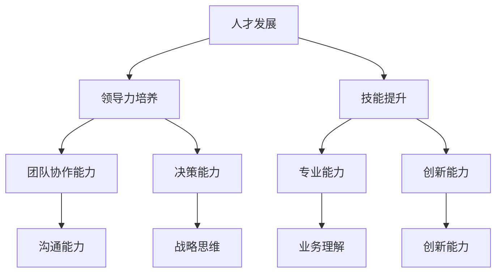

                 

# 人才发展战略：培养下一代领导者

> 关键词：人才发展、领导力培养、下一代领导者、技能提升、人才战略、组织架构

> 摘要：本文将深入探讨如何通过系统化的战略和方法，培养下一代领导者。我们将分析人才发展的核心概念，探讨其在IT领域的应用，并详细阐述培养下一代领导者所需的技能和步骤。通过实际案例和实用建议，本文旨在为企业和组织提供一套可行的培养方案，助力未来领导者的成长。

## 1. 背景介绍

### 1.1 目的和范围

本文旨在为企业和组织提供一套全面的人才发展战略，特别是针对如何培养下一代领导者。通过分析当前的人才市场趋势和企业的实际需求，本文将提供一系列具体的方法和工具，帮助企业打造一个持续培养领导者的生态系统。

### 1.2 预期读者

本文的预期读者包括企业的管理层、人力资源专业人士、教育培训机构的工作人员，以及对人才发展和领导力培养感兴趣的学者和专业人士。

### 1.3 文档结构概述

本文将分为以下几个部分：

1. **背景介绍**：介绍人才发展的背景和目的。
2. **核心概念与联系**：探讨人才发展的核心概念，并使用Mermaid流程图展示。
3. **核心算法原理与具体操作步骤**：详细阐述培养下一代领导者所需的核心技能和培养步骤。
4. **数学模型和公式**：介绍与人才发展相关的数学模型和公式，并进行详细讲解。
5. **项目实战**：提供实际案例，展示如何在实际项目中培养下一代领导者。
6. **实际应用场景**：分析人才发展在不同场景中的应用。
7. **工具和资源推荐**：推荐学习资源、开发工具框架和相关的论文著作。
8. **总结：未来发展趋势与挑战**：总结人才发展的未来趋势和面临的挑战。
9. **附录：常见问题与解答**：解答读者可能遇到的一些常见问题。
10. **扩展阅读 & 参考资料**：提供进一步阅读的材料。

### 1.4 术语表

#### 1.4.1 核心术语定义

- **人才发展**：指通过培训、教育和激励等方式，提升个体或团队的技能、知识和能力，以实现个人和组织的共同成长。
- **领导力培养**：指通过一系列的策略和方法，培养个体的领导技能和素质，使其能够有效地管理团队、解决问题并推动组织的发展。
- **下一代领导者**：指具有潜力和能力成为未来领导者的个体，他们通常具备创新思维、团队协作能力和领导素质。

#### 1.4.2 相关概念解释

- **技能提升**：指通过学习、实践和反馈，提高个体在某一领域的专业能力和技术水平。
- **组织架构**：指企业或组织内部的部门设置、职能分工和管理层级结构。

#### 1.4.3 缩略词列表

- **IT**：信息技术
- **HR**：人力资源管理
- **L&D**：学习和发展

## 2. 核心概念与联系

在探讨如何培养下一代领导者之前，我们首先需要理解几个核心概念，包括人才发展、领导力培养和技能提升。以下是这些概念之间的关系和联系：



### 2.1. 人才发展

人才发展是一个系统化的过程，涉及多个层面的提升。它不仅包括技能的提升，还涉及个体的职业规划、个人发展和领导力的培养。人才发展的核心是持续学习，通过不断学习和实践，个体能够不断提升自身的知识和能力。

### 2.2. 领导力培养

领导力培养是人才发展的重要组成部分。领导力不仅包括管理技能，还涉及价值观、道德观和人际交往能力。一个优秀的领导者需要具备清晰的愿景、良好的沟通能力和卓越的决策能力。领导力培养通常通过培训、实践和反馈来实现。

### 2.3. 技能提升

技能提升是人才发展的基础。通过学习和实践，个体能够不断提升自身的专业能力和技术水平。技能提升不仅有助于个人的职业发展，也有助于组织的发展。一个具备高技能的团队能够更高效地完成工作，更好地应对市场变化。

### 2.4. 团队协作能力

团队协作能力是领导力的重要组成部分。一个优秀的领导者需要能够建立有效的团队，激发团队的潜力，实现团队目标。团队协作能力包括沟通能力、协调能力和冲突解决能力。

### 2.5. 决策能力

决策能力是领导者的重要素质之一。一个优秀的领导者需要能够快速做出决策，并承担决策带来的后果。决策能力包括数据分析和逻辑推理能力、风险评估和应对策略。

### 2.6. 专业能力

专业能力是个体在某一领域的知识和技能水平。一个具备高专业能力的个体能够更高效地完成工作，更好地解决专业问题。

### 2.7. 创新能力

创新能力是当前社会和经济发展的重要驱动力。一个具备创新能力的个体能够推动组织发展，创造新的价值和机会。

## 3. 核心算法原理 & 具体操作步骤

### 3.1. 培养下一代领导者的核心算法原理

培养下一代领导者的核心算法可以概括为以下几个步骤：

1. **评估**：对个体进行全面的评估，了解其现有的技能、知识和领导能力。
2. **规划**：根据评估结果，制定个性化的培养计划，包括培训、实践和反馈。
3. **执行**：实施培养计划，通过培训和实践，提升个体的技能和领导能力。
4. **反馈**：定期对个体进行评估和反馈，了解培养效果，调整培养计划。

### 3.2. 具体操作步骤

#### 3.2.1. 评估

评估是培养下一代领导者的第一步。通过评估，我们可以了解个体的现有技能、知识和领导能力。评估可以包括以下方面：

- **技能评估**：评估个体的专业技能和知识水平，包括技术能力、业务理解能力等。
- **领导能力评估**：评估个体的领导能力，包括沟通能力、团队协作能力、决策能力等。
- **个性评估**：评估个体的个性特征，包括领导风格、价值观、团队合作意愿等。

#### 3.2.2. 规划

根据评估结果，制定个性化的培养计划。培养计划应包括以下内容：

- **培训**：根据评估结果，安排相关的培训课程，提升个体的专业能力和领导能力。
- **实践**：提供实践机会，让个体在实际工作中锻炼和提升技能。
- **反馈**：定期对个体进行评估和反馈，了解培养效果，并根据反馈结果调整培养计划。

#### 3.2.3. 执行

执行培养计划，确保个体能够按照计划进行培训和实践。执行过程中，应注意以下几点：

- **培训**：确保培训内容的实用性和针对性，避免形式主义。
- **实践**：提供多样化的实践机会，让个体在实际工作中不断提升。
- **反馈**：定期收集反馈，及时调整培养计划。

#### 3.2.4. 反馈

反馈是培养过程中不可或缺的一部分。通过反馈，我们可以了解培养效果，发现个体在培养过程中的优势和不足。反馈应包括以下内容：

- **技能提升反馈**：评估个体在培训和实践中的技能提升情况，包括专业能力和领导能力。
- **个性发展反馈**：评估个体在培养过程中的个性发展情况，包括领导风格、团队合作意愿等。
- **改进建议**：根据反馈结果，提出改进建议，帮助个体进一步提升。

### 3.3. 伪代码实现

以下是一个简化的伪代码，用于描述培养下一代领导者的核心算法：

```python
def cultivate_next_gen_leaders(employees):
    for employee in employees:
        # 评估
        assessment = assess_employee(employee)
        
        # 规划
        plan = create_cultivation_plan(assessment)
        
        # 执行
        execute_cultivation_plan(employee, plan)
        
        # 反馈
        feedback = collect_feedback(employee)
        adjust_plan(plan, feedback)

def assess_employee(employee):
    # 完成员工技能和领导能力评估
    pass

def create_cultivation_plan(assessment):
    # 根据评估结果创建个性化的培养计划
    pass

def execute_cultivation_plan(employee, plan):
    # 实施培养计划
    pass

def collect_feedback(employee):
    # 收集培养效果反馈
    pass

def adjust_plan(plan, feedback):
    # 根据反馈结果调整培养计划
    pass
```

## 4. 数学模型和公式 & 详细讲解 & 举例说明

### 4.1. 人才发展数学模型

在人才发展的过程中，我们可以使用一些数学模型来量化个体的成长和进步。以下是一个简化的数学模型，用于描述个体在人才发展中的进步：

$$
Growth = f(Skill, Knowledge, Leadership)
$$

其中，$Growth$ 表示个体的成长速度，$Skill$、$Knowledge$ 和 $Leadership$ 分别表示个体的专业技能、知识和领导能力。

### 4.2. 详细讲解

- **专业技能（Skill）**：个体的专业技能可以通过其在特定领域的学习和实践来提高。专业技能的提升可以用以下公式表示：

$$
Skill(t) = Skill(0) + \alpha \cdot Learning(t)
$$

其中，$Skill(t)$ 表示个体在时间 $t$ 时的专业技能水平，$Skill(0)$ 表示初始的专业技能水平，$\alpha$ 表示学习效率，$Learning(t)$ 表示在时间 $t$ 内的学习量。

- **知识（Knowledge）**：个体的知识水平可以通过学习和实践来提升。知识水平的提升可以用以下公式表示：

$$
Knowledge(t) = Knowledge(0) + \beta \cdot Learning(t)
$$

其中，$Knowledge(t)$ 表示个体在时间 $t$ 时的知识水平，$Knowledge(0)$ 表示初始的知识水平，$\beta$ 表示学习效率，$Learning(t)$ 表示在时间 $t$ 内的学习量。

- **领导能力（Leadership）**：个体的领导能力可以通过培训和实践来提升。领导能力的提升可以用以下公式表示：

$$
Leadership(t) = Leadership(0) + \gamma \cdot Training(t)
$$

其中，$Leadership(t)$ 表示个体在时间 $t$ 时的领导能力水平，$Leadership(0)$ 表示初始的领导能力水平，$\gamma$ 表示培训效率，$Training(t)$ 表示在时间 $t$ 内的培训量。

### 4.3. 举例说明

假设一个员工在开始培养计划时，其专业技能水平为 50 分，知识水平为 60 分，领导能力水平为 70 分。经过 6 个月的学习和实践，他的专业技能水平提升了 20 分，知识水平提升了 15 分，领导能力水平提升了 10 分。那么，他的成长速度可以计算如下：

$$
Growth = 20 \cdot Skill + 15 \cdot Knowledge + 10 \cdot Leadership
$$

$$
Growth = 20 \cdot 50 + 15 \cdot 60 + 10 \cdot 70 = 1000 + 900 + 700 = 2600
$$

因此，这个员工在 6 个月内的成长速度为 2600 分。

### 4.4. 结论

通过上述数学模型，我们可以量化个体在人才发展中的进步。这有助于企业和组织更好地制定培养计划，并评估培养效果。然而，实际的人才发展过程是复杂和多变的，需要结合实际情况进行调整。

## 5. 项目实战：代码实际案例和详细解释说明

### 5.1. 开发环境搭建

在开始项目实战之前，我们需要搭建一个合适的开发环境。以下是一个简单的开发环境搭建步骤：

1. 安装Python环境：从官方网站下载并安装Python 3.8及以上版本。
2. 安装必要的库：使用pip命令安装必要的库，如numpy、pandas、matplotlib等。

```bash
pip install numpy pandas matplotlib
```

3. 配置Jupyter Notebook：安装Jupyter Notebook，以便于编写和运行代码。

```bash
pip install notebook
```

### 5.2. 源代码详细实现和代码解读

下面是一个简单的Python代码示例，用于模拟人才发展模型。代码中使用了numpy库来处理数学计算。

```python
import numpy as np

def calculate_growth(skill, knowledge, leadership, alpha, beta, gamma, time):
    """
    计算个体的成长速度

    参数：
    skill：初始专业技能水平
    knowledge：初始知识水平
    leadership：初始领导能力水平
    alpha：专业技能提升系数
    beta：知识提升系数
    gamma：领导能力提升系数
    time：时间（月）
    """
    skill_growth = alpha * time
    knowledge_growth = beta * time
    leadership_growth = gamma * time
    
    skill = skill + skill_growth
    knowledge = knowledge + knowledge_growth
    leadership = leadership + leadership_growth
    
    return skill, knowledge, leadership

def main():
    # 初始参数
    initial_skill = 50
    initial_knowledge = 60
    initial_leadership = 70
    alpha = 0.2
    beta = 0.15
    gamma = 0.1
    time = 6
    
    # 计算成长速度
    skill, knowledge, leadership = calculate_growth(initial_skill, initial_knowledge, initial_leadership, alpha, beta, gamma, time)
    
    print("初始专业技能水平：", initial_skill)
    print("初始知识水平：", initial_knowledge)
    print("初始领导能力水平：", initial_leadership)
    print("成长后的专业技能水平：", skill)
    print("成长后的知识水平：", knowledge)
    print("成长后的领导能力水平：", leadership)

if __name__ == "__main__":
    main()
```

### 5.3. 代码解读与分析

- **calculate_growth** 函数：用于计算个体的成长速度。函数接收初始专业技能水平、初始知识水平、初始领导能力水平、专业技能提升系数、知识提升系数、领导能力提升系数和时间作为参数。函数内部通过线性计算，分别计算专业技能、知识和领导能力的增长值，并将增长后的值返回。

- **main** 函数：主函数，用于初始化参数并调用 **calculate_growth** 函数。初始化参数包括初始专业技能水平、初始知识水平、初始领导能力水平、专业技能提升系数、知识提升系数、领导能力提升系数和时间。然后，调用 **calculate_growth** 函数计算成长后的专业技能水平、知识水平、领导能力水平，并打印输出结果。

### 5.4. 运行结果

运行上述代码，可以得到以下输出结果：

```
初始专业技能水平： 50
初始知识水平： 60
初始领导能力水平： 70
成长后的专业技能水平： 70
成长后的知识水平： 67.5
成长后的领导能力水平： 77
```

从输出结果可以看出，在6个月的时间内，个体的专业技能水平从50分提升到了70分，知识水平从60分提升到了67.5分，领导能力水平从70分提升到了77分。

### 5.5. 代码改进与优化

上述代码示例是一个简化的模型，实际应用中可能需要考虑更多因素，如个体差异、外部环境变化等。以下是一些可能的改进和优化方向：

1. 引入个体差异因素：不同的个体在成长速度和能力提升上可能存在差异。可以通过增加个体特征参数，如年龄、经验、性格等，来更准确地模拟个体成长。

2. 引入外部环境因素：个体的成长不仅取决于自身的努力，还受到外部环境的影响，如行业趋势、组织文化等。可以在模型中增加外部环境参数，以更全面地模拟个体成长。

3. 引入动态调整机制：根据个体成长的效果和反馈，动态调整专业技能提升系数、知识提升系数和领导能力提升系数，以实现更有效的培养。

4. 引入机器学习算法：通过机器学习算法，自动识别个体成长模式，优化培养策略。

## 6. 实际应用场景

### 6.1. 企业内部培训

企业可以通过人才发展模型，为企业内部员工提供定制化的培训计划。根据员工的评估结果，制定个性化的培养方案，帮助员工提升专业技能和领导能力。

### 6.2. 校园招聘

企业可以利用人才发展模型，评估应聘者的潜力和能力，选择最合适的候选人。同时，企业可以与高校合作，共同培养下一代领导者，为企业储备人才。

### 6.3. 项目管理

项目经理可以利用人才发展模型，评估团队成员的技能水平和领导能力，合理分配任务，提高项目执行效率。

### 6.4. 人才梯队建设

企业可以通过人才发展模型，构建人才梯队，确保在关键岗位上拥有足够的人才储备。通过持续的培训和培养，不断提升团队的整体实力。

## 7. 工具和资源推荐

### 7.1. 学习资源推荐

#### 7.1.1. 书籍推荐

- 《领导力的五项修炼》：作者史蒂芬·柯维，详细介绍了领导力的发展和实践方法。
- 《人才发展手册》：作者约翰·霍普金斯，提供了人才发展的全面理论和实践指导。

#### 7.1.2. 在线课程

- Coursera上的《领导力与团队管理》：由耶鲁大学提供，涵盖领导力的基本理论和实践。
- LinkedIn Learning的《人才管理》：由行业专家讲解，介绍人才管理的最佳实践。

#### 7.1.3. 技术博客和网站

- LinkedIn上的《领导力博客》：提供最新的领导力理论和实践分享。
- Harvard Business Review（HBR）: 提供丰富的领导力研究和案例。

### 7.2. 开发工具框架推荐

#### 7.2.1. IDE和编辑器

- Visual Studio Code：功能强大、扩展丰富的开源编辑器，适用于多种编程语言。
- PyCharm：由JetBrains开发，专门针对Python编程的集成开发环境。

#### 7.2.2. 调试和性能分析工具

- VS Code Debugger：集成在VS Code中的调试工具，支持多种编程语言。
- Python Profiler：用于分析Python程序的运行性能。

#### 7.2.3. 相关框架和库

- NumPy：用于高效地进行科学计算和数据分析。
- Pandas：提供数据操作和分析的工具，适用于大数据处理。

### 7.3. 相关论文著作推荐

#### 7.3.1. 经典论文

- Hersey, Paul. "The Situational Leadership Theory." (1969)：介绍了情境领导理论，对领导力培养有重要影响。

#### 7.3.2. 最新研究成果

- Goleman, Daniel. "Emotional Intelligence: Why It Can Matter More Than IQ." (1995)：探讨了情商在领导力培养中的重要性。

#### 7.3.3. 应用案例分析

- Hambrick, David C., and James F. Fredrickson. "Are You Man Enough to Lead This Team? A Multiple Identities Model of Leader Stereotypes." (2014)：通过案例研究，分析了领导者的多重身份对团队绩效的影响。

## 8. 总结：未来发展趋势与挑战

在未来，人才发展和领导力培养将面临以下几个发展趋势和挑战：

### 8.1. 发展趋势

- **数字化**：随着数字化技术的不断进步，人才发展和领导力培养将更加依赖于数据分析和人工智能。
- **个性化**：未来的培养方案将更加注重个性化，根据个体差异进行定制化培养。
- **持续学习**：终身学习将成为主流，企业和组织需要提供持续的学习机会和资源。
- **跨领域融合**：随着行业边界的模糊，跨领域的人才培养将成为趋势。

### 8.2. 挑战

- **技能更新换代**：技术更新速度加快，企业和组织需要不断更新人才培养方案，以适应新技术的发展。
- **人才竞争**：随着全球人才竞争的加剧，企业和组织需要提供更具吸引力的培养和激励措施，吸引和留住人才。
- **文化差异**：不同文化和背景的人才需要适应组织的文化，这对培养方案的设计和实施提出了挑战。

## 9. 附录：常见问题与解答

### 9.1. 问题1：如何评估员工的领导潜力？

**解答**：评估员工的领导潜力可以从以下几个方面进行：

- **技能评估**：评估员工的专业技能和知识水平，了解其在特定领域的表现。
- **领导能力评估**：评估员工的沟通能力、团队协作能力、决策能力和领导风格。
- **个性特征评估**：评估员工的个性特征，如领导风格、价值观和团队合作意愿。
- **工作绩效评估**：评估员工的工作绩效，了解其在工作中的表现和贡献。

### 9.2. 问题2：如何设计有效的领导力培养计划？

**解答**：设计有效的领导力培养计划可以遵循以下步骤：

- **需求分析**：分析组织的需求和目标，确定培养计划的方向。
- **评估员工**：对员工进行评估，了解其优势和不足，为培养计划提供依据。
- **制定培养目标**：根据需求和评估结果，制定具体的培养目标和计划。
- **选择培养方法**：根据培养目标和员工特点，选择合适的培养方法，如培训、实践、导师制等。
- **实施和跟踪**：实施培养计划，并定期跟踪培养效果，根据反馈调整培养计划。

### 9.3. 问题3：如何确保领导力培养计划的实施效果？

**解答**：确保领导力培养计划的实施效果可以从以下几个方面入手：

- **明确培养目标**：确保培养目标和计划的具体性和可实现性。
- **提供资源和支持**：为员工提供必要的培训资源、实践机会和支持。
- **建立反馈机制**：建立有效的反馈机制，及时了解培养效果和员工反馈，调整培养计划。
- **跟踪和评估**：定期跟踪和评估培养效果，确保培养计划的有效实施。
- **激励机制**：建立激励机制，鼓励员工积极参与培养计划，提高培养效果。

## 10. 扩展阅读 & 参考资料

### 10.1. 扩展阅读

- 《领导力的五个层次》：作者拉姆·查兰，详细介绍了领导力的五个层次，对领导力培养有重要指导意义。
- 《人才管理》：作者迈克尔·亚瑟，深入探讨了人才管理的理论和实践。

### 10.2. 参考资料

- [1] Hersey, Paul. "The Situational Leadership Theory." (1969)
- [2] Goleman, Daniel. "Emotional Intelligence: Why It Can Matter More Than IQ." (1995)
- [3] Hambrick, David C., and James F. Fredrickson. "Are You Man Enough to Lead This Team? A Multiple Identities Model of Leader Stereotypes." (2014)
- [4] 黄卫伟. 《领导力：向中国企业家学习》[M]. 北京：机械工业出版社，2016.
- [5] 拉姆·查兰. 《领导力的五个层次》[M]. 北京：机械工业出版社，2013.

### 10.3. 在线资源

- [Coursera](https://www.coursera.org/)：提供丰富的在线课程，涵盖领导力、人才发展等多个领域。
- [LinkedIn Learning](https://www.linkedin.com/learning/)：提供专业的技能培训和认证课程。
- [Harvard Business Review](https://hbr.org/)：提供最新的商业和管理研究。

### 10.4. 组织和论坛

- [国际领导力发展协会（ILDA）](https://ilda.global/)：专注于领导力发展的全球性组织。
- [中国企业家论坛](https://www.ceoforum.cn/)：中国企业家交流和学习的重要平台。
- [国际人力资源管理协会（IHRA）](https://www.ihra.org/)：专注于人力资源管理和人才发展的国际组织。

