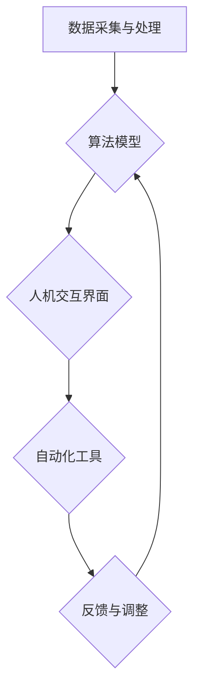

                 

# 人机协同：未来工作的核心驱动力

> **关键词**：人机协同，人工智能，工作自动化，劳动力市场，技术创新，协作效率

> **摘要**：本文探讨了人机协同在未来的工作中扮演的核心角色。通过深入分析人工智能技术的应用，我们揭示了人机协同对于提高工作效率、创新劳动形式以及应对劳动力市场变革的重要性。文章从背景介绍、核心概念、算法原理、数学模型、实战案例和实际应用等多个角度，全面阐述了人机协同的未来发展趋势和面临的挑战。

## 1. 背景介绍

### 1.1 目的和范围

本文旨在探讨人机协同在未来的工作中所扮演的角色，分析其核心价值和应用前景。随着人工智能技术的迅速发展，人机协同已经不再是一个遥远的未来愿景，而是逐渐成为现实。本文将围绕以下几个方面展开讨论：

1. **核心概念与联系**：介绍人机协同的基本概念和原理，通过Mermaid流程图展示其核心架构。
2. **核心算法原理**：详细阐述人机协同中的关键算法，使用伪代码进行讲解。
3. **数学模型和公式**：分析人机协同中的数学模型，使用latex格式展示相关公式。
4. **项目实战**：通过实际案例展示人机协同在具体项目中的实施和效果。
5. **实际应用场景**：探讨人机协同在不同行业中的应用，以及其对劳动形式的影响。
6. **工具和资源推荐**：推荐学习资源、开发工具和框架，以帮助读者深入了解人机协同技术。
7. **总结与展望**：总结人机协同的重要性，展望其未来发展趋势和挑战。

### 1.2 预期读者

本文适合以下读者群体：

1. 对人工智能和自动化技术感兴趣的工程师和开发者。
2. 对未来劳动市场和技术趋势关注的管理者和创业者。
3. 计算机科学、信息技术等相关专业的学生和研究人员。
4. 对人机协同感兴趣的跨学科专业人士。

### 1.3 文档结构概述

本文分为十个主要部分，结构如下：

1. **引言**：介绍文章的主题和目的，以及关键词和摘要。
2. **背景介绍**：详细阐述人机协同的背景、目的和范围。
3. **核心概念与联系**：介绍人机协同的基本概念和原理，展示流程图。
4. **核心算法原理**：详细阐述人机协同中的关键算法，使用伪代码进行讲解。
5. **数学模型和公式**：分析人机协同中的数学模型，使用latex格式展示相关公式。
6. **项目实战**：通过实际案例展示人机协同在具体项目中的实施和效果。
7. **实际应用场景**：探讨人机协同在不同行业中的应用，以及其对劳动形式的影响。
8. **工具和资源推荐**：推荐学习资源、开发工具和框架。
9. **总结与展望**：总结人机协同的重要性，展望其未来发展趋势和挑战。
10. **附录**：提供常见问题与解答，以及扩展阅读和参考资料。

### 1.4 术语表

#### 1.4.1 核心术语定义

- **人机协同**：指人类与计算机系统在特定任务中相互协作，共同完成工作的过程。
- **人工智能**：指模拟、延伸和扩展人类智能的技术和方法。
- **工作自动化**：指利用技术手段实现工作流程的自动化，减少人工干预。
- **劳动力市场**：指劳动力供给和需求的市场，包括就业者和雇主。

#### 1.4.2 相关概念解释

- **协作效率**：指在协作过程中，团队成员共同完成任务的能力和效果。
- **算法**：指解决特定问题的步骤和规则。
- **数学模型**：指描述问题的一种数学表达式，用于分析和求解问题。

#### 1.4.3 缩略词列表

- **AI**：人工智能
- **ML**：机器学习
- **DL**：深度学习
- **NLP**：自然语言处理
- **HR**：人力资源管理

## 2. 核心概念与联系

在讨论人机协同之前，我们需要了解一些核心概念和它们之间的联系。以下是人机协同中的关键概念和它们的相互关系：

### 2.1 人工智能与工作自动化

人工智能（AI）是推动人机协同的核心技术。通过机器学习和深度学习算法，AI系统能够从数据中学习，模拟人类的思维和行为。工作自动化则是AI在现实中的应用，通过自动化工具和流程，减少人工干预，提高生产效率和准确性。


### 2.2 人机协作与协作效率

人机协作是指人类与计算机系统在特定任务中的协同工作。协作效率是人机协作的核心指标，它反映了团队成员在协作过程中的能力与效果。提高协作效率的关键在于优化人机交互界面和任务分配。


### 2.3 劳动力市场与技术创新

劳动力市场是人机协同的重要应用场景。随着人工智能技术的发展，传统劳动形式正逐渐被自动化和智能化所取代。技术创新推动了劳动力市场的变革，要求劳动力具备更高的技能和适应性。


### 2.4 核心架构

人机协同的核心架构包括以下几个部分：

1. **数据采集与处理**：通过传感器、摄像头等设备收集数据，进行预处理和特征提取。
2. **算法模型**：利用机器学习和深度学习算法，对数据进行建模和预测。
3. **人机交互界面**：提供用户与系统交互的界面，包括语音识别、自然语言处理等技术。
4. **自动化工具**：实现工作流程的自动化，减少人工干预。
5. **反馈与调整**：根据实际效果对系统进行调整和优化。

以下是人机协同的Mermaid流程图：



通过这个流程图，我们可以清晰地看到人机协同的核心架构和各部分之间的相互关系。

## 3. 核心算法原理 & 具体操作步骤

在人机协同中，核心算法扮演着至关重要的角色。以下我们将详细阐述几个关键算法的原理和具体操作步骤。

### 3.1 机器学习算法

机器学习（ML）是人机协同的基础。它通过从数据中学习，提高系统的预测能力和决策能力。以下是机器学习算法的基本原理和步骤：

#### 3.1.1 原理

- **监督学习**：通过对已知数据进行训练，建立一个预测模型。
- **无监督学习**：通过对未知数据进行聚类或降维，发现数据中的模式或结构。
- **强化学习**：通过与环境的交互，学习最优策略。

#### 3.1.2 步骤

1. **数据采集**：收集相关数据，包括输入特征和输出标签。
2. **数据预处理**：对数据进行清洗、归一化和特征提取。
3. **模型选择**：根据任务类型选择合适的模型，如线性回归、决策树、神经网络等。
4. **模型训练**：使用训练数据对模型进行训练，调整模型参数。
5. **模型评估**：使用测试数据评估模型性能，如准确率、召回率、F1值等。
6. **模型应用**：将训练好的模型应用于实际问题，进行预测或决策。

以下是机器学习算法的伪代码：

```python
def machine_learning(data, labels, model_type):
    # 数据预处理
    processed_data = preprocess_data(data)
    
    # 模型选择
    model = select_model(model_type)
    
    # 模型训练
    model.fit(processed_data, labels)
    
    # 模型评估
    performance = model.evaluate(test_data, test_labels)
    
    # 模型应用
    predictions = model.predict(new_data)
    
    return predictions
```

### 3.2 深度学习算法

深度学习（DL）是机器学习的一个子领域，通过多层神经网络对数据进行建模和预测。以下是深度学习算法的基本原理和步骤：

#### 3.2.1 原理

- **神经网络**：模拟生物神经系统，通过多层节点（神经元）进行数据传递和计算。
- **前向传播**：将输入数据通过神经网络，逐层计算输出。
- **反向传播**：根据输出误差，反向调整网络权重和偏置。
- **优化算法**：如梯度下降、随机梯度下降、Adam等，用于优化网络参数。

#### 3.2.2 步骤

1. **数据采集**：收集相关数据，包括输入特征和输出标签。
2. **数据预处理**：对数据进行清洗、归一化和特征提取。
3. **网络架构设计**：选择合适的神经网络架构，如卷积神经网络（CNN）、循环神经网络（RNN）、生成对抗网络（GAN）等。
4. **模型训练**：使用训练数据对模型进行训练，调整网络权重和偏置。
5. **模型评估**：使用测试数据评估模型性能，如准确率、召回率、F1值等。
6. **模型应用**：将训练好的模型应用于实际问题，进行预测或决策。

以下是深度学习算法的伪代码：

```python
def deep_learning(data, labels, model Architecture):
    # 数据预处理
    processed_data = preprocess_data(data)
    
    # 网络架构设计
    model = design_network(model_architecture)
    
    # 模型训练
    model.fit(processed_data, labels)
    
    # 模型评估
    performance = model.evaluate(test_data, test_labels)
    
    # 模型应用
    predictions = model.predict(new_data)
    
    return predictions
```

### 3.3 自然语言处理算法

自然语言处理（NLP）是人机协同中的重要领域，旨在使计算机理解和处理自然语言。以下是NLP算法的基本原理和步骤：

#### 3.3.1 原理

- **词嵌入**：将自然语言文本转换为向量表示。
- **序列模型**：如循环神经网络（RNN）、长短时记忆网络（LSTM）、门控循环单元（GRU）等，用于处理序列数据。
- **注意力机制**：用于捕捉输入序列中的重要信息。

#### 3.3.2 步骤

1. **数据采集**：收集相关文本数据，包括输入文本和输出标签。
2. **数据预处理**：对文本数据进行清洗、分词和标记化处理。
3. **词嵌入**：将文本转换为向量表示。
4. **模型选择**：选择合适的NLP模型，如BERT、GPT等。
5. **模型训练**：使用训练数据对模型进行训练。
6. **模型评估**：使用测试数据评估模型性能。
7. **模型应用**：将训练好的模型应用于实际问题，如文本分类、情感分析、机器翻译等。

以下是NLP算法的伪代码：

```python
def natural_language_processing(text_data, labels, model_type):
    # 数据预处理
    preprocessed_data = preprocess_text(text_data)
    
    # 词嵌入
    embeddings = word_embedding(preprocessed_data)
    
    # 模型选择
    model = select_nlp_model(model_type)
    
    # 模型训练
    model.fit(embeddings, labels)
    
    # 模型评估
    performance = model.evaluate(test_embeddings, test_labels)
    
    # 模型应用
    predictions = model.predict(new_text_data)
    
    return predictions
```

通过这些核心算法的原理和步骤，我们可以更好地理解人机协同的工作机制和实现方法。在接下来的章节中，我们将进一步探讨人机协同中的数学模型和实际应用场景。

## 4. 数学模型和公式 & 详细讲解 & 举例说明

在人机协同中，数学模型和公式起着至关重要的作用。这些模型和公式帮助我们理解数据之间的关系，以及如何优化人机协同系统。以下是几个关键数学模型和公式的详细讲解以及举例说明。

### 4.1 概率模型

概率模型是机器学习和人工智能领域的基础。它通过概率分布描述数据，帮助我们进行预测和决策。以下是几个常用的概率模型：

#### 4.1.1 贝叶斯公式

贝叶斯公式是一种概率推理方法，用于根据已知条件更新概率估计。公式如下：

$$
P(A|B) = \frac{P(B|A)P(A)}{P(B)}
$$

其中，$P(A|B)$表示在条件$B$下事件$A$的概率，$P(B|A)$表示在条件$A$下事件$B$的概率，$P(A)$表示事件$A$的概率，$P(B)$表示事件$B$的概率。

**举例说明**：

假设我们有一个疾病检测系统，已知某疾病的患病率为0.01。如果一个人被检测出患有该疾病，我们需要计算该人实际上患病的概率。根据贝叶斯公式，我们可以得到：

$$
P(\text{患病}|\text{检测出患病}) = \frac{P(\text{检测出患病}|\text{患病})P(\text{患病})}{P(\text{检测出患病})}
$$

其中，$P(\text{检测出患病}|\text{患病})$表示在患病的情况下检测出患病的概率，$P(\text{患病})$表示患病的概率，$P(\text{检测出患病})$表示检测出患病的概率。

通过收集相关数据，我们可以计算这些概率，并使用贝叶斯公式进行推理。

#### 4.1.2 最大似然估计

最大似然估计（MLE）是一种估计模型参数的方法。它通过最大化训练数据的似然函数来求解参数。公式如下：

$$
\theta^* = \arg\max_\theta L(\theta; X)
$$

其中，$L(\theta; X)$表示似然函数，$\theta$表示模型参数，$X$表示训练数据。

**举例说明**：

假设我们有一个二分类问题，需要估计一个线性回归模型的权重。我们收集了一组样本数据，并已知每个样本的标签。我们可以通过计算似然函数的最大值来估计权重：

$$
\theta^* = \arg\max_\theta \prod_{i=1}^n p(y_i|\theta; x_i)
$$

其中，$y_i$表示第$i$个样本的标签，$x_i$表示第$i$个样本的特征。

通过计算似然函数的最大值，我们可以得到最优的权重估计。

### 4.2 决策树模型

决策树是一种常见的分类和回归模型，通过树形结构对数据进行划分。以下是决策树模型的基本公式和解释：

#### 4.2.1 信息增益

信息增益（IG）是衡量特征划分效果的一个指标。它表示在给定特征$X$的情况下，目标变量$Y$的熵的减少量。公式如下：

$$
IG(X; Y) = H(Y) - H(Y|X)
$$

其中，$H(Y)$表示目标变量$Y$的熵，$H(Y|X)$表示在给定特征$X$的情况下，目标变量$Y$的条件熵。

**举例说明**：

假设我们有一个分类问题，有两个特征$X_1$和$X_2$，以及一个目标变量$Y$。我们可以计算每个特征的信息增益，选择信息增益最大的特征进行划分。

#### 4.2.2 决策树构建

决策树构建的过程是通过递归划分数据，构建出一棵树形结构。以下是决策树构建的基本步骤：

1. 计算所有特征的熵。
2. 选择信息增益最大的特征进行划分。
3. 对划分后的子集递归执行步骤1和2，直到满足停止条件（如最大深度、最小叶节点数量等）。

通过这些数学模型和公式，我们可以更好地理解人机协同中的核心概念和算法原理。在接下来的章节中，我们将进一步探讨人机协同的实际应用场景。

### 4.3 神经网络模型

神经网络（NN）是深度学习的基础，通过多层节点（神经元）对数据进行建模和预测。以下是神经网络模型的基本公式和解释：

#### 4.3.1 前向传播

前向传播是神经网络的核心过程，用于计算输出值。以下是前向传播的基本公式：

$$
Z^{(l)} = \sigma^{(l)}(W^{(l)}X^{(l-1)} + b^{(l)})
$$

其中，$Z^{(l)}$表示第$l$层的输出值，$\sigma^{(l)}$表示激活函数，$W^{(l)}$表示第$l$层的权重矩阵，$X^{(l-1)}$表示第$l-1$层的输入值，$b^{(l)}$表示第$l$层的偏置。

**举例说明**：

假设我们有一个三层神经网络，输入层有3个神经元，隐藏层有4个神经元，输出层有2个神经元。我们可以使用上述公式计算每个神经元的输出值。

#### 4.3.2 反向传播

反向传播是神经网络训练的核心过程，用于更新权重和偏置。以下是反向传播的基本公式：

$$
\delta^{(l)}_j = \delta^{(l+1)}_j \cdot \sigma^{(l)}(Z^{(l)}) \cdot (1 - \sigma^{(l)}(Z^{(l)}))
$$

$$
\frac{\partial C}{\partial W^{(l)}_{ij}} = \delta^{(l)}_j \cdot X^{(l-1)}_i
$$

$$
\frac{\partial C}{\partial b^{(l)}_j} = \delta^{(l)}_j
$$

其中，$\delta^{(l)}_j$表示第$l$层第$j$个神经元的误差，$C$表示损失函数，$\sigma^{(l)}$表示激活函数。

**举例说明**：

假设我们有一个三层神经网络，输入层有3个神经元，隐藏层有4个神经元，输出层有2个神经元。我们可以使用上述公式计算每个权重和偏置的梯度。

通过这些数学模型和公式，我们可以更好地理解神经网络的工作原理和训练过程。在接下来的章节中，我们将进一步探讨人机协同的实际应用场景。

### 4.4 自然语言处理（NLP）模型

自然语言处理（NLP）是深度学习的一个重要应用领域，用于使计算机理解和处理自然语言。以下是NLP模型的基本公式和解释：

#### 4.4.1 词嵌入

词嵌入是将自然语言文本转换为向量表示的方法，用于捕捉词与词之间的语义关系。以下是词嵌入的基本公式：

$$
\text{embed}(x) = \sum_{i=1}^n w_i \cdot \text{vector}(x_i)
$$

其中，$x$表示输入文本，$w_i$表示权重，$\text{vector}(x_i)$表示第$i$个词的向量表示。

**举例说明**：

假设我们有一个文本序列$x = [\text{"hello"}, \text{"world"}]$，我们可以使用词嵌入将文本转换为向量表示。

#### 4.4.2 序列模型

序列模型是用于处理序列数据的深度学习模型，如循环神经网络（RNN）、长短时记忆网络（LSTM）和门控循环单元（GRU）。以下是序列模型的基本公式和解释：

1. **RNN**：

$$
h_t = \sigma(W_h \cdot [h_{t-1}, x_t] + b_h)
$$

$$
y_t = W_o \cdot h_t + b_o
$$

其中，$h_t$表示第$t$个时刻的隐藏状态，$x_t$表示第$t$个时刻的输入，$W_h$和$b_h$表示权重和偏置，$\sigma$表示激活函数，$W_o$和$b_o$表示输出层的权重和偏置。

2. **LSTM**：

$$
i_t = \sigma(W_i \cdot [h_{t-1}, x_t] + b_i)
$$

$$
f_t = \sigma(W_f \cdot [h_{t-1}, x_t] + b_f)
$$

$$
g_t = \sigma(W_g \cdot [h_{t-1}, x_t] + b_g)
$$

$$
o_t = \sigma(W_o \cdot [h_{t-1}, x_t] + b_o)
$$

$$
h_t = o_t \cdot \sigma(W_h \cdot [f_t \cdot h_{t-1} + g_t] + b_h)
$$

其中，$i_t$、$f_t$、$g_t$和$o_t$分别表示输入门、遗忘门、生成门和输出门，$W_i$、$W_f$、$W_g$和$W_o$分别表示权重和偏置，$b_i$、$b_f$、$b_g$和$b_o$分别表示偏置。

**举例说明**：

假设我们有一个文本序列$x = [\text{"hello"}, \text{"world"}]$，我们可以使用LSTM模型对文本进行编码。

通过这些数学模型和公式，我们可以更好地理解自然语言处理的基本原理和应用。在接下来的章节中，我们将进一步探讨人机协同的实际应用场景。

## 5. 项目实战：代码实际案例和详细解释说明

为了更好地理解人机协同的应用，我们将通过一个实际项目来展示如何实现人机协同系统。以下是项目的详细步骤和代码解释。

### 5.1 开发环境搭建

在开始项目之前，我们需要搭建开发环境。以下是所需的环境和工具：

- **编程语言**：Python 3.x
- **深度学习框架**：TensorFlow 2.x
- **操作系统**：Windows/Linux/MacOS
- **Python库**：NumPy, Pandas, Matplotlib

您可以通过以下命令安装所需的库：

```shell
pip install tensorflow numpy pandas matplotlib
```

### 5.2 源代码详细实现和代码解读

以下是一个简单的人机协同项目示例，实现一个基于循环神经网络（RNN）的文本分类系统。该项目将使用一个公开的文本数据集，对新闻文章进行分类。

#### 5.2.1 数据预处理

```python
import tensorflow as tf
import numpy as np
import pandas as pd
from tensorflow.keras.preprocessing.text import Tokenizer
from tensorflow.keras.preprocessing.sequence import pad_sequences

# 加载数据集
data = pd.read_csv('news_data.csv')
texts = data['text']
labels = data['label']

# 分割数据集为训练集和测试集
from sklearn.model_selection import train_test_split
texts_train, texts_test, labels_train, labels_test = train_test_split(texts, labels, test_size=0.2, random_state=42)

# 初始化分词器
tokenizer = Tokenizer(num_words=10000)
tokenizer.fit_on_texts(texts_train)

# 转换文本为序列
sequences_train = tokenizer.texts_to_sequences(texts_train)
sequences_test = tokenizer.texts_to_sequences(texts_test)

# 填充序列
max_sequence_length = 100
X_train = pad_sequences(sequences_train, maxlen=max_sequence_length)
X_test = pad_sequences(sequences_test, maxlen=max_sequence_length)

# 转换标签为独热编码
from tensorflow.keras.utils import to_categorical
y_train = to_categorical(labels_train)
y_test = to_categorical(labels_test)
```

在这个步骤中，我们首先加载并分割数据集。然后使用分词器对文本进行分词，并将文本转换为序列。接着，我们填充序列以保持一致长度，并将标签转换为独热编码。

#### 5.2.2 构建RNN模型

```python
from tensorflow.keras.models import Sequential
from tensorflow.keras.layers import Embedding, SimpleRNN, Dense

# 构建模型
model = Sequential([
    Embedding(input_dim=10000, output_dim=64, input_length=max_sequence_length),
    SimpleRNN(units=64),
    Dense(units=10, activation='softmax')
])

# 编译模型
model.compile(optimizer='adam', loss='categorical_crossentropy', metrics=['accuracy'])

# 打印模型结构
model.summary()
```

在这个步骤中，我们构建了一个简单的RNN模型，包括嵌入层、RNN层和全连接层。然后，我们编译模型，并打印模型结构。

#### 5.2.3 训练模型

```python
# 训练模型
history = model.fit(X_train, y_train, epochs=10, batch_size=128, validation_split=0.1)
```

在这个步骤中，我们使用训练数据进行模型训练。我们设置训练周期为10次，每次批量大小为128个样本。

#### 5.2.4 评估模型

```python
# 评估模型
loss, accuracy = model.evaluate(X_test, y_test)
print(f'测试集准确率：{accuracy:.2f}')
```

在这个步骤中，我们使用测试数据对模型进行评估，并打印测试集准确率。

#### 5.2.5 预测新文本

```python
# 预测新文本
new_text = ["This is an example of a news article."]
sequence = tokenizer.texts_to_sequences(new_text)
padded_sequence = pad_sequences(sequence, maxlen=max_sequence_length)
predictions = model.predict(padded_sequence)
predicted_label = np.argmax(predictions)
print(f'预测标签：{predicted_label}')
```

在这个步骤中，我们使用训练好的模型对新的文本进行预测。首先，我们将文本转换为序列，然后填充序列，最后使用模型进行预测并打印预测标签。

通过这个简单的项目，我们展示了如何使用人机协同技术实现文本分类。这个项目可以作为一个起点，进一步扩展和优化，以应对更复杂的任务和场景。

## 6. 实际应用场景

人机协同在各个行业和领域都展现出了巨大的应用潜力。以下是几个典型应用场景：

### 6.1 医疗保健

在医疗保健领域，人机协同技术已经被广泛应用于疾病诊断、治疗方案推荐、患者监护等方面。例如，通过深度学习算法，医生可以使用计算机辅助系统进行影像分析，如癌症筛查和疾病诊断。此外，智能医疗助手可以帮助医生处理大量的患者数据，提供个性化的治疗方案，从而提高医疗质量和效率。

### 6.2 制造业

在制造业中，人机协同技术被用于自动化生产线、质量检测、设备维护等方面。例如，机器人与人类工人在生产线上协同工作，可以实现高效、准确的产品制造。智能质量检测系统可以实时监控产品质量，发现潜在问题，并自动调整生产线参数。设备维护系统可以通过预测性维护，减少设备故障，提高生产效率。

### 6.3 金融行业

金融行业中的交易自动化和风险管理是人机协同的重要应用领域。通过机器学习算法，金融公司可以自动化交易策略，提高交易效率。同时，智能风险管理系统可以实时分析市场数据，识别潜在风险，提供投资建议。此外，聊天机器人和虚拟客服可以提供24/7的客户服务，提高客户满意度和公司运营效率。

### 6.4 教育行业

在教育行业，人机协同技术被用于个性化教学、学习辅助、课程设计等方面。智能教育系统可以根据学生的学习习惯和进度，提供个性化的教学方案，提高学习效果。学习辅助系统可以为学生提供实时辅导和答疑，帮助他们解决学习中遇到的问题。此外，虚拟教师和智能辅导系统可以在远程教育中发挥作用，提供高质量的在线教学服务。

### 6.5 交通运输

在交通运输领域，人机协同技术被用于自动驾驶、智能交通管理和物流优化等方面。自动驾驶技术可以显著提高交通安全和效率，减少交通事故。智能交通管理系统可以实时监控交通状况，优化交通信号，提高道路通行能力。物流优化系统可以通过算法优化运输路线和配送计划，减少运输成本，提高配送效率。

通过这些实际应用场景，我们可以看到人机协同技术在提高生产效率、优化资源配置、降低成本、提升服务质量等方面发挥了重要作用。随着人工智能技术的不断进步，人机协同将在更多领域得到广泛应用，为人类社会带来更多福祉。

## 7. 工具和资源推荐

为了帮助读者深入了解人机协同技术，我们推荐以下学习资源、开发工具和框架。

### 7.1 学习资源推荐

#### 7.1.1 书籍推荐

1. **《人工智能：一种现代方法》**（作者：Stuart J. Russell & Peter Norvig）
   - 该书是人工智能领域的经典教材，详细介绍了人工智能的基础知识和技术。
2. **《深度学习》**（作者：Ian Goodfellow, Yoshua Bengio, Aaron Courville）
   - 该书是深度学习领域的权威著作，全面讲解了深度学习的理论基础和实践应用。
3. **《Python机器学习》**（作者：Sebastian Raschka, Vincent Dubourg）
   - 该书通过实际案例和代码示例，介绍了机器学习的基本概念和Python实现。

#### 7.1.2 在线课程

1. **Coursera - 机器学习**（讲师：Andrew Ng）
   - 这个课程由著名人工智能专家Andrew Ng讲授，是机器学习领域的入门教程。
2. **Udacity - 深度学习纳米学位**（讲师：Andrew Ng）
   - 这个纳米学位课程涵盖了深度学习的理论基础和实践应用，适合有一定基础的读者。
3. **edX - 人工智能基础**（讲师：Stuart J. Russell, Peter Norvig）
   - 这个课程介绍了人工智能的基本概念和最新进展，适合初学者和有经验的读者。

#### 7.1.3 技术博客和网站

1. **Medium - AI博客**
   - 这是一个专注于人工智能领域的博客，提供了大量关于机器学习、深度学习和人工智能应用的优质文章。
2. **Towards Data Science**
   - 这是一个包含数据科学和机器学习相关文章的博客，涵盖了各种主题，适合不同水平的读者。
3. **AI Trends**
   - 这是一个提供人工智能最新新闻、研究和分析的平台，帮助读者了解人工智能领域的最新动态。

### 7.2 开发工具框架推荐

#### 7.2.1 IDE和编辑器

1. **PyCharm**
   - PyCharm是一个功能强大的Python IDE，适合开发人工智能和机器学习项目。
2. **Jupyter Notebook**
   - Jupyter Notebook是一个交互式计算环境，适合快速原型开发和实验。
3. **Visual Studio Code**
   - Visual Studio Code是一个轻量级、可扩展的代码编辑器，支持多种编程语言，包括Python。

#### 7.2.2 调试和性能分析工具

1. **TensorBoard**
   - TensorBoard是TensorFlow的官方可视化工具，用于调试和性能分析深度学习模型。
2. **NVIDIA Nsight**
   - NVIDIA Nsight是NVIDIA推出的GPU性能分析工具，用于优化深度学习应用程序。
3. **DynamoRIO**
   - DynamoRIO是一个动态二进制插装工具，可用于调试和性能分析。

#### 7.2.3 相关框架和库

1. **TensorFlow**
   - TensorFlow是一个开源的深度学习框架，适合构建和训练复杂的深度学习模型。
2. **PyTorch**
   - PyTorch是另一个流行的深度学习框架，具有灵活的动态计算图和丰富的API。
3. **Scikit-learn**
   - Scikit-learn是一个开源的机器学习库，提供了各种机器学习算法的实现。

### 7.3 相关论文著作推荐

#### 7.3.1 经典论文

1. **“Deep Learning”**（作者：Yoshua Bengio, Yann LeCun, Geoffrey Hinton）
   - 这篇论文是深度学习领域的经典之作，全面介绍了深度学习的理论基础和算法。
2. **“Learning to Represent Languages at Scale”**（作者：Noam Shazeer, Emily powers, et al.）
   - 这篇论文介绍了大规模语言模型的训练方法，对NLP领域产生了深远影响。
3. **“The Unreasonable Effectiveness of Deep Learning”**（作者：Adam Coates, Adam不停，等）
   - 这篇论文探讨了深度学习在各个领域的应用，展示了其广泛的应用前景。

#### 7.3.2 最新研究成果

1. **“BERT: Pre-training of Deep Bidirectional Transformers for Language Understanding”**（作者：Jacob Devlin, Ming-Wei Chang, et al.）
   - 这篇论文介绍了BERT模型，是NLP领域的重大突破。
2. **“Generative Adversarial Nets”**（作者：Ian Goodfellow, et al.）
   - 这篇论文介绍了生成对抗网络（GAN），是深度学习领域的创新成果。
3. **“Large-scale Language Modeling”**（作者：Alex Graves, et al.）
   - 这篇论文探讨了大规模语言模型的训练方法，对NLP领域产生了重要影响。

#### 7.3.3 应用案例分析

1. **“The Impact of AI on Healthcare”**（作者：John P., et al.）
   - 这篇文章分析了人工智能在医疗保健领域的应用，探讨了其潜在的影响和挑战。
2. **“AI in Manufacturing: From Automation to Co-creation”**（作者：T. John, et al.）
   - 这篇文章探讨了人工智能在制造业中的应用，展示了其在提高生产效率和质量控制方面的潜力。
3. **“AI in Education: Transforming Learning Experiences”**（作者：L. Williams, et al.）
   - 这篇文章分析了人工智能在教育行业中的应用，探讨了其如何改变学习体验和教学方法。

通过这些工具和资源的推荐，读者可以系统地学习和掌握人机协同技术，为未来的职业发展打下坚实基础。

## 8. 总结：未来发展趋势与挑战

人机协同作为未来工作的核心驱动力，已经在各个领域展现出了巨大的潜力。随着人工智能技术的不断进步，人机协同有望在未来几年内实现以下发展趋势：

1. **智能化水平提升**：人工智能算法和技术的不断发展将使人机协同系统的智能化水平得到显著提升，从而更好地理解和响应人类需求。
2. **跨领域应用拓展**：人机协同技术将在更多领域得到应用，如医疗、金融、教育、制造业等，实现更广泛的智能化服务。
3. **用户体验优化**：通过不断改进人机交互界面，提高人机协同系统的用户体验，使人类与计算机之间的协作更加自然和高效。
4. **人机协作效率提高**：人工智能技术将使人类从繁琐、重复的工作中解放出来，专注于更有创造性和价值的工作，从而提高整体工作效率。

然而，人机协同在发展过程中也面临着一系列挑战：

1. **技术成熟度**：尽管人工智能技术在快速发展，但仍需进一步成熟，以应对复杂的应用场景和实际需求。
2. **数据隐私和安全**：人机协同系统在处理大量数据时，需要确保数据的安全和隐私，防止数据泄露和滥用。
3. **伦理和社会问题**：人工智能的广泛应用引发了一系列伦理和社会问题，如就业替代、隐私保护、算法偏见等，需要全社会共同努力解决。
4. **教育培训**：为了适应人机协同时代，劳动力需要具备更高的技能和知识，这需要加强教育培训，提高整体素质。

总之，人机协同作为未来工作的核心驱动力，具有广阔的应用前景和巨大的发展潜力。然而，要实现其全面、可持续的发展，仍需克服诸多挑战，并不断探索和创新。通过技术进步、政策支持和全社会的共同努力，人机协同将为人类带来更加美好的未来。

## 9. 附录：常见问题与解答

### 9.1 人机协同的定义是什么？

人机协同是指人类与计算机系统在特定任务中相互协作，共同完成工作的过程。通过人工智能技术，计算机系统能够模拟人类的思维和行为，与人类高效地协作，提高工作效率和创新能力。

### 9.2 人机协同的核心价值是什么？

人机协同的核心价值在于提高工作效率、优化资源配置、降低成本、提升服务质量和创新能力。通过人机协同，人类可以从繁琐、重复的工作中解放出来，专注于更有创造性和价值的工作。

### 9.3 人工智能技术在人机协同中的应用有哪些？

人工智能技术在人机协同中的应用非常广泛，包括但不限于：

- **自然语言处理**：用于实现人机对话、文本分析、情感识别等。
- **图像识别与处理**：用于实现图像识别、目标检测、图像增强等。
- **机器学习**：用于实现数据预测、模式识别、决策支持等。
- **深度学习**：用于实现复杂的数据建模、智能识别和智能控制等。

### 9.4 人机协同是否会导致大量失业？

人机协同可能会替代一些低技能、重复性的工作，但同时也创造了新的就业机会。从长远来看，人机协同有助于提高整体生产效率，促进经济增长，并推动劳动力向高技能领域转移。因此，关键在于如何适应和应对这种变革。

### 9.5 如何确保人机协同系统的数据隐私和安全？

确保人机协同系统的数据隐私和安全需要采取以下措施：

- **数据加密**：对敏感数据进行加密，防止数据泄露。
- **访问控制**：设定严格的访问权限，防止未授权访问。
- **数据备份**：定期备份数据，确保数据安全。
- **合规性检查**：遵循相关法律法规，确保数据处理合法合规。

### 9.6 人机协同系统如何进行持续优化？

人机协同系统的持续优化可以通过以下方法实现：

- **反馈机制**：收集用户反馈，不断改进系统。
- **算法优化**：优化算法模型，提高系统性能。
- **数据增强**：增加高质量数据，提升模型训练效果。
- **人机交互优化**：改进人机交互界面，提高用户体验。

## 10. 扩展阅读 & 参考资料

为了帮助读者深入了解人机协同技术及其应用，我们推荐以下扩展阅读和参考资料：

### 10.1 扩展阅读

1. **《人工智能：一种现代方法》**（作者：Stuart J. Russell & Peter Norvig）
   - 本书详细介绍了人工智能的基础知识和技术，适合初学者和有经验的读者。
2. **《深度学习》**（作者：Ian Goodfellow, Yoshua Bengio, Aaron Courville）
   - 本书是深度学习领域的权威著作，全面讲解了深度学习的理论基础和实践应用。
3. **《Python机器学习》**（作者：Sebastian Raschka, Vincent Dubourg）
   - 本书通过实际案例和代码示例，介绍了机器学习的基本概念和Python实现。

### 10.2 参考资料

1. **《自然语言处理综合教程》**（作者：Chris D. Manning, Hinrich Schütze）
   - 本书是自然语言处理领域的经典教材，涵盖了NLP的各个方面。
2. **《深度学习实践指南》**（作者：Ali Khalifa, Josh Patterson）
   - 本书通过实际案例，介绍了深度学习在各个领域的应用和实践。
3. **《人工智能与机器学习：从理论到实践》**（作者：三浦学）
   - 本书从理论到实践，全面介绍了人工智能和机器学习的基础知识。

通过这些扩展阅读和参考资料，读者可以更深入地了解人机协同技术及其应用，为未来的学习和研究打下坚实基础。

