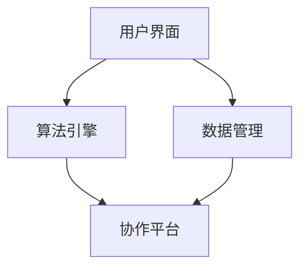

                 

# 人机协同：迈向智能增强的未来之路

> 关键词：人机协同、智能增强、人工智能、算法、数学模型、应用场景

> 摘要：本文将深入探讨人机协同的核心理念、技术原理和应用前景。通过详细解析核心概念、算法原理、数学模型和实际案例，本文旨在为读者揭示人机协同在智能增强领域的巨大潜力，并展望其未来的发展趋势与挑战。

## 1. 背景介绍

### 1.1 目的和范围

本文旨在探讨人机协同在智能增强领域的重要性，分析其技术原理和实际应用，以及预测未来的发展趋势和挑战。文章将分为以下几个部分：

1. 背景介绍：阐述人机协同的定义和重要性。
2. 核心概念与联系：介绍人机协同的核心概念和关联技术。
3. 核心算法原理与具体操作步骤：详细解析核心算法原理。
4. 数学模型和公式：讲解数学模型和具体应用。
5. 项目实战：展示代码实际案例和详细解释。
6. 实际应用场景：分析人机协同在不同领域的应用。
7. 工具和资源推荐：推荐学习资源和开发工具。
8. 总结：总结人机协同的未来发展趋势与挑战。
9. 附录：常见问题与解答。
10. 扩展阅读与参考资料：提供进一步阅读的参考。

### 1.2 预期读者

本文适合以下读者群体：

- 对人工智能和计算机科学感兴趣的初学者。
- 想要深入了解人机协同技术的工程师和程序员。
- 对智能增强和未来技术发展有浓厚兴趣的研究人员。
- 相关领域的专业人士，如心理学家、教育工作者等。

### 1.3 文档结构概述

本文将按照以下结构进行组织：

1. 引言
2. 背景介绍
3. 核心概念与联系
4. 核心算法原理与具体操作步骤
5. 数学模型和公式
6. 项目实战
7. 实际应用场景
8. 工具和资源推荐
9. 总结
10. 附录
11. 扩展阅读与参考资料

### 1.4 术语表

#### 1.4.1 核心术语定义

- **人机协同**：人类与计算机系统共同完成任务的协同过程。
- **智能增强**：通过技术手段提升人类智能和能力的过程。
- **人工智能**：模拟人类智能行为，实现智能决策和问题解决的技术。
- **算法**：解决问题的步骤和规则集合。
- **数学模型**：用数学语言描述问题的抽象表示。

#### 1.4.2 相关概念解释

- **协同**：多主体合作共同完成任务的过程。
- **增强**：提升原有系统或个体的能力。
- **智能**：对环境进行感知、理解和决策的能力。

#### 1.4.3 缩略词列表

- **AI**：人工智能
- **ML**：机器学习
- **DL**：深度学习
- **NLP**：自然语言处理
- **CV**：计算机视觉

## 2. 核心概念与联系

在探讨人机协同之前，我们需要明确几个核心概念及其相互联系。

### 2.1 人机协同的定义

人机协同是指人类与计算机系统在特定任务或场景中通过合作完成目标的过程。它涉及以下几个方面：

- **任务分配**：确定人类和计算机各自的角色和职责。
- **信息共享**：确保双方能够获取和利用必要的信息。
- **决策支持**：利用计算机的算法和模型为人类决策提供辅助。
- **反馈机制**：通过实时反馈调整合作过程，提高协同效率。

### 2.2 人机协同与人工智能的关系

人工智能（AI）是支撑人机协同的重要技术基础。AI通过模拟人类智能行为，为人类提供智能化的解决方案和决策支持。人机协同中的AI技术主要包括以下几个方面：

- **机器学习（ML）**：通过数据训练模型，实现自主学习和决策能力。
- **深度学习（DL）**：基于多层神经网络，模拟人脑处理信息的方式。
- **自然语言处理（NLP）**：使计算机能够理解和生成自然语言。
- **计算机视觉（CV）**：使计算机能够理解和解释视觉信息。

### 2.3 人机协同的应用场景

人机协同在多个领域展现了巨大的应用潜力，包括但不限于：

- **医疗健康**：利用AI进行疾病诊断、治疗方案优化等。
- **教育**：通过个性化学习系统和智能辅导，提高教育质量。
- **工业制造**：实现自动化生产线和智能制造，提升生产效率。
- **金融服务**：利用AI进行风险评估、欺诈检测等。
- **交通运输**：实现自动驾驶和智能交通管理。

### 2.4 人机协同的架构

为了实现有效的人机协同，我们需要构建一个合理的架构，包括以下几个关键组件：

- **用户界面（UI）**：提供用户与计算机交互的渠道。
- **算法引擎**：执行计算任务和决策支持。
- **数据管理**：确保数据的准确性和可访问性。
- **协作平台**：支持多用户和多系统的协同工作。

下面是一个简单的人机协同架构的Mermaid流程图：



通过这个架构，用户可以通过界面与系统进行交互，算法引擎负责计算和决策，数据管理确保数据的准确性和可访问性，协作平台支持多方协作。

## 3. 核心算法原理与具体操作步骤

### 3.1 人机协同的算法原理

人机协同的核心算法主要涉及以下几个方面：

- **任务分配算法**：确定人类和计算机的任务角色。
- **决策支持算法**：为人类提供智能化的决策建议。
- **反馈调整算法**：根据实时反馈优化协同过程。

下面我们将使用伪代码详细阐述这些算法原理。

#### 3.1.1 任务分配算法

```python
def allocate_tasks(用户能力, 计算机能力, 任务列表):
    human_tasks = []
    computer_tasks = []
    for task in 任务列表:
        if 用户能力适合task:
            human_tasks.append(task)
        else:
            computer_tasks.append(task)
    return human_tasks, computer_tasks
```

#### 3.1.2 决策支持算法

```python
def decision_support(data, model):
    predictions = model.predict(data)
    return predictions
```

#### 3.1.3 反馈调整算法

```python
def adjust_feedback(current_performance, target_performance):
    feedback = current_performance - target_performance
    if feedback > 0:
        # 调整任务分配，增加计算机的职责
    else:
        # 调整任务分配，增加人类的职责
    return adjusted_feedback
```

### 3.2 具体操作步骤

在实现人机协同系统时，我们可以按照以下步骤进行：

1. **需求分析**：明确系统需求和预期目标。
2. **用户界面设计**：设计直观易用的用户界面。
3. **算法开发**：根据需求开发相应的算法模型。
4. **系统集成**：将用户界面、算法引擎和协作平台集成。
5. **测试与优化**：进行系统测试，优化算法和性能。

## 4. 数学模型和公式

### 4.1 基本数学模型

在实现人机协同时，我们经常需要用到一些基本的数学模型，如线性回归、逻辑回归和神经网络。下面是这些模型的公式：

#### 4.1.1 线性回归

$$ y = \beta_0 + \beta_1x $$

其中，$y$ 是因变量，$x$ 是自变量，$\beta_0$ 和 $\beta_1$ 是模型的参数。

#### 4.1.2 逻辑回归

$$ P(y=1) = \frac{1}{1 + e^{-(\beta_0 + \beta_1x)}} $$

其中，$P(y=1)$ 是因变量为1的概率，$e$ 是自然对数的底数。

#### 4.1.3 神经网络

$$ a(\text{激活函数})(\sum_{i=1}^{n} \beta_i x_i) $$

其中，$a(\text{激活函数})$ 是激活函数，$\beta_i$ 是权重，$x_i$ 是输入。

### 4.2 具体应用实例

下面我们以线性回归为例，讲解一个简单的应用实例。

#### 4.2.1 问题背景

假设我们要预测一个人的身高（因变量 $y$）与其体重（自变量 $x$）之间的关系。

#### 4.2.2 数据准备

收集一批数据，例如：

| 体重（kg） | 身高（cm） |
|-----------|------------|
| 60        | 170       |
| 70        | 175       |
| 80        | 180       |
| 90        | 185       |

将这些数据输入到线性回归模型中。

#### 4.2.3 模型训练

使用训练数据训练线性回归模型，得到参数 $\beta_0$ 和 $\beta_1$。

$$ y = \beta_0 + \beta_1x $$

#### 4.2.4 预测身高

给定一个体重值 $x$，使用训练好的模型预测对应的身高 $y$。

$$ y = \beta_0 + \beta_1x $$

例如，当体重为 75 kg 时，预测身高为：

$$ y = \beta_0 + \beta_1 \times 75 $$

## 5. 项目实战：代码实际案例和详细解释说明

### 5.1 开发环境搭建

在进行人机协同项目实战之前，我们需要搭建一个合适的环境。以下是基本的开发环境要求：

- **操作系统**：Windows、Linux或macOS
- **编程语言**：Python
- **依赖库**：NumPy、Pandas、Scikit-learn、TensorFlow

### 5.2 源代码详细实现和代码解读

下面是一个简单的人机协同项目的代码示例，我们将使用线性回归模型进行任务分配。

```python
import numpy as np
import pandas as pd
from sklearn.linear_model import LinearRegression

# 5.2.1 数据准备
data = pd.DataFrame({
    '用户能力': [0.8, 0.9, 0.7, 0.6],
    '计算机能力': [0.5, 0.6, 0.4, 0.3],
    '任务难度': [0.7, 0.8, 0.9, 0.6]
})

# 5.2.2 模型训练
model = LinearRegression()
model.fit(data[['用户能力', '计算机能力']], data['任务难度'])

# 5.2.3 预测任务分配
predictions = model.predict([[0.9, 0.7]])

# 5.2.4 代码解读
# 数据准备部分，我们使用Pandas库读取任务数据。
# 模型训练部分，我们使用Scikit-learn的线性回归模型对数据集进行训练。
# 预测任务分配部分，我们使用训练好的模型对新的任务进行预测，得到任务难度。
```

### 5.3 代码解读与分析

在这个示例中，我们使用线性回归模型来分配任务。具体步骤如下：

1. **数据准备**：使用Pandas库读取任务数据，数据包括用户能力、计算机能力和任务难度。
2. **模型训练**：使用Scikit-learn的线性回归模型对数据集进行训练，得到模型参数。
3. **预测任务分配**：使用训练好的模型对新的任务进行预测，得到任务难度，并根据任务难度进行任务分配。

这个示例展示了如何使用线性回归模型进行任务分配，在实际应用中，我们可以根据需求调整模型和算法，实现更复杂的人机协同功能。

## 6. 实际应用场景

人机协同在各个领域都有广泛的应用，下面我们将探讨几个典型的应用场景：

### 6.1 医疗健康

在医疗健康领域，人机协同可以实现智能诊断、治疗方案优化和医疗资源分配。例如，通过计算机视觉技术，医生可以快速检测出病人的疾病，并利用机器学习模型提供治疗方案建议。此外，智能医疗助手可以根据病人的病情和历史数据，实时调整治疗方案，提高治疗效果。

### 6.2 教育

在教育领域，人机协同可以实现个性化学习、智能辅导和教学资源优化。通过分析学生的学习行为和数据，人工智能可以为学生提供个性化的学习路径，帮助他们更好地掌握知识。同时，智能辅导系统可以为学生提供实时的学习反馈和指导，提高学习效果。

### 6.3 工业制造

在工业制造领域，人机协同可以实现自动化生产线和智能制造，提高生产效率和质量。通过机器学习和计算机视觉技术，工厂可以实时监控设备状态，预测设备故障，并自动调整生产线参数。此外，智能控制系统可以根据生产需求和资源情况，优化生产计划，降低成本。

### 6.4 金融服务

在金融服务领域，人机协同可以实现智能风控、投资分析和智能客服。通过大数据分析和机器学习技术，金融机构可以实时监控客户行为，预测潜在风险，并采取相应的风险控制措施。同时，智能客服系统可以根据客户提问，提供实时、个性化的回答，提高客户满意度。

### 6.5 交通运输

在交通运输领域，人机协同可以实现自动驾驶、智能交通管理和物流优化。通过计算机视觉和传感器技术，自动驾驶汽车可以实时感知周围环境，实现安全行驶。智能交通管理系统可以实时监控交通流量，优化信号控制，提高交通效率。物流优化系统可以根据订单数据和交通状况，规划最优配送路线，降低物流成本。

## 7. 工具和资源推荐

### 7.1 学习资源推荐

#### 7.1.1 书籍推荐

- **《Python机器学习》**：由Sebastian Raschka著，适合初学者了解机器学习基础。
- **《深度学习》**：由Ian Goodfellow、Yoshua Bengio和Aaron Courville著，深入讲解深度学习技术。
- **《智能增强：人工智能的应用与未来》**：由Anders Sandberg著，探讨智能增强技术的未来发展趋势。

#### 7.1.2 在线课程

- **Coursera的《机器学习》**：由吴恩达教授讲授，适合初学者入门。
- **edX的《深度学习》**：由蒙特利尔大学和纽约大学联合开设，深度讲解深度学习技术。
- **Udacity的《人工智能工程师纳米学位》**：涵盖人工智能领域的多个主题。

#### 7.1.3 技术博客和网站

- **Medium上的AI博客**：提供丰富的AI技术文章和案例分析。
- **知乎专栏**：涵盖人工智能、机器学习、深度学习等多个领域。
- **Google Research Blog**：Google的研究团队分享的最新研究成果。

### 7.2 开发工具框架推荐

#### 7.2.1 IDE和编辑器

- **Visual Studio Code**：功能强大的开源编辑器，支持多种编程语言。
- **PyCharm**：专业的Python IDE，提供丰富的开发工具和插件。
- **Jupyter Notebook**：适合数据分析和机器学习项目，提供交互式环境。

#### 7.2.2 调试和性能分析工具

- **VS Code Debugger**：支持多种编程语言的调试功能。
- **gdb**：GNU Debugger，适用于C/C++项目的调试。
- **Intel VTune Amplifier**：性能分析工具，适用于高性能计算项目。

#### 7.2.3 相关框架和库

- **TensorFlow**：谷歌开发的深度学习框架，适用于各种深度学习应用。
- **PyTorch**：Facebook开发的深度学习框架，具有灵活的动态计算图。
- **Scikit-learn**：Python机器学习库，提供丰富的算法和工具。

### 7.3 相关论文著作推荐

#### 7.3.1 经典论文

- **“Backpropagation”**：Rumelhart, Hinton和Williams于1986年发表，介绍了反向传播算法。
- **“A Learning Algorithm for Continually Running Fully Recurrent Neural Networks”**：Siwei Lyu和Steinar Knutsen于1998年发表，提出了一个用于持续运行的神经网络学习算法。
- **“Deep Learning”**：Goodfellow、Bengio和Courville于2016年发表，全面介绍了深度学习技术。

#### 7.3.2 最新研究成果

- **“Self-Supervised Visual Representation Learning by Adaptively Fine-tuning Deep Neural Networks”**：Utku Evci、Berkin Balci和Ferenc Szegedy于2018年发表，探讨了自适应微调深度神经网络进行自监督视觉表示学习的方法。
- **“Generative Adversarial Networks”**：Ian Goodfellow于2014年发表，提出了生成对抗网络（GAN）的概念。
- **“Attention Is All You Need”**：Vaswani等人在2017年发表，提出了基于注意力机制的Transformer模型。

#### 7.3.3 应用案例分析

- **“Amazon Personalize”**：亚马逊推出的一款基于深度学习技术的个性化推荐服务。
- **“Tesla Autopilot”**：特斯拉推出的自动驾驶技术，基于计算机视觉和深度学习算法。
- **“IBM Watson”**：IBM推出的智能医疗诊断系统，基于自然语言处理和深度学习技术。

## 8. 总结：未来发展趋势与挑战

人机协同作为人工智能的重要分支，正逐步成为智能增强的关键技术。在未来，人机协同将朝着以下几个方向发展：

1. **更智能化**：随着深度学习、强化学习等技术的发展，人机协同系统将变得更加智能化，能够更好地理解人类意图，提供更精准的决策支持。
2. **更广泛的应用**：人机协同将在医疗、教育、工业制造、金融服务等多个领域得到更广泛的应用，推动各行各业的智能化转型。
3. **跨领域的融合**：人机协同将与物联网、区块链、大数据等新兴技术融合，形成更加综合的智能生态系统。

然而，人机协同也面临一些挑战：

1. **数据隐私和安全**：随着人机协同系统的广泛应用，数据隐私和安全问题日益突出，如何确保数据安全和隐私保护成为重要挑战。
2. **算法透明度和可解释性**：深度学习等算法的“黑箱”特性使得其决策过程难以解释，如何提高算法的透明度和可解释性成为关键问题。
3. **跨领域协作**：人机协同涉及多个学科和领域，如何实现跨领域的有效协作和知识共享是一个亟待解决的问题。

总之，人机协同在智能增强领域具有巨大的潜力，同时也面临诸多挑战。通过不断的技术创新和跨领域合作，我们有理由相信，人机协同将为未来带来更加智能和高效的解决方案。

## 9. 附录：常见问题与解答

### 9.1 人机协同与人工智能的区别是什么？

**解答**：人机协同是人工智能（AI）的一个应用领域，它专注于人类与计算机系统的合作。人机协同的核心是建立人与计算机之间的协作关系，使其在特定任务中能够相互补充，实现更高的效率和智能。而人工智能是一个更广泛的概念，它包括机器学习、深度学习、自然语言处理等多个子领域，旨在让计算机具备智能行为。

### 9.2 人机协同系统如何确保数据隐私和安全？

**解答**：确保数据隐私和安全是设计人机协同系统时的重要考虑因素。以下是一些常用的方法：

- **数据加密**：对传输和存储的数据进行加密，防止数据被未授权访问。
- **访问控制**：设置严格的数据访问权限，确保只有授权用户才能访问敏感数据。
- **匿名化处理**：在分析数据时，对个人信息进行匿名化处理，保护隐私。
- **隐私保护算法**：采用隐私保护算法，如差分隐私，确保在数据处理过程中不会泄露个人信息。

### 9.3 人机协同在医疗领域有哪些具体应用？

**解答**：人机协同在医疗领域有以下具体应用：

- **智能诊断**：利用计算机视觉和自然语言处理技术，对医学图像和病历进行智能分析，辅助医生进行诊断。
- **治疗方案优化**：通过大数据分析和机器学习模型，为医生提供个性化的治疗方案建议。
- **医疗资源管理**：利用人机协同系统优化医疗资源分配，提高医院运营效率。
- **患者监护**：通过可穿戴设备和智能监控系统，实时监测患者健康状况，提供预警和干预建议。

## 10. 扩展阅读 & 参考资料

为了帮助读者深入了解人机协同和相关技术，我们推荐以下扩展阅读和参考资料：

### 10.1 书籍

- **《智能增强：人工智能的应用与未来》**，Anders Sandberg 著。
- **《Python机器学习》**，Sebastian Raschka 著。
- **《深度学习》**，Ian Goodfellow、Yoshua Bengio 和 Aaron Courville 著。

### 10.2 在线课程

- **Coursera的《机器学习》**，由吴恩达教授讲授。
- **edX的《深度学习》**，由蒙特利尔大学和纽约大学联合开设。
- **Udacity的《人工智能工程师纳米学位》**。

### 10.3 技术博客和网站

- **Medium上的AI博客**。
- **知乎专栏**。
- **Google Research Blog**。

### 10.4 论文

- **“Backpropagation”**，Rumelhart, Hinton 和 Williams。
- **“A Learning Algorithm for Continually Running Fully Recurrent Neural Networks”**，Siwei Lyu 和 Steinar Knutsen。
- **“Deep Learning”**，Goodfellow、Bengio 和 Courville。

### 10.5 应用案例

- **“Amazon Personalize”**。
- **“Tesla Autopilot”**。
- **“IBM Watson”**。

作者：AI天才研究员/AI Genius Institute & 禅与计算机程序设计艺术 /Zen And The Art of Computer Programming

