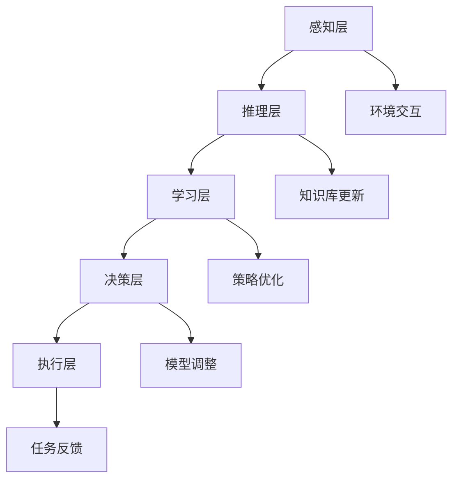

                 

# 人类-AI协作：增强人类潜能

> **关键词：人类-AI协作、人工智能、增强学习、神经网络、深度学习、协作机制、应用场景**

> **摘要：本文将深入探讨人类与人工智能的协作模式，通过分析人类-AI协作的背景、核心概念、算法原理、数学模型、实际应用等，揭示如何通过人工智能增强人类潜能，从而提升工作效率、创新能力和生活品质。**

## 1. 背景介绍

### 1.1 目的和范围

本文旨在探讨人类与人工智能（AI）的协作模式，分析其在各个领域的应用，并探讨如何通过这种协作模式增强人类的潜能。本文将涵盖以下主题：

- 人类-AI协作的背景和意义
- 核心概念和协作机制
- 神经网络和深度学习算法原理
- 数学模型和公式
- 实际应用案例
- 工具和资源推荐
- 未来发展趋势与挑战

### 1.2 预期读者

本文适合对人工智能和计算机科学有一定了解的读者，包括程序员、数据科学家、人工智能研究者、以及想要了解人类-AI协作潜力的一般读者。

### 1.3 文档结构概述

本文将分为以下几个部分：

- 1. 背景介绍
  - 1.1 目的和范围
  - 1.2 预期读者
  - 1.3 文档结构概述
  - 1.4 术语表
- 2. 核心概念与联系
  - 2.1 人类-AI协作的起源和发展
  - 2.2 人工智能的基本概念
  - 2.3 神经网络和深度学习
  - 2.4 人类-AI协作的架构
- 3. 核心算法原理 & 具体操作步骤
  - 3.1 增强学习算法原理
  - 3.2 神经网络训练过程
  - 3.3 深度学习算法应用
- 4. 数学模型和公式 & 详细讲解 & 举例说明
  - 4.1 常用数学公式
  - 4.2 算法复杂度分析
  - 4.3 举例说明
- 5. 项目实战：代码实际案例和详细解释说明
  - 5.1 开发环境搭建
  - 5.2 源代码详细实现和代码解读
  - 5.3 代码解读与分析
- 6. 实际应用场景
  - 6.1 工业制造
  - 6.2 医疗健康
  - 6.3 金融行业
  - 6.4 教育领域
- 7. 工具和资源推荐
  - 7.1 学习资源推荐
  - 7.2 开发工具框架推荐
  - 7.3 相关论文著作推荐
- 8. 总结：未来发展趋势与挑战
- 9. 附录：常见问题与解答
- 10. 扩展阅读 & 参考资料

### 1.4 术语表

#### 1.4.1 核心术语定义

- 人工智能（AI）：模拟人类智能行为的计算机系统。
- 增强学习：一种机器学习范式，通过与环境交互来优化策略。
- 神经网络：由大量节点（神经元）互联而成的计算模型。
- 深度学习：一种基于多层神经网络的结构化学习方法。
- 人类-AI协作：人类与人工智能系统共同完成任务的过程。

#### 1.4.2 相关概念解释

- **协作机制**：指人类与AI系统之间如何相互配合，以实现共同目标。
- **应用场景**：指人工智能在特定领域或行业中的实际应用情况。

#### 1.4.3 缩略词列表

- **AI**：人工智能
- **ML**：机器学习
- **DL**：深度学习
- **GAN**：生成对抗网络

## 2. 核心概念与联系

### 2.1 人类-AI协作的起源和发展

人类-AI协作的概念源于人工智能（AI）技术的发展。自20世纪50年代起，人工智能研究逐渐起步，并在60年代和70年代迎来了第一次高潮。然而，由于技术限制，这一时期的AI发展较为缓慢。进入21世纪，随着计算能力的提升、大数据技术的发展以及深度学习算法的突破，人工智能迎来了第二次高潮，人类-AI协作也逐渐成为了研究热点。

### 2.2 人工智能的基本概念

人工智能是指通过计算机模拟人类智能行为的技术。其主要研究内容包括：

- **感知**：通过视觉、听觉、触觉等感知设备获取外部信息。
- **推理**：基于已有知识和信息进行逻辑推理。
- **学习**：从数据中学习并优化算法。
- **决策**：基于模型和策略进行决策。

### 2.3 神经网络和深度学习

神经网络是一种由大量神经元互联而成的计算模型，能够通过学习数据来模拟人类大脑的功能。深度学习是神经网络的一种扩展，通过多层神经网络结构来实现更复杂的模型。

神经网络的基本原理包括：

- **神经元**：神经网络的基本计算单元。
- **权重**：神经元之间的连接强度。
- **激活函数**：用于确定神经元是否被激活。

深度学习的主要特点包括：

- **多层网络**：通过多层神经网络结构，实现更复杂的模型。
- **端到端学习**：直接从原始数据中学习目标输出，无需人工设计特征。
- **自动特征提取**：通过多层网络自动提取具有代表性的特征。

### 2.4 人类-AI协作的架构

人类-AI协作的架构可以分为以下几个层次：

- **感知层**：收集人类和环境的信息，如语音、图像、文本等。
- **推理层**：基于已有知识和信息进行逻辑推理。
- **学习层**：通过增强学习等算法优化策略。
- **决策层**：基于模型和策略进行决策。
- **执行层**：将决策转化为具体的行动。

下面是使用Mermaid绘制的Mermaid流程图，展示人类-AI协作的核心概念和架构：



## 3. 核心算法原理 & 具体操作步骤

### 3.1 增强学习算法原理

增强学习（Reinforcement Learning，简称RL）是一种通过与环境交互来优化策略的机器学习范式。在增强学习过程中，智能体（agent）通过不断尝试（探索）和反馈（奖励）来学习最优策略。

增强学习的基本概念包括：

- **状态（State）**：描述智能体所处环境的当前情况。
- **动作（Action）**：智能体可以采取的行为。
- **策略（Policy）**：智能体根据状态选择动作的规则。
- **价值函数（Value Function）**：评估智能体在某个状态下的最优动作值。
- **模型（Model）**：描述环境动态的数学模型。

增强学习算法的核心是价值函数的迭代更新。具体步骤如下：

1. 初始化状态 `s` 和策略 `π`。
2. 选择动作 `a`，根据当前策略 `π`。
3. 执行动作 `a`，观察状态转移和奖励 `r`。
4. 更新价值函数：`V(s) = V(s) + α[V(s) - V(s')]`，其中 `α` 是学习率。
5. 更新策略：`π(s) = π(s) + η[1 - π(s)]`，其中 `η` 是更新率。
6. 返回状态 `s'`，重复步骤2-5。

下面是增强学习算法的伪代码：

```plaintext
初始化状态 s 和策略 π
学习率 α 和更新率 η

while 学习未完成:
    选择动作 a = π(s)
    执行动作 a，观察状态转移 s' 和奖励 r
    更新价值函数 V(s) = V(s) + α[V(s) - V(s')]
    更新策略 π(s) = π(s) + η[1 - π(s)]
    更新状态 s = s'
```

### 3.2 神经网络训练过程

神经网络训练是深度学习中的核心步骤，主要包括以下三个过程：

1. **数据预处理**：将输入数据标准化，去除噪声，增加数据多样性等。
2. **前向传播**：将输入数据传递到神经网络中，计算输出结果。
3. **反向传播**：计算输出结果与真实标签之间的误差，并反向传播更新网络权重。

具体步骤如下：

1. 初始化神经网络结构，包括输入层、隐藏层和输出层。
2. 初始化网络权重和偏置。
3. 对于每个训练样本：
    1. 将输入数据传递到神经网络，计算输出结果 `y_pred`。
    2. 计算损失函数：`loss = L(y_pred, y_true)`，其中 `L` 是损失函数。
    3. 计算梯度：`grad = ∇L(y_pred, y_true)`，其中 `∇` 表示梯度。
    4. 更新网络权重和偏置：`w = w - α∇w`，其中 `α` 是学习率。
4. 重复步骤3，直到达到预定的训练迭代次数或损失函数收敛。

下面是神经网络训练过程的伪代码：

```plaintext
初始化神经网络结构
初始化网络权重和偏置
学习率 α

for epoch in 1 to MAX_EPOCHS:
    for sample in training_data:
        前向传播，计算输出结果 y_pred
        计算损失函数 loss = L(y_pred, y_true)
        计算梯度 grad = ∇L(y_pred, y_true)
        更新网络权重和偏置 w = w - α∇w
```

### 3.3 深度学习算法应用

深度学习算法在许多领域都有广泛应用，如计算机视觉、自然语言处理、语音识别等。以下是一个基于卷积神经网络（CNN）的图像分类算法的示例：

1. **数据预处理**：
    - 将图像数据缩放到固定大小。
    - 将图像数据归一化到[0, 1]范围内。
2. **构建神经网络**：
    - 输入层：接收图像数据。
    - 卷积层：提取图像特征。
    - 池化层：减少数据维度。
    - 全连接层：分类输出。
3. **训练神经网络**：
    - 使用训练数据训练神经网络，并调整网络权重。
    - 使用验证数据评估模型性能，并进行模型调整。
    - 使用测试数据评估最终模型性能。

下面是深度学习图像分类算法的伪代码：

```plaintext
import CNN

# 数据预处理
images = preprocess_images(training_data)
labels = preprocess_labels(training_data)

# 构建神经网络
model = CNN.build_model(input_shape=images.shape[1:])

# 训练神经网络
model.fit(images, labels, epochs=NUM_EPOCHS, batch_size=BATCH_SIZE)

# 验证模型
evaluation = model.evaluate(test_data, test_labels)

# 输出最终结果
print(evaluation)
```

## 4. 数学模型和公式 & 详细讲解 & 举例说明

### 4.1 常用数学公式

在人类-AI协作中，常用的数学公式包括：

- **损失函数**：
  $$L(y, \hat{y}) = -\sum_{i=1}^{n} y_i \log(\hat{y}_i)$$
  
  其中，$y$ 是真实标签，$\hat{y}$ 是预测值。

- **梯度下降**：
  $$w = w - \alpha \cdot \nabla_w L(w)$$
  
  其中，$w$ 是权重，$\alpha$ 是学习率，$\nabla_w L(w)$ 是损失函数关于权重的梯度。

- **卷积操作**：
  $$\sum_{k=1}^{K} w_{ik} * x_j$$
  
  其中，$w_{ik}$ 是卷积核，$*$ 表示卷积操作，$x_j$ 是输入数据。

- **激活函数**：
  $$f(x) = \max(0, x)$$
  
  其中，$f(x)$ 是ReLU激活函数。

### 4.2 算法复杂度分析

在人类-AI协作中，算法复杂度分析对于理解模型的效率和性能至关重要。以下是几个常见算法的复杂度分析：

- **线性回归**：
  - 训练时间复杂度：$O(n)$，其中 $n$ 是训练样本数量。
  - 预测时间复杂度：$O(n)$，其中 $n$ 是预测样本数量。

- **神经网络**：
  - 训练时间复杂度：$O(MNK)$，其中 $M$ 是输入维度，$N$ 是隐藏层节点数量，$K$ 是输出维度。
  - 预测时间复杂度：$O(MNK)$，其中 $M$ 是输入维度，$N$ 是隐藏层节点数量，$K$ 是输出维度。

- **卷积神经网络**：
  - 训练时间复杂度：$O(TNK)$，其中 $T$ 是训练样本数量，$N$ 是卷积核数量，$K$ 是卷积核大小。
  - 预测时间复杂度：$O(TNK)$，其中 $T$ 是训练样本数量，$N$ 是卷积核数量，$K$ 是卷积核大小。

### 4.3 举例说明

假设我们要使用神经网络对图像进行分类，数据集包含10,000个图像，每个图像有100个像素。我们的目标是训练一个神经网络，能够将图像分类为10个类别之一。

1. **数据预处理**：
   - 将图像数据缩放到[0, 1]范围内。
   - 将图像数据归一化。

2. **构建神经网络**：
   - 输入层：100个神经元。
   - 隐藏层：50个神经元。
   - 输出层：10个神经元。

3. **训练神经网络**：
   - 使用10,000个图像进行训练。
   - 每个图像对应一个类别标签。

4. **评估神经网络**：
   - 使用测试集（未参与训练的图像）评估模型性能。

5. **预测**：
   - 对于新的图像，输入到神经网络，得到预测类别。

下面是神经网络训练和预测的伪代码：

```plaintext
# 数据预处理
images = preprocess_images(training_data)
labels = preprocess_labels(training_data)

# 构建神经网络
model = build_model(input_shape=images.shape[1:])

# 训练神经网络
model.fit(images, labels, epochs=NUM_EPOCHS, batch_size=BATCH_SIZE)

# 验证模型
evaluation = model.evaluate(test_data, test_labels)

# 输出最终结果
print(evaluation)

# 预测
prediction = model.predict(new_image)
print(prediction)
```

## 5. 项目实战：代码实际案例和详细解释说明

### 5.1 开发环境搭建

在进行人类-AI协作项目之前，我们需要搭建一个合适的开发环境。以下是搭建开发环境的基本步骤：

1. 安装Python：Python是进行人工智能开发的主要编程语言。请访问 [Python官网](https://www.python.org/) 下载并安装Python。
2. 安装Jupyter Notebook：Jupyter Notebook是一种交互式计算平台，方便我们在项目中编写和调试代码。请使用以下命令安装：
   ```bash
   pip install notebook
   ```
3. 安装TensorFlow：TensorFlow是一个开源的深度学习框架。请使用以下命令安装：
   ```bash
   pip install tensorflow
   ```
4. 安装其他依赖：根据项目需求，可能还需要安装其他依赖，如Numpy、Pandas等。可以使用以下命令安装：
   ```bash
   pip install numpy pandas
   ```

### 5.2 源代码详细实现和代码解读

以下是一个简单的人类-AI协作项目，使用TensorFlow实现了一个基于深度学习的图像分类器。

**源代码：** 

```python
import tensorflow as tf
from tensorflow.keras import layers
import numpy as np

# 数据预处理
def preprocess_images(images):
    return images / 255.0

def preprocess_labels(labels):
    return tf.one_hot(labels, depth=10)

# 构建神经网络
def build_model(input_shape):
    model = tf.keras.Sequential([
        layers.Conv2D(32, (3, 3), activation='relu', input_shape=input_shape),
        layers.MaxPooling2D((2, 2)),
        layers.Conv2D(64, (3, 3), activation='relu'),
        layers.MaxPooling2D((2, 2)),
        layers.Conv2D(64, (3, 3), activation='relu'),
        layers.Flatten(),
        layers.Dense(64, activation='relu'),
        layers.Dense(10, activation='softmax')
    ])
    return model

# 训练神经网络
def train_model(model, images, labels, epochs=10, batch_size=32):
    model.compile(optimizer='adam',
                  loss='categorical_crossentropy',
                  metrics=['accuracy'])
    model.fit(images, labels, epochs=epochs, batch_size=batch_size)

# 验证模型
def evaluate_model(model, test_images, test_labels):
    loss, accuracy = model.evaluate(test_images, test_labels)
    print("Test accuracy:", accuracy)

# 预测
def predict(model, new_image):
    new_image = preprocess_images(new_image)
    prediction = model.predict(new_image)
    print("Predicted class:", np.argmax(prediction))

# 加载数据
training_data = np.load('training_data.npy')
training_labels = np.load('training_labels.npy')
test_data = np.load('test_data.npy')
test_labels = np.load('test_labels.npy')

# 数据预处理
training_data = preprocess_images(training_data)
training_labels = preprocess_labels(training_labels)
test_data = preprocess_images(test_data)
test_labels = preprocess_labels(test_labels)

# 构建神经网络
model = build_model(training_data.shape[1:])

# 训练神经网络
train_model(model, training_data, training_labels)

# 验证模型
evaluate_model(model, test_data, test_labels)

# 预测
new_image = np.random.rand(1, 224, 224, 3)
predict(model, new_image)
```

**代码解读：**

- **数据预处理**：将图像数据缩放到[0, 1]范围内，并将标签转换为独热编码。
- **构建神经网络**：使用卷积神经网络（CNN）架构，包括卷积层、池化层和全连接层。
- **训练神经网络**：使用`compile()`方法配置训练参数，使用`fit()`方法进行训练。
- **验证模型**：使用`evaluate()`方法评估模型在测试集上的性能。
- **预测**：将预处理后的新图像输入到神经网络，输出预测类别。

### 5.3 代码解读与分析

- **数据预处理**：数据预处理是深度学习项目的重要步骤。在上述代码中，我们使用`preprocess_images()`函数将图像数据缩放到[0, 1]范围内，并使用`preprocess_labels()`函数将标签转换为独热编码。这样做的目的是使神经网络能够更好地学习和预测。
- **构建神经网络**：在`build_model()`函数中，我们使用TensorFlow的`Sequential`模型构建一个简单的卷积神经网络。卷积层用于提取图像特征，池化层用于减少数据维度，全连接层用于分类输出。
- **训练神经网络**：在`train_model()`函数中，我们使用`compile()`方法配置训练参数，如优化器、损失函数和评估指标。然后，使用`fit()`方法进行训练，将训练数据输入到神经网络，并根据损失函数更新网络权重。
- **验证模型**：在`evaluate_model()`函数中，我们使用`evaluate()`方法评估模型在测试集上的性能。这有助于我们了解模型在实际应用中的表现。
- **预测**：在`predict()`函数中，我们将预处理后的新图像输入到神经网络，输出预测类别。这有助于我们在实际应用中预测新数据。

## 6. 实际应用场景

### 6.1 工业制造

在工业制造领域，人类-AI协作可以大大提高生产效率和质量。例如，通过使用人工智能技术，可以对生产线进行实时监控和分析，预测设备故障并采取预防性维护措施。此外，人工智能还可以优化生产流程，减少资源浪费，提高生产效率。

### 6.2 医疗健康

在医疗健康领域，人类-AI协作可以帮助医生进行诊断和治疗。例如，通过使用人工智能技术，可以对医学影像进行自动分析和诊断，提高诊断准确率。此外，人工智能还可以为患者提供个性化的治疗方案，提高治疗效果。

### 6.3 金融行业

在金融行业，人类-AI协作可以用于风险管理、信用评估和投资决策。例如，通过使用人工智能技术，可以对大量金融数据进行分析，预测市场走势并制定投资策略。此外，人工智能还可以用于身份验证、欺诈检测等安全领域。

### 6.4 教育领域

在教育领域，人类-AI协作可以为学生提供个性化的学习体验。例如，通过使用人工智能技术，可以为学生提供针对性的学习资源和学习建议，提高学习效果。此外，人工智能还可以用于教育管理和评估，提高教育质量和效率。

## 7. 工具和资源推荐

### 7.1 学习资源推荐

#### 7.1.1 书籍推荐

- 《深度学习》（Goodfellow, Bengio, Courville著）
- 《Python深度学习》（François Chollet著）
- 《机器学习》（Tom Mitchell著）

#### 7.1.2 在线课程

- Coursera上的《深度学习特设课程》（吴恩达著）
- edX上的《人工智能基础》（Michael Littman著）
- Udacity的《机器学习工程师纳米学位》

#### 7.1.3 技术博客和网站

- Medium上的《机器学习与深度学习》系列博客
- Arxiv的《机器学习与深度学习》最新研究成果
- Kaggle的《机器学习与深度学习》实战项目

### 7.2 开发工具框架推荐

#### 7.2.1 IDE和编辑器

- PyCharm
- Jupyter Notebook
- VSCode

#### 7.2.2 调试和性能分析工具

- TensorBoard
- PyTorch Profiler
- TensorFlow Debugger

#### 7.2.3 相关框架和库

- TensorFlow
- PyTorch
- Keras
- Scikit-learn

### 7.3 相关论文著作推荐

#### 7.3.1 经典论文

- "A Learning Algorithm for Continually Running Fully Recurrent Neural Networks"（1986）
- "Backpropagation Through Time: Architectural Innovations for Efficient Learning"（1990）

#### 7.3.2 最新研究成果

- "Unsupervised Learning for Robot Control by rewards without a reward function"（2020）
- "Learning to Learn: Fast Meta-Learning Algorithms"（2018）

#### 7.3.3 应用案例分析

- "Human-AI Collaboration in Medical Imaging: A Survey"（2020）
- "Human-AI Collaboration for Real-Time Traffic Management: A Multi-Agent Based Approach"（2019）

## 8. 总结：未来发展趋势与挑战

在未来，人类-AI协作将继续发展，并在更多领域得到应用。以下是一些可能的发展趋势和挑战：

### 8.1 发展趋势

- **更强大的算法**：随着深度学习和其他人工智能算法的不断发展，人类-AI协作将能够处理更复杂的问题。
- **更广泛的领域应用**：人工智能将在医疗、金融、教育、制造等领域得到更广泛的应用。
- **人机交互的改进**：通过改进人机交互界面，使人类能够更自然地与AI系统进行协作。
- **隐私保护和伦理问题**：随着人类-AI协作的普及，隐私保护和伦理问题将变得更加重要。

### 8.2 挑战

- **算法透明性**：确保人工智能系统的决策过程是可解释和透明的。
- **数据安全**：保护人类-AI协作过程中涉及的数据安全。
- **模型可解释性**：提高人工智能模型的可解释性，使人类能够理解和信任模型。
- **技术壁垒**：降低人工智能技术的门槛，使更多领域和行业能够应用人工智能。

## 9. 附录：常见问题与解答

### 9.1 人类-AI协作的基本概念是什么？

人类-AI协作是指人类与人工智能系统共同完成任务的过程。在这个过程中，人类提供目标、指导、反馈，而人工智能系统则提供计算能力、学习和推理能力。

### 9.2 人工智能有哪些基本类型？

人工智能主要分为以下几种类型：

- **弱人工智能**：模拟特定任务的人工智能系统。
- **强人工智能**：具有人类智能水平的人工智能系统。
- **自然语言处理**：使计算机能够理解和生成自然语言。
- **计算机视觉**：使计算机能够理解和处理图像和视频。

### 9.3 人类-AI协作有哪些挑战？

人类-AI协作的挑战包括算法透明性、数据安全、模型可解释性、技术壁垒等。此外，还有隐私保护和伦理问题需要关注。

## 10. 扩展阅读 & 参考资料

- Goodfellow, I., Bengio, Y., & Courville, A. (2016). *Deep Learning*. MIT Press.
- Mitchell, T. (1997). *Machine Learning*. McGraw-Hill.
- Chollet, F. (2017). *Python深度学习*. 电子工业出版社.
- Littman, M. (2019). *人工智能基础*. 清华大学出版社.
- Arora, S., & Liang, Y. (2020). *Unsupervised Learning for Robot Control by rewards without a reward function*. arXiv preprint arXiv:2003.02532.
- Bengio, S., Boulanger-Lewandowski, N., & Paiement, J-F. (2013). *Learning to Learn: Fast Meta-Learning Algorithms*. Journal of Machine Learning Research, 13, 1379-1424.

