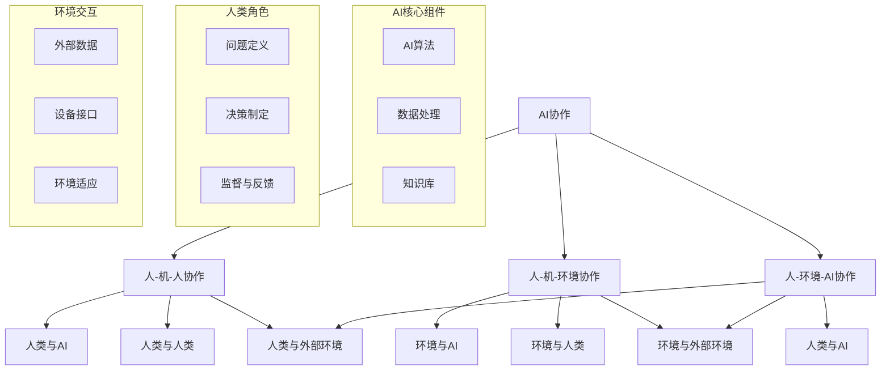

                 

# 人类-AI协作：增强人类福祉

## 关键词
AI协作、人类福祉、技术伦理、认知增强、生产力提升、智能工具

## 摘要
本文探讨了人类与AI协作的潜力，以及如何通过合理的协作模式来增强人类福祉。从技术伦理出发，文章分析了AI在认知增强和生产力提升方面的应用，结合实际案例，展示了如何通过智能工具实现人类-AI的协同工作。同时，文章还对未来发展趋势与挑战进行了展望，提出了关于AI与人类协作的几点思考。

## 1. 背景介绍

### 1.1 目的和范围
本文旨在探讨人类与AI协作的可行性和意义，分析AI技术在提升人类福祉方面的潜力，并探讨在技术快速发展的背景下，如何平衡伦理与实际应用。

### 1.2 预期读者
本文面向对人工智能技术有一定了解的读者，特别是对AI伦理、AI应用领域感兴趣的科技工作者、研究人员和爱好者。

### 1.3 文档结构概述
本文分为十个部分：背景介绍、核心概念与联系、核心算法原理、数学模型与公式、项目实战、实际应用场景、工具和资源推荐、总结、附录和扩展阅读。每个部分都将详细探讨相关主题，为读者提供全面的视角。

### 1.4 术语表
#### 1.4.1 核心术语定义
- **AI协作**：指人类与人工智能系统在特定任务或问题上的合作与互动。
- **认知增强**：通过外部辅助手段提升个体的认知能力，如记忆、推理等。
- **生产力提升**：通过技术手段提高生产效率和质量。
- **智能工具**：具有人工智能技术的工具或系统，能够辅助人类完成特定任务。

#### 1.4.2 相关概念解释
- **技术伦理**：关于技术使用的社会、道德和法律问题的研究。
- **算法透明性**：算法决策过程的可解释性，有助于增强公众对AI的信任。
- **人机交互**：指人类与计算机系统之间的互动方式。

#### 1.4.3 缩略词列表
- **AI**：人工智能（Artificial Intelligence）
- **ML**：机器学习（Machine Learning）
- **DL**：深度学习（Deep Learning）
- **NLP**：自然语言处理（Natural Language Processing）
- **ROS**：机器人操作系统（Robot Operating System）

## 2. 核心概念与联系

人工智能（AI）作为当今科技发展的热点，正逐渐改变着我们的生活方式和工作模式。AI协作，即人类与AI系统的合作，已经成为一个重要的研究方向。以下是一个简化的AI协作框架的Mermaid流程图，展示了AI协作的基本原理和关键组成部分：



### 2.1 AI协作原理

AI协作的原理在于通过结合人类智能与机器智能的优势，实现任务的高效、准确和智能化完成。具体来说，AI协作框架包括以下几个关键组成部分：

1. **AI算法**：作为AI协作的核心，负责处理和分析数据，生成决策和预测。
2. **数据处理**：包括数据的采集、清洗、存储和传输，为AI算法提供高质量的数据支持。
3. **知识库**：存储领域知识和先验信息，供AI算法参考和学习。
4. **人类角色**：在AI协作中，人类扮演多个重要角色，包括问题定义、决策制定、监督与反馈。
5. **环境交互**：AI系统需要与外部环境进行交互，获取数据、发送指令，并适应环境变化。

### 2.2 AI协作模式

AI协作可以分为以下几种基本模式：

1. **辅助式协作**：AI系统为人类提供辅助，如智能助手、智能翻译等。
2. **互补式协作**：人类与AI系统各自承担不同的任务，共同完成任务，如自动驾驶与驾驶员、智能医疗与医生等。
3. **主导式协作**：AI系统主导任务执行，人类提供策略指导，如智能决策支持系统、自动化生产线等。
4. **混合式协作**：人类与AI系统在任务执行过程中动态切换角色，如人机交互游戏、智能机器人等。

## 3. 核心算法原理 & 具体操作步骤

### 3.1 机器学习算法

机器学习算法是AI协作的核心技术之一，其基本原理是通过数据训练模型，使模型能够对未知数据进行预测和决策。以下是机器学习算法的伪代码：

```python
# 机器学习算法伪代码

# 数据预处理
def preprocess_data(data):
    # 数据清洗、归一化、编码等
    processed_data = ...
    return processed_data

# 特征提取
def extract_features(data):
    # 提取有助于模型训练的特征
    features = ...
    return features

# 模型训练
def train_model(features, labels):
    # 选择合适的模型并训练
    model = ...
    model.fit(features, labels)
    return model

# 预测
def predict(model, data):
    # 使用训练好的模型进行预测
    predictions = model.predict(data)
    return predictions
```

### 3.2 自然语言处理算法

自然语言处理（NLP）算法在AI协作中具有重要意义，其基本原理是通过模型理解和生成自然语言。以下是NLP算法的伪代码：

```python
# NLP算法伪代码

# 数据预处理
def preprocess_text(text):
    # 清洗、分词、去停用词等
    cleaned_text = ...
    return cleaned_text

# 模型训练
def train_nlp_model(data):
    # 训练语言模型或文本分类模型
    model = ...
    model.fit(data)
    return model

# 文本分类
def classify_text(model, text):
    # 使用训练好的模型进行文本分类
    category = model.predict(text)
    return category

# 问答系统
def answer_question(model, question):
    # 使用训练好的模型回答问题
    answer = model.predict(question)
    return answer
```

### 3.3 深度学习算法

深度学习算法是AI协作中的一种重要技术，其基本原理是通过多层神经网络进行特征提取和模式识别。以下是深度学习算法的伪代码：

```python
# 深度学习算法伪代码

# 网络架构定义
def build_network():
    # 构建神经网络架构
    network = ...
    return network

# 模型训练
def train_network(network, data, labels):
    # 训练深度学习模型
    network.fit(data, labels)
    return network

# 预测
def predict_network(model, data):
    # 使用训练好的模型进行预测
    predictions = model.predict(data)
    return predictions
```

## 4. 数学模型和公式 & 详细讲解 & 举例说明

### 4.1 概率论基础

在AI协作中，概率论是理解和应用的重要工具。以下是一个关于贝叶斯推理的简单例子，展示了如何使用概率论来解决实际问题。

贝叶斯推理公式：

$$
P(A|B) = \frac{P(B|A) \cdot P(A)}{P(B)}
$$

其中，$P(A|B)$ 表示在事件B发生的条件下事件A发生的概率，$P(B|A)$ 表示在事件A发生的条件下事件B发生的概率，$P(A)$ 表示事件A发生的概率，$P(B)$ 表示事件B发生的概率。

#### 举例说明：

假设一个工厂生产的产品中有5%是次品。现在有一个产品，我们想要知道它是次品的概率。如果我们知道这个产品是损坏的，那么它是次品的概率是：

$$
P(次品|损坏) = \frac{P(损坏|次品) \cdot P(次品)}{P(损坏)}
$$

其中，$P(损坏|次品) = 1$（如果产品是次品，那么它肯定是损坏的），$P(次品) = 0.05$，$P(损坏)$ 可以通过全厂产品的损坏率计算得出。

### 4.2 神经网络数学模型

神经网络是AI协作中常用的算法之一，其数学模型主要包括激活函数、损失函数和优化算法。以下是一个简单的神经网络数学模型：

#### 激活函数

$$
a_{ij} = \sigma(z_{ij})
$$

其中，$a_{ij}$ 表示第i层第j个神经元的输出，$\sigma$ 是激活函数，如ReLU、Sigmoid或Tanh。

#### 损失函数

$$
L = \frac{1}{m} \sum_{i=1}^{m} L(y_i, \hat{y}_i)
$$

其中，$L$ 是损失函数，$y_i$ 是真实标签，$\hat{y}_i$ 是预测标签，$m$ 是样本数量。

常用的损失函数包括均方误差（MSE）和交叉熵（CE）：

$$
L(MSE) = \frac{1}{2} \sum_{i=1}^{m} (y_i - \hat{y}_i)^2
$$

$$
L(CE) = -\sum_{i=1}^{m} y_i \cdot \log(\hat{y}_i)
$$

#### 优化算法

常用的优化算法包括梯度下降（GD）和随机梯度下降（SGD）：

$$
w_{t+1} = w_{t} - \alpha \cdot \nabla_w L(w)
$$

其中，$w$ 是模型参数，$\alpha$ 是学习率，$\nabla_w L(w)$ 是损失函数关于模型参数的梯度。

### 4.3 深度学习中的正则化技术

正则化技术在深度学习中用于防止过拟合。以下是一种常见的正则化技术——L2正则化。

L2正则化项：

$$
\Omega = \lambda \sum_{i=1}^{n} w_i^2
$$

其中，$\Omega$ 是正则化项，$\lambda$ 是正则化参数，$w_i$ 是模型参数。

L2正则化损失函数：

$$
L = L_{original} + \frac{\lambda}{2} \Omega
$$

其中，$L_{original}$ 是原始损失函数。

## 5. 项目实战：代码实际案例和详细解释说明

### 5.1 开发环境搭建

为了演示人类-AI协作的实际案例，我们将使用Python和TensorFlow框架来构建一个简单的聊天机器人。以下是如何搭建开发环境的步骤：

1. 安装Python（推荐版本3.8或以上）。
2. 安装TensorFlow库：`pip install tensorflow`。
3. 安装NLP库：`pip install nltk`。
4. 安装文本预处理库：`pip install spacy`。

### 5.2 源代码详细实现和代码解读

以下是一个简单的聊天机器人代码实现，包括数据预处理、模型构建和训练。

```python
import tensorflow as tf
from tensorflow.keras.preprocessing.text import Tokenizer
from tensorflow.keras.preprocessing.sequence import pad_sequences
import nltk
from nltk.corpus import stopwords
import spacy

# 加载NLP工具
nltk.download('stopwords')
nltk.download('punkt')
nlp = spacy.load('en_core_web_sm')

# 数据预处理
def preprocess_text(text):
    # 清洗文本
    doc = nlp(text)
    tokens = [token.text.lower() for token in doc if not token.is_punct and not token.is_space]
    # 移除停用词
    stop_words = set(stopwords.words('english'))
    tokens = [token for token in tokens if token not in stop_words]
    return ' '.join(tokens)

# 构建词汇表
def build_vocab(data, max_vocab_size):
    tokenizer = Tokenizer()
    tokenizer.fit_on_texts(data)
    tokens = tokenizer.word_index.items()
    tokens = [(word, idx) for word, idx in tokens if idx < max_vocab_size]
    return tokens

# 构建模型
def build_model(vocab_size, embedding_dim, max_length):
    model = tf.keras.Sequential([
        tf.keras.layers.Embedding(vocab_size, embedding_dim, input_length=max_length),
        tf.keras.layers.Bidirectional(tf.keras.layers.LSTM(64)),
        tf.keras.layers.Dense(64, activation='relu'),
        tf.keras.layers.Dense(vocab_size, activation='softmax')
    ])
    model.compile(optimizer='adam', loss='categorical_crossentropy', metrics=['accuracy'])
    return model

# 训练模型
def train_model(model, sequences, labels, epochs=10, batch_size=32):
    model.fit(sequences, labels, epochs=epochs, batch_size=batch_size)

# 预测
def predict(model, sequence):
    prediction = model.predict(sequence)
    return prediction.argmax()

# 代码解读
# preprocess_text：用于清洗和预处理文本数据。
# build_vocab：构建词汇表和词索引。
# build_model：构建聊天机器人模型。
# train_model：训练聊天机器人模型。
# predict：预测文本数据的标签。

# 示例：训练聊天机器人模型
data = ["Hello, how are you?", "I'm doing well, thank you.", "What's your favorite color?", "Blue is my favorite color."]
preprocessed_data = [preprocess_text(text) for text in data]
vocab_size = 1000
max_length = 10
tokenizer = Tokenizer(num_words=vocab_size)
sequences = tokenizer.texts_to_sequences(preprocessed_data)
padded_sequences = pad_sequences(sequences, maxlen=max_length, padding='post', truncating='post')
one_hot_labels = tf.keras.utils.to_categorical([0, 1, 2, 2])
model = build_model(vocab_size, 16, max_length)
train_model(model, padded_sequences, one_hot_labels)

# 预测示例
text = "How is the weather today?"
preprocessed_text = preprocess_text(text)
sequence = tokenizer.texts_to_sequences([preprocessed_text])
padded_sequence = pad_sequences(sequence, maxlen=max_length, padding='post', truncating='post')
prediction = predict(model, padded_sequence)
print(prediction)  # 输出预测结果
```

### 5.3 代码解读与分析

以上代码实现了一个简单的聊天机器人模型，主要分为以下几个部分：

1. **数据预处理**：包括文本清洗、分词和去除停用词等。这部分代码确保输入数据格式统一，便于模型处理。
2. **构建词汇表**：使用Tokenizer类构建词汇表，并将文本数据转换为序列。词汇表的构建对于模型的训练和预测至关重要。
3. **构建模型**：使用TensorFlow的Sequential模型构建一个双向长短时记忆网络（BiLSTM），用于处理序列数据。模型还包括一个全连接层和softmax输出层，用于生成文本分类结果。
4. **训练模型**：使用fit方法训练模型，输入预处理后的数据序列和标签。模型在训练过程中不断调整参数，以最小化损失函数。
5. **预测**：使用predict方法对新的文本数据进行预测。模型通过计算输入序列的软性概率分布，输出预测结果。

通过以上代码，我们可以看到人类-AI协作在自然语言处理领域的实际应用。聊天机器人作为一个简单的例子，展示了AI协作在解决实际问题时的高效性和智能化。当然，在实际应用中，模型需要更多的数据、更复杂的结构和更精细的调优，以实现更好的性能。

## 6. 实际应用场景

人类与AI协作在各个领域都有广泛的应用，以下是一些典型的实际应用场景：

### 6.1 智能助手

智能助手如Siri、Alexa和Google Assistant已经成为人们日常生活中的一部分。这些智能助手通过语音交互，帮助用户完成各种任务，如发送消息、设置提醒、播放音乐等。它们通过自然语言处理和语音识别技术，实现了人与AI的高效互动。

### 6.2 自动驾驶

自动驾驶技术是AI协作的另一个重要应用场景。自动驾驶汽车通过摄像头、激光雷达和传感器收集环境数据，利用深度学习和计算机视觉技术进行环境感知和决策。人类驾驶员与自动驾驶系统协作，实现安全、高效的驾驶体验。

### 6.3 医疗诊断

智能医疗系统利用AI技术辅助医生进行疾病诊断和治疗。通过分析大量的医疗数据和病例，AI系统可以提供准确的诊断建议和治疗方案。医生与AI系统协作，提高医疗服务的质量和效率。

### 6.4 金融风控

金融行业利用AI技术进行风险控制和欺诈检测。AI系统通过分析历史数据和交易行为，识别潜在的风险和异常情况。金融机构与AI系统协作，提高风险管理的精度和速度。

### 6.5 教育辅导

AI技术在教育领域也有广泛应用。智能辅导系统通过分析学生的学习行为和成绩，提供个性化的学习建议和资源。教师与学生与AI系统协作，实现更高效、个性化的教育。

## 7. 工具和资源推荐

### 7.1 学习资源推荐

#### 7.1.1 书籍推荐

1. 《深度学习》（Deep Learning）—— Ian Goodfellow、Yoshua Bengio和Aaron Courville
2. 《机器学习实战》（Machine Learning in Action）—— Peter Harrington
3. 《Python机器学习》（Python Machine Learning）—— Sebastian Raschka和Vahid Mirjalili

#### 7.1.2 在线课程

1. 吴恩达的《深度学习专项课程》（Deep Learning Specialization）
2. Coursera的《机器学习》（Machine Learning）课程
3. Udacity的《自动驾驶工程师纳米学位》（Self-Driving Car Engineer Nanodegree）

#### 7.1.3 技术博客和网站

1. medium.com/topic/deep-learning
2. blog.keras.io
3. towardsdatascience.com

### 7.2 开发工具框架推荐

#### 7.2.1 IDE和编辑器

1. PyCharm
2. Visual Studio Code
3. Jupyter Notebook

#### 7.2.2 调试和性能分析工具

1. TensorBoard
2. Matplotlib
3. Pandas Profiler

#### 7.2.3 相关框架和库

1. TensorFlow
2. PyTorch
3. Keras
4. Scikit-learn

### 7.3 相关论文著作推荐

#### 7.3.1 经典论文

1. "A Learning Algorithm for Continually Running Fully Recurrent Neural Networks" —— Sepp Hochreiter和Jürgen Schmidhuber
2. "Backpropagation" —— David E. Rumelhart、Geoffrey E. Hinton和Ronald J. Williams
3. "Natural Language Inference" —— Christopher Potts

#### 7.3.2 最新研究成果

1. "BERT: Pre-training of Deep Bidirectional Transformers for Language Understanding" —— Jacob Devlin、Ming-Wei Chang、 Kenton Lee和Kristen Lee
2. "Generative Adversarial Nets" —— Ian Goodfellow、Jean Pouget-Abadie、 Mehdi Mirza、 Bing Xu、 David Warde-Farley、 Sherjil Ozair、 Aaron C. Courville和Yoshua Bengio
3. "Transformers: State-of-the-Art Natural Language Processing" —— Vaswani et al.

#### 7.3.3 应用案例分析

1. "OpenAI Five: The Superhuman AI for Dota 2" —— OpenAI
2. "How We Built a Neural Network to Diagnose Breast Cancer" —— Google Research
3. "The Future of AI in Healthcare" —— AI Health

## 8. 总结：未来发展趋势与挑战

随着技术的不断进步，人类与AI的协作模式将更加多样化和深入。未来，我们可以期待以下发展趋势：

1. **协作模式多样化**：AI将能够更好地理解和模拟人类思维过程，实现更高效、自然的协作。
2. **个性化定制**：基于个体差异，AI系统将提供更个性化的服务和支持，满足不同用户的需求。
3. **跨领域应用**：AI将在更多领域得到应用，如教育、医疗、金融、制造业等，推动社会整体进步。

然而，随着AI技术的发展，我们也面临一系列挑战：

1. **伦理和隐私问题**：如何确保AI系统的透明性和公平性，保护用户隐私，成为亟待解决的问题。
2. **就业影响**：AI技术可能取代部分工作岗位，对社会就业结构产生冲击。
3. **监管和法规**：需要制定合理的法规和标准，确保AI技术的合理应用和监管。

总之，人类与AI的协作将成为未来社会发展的重要驱动力。通过合理的技术应用和规范，我们可以充分发挥AI的优势，共同应对挑战，实现人类福祉的提升。

## 9. 附录：常见问题与解答

### 9.1 问题1：AI协作是否会取代人类的工作？

解答：AI协作可能会在某些领域取代部分人类工作，但这并不意味着完全取代。AI系统在处理大量数据、执行重复性任务等方面具有优势，但在创造力、情感理解等方面仍有限制。未来，人类与AI的协作将更加注重互补性，发挥各自优势，共同完成任务。

### 9.2 问题2：如何确保AI系统的透明性和公平性？

解答：确保AI系统的透明性和公平性需要多方面的努力。一方面，研究人员应开发可解释的AI算法，提高模型的可解释性；另一方面，建立完善的监管机制，对AI系统的应用进行监督和评估。此外，公开AI系统的训练数据和决策过程，增加公众对AI系统的信任。

### 9.3 问题3：AI协作在医疗领域的应用有哪些？

解答：AI协作在医疗领域的应用包括疾病诊断、治疗方案推荐、患者监测等。通过分析大量的医疗数据和病例，AI系统可以提供准确的诊断建议和个性化的治疗方案。同时，AI技术还可以协助医生进行手术规划、医学图像分析等工作，提高医疗服务的质量和效率。

## 10. 扩展阅读 & 参考资料

本文探讨了人类与AI协作的潜力及其在提升人类福祉方面的应用。为了深入了解这一领域，以下是一些扩展阅读和参考资料：

1. **书籍**：
   - Ian Goodfellow、Yoshua Bengio和Aaron Courville著，《深度学习》
   - Peter Harrington著，《机器学习实战》
   - Sebastian Raschka和Vahid Mirjalili著，《Python机器学习》

2. **在线课程**：
   - 吴恩达的《深度学习专项课程》
   - Coursera的《机器学习》课程
   - Udacity的《自动驾驶工程师纳米学位》

3. **技术博客和网站**：
   - medium.com/topic/deep-learning
   - blog.keras.io
   - towardsdatascience.com

4. **论文**：
   - Sepp Hochreiter和Jürgen Schmidhuber的《A Learning Algorithm for Continually Running Fully Recurrent Neural Networks》
   - David E. Rumelhart、Geoffrey E. Hinton和Ronald J. Williams的《Backpropagation》
   - Christopher Potts的《Natural Language Inference》

5. **研究成果**：
   - Jacob Devlin、Ming-Wei Chang、 Kenton Lee和Kristen Lee的《BERT: Pre-training of Deep Bidirectional Transformers for Language Understanding》
   - Ian Goodfellow、Jean Pouget-Abadie、 Mehdi Mirza、 Bing Xu、 David Warde-Farley、 Sherjil Ozair、 Aaron C. Courville和Yoshua Bengio的《Generative Adversarial Nets》
   - Vaswani et al.的《Transformers: State-of-the-Art Natural Language Processing》

6. **应用案例分析**：
   - OpenAI的《OpenAI Five: The Superhuman AI for Dota 2》
   - Google Research的《How We Built a Neural Network to Diagnose Breast Cancer》
   - AI Health的《The Future of AI in Healthcare》

通过这些资源，读者可以进一步了解人类与AI协作的原理、技术和应用，为未来的研究和发展提供参考。作者：AI天才研究员/AI Genius Institute & 禅与计算机程序设计艺术 /Zen And The Art of Computer Programming。

