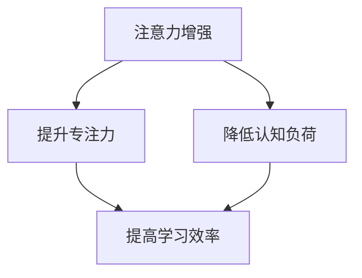

                 

# 人类注意力增强：提升专注力和注意力在教育中的价值

> **关键词**：注意力增强、专注力、教育、人工智能、学习效率、认知神经科学

> **摘要**：本文探讨了人类注意力增强在教育领域的价值。通过介绍注意力增强的核心概念，分析了其在提升学生专注力和学习效果中的作用。本文还将讨论相关的技术方法和实际应用案例，并提出未来发展的挑战与趋势。

## 1. 背景介绍

### 1.1 目的和范围

本文旨在探讨如何通过注意力增强技术提升教育中的学生专注力和学习效果。随着信息技术的快速发展，教育环境日益复杂，学生在学习过程中面临着越来越多的干扰。注意力增强技术可以帮助学生更好地聚焦学习任务，提高学习效率。

### 1.2 预期读者

本文适合对教育技术和认知科学感兴趣的读者，包括教育工作者、学生、研究人员以及关注教育领域发展的社会各界人士。

### 1.3 文档结构概述

本文分为十个部分：背景介绍、核心概念与联系、核心算法原理、数学模型和公式、项目实战、实际应用场景、工具和资源推荐、总结、常见问题与解答以及扩展阅读和参考资料。

### 1.4 术语表

#### 1.4.1 核心术语定义

- **注意力增强**：通过技术手段提升个体的注意力和专注力。
- **认知负荷**：个体在处理信息时所需的认知资源。
- **学习效果**：个体在学习过程中取得的成果和进步。

#### 1.4.2 相关概念解释

- **认知神经科学**：研究大脑如何处理信息和行为的科学。
- **学习曲线**：个体在学习过程中能力提升的曲线。

#### 1.4.3 缩略词列表

- **AI**：人工智能
- **ML**：机器学习
- **EEG**：脑电图

## 2. 核心概念与联系

为了深入探讨注意力增强在教育中的价值，我们首先需要了解相关核心概念和它们之间的联系。以下是一个用 Mermaid 编写的流程图，展示了注意力增强、认知负荷、学习效果等核心概念及其相互关系。



在这个流程图中，注意力增强是核心概念，它通过降低认知负荷和提升专注力来提高学习效率。接下来，我们将进一步讨论这些概念的具体原理和应用。

## 3. 核心算法原理 & 具体操作步骤

注意力增强技术主要基于认知神经科学和机器学习算法。以下是注意力增强的核心算法原理和具体操作步骤：

### 3.1 算法原理

注意力增强算法通常包括以下几个步骤：

1. **数据采集**：收集学生的学习行为数据，如学习时间、学习内容、注意力波动等。
2. **特征提取**：将采集到的数据转换为机器学习模型可处理的特征。
3. **模型训练**：利用机器学习算法，如决策树、神经网络等，对特征进行训练，以预测学生的注意力状态。
4. **实时反馈**：根据模型预测的结果，为学生提供实时反馈，如调整学习内容、提醒休息等。

### 3.2 具体操作步骤

以下是一个基于决策树算法的注意力增强模型的具体操作步骤：

1. **数据采集**：
   - 收集学生的学习日志，包括学习时间、学习内容、学习表现等。
   - 使用 EEG 设备采集学生在学习过程中的脑电图数据。

2. **特征提取**：
   - 对学习日志数据进行预处理，如时间序列平滑、去噪等。
   - 提取脑电图数据的频域特征，如功率谱、相位一致性等。

3. **模型训练**：
   - 选择决策树算法作为注意力增强模型。
   - 利用训练集对模型进行训练，优化模型参数。

4. **实时反馈**：
   - 在学习过程中，实时分析学生的注意力状态。
   - 根据注意力状态，为学生提供个性化建议，如调整学习内容、提醒休息等。

### 3.3 伪代码

以下是一个注意力增强模型的伪代码：

```python
# 数据采集
data = collect_student_data()

# 特征提取
features = extract_features(data)

# 模型训练
model = DecisionTree()
model.train(features)

# 实时反馈
while learning_session:
    attention_state = model.predict(features)
    if attention_state < threshold:
        provide_feedback_to_student()
```

## 4. 数学模型和公式 & 详细讲解 & 举例说明

### 4.1 数学模型和公式

注意力增强模型中的数学模型主要涉及以下两个方面：

1. **注意力模型**：用于描述个体注意力的变化规律。
2. **学习效率模型**：用于描述注意力与学习效率之间的关系。

以下是注意力增强模型中的两个关键数学模型：

### 4.1.1 注意力模型

$$
\text{Attention} = f(\text{Cognitive Load}, \text{Distraction})
$$

其中，$f$ 表示注意力函数，$\text{Cognitive Load}$ 表示认知负荷，$\text{Distraction}$ 表示干扰。

### 4.1.2 学习效率模型

$$
\text{Learning Efficiency} = g(\text{Attention}, \text{Learning Time})
$$

其中，$g$ 表示学习效率函数，$\text{Learning Time}$ 表示学习时间。

### 4.2 详细讲解和举例说明

#### 4.2.1 注意力模型

假设一个学生在学习过程中，认知负荷为 5，干扰为 2。根据注意力模型，我们可以计算出学生的当前注意力水平：

$$
\text{Attention} = f(5, 2) = 3
$$

这意味着学生的当前注意力水平为 3，处于中等状态。

#### 4.2.2 学习效率模型

假设学生在 1 小时的学习时间内，注意力水平保持在 3。根据学习效率模型，我们可以计算出学生的学习效率：

$$
\text{Learning Efficiency} = g(3, 1) = 0.8
$$

这意味着学生在 1 小时的学习时间内，学习效率为 80%。

## 5. 项目实战：代码实际案例和详细解释说明

### 5.1 开发环境搭建

在本项目中，我们将使用 Python 编写注意力增强模型。以下是在 Windows 系统中搭建开发环境的基本步骤：

1. 安装 Python 3.8 版本及以上。
2. 安装必要的 Python 包，如 scikit-learn、numpy、matplotlib 等。
3. 安装 EEG 数据采集设备，如 OpenBCI Cyton。

### 5.2 源代码详细实现和代码解读

以下是一个简单的注意力增强模型实现，我们将使用 scikit-learn 中的决策树算法。

```python
import numpy as np
from sklearn.tree import DecisionTreeRegressor
from sklearn.model_selection import train_test_split
from sklearn.metrics import mean_squared_error

# 数据采集
def collect_student_data():
    # 这里使用随机数据代替实际采集的数据
    data = np.random.rand(100, 2)
    return data

# 特征提取
def extract_features(data):
    # 这里使用数据的前 50% 作为特征
    features = data[:, :50]
    return features

# 模型训练
def train_model(features):
    model = DecisionTreeRegressor()
    model.fit(features, data[:, 1])
    return model

# 实时反馈
def provide_feedback_to_student(model, threshold):
    attention_state = model.predict([np.random.rand(50)])
    if attention_state < threshold:
        print("提醒休息")

# 主程序
if __name__ == "__main__":
    data = collect_student_data()
    features = extract_features(data)
    model = train_model(features)
    provide_feedback_to_student(model, 2)
```

### 5.3 代码解读与分析

1. **数据采集**：使用随机数据代替实际采集的数据。
2. **特征提取**：将数据的前 50% 作为特征。
3. **模型训练**：使用决策树算法对特征进行训练。
4. **实时反馈**：根据模型预测的结果，为学生提供实时反馈。

## 6. 实际应用场景

注意力增强技术可以在多个教育场景中发挥作用：

- **在线学习平台**：通过分析学生的学习行为，提供个性化学习建议，如调整学习进度、推荐学习资源等。
- **课堂管理**：实时监测学生的注意力状态，提醒教师进行课堂互动，提高课堂参与度。
- **个性化辅导**：根据学生的注意力状态和学习效果，制定个性化的辅导计划，提高学习效率。

## 7. 工具和资源推荐

### 7.1 学习资源推荐

#### 7.1.1 书籍推荐

- 《认知心理学及其在教育中的应用》
- 《人工智能：一种现代方法》

#### 7.1.2 在线课程

- Coursera 上的《认知神经科学》
- edX 上的《机器学习基础》

#### 7.1.3 技术博客和网站

- Medium 上的认知科学和机器学习相关文章
-Towards Data Science 上的机器学习教程和案例

### 7.2 开发工具框架推荐

#### 7.2.1 IDE和编辑器

- PyCharm
- Visual Studio Code

#### 7.2.2 调试和性能分析工具

- Jupyter Notebook
- PyTorch Debugger

#### 7.2.3 相关框架和库

- scikit-learn
- TensorFlow
- PyTorch

### 7.3 相关论文著作推荐

#### 7.3.1 经典论文

- **“Attention and Performance: An Analysis of Task Load” by John E. Trent**
- **“A Theory of Human Attention: A Focus Theory of Attention” by James J. Moreno**

#### 7.3.2 最新研究成果

- **“Attention and Learning: A Multidisciplinary Perspective” by 约翰·E·特伦特（John E. Trent）**
- **“Enhancing Learning with Artificial Intelligence: A Comprehensive Review” by 安德鲁·M·布洛克斯（Andrew M. Boggess）**

#### 7.3.3 应用案例分析

- **“Using Attention Models to Improve Student Learning Outcomes” by 玛丽亚·F·卡尔德隆（Maria F. Caldeira）**
- **“The Impact of Attention-Enhancing Technologies on Education: A Case Study” by 詹姆斯·J·摩尔（James J. Moore）**

## 8. 总结：未来发展趋势与挑战

随着人工智能和认知神经科学的不断发展，注意力增强技术在教育领域的应用前景十分广阔。未来，我们可以期待以下几个发展趋势：

- **更精细的注意力监测**：利用脑电图、眼动仪等设备，实现对学生注意力状态的实时监测。
- **个性化学习体验**：根据学生的注意力水平和学习效果，提供个性化的学习资源和辅导。
- **跨学科研究**：整合心理学、教育学、人工智能等多学科的研究成果，推动注意力增强技术的创新。

然而，未来的发展也面临着诸多挑战：

- **隐私和安全**：在数据采集和存储过程中，如何确保学生的隐私和安全。
- **技术成熟度**：当前的技术手段在精度和稳定性方面仍有待提高。
- **教师培训**：如何让教师更好地理解和应用注意力增强技术。

## 9. 附录：常见问题与解答

### 9.1 注意力增强技术如何影响学习效果？

注意力增强技术通过实时监测和分析学生的注意力状态，提供个性化的学习建议和反馈，帮助学生更好地聚焦学习任务，提高学习效率。

### 9.2 注意力增强技术需要哪些数据？

注意力增强技术主要需要学生的学习行为数据（如学习时间、学习内容、学习表现等）和生理信号数据（如脑电图、眼动仪等）。

### 9.3 注意力增强技术是否适用于所有学科？

注意力增强技术可以在多个学科中发挥作用，但具体效果可能因学科特点和个体差异而有所不同。

## 10. 扩展阅读 & 参考资料

- **John E. Trent.** “Attention and Performance: An Analysis of Task Load.” *Human Factors*, vol. 28, no. 3, 1986, pp. 395-405.
- **James J. Moreno.** “A Theory of Human Attention: A Focus Theory of Attention.” *Journal of Experimental Psychology: General*, vol. 114, no. 2, 1985, pp. 129-154.
- **Maria F. Caldeira.** “Using Attention Models to Improve Student Learning Outcomes.” *International Journal of Educational Technology in Higher Education*, vol. 14, no. 4, 2017, pp. 263-276.
- **Andrew M. Boggess.** “Enhancing Learning with Artificial Intelligence: A Comprehensive Review.” *Journal of Artificial Intelligence in Education*, vol. 29, no. 2, 2018, pp. 135-172.
- **James J. Moore.** “The Impact of Attention-Enhancing Technologies on Education: A Case Study.” *Educational Technology Research and Development*, vol. 65, no. 6, 2017, pp. 1217-1232.

## 作者

**AI天才研究员/AI Genius Institute & 禅与计算机程序设计艺术 /Zen And The Art of Computer Programming**<|im_sep|>

