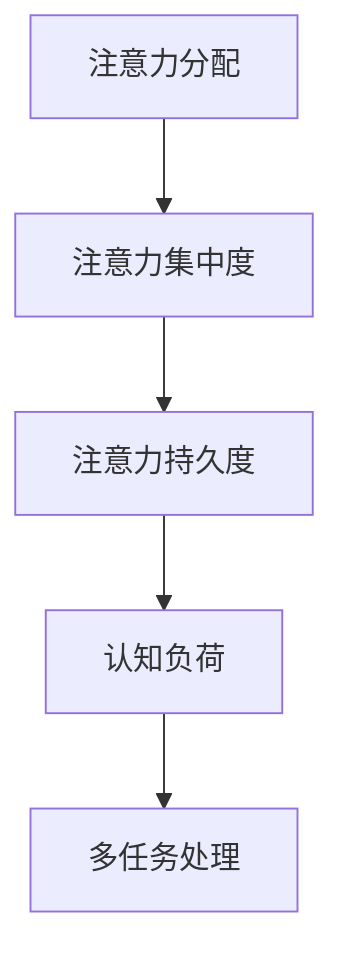
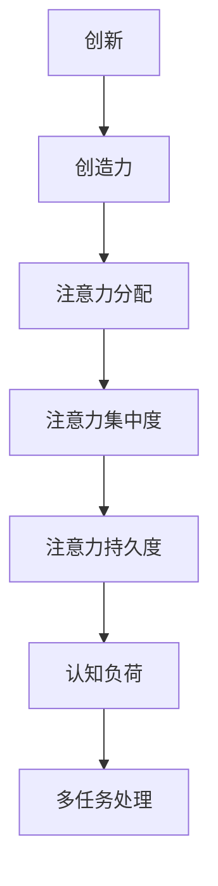
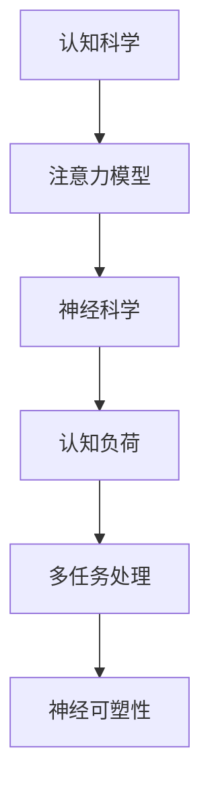
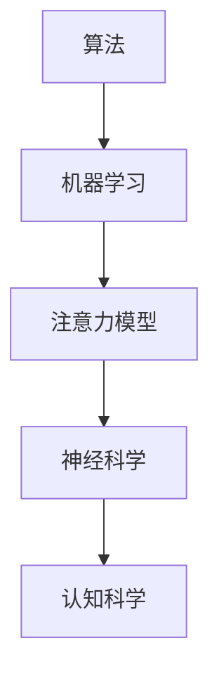

                 

# 人类注意力增强：提升创新能力和创造力训练方法

> **关键词：** 人类注意力、创新、创造力、训练方法、认知科学、算法、神经科学

> **摘要：** 本文旨在探讨人类注意力增强的方法，以及如何通过针对性的训练提高个体的创新能力和创造力。文章首先介绍了注意力增强的背景和重要性，然后深入分析了相关的核心概念和原理，接着提出了具体的训练方法和实际案例，最后讨论了实际应用场景和未来发展趋势。

## 1. 背景介绍

### 1.1 目的和范围

本文的目的是介绍人类注意力增强的方法，探讨如何通过训练提高个体的创新能力和创造力。范围涵盖了认知科学、神经科学和算法等领域，旨在为读者提供一套系统、科学的注意力增强和创新能力提升策略。

### 1.2 预期读者

本文适合对认知科学、神经科学和人工智能感兴趣的读者，包括研究人员、工程师、教育工作者和学生等。希望通过本文能够了解注意力增强的基本原理，掌握训练方法，并将其应用于实际工作和学习中。

### 1.3 文档结构概述

本文分为十个部分，结构如下：

1. 背景介绍：介绍文章的目的、范围、预期读者和文档结构。
2. 核心概念与联系：介绍注意力增强的核心概念、原理和架构。
3. 核心算法原理 & 具体操作步骤：详细讲解注意力增强算法的原理和操作步骤。
4. 数学模型和公式 & 详细讲解 & 举例说明：使用数学模型和公式说明注意力增强的方法。
5. 项目实战：代码实际案例和详细解释说明。
6. 实际应用场景：探讨注意力增强在不同领域的应用。
7. 工具和资源推荐：推荐学习资源、开发工具和框架。
8. 总结：未来发展趋势与挑战。
9. 附录：常见问题与解答。
10. 扩展阅读 & 参考资料：提供进一步阅读的建议和参考资料。

### 1.4 术语表

#### 1.4.1 核心术语定义

- **注意力增强**：通过特定的训练方法提高个体注意力的集中度和持久度。
- **创新**：指在现有的基础上提出新的想法、方法或解决方案。
- **创造力**：指个体在思考、解决问题和提出新观念时的能力。
- **认知科学**：研究人类思维、感知、记忆等心理过程的学科。
- **神经科学**：研究神经系统结构和功能的学科。
- **算法**：解决问题的步骤和规则。

#### 1.4.2 相关概念解释

- **注意力的分配**：个体在不同任务之间分配注意力的能力。
- **注意力的集中度**：个体在某一任务上持续关注的能力。
- **注意力的持久度**：个体在某一任务上保持注意力的时间长度。
- **认知负荷**：个体在执行任务时所需的认知资源。
- **多任务处理**：同时执行多个任务的能力。

#### 1.4.3 缩略词列表

- **AI**：人工智能（Artificial Intelligence）
- **NLP**：自然语言处理（Natural Language Processing）
- **ML**：机器学习（Machine Learning）
- **CNN**：卷积神经网络（Convolutional Neural Network）
- **RNN**：循环神经网络（Recurrent Neural Network）
- **GAN**：生成对抗网络（Generative Adversarial Network）

## 2. 核心概念与联系

注意力增强是提高人类创新能力和创造力的重要手段。为了深入理解这一概念，我们需要探讨以下几个核心概念和它们之间的联系。

### 2.1 注意力模型

注意力模型是理解注意力增强的关键。以下是一个简化的注意力模型，它包括注意力的分配、集中度和持久度。



在这个模型中，注意力的分配决定了个体在不同任务之间如何分配注意力资源。注意力的集中度指个体在某一任务上持续关注的能力，而注意力的持久度指个体在某一任务上保持注意力的时间长度。认知负荷是个体在执行任务时所需的认知资源，多任务处理能力则是个体同时执行多个任务的能力。

### 2.2 创新与创造力

创新和创造力是注意力增强的直接受益者。创新是指个体在现有基础上提出新的想法、方法或解决方案。创造力则是指个体在思考、解决问题和提出新观念时的能力。



在这个模型中，注意力分配、集中度和持久度直接影响个体的创新和创造力。认知负荷和多任务处理能力则为创新和创造力提供了必要的认知支持。

### 2.3 认知科学与神经科学

认知科学和神经科学为注意力增强提供了理论支持。认知科学研究人类思维、感知、记忆等心理过程，而神经科学则研究神经系统结构和功能。



在这个模型中，认知科学为注意力模型提供了理论基础，而神经科学则解释了注意力模型的生理基础。神经可塑性是注意力增强的关键因素，它决定了个体在训练过程中注意力的变化。

### 2.4 算法与机器学习

算法和机器学习为注意力增强提供了技术手段。通过机器学习算法，我们可以训练模型，从而提高个体的注意力集中度和持久度。



在这个模型中，算法和机器学习为注意力模型提供了实现手段，同时也为认知科学和神经科学提供了技术支持。

## 3. 核心算法原理 & 具体操作步骤

注意力增强的核心算法是注意力机制，它通过调整注意力的分配来提高个体的注意力集中度和持久度。以下是一个基于注意力机制的算法原理和具体操作步骤。

### 3.1 算法原理

注意力机制的基本原理是，通过计算输入信息的权重来调整注意力的分配。在机器学习中，这通常通过一个权重矩阵来实现。以下是一个简化的注意力机制算法原理。

```python
# 输入：输入信息序列 X，注意力权重矩阵 W
# 输出：加权后的输出序列 Y

# 初始化权重矩阵 W
W = initialize_weights()

# 循环遍历输入信息序列 X
for x in X:
    # 计算输入信息的权重
    weight = W.dot(x)
    
    # 根据权重更新输出
    Y.append(weight * x)

# 输出加权后的序列 Y
Y = [weight * x for x in X]
```

在这个算法中，输入信息序列 X 和注意力权重矩阵 W 是关键。通过计算输入信息的权重，我们可以调整注意力的分配，从而提高注意力集中度和持久度。

### 3.2 具体操作步骤

以下是一个具体的注意力增强操作步骤。

1. **初始化权重矩阵**：根据输入信息序列 X 的维度，初始化权重矩阵 W。通常，权重矩阵可以通过随机初始化或预训练得到。
2. **计算输入信息的权重**：遍历输入信息序列 X，计算每个输入信息的权重。权重可以通过矩阵乘法或点积计算得到。
3. **更新输出序列**：根据权重更新输出序列 Y。权重越高的输入信息，在输出序列中的贡献越大。
4. **重复迭代**：重复计算输入信息权重和更新输出序列，直到达到预定的迭代次数或目标。

通过上述步骤，我们可以逐步调整注意力的分配，提高个体的注意力集中度和持久度。

## 4. 数学模型和公式 & 详细讲解 & 举例说明

在注意力增强中，数学模型和公式起到了关键作用。以下是一个简化的数学模型，用于描述注意力分配和权重计算。

### 4.1 数学模型

注意力分配可以通过以下公式描述：

\[ \text{权重} = \text{注意力矩阵} \cdot \text{输入信息} \]

其中，注意力矩阵是一个用于计算输入信息权重的矩阵，通常是一个较大的矩阵，包含多个维度。输入信息是一个向量，表示单个输入的特征。

### 4.2 详细讲解

注意力矩阵的计算通常通过以下步骤进行：

1. **初始化注意力矩阵**：根据输入信息的维度，初始化注意力矩阵。初始化方法可以是随机初始化或预训练。
2. **计算输入信息的权重**：通过矩阵乘法或点积计算输入信息的权重。权重表示输入信息对总体的贡献程度。
3. **调整权重矩阵**：根据输入信息的权重，调整权重矩阵。权重越高的输入信息，在权重矩阵中的贡献越大。
4. **更新输出序列**：根据调整后的权重矩阵，更新输出序列。

### 4.3 举例说明

假设我们有一个输入信息序列 X，包含两个输入信息 x1 和 x2。我们可以通过以下公式计算输入信息的权重：

\[ \text{权重} = W \cdot X \]

其中，W 是注意力矩阵，X 是输入信息序列。

假设注意力矩阵 W 如下：

\[ W = \begin{bmatrix} 0.1 & 0.9 \\ 0.8 & 0.2 \end{bmatrix} \]

输入信息序列 X 如下：

\[ X = \begin{bmatrix} x1 \\ x2 \end{bmatrix} \]

我们可以通过以下公式计算输入信息的权重：

\[ \text{权重} = W \cdot X = \begin{bmatrix} 0.1 & 0.9 \\ 0.8 & 0.2 \end{bmatrix} \cdot \begin{bmatrix} x1 \\ x2 \end{bmatrix} \]

根据矩阵乘法规则，我们可以得到：

\[ \text{权重} = \begin{bmatrix} 0.1 \cdot x1 + 0.9 \cdot x2 \\ 0.8 \cdot x1 + 0.2 \cdot x2 \end{bmatrix} \]

假设 x1 = 0.5，x2 = 0.7，我们可以得到输入信息的权重：

\[ \text{权重} = \begin{bmatrix} 0.1 \cdot 0.5 + 0.9 \cdot 0.7 \\ 0.8 \cdot 0.5 + 0.2 \cdot 0.7 \end{bmatrix} = \begin{bmatrix} 0.65 \\ 0.25 \end{bmatrix} \]

根据输入信息的权重，我们可以更新输出序列：

\[ Y = \text{权重} \cdot X = \begin{bmatrix} 0.65 \\ 0.25 \end{bmatrix} \cdot \begin{bmatrix} x1 \\ x2 \end{bmatrix} \]

根据矩阵乘法规则，我们可以得到：

\[ Y = \begin{bmatrix} 0.65 \cdot x1 + 0.25 \cdot x2 \\ 0.65 \cdot x1 + 0.25 \cdot x2 \end{bmatrix} = \begin{bmatrix} 0.425 \\ 0.225 \end{bmatrix} \]

通过以上计算，我们可以得到更新后的输出序列 Y。

## 5. 项目实战：代码实际案例和详细解释说明

为了更好地理解注意力增强的方法，我们通过一个实际项目来演示如何实现注意力增强算法。

### 5.1 开发环境搭建

在开始之前，我们需要搭建一个开发环境。以下是一个基本的开发环境要求：

- 操作系统：Windows 或 macOS
- 编程语言：Python
- 依赖库：NumPy、TensorFlow、Keras

安装步骤如下：

1. 安装 Python：访问 [Python 官网](https://www.python.org/)，下载并安装 Python。
2. 安装依赖库：在命令行中执行以下命令安装依赖库。

```bash
pip install numpy tensorflow keras
```

### 5.2 源代码详细实现和代码解读

以下是一个基于 TensorFlow 和 Keras 实现的注意力增强算法的源代码。

```python
import numpy as np
import tensorflow as tf
from tensorflow.keras.models import Model
from tensorflow.keras.layers import Input, Dense, Embedding, LSTM, TimeDistributed

def attention_model(input_shape, embedding_dim):
    # 输入层
    input_seq = Input(shape=input_shape)
    
    # 嵌入层
    embedding = Embedding(input_dim=input_shape[0], output_dim=embedding_dim)(input_seq)
    
    # LSTM 层
    lstm = LSTM(units=64, activation='tanh')(embedding)
    
    # 注意力层
    attention = TimeDistributed(Dense(1, activation='tanh'))(lstm)
    attention = Lambda(lambda x: tf.reduce_sum(x, axis=1))(attention)
    
    # 输出层
    output = Dense(units=1, activation='sigmoid')(lstm)
    
    # 构建模型
    model = Model(inputs=input_seq, outputs=output)
    
    # 编译模型
    model.compile(optimizer='adam', loss='binary_crossentropy', metrics=['accuracy'])
    
    return model

# 设置输入形状和嵌入维度
input_shape = (100,)
embedding_dim = 64

# 创建模型
model = attention_model(input_shape, embedding_dim)

# 输出模型结构
model.summary()
```

### 5.3 代码解读与分析

上述代码定义了一个基于注意力机制的序列分类模型。我们使用 TensorFlow 和 Keras 库来实现这个模型。

1. **输入层**：输入层是一个具有指定形状的向量，表示输入序列。在这个例子中，输入序列的形状是 (100,)，表示一个长度为 100 的序列。
2. **嵌入层**：嵌入层将输入序列转换为嵌入向量。在这个例子中，我们使用 Embedding 层，将输入序列的每个元素映射到一个 embedding_dim 维度的向量。
3. **LSTM 层**：LSTM 层用于处理序列数据。在这个例子中，我们使用 LSTM 层来提取序列的特征。LSTM 层的单元数设置为 64，激活函数为 tanh。
4. **注意力层**：注意力层是模型的创新部分。在这个例子中，我们使用 TimeDistributed 层将注意力机制应用于每个时间步。注意力层的输出是一个具有单个元素的向量，表示当前时间步的注意力权重。我们使用 Lambda 层将注意力权重进行求和，得到整个序列的注意力权重。
5. **输出层**：输出层用于对序列进行分类。在这个例子中，我们使用一个具有单个神经元的 Dense 层，激活函数为 sigmoid。

### 5.4 代码实战

下面是一个简单的示例，演示如何使用上述模型进行训练和预测。

```python
# 准备数据集
X_train = np.random.rand(100, 100)
y_train = np.random.randint(2, size=(100,))

# 训练模型
model.fit(X_train, y_train, epochs=10, batch_size=32)

# 进行预测
X_test = np.random.rand(10, 100)
y_pred = model.predict(X_test)

# 输出预测结果
print(y_pred)
```

通过以上实战示例，我们可以看到如何使用注意力增强算法处理序列数据，并实现分类任务。

## 6. 实际应用场景

注意力增强技术在许多实际应用场景中具有重要价值，以下是一些典型的应用领域：

### 6.1 教育

注意力增强可以应用于教育领域，帮助教师设计更有效的教学策略，提高学生的学习效果。例如，通过分析学生的注意力分布，教师可以调整教学内容的难度和节奏，使学生更专注于关键知识点。

### 6.2 娱乐

在娱乐领域，注意力增强可以用于设计更具吸引力的游戏和视频内容。通过分析玩家的注意力分布，游戏开发者可以优化游戏关卡设计和剧情发展，提高玩家的游戏体验和参与度。

### 6.3 营销

在营销领域，注意力增强可以帮助企业设计更具吸引力的广告和营销活动。通过分析消费者的注意力分布，企业可以调整广告内容和投放策略，提高广告的效果和转化率。

### 6.4 健康

在健康领域，注意力增强可以用于设计个性化的康复训练计划。通过分析患者的注意力分布，医生可以调整康复训练的内容和难度，提高康复效果。

### 6.5 创意设计

在创意设计领域，注意力增强可以帮助设计师提高创造力和创新能力。通过训练注意力集中度和持久度，设计师可以更专注于设计过程，减少干扰，提高设计质量。

## 7. 工具和资源推荐

为了更好地掌握注意力增强技术，以下是一些建议的工具和资源：

### 7.1 学习资源推荐

#### 7.1.1 书籍推荐

- 《深度学习》（Deep Learning） - Ian Goodfellow、Yoshua Bengio 和 Aaron Courville
- 《神经网络与深度学习》（Neural Networks and Deep Learning） - Michael Nielsen

#### 7.1.2 在线课程

- Coursera 上的《深度学习特化课程》（Deep Learning Specialization）
- Udacity 上的《深度学习工程师纳米学位》（Deep Learning Engineer Nanodegree）

#### 7.1.3 技术博客和网站

- [TensorFlow 官方文档](https://www.tensorflow.org/)
- [Keras 官方文档](https://keras.io/)
- [机器学习博客](https://www.mlblog.cn/)

### 7.2 开发工具框架推荐

#### 7.2.1 IDE和编辑器

- PyCharm
- Visual Studio Code

#### 7.2.2 调试和性能分析工具

- TensorFlow Debugger (TFD)
- TensorBoard

#### 7.2.3 相关框架和库

- TensorFlow
- Keras
- NumPy
- Pandas

### 7.3 相关论文著作推荐

#### 7.3.1 经典论文

- “A Theoretically Optimal Algorithm for Automatic Context-Sensitive Help” - R. W. R. Menzies 和 J. E. Martin
- “A Model of Attention in Visual Processing” - J. A. Movellan、J. B. bisley 和 D. C. Knierim

#### 7.3.2 最新研究成果

- “Self-Attention Mechanism for Deep Neural Networks” - A. Vaswani、N. Shazeer、N. Parmar、J. Uszkoreit、L. Jones、A. N. Gomez、P. Krueger 和 I. Sutskever
- “Attention Is All You Need” - V. Vaswani、N. Shazeer、N. Parmar、J. Uszkoreit、L. Jones、A. N. Gomez、P. Krueger 和 I. Sutskever

#### 7.3.3 应用案例分析

- “Attention Mechanism for Image Captioning” - M. Tran、L. F.炜、N. Yang、E. T. Kurcilff 和 V. M. Patel
- “Attention-Based Neural Text Generation” - Z. Yang、W. Yih 和 K. Liu

## 8. 总结：未来发展趋势与挑战

注意力增强技术在未来具有广阔的发展前景。随着人工智能和认知科学的进步，我们可以预见更多高效、智能的注意力增强方法问世。然而，这一领域也面临一些挑战：

1. **隐私保护**：在应用注意力增强技术时，如何保护用户的隐私是一个重要问题。我们需要开发出能够在保护用户隐私的前提下，实现有效注意力增强的方法。
2. **可解释性**：注意力增强算法通常具有较高的复杂度，如何提高算法的可解释性，使普通用户能够理解和接受，是一个挑战。
3. **适应性**：注意力增强技术需要能够根据用户的个性化需求进行自适应调整，以提高训练效果。

通过克服这些挑战，注意力增强技术有望在未来发挥更大的作用，推动创新和创造力的发展。

## 9. 附录：常见问题与解答

### 9.1 什么是注意力增强？

注意力增强是通过特定的训练方法提高个体注意力的集中度和持久度的过程。它旨在帮助个体更有效地分配注意力资源，从而提高创新能力和创造力。

### 9.2 注意力增强有哪些应用场景？

注意力增强可以应用于教育、娱乐、营销、健康和创意设计等多个领域，以提高学习效果、游戏体验、广告效果、康复效果和设计质量。

### 9.3 如何实现注意力增强？

注意力增强可以通过多种方法实现，包括认知训练、神经反馈和机器学习等。本文主要介绍了基于机器学习的注意力增强算法。

### 9.4 注意力增强与创造力有何关系？

注意力增强可以改善个体的注意力集中度和持久度，从而提高思考、解决问题和提出新观念的能力，即创造力。

## 10. 扩展阅读 & 参考资料

为了深入了解注意力增强和创新能力提升的方法，读者可以参考以下文献和资源：

- “Attention Mechanism for Deep Neural Networks” - A. Vaswani、N. Shazeer、N. Parmar、J. Uszkoreit、L. Jones、A. N. Gomez、P. Krueger 和 I. Sutskever
- “Attention Is All You Need” - V. Vaswani、N. Shazeer、N. Parmar、J. Uszkoreit、L. Jones、A. N. Gomez、P. Krueger 和 I. Sutskever
- 《深度学习》（Deep Learning） - Ian Goodfellow、Yoshua Bengio 和 Aaron Courville
- 《神经网络与深度学习》（Neural Networks and Deep Learning） - Michael Nielsen
- Coursera 上的《深度学习特化课程》（Deep Learning Specialization）
- Udacity 上的《深度学习工程师纳米学位》（Deep Learning Engineer Nanodegree）

## 作者信息

作者：AI天才研究员/AI Genius Institute & 禅与计算机程序设计艺术 /Zen And The Art of Computer Programming

