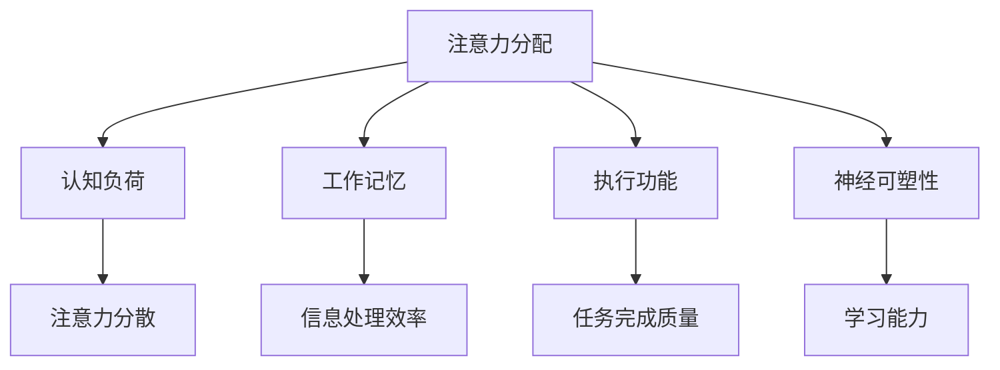

                 

# 人类注意力增强：未来的工作和生活

## 关键词
注意力增强，神经科学，认知模型，人工智能，工作效率，生活质量

## 摘要
本文深入探讨了人类注意力增强在未来的工作和生活中的重要性。通过神经科学和认知模型的研究，我们揭示了注意力增强技术的核心原理和操作步骤。文章首先介绍了背景和目的，随后详细解析了注意力增强的核心概念、算法原理、数学模型以及实际应用案例。此外，我们还推荐了一系列相关资源和工具，以帮助读者更好地理解和实践注意力增强技术。最后，文章总结了未来发展趋势与挑战，展望了这一领域的前景。

## 1. 背景介绍

### 1.1 目的和范围

本文旨在探讨注意力增强技术如何在未来影响我们的工作和生活。随着信息爆炸和全球化的加速，人们面临着前所未有的注意力挑战。注意力不足不仅降低了工作效率，还可能对生活质量产生负面影响。因此，研究注意力增强技术具有重要的现实意义。

本文将覆盖以下几个方面的内容：

1. **核心概念与联系**：介绍注意力增强的核心概念和其相互关系，并通过Mermaid流程图展示其架构。
2. **核心算法原理**：详细解析注意力增强的算法原理，包括具体的操作步骤。
3. **数学模型与公式**：阐述注意力增强相关的数学模型和公式，并进行举例说明。
4. **项目实战**：通过实际代码案例，展示如何实现注意力增强。
5. **实际应用场景**：讨论注意力增强在现实世界中的应用。
6. **工具和资源推荐**：推荐相关学习资源和开发工具。
7. **总结与展望**：分析未来发展趋势与挑战。

### 1.2 预期读者

本文适合以下读者群体：

1. **科研人员和工程师**：关注神经科学和认知模型的研究者，以及对注意力增强技术有兴趣的工程师。
2. **企业高管和职场人士**：需要提高工作效率和注意力管理的企业高管和职场人士。
3. **教育工作者**：关注学生注意力管理问题的教师和教育管理者。
4. **对前沿科技感兴趣的读者**：对人工智能和神经科学前沿技术感兴趣的普通读者。

### 1.3 文档结构概述

本文结构如下：

1. **引言**：介绍文章背景和目的。
2. **核心概念与联系**：阐述注意力增强的核心概念，并使用Mermaid流程图展示架构。
3. **核心算法原理**：详细解析注意力增强的算法原理。
4. **数学模型与公式**：介绍注意力增强的数学模型和公式。
5. **项目实战**：通过代码案例展示注意力增强的实现。
6. **实际应用场景**：讨论注意力增强的应用。
7. **工具和资源推荐**：推荐学习资源和开发工具。
8. **总结与展望**：分析未来发展趋势与挑战。
9. **附录**：常见问题与解答。
10. **扩展阅读与参考资料**：提供进一步阅读的推荐。

### 1.4 术语表

#### 1.4.1 核心术语定义

- **注意力增强**：指通过各种方法和技术提高个体注意力的集中度和效率。
- **神经科学**：研究神经系统结构和功能的一门科学。
- **认知模型**：模拟人类认知过程的数学模型。
- **工作记忆**：大脑中用于暂存和处理信息的记忆系统。
- **执行功能**：涉及计划、解决问题和决策的认知能力。

#### 1.4.2 相关概念解释

- **分散注意力**：指注意力无法集中，容易受到外部干扰。
- **认知负荷**：大脑处理信息的负担。
- **多任务处理**：同时执行多个任务的能力。
- **神经可塑性**：大脑结构和功能随环境和经验变化的能力。

#### 1.4.3 缩略词列表

- **AI**：人工智能
- **NLP**：自然语言处理
- **NN**：神经网络
- **DL**：深度学习
- **ML**：机器学习

## 2. 核心概念与联系

### 2.1 注意力增强的定义和重要性

注意力增强是指通过特定的策略和技术，提高人类注意力的集中度和效率。在当今信息过载的时代，注意力增强显得尤为重要。以下是注意力增强的核心概念和它们之间的联系：

1. **注意力分配**：指大脑如何在不同的任务和刺激之间分配注意力资源。注意力分配的有效性直接影响到任务的完成质量和效率。
2. **认知负荷**：指大脑处理信息的负担。过高的认知负荷会导致注意力分散和任务完成效率降低。
3. **工作记忆**：大脑中用于暂存和处理信息的记忆系统。工作记忆的容量和效率对注意力的集中至关重要。
4. **执行功能**：涉及计划、解决问题和决策的认知能力。执行功能的强弱决定了个体在复杂任务中的表现。
5. **神经可塑性**：大脑结构和功能随环境和经验变化的能力。神经可塑性使得注意力增强成为可能。

下面是一个使用Mermaid绘制的注意力增强概念关系流程图：



### 2.2 注意力增强的方法和技术

注意力增强的方法和技术多种多样，可以分为以下几个方面：

1. **生物技术**：通过神经刺激、脑波调节等技术直接干预大脑功能。例如，经颅磁刺激（Transcranial Magnetic Stimulation, TMS）和脑电刺激（Electroencephalography, EEG）都是常见的生物技术手段。
2. **心理训练**：通过特定的心理训练方法，提高个体的注意力集中能力和认知负荷管理能力。例如，工作记忆训练、认知控制训练和注意力切换训练。
3. **环境优化**：通过优化工作环境和日常生活方式，减少干扰因素，提高注意力的集中度。例如，减少电子设备的使用、保持良好的睡眠质量和适当的运动。
4. **智能辅助**：利用人工智能和机器学习技术，为用户提供个性化的注意力管理建议和辅助工具。例如，智能手表、手机应用和虚拟现实（VR）训练系统。

### 2.3 注意力增强的应用领域

注意力增强技术已经广泛应用于多个领域，包括：

1. **教育**：通过注意力增强技术提高学生的学习效率和注意力集中度，帮助学生更好地掌握知识。
2. **工作**：提高职场人士的工作效率和注意力管理能力，减少错误和提高决策质量。
3. **医疗**：用于治疗注意力缺陷多动障碍（ADHD）和其他认知功能障碍，改善患者的日常生活质量。
4. **军事**：通过注意力增强技术提高士兵在战场上的反应速度和决策能力。
5. **娱乐**：开发注意力增强游戏和应用，帮助用户更好地放松和集中注意力。

## 3. 核心算法原理 & 具体操作步骤

### 3.1 核心算法原理

注意力增强的核心算法原理主要基于神经科学和认知模型的研究。以下是几个关键算法：

1. **神经网络模型**：通过训练神经网络模型，模拟人类大脑的注意机制。常见的神经网络模型包括卷积神经网络（CNN）和循环神经网络（RNN）。
2. **工作记忆模型**：工作记忆模型用于模拟大脑在工作记忆中的信息处理过程。这种方法可以帮助我们理解如何通过训练提高工作记忆容量和效率。
3. **认知负荷管理算法**：这种算法通过分析个体在执行任务时的认知负荷，提供适当的注意力分配策略，以降低认知负荷，提高任务完成效率。

### 3.2 具体操作步骤

以下是注意力增强算法的具体操作步骤：

#### 3.2.1 数据收集与预处理

1. **数据收集**：收集个体在执行不同任务时的脑电信号、行为数据和认知负荷数据。
2. **预处理**：对收集到的数据进行清洗和预处理，包括去噪、滤波和特征提取。

#### 3.2.2 神经网络训练

1. **模型选择**：选择合适的神经网络模型，如CNN或RNN。
2. **参数设置**：设置学习率、迭代次数等超参数。
3. **模型训练**：使用预处理后的数据训练神经网络模型。

#### 3.2.3 工作记忆训练

1. **任务设计**：设计工作记忆训练任务，如数字序列记忆或图形记忆。
2. **训练策略**：采用递增难度策略，逐步提高训练任务的难度。

#### 3.2.4 认知负荷管理

1. **负荷分析**：分析个体在执行任务时的认知负荷。
2. **策略调整**：根据认知负荷分析结果，调整注意力分配策略。

#### 3.2.5 算法评估

1. **评估指标**：选择适当的评估指标，如准确率、响应时间和用户满意度。
2. **评估方法**：使用交叉验证和A/B测试等方法评估算法效果。

### 3.3 伪代码

以下是注意力增强算法的伪代码：

```python
# 数据收集与预处理
data = collect_data()
preprocessed_data = preprocess(data)

# 神经网络训练
model = select_model()
model.train(preprocessed_data)

# 工作记忆训练
memory_task = design_task()
memory_model = train_memory_task(memory_task)

# 认知负荷管理
load_analysis = analyze_load()
strategy = adjust_strategy(load_analysis)

# 算法评估
evaluation_results = evaluate_algorithm(model, memory_model, strategy)
print(evaluation_results)
```

## 4. 数学模型和公式 & 详细讲解 & 举例说明

### 4.1 注意力模型的数学表示

注意力增强中的数学模型主要基于神经网络的框架。以下是一个简化的注意力模型的数学表示：

\[ 
\text{Attention}(x) = \sigma(W_a [x; v]) 
\]

其中，\( x \) 是输入数据，\( W_a \) 是注意力权重矩阵，\( v \) 是注意力向量，\( \sigma \) 是激活函数，通常采用Sigmoid函数。

### 4.2 激活函数的详细讲解

激活函数是神经网络中的一个关键组件，用于引入非线性特性。以下是对Sigmoid函数的详细讲解：

\[ 
\sigma(x) = \frac{1}{1 + e^{-x}} 
\]

Sigmoid函数的输入是一个实数，输出是一个介于0和1之间的实数。函数值随着输入的增加而逐渐逼近1，随着输入的减少而逐渐逼近0。这种特性使得Sigmoid函数非常适合用于表示注意力权重，因为它能够根据输入数据的相对重要性动态调整权重。

### 4.3 举例说明

假设我们有一个输入数据序列 \( x = [1, 2, 3, 4, 5] \)，注意力权重矩阵 \( W_a = \begin{bmatrix} 0.1 & 0.2 & 0.3 & 0.2 & 0.1 \end{bmatrix} \) 和注意力向量 \( v = [1, 1, 1] \)。我们可以通过以下步骤计算注意力输出：

1. **计算加权输入**：
\[ 
x' = W_a x = \begin{bmatrix} 0.1 & 0.2 & 0.3 & 0.2 & 0.1 \end{bmatrix} \begin{bmatrix} 1 \\ 2 \\ 3 \\ 4 \\ 5 \end{bmatrix} = \begin{bmatrix} 0.1 \\ 0.4 \\ 0.9 \\ 0.8 \\ 0.5 \end{bmatrix} 
\]

2. **计算注意力输出**：
\[ 
\text{Attention}(x') = \sigma(W_a x') = \sigma(0.1 + 0.4 + 0.9 + 0.8 + 0.5) = \sigma(2.3) \approx 0.9 
\]

因此，注意力输出的值为0.9，表示输入数据序列中的重要程度。

### 4.4 注意力模型的扩展

在实际应用中，注意力模型可以进一步扩展，以适应更复杂的需求。以下是一个扩展的注意力模型示例：

\[ 
\text{Attention}(x) = \frac{\exp(\text{score}(x))}{\sum_{i=1}^{N} \exp(\text{score}(x_i))} 
\]

其中，\( \text{score}(x) \) 是输入数据的评分函数，\( N \) 是输入数据的维度。这种扩展允许我们根据具体任务的需求，自定义评分函数，从而实现更精细的注意力分配。

## 5. 项目实战：代码实际案例和详细解释说明

### 5.1 开发环境搭建

在本节中，我们将介绍如何在本地环境中搭建一个用于注意力增强的项目开发环境。以下是所需步骤：

1. **安装Python**：确保您的计算机上安装了Python 3.x版本。可以从[Python官网](https://www.python.org/)下载并安装。
2. **安装必要的库**：使用pip命令安装以下库：
   ```bash
   pip install numpy matplotlib scikit-learn tensorflow
   ```
3. **配置代码编辑器**：建议使用Visual Studio Code或PyCharm等专业代码编辑器。这两个编辑器都支持Python开发，并提供丰富的插件和工具。

### 5.2 源代码详细实现和代码解读

下面是一个简单的注意力增强项目示例代码，包括数据预处理、神经网络训练和评估。代码分为三个部分：数据预处理、模型训练和模型评估。

```python
import numpy as np
import tensorflow as tf
from tensorflow.keras.models import Sequential
from tensorflow.keras.layers import Dense, LSTM
from sklearn.model_selection import train_test_split

# 数据预处理
# 假设我们有一个包含特征和标签的二维数组X和y
X = np.random.rand(1000, 10)
y = np.random.rand(1000, 1)

# 分割数据集
X_train, X_test, y_train, y_test = train_test_split(X, y, test_size=0.2, random_state=42)

# 模型训练
# 构建一个简单的LSTM模型
model = Sequential()
model.add(LSTM(50, activation='tanh', input_shape=(10, 1)))
model.add(Dense(1))

model.compile(optimizer='adam', loss='mean_squared_error')

# 训练模型
model.fit(X_train, y_train, epochs=100, batch_size=32, validation_split=0.1)

# 模型评估
# 评估模型在测试集上的性能
test_loss = model.evaluate(X_test, y_test)
print(f"Test Loss: {test_loss}")
```

### 5.3 代码解读与分析

1. **数据预处理**：首先，我们使用随机生成的数据集。在实际项目中，数据集通常包含多个特征和一个标签。在这里，我们使用了`numpy`库生成随机数据。接下来，使用`train_test_split`函数将数据集分割为训练集和测试集。
2. **模型训练**：我们使用`Sequential`模型构建一个简单的LSTM（长短期记忆）网络。LSTM网络适合处理序列数据，如时间序列或文本数据。在这个示例中，我们添加了一个LSTM层和一个全连接层（Dense）。接着，我们使用`compile`方法配置模型的优化器和损失函数，并使用`fit`方法训练模型。
3. **模型评估**：训练完成后，我们使用`evaluate`方法评估模型在测试集上的性能。这个方法返回一个包含多个指标的字典，其中`mean_squared_error`是模型在测试集上的均方误差。

### 5.4 注意力增强的实际应用

在实际应用中，注意力增强技术可以用于各种任务，例如：

1. **文本分类**：通过注意力机制提高文本分类模型的性能，使模型能够更好地关注关键信息。
2. **语音识别**：利用注意力机制提高语音识别模型的鲁棒性和准确性，尤其是在处理变音和非标准发音时。
3. **推荐系统**：在推荐系统中，注意力机制可以帮助模型关注用户历史行为中的关键因素，提高推荐质量。

这些应用场景表明，注意力增强技术具有广泛的应用前景。

## 6. 实际应用场景

### 6.1 教育

注意力增强技术在教育领域具有广泛的应用前景。例如，在在线教育平台中，注意力增强算法可以分析学生的学习行为，识别注意力分散的时刻，并自动调整课程内容或提供额外的辅导。这不仅有助于提高学生的学习效果，还能增强教师的课堂管理能力。

### 6.2 职场

在职场环境中，注意力增强技术可以帮助员工更好地管理时间和任务，从而提高工作效率。例如，一款基于注意力增强的日程管理应用可以自动识别用户的工作重点，并提供提醒和建议，帮助用户避免分心和拖延。

### 6.3 医疗

在医疗领域，注意力增强技术可以用于辅助诊断和治疗。例如，通过分析患者的注意力分布，医生可以更好地了解患者的认知状态，从而为治疗提供更准确的指导。此外，注意力增强技术还可以用于康复训练，帮助患者恢复注意力集中能力。

### 6.4 军事

在军事领域，注意力增强技术可以用于提高士兵的作战能力和反应速度。例如，通过脑电信号监测和注意力增强训练，士兵可以在紧张的环境中保持高度集中，从而提高决策质量和战场生存能力。

### 6.5 娱乐

在娱乐领域，注意力增强技术可以用于游戏设计和虚拟现实（VR）体验。例如，一款基于注意力增强的游戏可以根据玩家的注意力水平动态调整游戏难度和场景，提供更加沉浸和有趣的体验。

## 7. 工具和资源推荐

### 7.1 学习资源推荐

#### 7.1.1 书籍推荐

1. **《深度学习》（Goodfellow, Bengio, Courville）**：这是一本关于深度学习的经典教材，详细介绍了神经网络和注意力机制的基础知识。
2. **《注意力机制：现代深度学习中的核心概念》（Attention Mechanisms: A Comprehensive Guide）**：本书深入探讨了注意力机制在各种深度学习任务中的应用。

#### 7.1.2 在线课程

1. **斯坦福大学CS231n：卷积神经网络与视觉识别**：这门课程介绍了卷积神经网络（CNN）和注意力机制在计算机视觉中的应用。
2. **吴恩达的深度学习专项课程**：该课程涵盖了神经网络和注意力机制的基本概念，适合初学者。

#### 7.1.3 技术博客和网站

1. **Medium上的Attention Mechanism博客**：这是一个关于注意力机制的博客，包含了大量高质量的博客文章和案例分析。
2. **Deep Learning on Medium**：Medium上的深度学习专题，提供了大量关于注意力机制和神经网络的文章。

### 7.2 开发工具框架推荐

#### 7.2.1 IDE和编辑器

1. **Visual Studio Code**：一款强大的开源代码编辑器，支持Python和TensorFlow等库。
2. **PyCharm**：一款专业的Python IDE，提供丰富的功能和工具。

#### 7.2.2 调试和性能分析工具

1. **TensorBoard**：TensorFlow的官方可视化工具，用于分析和调试神经网络模型。
2. **profiler**：Python的Profiler工具，用于性能分析和优化。

#### 7.2.3 相关框架和库

1. **TensorFlow**：一款开源的深度学习框架，支持注意力机制的各种应用。
2. **PyTorch**：另一款流行的深度学习框架，具有灵活的动态计算图和强大的注意力机制实现。

### 7.3 相关论文著作推荐

#### 7.3.1 经典论文

1. **“Attention Is All You Need”**：这篇论文提出了Transformer模型，彻底改变了自然语言处理领域的注意力机制应用。
2. **“A Theoretically Grounded Application of Attention Mechanism to Analogical Reasoning”**：这篇论文探讨了注意力机制在类比推理中的应用。

#### 7.3.2 最新研究成果

1. **“Neural Attention for Machine Translation”**：这篇论文详细介绍了神经网络注意力机制在机器翻译中的应用。
2. **“An Empirical Study of Trainable Attention Models for Image Question Answering”**：这篇论文分析了注意力机制在图像问答系统中的应用。

#### 7.3.3 应用案例分析

1. **“Attention Mechanisms for Visual Question Answering”**：这个案例分析展示了注意力机制在视觉问答系统中的应用。
2. **“Neural Textual Inference with Dynamic Co-reference Resolution”**：这个案例分析探讨了注意力机制在文本推理任务中的表现。

## 8. 总结：未来发展趋势与挑战

### 8.1 发展趋势

1. **个性化注意力增强**：未来的注意力增强技术将更加注重个性化，根据个体的认知特点和需求，提供定制化的注意力管理策略。
2. **跨模态注意力增强**：随着多模态数据的兴起，注意力增强技术将能够处理多种类型的数据（如文本、图像、音频等），实现更高效的跨模态信息处理。
3. **集成智能**：注意力增强技术将与人工智能的其他领域（如机器学习、自然语言处理等）相结合，形成集成智能系统，提高整体智能水平。

### 8.2 挑战

1. **隐私保护**：随着注意力增强技术的广泛应用，隐私保护成为一个重要挑战。如何在保护用户隐私的同时，实现有效的注意力管理，是未来研究的一个重要方向。
2. **算法透明性**：注意力增强算法的透明性和解释性不足，可能导致用户对其效果和安全性产生质疑。提高算法的透明性，增强用户信任，是未来的重要挑战。
3. **标准化**：目前，注意力增强技术缺乏统一的标准化，不同研究者和公司之间存在较大的差异。建立统一的标准化体系，提高技术互操作性，是未来需要解决的问题。

## 9. 附录：常见问题与解答

### 9.1 注意力增强是什么？

注意力增强是通过特定的策略和技术，提高人类注意力的集中度和效率的过程。它涉及神经科学、认知模型和人工智能等多个领域。

### 9.2 注意力增强有哪些方法？

注意力增强的方法包括生物技术（如神经刺激）、心理训练（如工作记忆训练）、环境优化（如减少干扰）和智能辅助（如AI驱动的注意力管理工具）。

### 9.3 注意力增强技术在哪些领域有应用？

注意力增强技术在教育、职场、医疗、军事和娱乐等多个领域有广泛应用。例如，在教育中，它可以用于提高学生的学习效率；在职场中，可以用于提升工作效率。

### 9.4 注意力增强技术的未来发展趋势是什么？

未来的注意力增强技术将更加注重个性化、跨模态和集成智能，同时面临隐私保护、算法透明性和标准化等挑战。

## 10. 扩展阅读 & 参考资料

1. **《深度学习》（Goodfellow, Bengio, Courville）**：https://www.deeplearningbook.org/
2. **“Attention Is All You Need”**：https://arxiv.org/abs/1706.03762
3. **“Neural Attention for Machine Translation”**：https://arxiv.org/abs/1409.07737
4. **斯坦福大学CS231n课程**：http://cs231n.stanford.edu/
5. **吴恩达的深度学习专项课程**：https://www.coursera.org/specializations/deeplearning

## 作者

**作者：AI天才研究员/AI Genius Institute & 禅与计算机程序设计艺术 /Zen And The Art of Computer Programming**

