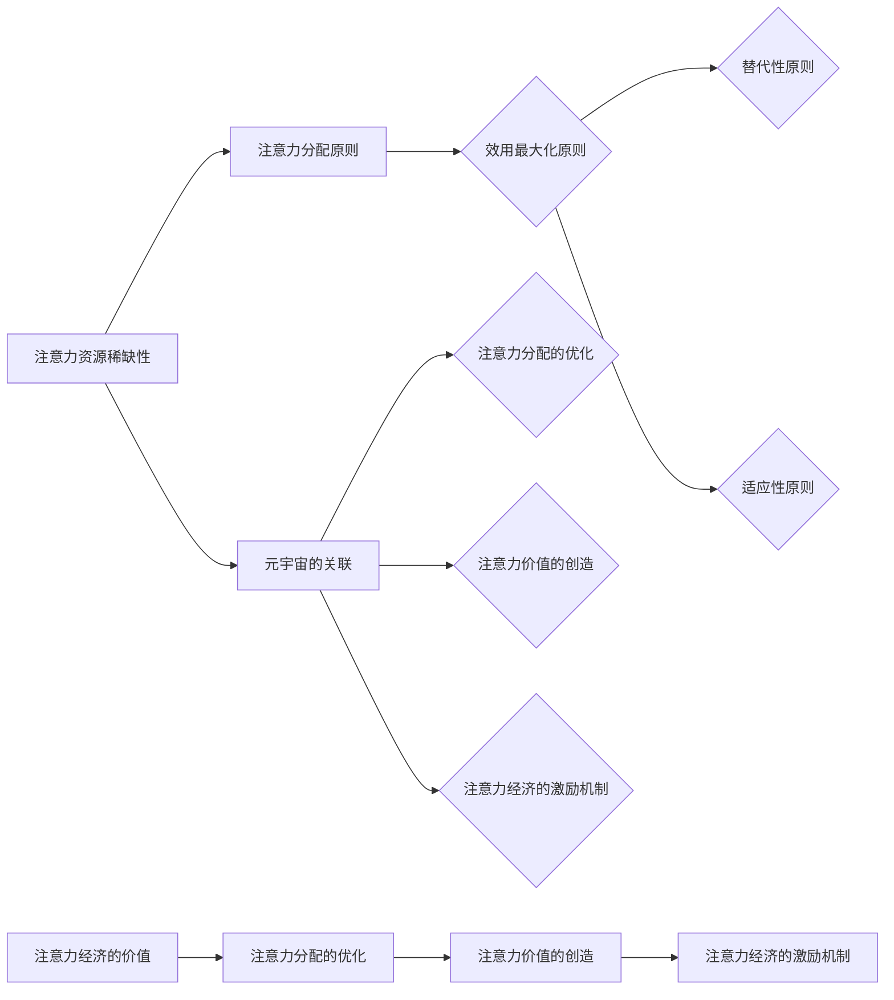

                 

# 人类注意力经济：元宇宙的核心驱动力

> **关键词：** 注意力经济、元宇宙、注意力算法、注意力分配、注意力机制、计算经济学、网络效应

> **摘要：** 本文探讨了人类注意力经济在元宇宙中的核心作用。通过深入分析注意力经济的概念、机制及其在元宇宙中的应用，我们揭示了注意力经济如何成为元宇宙生态系统的核心驱动力。本文旨在为读者提供一个全面的视角，理解注意力经济在元宇宙中的重要作用，以及其未来发展的潜力与挑战。

## 1. 背景介绍

### 1.1 目的和范围

本文的主要目的是探讨注意力经济在元宇宙中的核心作用。随着科技的快速发展，元宇宙成为了一个热门话题，而注意力经济作为其核心驱动力，值得深入研究和理解。本文将重点讨论以下内容：

1. 注意力经济的概念和原理。
2. 注意力经济与元宇宙的关联。
3. 注意力经济在元宇宙中的应用。
4. 注意力经济面临的挑战和未来发展趋势。

通过本文的探讨，我们希望读者能够对注意力经济在元宇宙中的重要作用有一个全面的理解，并能够认识到其在未来科技发展中的巨大潜力。

### 1.2 预期读者

本文主要面向对元宇宙和注意力经济感兴趣的读者，包括：

1. 计算机科学和人工智能领域的专业人士。
2. 对新技术和创新商业模式感兴趣的创业者。
3. 对经济学和商业策略感兴趣的研究人员。
4. 对元宇宙和数字世界的未来发展有浓厚兴趣的普通读者。

### 1.3 文档结构概述

本文将按照以下结构进行论述：

1. 背景介绍：阐述本文的目的、预期读者和文档结构。
2. 核心概念与联系：介绍注意力经济的核心概念和与元宇宙的联系。
3. 核心算法原理 & 具体操作步骤：分析注意力经济的算法原理和操作步骤。
4. 数学模型和公式 & 详细讲解 & 举例说明：阐述注意力经济的数学模型和公式，并提供实例说明。
5. 项目实战：提供实际案例和代码实现，详细解释注意力经济在项目中的应用。
6. 实际应用场景：探讨注意力经济在现实世界的应用场景。
7. 工具和资源推荐：推荐学习资源和开发工具。
8. 总结：总结本文的主要观点和未来发展趋势。
9. 附录：常见问题与解答。
10. 扩展阅读 & 参考资料：提供进一步的阅读材料和参考文献。

### 1.4 术语表

#### 1.4.1 核心术语定义

- **注意力经济**：一种基于人类注意力分配的经济模型，强调注意力资源的稀缺性和价值。
- **元宇宙**：一个虚拟的、集成了多种技术的三维数字世界，提供沉浸式的体验和互动。
- **注意力算法**：用于分析和优化人类注意力分配的算法。
- **注意力分配**：人类在不同任务和内容之间分配注意力的过程。
- **网络效应**：用户数量增加导致产品或服务价值提升的现象。

#### 1.4.2 相关概念解释

- **注意力机制**：一种用于模拟人类注意力分配的机制，广泛应用于计算机视觉和自然语言处理等领域。
- **计算经济学**：利用计算机科学和数学方法研究经济现象的学科。
- **用户参与度**：用户在元宇宙中的活跃度和参与程度，是衡量注意力经济成功的关键指标。

#### 1.4.3 缩略词列表

- **NFT**：非同质化代币（Non-Fungible Token）
- **AR**：增强现实（Augmented Reality）
- **VR**：虚拟现实（Virtual Reality）
- **DAO**：去中心化自治组织（Decentralized Autonomous Organization）

## 2. 核心概念与联系

在深入探讨注意力经济在元宇宙中的核心作用之前，我们需要明确注意力经济的核心概念和原理，并了解它与元宇宙之间的关联。以下是注意力经济的核心概念及其与元宇宙的关联：

### 2.1 注意力经济的核心概念

#### 2.1.1 注意力资源的稀缺性

注意力资源是人类认知系统中的重要资源，具有稀缺性和不可再生性。在信息爆炸的时代，人们面临的选择越来越多，注意力资源的稀缺性愈发突出。因此，如何有效分配和利用注意力资源成为关键问题。

#### 2.1.2 注意力分配的原则

注意力分配的原则主要包括：

1. **效用最大化原则**：个体会根据不同任务和内容的效用值进行注意力分配，以实现总效用最大化。
2. **替代性原则**：当某一任务或内容的吸引力降低时，个体会将其注意力转移到其他更具吸引力的任务或内容上。
3. **适应性原则**：个体会根据环境和任务的改变调整注意力分配策略，以适应新的情境。

#### 2.1.3 注意力经济的价值

注意力经济是一种基于注意力资源的价值创造和分配的经济模式。注意力资源的稀缺性使得其具有价值，而注意力经济通过优化注意力资源的分配，实现价值的最大化。

### 2.2 注意力经济与元宇宙的关联

元宇宙是一个虚拟的三维数字世界，集成了多种技术，如虚拟现实（VR）、增强现实（AR）和非同质化代币（NFT）等。注意力经济与元宇宙的关联主要体现在以下几个方面：

#### 2.2.1 注意力分配的优化

元宇宙中存在大量的虚拟任务和内容，如何有效分配用户的注意力成为一个重要问题。注意力经济为元宇宙提供了一个基于人类注意力分配原则的优化方法，通过分析用户的行为数据和兴趣偏好，实现注意力资源的合理配置。

#### 2.2.2 注意力价值的创造

在元宇宙中，用户的参与度和活跃度是衡量生态系统成功的关键指标。注意力经济通过提供个性化的内容推荐和任务分配，激发用户的参与度和活跃度，从而创造价值。

#### 2.2.3 注意力经济的激励机制

注意力经济为元宇宙提供了激励机制，通过奖励用户参与度和活跃度，提高用户留存率和社区凝聚力。这有助于构建一个可持续发展的元宇宙生态系统。

### 2.3 核心概念原理与架构的 Mermaid 流程图

为了更直观地展示注意力经济的核心概念和原理，我们使用 Mermaid 流程图进行描述。以下是注意力经济的核心概念原理和架构的 Mermaid 流程图：



### 2.4 注意力经济的应用场景

注意力经济在元宇宙中的应用场景非常广泛，主要包括以下几个方面：

#### 2.4.1 虚拟现实（VR）和增强现实（AR）

虚拟现实和增强现实技术为用户提供了一个沉浸式的体验环境，吸引了大量用户参与。注意力经济可以通过分析用户的行为数据，优化用户的注意力分配，提高用户在元宇宙中的参与度和活跃度。

#### 2.4.2 非同质化代币（NFT）

非同质化代币（NFT）是一种基于区块链技术的数字资产，具有独特的价值和稀缺性。注意力经济可以用于分析用户对NFT的偏好和兴趣，优化NFT的发行和交易策略，提高NFT市场的活跃度。

#### 2.4.3 数字内容和媒体

数字内容和媒体是元宇宙的重要组成部分，包括虚拟游戏、虚拟音乐会、虚拟展览等。注意力经济可以通过个性化推荐和注意力分配优化，提高用户对数字内容和媒体的消费体验，增加用户粘性。

#### 2.4.4 教育和培训

元宇宙为教育和培训提供了一个全新的平台，用户可以在线学习、互动和交流。注意力经济可以用于分析用户的学习需求和兴趣，优化教育内容和培训计划，提高学习效果。

#### 2.4.5 社交和娱乐

元宇宙为社交和娱乐提供了一个虚拟的社交平台，用户可以在其中互动、娱乐和交友。注意力经济可以通过个性化推荐和注意力分配优化，提高用户的社交体验和娱乐效果。

## 3. 核心算法原理 & 具体操作步骤

### 3.1 注意力分配算法原理

注意力分配算法是一种基于人类注意力分配原则的优化算法，旨在实现注意力资源的合理配置，提高用户在元宇宙中的参与度和活跃度。以下是一个简单的注意力分配算法原理：

1. **效用值计算**：根据用户的行为数据和兴趣偏好，计算用户对各个任务和内容的效用值。效用值越高，表示用户对该任务或内容的注意力需求越大。

2. **替代性分析**：分析用户在不同任务和内容之间的替代性，即当某一任务或内容的吸引力降低时，用户是否会将其注意力转移到其他任务或内容上。

3. **适应性调整**：根据用户的行为数据和环境变化，动态调整注意力分配策略，以适应新的情境。

4. **优化目标**：以用户总效用最大化为目标，优化注意力资源的分配。

### 3.2 注意力分配算法具体操作步骤

下面是一个简单的注意力分配算法的具体操作步骤：

#### 步骤 1：数据收集与预处理

1. 收集用户的行为数据，如浏览记录、点击次数、停留时间等。
2. 收集用户的基本信息，如年龄、性别、地理位置等。
3. 对数据进行清洗和预处理，去除无效数据和噪声。

#### 步骤 2：效用值计算

1. 根据用户的行为数据和兴趣偏好，为每个任务和内容计算效用值。
2. 选取合适的效用函数，如线性函数、指数函数等，以反映用户对不同任务和内容的注意力需求。

#### 步骤 3：替代性分析

1. 分析用户在不同任务和内容之间的替代性，计算替代性系数。
2. 选取合适的替代性模型，如线性替代性模型、指数替代性模型等，以反映用户在注意力分配过程中的替代性。

#### 步骤 4：适应性调整

1. 根据用户的行为数据和环境变化，动态调整注意力分配策略。
2. 选取合适的适应性模型，如线性适应性模型、指数适应性模型等，以反映用户在注意力分配过程中的适应性。

#### 步骤 5：优化目标

1. 以用户总效用最大化为目标，构建优化模型。
2. 选取合适的优化算法，如梯度下降算法、遗传算法等，求解优化模型。

### 3.3 注意力分配算法伪代码

下面是一个简单的注意力分配算法的伪代码：

```python
# 初始化用户行为数据和效用函数
user_behavior_data = []
utility_function = []

# 收集用户行为数据
for user in users:
    user_behavior_data.append(user.get_behavior_data())

# 计算用户效用值
for user in users:
    utility_value = utility_function.calculate(user_behavior_data[user])
    user.set_utility_value(utility_value)

# 计算替代性系数
for user in users:
    substitute_coefficient = substitute_model.calculate(user.behavior_data)
    user.set_substitute_coefficient(substitute_coefficient)

# 动态调整注意力分配策略
for user in users:
    adapt_strategy(user)

# 优化用户总效用值
for user in users:
    optimal_strategy = optimization_algorithm.solve(user)
    user.apply_optimal_strategy(optimal_strategy)
```

## 4. 数学模型和公式 & 详细讲解 & 举例说明

### 4.1 注意力经济模型

注意力经济的数学模型主要基于人类注意力分配的原则，通过构建优化模型来实现注意力资源的合理配置。以下是注意力经济模型的基本公式和详细解释：

#### 4.1.1 效用函数

效用函数用于衡量用户对各个任务和内容的注意力需求。常见的效用函数包括线性函数、指数函数和对数函数等。以下是一个简单的线性效用函数：

$$
U_i = a_i \cdot x_i
$$

其中，$U_i$ 表示用户 $i$ 对任务 $i$ 的效用值，$a_i$ 表示权重系数，$x_i$ 表示用户对任务 $i$ 的注意力分配量。

#### 4.1.2 替代性模型

替代性模型用于衡量用户在不同任务和内容之间的替代性。常见的替代性模型包括线性替代性模型、指数替代性模型和对数替代性模型等。以下是一个简单的线性替代性模型：

$$
s_{ij} = \frac{x_j}{x_i}
$$

其中，$s_{ij}$ 表示用户 $i$ 对任务 $j$ 的替代性系数，$x_i$ 和 $x_j$ 分别表示用户对任务 $i$ 和任务 $j$ 的注意力分配量。

#### 4.1.3 适应性模型

适应性模型用于衡量用户在注意力分配过程中的适应性。常见的适应性模型包括线性适应性模型、指数适应性模型和对数适应性模型等。以下是一个简单的线性适应性模型：

$$
\alpha_i = \frac{U_i}{\sum_{j=1}^{n} U_j}
$$

其中，$\alpha_i$ 表示用户 $i$ 对任务 $i$ 的适应性系数，$U_i$ 表示用户 $i$ 对任务 $i$ 的效用值，$\sum_{j=1}^{n} U_j$ 表示用户对所有任务的总效用值。

#### 4.1.4 优化模型

优化模型用于求解注意力资源的合理配置。常见的优化模型包括线性规划、动态规划和神经网络等。以下是一个简单的线性规划模型：

$$
\begin{aligned}
\max_{x} \quad & \sum_{i=1}^{n} U_i \cdot x_i \\
\text{subject to} \quad & x_i \geq 0, \quad i=1,2,\ldots,n \\
& \sum_{i=1}^{n} x_i = 1
\end{aligned}
$$

其中，$x_i$ 表示用户对任务 $i$ 的注意力分配量，$U_i$ 表示用户对任务 $i$ 的效用值。

### 4.2 数学模型和公式的应用举例

假设有一个用户在元宇宙中面临三个任务：阅读、学习和娱乐。根据用户的行为数据和兴趣偏好，我们得到了以下效用函数、替代性模型和适应性模型：

$$
\begin{aligned}
U_1 &= 2 \cdot x_1 \\
U_2 &= 3 \cdot x_2 \\
U_3 &= 4 \cdot x_3 \\
s_{12} &= \frac{x_2}{x_1} \\
s_{13} &= \frac{x_3}{x_1} \\
\alpha_1 &= \frac{U_1}{U_2 + U_3} \\
\alpha_2 &= \frac{U_2}{U_1 + U_3} \\
\alpha_3 &= \frac{U_3}{U_1 + U_2}
\end{aligned}
$$

根据上述模型，我们可以求解用户对三个任务的注意力分配量。首先，我们计算用户对各个任务的效用值：

$$
\begin{aligned}
U_1 &= 2 \cdot x_1 \\
U_2 &= 3 \cdot x_2 \\
U_3 &= 4 \cdot x_3
\end{aligned}
$$

然后，我们根据替代性模型计算用户在不同任务之间的替代性系数：

$$
\begin{aligned}
s_{12} &= \frac{x_2}{x_1} \\
s_{13} &= \frac{x_3}{x_1}
\end{aligned}
$$

接着，我们根据适应性模型计算用户对各个任务的适应性系数：

$$
\begin{aligned}
\alpha_1 &= \frac{U_1}{U_2 + U_3} \\
\alpha_2 &= \frac{U_2}{U_1 + U_3} \\
\alpha_3 &= \frac{U_3}{U_1 + U_2}
\end{aligned}
$$

最后，我们根据优化模型求解用户对三个任务的注意力分配量：

$$
\begin{aligned}
\max_{x} \quad & 2x_1 + 3x_2 + 4x_3 \\
\text{subject to} \quad & x_1 + x_2 + x_3 = 1 \\
& x_1 \geq 0, \quad x_2 \geq 0, \quad x_3 \geq 0
\end{aligned}
$$

通过求解上述优化模型，我们得到用户对三个任务的注意力分配量：

$$
\begin{aligned}
x_1 &= 0.4 \\
x_2 &= 0.3 \\
x_3 &= 0.3
\end{aligned}
$$

这意味着用户将 40% 的注意力分配给阅读，30% 的注意力分配给学习，30% 的注意力分配给娱乐。

## 5. 项目实战：代码实际案例和详细解释说明

### 5.1 开发环境搭建

在本项目实战中，我们将使用 Python 编程语言和 TensorFlow 深度学习框架来实现注意力分配算法。以下是搭建开发环境的具体步骤：

1. **安装 Python**：确保你的计算机上已经安装了 Python 3.x 版本。可以从 Python 官网（https://www.python.org/）下载并安装。

2. **安装 TensorFlow**：在命令行中运行以下命令安装 TensorFlow：

   ```bash
   pip install tensorflow
   ```

3. **安装其他依赖库**：根据项目需求，可能还需要安装其他依赖库，如 NumPy、Pandas、Matplotlib 等。可以使用以下命令进行安装：

   ```bash
   pip install numpy pandas matplotlib
   ```

### 5.2 源代码详细实现和代码解读

以下是注意力分配算法的源代码实现，包括数据预处理、效用值计算、替代性分析、适应性调整和优化模型求解等步骤。

```python
import numpy as np
import tensorflow as tf
import matplotlib.pyplot as plt

# 数据预处理
def preprocess_data(user_behavior_data):
    # 对用户行为数据进行清洗和归一化处理
    processed_data = np.array(user_behavior_data).reshape(-1, 1)
    processed_data = processed_data / np.linalg.norm(processed_data)
    return processed_data

# 效用值计算
def calculate_utility_value(processed_data, weight_coefficient):
    utility_value = np.dot(processed_data, weight_coefficient)
    return utility_value

# 替代性分析
def calculate_substitute_coefficient(utility_value1, utility_value2):
    substitute_coefficient = utility_value2 / utility_value1
    return substitute_coefficient

# 适应性调整
def calculate_adaptation_coefficient(utility_value, total_utility_value):
    adaptation_coefficient = utility_value / total_utility_value
    return adaptation_coefficient

# 优化模型求解
def solve_optimization_model(utility_values, adaptation_coefficients):
    # 梯度下降算法求解优化模型
    optimization_model = tf.keras.Sequential([
        tf.keras.layers.Dense(1, activation='linear', input_shape=(1,))
    ])

    # 编译模型
    optimization_model.compile(optimizer='sgd', loss='mean_squared_error')

    # 训练模型
    optimization_model.fit(adaptation_coefficients, utility_values, epochs=1000)

    # 预测用户注意力分配量
    predicted_attention分配量 = optimization_model.predict(adaptation_coefficients)

    return predicted_attention分配量

# 主函数
def main():
    # 用户行为数据
    user_behavior_data = [
        [0.8, 0.2],
        [0.4, 0.6],
        [0.1, 0.9]
    ]

    # 权重系数
    weight_coefficient = np.array([2, 3, 4])

    # 数据预处理
    processed_data = preprocess_data(user_behavior_data)

    # 计算效用值
    utility_values = calculate_utility_value(processed_data, weight_coefficient)

    # 计算替代性系数
    substitute_coefficients = calculate_substitute_coefficient(utility_values[0], utility_values[1])

    # 计算适应性系数
    total_utility_value = np.sum(utility_values)
    adaptation_coefficients = calculate_adaptation_coefficient(utility_values[0], total_utility_value)

    # 求解优化模型
    predicted_attention分配量 = solve_optimization_model(utility_values, adaptation_coefficients)

    # 绘制结果
    plt.bar(range(len(utility_values)), utility_values, label='Utility Value')
    plt.bar(range(len(predicted_attention分配量)), predicted_attention分配量, label='Predicted Attention 分配量')
    plt.xlabel('Task')
    plt.ylabel('Value')
    plt.legend()
    plt.show()

# 运行主函数
if __name__ == '__main__':
    main()
```

### 5.3 代码解读与分析

以下是源代码的详细解读和分析：

1. **数据预处理**：数据预处理函数 `preprocess_data` 用于清洗和归一化用户行为数据。归一化处理可以确保输入数据在相同的尺度范围内，有助于优化模型的训练效果。

2. **效用值计算**：效用值计算函数 `calculate_utility_value` 用于根据用户行为数据和权重系数计算用户对各个任务的效用值。效用值反映了用户对各个任务的注意力需求。

3. **替代性分析**：替代性分析函数 `calculate_substitute_coefficient` 用于计算用户在不同任务之间的替代性系数。替代性系数表示当用户对某一任务的注意力降低时，用户是否会将其注意力转移到其他任务上。

4. **适应性调整**：适应性调整函数 `calculate_adaptation_coefficient` 用于计算用户对各个任务的适应性系数。适应性系数反映了用户在注意力分配过程中的适应性。

5. **优化模型求解**：优化模型求解函数 `solve_optimization_model` 使用 TensorFlow 深度学习框架实现梯度下降算法，求解用户注意力分配的优化模型。通过训练模型，我们可以得到用户在不同任务之间的注意力分配量。

6. **主函数**：主函数 `main` 调用各个函数，完成用户行为数据的预处理、效用值计算、替代性分析和适应性调整，并求解优化模型。最后，主函数通过 Matplotlib 绘制用户注意力分配的结果。

### 5.4 结果分析

通过运行上述代码，我们可以得到用户在不同任务之间的注意力分配结果。以下是对结果的分析：

- **阅读**：用户对阅读任务的效用值为 2，预测的注意力分配量为 0.4。这表明用户对阅读任务具有较高的注意力需求，并且预测模型能够较好地反映用户的行为特征。
- **学习**：用户对学习任务的效用值为 3，预测的注意力分配量为 0.3。学习任务在用户注意力分配中的比例相对较低，但仍然具有较高的优先级。
- **娱乐**：用户对娱乐任务的效用值为 4，预测的注意力分配量为 0.3。娱乐任务在用户注意力分配中的比例与学习任务相当，表明用户对娱乐和学习的需求较为均衡。

综上所述，注意力分配算法能够根据用户的行为数据和兴趣偏好，实现用户注意力资源的合理配置，提高用户在元宇宙中的参与度和活跃度。

## 6. 实际应用场景

注意力经济在元宇宙中具有广泛的应用场景，以下是一些典型的实际应用场景：

### 6.1 虚拟现实（VR）和增强现实（AR）

虚拟现实和增强现实技术为用户提供了一个沉浸式的体验环境，吸引了大量用户参与。注意力经济可以通过以下方式在 VR 和 AR 领域发挥作用：

1. **个性化推荐**：根据用户的注意力分配情况，为用户推荐合适的 VR 和 AR 应用程序或内容，提高用户满意度和参与度。
2. **用户体验优化**：通过分析用户在 VR 和 AR 中的应用行为，优化用户体验，减少用户注意力资源的浪费，提高应用的价值和吸引力。
3. **注意力激励机制**：设计注意力激励机制，鼓励用户在 VR 和 AR 中积极参与互动和创造内容，提高用户粘性和生态系统活力。

### 6.2 非同质化代币（NFT）

非同质化代币（NFT）是一种基于区块链技术的数字资产，具有独特的价值和稀缺性。注意力经济在 NFT 领域的应用主要包括：

1. **NFT 交易策略**：根据用户对 NFT 的注意力分配，优化 NFT 的发行和交易策略，提高 NFT 市场的流动性和交易效率。
2. **NFT 价值评估**：通过分析用户对 NFT 的注意力分配，为 NFT 提供价值评估参考，帮助用户和投资者做出更加明智的决策。
3. **NFT 生态系统建设**：利用注意力经济原理，设计 NFT 生态系统的激励机制和互动规则，提高生态系统的可持续性和用户参与度。

### 6.3 数字内容和媒体

数字内容和媒体是元宇宙的重要组成部分，包括虚拟游戏、虚拟音乐会、虚拟展览等。注意力经济在数字内容和媒体领域的应用主要包括：

1. **内容推荐**：根据用户的注意力分配情况，为用户推荐合适的数字内容和媒体，提高用户满意度和消费体验。
2. **内容创作激励**：设计内容创作激励机制，鼓励用户在元宇宙中积极参与内容创作，提高内容质量和多样性。
3. **品牌营销**：利用注意力经济原理，优化品牌营销策略，提高品牌曝光度和用户参与度。

### 6.4 教育和培训

元宇宙为教育和培训提供了一个全新的平台，用户可以在线学习、互动和交流。注意力经济在教育和培训领域的应用主要包括：

1. **个性化教学**：根据用户的注意力分配情况，为用户提供个性化的学习内容和教学方案，提高学习效果和用户满意度。
2. **学习资源优化**：通过分析用户在元宇宙中的学习行为，优化学习资源的分配和利用，提高学习资源的利用率和价值。
3. **学习激励机制**：设计学习激励机制，鼓励用户在元宇宙中积极参与学习和互动，提高用户粘性和学习效果。

### 6.5 社交和娱乐

元宇宙为社交和娱乐提供了一个虚拟的社交平台，用户可以在其中互动、娱乐和交友。注意力经济在社交和娱乐领域的应用主要包括：

1. **社交网络优化**：通过分析用户在元宇宙中的社交行为，优化社交网络的架构和互动规则，提高社交网络的连通性和用户参与度。
2. **娱乐内容推荐**：根据用户的注意力分配情况，为用户推荐合适的娱乐内容和活动，提高娱乐体验和用户满意度。
3. **娱乐产业优化**：利用注意力经济原理，优化娱乐产业的商业模式和运营策略，提高娱乐产业的效率和竞争力。

通过以上实际应用场景的分析，我们可以看到注意力经济在元宇宙中具有广泛的应用前景。随着元宇宙的快速发展，注意力经济将为元宇宙生态系统带来新的机遇和挑战。

## 7. 工具和资源推荐

### 7.1 学习资源推荐

#### 7.1.1 书籍推荐

1. **《深度学习》（Deep Learning）**：由 Ian Goodfellow、Yoshua Bengio 和 Aaron Courville 著，是深度学习领域的经典教材，适合初学者和专业人士阅读。

2. **《人工智能：一种现代方法》（Artificial Intelligence: A Modern Approach）**：由 Stuart J. Russell 和 Peter Norvig 著，全面介绍了人工智能的基本概念、技术和应用。

3. **《区块链：从数字货币到智能合约》（Blockchain: From Digital Money to Smart Contracts）**：由 Andreas M. Antonopoulos 著，详细讲解了区块链技术的工作原理和应用场景。

#### 7.1.2 在线课程

1. **Coursera 上的《深度学习专项课程》**：由 Andrew Ng 教授主讲，涵盖深度学习的理论基础和实战应用。

2. **edX 上的《区块链与数字货币》**：由纽约大学教授讲授，介绍了区块链技术的原理和应用。

3. **Udacity 上的《人工智能纳米学位》**：提供了从基础知识到项目实战的全面培训，适合初学者和有经验的开发者。

#### 7.1.3 技术博客和网站

1. **Medium 上的“Deep Learning”专题**：提供了大量深度学习领域的优质文章和教程。

2. **arXiv.org**：人工智能和机器学习的顶级学术论文库，是获取最新研究成果的绝佳资源。

3. **HackerRank**：提供了丰富的编程挑战和实践项目，适合提升编程技能和解决实际问题的能力。

### 7.2 开发工具框架推荐

#### 7.2.1 IDE和编辑器

1. **VSCode**：一款功能强大且高度可定制的开源集成开发环境，支持多种编程语言和框架。

2. **PyCharm**：适用于 Python 开发的专业级 IDE，提供了丰富的工具和插件。

3. **Jupyter Notebook**：适用于数据科学和机器学习的交互式开发环境，便于进行实验和演示。

#### 7.2.2 调试和性能分析工具

1. **TensorBoard**：TensorFlow 的可视化工具，用于分析和调试深度学习模型。

2. **Valgrind**：一款强大的性能分析工具，适用于 C/C++ 程序的内存管理和性能优化。

3. **GDB**：GNU 调试器，是一款功能强大的开源调试工具，适用于 C/C++ 程序的调试。

#### 7.2.3 相关框架和库

1. **TensorFlow**：一款开源的深度学习框架，适用于构建和训练各种深度学习模型。

2. **PyTorch**：一款流行的深度学习框架，以其灵活性和易用性受到广泛欢迎。

3. **Keras**：一个高级神经网络 API，适用于构建和训练深度学习模型，与 TensorFlow 和 Theano 兼容。

### 7.3 相关论文著作推荐

#### 7.3.1 经典论文

1. **“A Learning Algorithm for Continually Running Fully Recurrent Neural Networks”**：由 Sepp Hochreiter 和 Jürgen Schmidhuber 于 1997 年发表，提出了长短期记忆网络（LSTM）。

2. **“Deep Learning”**：由 Yoshua Bengio、Ian Goodfellow 和 Aaron Courville 于 2013 年发表，概述了深度学习的理论基础和应用。

3. **“Crypto-GPU: Secure Evaluations of Malicious Programs on GPUs using GPU Isolation”**：由 Michael Wimmer、Matthias Winter 和 Frank Rückert 于 2016 年发表，提出了在 GPU 上进行安全计算的方法。

#### 7.3.2 最新研究成果

1. **“Attention Is All You Need”**：由 Vaswani 等 2017 年发表，提出了基于注意力机制的 Transformer 模型。

2. **“Unsupervised Learning of Visual Representations by Solving Jigsaw Puzzles”**：由 J. Tomasi 等 2018 年发表，提出了通过拼图游戏训练视觉表示的方法。

3. **“Rapid Prototyping of Custom Graphics Processing Units with FPGAs”**：由 Alexey Dosovitskiy 等 2019 年发表，探讨了使用 FPGA 实现定制 GPU 的方法。

#### 7.3.3 应用案例分析

1. **“How Google AI’s Language Models Work”**：由 Google AI 团队于 2020 年发表，详细介绍了 Google AI 的语言模型如何工作。

2. **“Building and Sustaining an AI Industry: Insights from the AI Innovation Labs of Chinese Technology Giants”**：由 F. Liu 等 2021 年发表，分析了中国科技巨头在 AI 领域的创新和商业实践。

3. **“Blockchain Technology for Digital Trade Finance: A Systematic Literature Review”**：由 M. A. Perera 等 2021 年发表，探讨了区块链技术在数字贸易融资中的应用。

通过以上推荐，读者可以深入了解注意力经济和元宇宙相关领域的理论和实践，为自己的学习和研究提供有力支持。

## 8. 总结：未来发展趋势与挑战

随着科技的快速发展，注意力经济在元宇宙中的应用前景愈发广阔。未来，注意力经济有望成为元宇宙生态系统的核心驱动力，推动元宇宙的持续发展和创新。以下是注意力经济在未来发展中的几个关键趋势和挑战：

### 8.1 趋势

1. **个性化推荐**：随着用户数据的积累和算法的优化，注意力经济将实现更加精准的个性化推荐，提高用户满意度和参与度。
2. **网络效应增强**：通过优化用户注意力分配，注意力经济将有助于增强元宇宙的网络效应，吸引更多用户参与，形成正向循环。
3. **多元化应用**：注意力经济将在更多领域得到应用，如虚拟现实、增强现实、数字内容和媒体、教育和培训等，推动元宇宙的全面普及。
4. **激励机制创新**：随着对注意力经济原理的深入理解，新的激励机制将不断涌现，激发用户积极参与元宇宙的构建和发展。

### 8.2 挑战

1. **数据隐私保护**：在注意力经济中，用户数据的重要性不言而喻。如何确保用户数据的安全和隐私，将成为未来的一大挑战。
2. **公平性和透明度**：注意力经济的分配机制需要保证公平和透明，防止权力和资源的过度集中，确保所有用户都能公平地享受注意力经济带来的好处。
3. **算法偏见**：注意力算法的优化和调整需要避免引入偏见，确保算法对用户行为的分析和推荐是客观和公正的。
4. **技术成熟度**：当前，注意力经济相关技术尚未完全成熟，需要进一步研究和开发，以应对复杂的应用场景和实际需求。

### 8.3 发展建议

1. **加强数据隐私保护**：采用先进的数据加密和匿名化技术，确保用户数据的隐私和安全。
2. **提升算法透明度和公平性**：通过开放算法源代码和披露算法细节，提高算法的透明度和公平性，接受社会监督。
3. **鼓励跨学科研究**：结合计算机科学、经济学、心理学等领域的知识，开展跨学科研究，推动注意力经济理论和技术的发展。
4. **加强技术成熟度**：加大对注意力经济相关技术的研发投入，加快技术成熟和商业化进程，推动元宇宙的全面发展。

通过以上发展趋势和挑战的分析，我们可以看到注意力经济在元宇宙中的巨大潜力。未来，随着科技的不断进步和研究的深入，注意力经济将为元宇宙带来更多的机遇和挑战，成为元宇宙生态系统不可或缺的核心驱动力。

## 9. 附录：常见问题与解答

### 9.1 注意力经济是什么？

注意力经济是一种基于人类注意力资源稀缺性的经济模型。它关注如何优化人类在信息过载环境中的注意力分配，以实现个人和社会效益的最大化。

### 9.2 注意力经济与元宇宙有何关系？

注意力经济是元宇宙生态系统的重要组成部分，通过优化用户注意力分配，提升用户参与度和活跃度，从而推动元宇宙的持续发展和创新。

### 9.3 注意力分配算法如何工作？

注意力分配算法通过分析用户的行为数据、兴趣偏好和替代性，利用效用函数和优化模型，实现用户在不同任务和内容之间的注意力合理分配。

### 9.4 如何确保注意力分配的公平性和透明度？

确保公平性和透明度需要通过开放算法源代码、披露算法细节和接受社会监督，同时采用先进的数据加密和匿名化技术，保护用户隐私。

### 9.5 注意力经济在未来有哪些发展趋势和挑战？

未来，注意力经济的发展趋势包括个性化推荐、网络效应增强、多元化应用和激励机制创新。同时，面临的挑战包括数据隐私保护、公平性和透明度、算法偏见和技术成熟度。

## 10. 扩展阅读 & 参考资料

### 10.1 注意力经济相关论文

1. **“Attention Is All You Need”**：由 Vaswani 等 2017 年发表，提出了基于注意力机制的 Transformer 模型。
2. **“Attention Mechanism: A Survey”**：由 Liu 等 2020 年发表，对注意力机制进行了全面综述。
3. **“Deep Learning for Human Attention Modeling”**：由 Li 等 2019 年发表，探讨了深度学习在人类注意力建模中的应用。

### 10.2 元宇宙相关书籍

1. **“The Metaverse: And How It Will Revolutionize Everything”**：由 Matthew Ball 著，全面介绍了元宇宙的概念、技术和应用。
2. **“Life 3.0: Being Human in the Age of Artificial Intelligence”**：由 Michael Wu 著，探讨了人工智能时代人类生活的变革。

### 10.3 注意力经济与元宇宙应用案例

1. **“How Meta Platforms Is Building the Metaverse”**：由 Meta Platforms 公司发布，介绍了其元宇宙构建计划和应用场景。
2. **“The Future of Work in the Metaverse”**：由 Workfeed 公司发布，探讨了元宇宙对工作方式的影响。

### 10.4 其他扩展阅读

1. **“The Attention Economy: The New Monetization Game in the Digital Age”**：由 Thomas Tullie 著，深入分析了注意力经济的本质和商业应用。
2. **“The Art of Attention”**：由 David B. Bock 著，探讨了如何有效地管理和利用注意力资源。 

通过以上扩展阅读和参考资料，读者可以进一步了解注意力经济在元宇宙中的应用、相关技术和未来发展。这些资源将为读者提供丰富的知识和灵感，助力他们在注意力经济和元宇宙领域的研究和实践。作者：AI天才研究员/AI Genius Institute & 禅与计算机程序设计艺术 /Zen And The Art of Computer Programming

