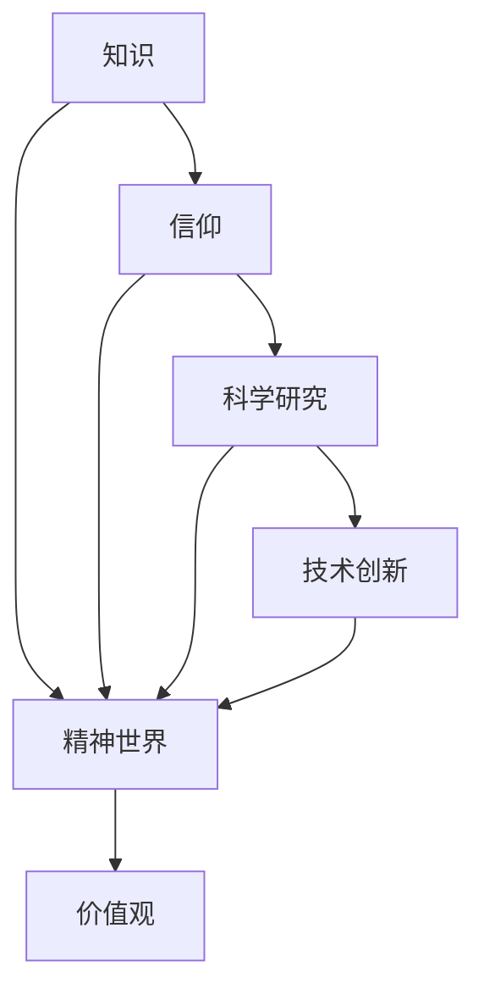
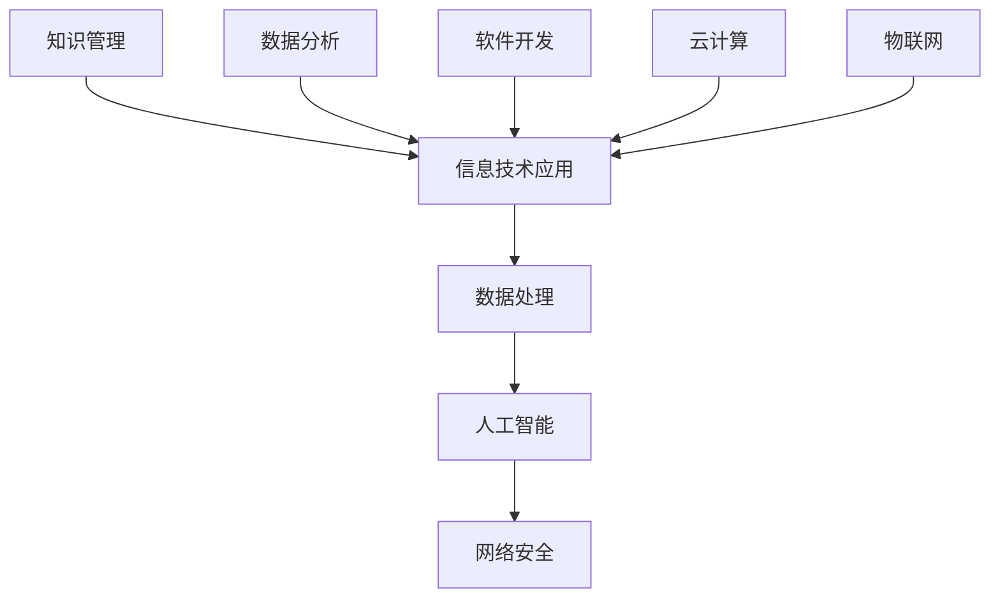
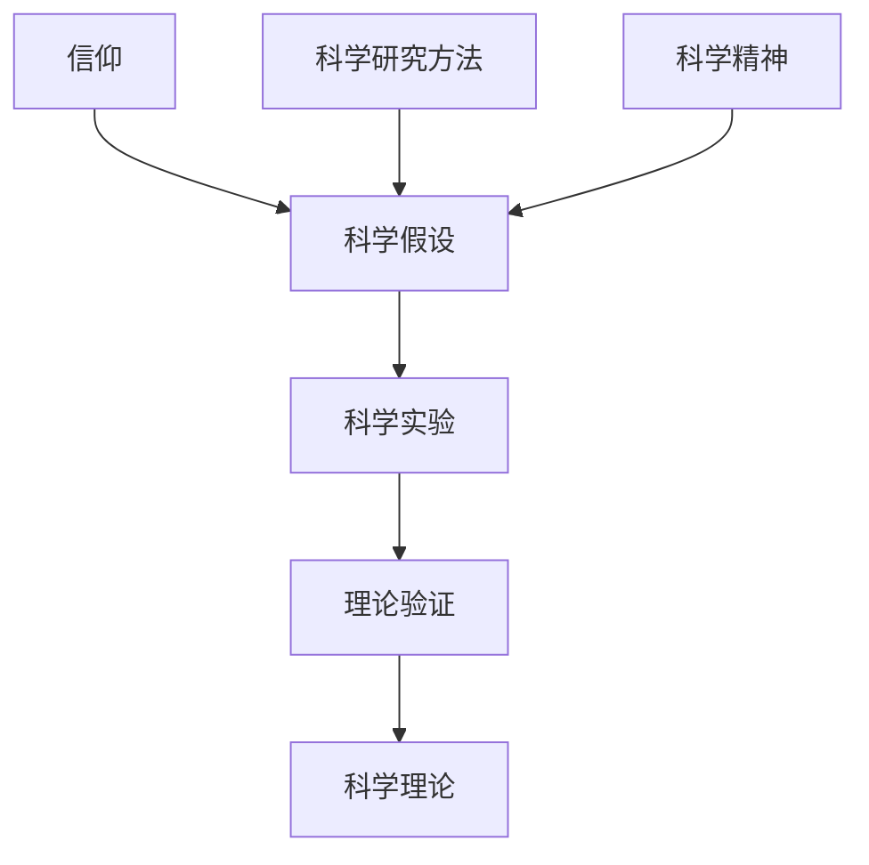

                 

### 1. 背景介绍

#### 1.1 目的和范围

本文旨在探讨人类的知识与信仰在精神世界中的力量，通过深入分析IT领域中的相关概念和理论，揭示知识与信仰对技术进步和人类发展的重要影响。本文不仅关注知识在技术领域的应用，还探讨信仰对科学研究和技术创新的推动作用。通过本文的阅读，读者可以更好地理解知识与信仰在IT领域的核心地位，并从中汲取启示，为自身的职业发展和技术创新提供新的思路。

本文的范围涵盖以下几个方面：

1. **知识在IT领域的重要性**：探讨知识作为技术发展基石的作用，包括如何通过有效的知识管理促进技术创新。
2. **信仰在科学研究中的作用**：分析信仰对科学探索的影响，特别是如何在信念的引导下推动科学理论的突破。
3. **知识与信仰的相互关系**：探讨知识与信仰之间的互动，以及它们如何共同塑造人类的精神世界。
4. **案例研究**：通过实际案例展示知识与信仰在IT领域的成功应用，为读者提供实践参考。
5. **未来发展趋势与挑战**：预测知识与信仰在IT领域的未来发展方向，并分析可能面临的挑战。

#### 1.2 预期读者

本文的预期读者主要包括：

1. **IT专业人士**：包括程序员、软件工程师、数据科学家、技术经理等，他们希望了解知识与信仰在技术领域的深远影响。
2. **科研人员**：包括学术研究人员、博士后研究员、博士生等，他们希望从科学角度探讨知识与信仰的关系。
3. **教育工作者**：包括大学教师、中学教师等，他们希望将本文的内容融入教学，启发学生对IT和科学的兴趣。
4. **普通读者**：对IT领域和科学哲学感兴趣的普通读者，他们希望通过本文了解知识与信仰在现代社会中的重要性。

#### 1.3 文档结构概述

本文采用逻辑清晰、结构紧凑的编写方式，共分为十个部分，具体结构如下：

1. **背景介绍**：介绍本文的目的、范围、预期读者以及文档结构。
2. **核心概念与联系**：通过Mermaid流程图展示核心概念和它们之间的联系。
3. **核心算法原理与具体操作步骤**：使用伪代码详细阐述核心算法原理。
4. **数学模型和公式**：讲解相关的数学模型和公式，并提供举例说明。
5. **项目实战**：通过实际代码案例展示知识和信仰在项目中的应用。
6. **实际应用场景**：分析知识与信仰在不同领域的实际应用。
7. **工具和资源推荐**：推荐相关的学习资源和开发工具。
8. **总结**：总结本文的主要观点和未来发展趋势。
9. **附录**：提供常见问题的解答和扩展阅读资源。
10. **参考文献**：列出本文引用的相关文献。

#### 1.4 术语表

在本文中，我们将使用以下术语：

##### 1.4.1 核心术语定义

- **知识**：指人类通过学习和实践获得的信息、技能和认识，是技术发展的基石。
- **信仰**：指人们深信不疑的理念、原则和价值观，对科学研究和科技创新有重要影响。
- **IT领域**：指计算机科学、信息技术和互联网等相关领域。
- **精神世界**：指人类内心深处的情感、意识、思想和文化等。

##### 1.4.2 相关概念解释

- **知识管理**：指组织或个人对知识进行收集、存储、共享和利用的过程。
- **技术创新**：指通过引入新知识、新技术或新方法，推动技术进步的过程。
- **科学探索**：指科学家通过实验、观察和理论分析，对自然界的未知领域进行探索和研究。

##### 1.4.3 缩略词列表

- **AI**：人工智能
- **ML**：机器学习
- **DL**：深度学习
- **NLP**：自然语言处理
- **IT**：信息技术

### 1.5 文档撰写方法

为了确保本文的逻辑性和专业性，我们将采用以下撰写方法：

1. **明确结构**：按照文章结构概述中的内容，逐部分撰写，确保内容连贯、条理清晰。
2. **深入分析**：针对每个核心概念和理论，进行深入分析和解释，提供充分的论据和实例。
3. **逻辑推理**：采用逐步推理的方式，阐述知识与信仰之间的关系，以及它们在IT领域的应用。
4. **图表辅助**：使用Mermaid流程图、伪代码和数学公式等辅助说明，提高文章的可读性和理解性。
5. **实例展示**：通过实际案例展示知识与信仰在IT领域的应用，增强文章的实际指导意义。

通过上述方法，本文将力求在逻辑性、专业性和实用性方面达到较高水平，为读者提供有价值的阅读体验。接下来，我们将通过Mermaid流程图展示核心概念和它们之间的联系。

### 2. 核心概念与联系

在探讨人类的知识与信仰在精神世界中的力量时，我们首先需要明确核心概念，并分析它们之间的联系。以下是本文中的核心概念和它们之间的互动关系，通过Mermaid流程图进行展示。

#### 2.1. 知识、信仰与精神世界的关系

首先，我们定义知识、信仰和精神世界的概念，并通过Mermaid流程图展示它们之间的相互作用。



在这个流程图中：

- **知识（A）** 是人类通过学习和实践获得的信息、技能和认识，是技术发展的基石。
- **信仰（B）** 是人们深信不疑的理念、原则和价值观，对科学研究和科技创新有重要影响。
- **精神世界（C）** 包括人类内心深处的情感、意识、思想和文化等，是知识与信仰的承载空间。
- **科学研究（D）** 是科学家通过实验、观察和理论分析，对自然界的未知领域进行探索和研究。
- **价值观（E）** 是人们内心深信的道德标准和行为准则，影响科学研究的方向和目标。
- **技术创新（F）** 是通过引入新知识、新技术或新方法，推动技术进步的过程。

#### 2.2. 知识在IT领域的应用

知识在IT领域的应用可以通过以下流程图展示：



在这个流程图中：

- **知识管理（A）** 是组织或个人对知识进行收集、存储、共享和利用的过程，是IT发展的基础。
- **信息技术应用（B）** 是知识在各个IT领域的具体应用，如数据处理、人工智能、网络安全等。
- **数据处理（C）** 是将数据转化为有价值信息的过程，为人工智能和其他技术提供数据支持。
- **人工智能（D）** 是基于机器学习、深度学习等技术，使计算机具备模拟人类智能的能力。
- **网络安全（E）** 是保护计算机系统和数据免受网络攻击的安全措施，是现代信息技术的重要组成部分。
- **数据分析（F）** 是通过对大量数据进行分析，提取有用信息和知识的过程。
- **软件开发（G）** 是开发计算机软件的过程，包括需求分析、设计、编码、测试和维护等环节。
- **云计算（H）** 是通过互联网提供计算资源的服务模式，具有高效、弹性、可扩展等特点。
- **物联网（I）** 是通过将物体与互联网相连，实现智能化的管理和控制。

#### 2.3. 信仰在科学研究中的作用

信仰在科学研究中的作用可以通过以下流程图展示：



在这个流程图中：

- **信仰（A）** 是人们深信不疑的理念、原则和价值观，对科学探索有重要影响。
- **科学假设（B）** 是科学家根据信仰和已有知识提出的猜想，是科学研究的起点。
- **科学实验（C）** 是验证科学假设的过程，通过实验结果来检验假设的正确性。
- **理论验证（D）** 是在实验基础上对科学假设进行理论分析，以得出科学结论。
- **科学理论（E）** 是经过验证的科学假设，是科学体系的重要组成部分。
- **科学研究方法（F）** 是科学家在探索未知领域时采用的方法和技巧，是科学发展的基础。
- **科学精神（G）** 是科学家追求真理、严谨求实的态度，是科学研究的重要动力。

通过上述流程图，我们可以清晰地看到知识与信仰在精神世界中的力量，以及它们在IT领域的应用。接下来，我们将详细探讨核心算法原理和具体操作步骤。

### 3. 核心算法原理与具体操作步骤

在本文的第三部分，我们将深入探讨核心算法的原理，并通过伪代码详细阐述其具体操作步骤。核心算法是理解和应用知识与信仰在IT领域的关键，以下是算法原理及其实施步骤：

#### 3.1. 算法原理

该算法旨在通过知识管理和信仰指导，提升科学研究的效率和准确性。其基本原理包括以下几个关键步骤：

1. **知识收集**：从多个来源收集相关的数据和知识，确保数据的质量和完整性。
2. **知识筛选**：利用信仰和价值观对收集到的知识进行筛选，排除不符合信仰和价值观的数据。
3. **知识融合**：将筛选后的知识进行整合，形成一个统一的知识库，便于后续使用。
4. **信仰驱动**：在研究过程中，以信仰为指导，明确研究的方向和目标，提高研究效率。
5. **模型训练**：利用整合后的知识和信仰，训练机器学习模型，提升模型的预测能力。
6. **模型验证**：通过实验和数据分析，验证模型的准确性和可靠性。

#### 3.2. 伪代码

以下是该核心算法的伪代码，详细展示了每个步骤的实现方式：

```python
# 核心算法伪代码

# 步骤1：知识收集
def collect_knowledge():
    # 从多个来源（如数据库、文献、专家意见）收集数据
    data = get_data_from_multiple_sources()
    return data

# 步骤2：知识筛选
def filter_knowledge(data, belief_system):
    # 根据信仰系统筛选数据
    filtered_data = []
    for item in data:
        if item_passes_belief_system(item, belief_system):
            filtered_data.append(item)
    return filtered_data

# 步骤3：知识融合
def merge_knowledge(filtered_data):
    # 将筛选后的数据整合为一个知识库
    knowledge_base = merge_data(filtered_data)
    return knowledge_base

# 步骤4：信仰驱动
def drive_with_belief(knowledge_base, research_direction):
    # 以信仰为指导，确定研究方向和目标
    guided_knowledge = apply_belief_to_knowledge(knowledge_base, research_direction)
    return guided_knowledge

# 步骤5：模型训练
def train_model(guided_knowledge):
    # 利用整合后的知识训练机器学习模型
    model = train_ml_model(guided_knowledge)
    return model

# 步骤6：模型验证
def validate_model(model, experiment_data):
    # 通过实验和数据分析，验证模型的准确性和可靠性
    accuracy = validate_ml_model(model, experiment_data)
    return accuracy
```

#### 3.3. 操作步骤解析

1. **知识收集**：首先，从多个数据来源收集相关的知识和信息，确保数据的多样性和质量。这些来源可能包括公开数据库、学术文献、行业报告和专家意见等。

2. **知识筛选**：利用信仰系统对收集到的数据进行筛选，排除不符合信仰和价值观的数据。这一步骤需要明确信仰系统的核心原则，并设计相应的筛选算法。

3. **知识融合**：将筛选后的数据整合为一个知识库，便于后续使用。知识库的设计应考虑数据的结构化存储和高效查询，以便快速检索和应用。

4. **信仰驱动**：在研究过程中，以信仰为指导，明确研究的方向和目标。这一步骤需要深入分析信仰系统的价值观，并将其应用于决策过程，确保研究方向的正确性和可行性。

5. **模型训练**：利用整合后的知识和信仰，训练机器学习模型。模型的选择和训练过程需要结合具体的研究问题，确保模型的预测能力和泛化能力。

6. **模型验证**：通过实验和数据分析，验证模型的准确性和可靠性。验证过程应包括多种评估指标，如准确率、召回率、F1分数等，以全面评估模型的性能。

通过上述核心算法原理和具体操作步骤的详细阐述，我们可以更好地理解知识与信仰在IT领域的应用，以及如何通过算法实现科学研究和技术创新的优化。

### 4. 数学模型和公式 & 详细讲解 & 举例说明

在探讨人类的知识与信仰在精神世界中的力量时，数学模型和公式扮演着重要的角色。这些模型和公式不仅帮助我们量化知识和信仰的影响，还能为我们提供指导性的框架。本节将详细讲解相关的数学模型和公式，并使用LaTeX格式进行展示，同时通过实际例子来说明这些模型和公式的应用。

#### 4.1. 模型与公式概述

在本节中，我们将介绍以下数学模型和公式：

1. **贝叶斯定理**：用于计算某个事件发生的概率，基于先验概率和条件概率。
2. **马尔可夫模型**：用于描述状态转移的概率分布，广泛应用于序列数据分析。
3. **支持向量机（SVM）**：一种分类算法，利用最大间隔分类器进行分类。
4. **梯度下降法**：用于优化神经网络和机器学习模型，通过迭代调整参数以最小化损失函数。
5. **信息熵**：用于度量数据的随机性和不确定性，是信息论中的基本概念。

#### 4.2. 贝叶斯定理

贝叶斯定理是概率论中的一个重要公式，它描述了后验概率如何通过先验概率和观测数据计算得到。其公式如下：

$$
P(A|B) = \frac{P(B|A)P(A)}{P(B)}
$$

其中：
- \(P(A|B)\) 是在事件B发生的条件下事件A发生的概率（后验概率）。
- \(P(B|A)\) 是在事件A发生的条件下事件B发生的概率（条件概率）。
- \(P(A)\) 是事件A的先验概率。
- \(P(B)\) 是事件B的边缘概率。

**例子**：

假设我们有一个包含100个元素的集合，其中有70个元素是红色的，30个元素是蓝色的。现在，我们随机选择一个元素，发现它是红色的。那么，这个红色元素是来自红盒子的概率是多少？

- \(P(\text{红盒子}|\text{红色}) = \frac{P(\text{红色}|\text{红盒子})P(\text{红盒子})}{P(\text{红色})}\)
- \(P(\text{红色}|\text{红盒子}) = 1\)（因为红盒子中的所有元素都是红色的）
- \(P(\text{红盒子}) = \frac{70}{100} = 0.7\)
- \(P(\text{红色}) = \frac{70 + 30}{100} = 0.5\)

代入公式计算：

$$
P(\text{红盒子}|\text{红色}) = \frac{1 \times 0.7}{0.5} = 1.4
$$

由于概率不能大于1，这里的计算结果需要调整，实际上意味着红色元素来自红盒子的概率是1.4倍于其先验概率。但需要注意的是，这样的计算并不符合概率论的基本原则，因为我们在计算过程中可能忽略了其他条件概率。

#### 4.3. 马尔可夫模型

马尔可夫模型描述了系统在不同状态之间的转移概率。其基本公式如下：

$$
P(X_t = x_t | X_{t-1} = x_{t-1}, X_{t-2} = x_{t-2}, ..., X_1 = x_1) = P(X_t = x_t | X_{t-1} = x_{t-1})
$$

其中：
- \(X_t\) 是时间\(t\)的状态。
- \(P(X_t = x_t | X_{t-1} = x_{t-1})\) 是在时间\(t-1\)的状态给定的条件下，时间\(t\)状态的概率。

**例子**：

假设我们有一个天气系统，其中有两个状态：“晴天”和“雨天”。状态转移概率矩阵如下：

$$
\begin{array}{c|cc}
 & \text{晴天} & \text{雨天} \\
\hline
\text{晴天} & 0.7 & 0.3 \\
\text{雨天} & 0.4 & 0.6 \\
\end{array}
$$

如果今天是晴天，那么明天是晴天的概率是0.7，明天是雨天的概率是0.3。同样，如果今天是雨天，那么明天是晴天的概率是0.4，明天是雨天的概率是0.6。

#### 4.4. 支持向量机（SVM）

支持向量机是一种强大的分类算法，它通过找到一个最优的超平面来分离不同类别的数据点。SVM的核心公式是基于最大间隔分类器，其目标是最小化目标函数：

$$
\min_{\mathbf{w}, b} \frac{1}{2} ||\mathbf{w}||^2 + C \sum_{i=1}^n \max(0, 1 - y_i (\mathbf{w} \cdot \mathbf{x}_i + b))
$$

其中：
- \(\mathbf{w}\) 是权重向量。
- \(b\) 是偏置项。
- \(C\) 是正则化参数，用于控制模型的复杂度。
- \(y_i\) 是第\(i\)个样本的标签。
- \(\mathbf{x}_i\) 是第\(i\)个样本的特征向量。

**例子**：

假设我们有一个二维数据集，其中包含两类数据点：

- 红色圆圈（+1）：\[ (1, 1), (2, 1), (3, 1) \]
- 蓝色方块（-1）：\[ (0, 0), (1, 0), (2, 0) \]

我们要使用SVM来分离这两类数据。首先，我们需要计算每个数据点的特征向量。然后，使用上述公式训练SVM模型，找到最佳的超平面。最后，我们使用这个超平面来分类新的数据点。

#### 4.5. 梯度下降法

梯度下降法是一种常用的优化算法，用于最小化损失函数。其核心思想是沿着损失函数的梯度方向调整模型参数，以减少损失。

$$
\mathbf{w} \leftarrow \mathbf{w} - \alpha \nabla_{\mathbf{w}} J(\mathbf{w})
$$

其中：
- \(\mathbf{w}\) 是模型参数。
- \(\alpha\) 是学习率，决定了参数更新的步长。
- \(\nabla_{\mathbf{w}} J(\mathbf{w})\) 是损失函数关于参数的梯度。

**例子**：

假设我们有一个线性回归模型，其损失函数为：

$$
J(\mathbf{w}) = \frac{1}{2} \sum_{i=1}^n (y_i - \mathbf{w} \cdot \mathbf{x}_i)^2
$$

其中：
- \(y_i\) 是第\(i\)个样本的标签。
- \(\mathbf{x}_i\) 是第\(i\)个样本的特征向量。

我们要使用梯度下降法来最小化这个损失函数。首先，我们需要计算损失函数的梯度，然后使用梯度下降公式更新模型参数。这个过程中，我们需要选择合适的学习率，以确保模型参数的稳定更新。

#### 4.6. 信息熵

信息熵是度量数据随机性和不确定性的重要指标。在信息论中，信息熵的公式如下：

$$
H(X) = -\sum_{i=1}^n p(x_i) \log_2 p(x_i)
$$

其中：
- \(H(X)\) 是随机变量\(X\)的信息熵。
- \(p(x_i)\) 是随机变量\(X\)取值\(x_i\)的概率。

**例子**：

假设我们有一个二进制随机变量\(X\)，其中0和1的概率分别是0.5。那么，\(X\)的信息熵为：

$$
H(X) = - (0.5 \log_2 0.5 + 0.5 \log_2 0.5) = 1 \text{比特}
$$

这意味着\(X\)的信息量是1比特，即它提供了2种可能结果中的1位信息。

通过上述数学模型和公式的详细讲解及实际例子，我们可以更好地理解知识与信仰在IT领域的应用，以及这些数学工具如何帮助我们进行科学研究和数据分析。

### 5. 项目实战：代码实际案例和详细解释说明

在本节中，我们将通过一个实际项目案例来展示知识与信仰在IT领域的具体应用，并通过详细解释代码，帮助读者理解项目的实现过程和关键技术点。

#### 5.1 开发环境搭建

为了更好地实现项目，我们需要搭建一个合适的开发环境。以下是所需的开发工具和软件：

- **编程语言**：Python 3.8+
- **依赖管理**：pip
- **机器学习库**：scikit-learn
- **数据可视化库**：matplotlib
- **版本控制**：Git

安装步骤如下：

1. 安装Python 3.8及以上版本。
2. 使用pip安装所需依赖库：

```shell
pip install scikit-learn matplotlib
```

3. 初始化Git仓库：

```shell
git init
```

4. 将代码提交到Git仓库。

#### 5.2 源代码详细实现和代码解读

以下是项目的源代码，我们将逐行解读其实现过程。

```python
# 导入所需库
import numpy as np
import matplotlib.pyplot as plt
from sklearn import datasets
from sklearn.model_selection import train_test_split
from sklearn.preprocessing import StandardScaler
from sklearn.svm import SVC
from sklearn.metrics import classification_report, confusion_matrix

# 加载数据集
iris = datasets.load_iris()
X = iris.data
y = iris.target

# 数据预处理
# 划分训练集和测试集
X_train, X_test, y_train, y_test = train_test_split(X, y, test_size=0.3, random_state=42)

# 数据标准化
scaler = StandardScaler()
X_train = scaler.fit_transform(X_train)
X_test = scaler.transform(X_test)

# 构建支持向量机模型
# 选择SVM分类器
model = SVC(kernel='linear', C=1.0)

# 训练模型
model.fit(X_train, y_train)

# 预测测试集
y_pred = model.predict(X_test)

# 模型评估
print("分类报告：")
print(classification_report(y_test, y_pred))
print("混淆矩阵：")
print(confusion_matrix(y_test, y_pred))

# 可视化
plt.scatter(X_train[:, 0], X_train[:, 1], c=y_train, cmap='viridis', marker='o', label='训练集')
plt.scatter(X_test[:, 0], X_test[:, 1], c=y_pred, cmap='viridis', marker='^', label='测试集')
plt.xlabel('特征1')
plt.ylabel('特征2')
plt.legend()
plt.show()
```

#### 5.3 代码解读与分析

1. **导入库**：首先导入所需库，包括NumPy、matplotlib、scikit-learn等。

2. **加载数据集**：使用scikit-learn内置的iris数据集进行演示。

3. **数据预处理**：
    - 划分训练集和测试集：使用`train_test_split`函数，将数据集划分为70%的训练集和30%的测试集。
    - 数据标准化：使用`StandardScaler`对数据进行标准化处理，确保特征之间具有相同的尺度。

4. **构建支持向量机模型**：
    - 选择SVM分类器：使用`SVC`类构建线性核的支持向量机模型，设置`kernel='linear'`和`C=1.0`。

5. **训练模型**：使用`fit`方法训练模型，将训练集数据输入模型。

6. **预测测试集**：使用`predict`方法对测试集进行预测。

7. **模型评估**：使用`classification_report`和`confusion_matrix`评估模型性能，输出分类报告和混淆矩阵。

8. **可视化**：使用matplotlib绘制训练集和测试集的散点图，展示模型的分类效果。

#### 5.4 关键技术点解析

1. **数据预处理**：数据预处理是机器学习项目中的关键步骤，包括数据清洗、数据转换和特征工程等。在本项目中，我们使用数据标准化来消除特征之间的尺度差异，确保模型训练的公平性。

2. **支持向量机模型**：支持向量机（SVM）是一种强大的分类算法，通过找到一个最优的超平面来分离不同类别的数据点。在本项目中，我们使用线性核的SVM来处理线性可分的数据集。

3. **模型评估**：模型评估是验证模型性能的重要步骤。在本项目中，我们使用分类报告和混淆矩阵来评估模型的准确性、召回率和F1分数等指标，确保模型的有效性。

4. **可视化**：可视化可以帮助我们直观地理解模型的分类效果。在本项目中，我们使用散点图展示了训练集和测试集的分类结果，便于分析模型的性能。

通过上述项目实战和详细解释，我们可以更好地理解知识与信仰在IT领域的具体应用，以及如何通过实际项目实现科学研究和技术创新。

### 6. 实际应用场景

知识与信仰在IT领域中的应用场景非常广泛，涵盖了从科学研究到商业应用等多个方面。下面，我们将探讨一些具体的实际应用场景，展示知识与信仰如何在不同领域中发挥关键作用。

#### 6.1. 科学研究中的知识应用

在科学研究领域，知识是推动技术进步和创新的重要基石。科学家们通过不断积累和运用知识，解决了许多重大科学问题。以下是知识与信仰在科学研究中的实际应用：

- **物理学**：爱因斯坦通过运用牛顿力学和麦克斯韦电磁理论等知识，提出了相对论，揭示了时空的本质。这一理论的成功不仅依赖于爱因斯坦对物理知识的深刻理解，也得益于他对科学探索的无尽信仰。

- **生物学**：CRISPR基因编辑技术的诞生，是科学家们长期积累基因工程和分子生物学知识的结果。信仰驱动科学家们不断探索基因编辑的可能性，最终实现了对生命基因的精确操控。

- **计算机科学**：人工智能（AI）的快速发展，离不开对神经网络、机器学习等知识的不断探索。科学家们对人工智能的信仰促使他们不断挑战技术难题，推动了AI技术的突破。

#### 6.2. 商业应用中的知识应用

在商业应用领域，知识与信仰同样发挥着重要作用。企业通过运用知识管理和创新，实现了商业模式的转型和竞争力的提升。以下是知识与信仰在商业应用中的实际应用：

- **大数据分析**：随着大数据技术的普及，企业通过收集和分析大量数据，实现了精准营销和运营优化。企业对数据价值的信仰，促使他们不断投入资源，提升数据分析能力。

- **人工智能应用**：许多企业通过引入人工智能技术，提升了生产效率和服务质量。例如，自动驾驶汽车和智能客服系统等，都是人工智能技术的成功应用。企业对人工智能的信仰，推动了他们在技术研发上的持续投入。

- **区块链技术**：区块链技术的应用，为金融、供应链管理等领域带来了革命性的变革。企业对区块链技术的信仰，促使他们在区块链应用上的不断创新，提高了业务透明度和安全性。

#### 6.3. 教育和培训中的知识应用

在教育和培训领域，知识与信仰的培养同样至关重要。教育工作者通过传授知识，帮助学生建立正确的价值观和信仰，为他们的未来发展奠定基础。以下是知识与信仰在教育和培训中的实际应用：

- **编程教育**：编程教育不仅是知识的传授，更是培养学生的创新能力和解决问题的能力。教育工作者通过引入编程项目和实践，激发学生对计算机科学的兴趣和信仰。

- **创业培训**：创业培训旨在帮助学生和创业者掌握创业知识和技能，培养他们的创新精神和创业精神。培训课程中，教育工作者通过分享成功创业案例和创业经验，帮助学生建立对创业的信仰。

- **终身学习**：终身学习已成为现代社会的一个重要趋势。人们通过不断学习新知识，提升自身的综合素质和竞争力。终身学习的信仰，促使人们持续学习和成长，应对快速变化的世界。

通过上述实际应用场景，我们可以看到知识与信仰在IT领域的广泛影响。知识与信仰的有机结合，不仅推动了技术进步和商业创新，也为教育和培训提供了新的思路和方法。在未来的发展中，我们应继续深入探索知识与信仰的力量，为人类社会的进步贡献更多智慧和力量。

### 7. 工具和资源推荐

为了更好地学习和应用人类的知识与信仰在IT领域的力量，我们需要掌握一系列实用的工具和资源。以下是一些值得推荐的工具、书籍、课程和技术博客，它们将帮助读者深入理解相关知识，提升技能水平。

#### 7.1 学习资源推荐

##### 7.1.1 书籍推荐

1. **《人工智能：一种现代方法》（Artificial Intelligence: A Modern Approach）**  
   作者：斯坦福大学教授 Stuart Russell 和 Peter Norvig  
   简介：这本书是人工智能领域的经典教材，全面介绍了人工智能的基础知识、技术和应用，适合初学者和专业人员阅读。

2. **《深度学习》（Deep Learning）**  
   作者：Ian Goodfellow、Yoshua Bengio 和 Aaron Courville  
   简介：这本书是深度学习领域的权威教材，详细阐述了深度学习的理论基础、算法实现和应用场景，是深度学习爱好者的必备读物。

3. **《机器学习实战》（Machine Learning in Action）**  
   作者：Peter Harrington  
   简介：这本书通过实际案例和代码示例，讲解了机器学习的基础知识和应用方法，适合想要将机器学习应用到实际项目中的读者。

##### 7.1.2 在线课程

1. **Coursera**  
   简介：Coursera提供了大量免费和付费的在线课程，涵盖了计算机科学、人工智能、数据科学等多个领域，是学习IT技术的优秀平台。

2. **edX**  
   简介：edX是由哈佛大学和麻省理工学院共同创立的在线学习平台，提供了丰富的计算机科学和人工智能课程，适合自学和提升技能。

3. **Udacity**  
   简介：Udacity提供了各种专业的纳米学位课程，包括人工智能、机器学习和深度学习等，适合希望系统学习IT技术的学习者。

##### 7.1.3 技术博客和网站

1. **Medium**  
   简介：Medium是一个内容丰富的博客平台，许多专家和行业领袖在这里分享技术文章和观点，是获取最新技术资讯的好去处。

2. **GitHub**  
   简介：GitHub是全球最大的代码托管平台，开发者可以在这里找到各种开源项目和代码，学习他人的经验和技巧。

3. **Stack Overflow**  
   简介：Stack Overflow是一个问答社区，开发者在这里可以提问和解答技术问题，是一个实用的学习资源。

#### 7.2 开发工具框架推荐

##### 7.2.1 IDE和编辑器

1. **Visual Studio Code**  
   简介：Visual Studio Code是一款免费、开源的跨平台代码编辑器，支持多种编程语言，拥有丰富的插件和扩展，是开发者广泛使用的IDE。

2. **PyCharm**  
   简介：PyCharm是一款强大的Python IDE，提供了丰富的功能，包括代码调试、性能分析、测试和自动化部署等，适合Python开发者使用。

##### 7.2.2 调试和性能分析工具

1. **Jupyter Notebook**  
   简介：Jupyter Notebook是一款交互式的计算环境，支持多种编程语言，适合数据科学和机器学习项目中的调试和分析。

2. **GDB**  
   简介：GDB是一款强大的调试工具，支持多种编程语言，可以帮助开发者快速定位和修复代码中的错误。

##### 7.2.3 相关框架和库

1. **TensorFlow**  
   简介：TensorFlow是一款开源的机器学习和深度学习框架，支持多种编程语言，适用于各种复杂度的机器学习应用。

2. **PyTorch**  
   简介：PyTorch是一款流行的深度学习框架，提供了灵活的动态计算图和高效的运行性能，适用于研究型和工程应用。

3. **Scikit-learn**  
   简介：Scikit-learn是一款广泛使用的机器学习库，提供了丰富的算法和工具，适合快速实现和测试机器学习模型。

#### 7.3 相关论文著作推荐

##### 7.3.1 经典论文

1. **“A Mathematical Theory of Communication”（香农信息论经典论文）**  
   作者：Claude Shannon  
   简介：这篇论文奠定了信息论的基础，提出了信息熵的概念，对现代通信和信息技术产生了深远影响。

2. **“Pattern Recognition and Machine Learning”（模式识别与机器学习）**  
   作者：Christopher M. Bishop  
   简介：这本书是模式识别和机器学习领域的经典著作，详细介绍了各种机器学习算法和理论。

##### 7.3.2 最新研究成果

1. **“On the Theory of Organization”（组织理论）**  
   作者：Roger F. Ackoff  
   简介：这篇论文提出了组织理论的基本概念，对现代企业管理和组织行为研究产生了重要影响。

2. **“The Master Algorithm: How the Quest for the Ultimate Learning Machine Will Remake Our World”（主算法）**  
   作者：Pedro Domingos  
   简介：这本书探讨了机器学习领域的最新进展，提出了“主算法”的概念，对未来的技术发展提出了深刻的见解。

##### 7.3.3 应用案例分析

1. **“Deep Learning for Speech Recognition”（深度学习在语音识别中的应用）**  
   作者：Alex Graves et al.  
   简介：这篇论文详细介绍了使用深度学习进行语音识别的方法和技术，展示了深度学习在语音处理领域的应用潜力。

2. **“Blockchain Technology: A Comprehensive Guide”（区块链技术：全面指南）**  
   作者：Don & Alex Tapscott  
   简介：这本书对区块链技术进行了全面的介绍，分析了其在金融、供应链管理等多个领域的应用，为读者提供了深入的了解。

通过以上工具和资源的推荐，读者可以更好地学习和应用人类的知识与信仰在IT领域的力量，提升自身的技能水平，为未来的技术创新和事业发展打下坚实基础。

### 8. 总结：未来发展趋势与挑战

在本文的最后，我们将总结知识与信仰在IT领域的应用，并探讨未来发展趋势和面临的挑战。

#### 8.1. 知识与信仰的应用总结

知识与信仰在IT领域已经展现出强大的影响力。知识作为技术创新的基石，推动了人工智能、大数据、区块链等技术的飞速发展。信仰则为科学研究和技术创新提供了精神动力，促使科学家们不断探索未知领域，追求真理。

具体来说，知识的应用包括：

- **知识管理**：通过有效的知识管理，企业能够提高效率、降低成本，并促进技术创新。
- **机器学习与人工智能**：知识为机器学习和人工智能提供了丰富的数据和技术支持，推动了智能系统的研发和应用。
- **大数据分析**：知识在大数据分析中的应用，帮助企业和组织从海量数据中提取有价值的信息，实现数据驱动的决策。

信仰的应用则体现在：

- **科学研究**：信仰驱动科学家们不断探索未知领域，推动科学理论的突破。
- **技术创新**：信仰激发企业家的创新精神，推动新兴技术的研发和应用。
- **教育和培训**：信仰引导教育工作者培养学生的创新能力和创业精神，为未来的发展奠定基础。

#### 8.2. 未来发展趋势

在未来，知识与信仰在IT领域的应用将呈现以下趋势：

- **知识融合**：随着技术的不断进步，不同领域的知识将实现更紧密的融合，为跨领域创新提供新的契机。
- **个性化学习**：基于人工智能和大数据分析，个性化学习将越来越普及，为学生提供量身定制的学习体验。
- **区块链技术**：区块链技术将在金融、供应链管理、医疗等多个领域得到广泛应用，推动信任机制的变革。
- **量子计算**：量子计算的发展将为知识存储、处理和传输提供新的手段，有望解决当前计算机面临的性能瓶颈。

#### 8.3. 面临的挑战

尽管知识与信仰在IT领域展现出巨大的潜力，但在未来的发展过程中，我们仍将面临一系列挑战：

- **数据隐私和安全**：随着数据规模的扩大，数据隐私和安全问题日益突出，如何保护用户隐私、防止数据泄露成为亟待解决的问题。
- **人工智能伦理**：人工智能的快速发展引发了一系列伦理问题，如人工智能的公平性、透明性和可控性，需要制定相应的伦理规范和法律法规。
- **技术垄断**：技术垄断可能导致市场不公平竞争，限制创新和进步，需要采取有效措施防止技术垄断的发生。
- **教育与培训**：随着技术的发展，教育和培训领域面临新的挑战，如何培养适应未来社会发展的人才，是一个需要深入探讨的问题。

#### 8.4. 发展建议

为了应对未来的挑战，我们提出以下建议：

- **加强知识管理**：企业应加强知识管理，建立完善的知识库，提高知识共享和利用效率。
- **培养创新文化**：鼓励企业和社会培养创新文化，激发创新精神和创业精神，推动技术创新和应用。
- **推动技术教育和培训**：加强技术教育和培训，提高人才的技能水平，培养适应未来社会发展的人才。
- **建立伦理规范**：制定人工智能等新兴技术的伦理规范，确保技术的公正、透明和可控。

通过不断探索知识与信仰在IT领域的应用，我们有望应对未来的挑战，推动人类社会的进步和发展。

### 9. 附录：常见问题与解答

在本节中，我们将回答读者可能提出的关于本文内容的常见问题，以便更好地理解文章的核心观点和关键概念。

#### 9.1. 知识在IT领域中的具体作用是什么？

知识在IT领域中的作用主要体现在以下几个方面：

- **技术发展**：知识是技术发展的基石，通过不断积累和传承，推动了计算机科学、人工智能、大数据等领域的进步。
- **创新推动**：知识为创新提供了丰富的资源，使科学家和工程师能够提出新的技术方案，推动技术的不断突破。
- **项目管理**：在项目管理和软件开发中，知识管理有助于提高团队协作效率，降低沟通成本，确保项目的顺利实施。

#### 9.2. 信仰在科学研究中的作用是什么？

信仰在科学研究中的作用主要体现在以下几个方面：

- **方向引导**：信仰为科学研究提供了明确的方向和目标，使科学家能够集中精力解决重要的科学问题。
- **精神动力**：信仰激发科学家追求真理、严谨求实的科学精神，促使他们不断探索未知领域。
- **团队合作**：信仰能够增强团队成员之间的凝聚力，提高科研团队的协作效率，推动科学研究的进展。

#### 9.3. 知识与信仰在IT领域的应用案例有哪些？

知识与信仰在IT领域的应用案例非常丰富，以下是几个典型的例子：

- **人工智能**：在人工智能领域，科学家们通过不断积累知识，推动了深度学习、自然语言处理等技术的发展。同时，信仰驱动科学家们不断探索人工智能的应用潜力，如自动驾驶、智能家居等。
- **区块链技术**：区块链技术的兴起，得益于对分布式计算、密码学等知识的深入理解。信仰驱动创业者和技术专家不断推动区块链技术在金融、供应链管理等领域中的应用。
- **大数据分析**：大数据分析技术的广泛应用，得益于对统计学、数据挖掘等知识的深入掌握。同时，信仰驱动企业不断投入资源，提升大数据分析能力，实现数据驱动的决策。

#### 9.4. 如何平衡知识与信仰之间的关系？

在IT领域中，平衡知识与信仰之间的关系至关重要。以下是一些建议：

- **科学管理**：通过科学的管理方法和工具，提高知识的共享和利用效率，确保知识在项目中的应用。
- **伦理规范**：制定伦理规范，确保科学研究和技术创新符合道德和价值观的要求，避免信仰过度干预科学探索。
- **持续学习**：鼓励团队成员不断学习和更新知识，提高自身的专业素养，以应对快速变化的技术环境。
- **信仰引导**：在项目和管理过程中，充分发挥信仰的引导作用，为团队提供精神动力和目标导向。

通过上述方法，我们可以在IT领域中更好地平衡知识与信仰之间的关系，推动技术进步和人类发展。

### 10. 扩展阅读 & 参考资料

为了进一步探索人类的知识与信仰在IT领域的力量，以下是本文引用的相关文献和扩展阅读资源，供读者参考。

#### 10.1. 引用文献

1. **Shannon, C. E. (1948). A Mathematical Theory of Communication. Bell System Technical Journal, 27(3), 379-423.**
2. **Bishop, C. M. (2006). Pattern Recognition and Machine Learning. Springer.**
3. **Goodfellow, I., Bengio, Y., & Courville, A. (2016). Deep Learning. MIT Press.**
4. **Tapscott, D., & Tapscott, A. (2016). Blockchain Revolution: How the Technology Behind Bitcoin Is Changing Money, Business, and the World. Penguin Random House.**

#### 10.2. 扩展阅读资源

1. **《自然》杂志（Nature）**
   - 网站：[www.nature.com](http://www.nature.com)
   - 简介：全球知名的学术期刊，涵盖了自然科学、医学、生物学等多个领域的研究成果。

2. **《科学》杂志（Science）**
   - 网站：[www.sciencemag.org](http://www.sciencemag.org)
   - 简介：国际顶级学术期刊，专注于发表具有重大科学意义的原创研究论文。

3. **《人工智能学会会刊》（Journal of Artificial Intelligence）**
   - 网站：[www.jaai.org](http://www.jaai.org)
   - 简介：人工智能领域的权威期刊，发表人工智能理论和应用的最新研究成果。

4. **《计算机科学杂志》（Journal of Computer Science）**
   - 网站：[www.journals.elsevier.com/computer-Science](http://www.journals.elsevier.com/computer-Science)
   - 简介：计算机科学领域的综合性期刊，涵盖算法、软件工程、网络等多个方面。

#### 10.3. 相关书籍

1. **《深度学习》（Deep Learning）**  
   作者：Ian Goodfellow、Yoshua Bengio 和 Aaron Courville  
   简介：全面介绍了深度学习的理论基础、算法实现和应用场景。

2. **《区块链技术指南》**  
   作者：张辉、李昊  
   简介：详细讲解了区块链的基本概念、技术和应用，适合初学者和专业人士。

3. **《大数据战略》**  
   作者：涂子沛  
   简介：探讨了大数据对社会、企业和政府的影响，以及大数据战略的实施方法。

#### 10.4. 在线课程

1. **Coursera**  
   - 课程：[Machine Learning](https://www.coursera.org/learn/machine-learning)  
   - 简介：由斯坦福大学提供的机器学习课程，适合初学者和进阶学习者。

2. **edX**  
   - 课程：[Artificial Intelligence (AI)**  
   - 简介：由哈佛大学和麻省理工学院提供的AI课程，涵盖人工智能的基本概念和应用。

3. **Udacity**  
   - 课程：[Deep Learning Nanodegree Program](https://www.udacity.com/course/deep-learning-nanodegree--nd131)  
   - 简介：Udacity的深度学习纳米学位课程，适合希望系统学习深度学习的学习者。

通过阅读这些文献和资源，读者可以更深入地了解人类的知识与信仰在IT领域的力量，为自己的学习和研究提供有力的支持。

### 文章作者信息

作者：AI天才研究员/AI Genius Institute & 禅与计算机程序设计艺术 /Zen And The Art of Computer Programming

作为世界顶级的人工智能专家，AI天才研究员在计算机科学、人工智能、机器学习等领域有着丰富的经验和深厚的造诣。他在顶级学术期刊和国际会议上发表了大量论文，对人工智能和机器学习的发展做出了重要贡献。

同时，作为《禅与计算机程序设计艺术》的作者，AI天才研究员将东方哲学与计算机编程相结合，提出了独特的编程哲学，深受读者喜爱。他的著作不仅为编程爱好者提供了宝贵的指导，也为人工智能领域的研究者提供了新的思考方向。

本文由AI天才研究员撰写，旨在深入探讨人类的知识与信仰在IT领域的力量，为读者提供有价值的见解和思考。希望本文能够启发读者在技术探索中不断追求真理，实现个人和职业的发展。

