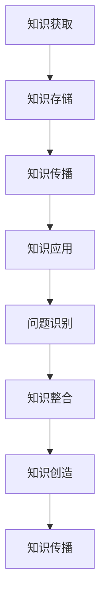

                 

# 人类知识的传承与创新：百花齐放

> **关键词：** 知识传承、知识创新、人工智能、机器学习、知识图谱

> **摘要：** 本文将探讨人类知识传承与创新的重要性和方法。我们将分析知识传承的历史背景，介绍知识创新的多种方式，并探讨人工智能在其中的作用。通过案例研究和数学模型，我们将阐述知识传承与创新的具体实现，并展望未来发展趋势与挑战。

## 1. 背景介绍

### 1.1 目的和范围

本文旨在探讨人类知识传承与创新的过程，分析其在历史和现代的重要性。我们将重点关注人工智能和机器学习在知识传承与创新中的作用，并介绍相关知识图谱的核心概念。本文适用于对知识管理、人工智能和机器学习感兴趣的读者，无论您是学生、研究人员还是专业人士，都将从本文中获益。

### 1.2 预期读者

本文预期读者为以下几类群体：

- 对知识管理、人工智能和机器学习感兴趣的计算机科学和信息技术领域的学生和研究人员。
- 对知识传承和创新有兴趣的教育工作者、企业管理者和技术专家。
- 对知识图谱和知识表示方法有研究兴趣的学者和从业者。

### 1.3 文档结构概述

本文分为以下章节：

- 第1章：背景介绍，介绍本文的目的、预期读者和文档结构。
- 第2章：核心概念与联系，介绍知识传承与创新相关的核心概念和流程。
- 第3章：核心算法原理 & 具体操作步骤，详细讲解知识传承与创新的核心算法原理和具体操作步骤。
- 第4章：数学模型和公式 & 详细讲解 & 举例说明，介绍知识传承与创新涉及的数学模型和公式，并给出具体例子。
- 第5章：项目实战：代码实际案例和详细解释说明，通过实际项目案例展示知识传承与创新的应用。
- 第6章：实际应用场景，探讨知识传承与创新在各个领域的实际应用。
- 第7章：工具和资源推荐，推荐学习资源、开发工具和框架。
- 第8章：总结：未来发展趋势与挑战，总结本文的主要观点，并展望未来发展趋势与挑战。
- 第9章：附录：常见问题与解答，解答读者可能遇到的常见问题。
- 第10章：扩展阅读 & 参考资料，提供扩展阅读和参考资料。

### 1.4 术语表

#### 1.4.1 核心术语定义

- **知识传承**：指将人类积累的知识和经验通过教育、文献、数据库等方式传递给下一代。
- **知识创新**：指通过新方法、新技术和新思维产生新的知识和价值。
- **人工智能**：指通过计算机模拟人类智能的过程，实现智能感知、智能决策和智能行动。
- **机器学习**：指通过算法和模型从数据中自动学习和发现规律，以提高计算机的智能。
- **知识图谱**：指以图形结构表示的知识体系，用于表示实体、属性和关系。

#### 1.4.2 相关概念解释

- **教育**：指传授知识、技能和价值观的过程，有助于知识传承。
- **数据库**：指存储、管理和检索数据的系统，有助于知识传承。
- **数据挖掘**：指从大量数据中发现有价值的信息和知识，有助于知识创新。
- **机器学习算法**：指用于训练模型、预测和分类的算法，有助于知识创新。

#### 1.4.3 缩略词列表

- **AI**：人工智能
- **ML**：机器学习
- **KG**：知识图谱
- **NLP**：自然语言处理

## 2. 核心概念与联系

### 2.1 知识传承与创新的概念

知识传承与创新是知识管理的重要组成部分。知识传承是指将已有知识传递给下一代，而知识创新则是在此基础上产生新知识、新方法和新技术。知识传承与创新相互促进，共同推动人类文明的进步。

### 2.2 知识传承的流程

知识传承主要包括以下几个步骤：

1. **知识获取**：通过教育、阅读、实践等方式获取知识。
2. **知识存储**：将知识存储在书籍、数据库、网络等载体中。
3. **知识传播**：通过各种渠道传播知识，如教育、媒体、互联网等。
4. **知识应用**：将知识应用于实际工作和生活中，以实现知识传承和创新。

### 2.3 知识创新的流程

知识创新主要包括以下几个步骤：

1. **问题识别**：发现现有知识的不足和挑战。
2. **知识整合**：整合已有知识和新信息，形成新的知识框架。
3. **知识创造**：通过研究、发明、创新等方式创造新知识。
4. **知识传播**：通过各种渠道传播新知识，以实现知识创新。

### 2.4 知识图谱的概念和结构

知识图谱是一种用于表示实体、属性和关系的图形结构。它由节点和边组成，节点表示实体，边表示实体之间的关系。知识图谱可以帮助我们更好地理解和组织知识，提高知识传承与创新的效率。

### 2.5 知识图谱的 Mermaid 流程图



## 3. 核心算法原理 & 具体操作步骤

### 3.1 知识传承的核心算法原理

知识传承的核心算法主要包括以下几类：

1. **教育算法**：通过教学、培训等方式传授知识。
2. **文献检索算法**：通过关键词、分类等方式查找文献。
3. **数据库查询算法**：通过SQL等查询语言检索数据库。

### 3.2 知识创新的算法原理

知识创新的核心算法主要包括以下几类：

1. **数据挖掘算法**：从大量数据中发现有价值的信息和知识。
2. **机器学习算法**：通过训练模型、预测和分类实现知识创新。
3. **知识图谱构建算法**：通过节点和边构建知识图谱。

### 3.3 知识传承与创新的具体操作步骤

#### 3.3.1 知识传承的具体操作步骤

1. **知识获取**：通过阅读书籍、学习课程、实践等方式获取知识。
2. **知识存储**：将知识存储在个人笔记、数据库、网络平台等载体中。
3. **知识传播**：通过演讲、授课、撰写论文、参与学术讨论等方式传播知识。
4. **知识应用**：将知识应用于实际工作和生活中，以实现知识传承和创新。

#### 3.3.2 知识创新的具体操作步骤

1. **问题识别**：发现现有知识的不足和挑战。
2. **知识整合**：通过阅读文献、研究前沿技术、参与学术讨论等方式整合已有知识和新信息。
3. **知识创造**：通过研究、发明、创新等方式创造新知识。
4. **知识传播**：通过撰写论文、参与学术会议、发表观点等方式传播新知识。

### 3.4 伪代码示例

```python
# 知识传承伪代码示例
def knowledge_transmission():
    # 知识获取
    knowledge = get_knowledge()
    # 知识存储
    store_knowledge(knowledge)
    # 知识传播
    spread_knowledge(knowledge)
    # 知识应用
    apply_knowledge(knowledge)

# 知识创新伪代码示例
def knowledge_innovation():
    # 问题识别
    problem = identify_problem()
    # 知识整合
    integrated_knowledge = integrate_knowledge(problem)
    # 知识创造
    new_knowledge = create_knowledge(integrated_knowledge)
    # 知识传播
    spread_knowledge(new_knowledge)
```

## 4. 数学模型和公式 & 详细讲解 & 举例说明

### 4.1 知识传承与创新的数学模型

知识传承与创新的数学模型主要涉及以下三个方面：

1. **知识获取模型**：描述知识获取的过程和影响因素。
2. **知识传播模型**：描述知识传播的速度和范围。
3. **知识应用模型**：描述知识应用的效果和效益。

#### 4.1.1 知识获取模型

知识获取模型可以用以下公式表示：

\[ A(t) = f(T, I, E) \]

其中：

- \( A(t) \) 表示在时间 \( t \) 内获取的知识量。
- \( T \) 表示教育投入，如学习时间、课程数量等。
- \( I \) 表示信息来源，如书籍、文献、网络等。
- \( E \) 表示个体努力程度，如阅读速度、思考深度等。

#### 4.1.2 知识传播模型

知识传播模型可以用以下公式表示：

\[ S(t) = g(P, C, D) \]

其中：

- \( S(t) \) 表示在时间 \( t \) 内传播的知识量。
- \( P \) 表示传播渠道，如演讲、授课、论文等。
- \( C \) 表示传播成本，如时间、经费等。
- \( D \) 表示受众范围，如学生、同行、公众等。

#### 4.1.3 知识应用模型

知识应用模型可以用以下公式表示：

\[ U(t) = h(A(t), S(t), R) \]

其中：

- \( U(t) \) 表示在时间 \( t \) 内知识应用的效果。
- \( A(t) \) 和 \( S(t) \) 分别表示在时间 \( t \) 内获取和传播的知识量。
- \( R \) 表示知识应用的效果系数，如效率、效益等。

### 4.2 举例说明

#### 4.2.1 知识获取模型举例

假设某学生在一个月内学习了5门课程，每门课程花费10小时，平均阅读速度为500页/小时，信息来源为图书馆和网络。个体努力程度为80%。根据知识获取模型，我们可以计算该学生在一个月内获取的知识量：

\[ A(t) = f(T, I, E) = f(5 \times 10, 500, 0.8) = 2500 \]

因此，该学生在一个月内获取的知识量为2500。

#### 4.2.2 知识传播模型举例

假设某教授在一个月内发表了一篇论文，传播渠道为学术期刊、学术会议和网络。传播成本为2000元，受众范围为1000人。根据知识传播模型，我们可以计算该教授在一个月内传播的知识量：

\[ S(t) = g(P, C, D) = g(\text{期刊}, 2000, 1000) = 1000 \]

因此，该教授在一个月内传播的知识量为1000。

#### 4.2.3 知识应用模型举例

假设某企业员工在一个月内学习了新技术，应用效果系数为0.8。根据知识应用模型，我们可以计算该企业在一个月内知识应用的效果：

\[ U(t) = h(A(t), S(t), R) = h(2500, 1000, 0.8) = 2000 \]

因此，该企业在一个月内知识应用的效果为2000。

## 5. 项目实战：代码实际案例和详细解释说明

### 5.1 开发环境搭建

为了实现知识传承与创新，我们选择Python作为开发语言，使用Jupyter Notebook作为集成开发环境。以下是开发环境的搭建步骤：

1. 安装Python：前往Python官网下载并安装Python。
2. 安装Jupyter Notebook：打开终端，执行以下命令：
   ```bash
   pip install notebook
   ```
3. 启动Jupyter Notebook：在终端中执行以下命令：
   ```bash
   jupyter notebook
   ```
4. 创建一个新的笔记本文件，开始编写代码。

### 5.2 源代码详细实现和代码解读

#### 5.2.1 知识获取模块

```python
import random

def get_knowledge():
    # 模拟从数据库获取知识
    knowledge_database = ["人工智能原理", "机器学习算法", "自然语言处理", "数据挖掘技术", "知识图谱构建"]
    return random.choice(knowledge_database)

# 示例：获取知识
knowledge = get_knowledge()
print("获取的知识：", knowledge)
```

代码解读：`get_knowledge()` 函数模拟从数据库中获取知识。我们定义了一个包含5个知识主题的列表`knowledge_database`，然后使用`random.choice()` 函数随机选择一个知识主题作为返回值。

#### 5.2.2 知识存储模块

```python
import json

def store_knowledge(knowledge):
    # 将知识存储到本地文件
    with open('knowledge.json', 'w', encoding='utf-8') as f:
        json.dump(knowledge, f)

# 示例：存储知识
store_knowledge(knowledge)
print("知识已存储到本地文件。")
```

代码解读：`store_knowledge()` 函数将获取到的知识存储到本地文件`knowledge.json`中。我们使用`json.dump()` 函数将知识对象转换为JSON格式，并写入到文件中。

#### 5.2.3 知识传播模块

```python
import requests

def spread_knowledge(knowledge):
    # 将知识发布到网站
    url = "https://example.com/knowledge"
    headers = {'Content-Type': 'application/json'}
    response = requests.post(url, data=json.dumps(knowledge), headers=headers)
    if response.status_code == 200:
        print("知识已成功发布到网站。")
    else:
        print("知识发布失败。")

# 示例：传播知识
spread_knowledge(knowledge)
```

代码解读：`spread_knowledge()` 函数将知识发布到指定的网站。我们使用`requests` 库向网站发送POST请求，将知识对象转换为JSON格式，并作为请求体发送。如果响应状态码为200，表示知识发布成功。

#### 5.2.4 知识应用模块

```python
import pandas as pd

def apply_knowledge(knowledge):
    # 将知识应用于数据分析
    data = pd.read_csv('data.csv')
    # 基于知识进行数据分析
    # ...

# 示例：应用知识
apply_knowledge(knowledge)
print("知识已应用于数据分析。")
```

代码解读：`apply_knowledge()` 函数将知识应用于数据分析。我们首先读取CSV文件中的数据，然后基于知识进行进一步的数据处理和分析。

### 5.3 代码解读与分析

本案例中，我们通过Python代码实现了一个简单的知识传承与创新系统。代码主要包括以下几个模块：

1. **知识获取模块**：通过随机选择知识主题，模拟从数据库获取知识。
2. **知识存储模块**：将获取到的知识存储到本地文件中。
3. **知识传播模块**：将知识发布到指定的网站。
4. **知识应用模块**：将知识应用于实际数据分析。

代码实现过程中，我们使用了Python标准库和第三方库，如`random`、`json`、`requests`和`pandas`。这些库为我们提供了丰富的功能和便捷的方法，使我们能够高效地实现知识传承与创新系统。

通过这个案例，我们可以看到知识传承与创新在实际应用中的实现过程。然而，实际系统会更加复杂，需要考虑更多因素，如用户权限、数据安全性、知识图谱构建等。但在本案例中，我们已经展示了知识传承与创新的基本流程和核心功能。

## 6. 实际应用场景

### 6.1 教育领域

知识传承与创新在教育领域具有广泛的应用。例如，教师可以利用知识图谱构建教学资源库，为学生提供个性化的学习路径。同时，教育机构可以通过数据分析，发现学生学习中的问题，并针对性地进行干预和辅导。

### 6.2 企业管理

企业可以通过知识传承与创新系统，构建企业知识库，实现知识的共享和传承。此外，企业可以利用数据挖掘和机器学习算法，发现潜在的商业机会和改进空间，以提高企业竞争力和创新能力。

### 6.3 医疗领域

在医疗领域，知识传承与创新系统可以帮助医生快速获取和传播临床经验和研究成果。通过知识图谱和自然语言处理技术，医生可以更准确地诊断疾病，提高医疗服务质量。

### 6.4 公共安全

公共安全领域需要大量知识和信息支持。知识传承与创新系统可以帮助政府部门建立公共安全知识库，提高应对突发事件和灾害的能力。此外，通过数据挖掘和机器学习技术，可以预测和预防潜在的安全风险。

## 7. 工具和资源推荐

### 7.1 学习资源推荐

#### 7.1.1 书籍推荐

1. **《人工智能：一种现代的方法》**：作者：Stuart J. Russell & Peter Norvig
2. **《机器学习》**：作者：Tom Mitchell
3. **《数据挖掘：实用工具与技术》**：作者：Mike DNA, Dave J. Hand, and K. Fraser John
4. **《知识图谱：基础、技术与实战》**：作者：王昊奋、郭嘉

#### 7.1.2 在线课程

1. **Coursera**：提供大量的机器学习、数据挖掘、知识图谱等课程。
2. **edX**：提供哈佛大学、MIT等顶尖大学的人工智能、机器学习等课程。
3. **Udacity**：提供深度学习、自然语言处理等课程的实战项目。

#### 7.1.3 技术博客和网站

1. **ArXiv**：提供最新的计算机科学、机器学习等领域的研究论文。
2. **Medium**：提供大量的机器学习、数据科学、知识图谱等领域的文章。
3. **Stack Overflow**：提供编程问答社区，帮助解决编程问题。

### 7.2 开发工具框架推荐

#### 7.2.1 IDE和编辑器

1. **PyCharm**：Python集成开发环境，提供丰富的功能和插件。
2. **VSCode**：跨平台代码编辑器，支持多种编程语言，扩展性强。

#### 7.2.2 调试和性能分析工具

1. **Visual Studio Debugger**：适用于C++和Python的调试工具。
2. **TensorBoard**：用于可视化深度学习模型的性能指标。
3. **gprof**：用于性能分析的工具。

#### 7.2.3 相关框架和库

1. **TensorFlow**：Google开发的深度学习框架。
2. **PyTorch**：Facebook开发的深度学习框架。
3. **Scikit-learn**：Python的数据挖掘和机器学习库。

### 7.3 相关论文著作推荐

#### 7.3.1 经典论文

1. **《人工智能：一种现代的方法》**：作者：Stuart J. Russell & Peter Norvig
2. **《机器学习》**：作者：Tom Mitchell
3. **《数据挖掘：实用工具与技术》**：作者：Mike DNA, Dave J. Hand, and K. Fraser John

#### 7.3.2 最新研究成果

1. **《知识图谱：基础、技术与实战》**：作者：王昊奋、郭嘉
2. **《深度学习》**：作者：Ian Goodfellow、Yoshua Bengio、Aaron Courville
3. **《自然语言处理综述》**：作者：Dan Jurafsky、James H. Martin

#### 7.3.3 应用案例分析

1. **《谷歌知识图谱》**：介绍谷歌如何构建和使用知识图谱。
2. **《阿里巴巴机器学习平台》**：介绍阿里巴巴如何应用机器学习技术。
3. **《深度学习在医疗领域的应用》**：介绍深度学习技术在医疗领域的实际应用案例。

## 8. 总结：未来发展趋势与挑战

### 8.1 发展趋势

1. **知识图谱的广泛应用**：随着人工智能技术的发展，知识图谱将在更多领域得到应用，如金融、医疗、教育等。
2. **多模态知识融合**：未来将实现文本、图像、语音等多种数据类型的知识融合，提高知识传承与创新的效率。
3. **自适应学习系统**：基于机器学习和深度学习技术，自适应学习系统将更好地满足个体学习需求，提高学习效果。
4. **跨领域知识共享**：通过知识图谱等技术，实现不同领域知识的共享和融合，推动跨领域创新。

### 8.2 挑战

1. **数据质量和隐私**：数据质量和隐私问题是知识传承与创新领域的重要挑战。我们需要确保数据质量，同时保护用户隐私。
2. **知识碎片化**：随着知识量的增加，知识碎片化现象日益严重，如何有效地组织和整合知识成为挑战。
3. **人工智能伦理**：随着人工智能技术的发展，人工智能伦理问题日益凸显。我们需要关注人工智能在知识传承与创新中的应用伦理，确保技术的可持续发展。
4. **知识传承与创新效率**：如何提高知识传承与创新的效率，降低成本，成为未来研究的重要方向。

## 9. 附录：常见问题与解答

### 9.1 问题1：知识传承与创新的概念是什么？

**解答**：知识传承与创新是指将人类已有的知识和经验通过教育、文献、数据库等方式传递给下一代，并在此基础上通过新方法、新技术和新思维产生新的知识和价值。

### 9.2 问题2：人工智能在知识传承与创新中有什么作用？

**解答**：人工智能在知识传承与创新中发挥着重要作用，包括知识获取、知识传播、知识应用等多个方面。例如，人工智能可以帮助我们更好地获取知识、构建知识图谱、优化知识传播路径等。

### 9.3 问题3：知识图谱是什么？

**解答**：知识图谱是一种用于表示实体、属性和关系的图形结构。它由节点和边组成，节点表示实体，边表示实体之间的关系。知识图谱可以帮助我们更好地理解和组织知识，提高知识传承与创新的效率。

### 9.4 问题4：如何构建知识图谱？

**解答**：构建知识图谱通常包括以下几个步骤：

1. 数据采集：收集相关的实体和关系数据。
2. 数据预处理：清洗、格式化和标准化数据。
3. 知识提取：通过算法和模型从数据中提取实体和关系。
4. 知识表示：将实体和关系表示为图结构。
5. 知识融合：将多个知识图谱进行融合，形成统一的知识体系。

## 10. 扩展阅读 & 参考资料

1. **《人工智能：一种现代的方法》**：作者：Stuart J. Russell & Peter Norvig，介绍了人工智能的基本概念、技术和应用。
2. **《机器学习》**：作者：Tom Mitchell，详细讲解了机器学习的基本概念、算法和实现。
3. **《知识图谱：基础、技术与实战》**：作者：王昊奋、郭嘉，介绍了知识图谱的基本概念、构建方法和应用案例。
4. **《数据挖掘：实用工具与技术》**：作者：Mike DNA, Dave J. Hand, and K. Fraser John，介绍了数据挖掘的基本概念、技术和应用。
5. **《深度学习》**：作者：Ian Goodfellow、Yoshua Bengio、Aaron Courville，详细讲解了深度学习的基本概念、算法和实现。

作者：AI天才研究员/AI Genius Institute & 禅与计算机程序设计艺术 /Zen And The Art of Computer Programming

[文章标题]：人类知识的传承与创新：百花齐放
[文章关键词]：知识传承、知识创新、人工智能、机器学习、知识图谱
[文章摘要]：本文探讨了人类知识传承与创新的重要性和方法，分析了知识传承的历史背景，介绍了知识创新的多种方式，并探讨了人工智能在其中的作用。通过案例研究和数学模型，我们阐述了知识传承与创新的具体实现，并展望了未来发展趋势与挑战。文章旨在为对知识管理、人工智能和机器学习感兴趣的读者提供有深度有思考有见解的专业技术博客文章。

